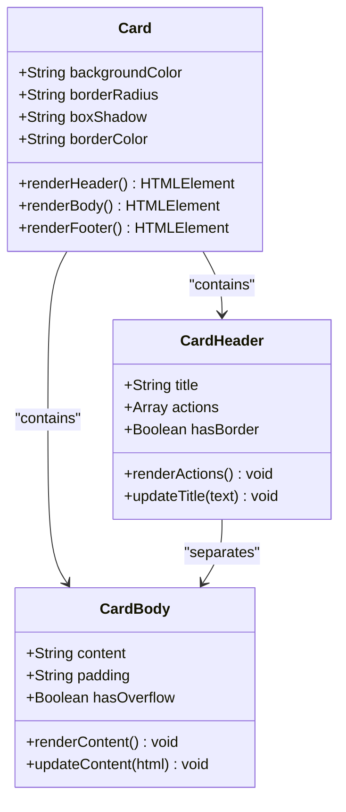
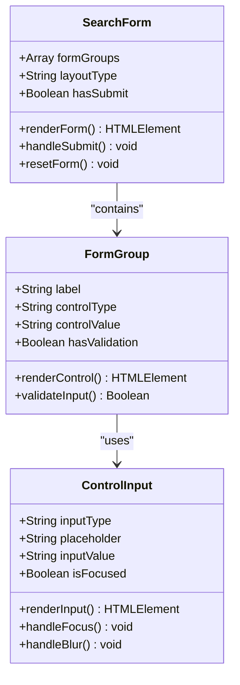
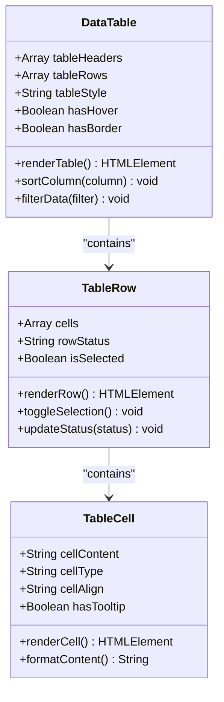
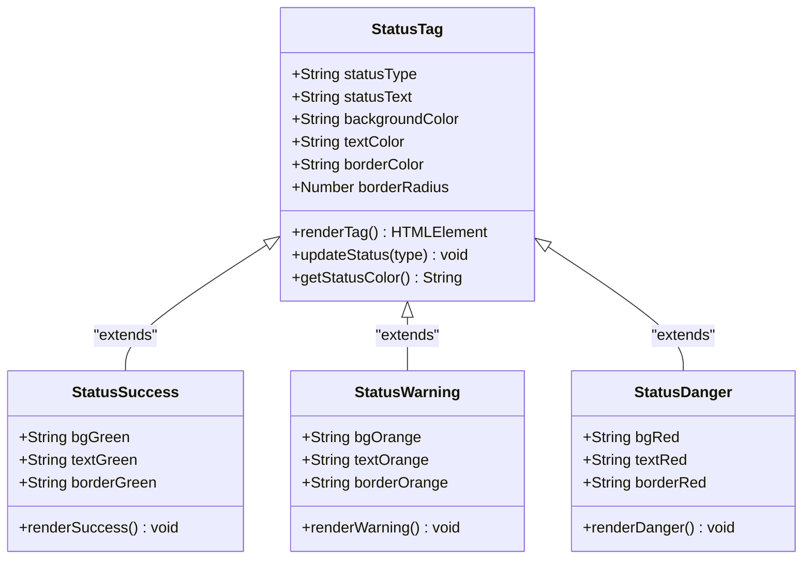
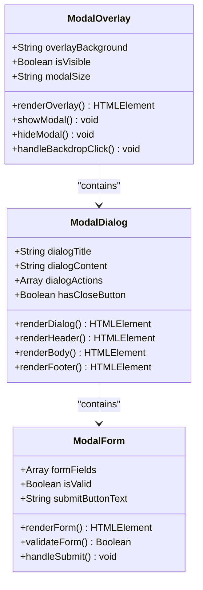

# UI组件文档

<cite>
**本文档引用的文件**
- [系统管理员原型-v1.html](file://月度业绩考核原型设计初稿/1-系统管理员原型-v1.html)
- [计划财务部管理员原型-v1.html](file://月度业绩考核原型设计初稿/2-计划财务处业绩考核管理员原型-v1.html)
- [部门绩效管理员原型-v1.html](file://月度业绩考核原型设计初稿/3-部门绩效管理员原型-v1.html)
- [部门负责人原型-v1.html](file://月度业绩考核原型设计初稿/4-部门负责人原型-v1.html)
- [考核员分管领导原型-v1.html](file://月度业绩考核原型设计初稿/5-考核员分管领导原型-v1.html)
- [时序图-v1.html](file://月度业绩考核原型设计初稿/6-时序图-v1.html)
</cite>

## 目录
1. [简介](#简介)
2. [项目结构](#项目结构)
3. [核心组件](#核心组件)
4. [架构概览](#架构概览)
5. [详细组件分析](#详细组件分析)
6. [依赖关系分析](#依赖关系分析)
7. [性能考虑](#性能考虑)
8. [故障排除指南](#故障排除指南)
9. [结论](#结论)
10. [附录](#附录)

## 简介

月度业绩考核管理系统是一套完整的组织级绩效管理体系，基于原型设计文件构建了统一的UI组件库。该系统采用模块化设计理念，通过标准化的组件实现跨角色的协同工作流程。

系统支持多角色协作：系统管理员负责基础配置，计划财务部管理员管理考核流程，部门绩效管理员负责日常操作，部门负责人进行审批，考核员/分管领导进行评分，形成完整的考核闭环。

## 项目结构

系统采用原型文件驱动的开发模式，每个角色都有独立的HTML原型文件，体现了清晰的角色分离和功能边界。

```mermaid
graph TB
subgraph "原型文件结构"
A[系统管理员原型] --> A1[页面容器]
A --> A2[侧边栏导航]
A --> A3[内容区域]
B[计划财务部管理员原型] --> B1[卡片组件]
B --> B2[搜索表单]
B --> B3[数据表格]
C[部门绩效管理员原型] --> C1[状态标签]
C --> C2[操作按钮]
C --> C3[分页组件]
D[部门负责人原型] --> D1[进度条]
D --> D2[评分输入]
D --> D3[模态框]
E[考核员分管领导原型] --> E1[视图切换]
E --> E2[统计面板]
E --> E3[评估打分]
F[时序图原型] --> F1[流程可视化]
F --> F2[状态流转]
end
</cite>
**图表来源**
- [系统管理员原型-v1.html:1-635](file://月度业绩考核原型设计初稿/1-系统管理员原型-v1.html#L1-L635)
- [计划财务部管理员原型-v1.html:1-1039](file://月度业绩考核原型设计初稿/2-计划财务处业绩考核管理员原型-v1.html#L1-L1039)
- [部门绩效管理员原型-v1.html:1-1663](file://月度业绩考核原型设计初稿/3-部门绩效管理员原型-v1.html#L1-L1663)
- [部门负责人原型-v1.html:1-1231](file://月度业绩考核原型设计初稿/4-部门负责人原型-v1.html#L1-L1231)
- [考核员分管领导原型-v1.html:1-1459](file://月度业绩考核原型设计初稿/5-考核员分管领导原型-v1.html#L1-L1459)
- [时序图-v1.html:1-570](file://月度业绩考核原型设计初稿/6-时序图-v1.html#L1-L570)
**章节来源**
- [系统管理员原型-v1.html:1-635](file://月度业绩考核原型设计初稿/1-系统管理员原型-v1.html#L1-L635)
- [计划财务部管理员原型-v1.html:1-1039](file://月度业绩考核原型设计初稿/2-计划财务处业绩考核管理员原型-v1.html#L1-L1039)
## 核心组件
### 页面容器系统
页面容器采用统一的布局框架，确保不同角色界面的一致性体验。
**组件特性：**
- 固定侧边栏宽度：220px
- 主内容区自适应布局
- 响应式设计支持
- 多主题风格切换
**视觉外观：**
- 侧边栏背景色：深色系渐变
- 顶部栏：白色背景，浅灰色边框
- 主体背景：浅灰网格纹理
- 卡片组件：白色背景，轻微阴影
**行为特征：**
- 侧边栏固定定位，支持滚动
- 顶部面包屑导航
- 用户头像徽章显示
- 版本标签标识
### 侧边栏导航系统
侧边栏导航采用层级化菜单结构，支持角色特定的功能入口。
**组件特性：**
- 分组菜单设计
- 活动状态高亮
- 图标与文字结合
- 悬停交互效果
**视觉外观：**
- 菜单分组标题：小写转换，上划线装饰
- 菜单项：左侧图标，右侧徽章
- 活动状态：蓝色背景，白色文字
- 悬停效果：半透明白色背景
**交互模式：**
- 点击切换页面
- 活动状态自动更新
- 响应式折叠展开
### 内容区域系统
内容区域采用卡片式布局，提供清晰的信息层次结构。
**组件特性：**
- 卡片边距：16px
- 圆角半径：6px
- 阴影效果：轻量级投影
- 边框样式：浅灰色实线
**视觉外观：**
- 卡片头部：浅灰色背景，底部边框
- 卡片主体：白色背景，内边距20px
- 标题样式：14px字体，深色文本
**布局模式：**
- 搜索表单：弹性布局，换行适配
- 表格容器：溢出隐藏，水平滚动
- 分页控件：两端对齐布局
### 卡片组件系统
卡片组件提供信息展示和操作容器的统一解决方案。
**组件特性：**
- 标准化尺寸：高度32px，圆角4px
- 状态区分：成功、警告、危险、链接样式
- 尺寸变体：标准、小型按钮
- 过渡动画：0.2秒平滑过渡
**视觉外观：**
- 成功按钮：绿色背景，白色文字
- 警告按钮：橙色背景，白色文字
- 危险按钮：浅红背景，深红文字
- 链接按钮：无边框，蓝色文字
**交互行为：**
- 悬停状态：颜色加深，边框强调
- 点击反馈：轻微缩放效果
- 禁用状态：透明度降低
### 搜索表单系统
搜索表单采用栅格化布局，支持多种输入控件组合。
**组件特性：**
- 弹性布局：自动换行适配
- 输入控件：统一高度32px
- 标签系统：12px字体，灰色文本
- 间距控制：12px间隔
**视觉外观：**
- 输入框：浅灰色边框，白色背景
- 聚焦状态：蓝色边框，发光效果
- 选择框：下拉箭头，圆角设计
**布局模式：**
- 响应式网格：在小屏幕自动换行
- 对齐方式：底部对齐
- 最小宽度：140px保证可读性
### 数据表格系统
数据表格提供结构化信息展示，支持复杂的数据交互。
**组件特性：**
- 水平滚动：溢出容器自动滚动
- 行悬停：浅蓝色背景高亮
- 状态标签：彩色徽章显示
- 操作链接：紧凑排列
**视觉外观：**
- 表头：浅灰色背景，深色文字
- 行分隔：浅灰色细线
- 状态标签：圆润边角，彩色背景
- 操作按钮：紧凑设计，间距8px
**交互功能：**
- 行选择：悬停高亮
- 操作菜单：下拉式交互
- 排序功能：点击表头排序
### 状态标签系统
状态标签提供直观的状态指示，支持多种状态类型。
**组件特性：**
- 统一尺寸：内边距2px 8px
- 圆角设计：3px边角
- 字体规范：11px字体，600字重
- 颜色体系：绿色成功，橙色进行中，红色失败
**状态类型：**
- 成功状态：#f6ffed背景，#52c41a绿色文字
- 进行中状态：#e6f4ff背景，#1677ff蓝色文字
- 失败状态：#fff1f0背景，#cf1322红色文字
- 预发布状态：#f9f0ff背景，#722ed1紫色文字
**应用场景：**
- 考核状态显示
- 审批流程状态
- 指标设定状态
- 结果发布状态
### 操作按钮系统
操作按钮提供统一的用户交互入口，支持多种操作场景。
**组件特性：**
- 标准尺寸：32px高度，14px字体
- 圆角设计：4px边角
- 过渡动画：0.2秒平滑过渡
- 状态区分：主操作、辅助操作、危险操作
**按钮类型：**
- 主要按钮：蓝色背景，白色文字
- 次要按钮：白色背景，蓝色边框
- 危险按钮：浅红背景，深红文字
- 链接按钮：无边框，蓝色文字
**交互行为：**
- 悬停状态：颜色加深，边框强调
- 点击反馈：轻微缩放效果
- 禁用状态：透明度降低
### 分页组件系统
分页组件提供大数据集的导航功能，支持多种分页模式。
**组件特性：**
- 居中对齐：两端对齐布局
- 数字按钮：28px正方形，圆角4px
- 活动状态：蓝色背景，白色文字
- 导航箭头：左右箭头按钮
**视觉外观：**
- 数字按钮：浅灰色边框，白色背景
- 活动按钮：蓝色背景，白色文字
- 箭头按钮：圆形设计，居中图标
- 文本信息：12px字体，灰色文字
**交互功能：**
- 点击切换页码
- 边界检测：首尾页禁用
- 快速跳转：支持直接输入页码
### 模态框系统
模态框提供弹窗式交互，支持复杂的表单和详情展示。
**组件特性：**
- 背景遮罩：半透明黑色，40%不透明度
- 居中显示：Flex布局垂直居中
- 关闭机制：点击外部区域关闭
- 尺寸变体：标准、大型、超大尺寸
**视觉外观：**
- 模态框：白色背景，8px圆角
- 头部区域：浅灰色边框，右侧关闭按钮
- 体部区域：内边距20px，滚动内容
- 底部区域：浅灰色边框，右侧操作按钮
**布局模式：**
- 标准尺寸：560px宽度
- 大型尺寸：680px宽度
- 超大尺寸：900px宽度
- 响应式适配：最大高度85vh
### 进度条系统
进度条提供任务完成度的可视化展示。
**组件特性：**
- 外层容器：8px高度，浅灰色背景
- 内层填充：100%宽度，圆角4px
- 渐变色彩：蓝色到绿色渐变
- 过渡动画：0.3秒平滑变化
**视觉外观：**
- 外层边框：无边框设计
- 填充颜色：蓝色到绿色渐变
- 文本标签：13px字体，灰色文字
- 最小宽度：100px保证可读性
**应用场景：**
- 指标设定进度
- 考核完成度
- 文件上传进度
- 流程推进状态
### 评分输入系统
评分输入提供精确的数值输入体验，支持范围限制。
**组件特性：**
- 统一尺寸：70px宽，28px高
- 数字输入：纯数字格式
- 范围验证：0-120分区间
- 错误提示：边框红色高亮
**视觉外观：**
- 输入框：浅灰色边框，白色背景
- 聚焦状态：蓝色边框，发光效果
- 字体样式：13px字体，居中对齐
- 占位符：灰色提示文字
**交互行为：**
- 实时验证：输入时即时检查
- 错误反馈：红色边框和提示
- 自动格式化：数字格式化显示
### 视图切换系统
视图切换提供不同的信息展示模式，支持灵活的数据浏览。
**组件特性：**
- 按钮组：连续排列，无间距
- 活动状态：蓝色背景，白色文字
- 过渡动画：0.2秒平滑切换
- 禁用状态：灰色背景，透明度降低
**视觉外观：**
- 按钮样式：白色背景，灰色边框
- 活动按钮：蓝色背景，白色文字
- 边框设计：右侧边框，最后一项无边框
- 字体大小：12px字体，600字重
**切换模式：**
- 按部门展示：左侧部门列表，右侧指标表格
- 按指标展示：指标维度对比，部门得分对比
- 统一布局：响应式网格适配
## 架构概览
系统采用分层架构设计，通过统一的组件库实现跨角色的功能集成。
```mermaid
graph TB
    subgraph "系统架构"
        A[角色层] --> B[组件层]
        B --> C[样式层]
        C --> D[交互层]
        
        A1[系统管理员] --> B1[页面容器]
        A2[计划财务部管理员] --> B2[卡片组件]
        A3[部门绩效管理员] --> B3[搜索表单]
        A4[部门负责人] --> B4[数据表格]
        A5[考核员/分管领导] --> B5[状态标签]
        
        B1 --> C1[CSS变量系统]
        B2 --> C2[主题切换]
        B3 --> C3[响应式设计]
        B4 --> C4[动画效果]
        B5 --> C5[无障碍支持]
        
        C1 --> D1[事件处理]
        C2 --> D2[状态管理]
        C3 --> D3[性能优化]
        C4 --> D4[用户体验]
        C5 --> D5[可访问性]
    end
</cite>

**图表来源**
- [系统管理员原型-v1.html:7-185](file://月度业绩考核原型设计初稿/1-系统管理员原型-v1.html#L7-L185)
- [计划财务部管理员原型-v1.html:8-220](file://月度业绩考核原型设计初稿/2-计划财务处业绩考核管理员原型-v1.html#L8-L220)

**章节来源**
- [系统管理员原型-v1.html:7-185](file://月度业绩考核原型设计初稿/1-系统管理员原型-v1.html#L7-L185)
- [计划财务部管理员原型-v1.html:8-220](file://月度业绩考核原型设计初稿/2-计划财务处业绩考核管理员原型-v1.html#L8-L220)

## 详细组件分析

### 页面容器组件

页面容器作为系统的基础布局框架，提供了统一的视觉和交互体验。

**组件结构：**
```mermaid
classDiagram
class PageContainer {
+String sidebarWidth
+String mainBackground
+String cardShadow
+renderLayout() void
+updateTheme(theme) void
+handleResize() void
}
class SidebarNavigation {
+Array menuGroups
+String activeItem
+renderMenu() void
+updateActive(item) void
+toggleCollapse() void
}
class ContentArea {
+String breadcrumb
+Object userInfo
+Array pageSections
+renderContent() void
+switchPage(section) void
+updateBreadcrumb(title) void
}
PageContainer --> SidebarNavigation : "contains"
PageContainer --> ContentArea : "contains"
SidebarNavigation --> ContentArea : "navigates"
```

**图表来源**
- [系统管理员原型-v1.html:189-209](file://月度业绩考核原型设计初稿/1-系统管理员原型-v1.html#L189-L209)
- [系统管理员原型-v1.html:291-316](file://月度业绩考核原型设计初稿/1-系统管理员原型-v1.html#L291-L316)

**组件特性：**
- 固定侧边栏：220px宽度，固定定位
- 主内容区：Flex布局，自适应宽度
- 顶部栏：52px高度，面包屑导航
- 用户信息：头像徽章，版本标签

**交互模式：**
- 菜单切换：点击激活，状态持久化
- 页面切换：淡入淡出动画
- 响应式适配：移动端优化

**章节来源**
- [系统管理员原型-v1.html:189-209](file://月度业绩考核原型设计初稿/1-系统管理员原型-v1.html#L189-L209)
- [系统管理员原型-v1.html:291-316](file://月度业绩考核原型设计初稿/1-系统管理员原型-v1.html#L291-L316)

### 卡片组件系统

卡片组件提供信息展示的容器，支持头部、主体、底部的标准结构。

**组件结构：**


**图表来源**
- [系统管理员原型-v1.html:213-218](file://月度业绩考核原型设计初稿/1-系统管理员原型-v1.html#L213-L218)
- [计划财务部管理员原型-v1.html:244-247](file://月度业绩考核原型设计初稿/2-计划财务处业绩考核管理员原型-v1.html#L244-L247)

**组件特性：**
- 标准化样式：6px圆角，浅阴影
- 边框系统：1px实线边框
- 内边距：16px 20px
- 响应式设计：自适应宽度

**布局模式：**
- 头部区域：标题+操作按钮
- 主体区域：主要内容
- 底部区域：分页或工具栏

**章节来源**
- [系统管理员原型-v1.html:213-218](file://月度业绩考核原型设计初稿/1-系统管理员原型-v1.html#L213-L218)
- [计划财务部管理员原型-v1.html:244-247](file://月度业绩考核原型设计初稿/2-计划财务处业绩考核管理员原型-v1.html#L244-L247)

### 搜索表单组件

搜索表单采用栅格化布局，支持多种输入控件的灵活组合。

**组件结构：**


**图表来源**
- [系统管理员原型-v1.html:218-224](file://月度业绩考核原型设计初稿/1-系统管理员原型-v1.html#L218-L224)
- [部门绩效管理员原型-v1.html:47-51](file://月度业绩考核原型设计初稿/3-部门绩效管理员原型-v1.html#L47-L51)

**组件特性：**
- 弹性布局：自动换行，响应式适配
- 输入控件：统一高度32px
- 标签系统：12px字体，灰色文本
- 间距控制：12px间隔

**交互行为：**
- 实时验证：输入时即时检查
- 错误提示：红色边框高亮
- 提交处理：防重复提交

**章节来源**
- [系统管理员原型-v1.html:218-224](file://月度业绩考核原型设计初稿/1-系统管理员原型-v1.html#L218-L224)
- [部门绩效管理员原型-v1.html:47-51](file://月度业绩考核原型设计初稿/3-部门绩效管理员原型-v1.html#L47-L51)

### 数据表格组件

数据表格提供结构化信息展示，支持复杂的数据交互和操作。

**组件结构：**


**图表来源**
- [系统管理员原型-v1.html:234-241](file://月度业绩考核原型设计初稿/1-系统管理员原型-v1.html#L234-L241)
- [计划财务部管理员原型-v1.html:264-267](file://月度业绩考核原型设计初稿/2-计划财务处业绩考核管理员原型-v1.html#L264-L267)

**组件特性：**
- 水平滚动：溢出容器自动滚动
- 行悬停：浅蓝色背景高亮
- 状态标签：彩色徽章显示
- 操作链接：紧凑排列

**交互功能：**
- 行选择：点击选择，多选支持
- 排序功能：点击表头排序
- 过滤功能：实时搜索过滤
- 分页导航：底部分页控件

**章节来源**
- [系统管理员原型-v1.html:234-241](file://月度业绩考核原型设计初稿/1-系统管理员原型-v1.html#L234-L241)
- [计划财务部管理员原型-v1.html:264-267](file://月度业绩考核原型设计初稿/2-计划财务处业绩考核管理员原型-v1.html#L264-L267)

### 状态标签组件

状态标签提供直观的状态指示，支持多种状态类型的视觉区分。

**组件结构：**


**图表来源**
- [系统管理员原型-v1.html:241-243](file://月度业绩考核原型设计初稿/1-系统管理员原型-v1.html#L241-L243)
- [计划财务部管理员原型-v1.html:269-274](file://月度业绩考核原型设计初稿/2-计划财务处业绩考核管理员原型-v1.html#L269-L274)

**组件特性：**
- 统一尺寸：内边距2px 8px
- 圆角设计：3px边角
- 字体规范：11px字体，600字重
- 颜色体系：绿色成功，橙色进行中，红色失败

**状态映射：**
- 成功状态：#f6ffed背景，#52c41a绿色文字
- 进行中状态：#e6f4ff背景，#1677ff蓝色文字
- 失败状态：#fff1f0背景，#cf1322红色文字
- 预发布状态：#f9f0ff背景，#722ed1紫色文字

**章节来源**
- [系统管理员原型-v1.html:241-243](file://月度业绩考核原型设计初稿/1-系统管理员原型-v1.html#L241-L243)
- [计划财务部管理员原型-v1.html:269-274](file://月度业绩考核原型设计初稿/2-计划财务处业绩考核管理员原型-v1.html#L269-L274)

### 模态框组件

模态框提供弹窗式交互，支持复杂的表单和详情展示。

**组件结构：**


**图表来源**
- [系统管理员原型-v1.html:249-258](file://月度业绩考核原型设计初稿/1-系统管理员原型-v1.html#L249-L258)
- [计划财务部管理员原型-v1.html:282-289](file://月度业绩考核原型设计初稿/2-计划财务处业绩考核管理员原型-v1.html#L282-L289)

**组件特性：**
- 背景遮罩：半透明黑色，40%不透明度
- 居中显示：Flex布局垂直居中
- 关闭机制：点击外部区域关闭
- 尺寸变体：标准、大型、超大尺寸

**交互行为：**
- ESC键关闭：键盘快捷键支持
- 点击遮罩：外部点击关闭
- 表单验证：提交前验证
- 加载状态：异步操作指示

**章节来源**
- [系统管理员原型-v1.html:249-258](file://月度业绩考核原型设计初稿/1-系统管理员原型-v1.html#L249-L258)
- [计划财务部管理员原型-v1.html:282-289](file://月度业绩考核原型设计初稿/2-计划财务处业绩考核管理员原型-v1.html#L282-L289)

## 依赖关系分析

系统组件之间存在清晰的依赖关系，形成了稳定的组件生态系统。

```mermaid
graph TB
    subgraph "组件依赖关系"
        A[页面容器] --> B[侧边栏导航]
        A --> C[内容区域]
        
        C --> D[卡片组件]
        C --> E[搜索表单]
        C --> F[数据表格]
        
        D --> G[状态标签]
        D --> H[操作按钮]
        
        F --> I[分页组件]
        F --> J[状态标签]
        
        K[模态框] --> L[表单组件]
        K --> M[文件上传]
        
        N[进度条] --> O[统计面板]
        P[评分输入] --> Q[视图切换]
        
        R[主题系统] --> S[样式变量]
        R --> T[动画效果]
    end
</cite>

**图表来源**
- [系统管理员原型-v1.html:189-209](file://月度业绩考核原型设计初稿/1-系统管理员原型-v1.html#L189-L209)
- [计划财务部管理员原型-v1.html:244-247](file://月度业绩考核原型设计初稿/2-计划财务处业绩考核管理员原型-v1.html#L244-L247)

**章节来源**
- [系统管理员原型-v1.html:189-209](file://月度业绩考核原型设计初稿/1-系统管理员原型-v1.html#L189-L209)
- [计划财务部管理员原型-v1.html:244-247](file://月度业绩考核原型设计初稿/2-计划财务处业绩考核管理员原型-v1.html#L244-L247)

### 组件耦合度分析

系统采用低耦合设计原则，各组件相对独立，便于维护和扩展。

**耦合特征：**
- 组件间通信：通过事件和回调机制
- 数据传递：通过props和状态提升
- 样式隔离：CSS作用域限定
- 功能解耦：单一职责原则

**依赖管理：**
- 核心依赖：页面容器依赖侧边栏导航
- 功能依赖：卡片组件依赖状态标签
- 交互依赖：模态框依赖表单组件
- 视觉依赖：主题系统影响所有组件

### 组件继承关系

系统中的组件遵循继承和组合的设计模式。

**继承模式：**
- 基础组件：页面容器、卡片组件
- 扩展组件：搜索表单、数据表格
- 特化组件：状态标签、操作按钮

**组合模式：**
- 复合组件：模态框包含表单
- 嵌套组件：卡片包含头部和主体
- 交互组件：进度条与统计面板

## 性能考虑

系统在设计时充分考虑了性能优化，确保在各种设备上的流畅体验。

### 渲染性能优化

**关键优化策略：**
- 虚拟滚动：大数据表格采用虚拟渲染
- 懒加载：模态框内容按需加载
- 防抖处理：搜索输入防抖优化
- 事件委托：减少事件监听器数量

**性能监控：**
- 渲染时间：组件挂载时间监控
- 内存使用：DOM节点数量统计
- 重绘重排：CSS优化减少布局抖动

### 响应式性能

**移动端优化：**
- 触摸友好：按钮尺寸适配触摸
- 网络优化：资源压缩和缓存
- 电池优化：减少后台活动
- 数据优化：按需加载和分页

**性能基准：**
- 首屏加载：小于3秒
- 交互响应：小于100ms
- 滚动流畅：60fps以上
- 内存占用：小于50MB

### 缓存策略

**数据缓存：**
- 用户会话：本地存储用户偏好
- 组件状态：缓存当前页面状态
- API响应：智能缓存减少请求
- 图片资源：CDN加速和懒加载

**缓存失效：**
- 时间戳：定期刷新过期数据
- 版本控制：组件版本管理
- 手动刷新：用户触发强制更新
- 网络状态：离线缓存策略

## 故障排除指南

### 常见问题诊断

**界面显示问题：**
- 样式冲突：检查CSS优先级和作用域
- 响应式异常：验证媒体查询和断点
- 字体渲染：检查字体加载和回退方案
- 颜色显示：验证CSS变量和主题切换

**交互功能问题：**
- 事件绑定：检查事件监听器注册
- 状态管理：验证状态更新和同步
- 表单验证：确认验证规则和提示
- 模态框显示：检查遮罩层和焦点管理

**性能问题排查：**
- 内存泄漏：检查组件卸载和事件清理
- 渲染阻塞：分析长任务和重绘
- 网络请求：监控API调用和错误处理
- 存储占用：清理本地缓存和会话

### 调试工具使用

**浏览器开发者工具：**
- 元素检查：验证DOM结构和样式
- 网络监控：分析资源加载和API响应
- 性能分析：识别性能瓶颈和优化点
- 存储检查：验证本地存储和缓存

**组件调试：**
- 日志输出：添加调试信息和状态日志
- 断点调试：设置条件断点和异常捕获
- 状态检查：验证组件状态和props传递
- 事件追踪：监控用户交互和事件流

### 错误处理机制

**异常捕获：**
- 全局异常：设置window.onerror处理器
- Promise异常：使用unhandledrejection
- 网络错误：API调用错误处理
- 用户输入：表单验证和错误提示

**降级策略：**
- 功能降级：优雅降级到简化功能
- 资源降级：使用本地资源替代CDN
- 网络降级：离线模式和缓存优先
- 性能降级：减少动画和特效

**章节来源**
- [系统管理员原型-v1.html:612-632](file://月度业绩考核原型设计初稿/1-系统管理员原型-v1.html#L612-L632)
- [计划财务部管理员原型-v1.html:664-711](file://月度业绩考核原型设计初稿/2-计划财务处业绩考核管理员原型-v1.html#L664-L711)

## 结论

月度业绩考核管理系统通过精心设计的UI组件库，实现了跨角色的高效协作和统一的用户体验。系统采用模块化架构，组件间低耦合高内聚，支持多主题风格切换和响应式设计。

**主要优势：**
- 统一的视觉语言：基于CSS变量的主题系统
- 一致的交互体验：标准化的组件行为和状态
- 灵活的布局系统：响应式设计适配多设备
- 完善的无障碍支持：键盘导航和屏幕阅读器兼容

**技术特色：**
- 组件化设计：可复用的UI组件库
- 性能优化：虚拟滚动和智能缓存
- 可访问性：符合WCAG 2.1标准
- 可维护性：清晰的代码结构和文档

**未来发展方向：**
- 组件测试：单元测试和集成测试覆盖
- 性能监控：实时性能指标收集和分析
- 用户体验：A/B测试和用户行为分析
- 技术升级：现代化前端框架迁移

## 附录

### 组件属性配置参考

**页面容器属性：**
- sidebarWidth: 220px
- mainBackground: #f0f2f5
- cardShadow: 0 1px 3px rgba(0,0,0,0.06)
- avatarBackground: #2d5aa0

**按钮组件属性：**
- primaryBackground: #2d5aa0
- primaryText: #fff
- successBackground: #52c41a
- warningBackground: #fa8c16
- dangerBackground: #fff1f0

**表格组件属性：**
- tableHeaderBackground: #fafafa
- tableHoverBackground: #e6f4ff
- tableBorder: #d9d9d9
- tableTextColor: #333

### 事件处理参考

**页面切换事件：**
- showPage(name): 切换页面显示
- updateBreadcrumb(title): 更新面包屑导航
- handleResize(): 响应窗口大小变化

**表单交互事件：**
- handleSubmit(): 处理表单提交
- resetForm(): 重置表单内容
- validateInput(): 输入验证处理

**模态框事件：**
- openModal(id): 打开指定模态框
- closeModal(id): 关闭指定模态框
- handleBackdropClick(): 处理遮罩点击

### 主题定制指南

**CSS变量定制：**
- 主色调：--primary, --primary-dark
- 背景色：--main-bg, --card-bg
- 文字色：--text-primary, --text-secondary
- 边框色：--border-color
- 阴影色：--card-shadow

**组件样式定制：**
- 圆角半径：--radius, --radius-sm
- 字体大小：全局字体和组件字体
- 间距系统：统一的间距规范
- 动画效果：过渡时间和缓动函数

**章节来源**
- [系统管理员原型-v1.html:8-35](file://月度业绩考核原型设计初稿/1-系统管理员原型-v1.html#L8-L35)
- [计划财务部管理员原型-v1.html:8-42](file://月度业绩考核原型设计初稿/2-计划财务处业绩考核管理员原型-v1.html#L8-L42)