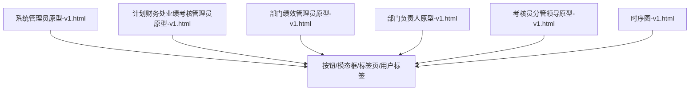
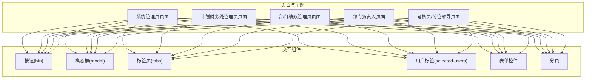
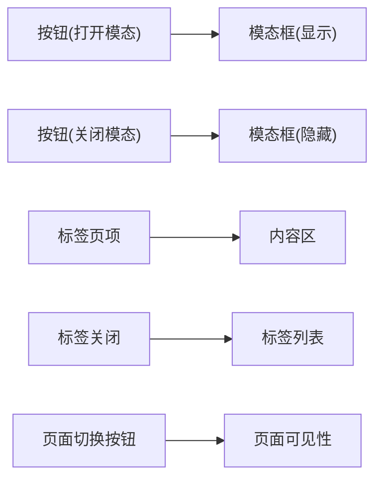
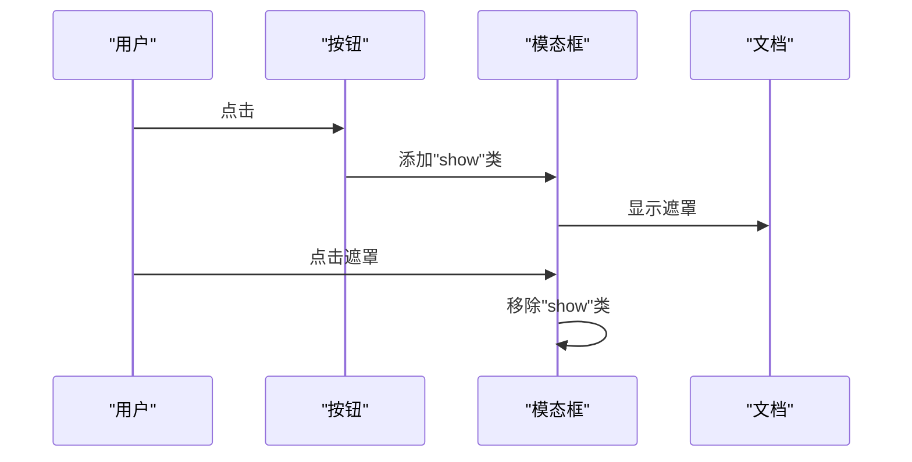

# 交互组件

<cite>
**本文引用的文件**
- [系统管理员原型-v1.html](file://月度业绩考核原型设计初稿/1-系统管理员原型-v1.html)
- [计划财务处业绩考核管理员原型-v1.html](file://月度业绩考核原型设计初稿/2-计划财务处业绩考核管理员原型-v1.html)
- [部门绩效管理员原型-v1.html](file://月度业绩考核原型设计初稿/3-部门绩效管理员原型-v1.html)
- [部门负责人原型-v1.html](file://月度业绩考核原型设计初稿/4-部门负责人原型-v1.html)
- [考核员分管领导原型-v1.html](file://月度业绩考核原型设计初稿/5-考核员分管领导原型-v1.html)
- [时序图-v1.html](file://月度业绩考核原型设计初稿/6-时序图-v1.html)
</cite>

## 目录
1. [引言](#引言)
2. [项目结构](#项目结构)
3. [核心组件](#核心组件)
4. [架构概览](#架构概览)
5. [详细组件分析](#详细组件分析)
6. [依赖分析](#依赖分析)
7. [性能考虑](#性能考虑)
8. [故障排查指南](#故障排查指南)
9. [结论](#结论)
10. [附录](#附录)

## 引言
本文件面向“交互组件”的系统化说明，聚焦于原型页面中的按钮(btn)、模态框(modal)、标签页(tabs)、用户标签(selected-users)等交互元素。内容涵盖事件处理、状态管理、视觉反馈、样式变体、尺寸规格、颜色主题、动画与过渡、手势支持、键盘与焦点管理、无障碍支持、组合使用与事件冒泡、性能优化与体验提升策略。

## 项目结构
本仓库包含多个角色原型页面，每个页面均内嵌完整的HTML、CSS与JavaScript，形成独立的交互演示。交互组件在不同页面中以一致或差异化的方式呈现，便于统一规范与对比。

图表来源
- [系统管理员原型-v1.html:1-635](file://月度业绩考核原型设计初稿/1-系统管理员原型-v1.html#L1-L635)
- [计划财务处业绩考核管理员原型-v1.html:1-1039](file://月度业绩考核原型设计初稿/2-计划财务处业绩考核管理员原型-v1.html#L1-L1039)
- [部门绩效管理员原型-v1.html:1-1663](file://月度业绩考核原型设计初稿/3-部门绩效管理员原型-v1.html#L1-L1663)
- [部门负责人原型-v1.html:1-1231](file://月度业绩考核原型设计初稿/4-部门负责人原型-v1.html#L1-L1231)
- [考核员分管领导原型-v1.html:1-1459](file://月度业绩考核原型设计初稿/5-考核员分管领导原型-v1.html#L1-L1459)
- [时序图-v1.html:1-570](file://月度业绩考核原型设计初稿/6-时序图-v1.html#L1-L570)

章节来源
- [系统管理员原型-v1.html:1-635](file://月度业绩考核原型设计初稿/1-系统管理员原型-v1.html#L1-L635)
- [计划财务处业绩考核管理员原型-v1.html:1-1039](file://月度业绩考核原型设计初稿/2-计划财务处业绩考核管理员原型-v1.html#L1-L1039)
- [部门绩效管理员原型-v1.html:1-1663](file://月度业绩考核原型设计初稿/3-部门绩效管理员原型-v1.html#L1-L1663)
- [部门负责人原型-v1.html:1-1231](file://月度业绩考核原型设计初稿/4-部门负责人原型-v1.html#L1-L1231)
- [考核员分管领导原型-v1.html:1-1459](file://月度业绩考核原型设计初稿/5-考核员分管领导原型-v1.html#L1-L1459)
- [时序图-v1.html:1-570](file://月度业绩考核原型设计初稿/6-时序图-v1.html#L1-L570)

## 核心组件
- 按钮(btn)
  - 类型：主按钮、次要按钮、危险按钮、链接按钮、小型按钮
  - 行为：悬停高亮、点击反馈、禁用态
  - 尺寸：标准高度与内边距适配不同字号
  - 主题：基于CSS变量的主题色与边框色
- 模态框(modal)
  - 结构：遮罩层、对话框容器、头部、主体、底部
  - 行为：打开/关闭、点击遮罩关闭、键盘ESC关闭
  - 变体：常规宽度、大/超大宽度
- 标签页(tabs)
  - 结构：选项卡容器、选项卡项、活动态指示
  - 行为：点击切换、活动态样式
- 用户标签(selected-users)
  - 结构：容器、用户标签项、关闭按钮
  - 行为：点击移除、触发选择入口
- 表单控件
  - 输入框、选择框、单选/多选、评分输入、文件上传区
  - 行为：聚焦高亮、禁用态、提示文本
- 进度条/统计
  - 进度条、统计卡片、百分比展示
- 分页
  - 数字分页、激活态高亮

章节来源
- [系统管理员原型-v1.html:224-279](file://月度业绩考核原型设计初稿/1-系统管理员原型-v1.html#L224-L279)
- [计划财务处业绩考核管理员原型-v1.html:254-312](file://月度业绩考核原型设计初稿/2-计划财务处业绩考核管理员原型-v1.html#L254-L312)
- [部门绩效管理员原型-v1.html:254-398](file://月度业绩考核原型设计初稿/3-部门绩效管理员原型-v1.html#L254-L398)
- [部门负责人原型-v1.html:236-337](file://月度业绩考核原型设计初稿/4-部门负责人原型-v1.html#L236-L337)
- [考核员分管领导原型-v1.html:53-192](file://月度业绩考核原型设计初稿/5-考核员分管领导原型-v1.html#L53-L192)

## 架构概览
交互组件在页面中通过类名与事件绑定实现行为控制，同时借助CSS变量与主题类实现风格切换。组件之间通过统一的事件函数协作，例如页面切换、模态框开关、表单交互等。

图表来源
- [系统管理员原型-v1.html:1-635](file://月度业绩考核原型设计初稿/1-系统管理员原型-v1.html#L1-L635)
- [计划财务处业绩考核管理员原型-v1.html:1-1039](file://月度业绩考核原型设计初稿/2-计划财务处业绩考核管理员原型-v1.html#L1-L1039)
- [部门绩效管理员原型-v1.html:1-1663](file://月度业绩考核原型设计初稿/3-部门绩效管理员原型-v1.html#L1-L1663)
- [部门负责人原型-v1.html:1-1231](file://月度业绩考核原型设计初稿/4-部门负责人原型-v1.html#L1-L1231)
- [考核员分管领导原型-v1.html:1-1459](file://月度业绩考核原型设计初稿/5-考核员分管领导原型-v1.html#L1-L1459)

## 详细组件分析

### 按钮(btn)
- 事件处理
  - 点击事件：打开模态框、查询、重置、分页导航、提交/保存等
  - 示例：打开模态框、切换页面、切换视图、保存/提交
- 状态管理
  - 活动态：主按钮强调色；禁用态：透明度降低
  - 悬停态：边框色与文字色变化
- 视觉反馈
  - 过渡动画：统一0.2s过渡
  - 高亮：悬停时主色系强调
- 样式变体
  - 标准、小型、危险、成功、警告、链接
- 尺寸规格
  - 标准高度约32px，内边距适配图标与文字
- 颜色主题
  - 基于CSS变量，随主题类切换
- 动画与过渡
  - hover过渡、点击按压感（通过边框与阴影）
- 键盘与焦点
  - 可聚焦，建议配合键盘操作（Tab/Enter/Space）
- 无障碍
  - 使用语义化按钮，提供可见焦点指示
- 组合使用与事件冒泡
  - 按钮作为触发器，事件向上冒泡至父容器，注意阻止不必要的冒泡
- 性能优化
  - 复用事件处理器，避免重复绑定
  - 小尺寸按钮减少重绘

章节来源
- [系统管理员原型-v1.html:224-269](file://月度业绩考核原型设计初稿/1-系统管理员原型-v1.html#L224-L269)
- [计划财务处业绩考核管理员原型-v1.html:254-268](file://月度业绩考核原型设计初稿/2-计划财务处业绩考核管理员原型-v1.html#L254-L268)
- [部门绩效管理员原型-v1.html:254-269](file://月度业绩考核原型设计初稿/3-部门绩效管理员原型-v1.html#L254-L269)
- [部门负责人原型-v1.html:236-249](file://月度业绩考核原型设计初稿/4-部门负责人原型-v1.html#L236-L249)
- [考核员分管领导原型-v1.html:53-66](file://月度业绩考核原型设计初稿/5-考核员分管领导原型-v1.html#L53-L66)

### 模态框(modal)
- 事件处理
  - 打开/关闭：通过类名切换显示状态
  - 遮罩点击：关闭模态框
  - ESC键：关闭（可在脚本中扩展）
- 状态管理
  - 显示/隐藏：通过overlay上的show类
  - 内容区滚动：最大高度与滚动条
- 视觉反馈
  - 遮罩半透明背景，居中弹出
  - 关闭按钮悬停高亮
- 样式变体
  - 常规、大、超大宽度
- 尺寸规格
  - 默认宽度适配表单，大/超大用于复杂表单
- 颜色主题
  - 基于CSS变量，适配不同主题
- 动画与过渡
  - 显示/隐藏采用flex布局切换，无额外JS动画
- 键盘与焦点
  - 打开时自动聚焦首个可聚焦元素
- 无障碍
  - ARIA role与label，确保读屏可用
- 组合使用与事件冒泡
  - 模态框内按钮事件需正确冒泡，避免误拦截
- 性能优化
  - 按需渲染内容，避免一次性加载过多DOM

章节来源
- [系统管理员原型-v1.html:280-301](file://月度业绩考核原型设计初稿/1-系统管理员原型-v1.html#L280-L301)
- [计划财务处业绩考核管理员原型-v1.html:279-289](file://月度业绩考核原型设计初稿/2-计划财务处业绩考核管理员原型-v1.html#L279-L289)
- [部门绩效管理员原型-v1.html:291-302](file://月度业绩考核原型设计初稿/3-部门绩效管理员原型-v1.html#L291-L302)
- [部门负责人原型-v1.html:271-281](file://月度业绩考核原型设计初稿/4-部门负责人原型-v1.html#L271-L281)
- [考核员分管领导原型-v1.html:89-99](file://月度业绩考核原型设计初稿/5-考核员分管领导原型-v1.html#L89-L99)

### 标签页(tabs)
- 事件处理
  - 点击切换：通过类名切换活动态
- 状态管理
  - 活动态：底部强调线与字体加粗
- 视觉反馈
  - 悬停态：颜色变化
- 样式变体
  - 与卡片边框对齐，强调底部分隔
- 尺寸规格
  - 选项卡内边距与字号适配
- 颜色主题
  - 活动感色彩随主题变化
- 动画与过渡
  - 统一0.2s过渡
- 键盘与焦点
  - 支持Tab切换，建议增加左右方向键支持
- 无障碍
  - ARIA-selected与role-tab/panel
- 组合使用与事件冒泡
  - 切换时避免影响父容器交互
- 性能优化
  - 懒加载内容，减少初始渲染

章节来源
- [系统管理员原型-v1.html:270-273](file://月度业绩考核原型设计初稿/1-系统管理员原型-v1.html#L270-L273)
- [计划财务处业绩考核管理员原型-v1.html:347-351](file://月度业绩考核原型设计初稿/2-计划财务处业绩考核管理员原型-v1.html#L347-L351)
- [部门绩效管理员原型-v1.html:347-351](file://月度业绩考核原型设计初稿/3-部门绩效管理员原型-v1.html#L347-L351)
- [部门负责人原型-v1.html:72-76](file://月度业绩考核原型设计初稿/4-部门负责人原型-v1.html#L72-L76)
- [考核员分管领导原型-v1.html:112-116](file://月度业绩考核原型设计初稿/5-考核员分管领导原型-v1.html#L112-L116)

### 用户标签(selected-users)
- 事件处理
  - 点击关闭：移除标签
  - 点击“+ 选择”：打开选择器（如模态框）
- 状态管理
  - 标签集合：动态增删
  - 容器滚动：支持横向滚动
- 视觉反馈
  - 关闭按钮悬停高亮
- 样式变体
  - 小号字体与紧凑内边距
- 尺寸规格
  - 最小高度适配输入框
- 颜色主题
  - 背景与边框色随主题
- 动画与过渡
  - 无额外动画，依赖容器滚动
- 键盘与焦点
  - 支持Tab顺序，建议支持Backspace删除
- 无障碍
  - 语义化结构，提供屏幕阅读支持
- 组合使用与事件冒泡
  - 关闭按钮事件需阻止冒泡，避免误触容器
- 性能优化
  - 大量标签时建议虚拟滚动或分页

章节来源
- [系统管理员原型-v1.html:274-278](file://月度业绩考核原型设计初稿/1-系统管理员原型-v1.html#L274-L278)
- [计划财务处业绩考核管理员原型-v1.html:304-313](file://月度业绩考核原型设计初稿/2-计划财务处业绩考核管理员原型-v1.html#L304-L313)
- [部门绩效管理员原型-v1.html:304-313](file://月度业绩考核原型设计初稿/3-部门绩效管理员原型-v1.html#L304-L313)

### 表单控件与交互
- 输入框/选择框
  - 行为：聚焦高亮、禁用态、提示文本
  - 主题：边框色与阴影随主题变化
- 单选/多选
  - 行为：选中态高亮，颜色随主题
- 评分输入
  - 行为：数字输入框，限制范围与格式
- 文件上传
  - 行为：拖拽/点击选择，支持预览与提示
- 进度条/统计
  - 行为：百分比计算与可视化
- 分页
  - 行为：点击切换页码，激活态高亮

章节来源
- [系统管理员原型-v1.html:252-294](file://月度业绩考核原型设计初稿/1-系统管理员原型-v1.html#L252-L294)
- [计划财务处业绩考核管理员原型-v1.html:252-294](file://月度业绩考核原型设计初稿/2-计划财务处业绩考核管理员原型-v1.html#L252-L294)
- [部门绩效管理员原型-v1.html:252-314](file://月度业绩考核原型设计初稿/3-部门绩效管理员原型-v1.html#L252-L314)
- [部门负责人原型-v1.html:234-289](file://月度业绩考核原型设计初稿/4-部门负责人原型-v1.html#L234-L289)
- [考核员分管领导原型-v1.html:101-154](file://月度业绩考核原型设计初稿/5-考核员分管领导原型-v1.html#L101-L154)

## 依赖分析
- 组件耦合
  - 按钮与模态框：强耦合（触发关系）
  - 标签页与内容区：弱耦合（通过类名切换）
  - 用户标签与选择器：弱耦合（通过事件回调）
- 外部依赖
  - 无外部库，纯原生HTML/CSS/JS
- 接口契约
  - 统一的事件函数命名：openModal/closeModal/showPage
  - 统一的类名约定：active/show

图表来源
- [系统管理员原型-v1.html:612-632](file://月度业绩考核原型设计初稿/1-系统管理员原型-v1.html#L612-L632)
- [计划财务处业绩考核管理员原型-v1.html:612-632](file://月度业绩考核原型设计初稿/2-计划财务处业绩考核管理员原型-v1.html#L612-L632)
- [部门绩效管理员原型-v1.html:612-632](file://月度业绩考核原型设计初稿/3-部门绩效管理员原型-v1.html#L612-L632)
- [部门负责人原型-v1.html:612-632](file://月度业绩考核原型设计初稿/4-部门负责人原型-v1.html#L612-L632)
- [考核员分管领导原型-v1.html:560-567](file://月度业绩考核原型设计初稿/5-考核员分管领导原型-v1.html#L560-L567)

章节来源
- [系统管理员原型-v1.html:612-632](file://月度业绩考核原型设计初稿/1-系统管理员原型-v1.html#L612-L632)
- [计划财务处业绩考核管理员原型-v1.html:612-632](file://月度业绩考核原型设计初稿/2-计划财务处业绩考核管理员原型-v1.html#L612-L632)
- [部门绩效管理员原型-v1.html:612-632](file://月度业绩考核原型设计初稿/3-部门绩效管理员原型-v1.html#L612-L632)
- [部门负责人原型-v1.html:612-632](file://月度业绩考核原型设计初稿/4-部门负责人原型-v1.html#L612-L632)
- [考核员分管领导原型-v1.html:560-567](file://月度业绩考核原型设计初稿/5-考核员分管领导原型-v1.html#L560-L567)

## 性能考虑
- DOM最小化
  - 按需渲染，避免一次性插入大量节点
- 事件委托
  - 使用容器事件监听，减少绑定数量
- 动画与重绘
  - 使用transform与opacity，避免触发布局重排
- 懒加载
  - 标签页与模态框内容懒加载
- 主题切换
  - 通过CSS变量与类名切换，避免频繁重绘

## 故障排查指南
- 模态框无法关闭
  - 检查遮罩点击事件是否绑定
  - 检查类名切换逻辑
- 标签页不切换
  - 检查active类名切换逻辑
  - 检查容器与内容区的对应关系
- 用户标签点击无效
  - 检查事件冒泡与阻止逻辑
  - 检查关闭按钮的事件绑定
- 页面切换异常
  - 检查showPage函数与菜单项active类名
- 表单控件无反馈
  - 检查聚焦样式与CSS变量主题

章节来源
- [系统管理员原型-v1.html:612-632](file://月度业绩考核原型设计初稿/1-系统管理员原型-v1.html#L612-L632)
- [部门绩效管理员原型-v1.html:612-632](file://月度业绩考核原型设计初稿/3-部门绩效管理员原型-v1.html#L612-L632)

## 结论
本项目通过统一的组件规范与事件模型，实现了跨角色页面的一致交互体验。按钮、模态框、标签页、用户标签等组件在不同页面中复用，结合CSS变量与主题类，提供了灵活的主题切换能力。建议在后续迭代中进一步完善键盘导航、无障碍与性能优化，以提升整体用户体验。

## 附录
- 事件序列示例（以“打开模态框”为例）

图表来源
- [系统管理员原型-v1.html:629-631](file://月度业绩考核原型设计初稿/1-系统管理员原型-v1.html#L629-L631)
- [计划财务处业绩考核管理员原型-v1.html:629-631](file://月度业绩考核原型设计初稿/2-计划财务处业绩考核管理员原型-v1.html#L629-L631)
- [部门绩效管理员原型-v1.html:629-631](file://月度业绩考核原型设计初稿/3-部门绩效管理员原型-v1.html#L629-L631)
- [部门负责人原型-v1.html:629-631](file://月度业绩考核原型设计初稿/4-部门负责人原型-v1.html#L629-L631)
- [考核员分管领导原型-v1.html:560-567](file://月度业绩考核原型设计初稿/5-考核员分管领导原型-v1.html#L560-L567)