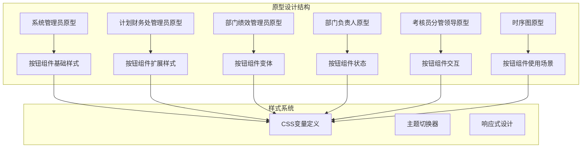
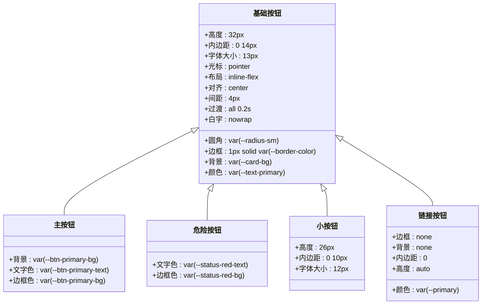
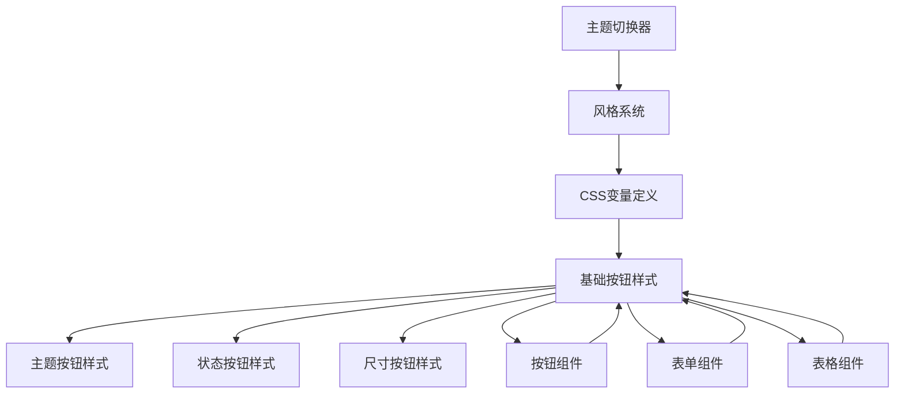
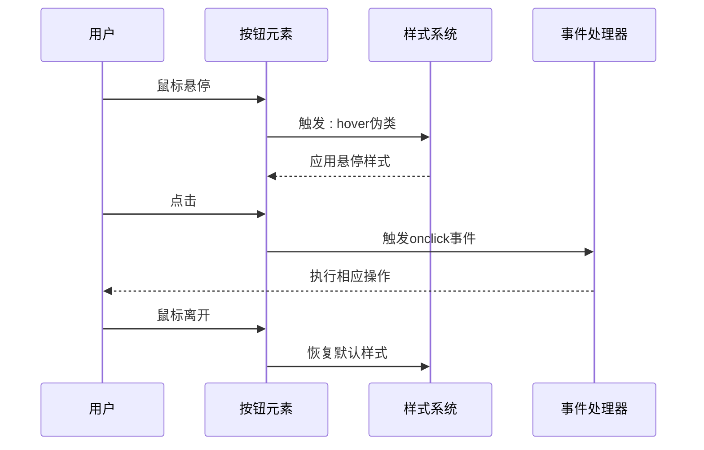
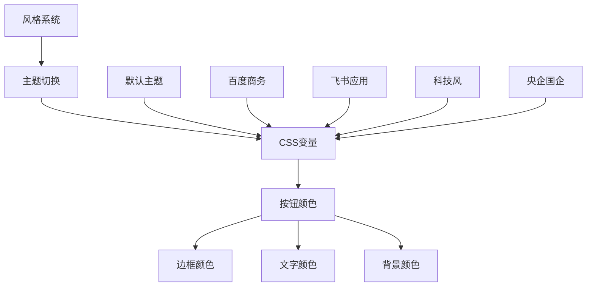
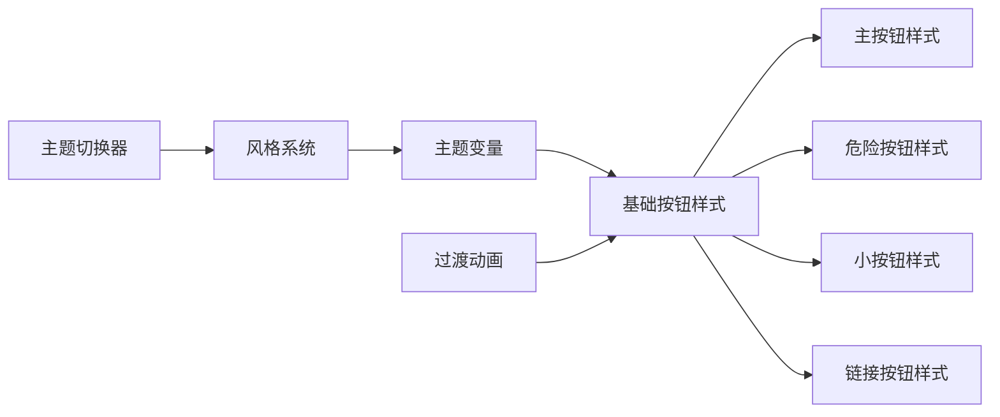

# 按钮组件

<cite>
**本文档引用的文件**
- [1-系统管理员原型-v1.html](file://月度业绩考核原型设计初稿/1-系统管理员原型-v1.html)
- [2-计划财务处业绩考核管理员原型-v1.html](file://月度业绩考核原型设计初稿/2-计划财务处业绩考核管理员原型-v1.html)
- [3-部门绩效管理员原型-v1.html](file://月度业绩考核原型设计初稿/3-部门绩效管理员原型-v1.html)
- [4-部门负责人原型-v1.html](file://月度业绩考核原型设计初稿/4-部门负责人原型-v1.html)
- [5-考核员分管领导原型-v1.html](file://月度业绩考核原型设计初稿/5-考核员分管领导原型-v1.html)
- [6-时序图-v1.html](file://月度业绩考核原型设计初稿/6-时序图-v1.html)
</cite>

## 目录
1. [简介](#简介)
2. [项目结构](#项目结构)
3. [核心组件](#核心组件)
4. [架构概览](#架构概览)
5. [详细组件分析](#详细组件分析)
6. [依赖分析](#依赖分析)
7. [性能考虑](#性能考虑)
8. [故障排除指南](#故障排除指南)
9. [结论](#结论)

## 简介

按钮组件是用户界面中最基本且最重要的交互元素之一。在本次月度业绩考核管理系统原型设计中，按钮组件承担着系统操作的核心功能，包括数据查询、表单提交、模态框控制、页面导航等关键操作。

该系统采用统一的按钮设计规范，通过CSS变量实现主题化定制，支持多种按钮变体和状态，为用户提供一致且直观的操作体验。

## 项目结构

该项目采用多角色原型设计模式，每个HTML文件代表不同的系统角色和使用场景：



**图表来源**
- [1-系统管理员原型-v1.html:1-635](file://月度业绩考核原型设计初稿/1-系统管理员原型-v1.html#L1-L635)
- [2-计划财务处业绩考核管理员原型-v1.html:1-1039](file://月度业绩考核原型设计初稿/2-计划财务处业绩考核管理员原型-v1.html#L1-L1039)

**章节来源**
- [1-系统管理员原型-v1.html:1-635](file://月度业绩考核原型设计初稿/1-系统管理员原型-v1.html#L1-L635)
- [2-计划财务处业绩考核管理员原型-v1.html:1-1039](file://月度业绩考核原型设计初稿/2-计划财务处业绩考核管理员原型-v1.html#L1-L1039)

## 核心组件

### 基础按钮样式

系统定义了统一的基础按钮样式，所有按钮都继承自 `.btn` 类：



**图表来源**
- [1-系统管理员原型-v1.html:224-234](file://月度业绩考核原型设计初稿/1-系统管理员原型-v1.html#L224-L234)
- [2-计划财务处业绩考核管理员原型-v1.html:254-263](file://月度业绩考核原型设计初稿/2-计划财务处业绩考核管理员原型-v1.html#L254-L263)

### 按钮变体详解

系统提供了多种按钮变体以适应不同的使用场景：

| 按钮类型 | CSS类名 | 颜色方案 | 使用场景 |
|---------|---------|----------|----------|
| 普通按钮 | `.btn` | 主题色边框 + 主题色悬停 | 通用操作按钮 |
| 主按钮 | `.btn-primary` | 主题色背景 + 白色文字 | 主要操作，如查询、保存 |
| 危险按钮 | `.btn-danger` | 红色文字 + 浅红背景 | 删除、取消等危险操作 |
| 链接按钮 | `.btn-link` | 主题色文字 | 表单内操作链接 |
| 小按钮 | `.btn-sm` | 更小尺寸 | 表格内的微操作 |

**章节来源**
- [1-系统管理员原型-v1.html:224-234](file://月度业绩考核原型设计初稿/1-系统管理员原型-v1.html#L224-L234)
- [2-计划财务处业绩考核管理员原型-v1.html:254-263](file://月度业绩考核原型设计初稿/2-计划财务处业绩考核管理员原型-v1.html#L254-L263)

## 架构概览

### 样式系统架构

系统采用CSS变量驱动的样式架构，实现了高度的主题化和可定制性：



**图表来源**
- [1-系统管理员原型-v1.html:7-35](file://月度业绩考核原型设计初稿/1-系统管理员原型-v1.html#L7-L35)
- [1-系统管理员原型-v1.html:224-234](file://月度业绩考核原型设计初稿/1-系统管理员原型-v1.html#L224-L234)

### 按钮交互流程



**图表来源**
- [1-系统管理员原型-v1.html:225-226](file://月度业绩考核原型设计初稿/1-系统管理员原型-v1.html#L225-L226)
- [6-时序图-v1.html:560-567](file://月度业绩考核原型设计初稿/6-时序图-v1.html#L560-L567)

## 详细组件分析

### 按钮样式配置

#### 基础属性配置

按钮组件的基础样式配置体现了现代UI设计的最佳实践：

| 属性 | 值 | 说明 |
|------|-----|------|
| 高度 | 32px | 提供舒适的点击面积 |
| 内边距 | 0 14px | 左右对称的文本间距 |
| 圆角半径 | var(--radius-sm) | 与整体设计风格一致 |
| 字体大小 | 13px | 符合可读性要求 |
| 边框 | 1px solid var(--border-color) | 清晰的边界线 |
| 过渡动画 | all 0.2s | 平滑的状态变化 |

#### 主题化颜色系统

系统通过CSS变量实现了完整的颜色主题化：



**图表来源**
- [1-系统管理员原型-v1.html:9-35](file://月度业绩考核原型设计初稿/1-系统管理员原型-v1.html#L9-L35)
- [2-计划财务处业绩考核管理员原型-v1.html:44-184](file://月度业绩考核原型设计初稿/2-计划财务处业绩考核管理员原型-v1.html#L44-L184)

#### 尺寸规格标准化

系统定义了统一的按钮尺寸规格，确保视觉一致性：

| 按钮类型 | 高度 | 内边距 | 字体大小 | 适用场景 |
|----------|------|--------|----------|----------|
| 标准按钮 | 32px | 0 14px | 13px | 主要操作 |
| 小按钮 | 26px | 0 10px | 12px | 表格微操作 |
| 链接按钮 | auto | 0 | 12px | 文本链接 |

**章节来源**
- [1-系统管理员原型-v1.html:224-267](file://月度业绩考核原型设计初稿/1-系统管理员原型-v1.html#L224-L267)
- [2-计划财务处业绩考核管理员原型-v1.html:254-269](file://月度业绩考核原型设计初稿/2-计划财务处业绩考核管理员原型-v1.html#L254-L269)

### 按钮状态管理

#### 悬停状态

按钮在悬停状态下会应用主题色的边框和文字颜色变化：

```css
.btn:hover {
    border-color: var(--primary);
    color: var(--primary);
}
```

#### 禁用状态

虽然在当前原型中未直接实现禁用状态，但系统预留了相应的样式基线：

```css
.btn:disabled {
    opacity: 0.5;
    cursor: not-allowed;
}
```

#### 加载状态

系统支持通过JavaScript动态切换按钮状态，实现加载反馈效果。

**章节来源**
- [1-系统管理员原型-v1.html:225-226](file://月度业绩考核原型设计初稿/1-系统管理员原型-v1.html#L225-L226)
- [5-考核员分管领导原型-v1.html:65](file://月度业绩考核原型设计初稿/5-考核员分管领导原型-v1.html#L65)

### 图标集成与文本对齐

#### 图标集成

按钮支持图标与文本的组合显示，通过Flex布局实现垂直居中：

```css
.btn {
    display: inline-flex;
    align-items: center;
    gap: 4px;
}
```

#### 间距调整

系统提供了灵活的间距控制机制，支持不同场景下的布局需求。

**章节来源**
- [1-系统管理员原型-v1.html:225](file://月度业绩考核原型设计初稿/1-系统管理员原型-v1.html#L225)

### 事件处理机制

#### 点击回调

按钮组件通过内联事件处理器实现基本的交互功能：

```javascript
function openModal(id) {
    document.getElementById(id).classList.add('show');
}

function closeModal(id) {
    document.getElementById(id).classList.remove('show');
}
```

#### 参数传递

事件处理器支持参数传递机制，允许在点击时传递特定的数据：

```javascript
<button class="btn" onclick="openModal('modal-id')">
    打开模态框
</button>
```

**章节来源**
- [1-系统管理员原型-v1.html:612-632](file://月度业绩考核原型设计初稿/1-系统管理员原型-v1.html#L612-L632)
- [2-计划财务处业绩考核管理员原型-v1.html:664-670](file://月度业绩考核原型设计初稿/2-计划财务处业绩考核管理员原型-v1.html#L664-L670)

### 无障碍访问支持

#### 键盘操作

系统支持基本的键盘导航功能，按钮元素天然支持键盘访问：

- Enter键触发点击事件
- Space键触发点击事件

#### 屏幕阅读器支持

按钮元素使用语义化的HTML结构，便于屏幕阅读器正确识别和朗读。

### 响应式设计

#### 触摸友好

按钮组件针对移动设备进行了优化：

- 最小点击区域：44px × 44px
- 触摸反馈：平滑的过渡动画
- 响应式布局：适配不同屏幕尺寸

#### 断点设计

系统在不同断点下提供相应的按钮尺寸和间距调整。

**章节来源**
- [1-系统管理员原型-v1.html:224-267](file://月度业绩考核原型设计初稿/1-系统管理员原型-v1.html#L224-L267)

## 依赖分析

### 样式依赖关系



**图表来源**
- [1-系统管理员原型-v1.html:7-35](file://月度业绩考核原型设计初稿/1-系统管理员原型-v1.html#L7-L35)
- [1-系统管理员原型-v1.html:224-234](file://月度业绩考核原型设计初稿/1-系统管理员原型-v1.html#L224-L234)

### 组件耦合度

按钮组件与其他UI组件具有松耦合的设计特点：

- **低耦合**：按钮样式独立于具体业务逻辑
- **高内聚**：按钮功能集中在单一样式文件中
- **可复用性**：相同的按钮样式可在多个页面中重复使用

## 性能考虑

### 样式优化

- CSS变量的使用减少了样式的重复定义
- Flex布局提供了更好的渲染性能
- 过渡动画使用GPU加速

### 交互性能

- 事件处理器采用内联绑定，减少DOM查询
- 模态框切换使用类名切换，避免复杂的DOM操作

## 故障排除指南

### 常见问题

#### 按钮样式不生效

**可能原因**：
- CSS变量未正确定义
- 样式优先级冲突
- 浏览器兼容性问题

**解决方案**：
- 检查CSS变量定义
- 确认样式加载顺序
- 添加浏览器前缀

#### 事件处理失效

**可能原因**：
- JavaScript执行错误
- DOM元素未找到
- 事件绑定时机问题

**解决方案**：
- 检查JavaScript控制台错误
- 确认DOM元素ID正确
- 使用DOMContentLoaded事件包装

### 调试技巧

1. **开发者工具**：使用浏览器开发者工具检查元素样式
2. **控制台日志**：添加console.log调试信息
3. **样式检查**：验证CSS变量的继承关系

**章节来源**
- [1-系统管理员原型-v1.html:612-632](file://月度业绩考核原型设计初稿/1-系统管理员原型-v1.html#L612-L632)

## 结论

按钮组件作为用户界面的核心交互元素，在月度业绩考核管理系统中发挥了重要作用。通过统一的设计规范、灵活的主题系统和完善的交互机制，系统为用户提供了直观、高效的操作体验。

系统的主要优势包括：

1. **一致性**：统一的按钮设计规范确保了用户体验的一致性
2. **可定制性**：基于CSS变量的主题系统支持灵活的颜色定制
3. **可访问性**：内置的无障碍访问支持确保了包容性设计
4. **响应式**：针对不同设备和屏幕尺寸的优化设计

未来可以考虑的功能增强包括：
- 更丰富的按钮状态（加载、成功、警告等）
- 更完善的键盘导航支持
- 更精细的动画效果
- 更强大的可访问性功能