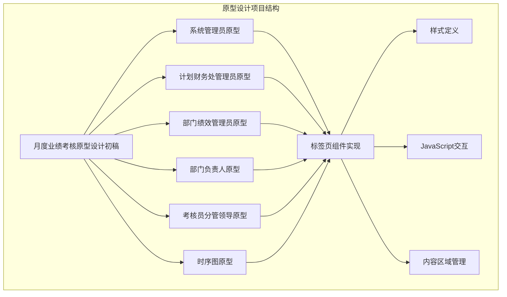
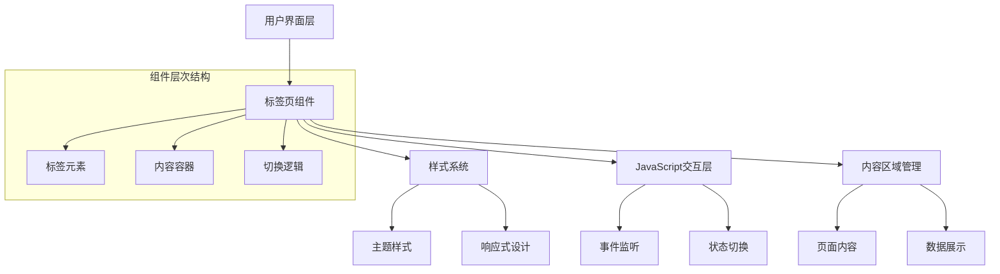
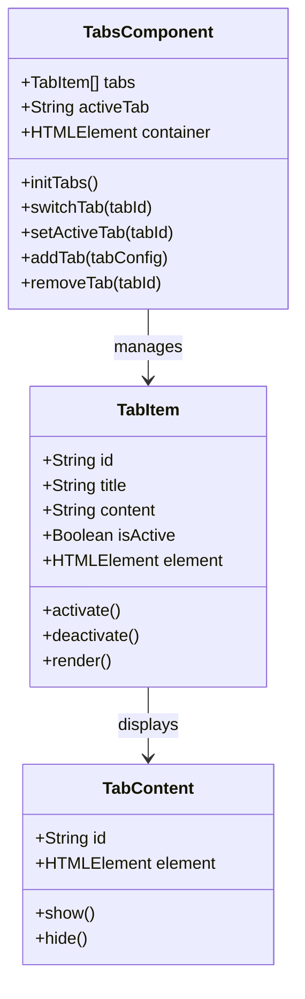
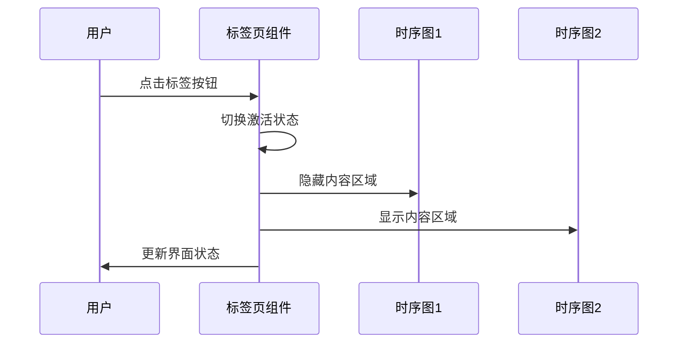
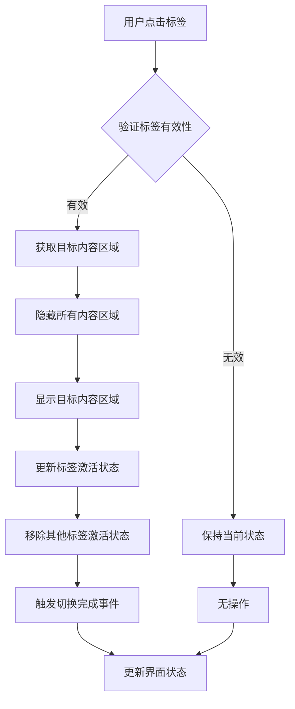
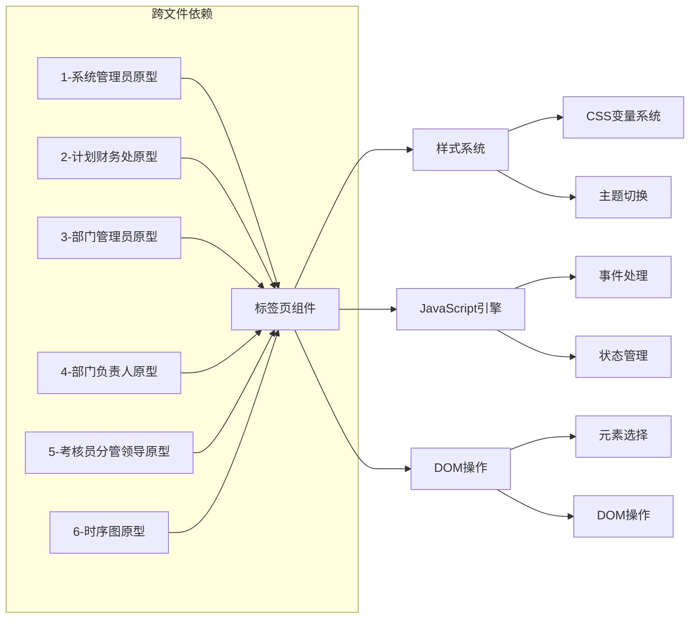

# 标签页组件

<cite>
**本文档引用的文件**
- [1-系统管理员原型-v1.html](file://月度业绩考核原型设计初稿/1-系统管理员原型-v1.html)
- [2-计划财务处业绩考核管理员原型-v1.html](file://月度业绩考核原型设计初稿/2-计划财务处业绩考核管理员原型-v1.html)
- [3-部门绩效管理员原型-v1.html](file://月度业绩考核原型设计初稿/3-部门绩效管理员原型-v1.html)
- [4-部门负责人原型-v1.html](file://月度业绩考核原型设计初稿/4-部门负责人原型-v1.html)
- [5-考核员分管领导原型-v1.html](file://月度业绩考核原型设计初稿/5-考核员分管领导原型-v1.html)
- [6-时序图-v1.html](file://月度业绩考核原型设计初稿/6-时序图-v1.html)
</cite>

## 目录
1. [简介](#简介)
2. [项目结构](#项目结构)
3. [核心组件](#核心组件)
4. [架构概览](#架构概览)
5. [详细组件分析](#详细组件分析)
6. [依赖分析](#依赖分析)
7. [性能考虑](#性能考虑)
8. [故障排除指南](#故障排除指南)
9. [结论](#结论)
10. [附录](#附录)

## 简介

标签页组件是本项目中广泛使用的界面导航组件，用于在不同内容区域之间进行切换。该组件在多个原型页面中都有应用，包括系统管理员、计划财务处管理员、部门绩效管理员、部门负责人以及考核员分管领导等角色的界面。

标签页组件提供了直观的界面导航体验，支持多种样式主题，并且具有良好的响应式设计特性。组件的核心功能包括标签切换、状态管理、样式定制和事件处理等。

## 项目结构

该项目采用多角色原型设计的方式，每个角色都有独立的HTML文件，展示了不同的业务场景和界面需求。标签页组件在多个文件中都有实现和应用。



**图表来源**
- [1-系统管理员原型-v1.html:270-279](file://月度业绩考核原型设计初稿/1-系统管理员原型-v1.html#L270-L279)
- [2-计划财务处业绩考核管理员原型-v1.html:347-351](file://月度业绩考核原型设计初稿/2-计划财务处业绩考核管理员原型-v1.html#L347-L351)
- [3-部门绩效管理员原型-v1.html:347-351](file://月度业绩考核原型设计初稿/3-部门绩效管理员原型-v1.html#L347-L351)
- [4-部门负责人原型-v1.html:112-116](file://月度业绩考核原型设计初稿/4-部门负责人原型-v1.html#L112-L116)
- [5-考核员分管领导原型-v1.html:112-116](file://月度业绩考核原型设计初稿/5-考核员分管领导原型-v1.html#L112-L116)
- [6-时序图-v1.html:72-78](file://月度业绩考核原型设计初稿/6-时序图-v1.html#L72-L78)

**章节来源**
- [1-系统管理员原型-v1.html:1-635](file://月度业绩考核原型设计初稿/1-系统管理员原型-v1.html#L1-L635)
- [2-计划财务处业绩考核管理员原型-v1.html:1-1039](file://月度业绩考核原型设计初稿/2-计划财务处业绩考核管理员原型-v1.html#L1-L1039)
- [3-部门绩效管理员原型-v1.html:1-1663](file://月度业绩考核原型设计初稿/3-部门绩效管理员原型-v1.html#L1-L1663)
- [4-部门负责人原型-v1.html:1-1231](file://月度业绩考核原型设计初稿/4-部门负责人原型-v1.html#L1-L1231)
- [5-考核员分管领导原型-v1.html:1-1459](file://月度业绩考核原型设计初稿/5-考核员分管领导原型-v1.html#L1-L1459)
- [6-时序图-v1.html:1-570](file://月度业绩考核原型设计初稿/6-时序图-v1.html#L1-L570)

## 核心组件

标签页组件在本项目中主要体现在以下几种实现形式：

### 1. 标准标签页组件
这是最常见的一种实现，主要用于页面内的内容切换。

### 2. 时序图标签页
专门用于切换不同的时序图展示，具有独特的样式设计。

### 3. 页面切换标签
用于在不同页面之间进行切换，支持激活状态管理。

组件的核心特性包括：
- **激活状态管理**：通过CSS类名控制当前激活的标签
- **样式定制**：支持多种主题和视觉效果
- **响应式设计**：适应不同屏幕尺寸
- **事件处理**：提供JavaScript交互功能

**章节来源**
- [1-系统管理员原型-v1.html:270-279](file://月度业绩考核原型设计初稿/1-系统管理员原型-v1.html#L270-L279)
- [6-时序图-v1.html:72-78](file://月度业绩考核原型设计初稿/6-时序图-v1.html#L72-L78)

## 架构概览

标签页组件在整个系统中的架构位置如下：



**图表来源**
- [1-系统管理员原型-v1.html:270-279](file://月度业绩考核原型设计初稿/1-系统管理员原型-v1.html#L270-L279)
- [6-时序图-v1.html:72-78](file://月度业绩考核原型设计初稿/6-时序图-v1.html#L72-L78)

## 详细组件分析

### 标准标签页组件实现

标准标签页组件在多个原型文件中都有实现，具有统一的结构和样式：



**图表来源**
- [1-系统管理员原型-v1.html:270-279](file://月度业绩考核原型设计初稿/1-系统管理员原型-v1.html#L270-L279)
- [2-计划财务处业绩考核管理员原型-v1.html:347-351](file://月度业绩考核原型设计初稿/2-计划财务处业绩考核管理员原型-v1.html#L347-L351)
- [3-部门绩效管理员原型-v1.html:347-351](file://月度业绩考核原型设计初稿/3-部门绩效管理员原型-v1.html#L347-L351)
- [4-部门负责人原型-v1.html:112-116](file://月度业绩考核原型设计初稿/4-部门负责人原型-v1.html#L112-L116)
- [5-考核员分管领导原型-v1.html:112-116](file://月度业绩考核原型设计初稿/5-考核员分管领导原型-v1.html#L112-L116)

### 时序图标签页组件

时序图页面中的标签页组件具有特殊的样式设计：



**图表来源**
- [6-时序图-v1.html:99-102](file://月度业绩考核原型设计初稿/6-时序图-v1.html#L99-L102)
- [6-时序图-v1.html:560-567](file://月度业绩考核原型设计初稿/6-时序图-v1.html#L560-L567)

### 标签页切换逻辑

标签页组件的核心切换逻辑通过JavaScript实现：



**图表来源**
- [6-时序图-v1.html:560-567](file://月度业绩考核原型设计初稿/6-时序图-v1.html#L560-L567)

**章节来源**
- [1-系统管理员原型-v1.html:270-279](file://月度业绩考核原型设计初稿/1-系统管理员原型-v1.html#L270-L279)
- [2-计划财务处业绩考核管理员原型-v1.html:347-351](file://月度业绩考核原型设计初稿/2-计划财务处业绩考核管理员原型-v1.html#L347-L351)
- [3-部门绩效管理员原型-v1.html:347-351](file://月度业绩考核原型设计初稿/3-部门绩效管理员原型-v1.html#L347-L351)
- [4-部门负责人原型-v1.html:112-116](file://月度业绩考核原型设计初稿/4-部门负责人原型-v1.html#L112-L116)
- [5-考核员分管领导原型-v1.html:112-116](file://月度业绩考核原型设计初稿/5-考核员分管领导原型-v1.html#L112-L116)
- [6-时序图-v1.html:72-78](file://月度业绩考核原型设计初稿/6-时序图-v1.html#L72-L78)

## 依赖分析

标签页组件在项目中的依赖关系如下：



**图表来源**
- [1-系统管理员原型-v1.html:270-279](file://月度业绩考核原型设计初稿/1-系统管理员原型-v1.html#L270-L279)
- [6-时序图-v1.html:72-78](file://月度业绩考核原型设计初稿/6-时序图-v1.html#L72-L78)

**章节来源**
- [1-系统管理员原型-v1.html:1-635](file://月度业绩考核原型设计初稿/1-系统管理员原型-v1.html#L1-L635)
- [6-时序图-v1.html:1-570](file://月度业绩考核原型设计初稿/6-时序图-v1.html#L1-L570)

## 性能考虑

标签页组件在性能方面的优化策略：

### 1. DOM操作优化
- 使用事件委托减少事件监听器数量
- 批量DOM操作避免重排重绘
- 内容懒加载机制

### 2. 内存管理
- 及时清理事件监听器
- 避免循环引用
- 合理的垃圾回收策略

### 3. 渲染性能
- CSS硬件加速
- 最小化重绘区域
- 合理的动画帧率

## 故障排除指南

### 常见问题及解决方案

#### 1. 标签页不响应点击事件
**症状**：点击标签页无任何反应  
**可能原因**：
- JavaScript文件未正确加载
- 事件绑定失败
- CSS样式冲突

**解决方法**：
```javascript
// 检查事件绑定
console.log('标签页组件初始化');
console.log('可用标签数量:', document.querySelectorAll('.tab').length);

// 验证CSS类名
const tabElements = document.querySelectorAll('.tab');
tabElements.forEach((element, index) => {
    console.log(`标签 ${index}:`, element.classList.contains('active'));
});
```

#### 2. 内容区域显示异常
**症状**：切换标签后内容不显示或显示错误  
**可能原因**：
- 内容容器ID不匹配
- CSS选择器错误
- JavaScript执行顺序问题

**解决方法**：
```javascript
// 检查内容容器状态
function debugTabSwitch(targetId) {
    console.log('目标标签ID:', targetId);
    console.log('所有内容容器:', document.querySelectorAll('.tab-content'));
    console.log('目标内容容器:', document.getElementById(targetId));
}
```

#### 3. 样式显示问题
**症状**：标签页样式不符合预期  
**可能原因**：
- CSS变量未正确设置
- 主题切换逻辑错误
- 响应式断点问题

**解决方法**：
```css
/* 检查CSS变量 */
:root {
    --primary-color: #2d5aa0;
    --active-tab-color: #2d5aa0;
    --tab-border-color: #f0f0f0;
}

/* 验证样式类名 */
.tab.active {
    color: var(--active-tab-color);
    border-bottom-color: var(--active-tab-color);
}
```

**章节来源**
- [6-时序图-v1.html:560-567](file://月度业绩考核原型设计初稿/6-时序图-v1.html#L560-L567)

## 结论

标签页组件作为本项目的核心导航组件，展现了良好的模块化设计和跨文件复用能力。组件具有以下特点：

1. **统一性**：在多个原型文件中保持一致的实现和样式
2. **灵活性**：支持不同的主题和样式变体
3. **可扩展性**：易于添加新的标签和内容区域
4. **用户体验**：提供流畅的切换体验和清晰的状态指示

组件的设计充分考虑了现代Web开发的最佳实践，包括响应式设计、可访问性支持和性能优化等方面。通过合理的架构设计和代码组织，标签页组件成为了整个系统中重要的界面导航基础设施。

## 附录

### 样式定制选项

标签页组件支持多种样式定制选项：

| 属性 | 默认值 | 描述 |
|------|--------|------|
| 主色调 | #2d5aa0 | 激活状态的颜色 |
| 边框颜色 | #f0f0f0 | 标签页边框颜色 |
| 字体大小 | 13px | 标签文字大小 |
| 内边距 | 8px 16px | 标签内边距 |
| 过渡时间 | 0.2s | 切换动画持续时间 |

### 事件处理机制

组件支持的事件类型：
- `tab:switch` - 标签切换事件
- `tab:activate` - 标签激活事件  
- `tab:deactivate` - 标签失活事件

### 响应式设计

组件在不同屏幕尺寸下的表现：
- **桌面端**：完整显示所有标签
- **平板端**：根据宽度调整标签排列
- **移动端**：支持水平滚动查看更多标签