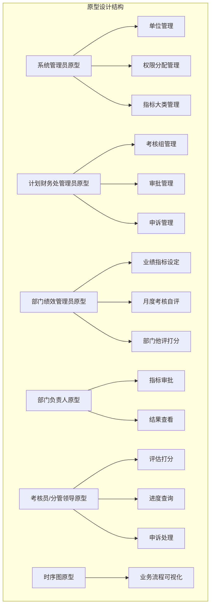
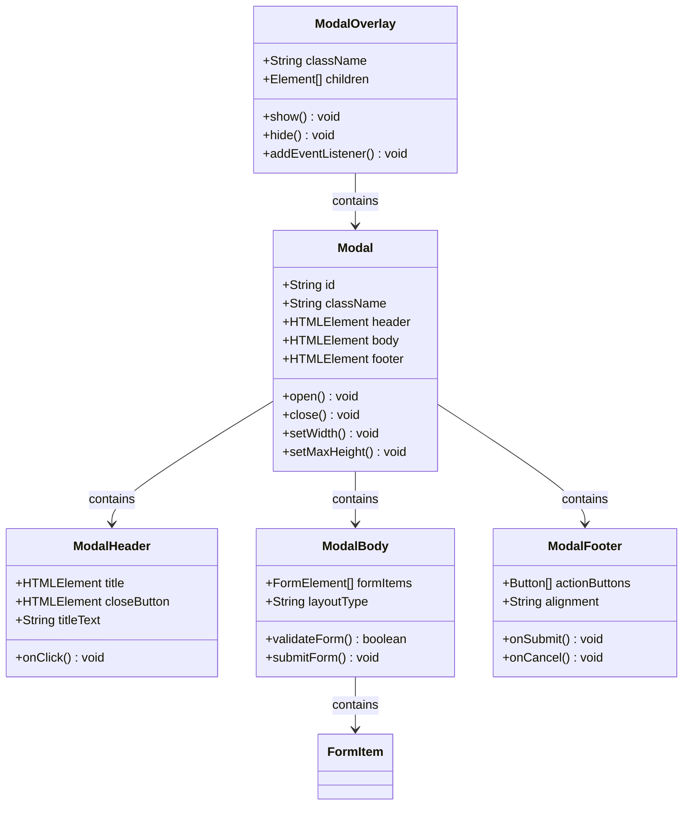
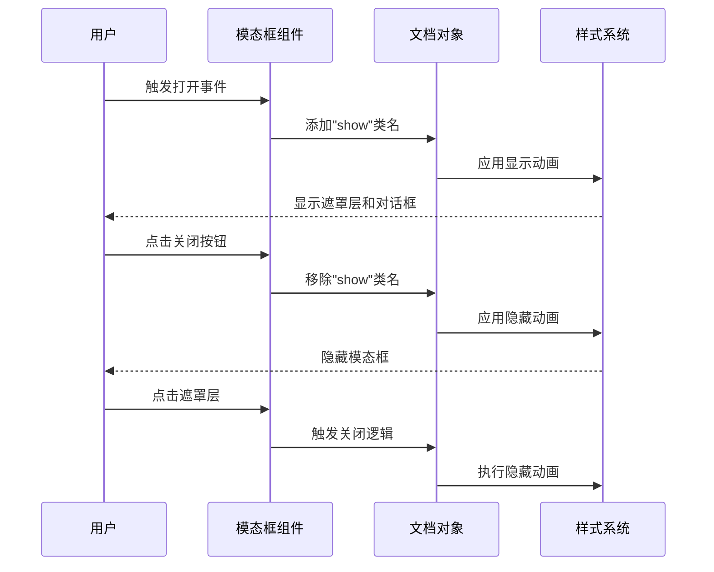
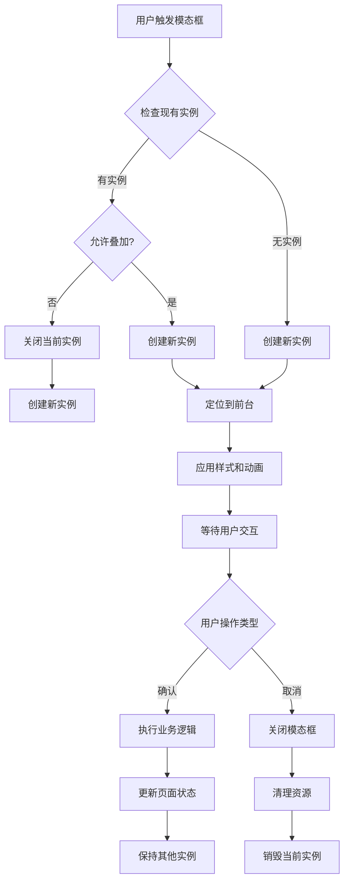
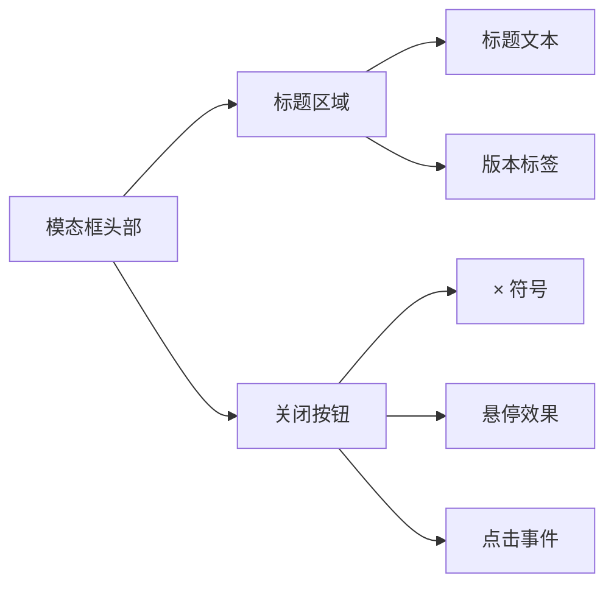
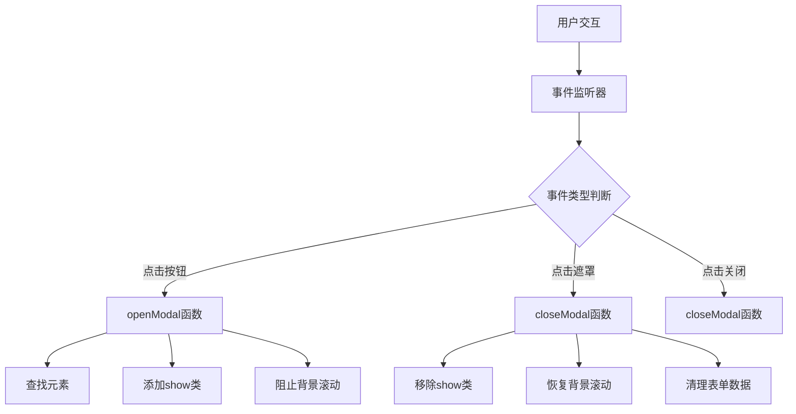
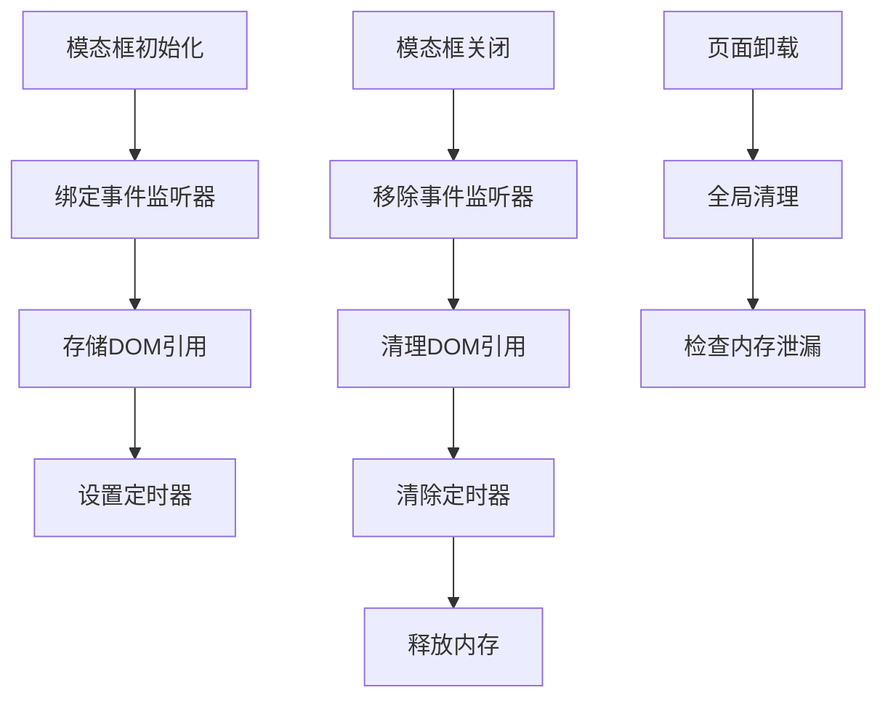

# 模态框组件

<cite>
**本文档引用的文件**
- [系统管理员原型-v1.html](file://月度业绩考核原型设计初稿/1-系统管理员原型-v1.html)
- [计划财务处业绩考核管理员原型-v1.html](file://月度业绩考核原型设计初稿/2-计划财务处业绩考核管理员原型-v1.html)
- [部门绩效管理员原型-v1.html](file://月度业绩考核原型设计初稿/3-部门绩效管理员原型-v1.html)
- [部门负责人原型-v1.html](file://月度业绩考核原型设计初稿/4-部门负责人原型-v1.html)
- [考核员分管领导原型-v1.html](file://月度业绩考核原型设计初稿/5-考核员分管领导原型-v1.html)
- [时序图-v1.html](file://月度业绩考核原型设计初稿/6-时序图-v1.html)
</cite>

## 目录
1. [简介](#简介)
2. [项目结构](#项目结构)
3. [核心组件](#核心组件)
4. [架构概览](#架构概览)
5. [详细组件分析](#详细组件分析)
6. [依赖关系分析](#依赖关系分析)
7. [性能考虑](#性能考虑)
8. [故障排除指南](#故障排除指南)
9. [结论](#结论)
10. [附录](#附录)

## 简介

本文档详细介绍月度业绩考核管理系统的模态框组件。该系统包含多个角色的界面原型，每个原型都实现了完整的模态框功能，涵盖遮罩层、对话框主体、头部、主体内容和底部操作按钮等结构。

模态框组件在系统中承担着重要的交互作用，用于处理各种业务场景，包括数据录入、审批流程、结果查看等关键操作。系统通过统一的模态框架构，确保了用户体验的一致性和操作流程的规范性。

## 项目结构

项目采用多角色原型设计，每个角色都有独立的HTML文件，展示了不同的业务场景和模态框使用方式：

**图表来源**
- [系统管理员原型-v1.html:1-635](file://月度业绩考核原型设计初稿/1-系统管理员原型-v1.html#L1-L635)
- [计划财务处业绩考核管理员原型-v1.html:1-1039](file://月度业绩考核原型设计初稿/2-计划财务处业绩考核管理员原型-v1.html#L1-L1039)
- [部门绩效管理员原型-v1.html:1-1663](file://月度业绩考核原型设计初稿/3-部门绩效管理员原型-v1.html#L1-L1663)
- [部门负责人原型-v1.html:1-1231](file://月度业绩考核原型设计初稿/4-部门负责人原型-v1.html#L1-L1231)
- [考核员分管领导原型-v1.html:1-1459](file://月度业绩考核原型设计初稿/5-考核员分管领导原型-v1.html#L1-L1459)
- [时序图-v1.html:1-570](file://月度业绩考核原型设计初稿/6-时序图-v1.html#L1-L570)

**章节来源**
- [系统管理员原型-v1.html:1-635](file://月度业绩考核原型设计初稿/1-系统管理员原型-v1.html#L1-L635)
- [计划财务处业绩考核管理员原型-v1.html:1-1039](file://月度业绩考核原型设计初稿/2-计划财务处业绩考核管理员原型-v1.html#L1-L1039)

## 核心组件

### 模态框结构设计

系统中的模态框组件遵循统一的结构规范，包含以下核心元素：

**图表来源**
- [系统管理员原型-v1.html:249-279](file://月度业绩考核原型设计初稿/1-系统管理员原型-v1.html#L249-L279)
- [计划财务处业绩考核管理员原型-v1.html:271-281](file://月度业绩考核原型设计初稿/2-计划财务处业绩考核管理员原型-v1.html#L271-L281)

### 样式系统架构

系统采用CSS变量驱动的样式系统，支持多种主题风格：

| 主题风格 | CSS变量前缀 | 主要颜色 | 适用场景 |
|---------|------------|----------|----------|
| 默认风格 | --primary, --secondary | 蓝色系 | 通用界面 |
| 百度商务 | style-baidu | 蓝紫色系 | 商务场景 |
| 飞书应用 | style-feishu | 蓝色系 | 现代办公 |
| 科技风 | style-tech | 青蓝色系 | 科技感界面 |
| 央企国企 | style-guoqi | 红色系 | 国企风格 |

**章节来源**
- [系统管理员原型-v1.html:8-129](file://月度业绩考核原型设计初稿/1-系统管理员原型-v1.html#L8-L129)
- [计划财务处业绩考核管理员原型-v1.html:44-184](file://月度业绩考核原型设计初稿/2-计划财务处业绩考核管理员原型-v1.html#L44-L184)

## 架构概览

### 模态框生命周期管理

**图表来源**
- [系统管理员原型-v1.html:629-632](file://月度业绩考核原型设计初稿/1-系统管理员原型-v1.html#L629-L632)
- [计划财务处业绩考核管理员原型-v1.html:664-669](file://月度业绩考核原型设计初稿/2-计划财务处业绩考核管理员原型-v1.html#L664-L669)

### 多实例管理架构

系统支持同时存在多个模态框实例，通过以下机制实现：

**图表来源**
- [部门绩效管理员原型-v1.html:766-767](file://月度业绩考核原型设计初稿/3-部门绩效管理员原型-v1.html#L766-L767)
- [部门负责人原型-v1.html:664-666](file://月度业绩考核原型设计初稿/4-部门负责人原型-v1.html#L664-L666)

**章节来源**
- [系统管理员原型-v1.html:629-632](file://月度业绩考核原型设计初稿/1-系统管理员原型-v1.html#L629-L632)
- [部门绩效管理员原型-v1.html:766-767](file://月度业绩考核原型设计初稿/3-部门绩效管理员原型-v1.html#L766-L767)

## 详细组件分析

### 遮罩层系统

遮罩层作为模态框的基础容器，提供了统一的背景遮挡效果：

| 属性 | 默认值 | 描述 | 可选值 |
|------|--------|------|--------|
| position | fixed | 定位方式 | fixed, absolute |
| top | 0 | 顶部距离 | 数值(px/em/rem) |
| left | 0 | 左侧距离 | 数值(px/em/rem) |
| right | 0 | 右侧距离 | 数值(px/em/rem) |
| bottom | 0 | 底部距离 | 数值(px/em/rem) |
| background | rgba(0,0,0,0.4) | 背景颜色 | 颜色值 |
| z-index | 200 | 层级顺序 | 整数 |
| display | none | 显示状态 | none, flex |

遮罩层的显示控制通过JavaScript实现，使用CSS类名切换的方式控制显示和隐藏。

**章节来源**
- [系统管理员原型-v1.html:249-251](file://月度业绩考核原型设计初稿/1-系统管理员原型-v1.html#L249-L251)
- [计划财务处业绩考核管理员原型-v1.html:271-273](file://月度业绩考核原型设计初稿/2-计划财务处业绩考核管理员原型-v1.html#L271-L273)

### 对话框主体设计

对话框主体采用响应式设计，支持不同尺寸的模态框：

| 尺寸规格 | 宽度 | 最大高度 | 适用场景 |
|----------|------|----------|----------|
| 默认 | 560px | 80vh | 基础表单 |
| lg | 680px | 85vh | 中等复杂表单 |
| xl | 900px | 85vh | 大型表单 |
| wide | 1100px | 80vh | 详细信息展示 |

对话框主体包含以下核心功能：
- 滚动条自动适配
- 最大高度限制
- 内容溢出处理
- 响应式布局

**章节来源**
- [系统管理员原型-v1.html:252-252](file://月度业绩考核原型设计初稿/1-系统管理员原型-v1.html#L252-L252)
- [计划财务处业绩考核管理员原型-v1.html:282-282](file://月度业绩考核原型设计初稿/2-计划财务处业绩考核管理员原型-v1.html#L282-L282)

### 头部区域结构

模态框头部区域包含标题和关闭按钮，提供清晰的界面标识：

**图表来源**
- [系统管理员原型-v1.html:253-255](file://月度业绩考核原型设计初稿/1-系统管理员原型-v1.html#L253-L255)
- [计划财务处业绩考核管理员原型-v1.html:274-279](file://月度业绩考核原型设计初稿/2-计划财务处业绩考核管理员原型-v1.html#L274-L279)

### 主体内容布局

主体内容区域采用灵活的布局系统，支持多种表单元素：

| 组件类型 | 特性 | 使用场景 |
|----------|------|----------|
| 表单项 | 标签 + 输入控件 | 基础数据录入 |
| 表单行 | 多列布局 | 并排显示相关字段 |
| 状态标签 | 颜色标识 | 状态显示和分类 |
| 用户标签 | 选择器 | 多选用户管理 |

**章节来源**
- [系统管理员原型-v1.html:258-269](file://月度业绩考核原型设计初稿/1-系统管理员原型-v1.html#L258-L269)
- [计划财务处业绩考核管理员原型-v1.html:289-296](file://月度业绩考核原型设计初稿/2-计划财务处业绩考核管理员原型-v1.html#L289-L296)

### 底部操作按钮

底部区域提供标准化的操作按钮，支持多种交互模式：

| 按钮类型 | 颜色方案 | 用途 | 状态 |
|----------|----------|------|------|
| 取消按钮 | 默认样式 | 关闭模态框 | 普通 |
| 保存按钮 | 主题色 | 保存表单数据 | 普通 |
| 通过按钮 | 绿色 | 审批通过 | 普通 |
| 退回按钮 | 红色 | 审批退回 | 危险 |
| 提交按钮 | 主题色 | 提交审核 | 强调 |

**章节来源**
- [系统管理员原型-v1.html:257-257](file://月度业绩考核原型设计初稿/1-系统管理员原型-v1.html#L257-L257)
- [计划财务处业绩考核管理员原型-v1.html:280-281](file://月度业绩考核原型设计初稿/2-计划财务处业绩考核管理员原型-v1.html#L280-L281)

## 依赖关系分析

### JavaScript事件处理

系统通过统一的事件处理机制管理模态框的打开和关闭：

**图表来源**
- [系统管理员原型-v1.html:629-632](file://月度业绩考核原型设计初稿/1-系统管理员原型-v1.html#L629-L632)
- [计划财务处业绩考核管理员原型-v1.html:664-669](file://月度业绩考核原型设计初稿/2-计划财务处业绩考核管理员原型-v1.html#L664-L669)

### CSS样式依赖

模态框组件依赖于以下CSS特性：

| 样式特性 | 依赖组件 | 实现方式 |
|----------|----------|----------|
| Flex布局 | 遮罩层 | align-items, justify-content |
| 动画效果 | 所有元素 | transition, transform |
| 响应式设计 | 对话框主体 | max-width, overflow |
| 主题切换 | 全局样式 | CSS变量 |

**章节来源**
- [系统管理员原型-v1.html:629-632](file://月度业绩考核原型设计初稿/1-系统管理员原型-v1.html#L629-L632)
- [计划财务处业绩考核管理员原型-v1.html:664-669](file://月度业绩考核原型设计初稿/2-计划财务处业绩考核管理员原型-v1.html#L664-L669)

## 性能考虑

### 渲染优化策略

系统采用以下优化策略提升模态框性能：

1. **懒加载机制**：模态框内容按需渲染，减少初始页面负载
2. **事件委托**：使用事件委托减少事件监听器数量
3. **CSS动画**：优先使用transform和opacity属性，避免重排重绘
4. **内存管理**：及时清理事件监听器和DOM引用

### 内存泄漏防护

**图表来源**
- [系统管理员原型-v1.html:629-632](file://月度业绩考核原型设计初稿/1-系统管理员原型-v1.html#L629-L632)

## 故障排除指南

### 常见问题诊断

| 问题现象 | 可能原因 | 解决方案 |
|----------|----------|----------|
| 模态框无法打开 | 事件监听器未绑定 | 检查JavaScript初始化代码 |
| 遮罩层点击无效 | 事件冒泡阻止 | 检查事件处理逻辑 |
| 表单数据丢失 | 页面刷新导致 | 使用本地存储或状态管理 |
| 样式冲突 | CSS优先级问题 | 调整CSS选择器优先级 |

### 调试工具使用

推荐使用以下工具进行调试：
- 浏览器开发者工具
- CSS检查器
- JavaScript断点调试
- 性能分析工具

**章节来源**
- [系统管理员原型-v1.html:629-632](file://月度业绩考核原型设计初稿/1-系统管理员原型-v1.html#L629-L632)

## 结论

模态框组件在月度业绩考核管理系统中发挥了重要作用，通过统一的架构设计和丰富的功能实现，为不同角色提供了良好的用户体验。系统采用的多主题样式系统、响应式布局和事件驱动架构，确保了组件的灵活性和可维护性。

未来可以考虑的改进方向包括：
- 增加更多的动画效果选项
- 支持模态框的嵌套深度限制
- 实现更完善的键盘导航支持
- 增强无障碍访问功能

## 附录

### API参考

| 方法 | 参数 | 返回值 | 描述 |
|------|------|--------|------|
| openModal | id: String | void | 打开指定ID的模态框 |
| closeModal | id: String | void | 关闭指定ID的模态框 |
| toggleModal | id: String | void | 切换模态框的显示状态 |

### 配置选项

| 选项 | 类型 | 默认值 | 描述 |
|------|------|--------|------|
| animationDuration | Number | 300 | 动画持续时间(ms) |
| backdropClick | Boolean | true | 点击遮罩层是否关闭 |
| escapeKey | Boolean | true | ESC键是否关闭模态框 |
| autoFocus | Boolean | true | 打开时是否自动聚焦 |