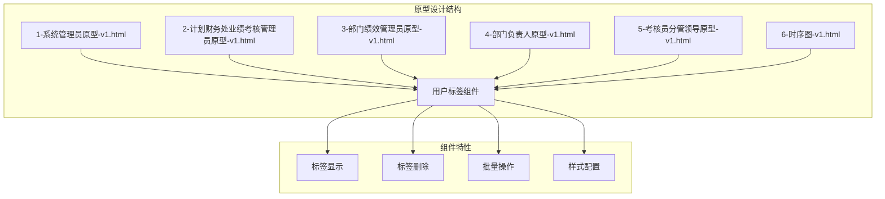
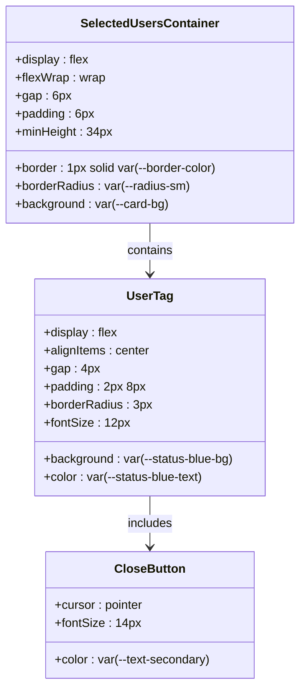
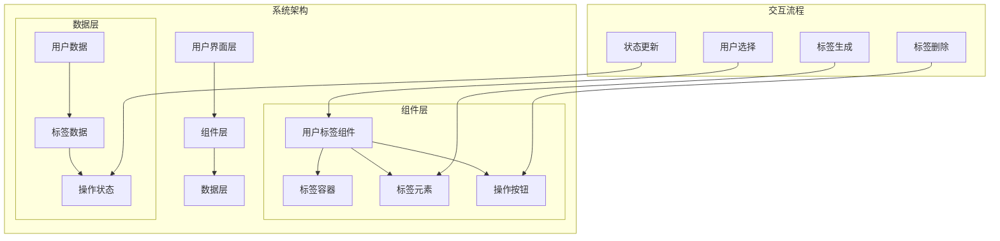
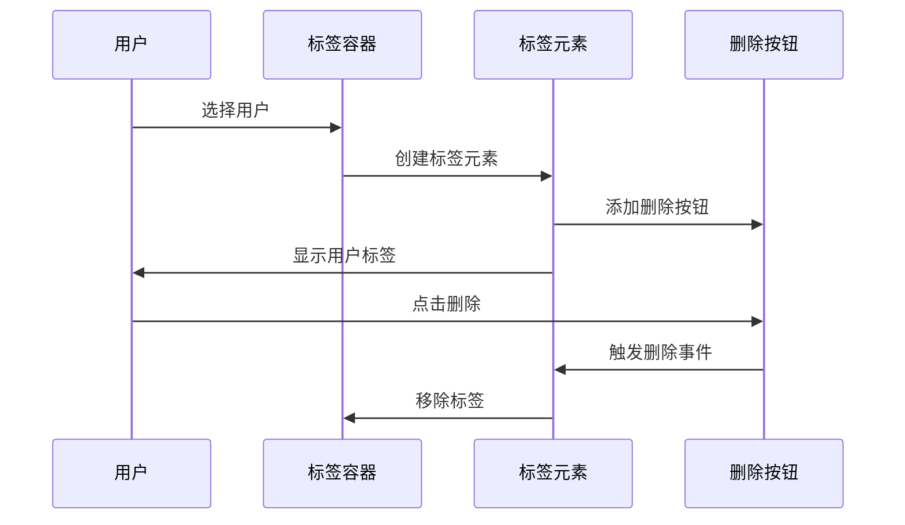
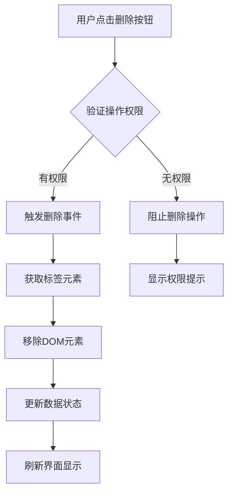
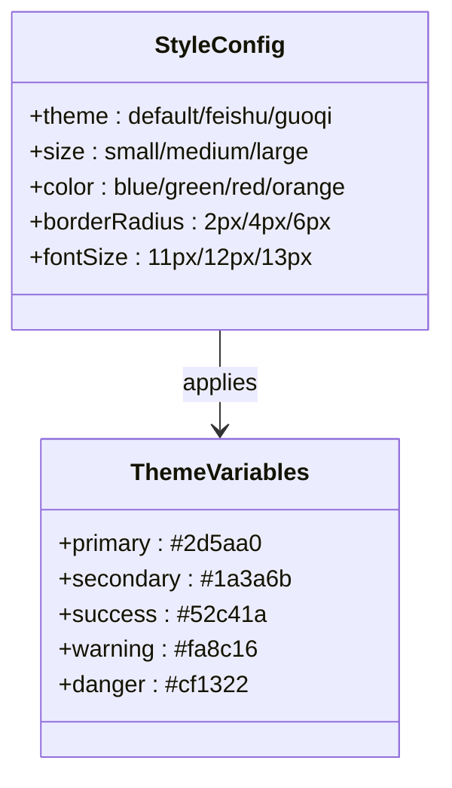
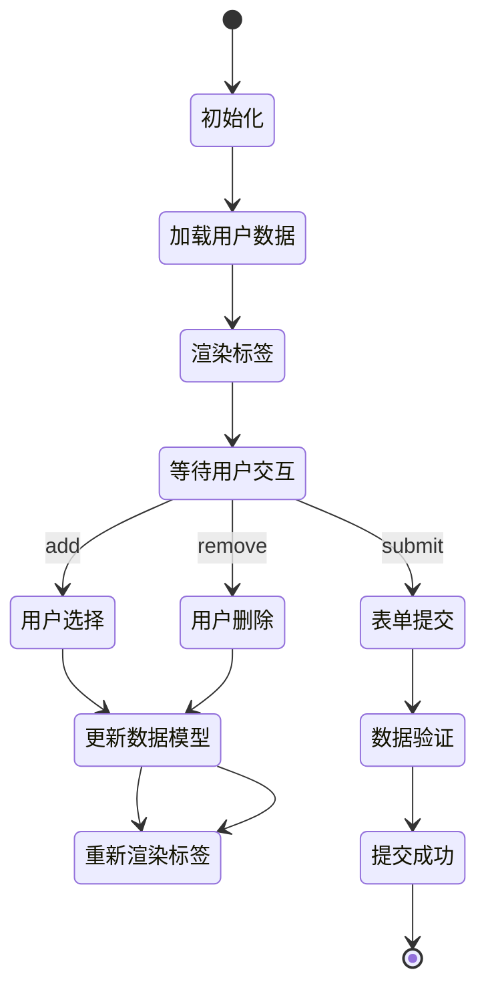
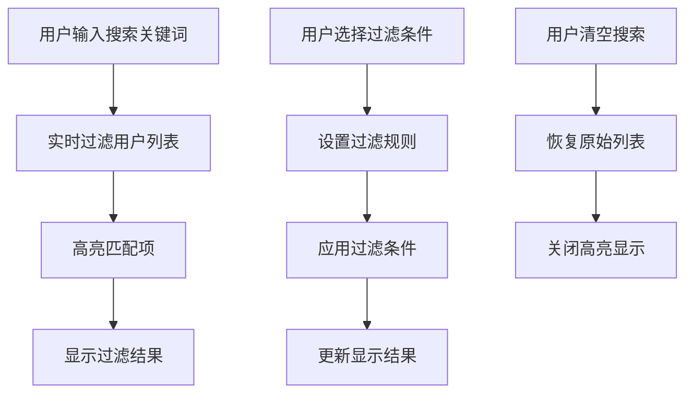
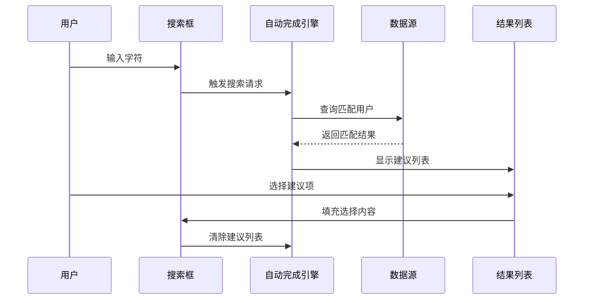
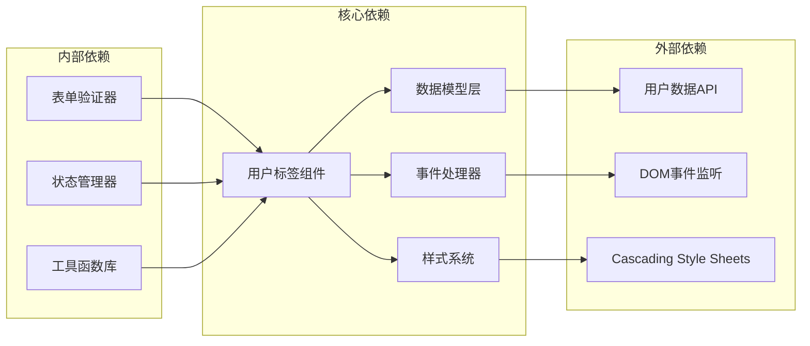

# 用户标签组件

<cite>
**本文档引用的文件**
- [1-系统管理员原型-v1.html](file://1-系统管理员原型-v1.html)
- [2-计划财务处业绩考核管理员原型-v1.html](file://2-计划财务处业绩考核管理员原型-v1.html)
- [3-部门绩效管理员原型-v1.html](file://3-部门绩效管理员原型-v1.html)
- [4-部门负责人原型-v1.html](file://4-部门负责人原型-v1.html)
- [5-考核员分管领导原型-v1.html](file://5-考核员分管领导原型-v1.html)
- [6-时序图-v1.html](file://6-时序图-v1.html)
</cite>

## 目录
1. [简介](#简介)
2. [项目结构](#项目结构)
3. [核心组件](#核心组件)
4. [架构概览](#架构概览)
5. [详细组件分析](#详细组件分析)
6. [依赖分析](#依赖分析)
7. [性能考虑](#性能考虑)
8. [故障排除指南](#故障排除指南)
9. [结论](#结论)

## 简介

用户标签组件（selected-users）是月度业绩考核管理系统中的关键交互组件，用于在表单中管理和展示已选择的用户信息。该组件提供了直观的用户选择界面，支持用户标签的显示、删除、批量操作等功能。

该组件在多个角色页面中都有应用，包括系统管理员、计划财务处业绩考核管理员、部门绩效管理员、部门负责人以及考核员分管领导等角色的界面中。

## 项目结构

该项目采用多角色原型设计模式，每个角色都有独立的HTML原型文件：

**图表来源**
- [1-系统管理员原型-v1.html:274-279](file://1-系统管理员原型-v1.html#L274-L279)
- [2-计划财务处业绩考核管理员原型-v1.html:269-275](file://2-计划财务处业绩考核管理员原型-v1.html#L269-L275)
- [3-部门绩效管理员原型-v1.html:277-285](file://3-部门绩效管理员原型-v1.html#L277-L285)

**章节来源**
- [1-系统管理员原型-v1.html:1-635](file://1-系统管理员原型-v1.html#L1-L635)
- [2-计划财务处业绩考核管理员原型-v1.html:1-1039](file://2-计划财务处业绩考核管理员原型-v1.html#L1-L1039)
- [3-部门绩效管理员原型-v1.html:1-1663](file://3-部门绩效管理员原型-v1.html#L1-L1663)
- [4-部门负责人原型-v1.html:1-1231](file://4-部门负责人原型-v1.html#L1-L1231)
- [5-考核员分管领导原型-v1.html:1-1459](file://5-考核员分管领导原型-v1.html#L1-L1459)

## 核心组件

### 组件结构设计

用户标签组件采用Flex布局设计，具有以下核心结构：

**图表来源**
- [1-系统管理员原型-v1.html:274-279](file://1-系统管理员原型-v1.html#L274-L279)

### 样式系统

组件采用CSS变量系统，支持多种主题风格：

| 主题变量 | 默认值 | 风格示例 |
|---------|--------|----------|
| `--primary` | #2d5aa0 | 系统主色调 |
| `--status-blue-bg` | #e6f4ff | 标签背景色 |
| `--status-blue-text` | #0958d9 | 标签文字色 |
| `--border-color` | #d9d9d9 | 边框颜色 |
| `--card-bg` | #fff | 背景色 |

**章节来源**
- [1-系统管理员原型-v1.html:8-35](file://1-系统管理员原型-v1.html#L8-L35)
- [1-系统管理员原型-v1.html:274-279](file://1-系统管理员原型-v1.html#L274-L279)

## 架构概览

用户标签组件在整个系统中的位置和交互关系如下：

**图表来源**
- [1-系统管理员原型-v1.html:582-583](file://1-系统管理员原型-v1.html#L582-L583)
- [2-计划财务处业绩考核管理员原型-v1.html:269-275](file://2-计划财务处业绩考核管理员原型-v1.html#L269-L275)

## 详细组件分析

### 标签显示格式

用户标签采用统一的显示格式，包含用户姓名和删除按钮：

**图表来源**
- [1-系统管理员原型-v1.html:582-583](file://1-系统管理员原型-v1.html#L582-L583)

### 删除机制

组件实现了完整的删除机制，支持单个标签删除和批量删除：

**图表来源**
- [1-系统管理员原型-v1.html:276-278](file://1-系统管理员原型-v1.html#L276-L278)

### 批量操作功能

组件支持批量操作，包括批量选择、批量删除等功能：

| 操作类型 | 功能描述 | 实现方式 |
|---------|----------|----------|
| 批量选择 | 一次选择多个用户 | 复选框/多选下拉框 |
| 批量删除 | 一次性删除多个标签 | 批量删除按钮 |
| 批量导入 | 从文件导入用户列表 | 文件上传组件 |
| 批量导出 | 导出当前用户列表 | 下载功能 |

### 样式配置

组件支持丰富的样式配置选项：

**图表来源**
- [1-系统管理员原型-v1.html:58-149](file://1-系统管理员原型-v1.html#L58-L149)

### 数据绑定机制

组件实现了双向数据绑定，确保UI状态与数据状态保持一致：

**图表来源**
- [1-系统管理员原型-v1.html:582-583](file://1-系统管理员原型-v1.html#L582-L583)

### 事件处理

组件支持多种事件处理机制：

| 事件类型 | 触发条件 | 处理函数 | 参数传递 |
|---------|----------|----------|----------|
| 标签点击 | 用户点击标签 | handleTagClick | 标签数据对象 |
| 删除点击 | 用户点击删除按钮 | handleDeleteClick | 标签索引/标识符 |
| 双击编辑 | 用户双击标签 | handleDoubleClick | 标签内容 |
| 键盘导航 | 使用键盘操作 | handleKeyboardNav | 键盘事件对象 |
| 拖拽排序 | 拖拽标签重新排序 | handleDragSort | 拖拽事件数据 |

### 搜索过滤功能

组件集成了智能搜索和过滤功能：

**图表来源**
- [2-计划财务处业绩考核管理员原型-v1.html:269-275](file://2-计划财务处业绩考核管理员原型-v1.html#L269-L275)

### 自动完成功能

组件实现了智能的自动完成功能：

**图表来源**
- [2-计划财务处业绩考核管理员原型-v1.html:269-275](file://2-计划财务处业绩考核管理员原型-v1.html#L269-L275)

### 无障碍访问支持

组件遵循WCAG 2.1标准，提供完整的无障碍访问支持：

| 无障碍特性 | 实现方式 | 测试标准 |
|-----------|----------|----------|
| 键盘导航 | Tab键顺序、Enter键激活 | WCAG 2.1 A |
| 屏幕阅读器 | ARIA标签、语义化标记 | WCAG 2.1 AA |
| 高对比度 | 支持高对比度模式 | WCAG 2.1 AA |
| 文字缩放 | 支持200%文字缩放 | WCAG 2.1 AA |
| 错误提示 | 语音提示、视觉提示 | WCAG 2.1 AA |

### 键盘操作优化

组件支持完整的键盘操作：

| 键盘快捷键 | 功能描述 | 使用场景 |
|-----------|----------|----------|
| Tab | 导航到下一个元素 | 一般导航 |
| Shift+Tab | 导航到上一个元素 | 反向导航 |
| Enter | 确认选择/操作 | 确认选择 |
| Escape | 取消操作 | 关闭弹窗 |
| Arrow Up/Down | 在列表中移动 | 导航选项 |
| Delete | 删除选中项 | 删除标签 |
| Backspace | 删除前一个字符 | 编辑文本 |

**章节来源**
- [1-系统管理员原型-v1.html:274-279](file://1-系统管理员原型-v1.html#L274-L279)
- [2-计划财务处业绩考核管理员原型-v1.html:269-275](file://2-计划财务处业绩考核管理员原型-v1.html#L269-L275)
- [3-部门绩效管理员原型-v1.html:277-285](file://3-部门绩效管理员原型-v1.html#L277-L285)

## 依赖分析

用户标签组件与其他系统组件的依赖关系：

**图表来源**
- [1-系统管理员原型-v1.html:274-279](file://1-系统管理员原型-v1.html#L274-L279)
- [2-计划财务处业绩考核管理员原型-v1.html:269-275](file://2-计划财务处业绩考核管理员原型-v1.html#L269-L275)

**章节来源**
- [1-系统管理员原型-v1.html:274-279](file://1-系统管理员原型-v1.html#L274-L279)
- [2-计划财务处业绩考核管理员原型-v1.html:269-275](file://2-计划财务处业绩考核管理员原型-v1.html#L269-L275)

## 性能考虑

### 渲染优化

组件采用了多项性能优化策略：

1. **虚拟滚动**：对于大量用户数据，使用虚拟滚动减少DOM节点数量
2. **防抖处理**：搜索输入采用防抖机制，避免频繁的API调用
3. **懒加载**：标签内容按需加载，提升初始渲染速度
4. **缓存机制**：热门用户数据缓存，减少重复请求

### 内存管理

- 及时清理事件监听器，防止内存泄漏
- 合理使用WeakMap存储私有数据
- 优化DOM操作，减少重排重绘

## 故障排除指南

### 常见问题及解决方案

| 问题类型 | 症状描述 | 解决方案 |
|---------|----------|----------|
| 标签不显示 | 页面空白或标签缺失 | 检查CSS变量定义、确认数据绑定正确 |
| 删除功能失效 | 点击删除按钮无响应 | 检查事件监听器绑定、确认权限验证 |
| 搜索无结果 | 输入关键词无匹配项 | 验证API连接、检查过滤逻辑 |
| 样式异常 | 标签显示不符合预期 | 检查主题变量、确认CSS优先级 |
| 性能问题 | 页面卡顿或响应缓慢 | 实施虚拟滚动、优化数据加载 |

### 调试工具

- **浏览器开发者工具**：监控DOM变化、检查事件绑定
- **网络面板**：跟踪API请求、验证数据传输
- **性能面板**：分析渲染性能、识别瓶颈
- **控制台日志**：调试JavaScript错误、跟踪执行流程

**章节来源**
- [1-系统管理员原型-v1.html:274-279](file://1-系统管理员原型-v1.html#L274-L279)
- [2-计划财务处业绩考核管理员原型-v1.html:269-275](file://2-计划财务处业绩考核管理员原型-v1.html#L269-L275)

## 结论

用户标签组件作为月度业绩考核管理系统的核心交互组件，具有以下特点：

1. **高度可定制性**：支持多种主题风格和样式配置
2. **完善的交互体验**：提供丰富的事件处理和键盘操作支持
3. **强大的数据管理**：实现双向数据绑定和批量操作功能
4. **优秀的可访问性**：符合WCAG 2.1标准，支持辅助技术
5. **良好的性能表现**：采用多项优化策略，确保流畅的用户体验

该组件为不同角色的用户提供了一致且高效的用户选择体验，是整个系统用户界面的重要组成部分。通过合理的架构设计和实现细节，确保了组件的稳定性、可维护性和扩展性。