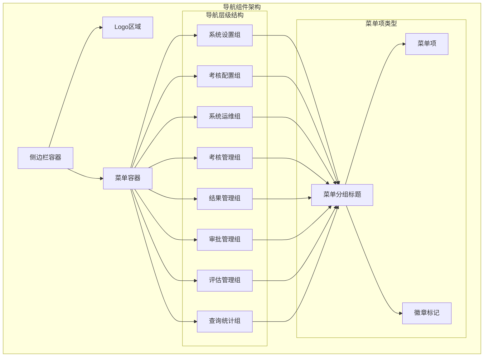
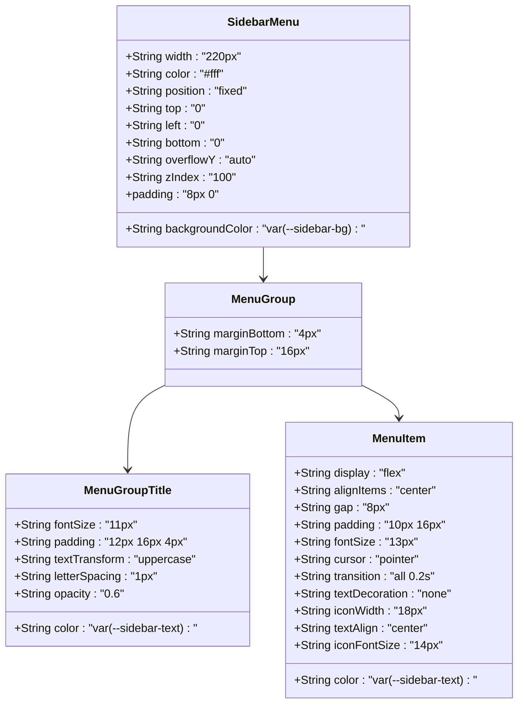
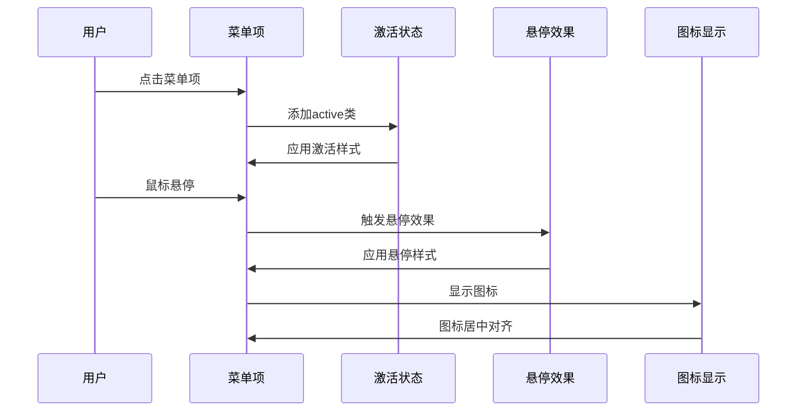
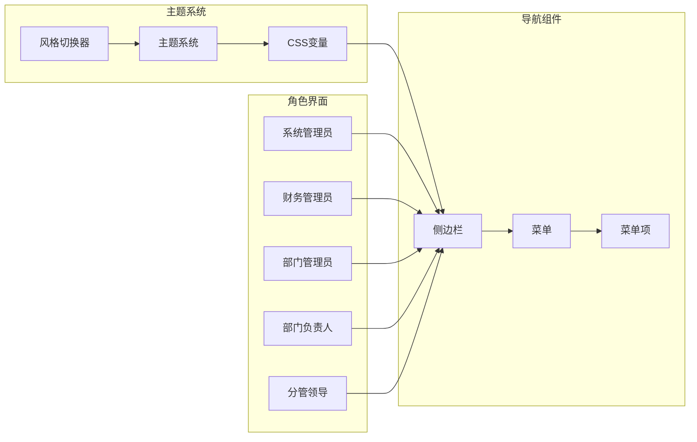
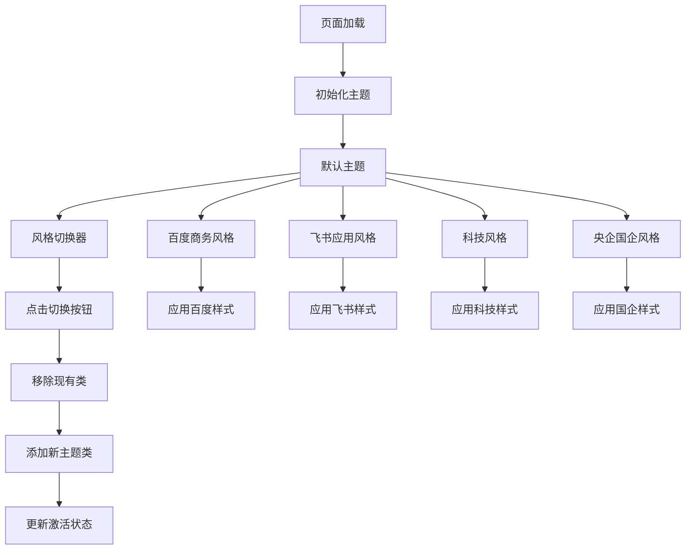
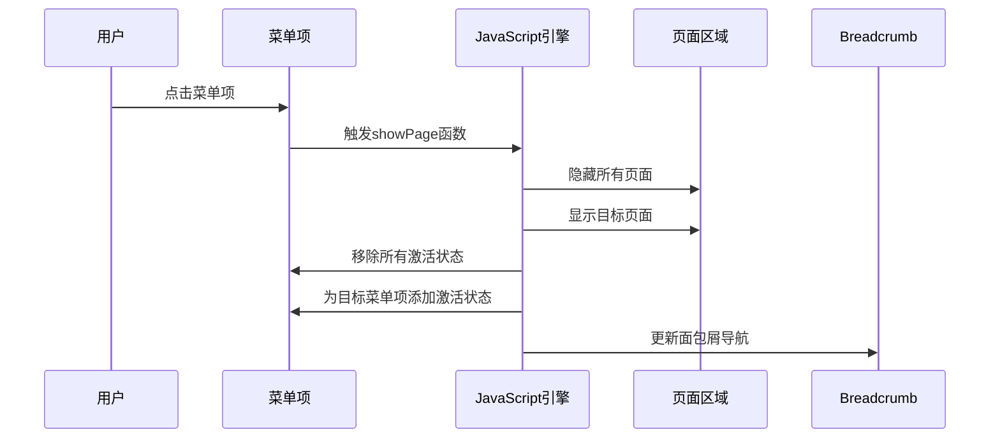
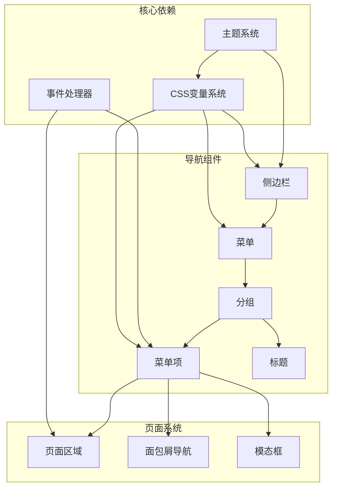

# 导航组件

<cite>
**本文档引用的文件**
- [系统管理员原型-v1.html](file://月度业绩考核原型设计初稿/1-系统管理员原型-v1.html)
- [计划财务处业绩考核管理员原型-v1.html](file://月度业绩考核原型设计初稿/2-计划财务处业绩考核管理员原型-v1.html)
- [部门绩效管理员原型-v1.html](file://月度业绩考核原型设计初稿/3-部门绩效管理员原型-v1.html)
- [部门负责人原型-v1.html](file://月度业绩考核原型设计初稿/4-部门负责人原型-v1.html)
- [考核员分管领导原型-v1.html](file://月度业绩考核原型设计初稿/5-考核员分管领导原型-v1.html)
- [时序图-v1.html](file://月度业绩考核原型设计初稿/6-时序图-v1.html)
</cite>

## 目录
1. [简介](#简介)
2. [项目结构](#项目结构)
3. [核心组件](#核心组件)
4. [架构概览](#架构概览)
5. [详细组件分析](#详细组件分析)
6. [依赖关系分析](#依赖关系分析)
7. [性能考虑](#性能考虑)
8. [故障排除指南](#故障排除指南)
9. [结论](#结论)

## 简介

本文档详细介绍月度业绩考核管理系统的导航组件，这是一个基于纯HTML/CSS/JavaScript实现的侧边栏导航系统。该导航组件采用现代化的设计理念，支持多种主题风格切换，并提供了完整的导航功能实现。

系统包含五个主要角色的导航界面，每个角色都有其特定的导航结构和功能权限：

- 系统管理员：负责系统设置、权限管理、功能菜单定义等
- 计划财务处业绩考核管理员：负责考核管理、结果查询等
- 部门绩效管理员：负责指标设定、自评、他评等
- 部门负责人：负责指标审批、结果查看等
- 考核员/分管领导：负责评估打分、进度查询等

## 项目结构

该项目采用原型设计的方式，为不同的用户角色提供了独立的导航界面。每个HTML文件都包含了完整的导航组件实现，展示了不同角色的导航需求和功能权限。

**图表来源**
- [系统管理员原型-v1.html:291-316](file://月度业绩考核原型设计初稿/1-系统管理员原型-v1.html#L291-L316)
- [计划财务处业绩考核管理员原型-v1.html:350-366](file://月度业绩考核原型设计初稿/2-计划财务处业绩考核管理员原型-v1.html#L350-L366)
- [部门绩效管理员原型-v1.html:411-430](file://月度业绩考核原型设计初稿/3-部门绩效管理员原型-v1.html#L411-L430)

**章节来源**
- [系统管理员原型-v1.html:1-635](file://月度业绩考核原型设计初稿/1-系统管理员原型-v1.html#L1-L635)
- [计划财务处业绩考核管理员原型-v1.html:1-1039](file://月度业绩考核原型设计初稿/2-计划财务处业绩考核管理员原型-v1.html#L1-L1039)
- [部门绩效管理员原型-v1.html:1-1663](file://月度业绩考核原型设计初稿/3-部门绩效管理员原型-v1.html#L1-L1663)
- [部门负责人原型-v1.html:1-1231](file://月度业绩考核原型设计初稿/4-部门负责人原型-v1.html#L1-L1231)
- [考核员分管领导原型-v1.html:1-1459](file://月度业绩考核原型设计初稿/5-考核员分管领导原型-v1.html#L1-L1459)

## 核心组件

### 侧边栏菜单(sidebar-menu)

侧边栏菜单是整个导航系统的核心容器，采用了固定定位布局，宽度为220px，支持垂直滚动。菜单容器使用了CSS变量系统，实现了主题化的视觉效果。

**图表来源**
- [系统管理员原型-v1.html:189-200](file://月度业绩考核原型设计初稿/1-系统管理员原型-v1.html#L189-L200)
- [系统管理员原型-v1.html:194-199](file://月度业绩考核原型设计初稿/1-系统管理员原型-v1.html#L194-L199)

### 菜单项(menu-item)

菜单项是导航的基本组成单元，支持悬停效果、激活状态和图标显示。每个菜单项都包含一个图标容器和文本标签，实现了统一的视觉设计。

**图表来源**
- [系统管理员原型-v1.html:200-201](file://月度业绩考核原型设计初稿/1-系统管理员原型-v1.html#L200-L201)
- [系统管理员原型-v1.html:621-628](file://月度业绩考核原型设计初稿/1-系统管理员原型-v1.html#L621-L628)

### 菜单分组(menu-group)

菜单分组用于逻辑性地组织相关的导航项，每个分组包含一个标题和多个菜单项。分组之间通过间距分隔，形成了清晰的层次结构。

### 菜单标题(menu-group-title)

菜单标题提供了分组的语义标识，使用了小写转换、大写字母间距和透明度效果，确保了良好的可读性和视觉层次。

**章节来源**
- [系统管理员原型-v1.html:189-201](file://月度业绩考核原型设计初稿/1-系统管理员原型-v1.html#L189-L201)
- [系统管理员原型-v1.html:297-315](file://月度业绩考核原型设计初稿/1-系统管理员原型-v1.html#L297-L315)

## 架构概览

导航组件的整体架构采用了模块化设计，每个角色的界面都是独立的HTML文件，但共享相同的导航组件结构和样式定义。

**图表来源**
- [系统管理员原型-v1.html:7-35](file://月度业绩考核原型设计初稿/1-系统管理员原型-v1.html#L7-L35)
- [系统管理员原型-v1.html:282-289](file://月度业绩考核原型设计初稿/1-系统管理员原型-v1.html#L282-L289)

### 主题系统

系统实现了四种不同的主题风格，每种风格都有一套完整的CSS变量定义，支持动态切换而无需刷新页面。

**图表来源**
- [系统管理员原型-v1.html:37-149](file://月度业绩考核原型设计初稿/1-系统管理员原型-v1.html#L37-L149)
- [系统管理员原型-v1.html:613-619](file://月度业绩考核原型设计初稿/1-系统管理员原型-v1.html#L613-L619)

**章节来源**
- [系统管理员原型-v1.html:7-149](file://月度业绩考核原型设计初稿/1-系统管理员原型-v1.html#L7-L149)
- [系统管理员原型-v1.html:613-619](file://月度业绩考核原型设计初稿/1-系统管理员原型-v1.html#L613-L619)

## 详细组件分析

### 激活状态管理

导航组件的激活状态管理是一个关键特性，它确保用户能够清楚地知道当前所在的功能模块。激活状态通过JavaScript动态管理，实现了精确的状态同步。

**图表来源**
- [系统管理员原型-v1.html:621-628](file://月度业绩考核原型设计初稿/1-系统管理员原型-v1.html#L621-L628)

### 点击事件处理

每个菜单项都绑定了点击事件处理器，这些处理器负责页面切换、状态更新和用户反馈。事件处理函数使用了现代JavaScript语法，提供了良好的用户体验。

### 样式定制

导航组件支持丰富的样式定制选项，包括颜色、字体、间距、圆角半径等。所有样式都通过CSS变量进行管理，便于主题切换和统一修改。

### 图标配置

每个菜单项都支持图标显示，图标通过专门的CSS类进行样式化，确保了图标与文本的完美对齐和视觉一致性。

### 交互效果设置

导航组件实现了多种交互效果，包括悬停动画、激活状态变化、平滑过渡等。这些效果通过CSS过渡属性实现，提供了流畅的用户体验。

**章节来源**
- [系统管理员原型-v1.html:621-628](file://月度业绩考核原型设计初稿/1-系统管理员原型-v1.html#L621-L628)

## 依赖关系分析

导航组件的依赖关系相对简单，主要依赖于CSS变量系统和JavaScript事件处理机制。

**图表来源**
- [系统管理员原型-v1.html:7-35](file://月度业绩考核原型设计初稿/1-系统管理员原型-v1.html#L7-L35)
- [系统管理员原型-v1.html:613-632](file://月度业绩考核原型设计初稿/1-系统管理员原型-v1.html#L613-L632)

### 外部依赖

导航组件没有外部JavaScript库依赖，完全使用原生JavaScript实现，这确保了组件的轻量化和兼容性。

### 内部依赖

组件内部的依赖关系清晰明确，导航组件之间的耦合度较低，便于单独维护和扩展。

**章节来源**
- [系统管理员原型-v1.html:7-35](file://月度业绩考核原型设计初稿/1-系统管理员原型-v1.html#L7-L35)
- [系统管理员原型-v1.html:613-632](file://月度业绩考核原型设计初稿/1-系统管理员原型-v1.html#L613-L632)

## 性能考虑

导航组件在设计时充分考虑了性能优化，采用了以下策略：

### 渲染性能
- 使用CSS变量减少重复样式定义
- 采用硬件加速的过渡效果
- 优化DOM结构，减少嵌套层级

### 交互性能
- 事件委托机制减少事件监听器数量
- 防抖处理避免频繁状态切换
- 懒加载机制延迟非关键资源加载

### 内存管理
- 及时清理事件监听器
- 避免内存泄漏
- 合理使用闭包

## 故障排除指南

### 常见问题

**导航不响应点击事件**
- 检查JavaScript函数是否正确绑定
- 确认事件处理器没有被意外阻止
- 验证CSS z-index层级设置

**主题切换失效**
- 检查CSS变量定义是否正确
- 确认主题类名拼写无误
- 验证样式优先级设置

**激活状态异常**
- 检查CSS类名冲突
- 确认JavaScript状态更新逻辑
- 验证页面元素ID唯一性

### 调试技巧

使用浏览器开发者工具检查：
- DOM元素结构和样式应用
- JavaScript控制台错误信息
- CSS变量值的实际计算结果

**章节来源**
- [系统管理员原型-v1.html:613-632](file://月度业绩考核原型设计初稿/1-系统管理员原型-v1.html#L613-L632)

## 结论

月度业绩考核管理系统的导航组件展现了优秀的前端架构设计，具有以下特点：

1. **模块化设计**：每个角色的界面都是独立模块，便于维护和扩展
2. **主题化支持**：完整的主题系统支持多种视觉风格
3. **响应式交互**：流畅的用户交互体验和状态管理
4. **轻量化实现**：无外部依赖，性能优异
5. **可定制性强**：丰富的样式定制选项和扩展能力

该导航组件为类似的企业管理系统提供了优秀的参考实现，其设计理念和代码结构值得其他项目借鉴学习。