# 布局组件

<cite>
**本文档引用的文件**
- [系统管理员原型-v1.html](file://月度业绩考核原型设计初稿/1-系统管理员原型-v1.html)
- [计划财务处业绩考核管理员原型-v1.html](file://月度业绩考核原型设计初稿/2-计划财务处业绩考核管理员原型-v1.html)
- [部门绩效管理员原型-v1.html](file://月度业绩考核原型设计初稿/3-部门绩效管理员原型-v1.html)
- [部门负责人原型-v1.html](file://月度业绩考核原型设计初稿/4-部门负责人原型-v1.html)
- [考核员分管领导原型-v1.html](file://月度业绩考核原型设计初稿/5-考核员分管领导原型-v1.html)
- [时序图-v1.html](file://月度业绩考核原型设计初稿/6-时序图-v1.html)
</cite>

## 目录
1. [简介](#简介)
2. [项目结构](#项目结构)
3. [核心组件](#核心组件)
4. [架构概览](#架构概览)
5. [详细组件分析](#详细组件分析)
6. [依赖分析](#依赖分析)
7. [性能考虑](#性能考虑)
8. [故障排除指南](#故障排除指南)
9. [结论](#结论)
10. [附录](#附录)

## 简介

本项目是一套完整的月度业绩考核管理系统原型，采用纯HTML+CSS+JavaScript实现，展示了企业级应用的典型布局结构。系统通过统一的CSS变量体系实现了主题风格切换，支持四种不同的视觉风格（默认、百度商务、飞书应用、科技风、央企国企风格）。

该布局系统的核心特色包括：
- **响应式设计**：基于Flexbox的流式布局，适配不同屏幕尺寸
- **主题系统**：通过CSS自定义属性实现全局主题切换
- **组件化结构**：清晰的侧边栏、顶部工具栏、主内容区划分
- **交互式导航**：支持页面切换和模态对话框
- **状态管理**：通过JavaScript实现动态内容更新

## 项目结构

项目采用按角色划分的原型文件结构，每个文件代表一个用户角色的工作界面：

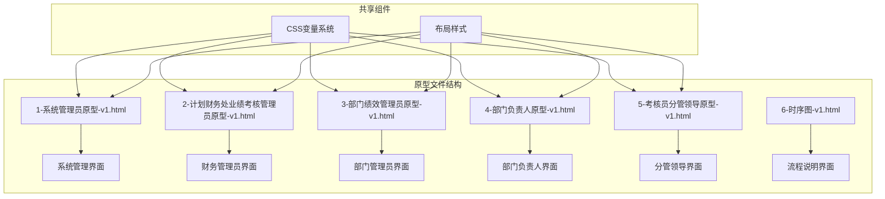

**图表来源**
- [系统管理员原型-v1.html:1-635](file://月度业绩考核原型设计初稿/1-系统管理员原型-v1.html#L1-L635)
- [计划财务处业绩考核管理员原型-v1.html:1-1039](file://月度业绩考核原型设计初稿/2-计划财务处业绩考核管理员原型-v1.html#L1-L1039)

**章节来源**
- [系统管理员原型-v1.html:1-635](file://月度业绩考核原型设计初稿/1-系统管理员原型-v1.html#L1-L635)
- [计划财务处业绩考核管理员原型-v1.html:1-1039](file://月度业绩考核原型设计初稿/2-计划财务处业绩考核管理员原型-v1.html#L1-L1039)

## 核心组件

### 布局容器系统

系统采用统一的布局容器结构，所有页面都遵循相同的布局模式：

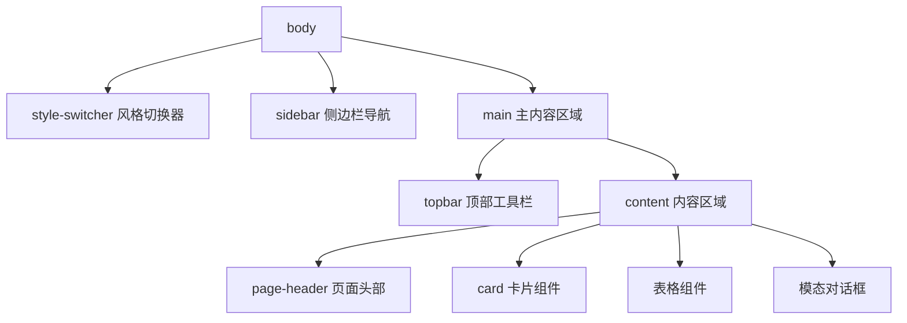

**图表来源**
- [系统管理员原型-v1.html:280-635](file://月度业绩考核原型设计初稿/1-系统管理员原型-v1.html#L280-L635)
- [部门绩效管理员原型-v1.html:400-765](file://月度业绩考核原型设计初稿/3-部门绩效管理员原型-v1.html#L400-L765)

### CSS变量系统

系统通过CSS自定义属性实现主题化设计：

| 变量类别 | 变量名 | 默认值 | 用途 |
|---------|--------|--------|------|
| 颜色变量 | --primary | #2d5aa0 | 主色调 |
| 颜色变量 | --sidebar-bg | #001529 | 侧边栏背景色 |
| 颜色变量 | --topbar-bg | #fff | 顶部栏背景色 |
| 尺寸变量 | --sidebar-width | 220px | 侧边栏宽度 |
| 圆角变量 | --radius | 6px | 基础圆角半径 |
| 阴影变量 | --card-shadow | 0 1px 3px rgba(0,0,0,0.06) | 卡片阴影 |

**章节来源**
- [系统管理员原型-v1.html:8-35](file://月度业绩考核原型设计初稿/1-系统管理员原型-v1.html#L8-L35)
- [部门负责人原型-v1.html:8-10](file://月度业绩考核原型设计初稿/4-部门负责人原型-v1.html#L8-L10)

## 架构概览

系统采用模块化的组件架构，每个页面都是独立的原型文件，但共享相同的布局结构和样式系统：

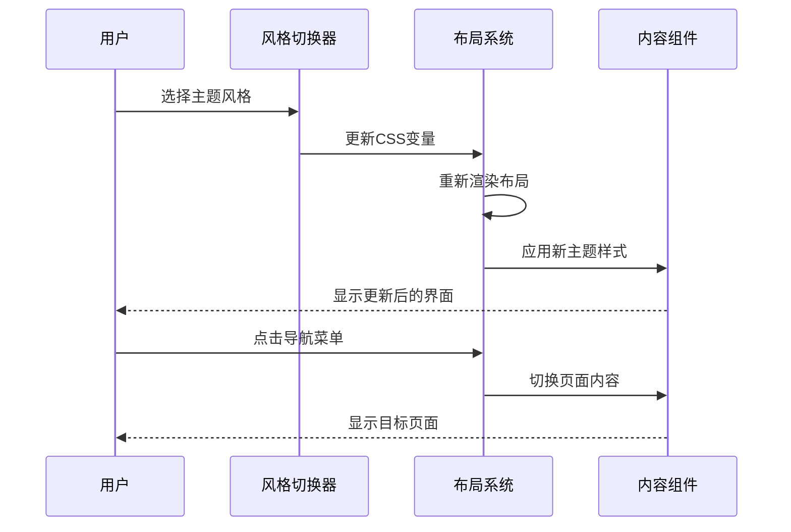

**图表来源**
- [系统管理员原型-v1.html:612-632](file://月度业绩考核原型设计初稿/1-系统管理员原型-v1.html#L612-L632)
- [部门绩效管理员原型-v1.html:766-766](file://月度业绩考核原型设计初稿/3-部门绩效管理员原型-v1.html#L766-L766)

## 详细组件分析

### 侧边栏导航组件

侧边栏是系统的主导航组件，采用固定定位设计，支持多级菜单结构：

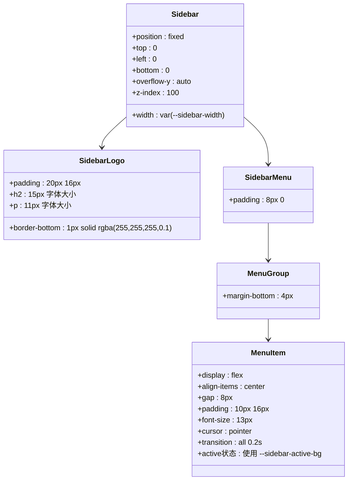

**图表来源**
- [系统管理员原型-v1.html:189-200](file://月度业绩考核原型设计初稿/1-系统管理员原型-v1.html#L189-L200)
- [部门负责人原型-v1.html:11-24](file://月度业绩考核原型设计初稿/4-部门负责人原型-v1.html#L11-L24)

#### 侧边栏特性

- **固定定位**：使用`position: fixed`确保侧边栏始终可见
- **滚动支持**：`overflow-y: auto`处理长菜单列表
- **层级管理**：`z-index: 100`确保侧边栏在其他元素之上
- **响应式宽度**：通过CSS变量`--sidebar-width`控制宽度

**章节来源**
- [系统管理员原型-v1.html:189-200](file://月度业绩考核原型设计初稿/1-系统管理员原型-v1.html#L189-L200)
- [部门绩效管理员原型-v1.html:411-430](file://月度业绩考核原型设计初稿/3-部门绩效管理员原型-v1.html#L411-L430)

### 顶部工具栏组件

顶部工具栏提供页面导航和用户信息展示功能：

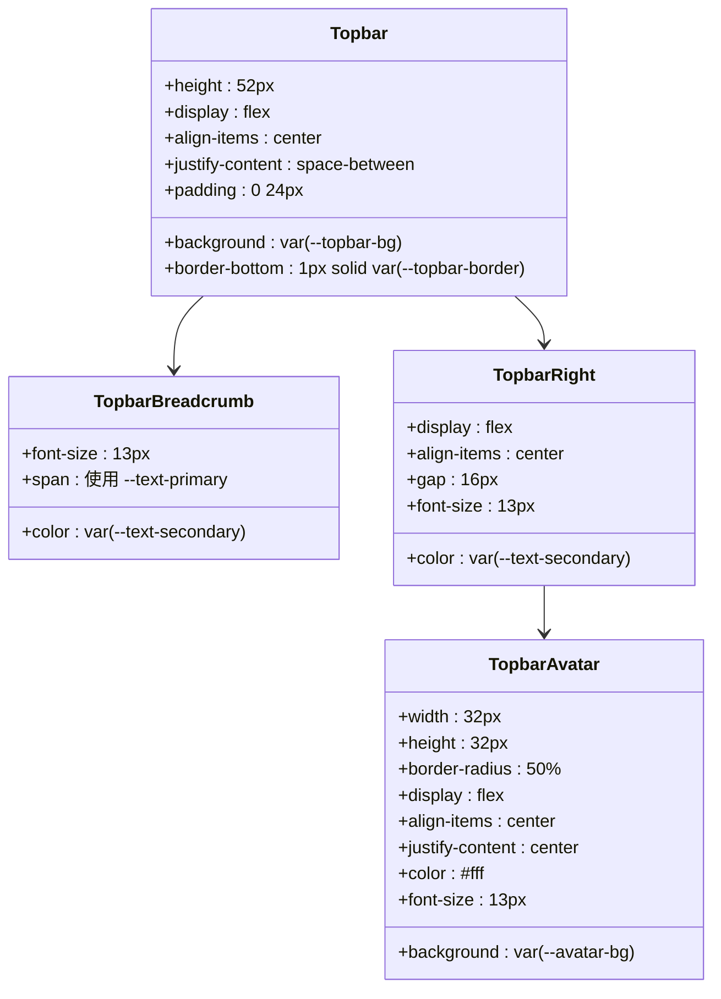

**图表来源**
- [系统管理员原型-v1.html:202-208](file://月度业绩考核原型设计初稿/1-系统管理员原型-v1.html#L202-L208)
- [部门负责人原型-v1.html:25-32](file://月度业绩考核原型设计初稿/4-部门负责人原型-v1.html#L25-L32)

#### 顶部工具栏特性

- **弹性布局**：使用`display: flex`实现左右内容分离
- **面包屑导航**：显示当前页面路径，支持动态更新
- **用户信息**：展示用户名和头像，支持版本标签
- **响应式设计**：在小屏幕上自动调整间距和字体大小

**章节来源**
- [系统管理员原型-v1.html:202-208](file://月度业绩考核原型设计初稿/1-系统管理员原型-v1.html#L202-L208)
- [部门绩效管理员原型-v1.html:433-441](file://月度业绩考核原型设计初稿/3-部门绩效管理员原型-v1.html#L433-L441)

### 主内容区域组件

主内容区域负责承载页面主要内容，采用Flexbox布局实现自适应高度：

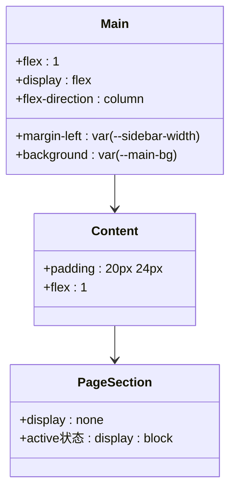

**图表来源**
- [系统管理员原型-v1.html:202-203](file://月度业绩考核原型设计初稿/1-系统管理员原型-v1.html#L202-L203)
- [部门负责人原型-v1.html:368-376](file://月度业绩考核原型设计初稿/4-部门负责人原型-v1.html#L368-L376)

#### 主内容区域特性

- **自适应宽度**：通过`margin-left: var(--sidebar-width)`自动调整宽度
- **Flexbox布局**：实现内容区域的自适应高度填充
- **页面切换**：通过CSS类控制页面显示/隐藏
- **滚动优化**：内容区域支持垂直滚动

**章节来源**
- [系统管理员原型-v1.html:202-203](file://月度业绩考核原型设计初稿/1-系统管理员原型-v1.html#L202-L203)
- [部门绩效管理员原型-v1.html:763-764](file://月度业绩考核原型设计初稿/3-部门绩效管理员原型-v1.html#L763-L764)

### 页面头部组件

页面头部提供页面标题和描述信息：

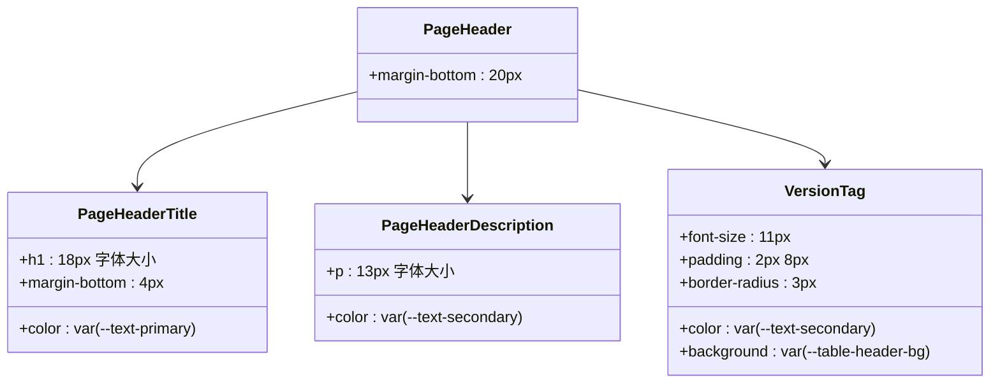

**图表来源**
- [系统管理员原型-v1.html:209-213](file://月度业绩考核原型设计初稿/1-系统管理员原型-v1.html#L209-L213)
- [部门负责人原型-v1.html:220-224](file://月度业绩考核原型设计初稿/4-部门负责人原型-v1.html#L220-L224)

#### 页面头部特性

- **信息层次**：清晰的标题-描述-标签信息层次
- **版本标识**：支持显示页面版本信息
- **响应式设计**：在小屏幕上自动调整字体大小
- **样式一致性**：与整体主题保持一致的颜色方案

**章节来源**
- [系统管理员原型-v1.html:209-213](file://月度业绩考核原型设计初稿/1-系统管理员原型-v1.html#L209-L213)
- [部门绩效管理员原型-v1.html:445-450](file://月度业绩考核原型设计初稿/3-部门绩效管理员原型-v1.html#L445-L450)

### 卡片组件系统

卡片组件是系统的主要内容容器，提供统一的视觉风格和交互行为：

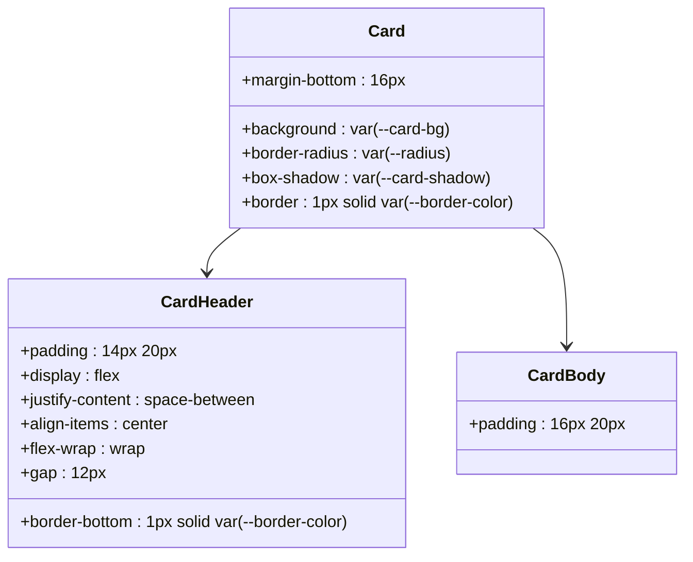

**图表来源**
- [系统管理员原型-v1.html:214-218](file://月度业绩考核原型设计初稿/1-系统管理员原型-v1.html#L214-L218)
- [部门负责人原型-v1.html:225-230](file://月度业绩考核原型设计初稿/4-部门负责人原型-v1.html#L225-L230)

#### 卡片组件特性

- **统一样式**：所有卡片遵循相同的圆角、阴影和边框样式
- **灵活布局**：卡片头部支持弹性布局，适应不同内容排列
- **响应式设计**：在小屏幕上自动调整内边距和间距
- **主题兼容**：与CSS变量系统完全兼容，支持主题切换

**章节来源**
- [系统管理员原型-v1.html:214-218](file://月度业绩考核原型设计初稿/1-系统管理员原型-v1.html#L214-L218)
- [部门绩效管理员原型-v1.html:443-446](file://月度业绩考核原型设计初稿/3-部门绩效管理员原型-v1.html#L443-L446)

### 表格组件系统

表格组件提供数据展示和交互功能，支持多种状态显示：

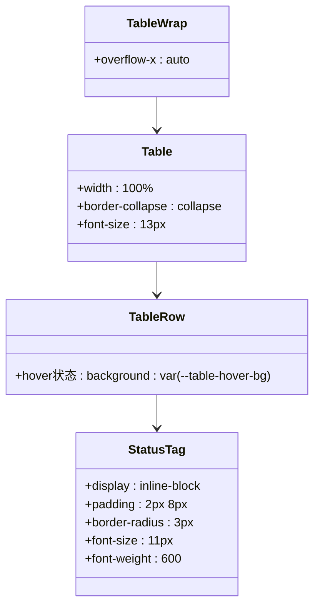

**图表来源**
- [系统管理员原型-v1.html:234-244](file://月度业绩考核原型设计初稿/1-系统管理员原型-v1.html#L234-L244)
- [部门负责人原型-v1.html:252-265](file://月度业绩考核原型设计初稿/4-部门负责人原型-v1.html#L252-L265)

#### 表格组件特性

- **横向滚动**：支持超宽表格的横向滚动查看
- **状态标签**：提供多种状态的颜色标识
- **悬停效果**：行悬停时显示高亮背景
- **响应式设计**：在小屏幕上自动调整字体大小

**章节来源**
- [系统管理员原型-v1.html:234-244](file://月度业绩考核原型设计初稿/1-系统管理员原型-v1.html#L234-L244)
- [部门绩效管理员原型-v1.html:525-529](file://月度业绩考核原型设计初稿/3-部门绩效管理员原型-v1.html#L525-L529)

### 模态对话框组件

模态对话框提供弹窗交互功能，支持多种尺寸和内容类型：

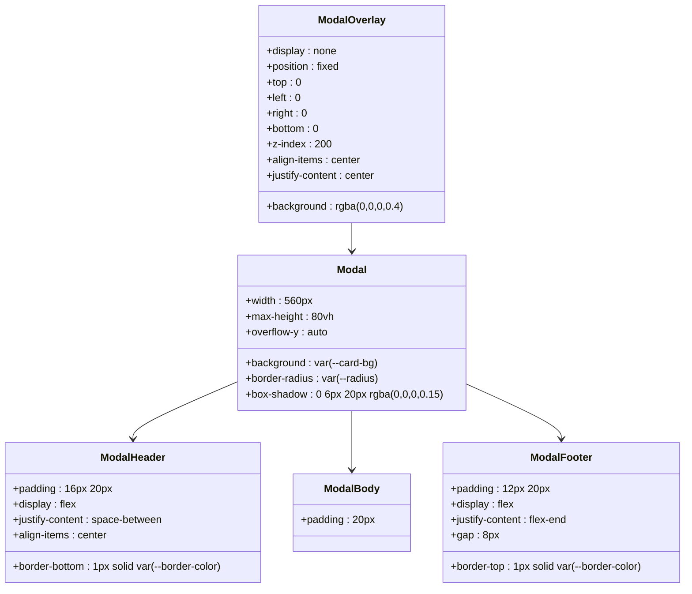

**图表来源**
- [系统管理员原型-v1.html:249-258](file://月度业绩考核原型设计初稿/1-系统管理员原型-v1.html#L249-L258)
- [部门负责人原型-v1.html:271-282](file://月度业绩考核原型设计初稿/4-部门负责人原型-v1.html#L271-L282)

#### 模态对话框特性

- **遮罩层**：提供半透明遮罩背景
- **居中显示**：使用Flexbox实现水平垂直居中
- **滚动处理**：内容超出时支持垂直滚动
- **尺寸变体**：支持标准、大型、超大等多种尺寸

**章节来源**
- [系统管理员原型-v1.html:249-258](file://月度业绩考核原型设计初稿/1-系统管理员原型-v1.html#L249-L258)
- [部门绩效管理员原型-v1.html:766-766](file://月度业绩考核原型设计初稿/3-部门绩效管理员原型-v1.html#L766-L766)

## 依赖分析

系统采用松耦合的组件设计，各组件之间的依赖关系清晰：

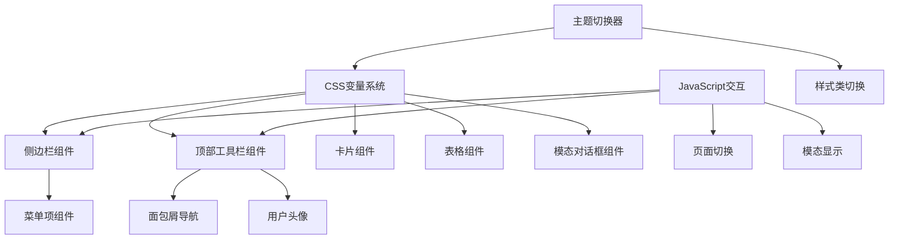

**图表来源**
- [系统管理员原型-v1.html:612-632](file://月度业绩考核原型设计初稿/1-系统管理员原型-v1.html#L612-L632)
- [部门负责人原型-v1.html:560-567](file://月度业绩考核原型设计初稿/4-部门负责人原型-v1.html#L560-L567)

### 组件耦合度分析

- **低耦合设计**：各组件通过CSS类名相互引用，无直接代码依赖
- **主题独立性**：组件样式完全依赖CSS变量，便于主题切换
- **交互解耦**：JavaScript逻辑集中在少量函数中，避免全局污染
- **扩展友好**：新增组件只需遵循现有CSS类约定即可集成

**章节来源**
- [系统管理员原型-v1.html:612-632](file://月度业绩考核原型设计初稿/1-系统管理员原型-v1.html#L612-L632)
- [部门绩效管理员原型-v1.html:766-766](file://月度业绩考核原型设计初稿/3-部门绩效管理员原型-v1.html#L766-L766)

## 性能考虑

### 样式性能优化

1. **CSS变量缓存**：浏览器会缓存CSS变量计算结果，减少重排重绘
2. **硬件加速**：使用`transform`和`opacity`属性触发GPU加速
3. **最小化重绘**：通过`will-change`属性提示浏览器优化动画

### JavaScript性能优化

1. **事件委托**：使用事件冒泡机制减少事件监听器数量
2. **防抖节流**：对resize等高频事件使用防抖处理
3. **DOM访问优化**：缓存DOM查询结果，避免重复查询

### 响应式性能

1. **媒体查询优化**：使用`max-width`和`min-width`减少复杂计算
2. **图片懒加载**：对大图片使用懒加载策略
3. **CSS Grid/Flexbox**：现代布局属性相比传统定位更高效

## 故障排除指南

### 常见问题及解决方案

#### 侧边栏显示异常
**问题症状**：侧边栏无法正常显示或定位错误
**可能原因**：
- CSS变量值设置错误
- z-index层级冲突
- 浏览器兼容性问题

**解决步骤**：
1. 检查`--sidebar-width`变量值是否正确
2. 确认`z-index`值大于其他元素
3. 验证浏览器对CSS变量的支持情况

#### 页面内容溢出
**问题症状**：页面内容超出可视区域
**可能原因**：
- 内容过多导致滚动条出现
- 布局计算错误
- 屏幕尺寸适配问题

**解决步骤**：
1. 检查`overflow-y`属性设置
2. 验证Flexbox布局计算
3. 测试不同屏幕尺寸下的表现

#### 主题切换失效
**问题症状**：主题切换后样式未更新
**可能原因**：
- CSS变量更新未触发重绘
- JavaScript执行错误
- 样式优先级问题

**解决步骤**：
1. 检查CSS变量更新逻辑
2. 验证JavaScript函数执行
3. 确认样式类名正确应用

**章节来源**
- [系统管理员原型-v1.html:612-632](file://月度业绩考核原型设计初稿/1-系统管理员原型-v1.html#L612-L632)
- [部门负责人原型-v1.html:560-567](file://月度业绩考核原型设计初稿/4-部门负责人原型-v1.html#L560-L567)

## 结论

这套布局组件系统展现了现代Web应用的优秀实践：

### 设计优势
- **主题化设计**：通过CSS变量实现真正的主题切换
- **组件化架构**：清晰的组件边界和职责分离
- **响应式布局**：适配各种设备和屏幕尺寸
- **可扩展性**：易于添加新组件和功能

### 技术亮点
- **纯前端实现**：无需后端支持即可展示完整功能
- **语义化HTML**：良好的可访问性和SEO友好性
- **渐进增强**：基础功能在旧浏览器中也能正常工作

### 改进建议
1. **增加暗色主题**：满足用户个性化需求
2. **优化移动端体验**：针对触摸设备进行专门优化
3. **添加无障碍支持**：提升残障用户的使用体验
4. **引入构建工具**：提高开发效率和代码质量

这套布局组件为类似的企业级应用提供了优秀的参考模板，其设计理念和实现方式值得在实际项目中借鉴和应用。

## 附录

### 组件属性配置表

| 组件名称 | 关键属性 | 默认值 | 说明 |
|---------|----------|--------|------|
| 侧边栏宽度 | --sidebar-width | 220px | 控制侧边栏宽度 |
| 主色调 | --primary | #2d5aa0 | 系统主色调 |
| 侧边栏背景 | --sidebar-bg | #001529 | 侧边栏背景颜色 |
| 顶部栏背景 | --topbar-bg | #fff | 顶部工具栏背景 |
| 卡片阴影 | --card-shadow | 0 1px 3px rgba(0,0,0,0.06) | 卡片投影效果 |
| 圆角半径 | --radius | 6px | 基础圆角大小 |

### 响应式断点

| 断点类型 | 最小宽度 | 适用场景 |
|---------|----------|----------|
| 移动设备 | 0px | 手机端显示 |
| 平板设备 | 768px | 平板端显示 |
| 桌面设备 | 1024px | 桌面端显示 |
| 大屏设备 | 1200px | 大屏幕显示 |

### 主题变量对照表

| 主题名称 | 主色调 | 侧边栏背景 | 顶部栏背景 |
|---------|--------|------------|------------|
| 默认风格 | #2d5aa0 | #001529 | #fff |
| 百度商务 | #2932e1 | #f5f5f5 | #fff |
| 飞书应用 | #3370ff | #1f2329 | #fff |
| 科技风 | #00d4ff | #0d1117 | #161b22 |
| 央企国企 | #c41e3a | #b81c22 | #fff |