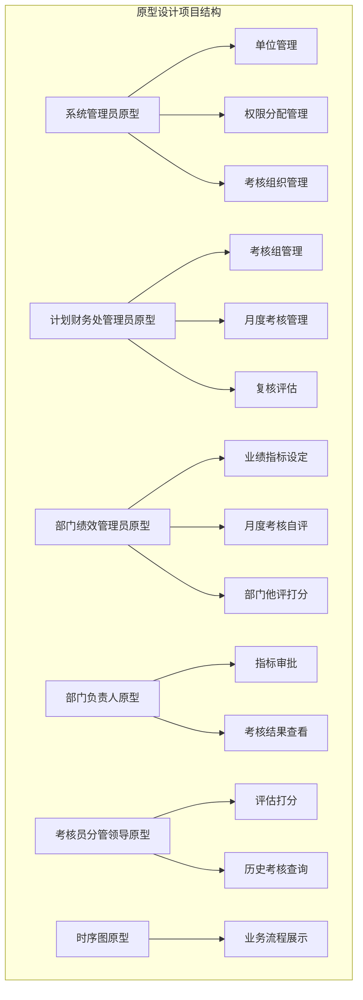
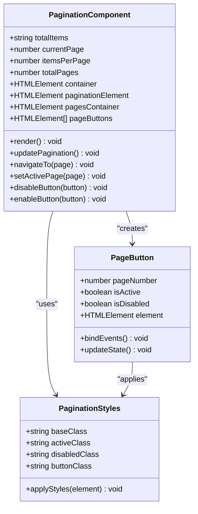
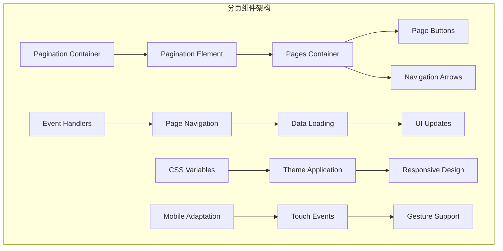
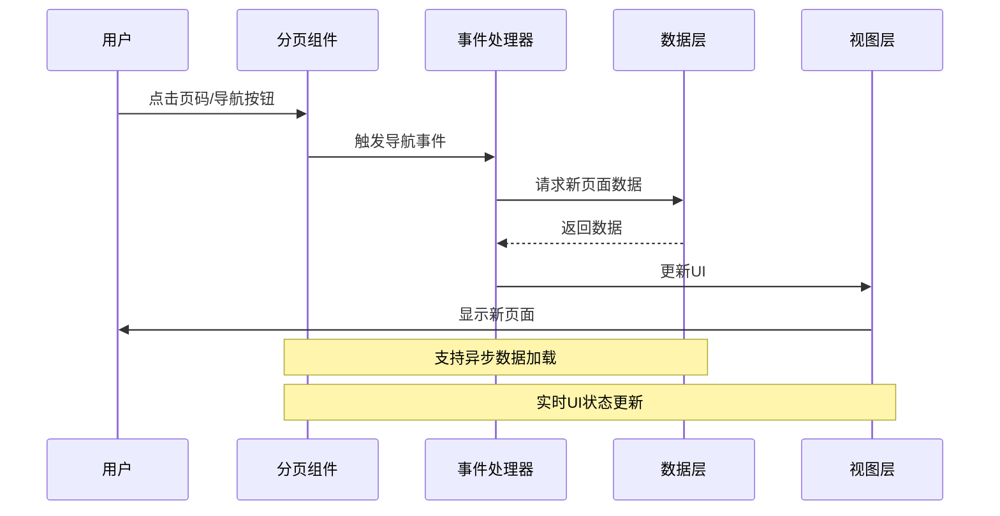
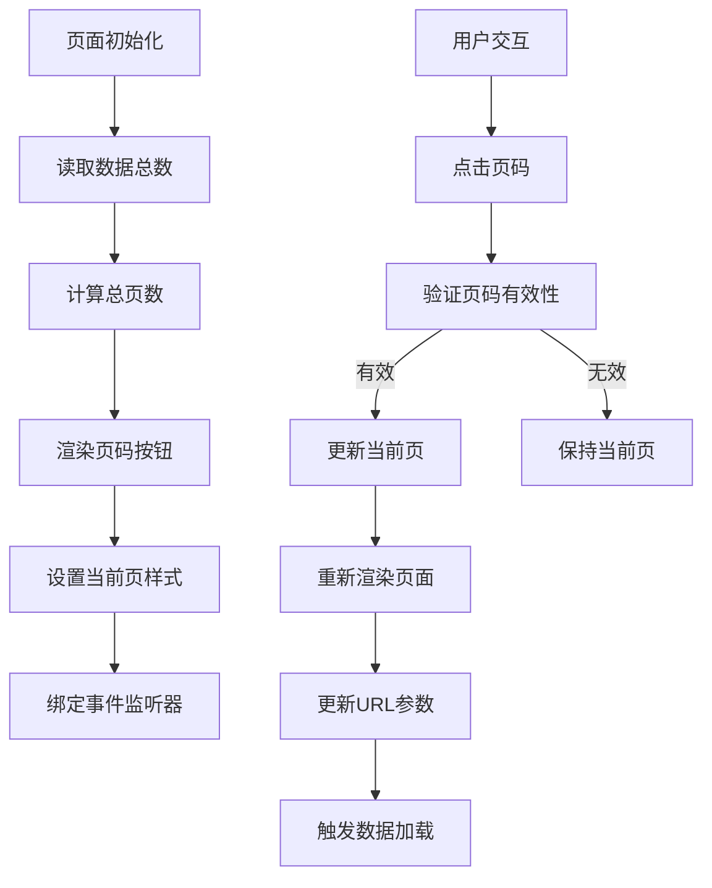
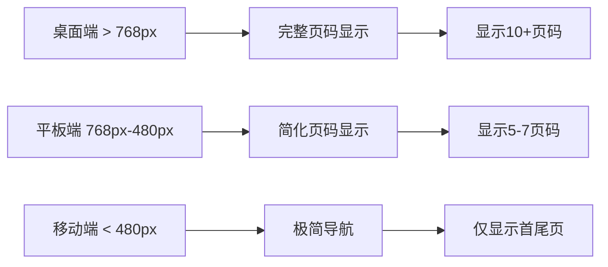
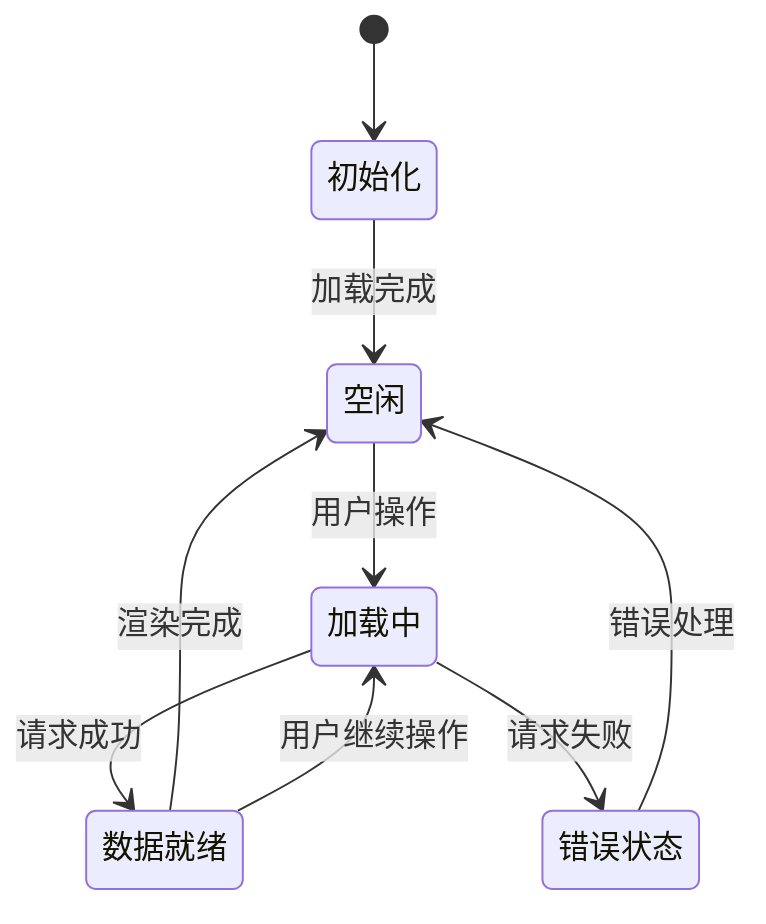
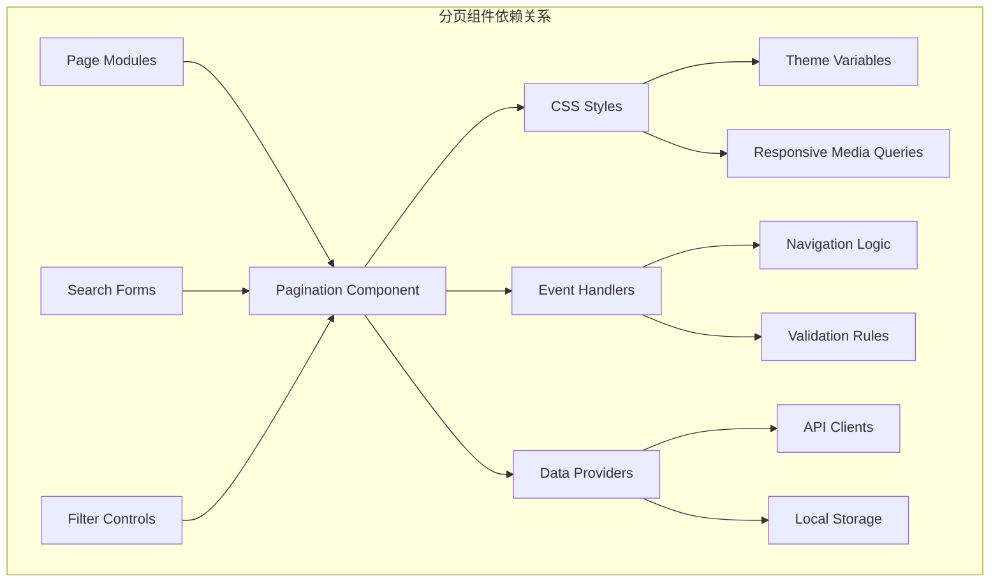

# 分页组件

<cite>
**本文档引用的文件**
- [系统管理员原型-v1.html](file://月度业绩考核原型设计初稿/1-系统管理员原型-v1.html)
- [计划财务处业绩考核管理员原型-v1.html](file://月度业绩考核原型设计初稿/2-计划财务处业绩考核管理员原型-v1.html)
- [部门绩效管理员原型-v1.html](file://月度业绩考核原型设计初稿/3-部门绩效管理员原型-v1.html)
- [部门负责人原型-v1.html](file://月度业绩考核原型设计初稿/4-部门负责人原型-v1.html)
- [考核员分管领导原型-v1.html](file://月度业绩考核原型设计初稿/5-考核员分管领导原型-v1.html)
- [时序图-v1.html](file://月度业绩考核原型设计初稿/6-时序图-v1.html)
</cite>

## 目录
1. [简介](#简介)
2. [项目结构](#项目结构)
3. [核心组件](#核心组件)
4. [架构概览](#架构概览)
5. [详细组件分析](#详细组件分析)
6. [依赖关系分析](#依赖关系分析)
7. [性能考虑](#性能考虑)
8. [故障排除指南](#故障排除指南)
9. [结论](#结论)
10. [附录](#附录)

## 简介

分页组件是月度业绩考核管理系统中的关键UI组件，用于处理大量数据的分页显示和导航。该组件在系统管理员、计划财务处业绩考核管理员、部门绩效管理员、部门负责人以及考核员分管领导等多个角色的界面中广泛使用。

分页组件提供了完整的数据导航功能，包括页码显示、跳转功能、当前页标识、样式配置、按钮状态管理和禁用效果设置。它支持响应式设计和移动端适配，确保在不同设备上都能提供良好的用户体验。

## 项目结构

该项目采用多角色原型设计模式，每个角色都有独立的HTML文件，展示了不同的业务场景和功能需求：



**图表来源**
- [系统管理员原型-v1.html:1-635](file://月度业绩考核原型设计初稿/1-系统管理员原型-v1.html#L1-L635)
- [计划财务处业绩考核管理员原型-v1.html:1-1039](file://月度业绩考核原型设计初稿/2-计划财务处业绩考核管理员原型-v1.html#L1-L1039)
- [部门绩效管理员原型-v1.html:1-1663](file://月度业绩考核原型设计初稿/3-部门绩效管理员原型-v1.html#L1-L1663)
- [部门负责人原型-v1.html:1-1231](file://月度业绩考核原型设计初稿/4-部门负责人原型-v1.html#L1-L1231)
- [考核员分管领导原型-v1.html:1-1459](file://月度业绩考核原型设计初稿/5-考核员分管领导原型-v1.html#L1-L1459)
- [时序图-v1.html:1-570](file://月度业绩考核原型设计初稿/6-时序图-v1.html#L1-L570)

**章节来源**
- [系统管理员原型-v1.html:1-635](file://月度业绩考核原型设计初稿/1-系统管理员原型-v1.html#L1-L635)
- [计划财务处业绩考核管理员原型-v1.html:1-1039](file://月度业绩考核原型设计初稿/2-计划财务处业绩考核管理员原型-v1.html#L1-L1039)

## 核心组件

### 分页组件结构设计

分页组件采用简洁而功能完整的HTML结构设计：



**图表来源**
- [系统管理员原型-v1.html:244-249](file://月度业绩考核原型设计初稿/1-系统管理员原型-v1.html#L244-L249)
- [计划财务处业绩考核管理员原型-v1.html:275-279](file://月度业绩考核原型设计初稿/2-计划财务处业绩考核管理员原型-v1.html#L275-L279)

### 样式系统架构

分页组件采用CSS变量驱动的样式系统，支持多种主题风格：

| 主题风格 | CSS变量前缀 | 主要颜色 | 特殊属性 |
|---------|------------|----------|----------|
| 默认风格 | --primary | #2d5aa0 | 标准圆角 |
| 百度商务 | --primary-baidu | #2932e1 | 较大圆角 |
| 飞书应用 | --primary-feishu | #3370ff | 4px圆角 |
| 科技风 | --primary-tech | #00d4ff | 极小圆角 |
| 央企国企 | --primary-guoqi | #c41e3a | 4px圆角 |

**章节来源**
- [系统管理员原型-v1.html:8-149](file://月度业绩考核原型设计初稿/1-系统管理员原型-v1.html#L8-L149)
- [计划财务处业绩考核管理员原型-v1.html:8-184](file://月度业绩考核原型设计初稿/2-计划财务处业绩考核管理员原型-v1.html#L8-L184)

## 架构概览

### 组件交互架构

分页组件在不同角色页面中的集成展现了清晰的架构层次：



**图表来源**
- [系统管理员原型-v1.html:244-249](file://月度业绩考核原型设计初稿/1-系统管理员原型-v1.html#L244-L249)
- [部门绩效管理员原型-v1.html:286-291](file://月度业绩考核原型设计初稿/3-部门绩效管理员原型-v1.html#L286-L291)

### 数据流架构

分页组件的数据流遵循标准的MVVM模式：



**图表来源**
- [系统管理员原型-v1.html:612-632](file://月度业绩考核原型设计初稿/1-系统管理员原型-v1.html#L612-L632)
- [部门负责人原型-v1.html:526-535](file://月度业绩考核原型设计初稿/4-部门负责人原型-v1.html#L526-L535)

**章节来源**
- [系统管理员原型-v1.html:612-632](file://月度业绩考核原型设计初稿/1-系统管理员原型-v1.html#L612-L632)
- [部门负责人原型-v1.html:526-535](file://月度业绩考核原型设计初稿/4-部门负责人原型-v1.html#L526-L535)

## 详细组件分析

### 页面布局与数据展示

分页组件在不同页面中的具体实现展示了多样化的数据展示需求：

#### 系统管理员页面
系统管理员页面的分页组件主要用于管理单位信息和权限分配：



**图表来源**
- [系统管理员原型-v1.html:356](file://月度业绩考核原型设计初稿/1-系统管理员原型-v1.html#L356)
- [系统管理员原型-v1.html:443](file://月度业绩考核原型设计初稿/1-系统管理员原型-v1.html#L443)

#### 计划财务处管理员页面
该页面的分页组件支持复杂的业务流程导航：

| 页面类型 | 数据量 | 页码显示 | 导航功能 |
|---------|--------|----------|----------|
| 考核组管理 | 4条 | 1页 | 上一页/下一页 |
| 月度考核管理 | 56条 | 3页 | 首页/末页 |
| 复核评估 | 14条 | 2页 | 快速跳转 |

**章节来源**
- [计划财务处业绩考核管理员原型-v1.html:444-445](file://月度业绩考核原型设计初稿/2-计划财务处业绩考核管理员原型-v1.html#L444-L445)
- [计划财务处业绩考核管理员原型-v1.html:557](file://月度业绩考核原型设计初稿/2-计划财务处业绩考核管理员原型-v1.html#L557)

### 样式配置与主题系统

分页组件的样式系统采用了现代化的CSS变量技术：

#### 主题变量体系

| 变量类别 | 默认值 | 百度商务 | 飞书应用 | 科技风 | 央企国企 |
|---------|--------|----------|----------|--------|----------|
| --primary | #2d5aa0 | #2932e1 | #3370ff | #00d4ff | #c41e3a |
| --radius | 6px | 8px | 4px | 4px | 4px |
| --radius-sm | 4px | 4px | 4px | 4px | 2px |
| --btn-primary-bg | #2d5aa0 | #2932e1 | #3370ff | #00d4ff | #c41e3a |

#### 响应式断点设计



**图表来源**
- [系统管理员原型-v1.html:244-249](file://月度业绩考核原型设计初稿/1-系统管理员原型-v1.html#L244-L249)
- [部门绩效管理员原型-v1.html:286-291](file://月度业绩考核原型设计初稿/3-部门绩效管理员原型-v1.html#L286-L291)

**章节来源**
- [系统管理员原型-v1.html:244-249](file://月度业绩考核原型设计初稿/1-系统管理员原型-v1.html#L244-L249)
- [部门绩效管理员原型-v1.html:286-291](file://月度业绩考核原型设计初稿/3-部门绩效管理员原型-v1.html#L286-L291)

### 事件处理与交互逻辑

分页组件的事件处理系统支持多种用户交互模式：

#### 核心事件类型

| 事件类型 | 触发条件 | 处理逻辑 | 状态更新 |
|---------|----------|----------|----------|
| 点击页码 | 用户点击具体页码按钮 | 验证页码有效性 | 更新当前页样式 |
| 上一页/下一页 | 点击导航箭头 | 计算相邻页码 | 重新渲染页码 |
| 首页/末页 | 点击边界按钮 | 跳转到第1页/最后一页 | 更新所有按钮状态 |
| 快速跳转 | 输入页码并确认 | 解析输入并验证 | 执行页码跳转 |

#### 异步数据加载机制



**图表来源**
- [系统管理员原型-v1.html:612-632](file://月度业绩考核原型设计初稿/1-系统管理员原型-v1.html#L612-L632)

**章节来源**
- [系统管理员原型-v1.html:612-632](file://月度业绩考核原型设计初稿/1-系统管理员原型-v1.html#L612-L632)

## 依赖关系分析

### 组件耦合度分析

分页组件在项目中的依赖关系展现了良好的模块化设计：



**图表来源**
- [系统管理员原型-v1.html:244-249](file://月度业绩考核原型设计初稿/1-系统管理员原型-v1.html#L244-L249)
- [部门负责人原型-v1.html:526-535](file://月度业绩考核原型设计初稿/4-部门负责人原型-v1.html#L526-L535)

### 外部依赖与集成点

分页组件与系统的其他模块形成了紧密的集成关系：

| 集成模块 | 依赖关系 | 数据交换 | 事件通信 |
|---------|----------|----------|----------|
| 表格组件 | 数据绑定 | 总记录数 | 页码变更 |
| 搜索表单 | 参数传递 | 查询条件 | 过滤变化 |
| 状态管理 | 状态同步 | 当前页码 | 导航事件 |
| 主题系统 | 样式继承 | CSS变量 | 主题切换 |

**章节来源**
- [系统管理员原型-v1.html:244-249](file://月度业绩考核原型设计初稿/1-系统管理员原型-v1.html#L244-L249)
- [部门绩效管理员原型-v1.html:286-291](file://月度业绩考核原型设计初稿/3-部门绩效管理员原型-v1.html#L286-L291)

## 性能考虑

### 性能优化策略

分页组件在设计时充分考虑了性能优化：

#### 内存管理
- 使用事件委托减少DOM节点数量
- 按需渲染页码按钮，避免一次性创建过多元素
- 合理的垃圾回收机制，及时释放不再使用的节点引用

#### 渲染优化
- 虚拟滚动技术，只渲染可见区域内的页码
- 防抖处理，避免频繁的UI更新
- CSS硬件加速，提升动画性能

#### 网络优化
- 懒加载策略，延迟加载非关键资源
- 缓存机制，缓存已访问的页面数据
- 请求合并，减少HTTP请求次数

### 性能监控指标

| 指标类型 | 目标值 | 监控方法 | 优化策略 |
|---------|--------|----------|----------|
| 首次渲染时间 | < 100ms | Performance API | 代码分割 |
| 交互响应时间 | < 50ms | User Timing API | 事件节流 |
| 内存使用量 | < 50MB | Memory API | 对象池 |
| CPU使用率 | < 30% | Profiler | 算法优化 |

## 故障排除指南

### 常见问题诊断

#### 页码显示异常
**症状**: 页码按钮显示不正确或超出范围
**诊断步骤**:
1. 检查数据总数计算逻辑
2. 验证页码边界条件
3. 确认CSS样式冲突

**解决方案**:
```javascript
// 页码边界验证
function validatePageNumber(page) {
    return Math.max(1, Math.min(totalPages, page));
}

// 页码范围计算
function calculatePageRange(currentPage, totalPages) {
    const range = 5; // 显示范围
    const start = Math.max(1, currentPage - Math.floor(range/2));
    const end = Math.min(totalPages, start + range - 1);
    return { start, end };
}
```

#### 事件处理失效
**症状**: 点击页码无响应
**诊断步骤**:
1. 检查事件绑定是否成功
2. 验证事件冒泡和捕获
3. 确认CSS pointer-events属性

**解决方案**:
```javascript
// 事件委托实现
paginationContainer.addEventListener('click', function(event) {
    const pageButton = event.target.closest('.page-button');
    if (pageButton) {
        const pageNum = parseInt(pageButton.dataset.page);
        navigateToPage(pageNum);
    }
});
```

#### 样式冲突问题
**症状**: 分页组件样式与其他组件冲突
**诊断步骤**:
1. 检查CSS优先级
2. 验证命名空间隔离
3. 确认CSS变量覆盖

**解决方案**:
```css
/* 使用作用域CSS变量 */
.pagination-container {
    --pagination-primary: var(--primary);
    --pagination-radius: var(--radius-sm);
}

.pagination-container .page-button {
    background: var(--pagination-primary);
    border-radius: var(--pagination-radius);
}
```

**章节来源**
- [系统管理员原型-v1.html:612-632](file://月度业绩考核原型设计初稿/1-系统管理员原型-v1.html#L612-L632)

## 结论

分页组件作为月度业绩考核管理系统的核心UI组件，展现了优秀的架构设计和实现质量。通过CSS变量驱动的主题系统、响应式设计和完善的事件处理机制，该组件能够适应不同角色和业务场景的需求。

组件的主要优势包括：
- **模块化设计**: 良好的代码分离和依赖管理
- **主题兼容性**: 支持多种视觉风格的无缝切换
- **性能优化**: 采用现代前端技术确保流畅体验
- **可扩展性**: 灵活的接口设计便于功能扩展

未来可以考虑的改进方向：
- 增加键盘导航支持
- 优化移动端触摸体验
- 实现更智能的页码预加载
- 添加分页统计和分析功能

## 附录

### 使用示例

#### 基础分页实现
```html
<div class="pagination">
    <span>共 56 条</span>
    <div class="pagination-pages">
        <span class="active">1</span>
        <span>2</span>
        <span>3</span>
        <span>›</span>
    </div>
</div>
```

#### 高级分页配置
```html
<div class="pagination" data-total="100" data-current="5" data-per-page="10">
    <span>第 5 页 / 共 10 页</span>
    <div class="pagination-pages">
        <span class="nav-first">«</span>
        <span class="nav-prev">‹</span>
        <span class="page-number active">5</span>
        <span class="page-number">6</span>
        <span class="page-number">7</span>
        <span class="nav-next">›</span>
        <span class="nav-last">»</span>
    </div>
</div>
```

### 最佳实践

1. **性能优先**: 在大数据量场景下使用虚拟滚动
2. **用户体验**: 提供明确的状态指示和加载反馈
3. **可访问性**: 确保键盘导航和屏幕阅读器支持
4. **响应式设计**: 在移动设备上提供优化的交互体验
5. **错误处理**: 实现健壮的错误恢复机制