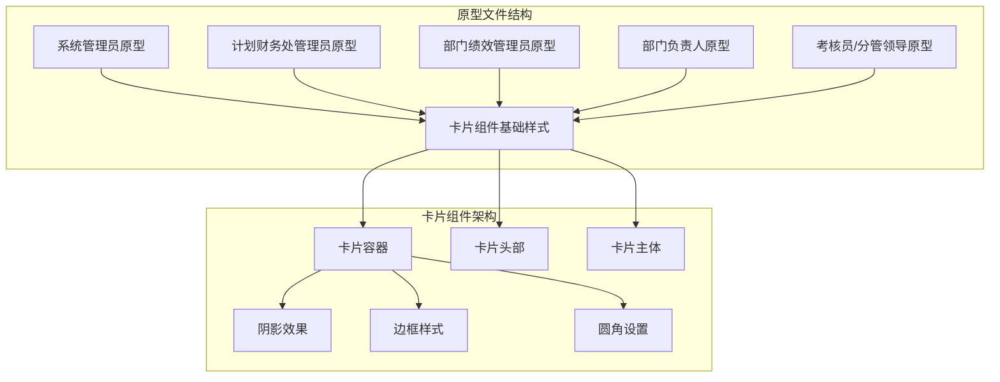
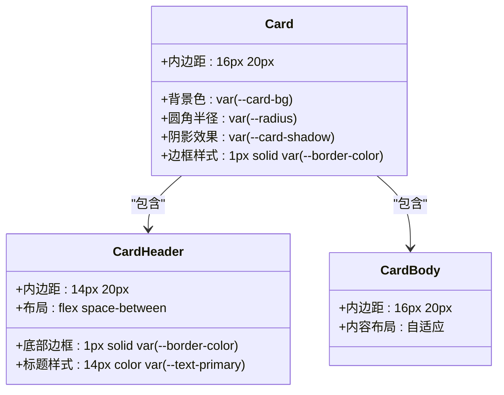
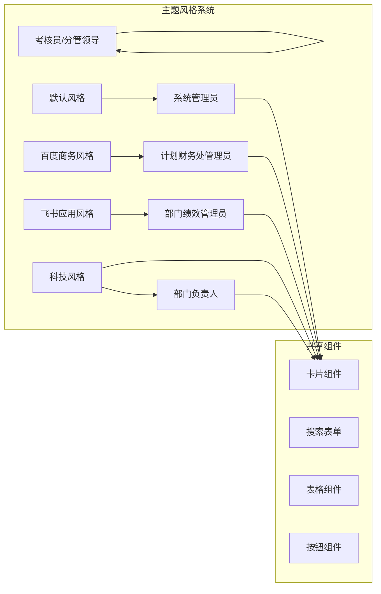
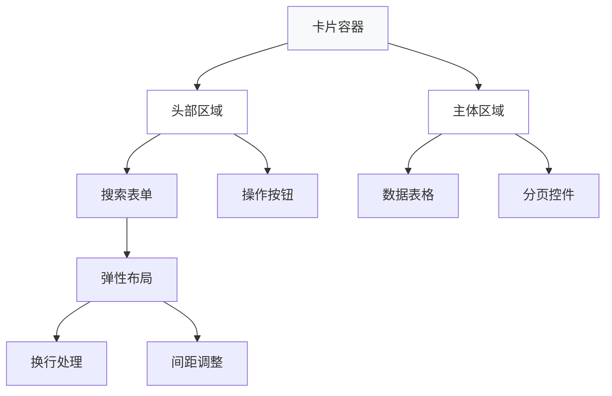
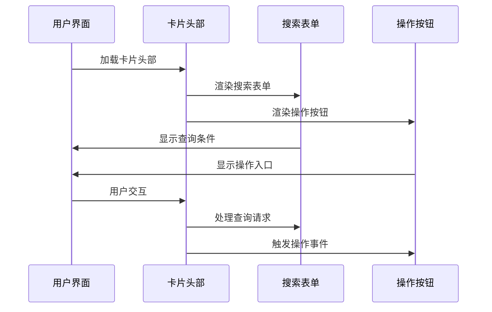
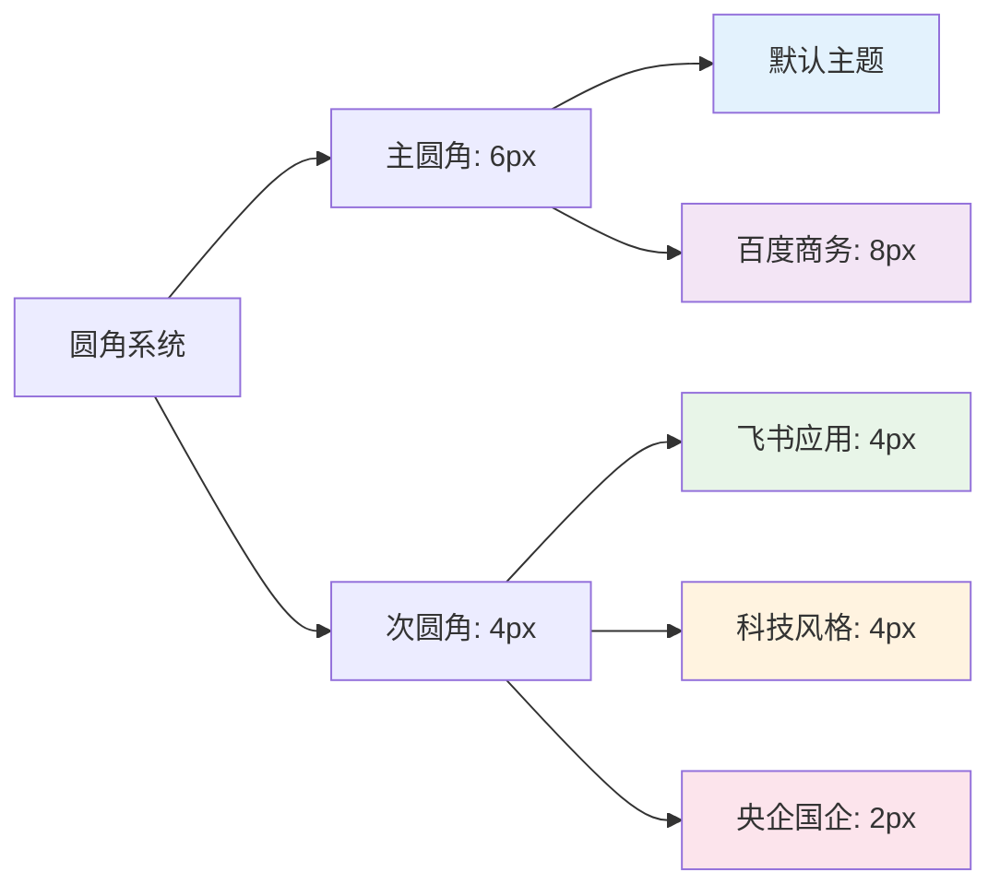
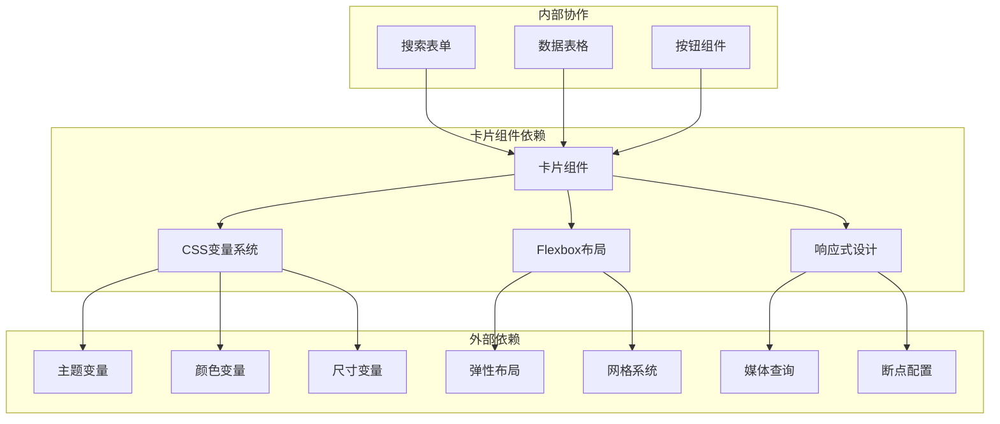
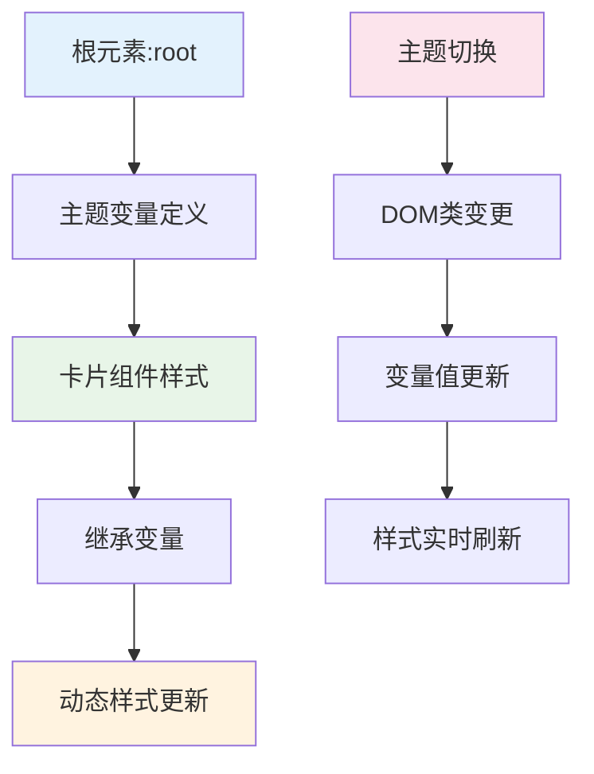

# 卡片组件

<cite>
**本文档引用的文件**
- [系统管理员原型-v1.html](file://月度业绩考核原型设计初稿/1-系统管理员原型-v1.html)
- [计划财务处业绩考核管理员原型-v1.html](file://月度业绩考核原型设计初稿/2-计划财务处业绩考核管理员原型-v1.html)
- [部门绩效管理员原型-v1.html](file://月度业绩考核原型设计初稿/3-部门绩效管理员原型-v1.html)
- [部门负责人原型-v1.html](file://月度业绩考核原型设计初稿/4-部门负责人原型-v1.html)
- [考核员分管领导原型-v1.html](file://月度业绩考核原型设计初稿/5-考核员分管领导原型-v1.html)
</cite>

## 目录
1. [简介](#简介)
2. [项目结构](#项目结构)
3. [核心组件](#核心组件)
4. [架构概览](#架构概览)
5. [详细组件分析](#详细组件分析)
6. [依赖关系分析](#依赖关系分析)
7. [性能考虑](#性能考虑)
8. [故障排除指南](#故障排除指南)
9. [结论](#结论)

## 简介

卡片组件（Card）是月度业绩考核管理系统中的核心UI组件，用于组织和展示各类业务信息。该组件采用现代化的CSS变量系统，支持多种主题风格切换，为不同角色用户提供一致的视觉体验。

卡片组件在系统管理员、计划财务处管理员、部门绩效管理员、部门负责人以及考核员/分管领导等五个主要角色的原型中都有广泛应用，涵盖了单位管理、权限分配、指标设定、考核评估等多个业务场景。

## 项目结构

项目采用多角色原型设计，每个角色都有独立的HTML文件，但共享相同的卡片组件设计规范：



**图表来源**
- [系统管理员原型-v1.html:213-217](file://月度业绩考核原型设计初稿/1-系统管理员原型-v1.html#L213-L217)
- [计划财务处业绩考核管理员原型-v1.html:245-248](file://月度业绩考核原型设计初稿/2-计划财务处业绩考核管理员原型-v1.html#L245-L248)
- [部门绩效管理员原型-v1.html:244-247](file://月度业绩考核原型设计初稿/3-部门绩效管理员原型-v1.html#L244-L247)

**章节来源**
- [系统管理员原型-v1.html:1-635](file://月度业绩考核原型设计初稿/1-系统管理员原型-v1.html#L1-L635)
- [计划财务处业绩考核管理员原型-v1.html:1-1039](file://月度业绩考核原型设计初稿/2-计划财务处业绩考核管理员原型-v1.html#L1-L1039)
- [部门绩效管理员原型-v1.html:1-1663](file://月度业绩考核原型设计初稿/3-部门绩效管理员原型-v1.html#L1-L1663)
- [部门负责人原型-v1.html:1-1231](file://月度业绩考核原型设计初稿/4-部门负责人原型-v1.html#L1-L1231)
- [考核员分管领导原型-v1.html:1-1459](file://月度业绩考核原型设计初稿/5-考核员分管领导原型-v1.html#L1-L1459)

## 核心组件

### 基础结构设计

卡片组件采用三段式结构设计，确保内容层次清晰和视觉一致性：



**图表来源**
- [系统管理员原型-v1.html:213-217](file://月度业绩考核原型设计初稿/1-系统管理员原型-v1.html#L213-L217)
- [计划财务处业绩考核管理员原型-v1.html:245-248](file://月度业绩考核原型设计初稿/2-计划财务处业绩考核管理员原型-v1.html#L245-L248)
- [部门绩效管理员原型-v1.html:244-247](file://月度业绩考核原型设计初稿/3-部门绩效管理员原型-v1.html#L244-L247)

### 样式配置系统

卡片组件采用CSS变量系统，支持灵活的主题定制：

| 样式属性 | 默认值 | 变量名 | 作用域 |
|---------|--------|--------|--------|
| 背景色 | #fff | --card-bg | 卡片背景 |
| 阴影 | 0 1px 3px rgba(0,0,0,0.06) | --card-shadow | 卡片阴影 |
| 圆角 | 6px | --radius | 卡片圆角 |
| 边框色 | #d9d9d9 | --border-color | 卡片边框 |

**章节来源**
- [系统管理员原型-v1.html:8-35](file://月度业绩考核原型设计初稿/1-系统管理员原型-v1.html#L8-L35)
- [计划财务处业绩考核管理员原型-v1.html:9-42](file://月度业绩考核原型设计初稿/2-计划财务处业绩考核管理员原型-v1.html#L9-L42)
- [部门绩效管理员原型-v1.html:8-39](file://月度业绩考核原型设计初稿/3-部门绩效管理员原型-v1.html#L8-L39)

## 架构概览

### 主题风格系统

卡片组件支持四种不同的主题风格，每种风格都针对特定的业务场景和用户群体：



**图表来源**
- [系统管理员原型-v1.html:37-149](file://月度业绩考核原型设计初稿/1-系统管理员原型-v1.html#L37-L149)
- [计划财务处业绩考核管理员原型-v1.html:44-184](file://月度业绩考核原型设计初稿/2-计划财务处业绩考核管理员原型-v1.html#L44-L184)
- [部门绩效管理员原型-v1.html:41-179](file://月度业绩考核原型设计初稿/3-部门绩效管理员原型-v1.html#L41-L179)

### 响应式设计架构

卡片组件采用Flexbox布局系统，确保在不同屏幕尺寸下的最佳显示效果：



**图表来源**
- [系统管理员原型-v1.html:213-217](file://月度业绩考核原型设计初稿/1-系统管理员原型-v1.html#L213-L217)
- [部门绩效管理员原型-v1.html:244-247](file://月度业绩考核原型设计初稿/3-部门绩效管理员原型-v1.html#L244-L247)

**章节来源**
- [系统管理员原型-v1.html:213-217](file://月度业绩考核原型设计初稿/1-系统管理员原型-v1.html#L213-L217)
- [部门负责人原型-v1.html:226-229](file://月度业绩考核原型设计初稿/4-部门负责人原型-v1.html#L226-L229)

## 详细组件分析

### 卡片头部设计

卡片头部采用统一的布局规范，支持标题和操作按钮的灵活组合：



**图表来源**
- [系统管理员原型-v1.html:335-358](file://月度业绩考核原型设计初稿/1-系统管理员原型-v1.html#L335-L358)
- [部门绩效管理员原型-v1.html:451-522](file://月度业绩考核原型设计初稿/3-部门绩效管理员原型-v1.html#L451-L522)

### 卡片主体内容布局

卡片主体区域采用统一的内边距规范，确保内容的一致性和可读性：

| 区域类型 | 内边距设置 | 用途说明 |
|---------|-----------|----------|
| 标准区域 | 16px 20px | 一般内容展示 |
| 搜索卡片 | 0 | 与搜索表单配合 |
| 表格卡片 | 0 | 表格完整填充 |
| 结果卡片 | 0 20px | 结果展示区域 |

**章节来源**
- [系统管理员原型-v1.html:335-358](file://月度业绩考核原型设计初稿/1-系统管理员原型-v1.html#L335-L358)
- [部门负责人原型-v1.html:435-537](file://月度业绩考核原型设计初稿/4-部门负责人原型-v1.html#L435-L537)

### 阴影效果配置

卡片组件采用多层次的阴影系统，营造立体的视觉效果：

```mermaid
graph TD
A[卡片阴影系统] --> B[默认阴影]
A --> C[主题阴影]
A --> D[交互阴影]
B --> E[0 1px 3px rgba(0,0,0,0.06)]
C --> F[百度商务: 0 1px 4px rgba(0,0,0,0.08)]
C --> G[飞书应用: 0 1px 2px rgba(0,0,0,0.05)]
C --> H[科技风格: 0 0 20px rgba(0,212,255,0.1)]
C --> I[央企国企: 0 2px 6px rgba(196,30,58,0.08)]
D --> J[悬停效果]
D --> K[点击反馈]
```

**图表来源**
- [系统管理员原型-v1.html:18-19](file://月度业绩考核原型设计初稿/1-系统管理员原型-v1.html#L18-L19)
- [系统管理员原型-v1.html:47-49](file://月度业绩考核原型设计初稿/1-系统管理员原型-v1.html#L47-L49)
- [系统管理员原型-v1.html:68-69](file://月度业绩考核原型设计初稿/1-系统管理员原型-v1.html#L68-L69)
- [系统管理员原型-v1.html:113-114](file://月度业绩考核原型设计初稿/1-系统管理员原型-v1.html#L113-L114)
- [系统管理员原型-v1.html:140-141](file://月度业绩考核原型设计初稿/1-系统管理员原型-v1.html#L140-L141)

### 边框样式定制

卡片组件支持灵活的边框样式配置，满足不同主题的设计需求：

| 主题风格 | 边框样式 | 特殊配置 |
|---------|----------|----------|
| 默认风格 | 1px solid #d9d9d9 | 标准边框 |
| 飞书应用 | 1px solid #e4e7eb | 浅色边框 |
| 科技风格 | 1px solid #30363d | 深色边框 |
| 央企国企 | 1px solid #d9d9d9 | 标准边框 |
| 百度商务 | 1px solid #e5e5e5 | 浅色边框 |

**章节来源**
- [系统管理员原型-v1.html:68-69](file://月度业绩考核原型设计初稿/1-系统管理员原型-v1.html#L68-L69)
- [系统管理员原型-v1.html:112-113](file://月度业绩考核原型设计初稿/1-系统管理员原型-v1.html#L112-L113)
- [系统管理员原型-v1.html:139-140](file://月度业绩考核原型设计初稿/1-系统管理员原型-v1.html#L139-L140)

### 圆角设置策略

卡片组件采用统一的圆角半径系统，确保视觉一致性：



**图表来源**
- [系统管理员原型-v1.html:32-33](file://月度业绩考核原型设计初稿/1-系统管理员原型-v1.html#L32-L33)
- [系统管理员原型-v1.html:55-56](file://月度业绩考核原型设计初稿/1-系统管理员原型-v1.html#L55-L56)
- [系统管理员原型-v1.html:83-84](file://月度业绩考核原型设计初稿/1-系统管理员原型-v1.html#L83-L84)
- [系统管理员原型-v1.html:127-128](file://月度业绩考核原型设计初稿/1-系统管理员原型-v1.html#L127-L128)
- [系统管理员原型-v1.html:147-148](file://月度业绩考核原型设计初稿/1-系统管理员原型-v1.html#L147-L148)

## 依赖关系分析

### 组件耦合度分析

卡片组件与其他UI组件之间存在良好的解耦关系，通过CSS变量实现松耦合：



**图表来源**
- [系统管理员原型-v1.html:186-189](file://月度业绩考核原型设计初稿/1-系统管理员原型-v1.html#L186-L189)
- [系统管理员原型-v1.html:213-217](file://月度业绩考核原型设计初稿/1-系统管理员原型-v1.html#L213-L217)

### 样式继承关系

卡片组件采用CSS变量继承机制，确保主题切换时的样式一致性：



**图表来源**
- [系统管理员原型-v1.html:614-619](file://月度业绩考核原型设计初稿/1-系统管理员原型-v1.html#L614-L619)

**章节来源**
- [系统管理员原型-v1.html:614-619](file://月度业绩考核原型设计初稿/1-系统管理员原型-v1.html#L614-L619)

## 性能考虑

### 样式优化策略

卡片组件采用高效的CSS变量系统，在保证灵活性的同时优化了渲染性能：

1. **变量缓存机制**：CSS变量在浏览器中具有良好的缓存性能
2. **选择器优化**：使用简单的类选择器，避免复杂的层级选择器
3. **动画性能**：阴影和边框变化使用transform属性，确保硬件加速

### 响应式性能优化

卡片组件在不同设备上的性能表现：

- **桌面端**：完整的Flexbox布局，无性能损耗
- **平板端**：自动换行，保持布局流畅
- **移动端**：内边距自适应，确保触摸友好

## 故障排除指南

### 常见问题及解决方案

| 问题类型 | 症状描述 | 解决方案 |
|---------|----------|----------|
| 样式不生效 | 卡片样式异常或缺失 | 检查CSS变量定义，确认主题类名正确 |
| 响应式问题 | 移动端布局错乱 | 验证Flexbox属性设置，检查媒体查询 |
| 阴影显示异常 | 阴影效果不明显 | 确认rgba颜色值格式正确，检查z-index层级 |
| 边框样式问题 | 边框颜色不匹配 | 检查主题变量覆盖，确认CSS优先级 |

### 调试技巧

1. **开发者工具检查**：使用浏览器开发者工具检查CSS变量的实际值
2. **样式覆盖检测**：确认没有其他样式规则覆盖卡片组件样式
3. **主题切换测试**：验证所有主题风格下的显示效果

**章节来源**
- [系统管理员原型-v1.html:614-619](file://月度业绩考核原型设计初稿/1-系统管理员原型-v1.html#L614-L619)

## 结论

卡片组件作为月度业绩考核管理系统的核心UI组件，展现了优秀的架构设计和实现效果。通过CSS变量系统实现了高度的可定制性和主题灵活性，同时保持了良好的性能表现和用户体验。

组件设计充分考虑了不同业务场景的需求，支持从系统管理到具体业务操作的完整流程覆盖。标准化的结构设计和样式配置为后续的功能扩展和维护提供了坚实的基础。

未来可以在以下方面进一步优化：
1. 增加更多的交互效果和动画配置
2. 扩展响应式设计的适配能力
3. 优化移动端的触摸交互体验
4. 增强无障碍访问的支持