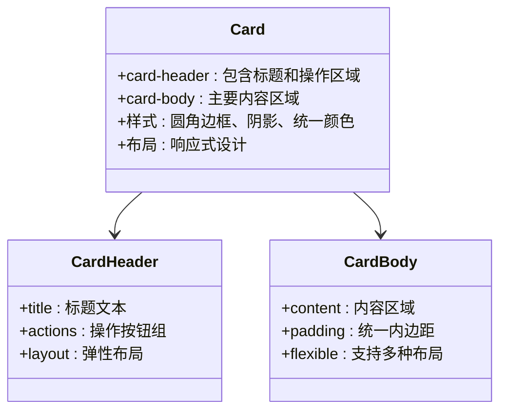
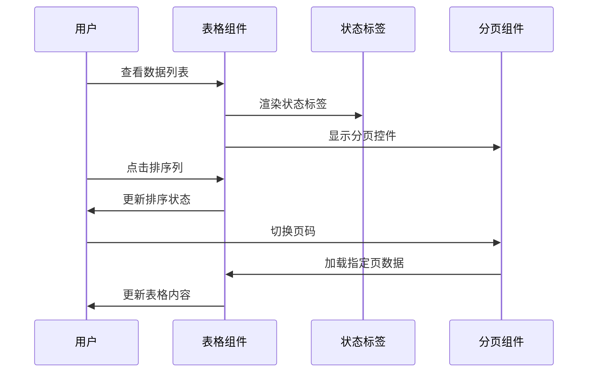
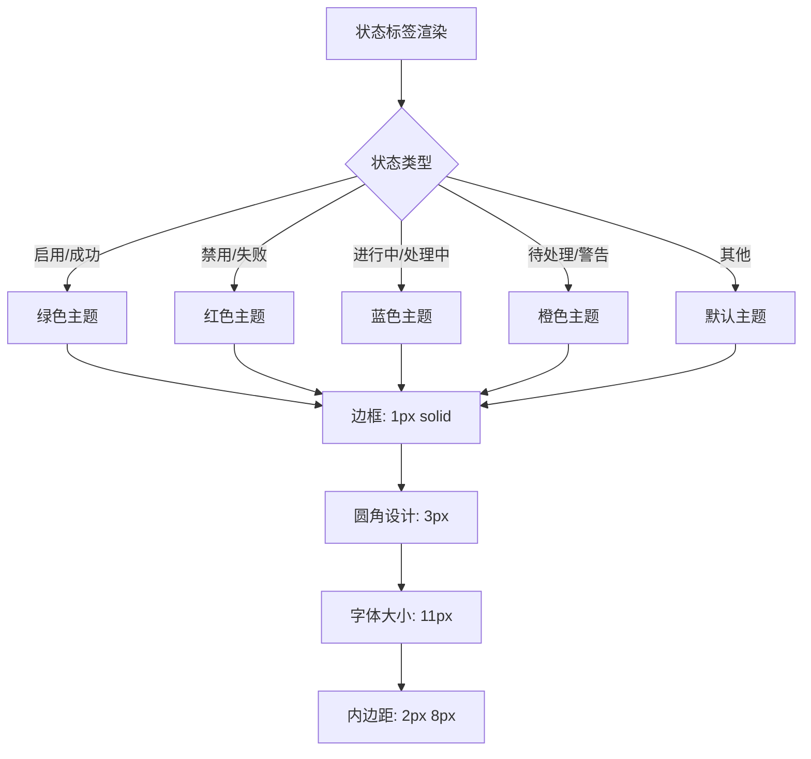
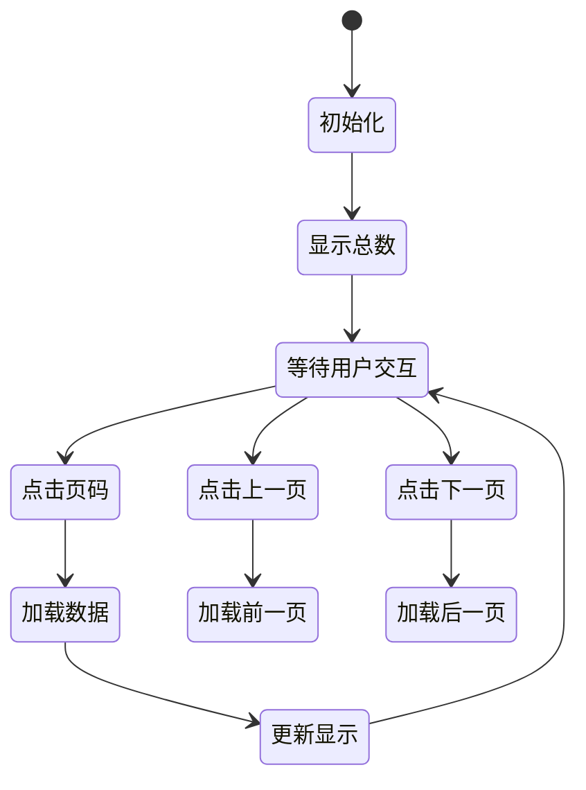
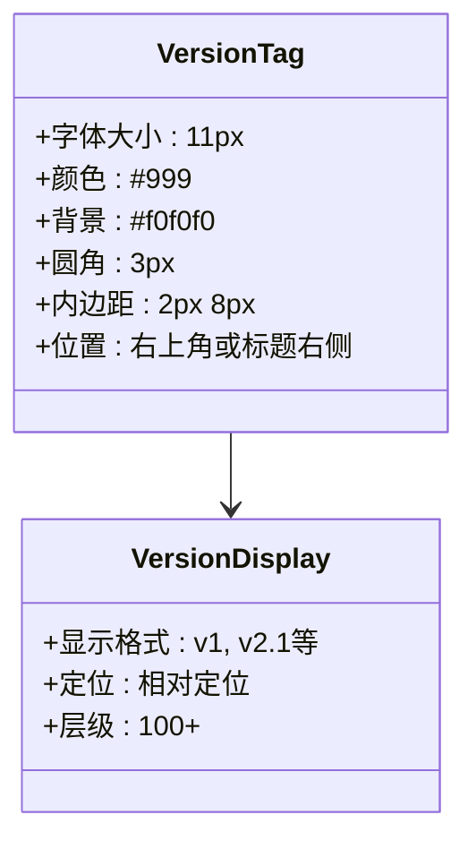

# 数据展示组件

<cite>
**本文档引用的文件**
- [系统管理员原型-v1.html](file://1-系统管理员原型-v1.html)
- [计划财务处业绩考核管理员原型-v1.html](file://2-计划财务处业绩考核管理员原型-v1.html)
- [部门绩效管理员原型-v1.html](file://3-部门绩效管理员原型-v1.html)
- [部门负责人原型-v1.html](file://4-部门负责人原型-v1.html)
- [考核员分管领导原型-v1.html](file://5-考核员分管领导原型-v1.html)
- [时序图-v1.html](file://6-时序图-v1.html)
</cite>

## 目录
1. [简介](#简介)
2. [项目结构](#项目结构)
3. [核心组件](#核心组件)
4. [架构概览](#架构概览)
5. [详细组件分析](#详细组件分析)
6. [依赖关系分析](#依赖关系分析)
7. [性能考虑](#性能考虑)
8. [故障排除指南](#故障排除指南)
9. [结论](#结论)
10. [附录](#附录)

## 简介

本项目是一个月度业绩考核管理系统的原型设计，包含了完整的数据展示组件体系。系统采用HTML+CSS+JavaScript技术栈，通过统一的CSS变量系统实现了灵活的主题切换和组件样式管理。

系统主要面向不同角色的用户，包括系统管理员、计划财务处业绩考核管理员、部门绩效管理员、部门负责人以及考核员/分管领导，每个角色都有专门的界面和数据展示需求。

## 项目结构

项目采用按角色划分的原型文件结构，每个角色都有独立的HTML文件，包含完整的UI组件和交互逻辑：

```mermaid
graph TB
subgraph "原型文件结构"
A[系统管理员原型] --> A1[单位管理]
A[系统管理员原型] --> A2[分管领导维护]
A[系统管理员原型] --> A3[权限分配管理]
B[计划财务处管理员原型] --> B1[考核组管理]
B[计划财务处管理员原型] --> B2[业绩指标审批]
B[计划财务处管理员原型] --> B3[月度考核管理]
C[部门绩效管理员原型] --> C1[业绩指标设定]
C[部门绩效管理员原型] --> C2[月度考核自评]
C[部门绩效管理员原型] --> C3[部门他评打分]
D[部门负责人原型] --> D1[指标审批]
D[部门负责人原型] --> D2[结果查看]
E[考核员/分管领导原型] --> E1[评估打分]
E[考核员/分管领导原型] --> E2[进度查询]
E[考核员/分管领导原型] --> E3[申诉处理]
</subgraph>
```

**图表来源**
- [系统管理员原型-v1.html:1-635](file://1-系统管理员原型-v1.html#L1-L635)
- [计划财务处业绩考核管理员原型-v1.html:1-1039](file://2-计划财务处业绩考核管理员原型-v1.html#L1-L1039)
- [部门绩效管理员原型-v1.html:1-1663](file://3-部门绩效管理员原型-v1.html#L1-L1663)
- [部门负责人原型-v1.html:1-1231](file://4-部门负责人原型-v1.html#L1-L1231)
- [考核员分管领导原型-v1.html:1-1459](file://5-考核员分管领导原型-v1.html#L1-L1459)

**章节来源**
- [系统管理员原型-v1.html:1-635](file://1-系统管理员原型-v1.html#L1-L635)
- [计划财务处业绩考核管理员原型-v1.html:1-1039](file://2-计划财务处业绩考核管理员原型-v1.html#L1-L1039)
- [部门绩效管理员原型-v1.html:1-1663](file://3-部门绩效管理员原型-v1.html#L1-L1663)
- [部门负责人原型-v1.html:1-1231](file://4-部门负责人原型-v1.html#L1-L1231)
- [考核员分管领导原型-v1.html:1-1459](file://5-考核员分管领导原型-v1.html#L1-L1459)

## 核心组件

系统中的数据展示组件主要包括以下几种核心类型：

### 卡片组件 (Card)
- **用途**: 作为页面内容的基本容器，提供统一的视觉层次
- **特性**: 支持头部区域、主体区域和操作按钮的布局
- **样式**: 采用圆角边框、阴影效果和统一的颜色方案

### 数据表格 (Table)
- **用途**: 展示结构化数据，支持排序、筛选和分页
- **特性**: 响应式设计，支持横向滚动；状态标签集成
- **样式**: 表头高亮、悬停效果、状态颜色区分

### 状态标签 (Status Tag)
- **用途**: 显示数据状态和重要程度
- **特性**: 多种状态类型（启用/禁用、成功/失败、进行中/已完成）
- **样式**: 圆角设计，颜色语义化

### 分页组件 (Pagination)
- **用途**: 处理大量数据的分页显示
- **特性**: 支持页码导航、总数显示
- **样式**: 圆角按钮，活动状态高亮

### 版本标签 (Version Tag)
- **用途**: 显示功能版本信息
- **特性**: 小尺寸标签，灰色背景
- **样式**: 统一的版本标识样式

**章节来源**
- [系统管理员原型-v1.html:213-279](file://1-系统管理员原型-v1.html#L213-L279)
- [计划财务处业绩考核管理员原型-v1.html:264-299](file://2-计划财务处业绩考核管理员原型-v1.html#L264-L299)
- [部门绩效管理员原型-v1.html:244-314](file://3-部门绩效管理员原型-v1.html#L244-L314)

## 架构概览

系统采用基于CSS变量的主题架构，实现了高度一致的视觉体验和灵活的主题切换能力：

```mermaid
graph TB
subgraph "主题系统架构"
A[CSS变量定义] --> B[默认主题]
A --> C[百度商务主题]
A --> D[飞书应用主题]
A --> E[科技风主题]
A --> F[央企国企主题]
B --> G[组件样式应用]
C --> G
D --> G
E --> G
F --> G
G --> H[卡片组件]
G --> I[表格组件]
G --> J[状态标签]
G --> K[分页组件]
G --> L[版本标签]
</subgraph>
```

**图表来源**
- [系统管理员原型-v1.html:8-185](file://1-系统管理员原型-v1.html#L8-L185)
- [计划财务处业绩考核管理员原型-v1.html:8-184](file://2-计划财务处业绩考核管理员原型-v1.html#L8-L184)
- [部门绩效管理员原型-v1.html:8-179](file://3-部门绩效管理员原型-v1.html#L8-L179)

系统通过统一的CSS变量系统实现了以下优势：
- **主题一致性**: 所有组件共享相同的颜色、字体、间距规范
- **易于维护**: 主题变更只需修改CSS变量即可
- **灵活扩展**: 支持多种主题风格的快速切换

**章节来源**
- [系统管理员原型-v1.html:8-185](file://1-系统管理员原型-v1.html#L8-L185)

## 详细组件分析

### 卡片组件 (Card)

卡片组件是系统中最基础的布局组件，提供了统一的内容容器：



**图表来源**
- [系统管理员原型-v1.html:213-218](file://1-系统管理员原型-v1.html#L213-L218)
- [计划财务处业绩考核管理员原型-v1.html:245-248](file://2-计划财务处业绩考核管理员原型-v1.html#L245-L248)

卡片组件的设计特点：
- **统一的视觉语言**: 所有卡片采用相同的圆角、阴影和边框样式
- **灵活的头部布局**: 支持标题、搜索表单、操作按钮的组合
- **内容区域分离**: 清晰的内容分区，便于信息架构

**章节来源**
- [系统管理员原型-v1.html:213-218](file://1-系统管理员原型-v1.html#L213-L218)

### 数据表格 (Table)

数据表格是系统的核心展示组件，承担着大量数据的呈现任务：



**图表来源**
- [系统管理员原型-v1.html:347-356](file://1-系统管理员原型-v1.html#L347-L356)
- [计划财务处业绩考核管理员原型-v1.html:442-444](file://2-计划财务处业绩考核管理员原型-v1.html#L442-L444)

表格组件的关键特性：
- **响应式设计**: 支持横向滚动，适应不同屏幕尺寸
- **状态集成**: 内置状态标签渲染，无需额外处理
- **交互友好**: 悬停效果、点击反馈
- **性能优化**: 大数据量时配合分页组件使用

**章节来源**
- [系统管理员原型-v1.html:234-239](file://1-系统管理员原型-v1.html#L234-L239)

### 状态标签 (Status Tag)

状态标签是系统中最重要的视觉标识组件，用于传达数据的重要程度和当前状态：



**图表来源**
- [系统管理员原型-v1.html:241-243](file://1-系统管理员原型-v1.html#L241-L243)
- [计划财务处业绩考核管理员原型-v1.html:269-274](file://2-计划财务处业绩考核管理员原型-v1.html#L269-L274)

状态标签的设计原则：
- **语义化颜色**: 不同颜色代表不同的业务含义
- **统一的视觉标准**: 所有状态标签遵循相同的设计规范
- **可访问性考虑**: 颜色对比度满足基本可访问性要求

**章节来源**
- [系统管理员原型-v1.html:241-243](file://1-系统管理员原型-v1.html#L241-L243)

### 分页组件 (Pagination)

分页组件负责处理大量数据的分页显示，提供流畅的用户体验：



**图表来源**
- [系统管理员原型-v1.html:244-249](file://1-系统管理员原型-v1.html#L244-L249)
- [计划财务处业绩考核管理员原型-v1.html:275-279](file://2-计划财务处业绩考核管理员原型-v1.html#L275-L279)

分页组件的功能特性：
- **总数显示**: 显示当前查询条件下的数据总量
- **页码导航**: 支持直接跳转到指定页码
- **边界处理**: 自动处理首页和末页的特殊状态
- **响应式布局**: 在小屏幕上自动调整显示方式

**章节来源**
- [系统管理员原型-v1.html:244-249](file://1-系统管理员原型-v1.html#L244-L249)

### 版本标签 (Version Tag)

版本标签用于标识功能的版本信息，提供清晰的版本追踪：



**图表来源**
- [系统管理员原型-v1.html:278](file://1-系统管理员原型-v1.html#L278)
- [计划财务处业绩考核管理员原型-v1.html:299](file://2-计划财务考核管理员原型-v1.html#L299)

版本标签的设计考虑：
- **不干扰主要内容**: 使用较小的字号和浅色背景
- **位置一致性**: 统一放置在标题右侧或右上角
- **可读性保证**: 确保版本信息清晰可见但不过于突出

**章节来源**
- [系统管理员原型-v1.html:278](file://1-系统管理员原型-v1.html#L278)

## 依赖关系分析

系统中的组件之间存在明确的依赖关系和协作模式：

```mermaid
graph TB
subgraph "组件依赖关系"
A[卡片组件] --> B[表格组件]
A --> C[状态标签]
A --> D[分页组件]
A --> E[版本标签]
B --> C
B --> D
F[搜索表单] --> A
G[操作按钮] --> A
H[主题系统] --> A
H --> B
H --> C
H --> D
H --> E
</subgraph>
```

**图表来源**
- [系统管理员原型-v1.html:213-279](file://1-系统管理员原型-v1.html#L213-L279)

组件间的协作模式：
- **容器-内容关系**: 卡片组件作为容器，承载其他组件
- **状态集成**: 表格组件内嵌状态标签，提供状态可视化
- **数据驱动**: 分页组件依赖表格组件的数据结构
- **主题统一**: 所有组件共享同一套CSS变量主题

**章节来源**
- [系统管理员原型-v1.html:213-279](file://1-系统管理员原型-v1.html#L213-L279)

## 性能考虑

系统在设计时充分考虑了性能优化，特别是在大数据量展示场景下的表现：

### 渲染优化
- **虚拟滚动**: 对于超大数据集，建议实现虚拟滚动以减少DOM节点数量
- **懒加载**: 图片和复杂组件采用懒加载策略
- **防抖处理**: 搜索和筛选操作添加防抖机制，避免频繁重渲染

### 样式优化
- **CSS变量缓存**: 浏览器会缓存CSS变量计算结果
- **最小化重排**: 通过合理的布局设计减少布局重排
- **硬件加速**: 合理使用transform和opacity属性触发GPU加速

### 交互优化
- **事件委托**: 大量行级操作使用事件委托减少事件监听器数量
- **内存管理**: 及时清理不再使用的DOM引用和事件监听器
- **资源压缩**: CSS和JavaScript文件经过压缩处理

## 故障排除指南

### 常见问题及解决方案

**问题1: 主题切换无效**
- **症状**: 点击主题切换按钮后界面无变化
- **原因**: JavaScript函数调用错误或CSS变量未正确应用
- **解决**: 检查switchStyle函数的实现，确保CSS类名正确切换

**问题2: 表格显示异常**
- **症状**: 表格内容超出容器或出现水平滚动条
- **原因**: 表格宽度设置不当或内容过长
- **解决**: 使用table-wrap容器，设置合适的max-width和white-space属性

**问题3: 状态标签颜色不正确**
- **症状**: 状态标签颜色与预期不符
- **原因**: CSS类名拼写错误或样式优先级问题
- **解决**: 检查CSS类名是否正确，确认样式优先级设置

**问题4: 分页功能异常**
- **症状**: 点击页码无反应或数据不更新
- **原因**: JavaScript事件绑定错误或数据加载逻辑问题
- **解决**: 检查事件监听器绑定，确认数据加载回调函数

**章节来源**
- [系统管理员原型-v1.html:612-632](file://1-系统管理员原型-v1.html#L612-L632)

## 结论

本项目展示了如何构建一个完整的企业级数据展示系统，通过统一的组件架构和灵活的主题系统，实现了高度一致的用户体验。系统的主要优势包括：

1. **组件化设计**: 清晰的组件边界和职责分工
2. **主题系统**: 基于CSS变量的灵活主题切换
3. **响应式布局**: 适配不同设备和屏幕尺寸
4. **语义化设计**: 通过颜色和布局传达业务含义
5. **可扩展性**: 为未来功能扩展预留了良好的架构基础

系统为后续的完整开发奠定了坚实的基础，特别是在数据展示、状态管理和用户交互方面提供了优秀的原型参考。

## 附录

### 组件使用最佳实践

**卡片组件使用建议**:
- 保持卡片内容的简洁性和相关性
- 合理使用卡片的阴影和边框效果
- 注意卡片之间的间距和对齐

**表格组件使用建议**:
- 为重要的列提供排序功能
- 对长文本内容提供省略显示和工具提示
- 考虑大数据量时的分页策略

**状态标签使用建议**:
- 保持状态颜色的一致性
- 提供足够的颜色对比度
- 考虑无障碍访问的需求

**分页组件使用建议**:
- 提供明确的页码导航
- 显示当前页和总页数
- 考虑大数据量时的性能优化

### 主题定制指南

系统支持五种不同的主题风格，每种主题都有其特定的应用场景：

**默认主题**: 适用于大多数企业环境，提供平衡的视觉效果
**百度商务主题**: 强调商务感和专业性
**飞书应用主题**: 现代化界面设计，适合年轻化团队
**科技风主题**: 体现技术创新和未来感
**央企国企主题**: 符合大型企业文化和规范要求

**章节来源**
- [系统管理员原型-v1.html:37-129](file://1-系统管理员原型-v1.html#L37-L129)
- [计划财务处业绩考核管理员原型-v1.html:44-159](file://2-计划财务处业绩考核管理员原型-v1.html#L44-L159)
- [部门绩效管理员原型-v1.html:41-179](file://3-部门绩效管理员原型-v1.html#L41-L179)