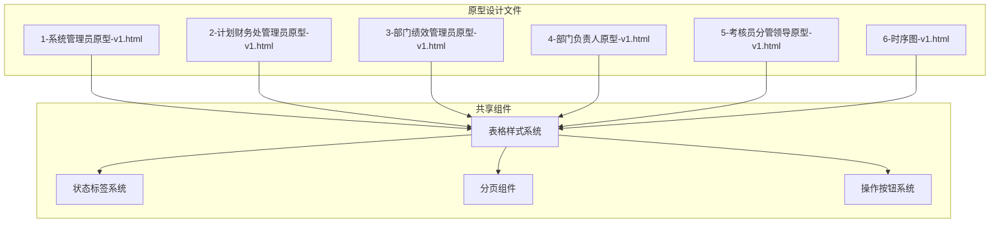
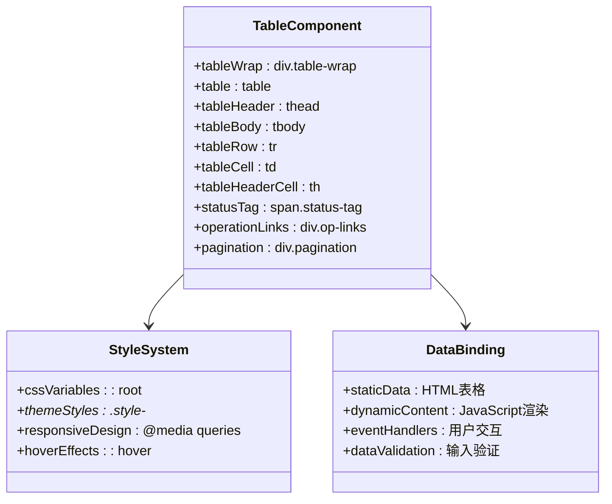
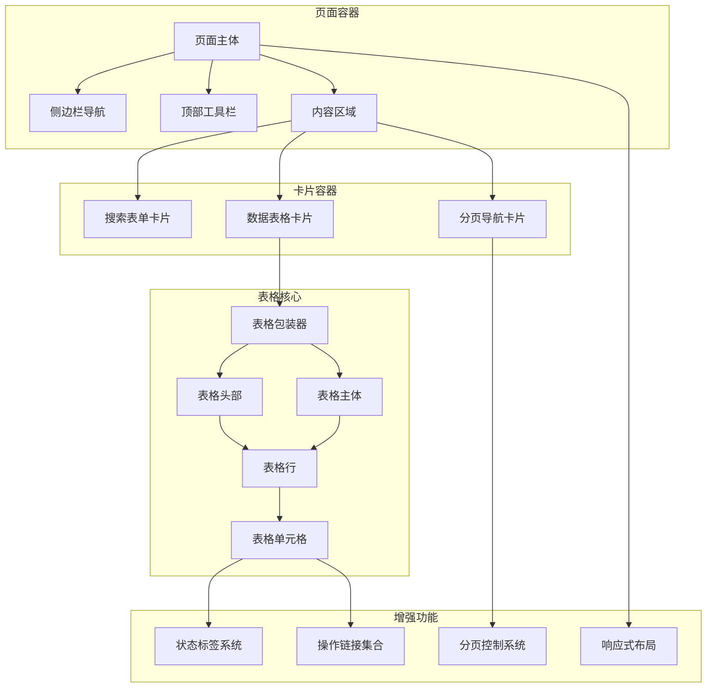
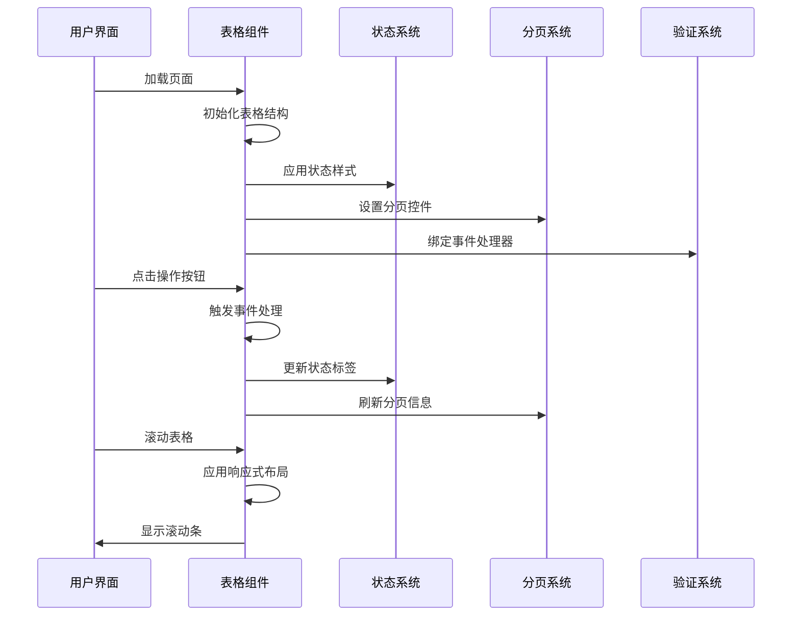
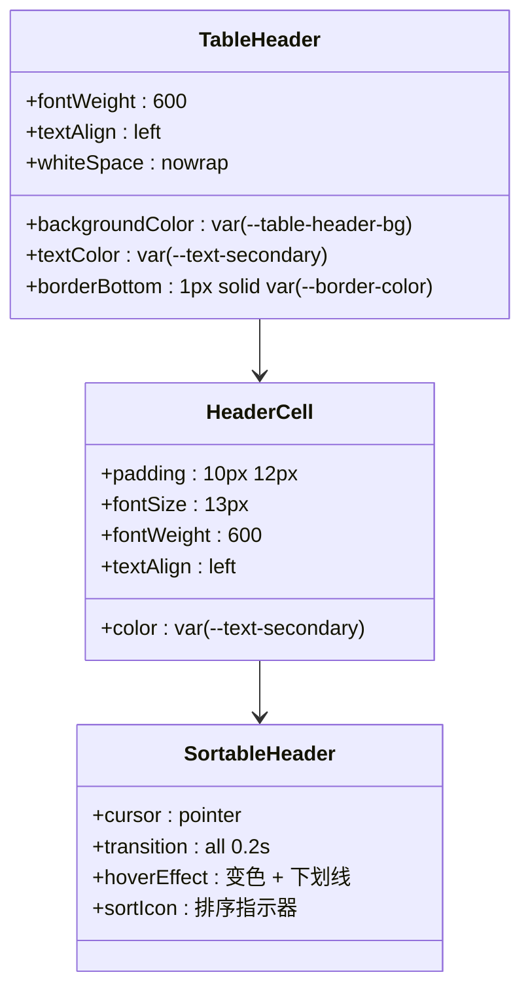
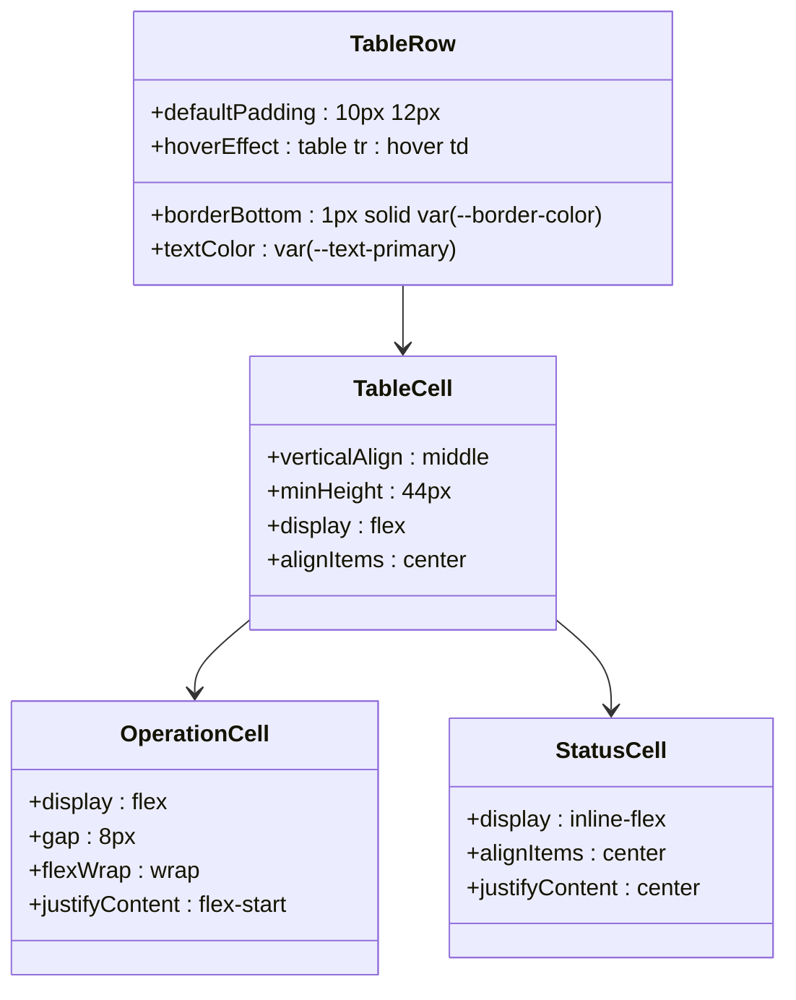
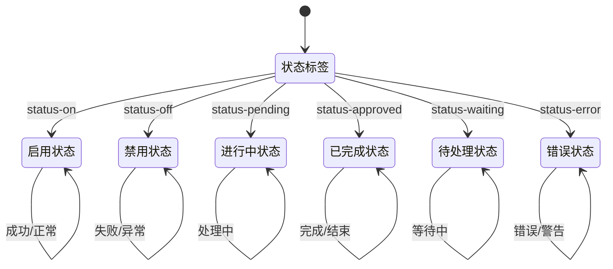
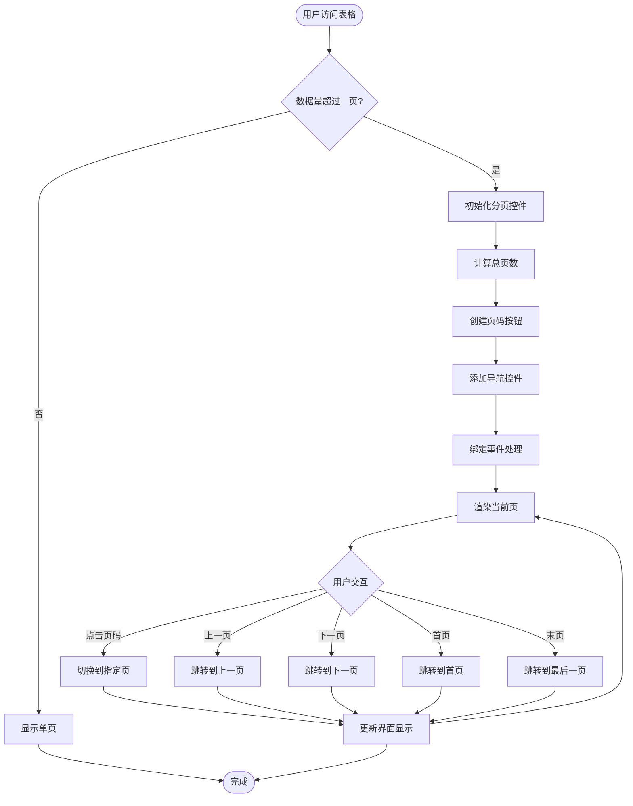
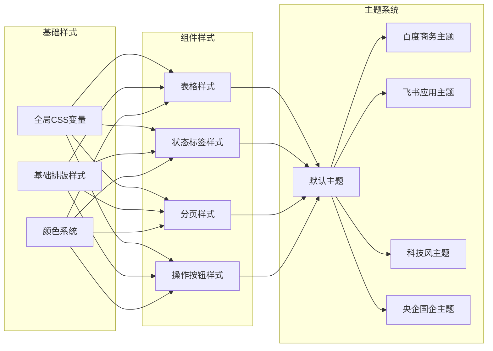
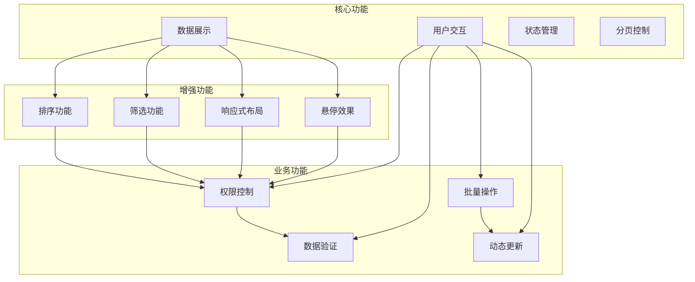

# 数据表格组件

<cite>
**本文档引用的文件**
- [1-系统管理员原型-v1.html](file://1-系统管理员原型-v1.html)
- [2-计划财务处业绩考核管理员原型-v1.html](file://2-计划财务处业绩考核管理员原型-v1.html)
- [3-部门绩效管理员原型-v1.html](file://3-部门绩效管理员原型-v1.html)
- [4-部门负责人原型-v1.html](file://4-部门负责人原型-v1.html)
- [5-考核员分管领导原型-v1.html](file://5-考核员分管领导原型-v1.html)
- [6-时序图-v1.html](file://6-时序图-v1.html)
</cite>

## 目录
1. [简介](#简介)
2. [项目结构](#项目结构)
3. [核心组件](#核心组件)
4. [架构概览](#架构概览)
5. [详细组件分析](#详细组件分析)
6. [依赖关系分析](#依赖关系分析)
7. [性能考虑](#性能考虑)
8. [故障排除指南](#故障排除指南)
9. [结论](#结论)
10. [附录](#附录)

## 简介

数据表格组件是月度业绩考核管理系统的核心界面元素，负责展示和管理各类考核数据。该组件在系统管理员、计划财务处管理员、部门负责人等多个角色页面中广泛应用，支撑着完整的考核管理流程。

本组件采用现代化的CSS设计系统，支持多种主题风格切换，具备响应式设计和移动端适配能力。表格结构清晰，包含表头、表体、行、单元格等标准HTML表格元素，同时集成了状态标签、操作链接、分页导航等增强功能。

## 项目结构

该项目采用多角色原型设计模式，每个角色都有独立的HTML页面文件：



**图表来源**
- [1-系统管理员原型-v1.html:1-635](file://1-系统管理员原型-v1.html#L1-L635)
- [2-计划财务处业绩考核管理员原型-v1.html:1-1039](file://2-计划财务处业绩考核管理员原型-v1.html#L1-L1039)
- [3-部门绩效管理员原型-v1.html:1-1663](file://3-部门绩效管理员原型-v1.html#L1-L1663)
- [4-部门负责人原型-v1.html:1-1231](file://4-部门负责人原型-v1.html#L1-L1231)
- [5-考核员分管领导原型-v1.html:1-1459](file://5-考核员分管领导原型-v1.html#L1-L1459)

**章节来源**
- [1-系统管理员原型-v1.html:1-635](file://1-系统管理员原型-v1.html#L1-L635)
- [2-计划财务处业绩考核管理员原型-v1.html:1-1039](file://2-计划财务处业绩考核管理员原型-v1.html#L1-L1039)
- [3-部门绩效管理员原型-v1.html:1-1663](file://3-部门绩效管理员原型-v1.html#L1-L1663)
- [4-部门负责人原型-v1.html:1-1231](file://4-部门负责人原型-v1.html#L1-L1231)
- [5-考核员分管领导原型-v1.html:1-1459](file://5-考核员分管领导原型-v1.html#L1-L1459)

## 核心组件

### 表格基础结构

数据表格组件基于标准HTML5语义化结构构建：



**图表来源**
- [1-系统管理员原型-v1.html:234-279](file://1-系统管理员原型-v1.html#L234-L279)
- [2-计划财务处业绩考核管理员原型-v1.html:264-279](file://2-计划财务处业绩考核管理员原型-v1.html#L264-L279)
- [3-部门绩效管理员原型-v1.html:270-291](file://3-部门绩效管理员原型-v1.html#L270-L291)

### 样式系统架构

组件采用CSS变量驱动的设计系统，支持四种主题风格：

| 主题风格 | CSS类名 | 特色功能 |
|---------|---------|----------|
| 默认风格 | 无类名 | 基础蓝色主题，适用于大多数场景 |
| 百度商务 | .style-baidu | 深蓝色商务风格，强调专业性 |
| 飞书应用 | .style-feishu | 现代化应用风格，注重用户体验 |
| 科技风 | .style-tech | 未来感科技风格，适合技术场景 |
| 央企国企 | .style-guoqi | 传统国企风格，体现权威性 |

**章节来源**
- [1-系统管理员原型-v1.html:8-185](file://1-系统管理员原型-v1.html#L8-L185)
- [2-计划财务处业绩考核管理员原型-v1.html:44-184](file://2-计划财务处业绩考核管理员原型-v1.html#L44-L184)
- [3-部门绩效管理员原型-v1.html:8-39](file://3-部门绩效管理员原型-v1.html#L8-L39)

## 架构概览

### 组件层次结构



**图表来源**
- [1-系统管理员原型-v1.html:328-560](file://1-系统管理员原型-v1.html#L328-L560)
- [2-计划财务处业绩考核管理员原型-v1.html:352-656](file://2-计划财务处业绩考核管理员原型-v1.html#L352-L656)
- [3-部门绩效管理员原型-v1.html:443-764](file://3-部门绩效管理员原型-v1.html#L443-L764)

### 数据流架构



**图表来源**
- [1-系统管理员原型-v1.html:612-632](file://1-系统管理员原型-v1.html#L612-L632)
- [2-计划财务处业绩考核管理员原型-v1.html:612-620](file://2-计划财务处业绩考核管理员原型-v1.html#L612-L620)

## 详细组件分析

### 表头系统 (thead/th)

表头系统采用统一的设计规范，确保不同页面间的一致性：



**图表来源**
- [1-系统管理员原型-v1.html:237](file://1-系统管理员原型-v1.html#L237)
- [2-计划财务处业绩考核管理员原型-v1.html:265](file://2-计划财务处业绩考核管理员原型-v1.html#L265)

### 表体系统 (tbody/tr/td)

表体系统提供丰富的数据展示能力：



**图表来源**
- [1-系统管理员原型-v1.html:238-241](file://1-系统管理员原型-v1.html#L238-L241)
- [2-计划财务处业绩考核管理员原型-v1.html:266-268](file://2-计划财务处业绩考核管理员原型-v1.html#L266-L268)

### 状态标签系统

状态标签系统提供直观的状态可视化：



**图表来源**
- [1-系统管理员原型-v1.html:242-243](file://1-系统管理员原型-v1.html#L242-L243)
- [2-计划财务处业绩考核管理员原型-v1.html:269-274](file://2-计划财务处业绩考核管理员原型-v1.html#L269-L274)

### 分页系统

分页系统支持大数据集的高效浏览：



**图表来源**
- [1-系统管理员原型-v1.html:244-248](file://1-系统管理员原型-v1.html#L244-L248)
- [2-计划财务处业绩考核管理员原型-v1.html:275-278](file://2-计划财务处业绩考核管理员原型-v1.html#L275-L278)

**章节来源**
- [1-系统管理员原型-v1.html:234-279](file://1-系统管理员原型-v1.html#L234-L279)
- [2-计划财务处业绩考核管理员原型-v1.html:264-279](file://2-计划财务处业绩考核管理员原型-v1.html#L264-L279)
- [3-部门绩效管理员原型-v1.html:270-291](file://3-部门绩效管理员原型-v1.html#L270-L291)

## 依赖关系分析

### 样式依赖关系



**图表来源**
- [1-系统管理员原型-v1.html:8-185](file://1-系统管理员原型-v1.html#L8-L185)
- [2-计划财务处业绩考核管理员原型-v1.html:44-184](file://2-计划财务处业绩考核管理员原型-v1.html#L44-L184)

### 功能依赖关系



**图表来源**
- [1-系统管理员原型-v1.html:612-632](file://1-系统管理员原型-v1.html#L612-L632)
- [2-计划财务处业绩考核管理员原型-v1.html:612-620](file://2-计划财务处业绩考核管理员原型-v1.html#L612-L620)

**章节来源**
- [1-系统管理员原型-v1.html:612-632](file://1-系统管理员原型-v1.html#L612-L632)
- [2-计划财务处业绩考核管理员原型-v1.html:612-620](file://2-计划财务处业绩考核管理员原型-v1.html#L612-L620)

## 性能考虑

### 渲染优化策略

1. **虚拟滚动**: 对于大量数据的表格，建议实现虚拟滚动以减少DOM节点数量
2. **懒加载**: 表格内容采用懒加载策略，只渲染可视区域内的行
3. **缓存机制**: 状态标签和分页信息采用内存缓存，避免重复计算
4. **事件节流**: 表格滚动和窗口大小变化事件采用节流处理

### 内存管理

- 使用事件委托减少事件监听器数量
- 及时清理不再使用的DOM引用
- 实现表格销毁时的资源回收机制

### 网络优化

- 表格数据采用分页加载，避免一次性传输大量数据
- 支持数据缓存，减少重复请求
- 实现数据变更的增量更新

## 故障排除指南

### 常见问题及解决方案

| 问题类型 | 症状描述 | 可能原因 | 解决方案 |
|---------|----------|----------|----------|
| 样式异常 | 表格显示错位或颜色不正确 | CSS变量未正确应用 | 检查主题类名是否正确添加 |
| 响应式问题 | 移动端表格无法水平滚动 | 缺少table-wrap容器 | 确保表格包裹在table-wrap中 |
| 交互失效 | 悬停效果不生效 | :hover伪类被覆盖 | 检查CSS优先级和z-index |
| 性能问题 | 大数据表格卡顿 | DOM节点过多 | 实现虚拟滚动和懒加载 |

### 调试技巧

1. **开发者工具**: 使用浏览器开发者工具检查CSS变量的实际值
2. **网络监控**: 监控表格数据加载的网络请求
3. **性能分析**: 使用性能面板分析渲染性能瓶颈
4. **控制台日志**: 添加必要的JavaScript日志输出

**章节来源**
- [1-系统管理员原型-v1.html:234-279](file://1-系统管理员原型-v1.html#L234-L279)
- [2-计划财务处业绩考核管理员原型-v1.html:264-279](file://2-计划财务处业绩考核管理员原型-v1.html#L264-L279)

## 结论

数据表格组件作为月度业绩考核管理系统的核心界面元素，展现了现代Web应用的设计理念和技术实践。通过统一的样式系统、灵活的主题切换机制、完善的响应式设计，以及丰富的交互功能，该组件为不同角色的用户提供了一致且高效的使用体验。

组件的设计充分考虑了企业级应用的需求特点，包括数据安全性、操作便捷性、视觉一致性等方面。同时，通过模块化的架构设计，为后续的功能扩展和维护提供了良好的基础。

## 附录

### 使用示例

#### 基础表格结构
```html
<div class="table-wrap">
  <table>
    <thead>
      <tr>
        <th>序号</th>
        <th>单位名称</th>
        <th>状态</th>
        <th>操作</th>
      </tr>
    </thead>
    <tbody>
      <tr>
        <td>1</td>
        <td>中煤鄂能化能源化工有限公司</td>
        <td><span class="status-tag status-on">启用</span></td>
        <td class="op-links">
          <button class="btn-link">编辑</button>
          <button class="btn-link">删除</button>
        </td>
      </tr>
    </tbody>
  </table>
</div>
```

#### 主题切换示例
```javascript
function switchStyle(styleClass) {
  document.body.classList.remove('style-baidu', 'style-feishu', 'style-tech', 'style-guoqi');
  if (styleClass) document.body.classList.add(styleClass);
  document.querySelectorAll('.style-btn').forEach(btn => btn.classList.remove('active'));
  event.currentTarget.classList.add('active');
}
```

### 最佳实践

1. **语义化HTML**: 始终使用正确的HTML语义标签
2. **可访问性**: 确保表格对屏幕阅读器友好
3. **性能优化**: 合理使用CSS变量和JavaScript
4. **跨浏览器兼容**: 测试不同浏览器的兼容性
5. **移动端适配**: 确保在移动设备上的良好体验