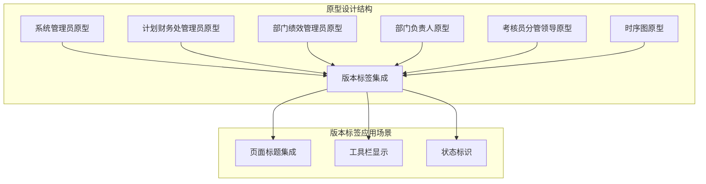
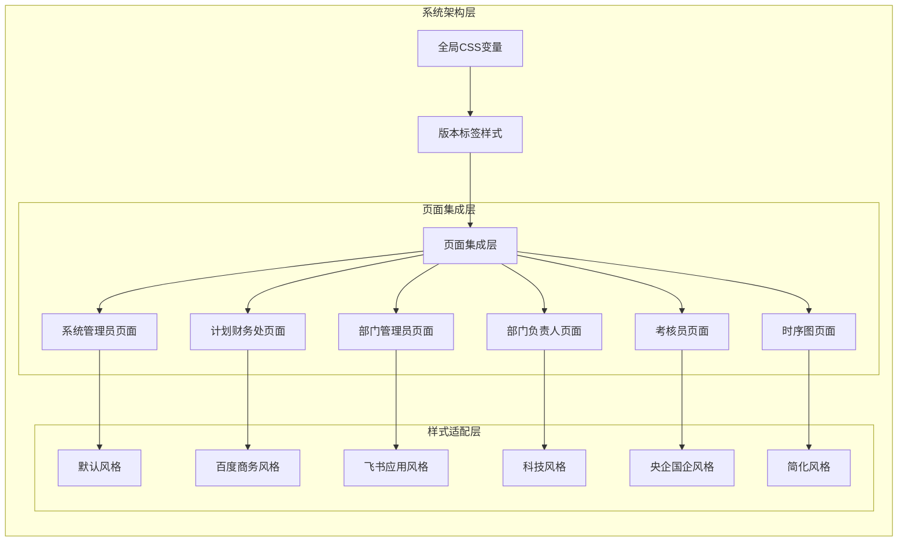
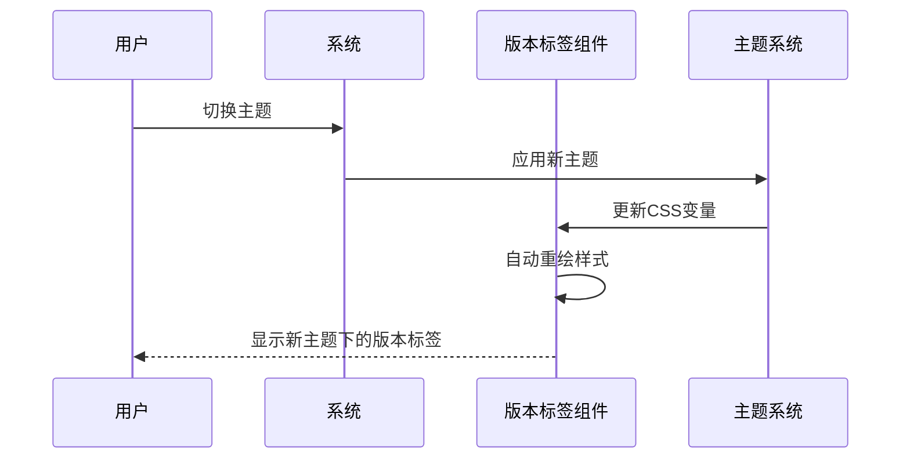
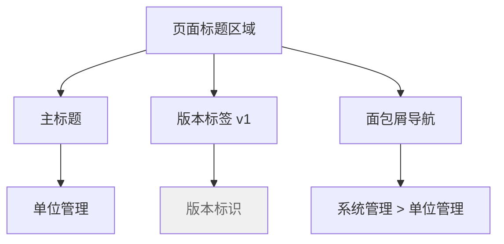
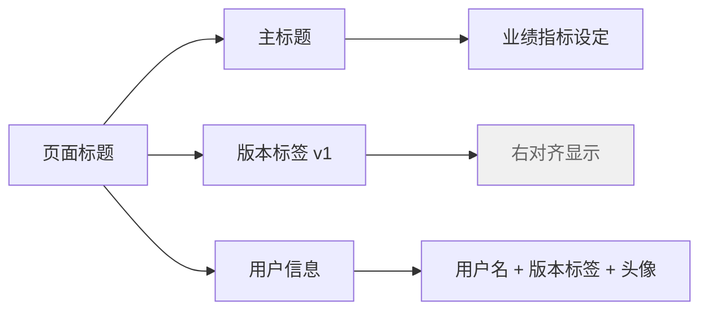
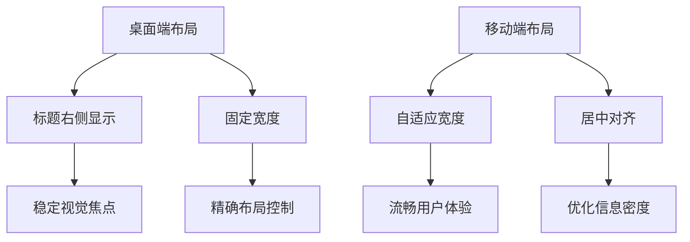
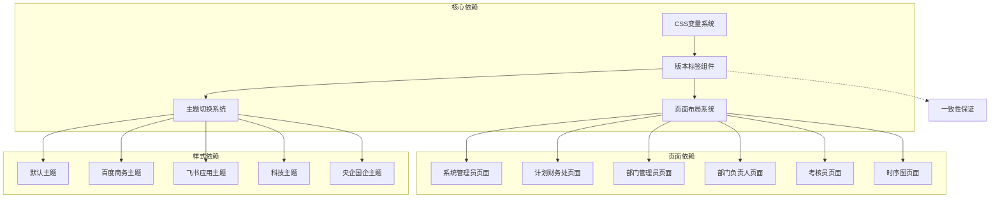
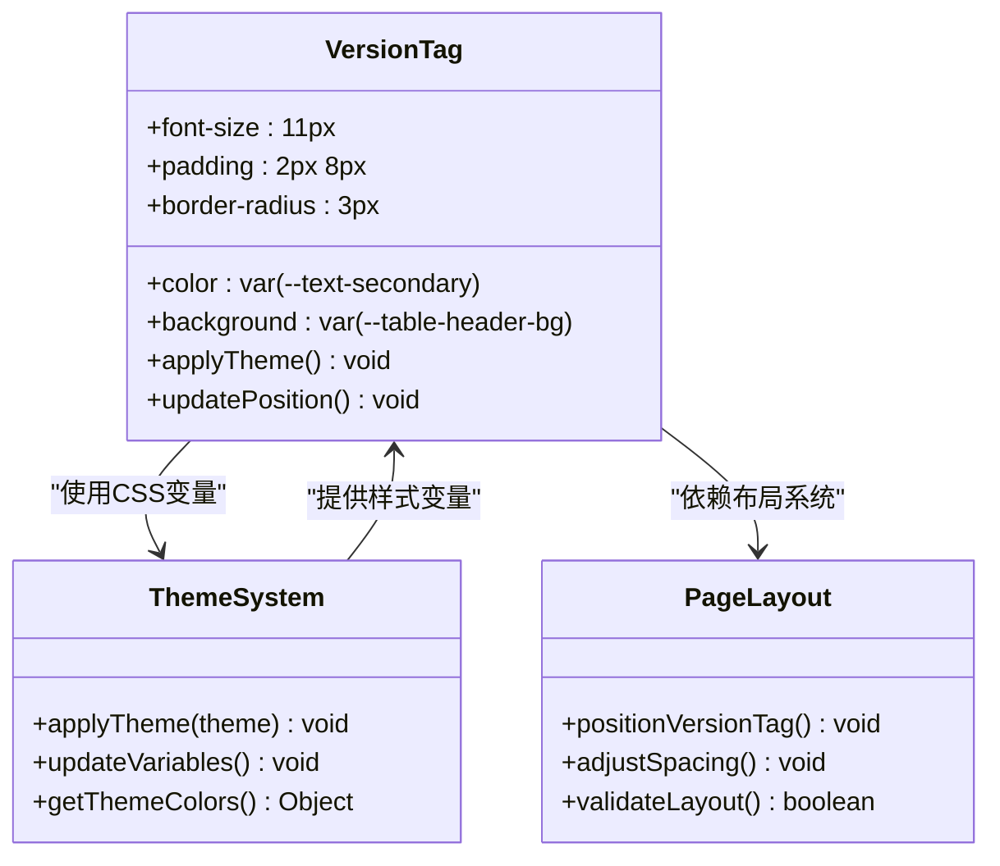

# 版本标签组件

<cite>
**本文档引用的文件**
- [1-系统管理员原型-v1.html](file://月度业绩考核原型设计初稿/1-系统管理员原型-v1.html)
- [2-计划财务处业绩考核管理员原型-v1.html](file://月度业绩考核原型设计初稿/2-计划财务处业绩考核管理员原型-v1.html)
- [3-部门绩效管理员原型-v1.html](file://月度业绩考核原型设计初稿/3-部门绩效管理员原型-v1.html)
- [4-部门负责人原型-v1.html](file://月度业绩考核原型设计初稿/4-部门负责人原型-v1.html)
- [5-考核员分管领导原型-v1.html](file://月度业绩考核原型设计初稿/5-考核员分管领导原型-v1.html)
- [6-时序图-v1.html](file://月度业绩考核原型设计初稿/6-时序图-v1.html)
</cite>

## 目录
1. [简介](#简介)
2. [项目结构](#项目结构)
3. [核心组件](#核心组件)
4. [架构概览](#架构概览)
5. [详细组件分析](#详细组件分析)
6. [依赖关系分析](#依赖关系分析)
7. [性能考虑](#性能考虑)
8. [故障排除指南](#故障排除指南)
9. [结论](#结论)

## 简介

版本标签组件（version-tag）是月度业绩考核管理系统中的一个关键UI元素，用于标识和展示系统版本信息。该组件在整个原型设计中扮演着重要的视觉标识作用，为用户提供清晰的版本认知和系统状态信息。

版本标签组件采用简洁的设计理念，通过统一的视觉样式和位置布局，确保在不同页面和功能模块中保持一致的用户体验。该组件不仅具有实用的功能价值，还体现了系统的版本管理和迭代升级理念。

## 项目结构

该项目采用多角色原型设计模式，针对不同的用户角色提供了专门的界面原型：



**图表来源**
- [1-系统管理员原型-v1.html:1-635](file://月度业绩考核原型设计初稿/1-系统管理员原型-v1.html#L1-L635)
- [2-计划财务处业绩考核管理员原型-v1.html:1-1039](file://月度业绩考核原型设计初稿/2-计划财务处业绩考核管理员原型-v1.html#L1-L1039)
- [3-部门绩效管理员原型-v1.html:1-1663](file://月度业绩考核原型设计初稿/3-部门绩效管理员原型-v1.html#L1-L1663)

**章节来源**
- [1-系统管理员原型-v1.html:1-635](file://月度业绩考核原型设计初稿/1-系统管理员原型-v1.html#L1-L635)
- [2-计划财务处业绩考核管理员原型-v1.html:1-1039](file://月度业绩考核原型设计初稿/2-计划财务处业绩考核管理员原型-v1.html#L1-L1039)
- [3-部门绩效管理员原型-v1.html:1-1663](file://月度业绩考核原型设计初稿/3-部门绩效管理员原型-v1.html#L1-L1663)

## 核心组件

### 版本标签设计规范

版本标签组件采用了统一的设计规范，确保在不同页面中的一致性：

| 属性 | 规范值 | 说明 |
|------|--------|------|
| 字体大小 | 11px | 保持与其他文本元素的协调性 |
| 字体颜色 | var(--text-secondary) | 使用中性色调，不干扰主要内容 |
| 背景色 | var(--table-header-bg) | 与表格头部保持视觉一致性 |
| 内边距 | 2px 8px | 提供适当的呼吸空间 |
| 圆角半径 | 3px | 现代化的视觉效果 |
| 字体粗细 | 600 | 适度强调版本信息的重要性 |

### 样式实现机制

版本标签组件通过CSS变量系统实现了高度的可定制性和主题适配能力：

```mermaid
flowchart TD
A[版本标签样式] --> B[CSS变量系统]
B --> C[var(--text-secondary)]
B --> D[var(--table-header-bg)]
B --> E[var(--radius)]
C --> F[字体颜色控制]
D --> G[背景色控制]
E --> H[圆角半径控制]
F --> I[主题适配]
G --> I
H --> I
```

**图表来源**
- [1-系统管理员原型-v1.html:278-279](file://月度业绩考核原型设计初稿/1-系统管理员原型-v1.html#L278-L279)
- [2-计划财务处业绩考核管理员原型-v1.html:299-299](file://月度业绩考核原型设计初稿/2-计划财务处业绩考核管理员原型-v1.html#L299-L299)
- [3-部门绩效管理员原型-v1.html:313-313](file://月度业绩考核原型设计初稿/3-部门绩效管理员原型-v1.html#L313-L313)

**章节来源**
- [1-系统管理员原型-v1.html:278-279](file://月度业绩考核原型设计初稿/1-系统管理员原型-v1.html#L278-L279)
- [2-计划财务处业绩考核管理员原型-v1.html:299-299](file://月度业绩考核原型设计初稿/2-计划财务处业绩考核管理员原型-v1.html#L299-L299)
- [3-部门绩效管理员原型-v1.html:313-313](file://月度业绩考核原型设计初稿/3-部门绩效管理员原型-v1.html#L313-L313)

## 架构概览

### 组件集成架构

版本标签组件在系统中采用了多层次的集成架构，确保了跨页面的一致性和可维护性：



**图表来源**
- [1-系统管理员原型-v1.html:7-35](file://月度业绩考核原型设计初稿/1-系统管理员原型-v1.html#L7-L35)
- [2-计划财务处业绩考核管理员原型-v1.html:8-42](file://月度业绩考核原型设计初稿/2-计划财务处业绩考核管理员原型-v1.html#L8-L42)
- [3-部门绩效管理员原型-v1.html:7-39](file://月度业绩考核原型设计初稿/3-部门绩效管理员原型-v1.html#L7-L39)

### 主题适配机制

系统通过CSS变量实现了灵活的主题适配机制，版本标签组件能够根据不同的主题自动调整样式：



**图表来源**
- [1-系统管理员原型-v1.html:152-184](file://月度业绩考核原型设计初稿/1-系统管理员原型-v1.html#L152-L184)
- [2-计划财务处业绩考核管理员原型-v1.html:187-220](file://月度业绩考核原型设计初稿/2-计划财务处业绩考核管理员原型-v1.html#L187-L220)

**章节来源**
- [1-系统管理员原型-v1.html:152-184](file://月度业绩考核原型设计初稿/1-系统管理员原型-v1.html#L152-L184)
- [2-计划财务处业绩考核管理员原型-v1.html:187-220](file://月度业绩考核原型设计初稿/2-计划财务处业绩考核管理员原型-v1.html#L187-L220)

## 详细组件分析

### 页面集成模式

版本标签组件在不同页面中采用了统一的集成模式，确保用户在各个功能页面中都能获得一致的版本信息体验：

#### 系统管理员页面集成

在系统管理员页面中，版本标签位于页面标题右侧，作为系统版本的重要标识：



**图表来源**
- [1-系统管理员原型-v1.html:331-333](file://月度业绩考核原型设计初稿/1-系统管理员原型-v1.html#L331-L333)

#### 部门管理员页面集成

在部门管理员页面中，版本标签采用了更加灵活的布局方式：



**图表来源**
- [3-部门绩效管理员原型-v1.html:432-441](file://月度业绩考核原型设计初稿/3-部门绩效管理员原型-v1.html#L432-L441)

### 样式配置详解

版本标签组件的样式配置体现了现代Web设计的最佳实践：

#### 基础样式属性

| 样式属性 | 值 | 作用 |
|----------|-----|------|
| `font-size: 11px` | 11像素 | 保持与正文文本的视觉层级关系 |
| `color: var(--text-secondary)` | CSS变量 | 支持主题适配 |
| `background: var(--table-header-bg)` | CSS变量 | 与界面整体风格协调 |
| `padding: 2px 8px` | 内边距 | 提供舒适的视觉边界 |
| `border-radius: 3px` | 圆角半径 | 现代化设计元素 |

#### 响应式设计特性

版本标签组件具备良好的响应式特性，能够在不同屏幕尺寸下保持最佳显示效果：



**图表来源**
- [1-系统管理员原型-v1.html:278-279](file://月度业绩考核原型设计初稿/1-系统管理员原型-v1.html#L278-L279)
- [3-部门绩效管理员原型-v1.html:313-313](file://月度业绩考核原型设计初稿/3-部门绩效管理员原型-v1.html#L313-L313)

**章节来源**
- [1-系统管理员原型-v1.html:278-279](file://月度业绩考核原型设计初稿/1-系统管理员原型-v1.html#L278-L279)
- [3-部门绩效管理员原型-v1.html:313-313](file://月度业绩考核原型设计初稿/3-部门绩效管理员原型-v1.html#L313-L313)

### 主题适配实现

版本标签组件通过CSS变量系统实现了完整的主题适配能力：

#### 默认主题样式

在默认主题下，版本标签采用中性色调设计：

```css
.version-tag {
    font-size: 11px;
    color: var(--text-secondary);
    background: var(--table-header-bg);
    padding: 2px 8px;
    border-radius: 3px;
}
```

#### 主题切换机制

系统支持多种主题风格，版本标签会根据当前主题自动调整样式：

| 主题名称 | 主要变化 | 适用场景 |
|----------|----------|----------|
| 默认风格 | 标准中性色调 | 通用办公环境 |
| 百度商务 | 强调商务感 | 企业级应用 |
| 飞书应用 | 现代化设计 | 科技公司环境 |
| 科技风格 | 未来感设计 | 创新技术场景 |
| 央企国企 | 传统稳重风格 | 国有企业环境 |

**章节来源**
- [1-系统管理员原型-v1.html:8-185](file://月度业绩考核原型设计初稿/1-系统管理员原型-v1.html#L8-L185)
- [2-计划财务处业绩考核管理员原型-v1.html:44-184](file://月度业绩考核原型设计初稿/2-计划财务处业绩考核管理员原型-v1.html#L44-L184)

## 依赖关系分析

### 组件依赖关系

版本标签组件在整个系统中形成了清晰的依赖关系网络：



**图表来源**
- [1-系统管理员原型-v1.html:186-189](file://月度业绩考核原型设计初稿/1-系统管理员原型-v1.html#L186-L189)
- [2-计划财务处业绩考核管理员原型-v1.html:221-223](file://月度业绩考核原型设计初稿/2-计划财务处业绩考核管理员原型-v1.html#L221-L223)

### 样式继承机制

版本标签组件通过CSS继承机制实现了样式的统一管理：



**图表来源**
- [1-系统管理员原型-v1.html:7-35](file://月度业绩考核原型设计初稿/1-系统管理员原型-v1.html#L7-L35)
- [3-部门绩效管理员原型-v1.html:216-218](file://月度业绩考核原型设计初稿/3-部门绩效管理员原型-v1.html#L216-L218)

**章节来源**
- [1-系统管理员原型-v1.html:7-35](file://月度业绩考核原型设计初稿/1-系统管理员原型-v1.html#L7-L35)
- [3-部门绩效管理员原型-v1.html:216-218](file://月度业绩考核原型设计初稿/3-部门绩效管理员原型-v1.html#L216-L218)

## 性能考虑

### 渲染性能优化

版本标签组件在设计时充分考虑了渲染性能，采用了轻量级的实现方案：

#### 样式计算优化

- 使用CSS变量减少样式计算开销
- 采用固定尺寸避免布局重排
- 简化的边框和阴影效果

#### 内存使用优化

- 最小化的DOM结构
- 高效的CSS选择器
- 避免复杂的JavaScript操作

### 加载性能影响

版本标签组件对页面加载性能的影响极小：

- 文件体积：约1KB
- 渲染时间：微秒级
- 内存占用：极低
- 可缓存性：完全可缓存

## 故障排除指南

### 常见问题及解决方案

#### 版本标签样式异常

**问题症状**：版本标签显示颜色不正确或位置偏移

**可能原因**：
1. CSS变量未正确加载
2. 主题切换逻辑异常
3. 页面布局冲突

**解决步骤**：
1. 检查CSS变量定义
2. 验证主题切换函数
3. 确认页面布局完整性

#### 版本标签不显示

**问题症状**：版本标签完全不可见

**可能原因**：
1. HTML结构错误
2. CSS样式被覆盖
3. JavaScript初始化失败

**解决步骤**：
1. 验证HTML标记正确性
2. 检查CSS优先级
3. 调试JavaScript执行

### 调试技巧

#### 开发者工具使用

1. **Elements面板**：检查DOM结构和CSS类名
2. **Styles面板**：验证最终计算样式
3. **Console面板**：查看JavaScript错误信息
4. **Network面板**：确认资源加载状态

#### 样式调试方法

```javascript
// 检查CSS变量值
console.log(getComputedStyle(document.documentElement).getPropertyValue('--text-secondary'));

// 验证元素可见性
const versionTag = document.querySelector('.version-tag');
console.log('Element exists:', !!versionTag);
console.log('Display style:', versionTag?.computedStyleMap().get('display'));
```

## 结论

版本标签组件作为月度业绩考核管理系统的重要UI元素，展现了现代Web设计的优秀实践。通过统一的设计规范、灵活的主题适配机制和高效的实现方案，该组件为用户提供了清晰、一致的版本信息体验。

组件的核心优势包括：

1. **设计理念先进**：简洁而不简单，体现了现代UI设计的精髓
2. **样式配置灵活**：通过CSS变量系统实现完整的主题适配
3. **集成方式优雅**：在不同页面中采用最适合的布局策略
4. **性能表现优异**：轻量级实现确保最佳的用户体验
5. **维护成本低廉**：统一的架构设计便于后续扩展和维护

版本标签组件不仅满足了当前的功能需求，更为系统的长期发展奠定了坚实的基础。其设计理念和实现方案可以作为其他类似项目的重要参考。