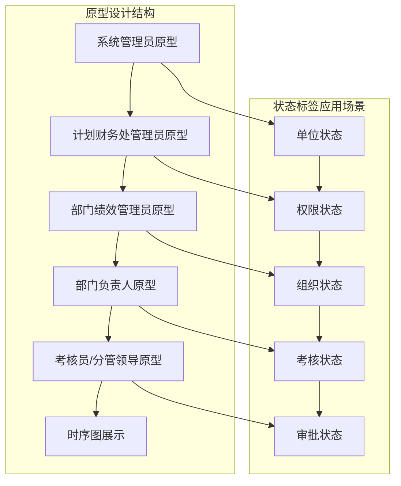
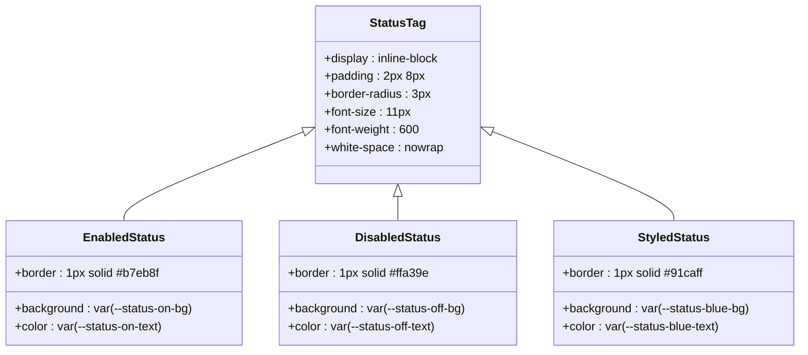
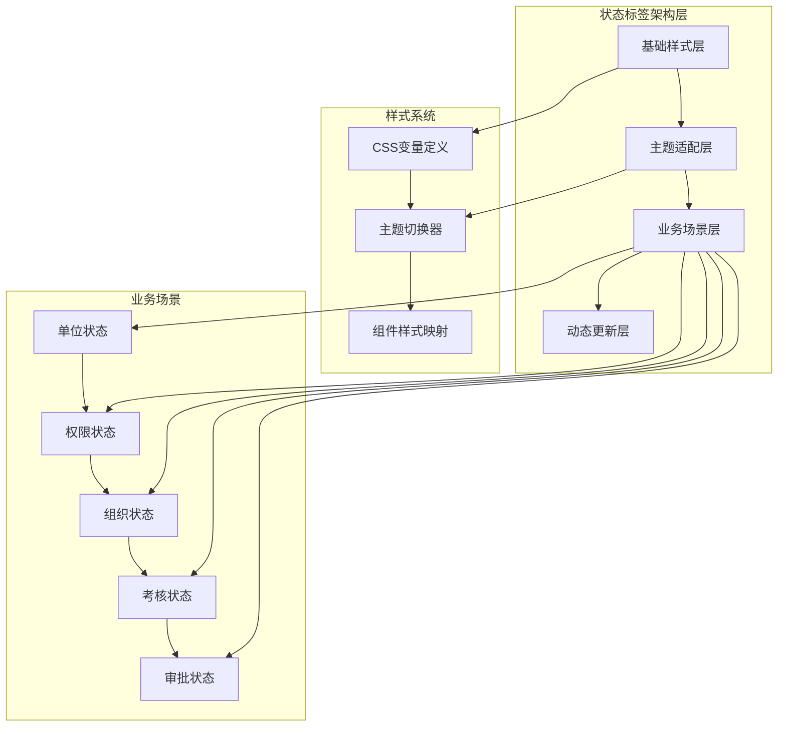
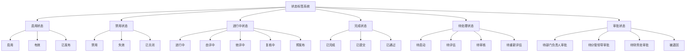
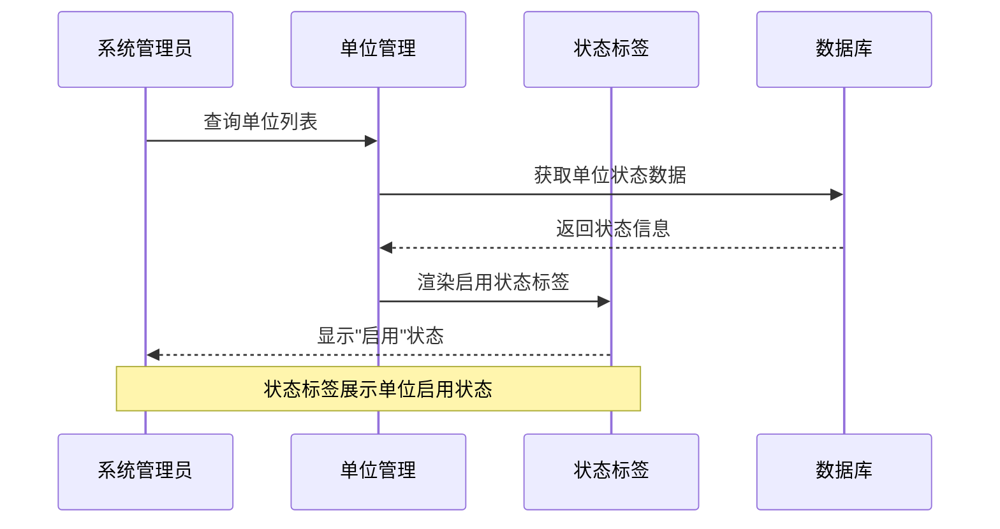
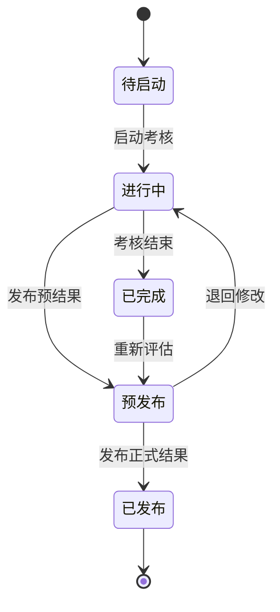
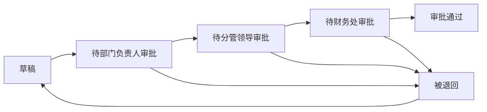
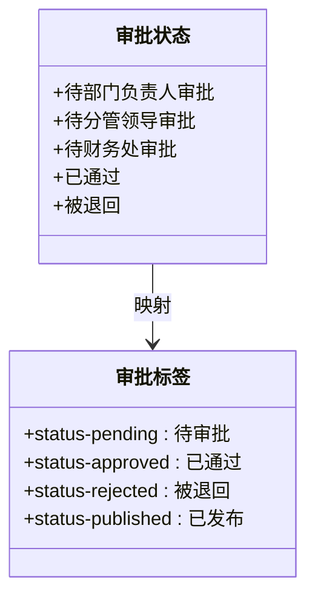
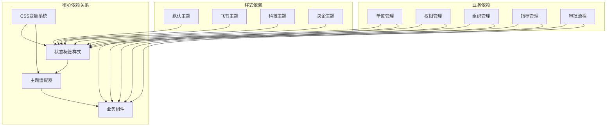

# 状态标签组件

<cite>
**本文档引用的文件**
- [系统管理员原型-v1.html](file://月度业绩考核原型设计初稿/1-系统管理员原型-v1.html)
- [计划财务处业绩考核管理员原型-v1.html](file://月度业绩考核原型设计初稿/2-计划财务处业绩考核管理员原型-v1.html)
- [部门绩效管理员原型-v1.html](file://月度业绩考核原型设计初稿/3-部门绩效管理员原型-v1.html)
- [部门负责人原型-v1.html](file://月度业绩考核原型设计初稿/4-部门负责人原型-v1.html)
- [考核员分管领导原型-v1.html](file://月度业绩考核原型设计初稿/5-考核员分管领导原型-v1.html)
- [时序图-v1.html](file://月度业绩考核原型设计初稿/6-时序图-v1.html)
</cite>

## 目录
1. [简介](#简介)
2. [项目结构](#项目结构)
3. [核心组件](#核心组件)
4. [架构概览](#架构概览)
5. [详细组件分析](#详细组件分析)
6. [依赖关系分析](#依赖关系分析)
7. [性能考虑](#性能考虑)
8. [故障排除指南](#故障排除指南)
9. [结论](#结论)

## 简介

状态标签组件（status-tag）是月度业绩考核管理系统中的关键UI元素，用于直观展示系统中各种实体的状态信息。该组件在原型设计中广泛应用于单位状态、权限状态、组织状态、考核状态等多个业务场景，为用户提供清晰的状态可视化。

该组件采用CSS变量驱动的设计理念，支持多种状态样式和主题适配，能够根据不同的业务需求动态展示相应的状态信息。通过统一的样式规范和灵活的配置选项，状态标签组件为整个考核系统提供了连贯一致的用户体验。

## 项目结构

该项目采用多角色原型设计模式，包含六个主要原型页面，每个页面针对不同的用户角色和业务场景：

**图表来源**
- [系统管理员原型-v1.html:330-358](file://月度业绩考核原型设计初稿/1-系统管理员原型-v1.html#L330-L358)
- [计划财务处业绩考核管理员原型-v1.html:353-446](file://月度业绩考核原型设计初稿/2-计划财务处业绩考核管理员原型-v1.html#L353-L446)
- [部门绩效管理员原型-v1.html:445-522](file://月度业绩考核原型设计初稿/3-部门绩效管理员原型-v1.html#L445-L522)

**章节来源**
- [系统管理员原型-v1.html:1-635](file://月度业绩考核原型设计初稿/1-系统管理员原型-v1.html#L1-L635)
- [计划财务处业绩考核管理员原型-v1.html:1-1039](file://月度业绩考核原型设计初稿/2-计划财务处业绩考核管理员原型-v1.html#L1-L1039)

## 核心组件

### 状态标签基础样式

状态标签组件采用统一的基础样式定义，确保在不同场景下的一致性表现：

**图表来源**
- [系统管理员原型-v1.html:241-243](file://月度业绩考核原型设计初稿/1-系统管理员原型-v1.html#L241-L243)
- [计划财务处业绩考核管理员原型-v1.html:269-274](file://月度业绩考核管理员原型设计初稿/2-计划财务处业绩考核管理员原型-v1.html#L269-L274)
- [部门绩效管理员原型-v1.html:277-285](file://月度业绩考核原型设计初稿/3-部门绩效管理员原型-v1.html#L277-L285)

### 主题系统架构

状态标签组件支持四种不同的主题风格，每种风格都有其独特的颜色配置和视觉效果：

| 主题风格 | CSS变量前缀 | 主要颜色 | 适用场景 |
|---------|------------|----------|----------|
| 默认风格 | --status- | 绿色启用、红色禁用 | 基础业务场景 |
| 百度商务 | --status- | 蓝紫色系 | 商务环境 |
| 飞书应用 | --status- | 渐变色彩 | 现代办公 |
| 科技风格 | --status- | 半透明效果 | 科技感场景 |

**章节来源**
- [系统管理员原型-v1.html:8-35](file://月度业绩考核原型设计初稿/1-系统管理员原型-v1.html#L8-L35)
- [计划财务处业绩考核管理员原型-v1.html:8-42](file://月度业绩考核管理员原型设计初稿/2-计划财务处业绩考核管理员原型-v1.html#L8-L42)
- [部门绩效管理员原型-v1.html:8-39](file://月度业绩考核原型设计初稿/3-部门绩效管理员原型-v1.html#L8-L39)

## 架构概览

状态标签组件在整个系统中的架构位置和交互关系如下：

**图表来源**
- [系统管理员原型-v1.html:152-184](file://月度业绩考核原型设计初稿/1-系统管理员原型-v1.html#L152-L184)
- [计划财务处业绩考核管理员原型-v1.html:187-219](file://月度业绩考核管理员原型设计初稿/2-计划财务处业绩考核管理员原型-v1.html#L187-L219)

### 状态类型分类

状态标签组件支持多种状态类型的分类和展示：

**图表来源**
- [系统管理员原型-v1.html:350-354](file://月度业绩考核原型设计初稿/1-系统管理员原型-v1.html#L350-L354)
- [计划财务处业绩考核管理员原型-v1.html:374-404](file://月度业绩考核管理员原型设计初稿/2-计划财务处业绩考核管理员原型-v1.html#L374-L404)
- [部门负责人原型-v1.html:465-522](file://月度业绩考核原型设计初稿/4-部门负责人原型-v1.html#L465-L522)

## 详细组件分析

### 系统管理员场景

系统管理员原型中的状态标签主要用于单位管理和权限管理场景：

#### 单位状态展示

**图表来源**
- [系统管理员原型-v1.html:349-354](file://月度业绩考核原型设计初稿/1-系统管理员原型-v1.html#L349-L354)

#### 权限状态管理

系统管理员通过状态标签监控用户的权限分配状态，包括权限的有效性和分配范围。

**章节来源**
- [系统管理员原型-v1.html:330-358](file://月度业绩考核原型设计初稿/1-系统管理员原型-v1.html#L330-L358)

### 计划财务处管理员场景

计划财务处管理员原型展示了丰富的状态标签应用场景：

#### 考核组状态管理

**图表来源**
- [计划财务处业绩考核管理员原型-v1.html:374-404](file://月度业绩考核管理员原型设计初稿/2-计划财务处业绩考核管理员原型-v1.html#L374-L404)

#### 指标审批状态

状态标签用于展示指标审批的完整流程状态，包括草稿、待审批、审批通过、被退回等状态。

**章节来源**
- [计划财务处业绩考核管理员原型-v1.html:449-478](file://月度业绩考核原型设计初稿/2-计划财务处业绩考核管理员原型-v1.html#L449-L478)

### 部门绩效管理员场景

部门绩效管理员原型中的状态标签主要用于指标设定和自评管理：

#### 指标设定状态

**图表来源**
- [部门绩效管理员原型-v1.html:473-496](file://月度业绩考核原型设计初稿/3-部门绩效管理员原型-v1.html#L473-L496)

#### 自评状态管理

部门绩效管理员通过状态标签跟踪部门的自评完成情况，包括待提交、已提交等状态。

**章节来源**
- [部门绩效管理员原型-v1.html:525-596](file://月度业绩考核原型设计初稿/3-部门绩效管理员原型-v1.html#L525-L596)

### 部门负责人场景

部门负责人原型中的状态标签主要用于审批管理和结果查看：

#### 审批状态展示

**图表来源**
- [部门负责人原型-v1.html:465-522](file://月度业绩考核原型设计初稿/4-部门负责人原型-v1.html#L465-L522)

**章节来源**
- [部门负责人原型-v1.html:380-538](file://月度业绩考核原型设计初稿/4-部门负责人原型-v1.html#L380-L538)

### 考核员/分管领导场景

考核员和分管领导原型中的状态标签主要用于评估打分和进度管理：

#### 评估状态管理

状态标签用于展示评估过程中的各个阶段状态，包括待评估、已完成、进行中等状态。

**章节来源**
- [考核员分管领导原型-v1.html:242-343](file://月度业绩考核原型设计初稿/5-考核员分管领导原型-v1.html#L242-L343)

## 依赖关系分析

状态标签组件在整个系统中的依赖关系和影响范围：

**图表来源**
- [系统管理员原型-v1.html:186-189](file://月度业绩考核原型设计初稿/1-系统管理员原型-v1.html#L186-L189)
- [计划财务处业绩考核管理员原型-v1.html:221-224](file://月度业绩考核管理员原型设计初稿/2-计划财务处业绩考核管理员原型-v1.html#L221-L224)

### 组件耦合度分析

状态标签组件具有以下特点：

- **低耦合性**：状态标签组件独立于具体业务逻辑，通过CSS类名和CSS变量进行样式控制
- **高内聚性**：组件功能集中在状态展示，职责明确
- **可扩展性**：通过CSS变量和主题系统支持新的状态类型和样式

**章节来源**
- [系统管理员原型-v1.html:241-243](file://月度业绩考核原型设计初稿/1-系统管理员原型-v1.html#L241-L243)
- [计划财务处业绩考核管理员原型-v1.html:269-274](file://月度业绩考核管理员原型设计初稿/2-计划财务处业绩考核管理员原型-v1.html#L269-L274)

## 性能考虑

状态标签组件在性能方面的优化策略：

### 样式性能优化

1. **CSS变量缓存**：通过CSS变量减少重复样式的定义和计算
2. **最小化重绘**：状态标签采用简单的块级布局，避免复杂的重排操作
3. **主题切换优化**：通过类名切换实现主题切换，避免样式重载

### 渲染性能优化

1. **虚拟DOM**：在JavaScript层面实现状态标签的动态更新
2. **事件委托**：通过事件委托减少事件处理器的数量
3. **懒加载**：状态标签在需要时才进行渲染和样式计算

## 故障排除指南

### 常见问题及解决方案

#### 状态标签样式异常

**问题描述**：状态标签显示颜色不正确或样式错乱

**可能原因**：
- CSS变量未正确加载
- 主题类名冲突
- 样式优先级问题

**解决方法**：
1. 检查CSS变量定义是否正确
2. 确认主题类名的正确性
3. 调整样式优先级

#### 状态更新延迟

**问题描述**：状态变化后界面更新不及时

**解决方法**：
1. 检查JavaScript事件绑定
2. 确认DOM更新时机
3. 优化状态管理逻辑

**章节来源**
- [系统管理员原型-v1.html:612-632](file://月度业绩考核原型设计初稿/1-系统管理员原型-v1.html#L612-L632)
- [计划财务处业绩考核管理员原型-v1.html:315-322](file://月度业绩考核管理员原型设计初稿/2-计划财务处业绩考核管理员原型-v1.html#L315-L322)

## 结论

状态标签组件作为月度业绩考核管理系统的核心UI元素，展现了优秀的设计理念和实现方案。通过CSS变量驱动的主题系统、灵活的状态分类机制和完善的业务场景适配，该组件为整个系统提供了统一、直观的状态可视化体验。

组件的主要优势包括：

1. **设计理念先进**：采用CSS变量和现代CSS特性
2. **主题适配完善**：支持多种主题风格和自定义扩展
3. **业务场景丰富**：覆盖系统管理、审批流程、评估打分等全方位业务场景
4. **性能优化到位**：通过多种优化策略确保良好的用户体验

未来可以考虑的改进方向包括：增强响应式设计、优化移动端体验、增加动画效果等，以进一步提升用户体验和系统价值。