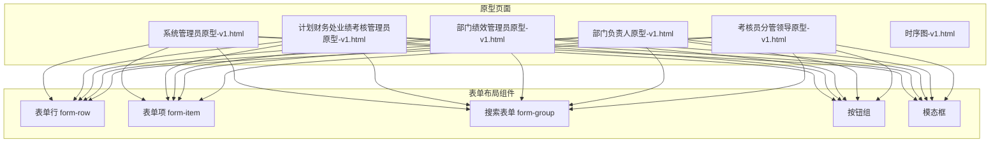
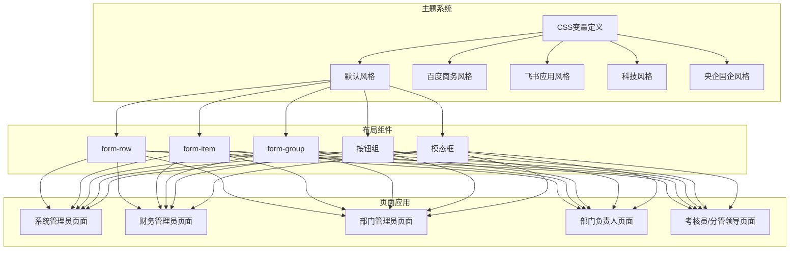
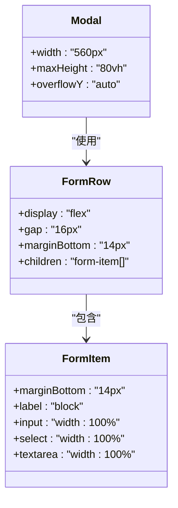
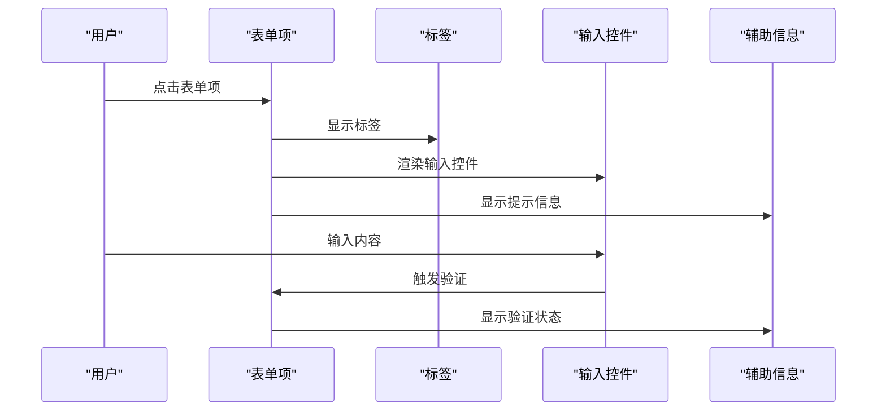
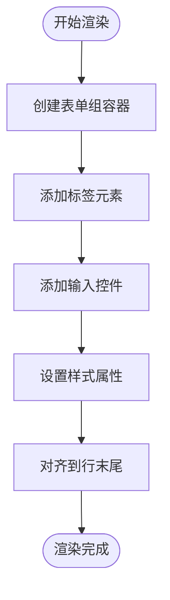
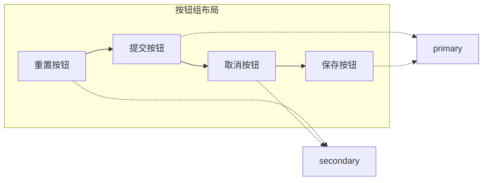
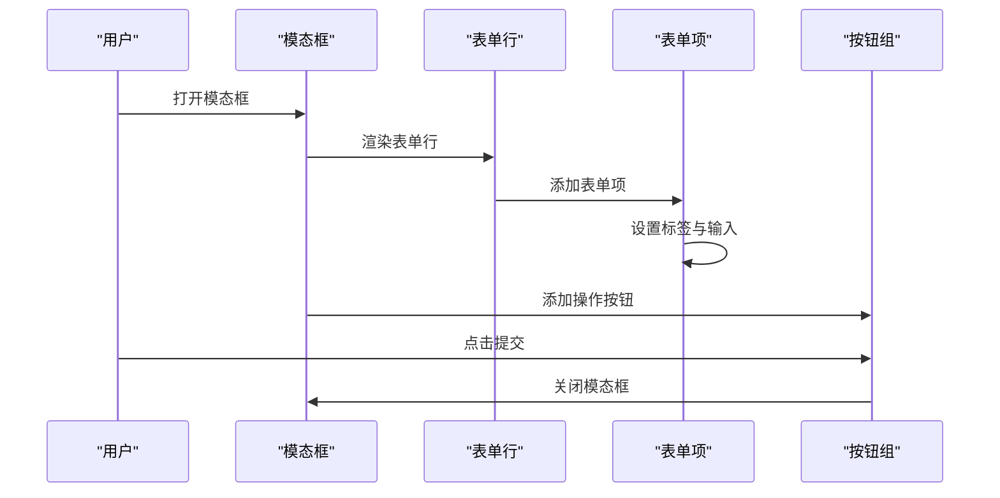
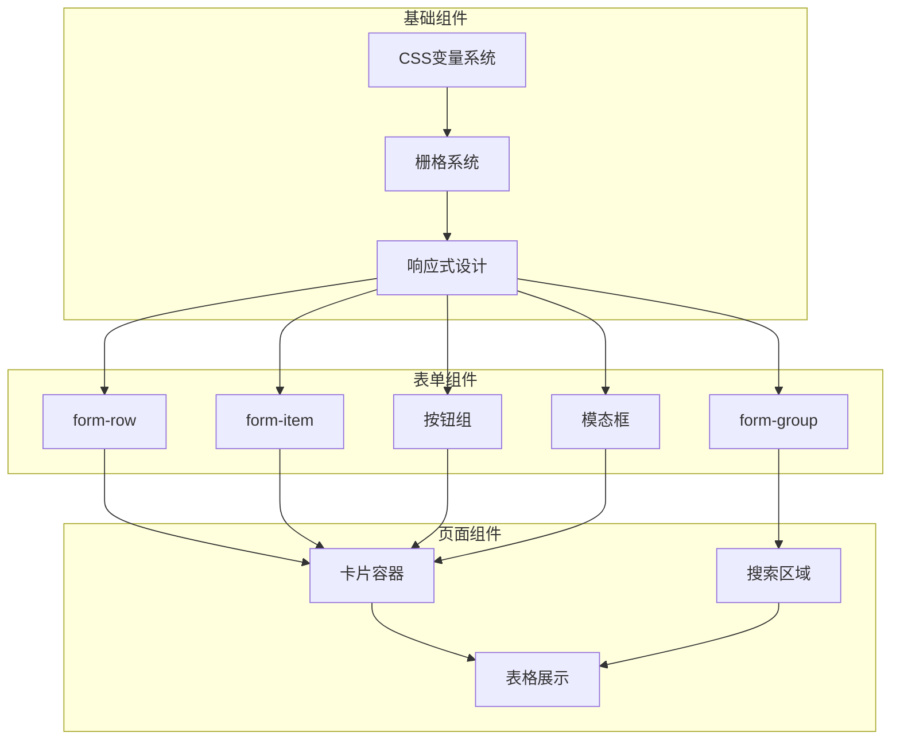

# 表单布局

<cite>
**本文档引用的文件**
- [系统管理员原型-v1.html](file://月度业绩考核原型设计初稿/1-系统管理员原型-v1.html)
- [计划财务处业绩考核管理员原型-v1.html](file://月度业绩考核原型设计初稿/2-计划财务处业绩考核管理员原型-v1.html)
- [部门绩效管理员原型-v1.html](file://月度业绩考核原型设计初稿/3-部门绩效管理员原型-v1.html)
- [部门负责人原型-v1.html](file://月度业绩考核原型设计初稿/4-部门负责人原型-v1.html)
- [考核员分管领导原型-v1.html](file://月度业绩考核原型设计初稿/5-考核员分管领导原型-v1.html)
- [时序图-v1.html](file://月度业绩考核原型设计初稿/6-时序图-v1.html)
</cite>

## 目录
1. [简介](#简介)
2. [项目结构](#项目结构)
3. [核心组件](#核心组件)
4. [架构概览](#架构概览)
5. [详细组件分析](#详细组件分析)
6. [依赖关系分析](#依赖关系分析)
7. [性能考虑](#性能考虑)
8. [故障排除指南](#故障排除指南)
9. [结论](#结论)
10. [附录](#附录)

## 简介
本文件系统性梳理了月度业绩考核原型设计中的表单布局体系，涵盖表单行(form-row)、表单项(form-item)、标签对齐与间距控制、响应式布局与栅格系统、字段分组与折叠展开、动态显示机制、验证提示与错误信息布局、按钮位置配置以及整体样式定制与主题适配，并提供无障碍访问支持与屏幕阅读器兼容性实现指南。

## 项目结构
该项目采用多角色原型页面设计，每个角色页面均包含完整的表单布局示例，便于理解不同场景下的表单设计模式与交互逻辑。

**图表来源**
- [系统管理员原型-v1.html:219-279](file://月度业绩考核原型设计初稿/1-系统管理员原型-v1.html#L219-L279)
- [计划财务处业绩考核管理员原型-v1.html:249-313](file://月度业绩考核原型设计初稿/2-计划财务处业绩考核管理员原型-v1.html#L249-L313)
- [部门绩效管理员原型-v1.html:249-399](file://月度业绩考核原型设计初稿/3-部门绩效管理员原型-v1.html#L249-L399)
- [部门负责人原型-v1.html:231-338](file://月度业绩考核原型设计初稿/4-部门负责人原型-v1.html#L231-L338)
- [考核员分管领导原型-v1.html:47-192](file://月度业绩考核原型设计初稿/5-考核员分管领导原型-v1.html#L47-L192)

**章节来源**
- [系统管理员原型-v1.html:1-635](file://月度业绩考核原型设计初稿/1-系统管理员原型-v1.html#L1-L635)
- [计划财务处业绩考核管理员原型-v1.html:1-1039](file://月度业绩考核原型设计初稿/2-计划财务处业绩考核管理员原型-v1.html#L1-L1039)
- [部门绩效管理员原型-v1.html:1-1663](file://月度业绩考核原型设计初稿/3-部门绩效管理员原型-v1.html#L1-L1663)
- [部门负责人原型-v1.html:1-1231](file://月度业绩考核原型设计初稿/4-部门负责人原型-v1.html#L1-L1231)
- [考核员分管领导原型-v1.html:1-1459](file://月度业绩考核原型设计初稿/5-考核员分管领导原型-v1.html#L1-L1459)

## 核心组件
本项目的核心表单布局组件包括：
- 表单行(form-row)：用于在模态框或卡片内并排展示多个字段，支持等宽分配与间距控制
- 表单项(form-item)：单个字段容器，包含标签、输入控件与辅助信息
- 搜索表单(form-group)：用于查询条件的垂直布局，支持标签与输入框的对齐
- 按钮组：表单底部的操作按钮集合，支持主操作与次要操作的区分
- 模态框：包含复杂表单的弹窗容器，支持多行字段与标签对齐

**章节来源**
- [系统管理员原型-v1.html:259-279](file://月度业绩考核原型设计初稿/1-系统管理员原型-v1.html#L259-L279)
- [计划财务处业绩考核管理员原型-v1.html:249-313](file://月度业绩考核原型设计初稿/2-计划财务处业绩考核管理员原型-v1.html#L249-L313)
- [部门绩效管理员原型-v1.html:249-399](file://月度业绩考核原型设计初稿/3-部门绩效管理员原型-v1.html#L249-L399)
- [部门负责人原型-v1.html:231-338](file://月度业绩考核原型设计初稿/4-部门负责人原型-v1.html#L231-L338)
- [考核员分管领导原型-v1.html:47-192](file://月度业绩考核原型设计初稿/5-考核员分管领导原型-v1.html#L47-L192)

## 架构概览
表单布局架构遵循统一的设计语言与响应式原则，通过CSS变量实现主题系统的可扩展性，并在不同页面中复用相同的布局组件。

**图表来源**
- [系统管理员原型-v1.html:8-185](file://月度业绩考核原型设计初稿/1-系统管理员原型-v1.html#L8-L185)
- [计划财务处业绩考核管理员原型-v1.html:8-184](file://月度业绩考核原型设计初稿/2-计划财务处业绩考核管理员原型-v1.html#L8-L184)
- [部门绩效管理员原型-v1.html:8-179](file://月度业绩考核原型设计初稿/3-部门绩效管理员原型-v1.html#L8-L179)
- [部门负责人原型-v1.html:8-160](file://月度业绩考核原型设计初稿/4-部门负责人原型-v1.html#L8-L160)
- [考核员分管领导原型-v1.html:7-192](file://月度业绩考核原型设计初稿/5-考核员分管领导原型-v1.html#L7-L192)

## 详细组件分析

### 表单行(form-row)分析
表单行组件提供并排字段布局能力，支持等宽分配与间距控制。

**图表来源**
- [系统管理员原型-v1.html:259-261](file://月度业绩考核原型设计初稿/1-系统管理员原型-v1.html#L259-L261)
- [系统管理员原型-v1.html:264-267](file://月度业绩考核原型设计初稿/1-系统管理员原型-v1.html#L264-L267)
- [计划财务处业绩考核管理员原型-v1.html:283-296](file://月度业绩考核原型设计初稿/2-计划财务考核管理员原型-v1.html#L283-L296)
- [部门负责人原型-v1.html:283-291](file://月度业绩考核原型设计初稿/4-部门负责人原型-v1.html#L283-L291)

**章节来源**
- [系统管理员原型-v1.html:259-279](file://月度业绩考核原型设计初稿/1-系统管理员原型-v1.html#L259-L279)
- [计划财务处业绩考核管理员原型-v1.html:283-313](file://月度业绩考核原型设计初稿/2-计划财务处业绩考核管理员原型-v1.html#L283-L313)
- [部门负责人原型-v1.html:283-338](file://月度业绩考核原型设计初稿/4-部门负责人原型-v1.html#L283-L338)

### 表单项(form-item)分析
表单项组件负责单个字段的完整展示，包括标签、输入控件与辅助信息。

**图表来源**
- [系统管理员原型-v1.html:262-267](file://月度业绩考核原型设计初稿/1-系统管理员原型-v1.html#L262-L267)
- [计划财务处业绩考核管理员原型-v1.html:285-291](file://月度业绩考核原型设计初稿/2-计划财务处业绩考核管理员原型-v1.html#L285-L291)
- [部门绩效管理员原型-v1.html:306-313](file://月度业绩考核原型设计初稿/3-部门绩效管理员原型-v1.html#L306-L313)

**章节来源**
- [系统管理员原型-v1.html:262-279](file://月度业绩考核原型设计初稿/1-系统管理员原型-v1.html#L262-L279)
- [计划财务处业绩考核管理员原型-v1.html:285-313](file://月度业绩考核原型设计初稿/2-计划财务处业绩考核管理员原型-v1.html#L285-L313)
- [部门绩效管理员原型-v1.html:306-399](file://月度业绩考核原型设计初稿/3-部门绩效管理员原型-v1.html#L306-L399)

### 搜索表单(form-group)分析
搜索表单组件提供查询条件的垂直布局，支持标签与输入框的对齐。

**图表来源**
- [系统管理员原型-v1.html:219-224](file://月度业绩考核原型设计初稿/1-系统管理员原型-v1.html#L219-L224)
- [计划财务处业绩考核管理员原型-v1.html:249-254](file://月度业绩考核原型设计初稿/2-计划财务处业绩考核管理员原型-v1.html#L249-L254)
- [部门绩效管理员原型-v1.html:249-254](file://月度业绩考核原型设计初稿/3-部门绩效管理员原型-v1.html#L249-L254)

**章节来源**
- [系统管理员原型-v1.html:219-254](file://月度业绩考核原型设计初稿/1-系统管理员原型-v1.html#L219-L254)
- [计划财务处业绩考核管理员原型-v1.html:249-254](file://月度业绩考核原型设计初稿/2-计划财务处业绩考核管理员原型-v1.html#L249-L254)
- [部门绩效管理员原型-v1.html:249-254](file://月度业绩考核原型设计初稿/3-部门绩效管理员原型-v1.html#L249-L254)

### 按钮组布局分析
按钮组提供表单操作的统一布局，支持主操作与次要操作的区分。

**图表来源**
- [系统管理员原型-v1.html:342-344](file://月度业绩考核原型设计初稿/1-系统管理员原型-v1.html#L342-L344)
- [计划财务处业绩考核管理员原型-v1.html:428-429](file://月度业绩考核原型设计初稿/2-计划财务处业绩考核管理员原型-v1.html#L428-L429)
- [部门负责人原型-v1.html:577-578](file://月度业绩考核原型设计初稿/4-部门负责人原型-v1.html#L577-L578)

**章节来源**
- [系统管理员原型-v1.html:342-344](file://月度业绩考核原型设计初稿/1-系统管理员原型-v1.html#L342-L344)
- [计划财务处业绩考核管理员原型-v1.html:428-429](file://月度业绩考核原型设计初稿/2-计划财务处业绩考核管理员原型-v1.html#L428-L429)
- [部门负责人原型-v1.html:577-578](file://月度业绩考核原型设计初稿/4-部门负责人原型-v1.html#L577-L578)

### 模态框表单分析
模态框提供复杂的表单展示环境，支持多行字段与标签对齐。

**图表来源**
- [系统管理员原型-v1.html:564-573](file://月度业绩考核原型设计初稿/1-系统管理员原型-v1.html#L564-L573)
- [计划财务处业绩考核管理员原型-v1.html:659-670](file://月度业绩考核原型设计初稿/2-计划财务处业绩考核管理员原型-v1.html#L659-L670)
- [部门负责人原型-v1.html:665-669](file://月度业绩考核原型设计初稿/4-部门负责人原型-v1.html#L665-L669)

**章节来源**
- [系统管理员原型-v1.html:564-602](file://月度业绩考核原型设计初稿/1-系统管理员原型-v1.html#L564-L602)
- [计划财务处业绩考核管理员原型-v1.html:659-727](file://月度业绩考核原型设计初稿/2-计划财务处业绩考核管理员原型-v1.html#L659-L727)
- [部门负责人原型-v1.html:665-669](file://月度业绩考核原型设计初稿/4-部门负责人原型-v1.html#L665-L669)

## 依赖关系分析
表单布局组件之间存在明确的依赖关系，形成完整的表单生态系统。

**图表来源**
- [系统管理员原型-v1.html:8-185](file://月度业绩考核原型设计初稿/1-系统管理员原型-v1.html#L8-L185)
- [计划财务处业绩考核管理员原型-v1.html:8-184](file://月度业绩考核原型设计初稿/2-计划财务处业绩考核管理员原型-v1.html#L8-L184)
- [部门绩效管理员原型-v1.html:8-179](file://月度业绩考核原型设计初稿/3-部门绩效管理员原型-v1.html#L8-L179)

**章节来源**
- [系统管理员原型-v1.html:8-185](file://月度业绩考核原型设计初稿/1-系统管理员原型-v1.html#L8-L185)
- [计划财务处业绩考核管理员原型-v1.html:8-184](file://月度业绩考核原型设计初稿/2-计划财务处业绩考核管理员原型-v1.html#L8-L184)
- [部门绩效管理员原型-v1.html:8-179](file://月度业绩考核原型设计初稿/3-部门绩效管理员原型-v1.html#L8-L179)

## 性能考虑
- CSS变量缓存：主题切换通过CSS变量实现，避免频繁DOM操作
- Flexbox布局：使用现代布局技术提升渲染性能
- 按需加载：模态框采用延迟加载机制
- 响应式优化：媒体查询减少不必要的重绘

## 故障排除指南
- 表单间距异常：检查form-row的gap属性设置
- 标签对齐问题：确认form-item的label样式配置
- 模态框溢出：调整modal的max-height属性
- 主题切换失效：验证CSS变量的正确引用

**章节来源**
- [系统管理员原型-v1.html:259-279](file://月度业绩考核原型设计初稿/1-系统管理员原型-v1.html#L259-L279)
- [计划财务处业绩考核管理员原型-v1.html:283-313](file://月度业绩考核原型设计初稿/2-计划财务处业绩考核管理员原型-v1.html#L283-L313)
- [部门绩效管理员原型-v1.html:306-399](file://月度业绩考核原型设计初稿/3-部门绩效管理员原型-v1.html#L306-L399)

## 结论
本项目建立了完整的表单布局体系，通过统一的组件设计实现了跨页面的一致性体验。表单行、表单项、搜索表单等组件相互配合，形成了灵活且可扩展的布局解决方案。主题系统与响应式设计确保了在不同设备和场景下的良好表现。

## 附录

### 表单布局最佳实践
- 使用语义化HTML结构
- 保持一致的间距和对齐
- 提供清晰的视觉层次
- 确保键盘导航可用性
- 支持高对比度模式

### 无障碍访问支持
- 为所有表单控件提供适当的label
- 实现键盘快捷键支持
- 提供错误状态的语音提示
- 确保颜色对比度符合WCAG标准
- 支持屏幕阅读器的语义化标记