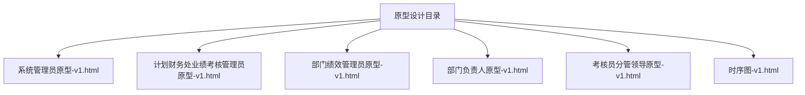
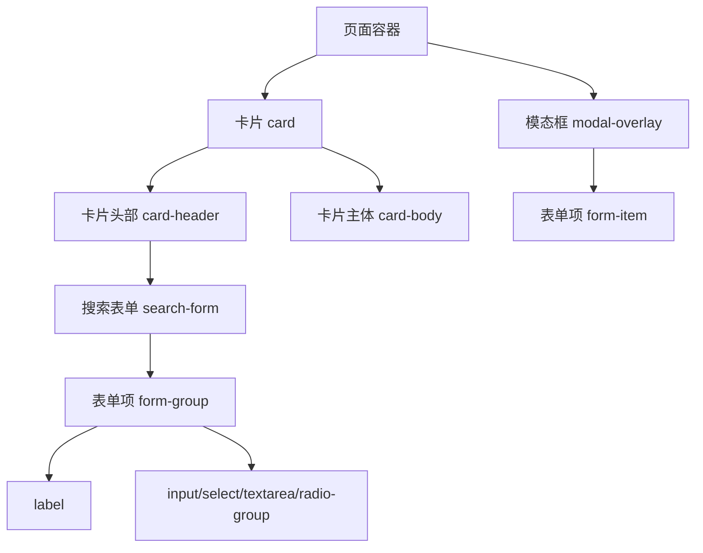
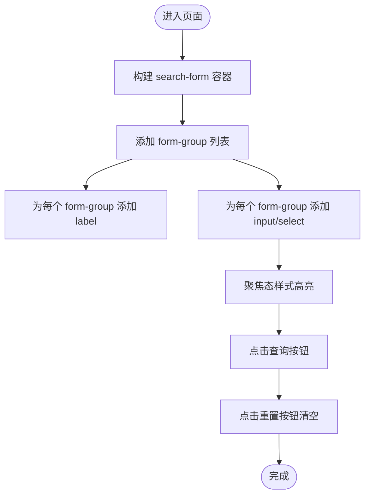
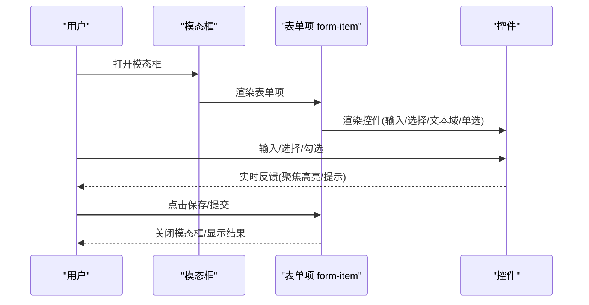
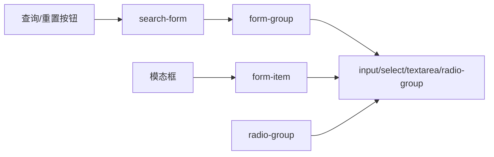

# 表单组件

<cite>
**本文档引用的文件**
- [系统管理员原型-v1.html](file://月度业绩考核原型设计初稿/1-系统管理员原型-v1.html)
- [计划财务处业绩考核管理员原型-v1.html](file://月度业绩考核原型设计初稿/2-计划财务处业绩考核管理员原型-v1.html)
- [部门绩效管理员原型-v1.html](file://月度业绩考核原型设计初稿/3-部门绩效管理员原型-v1.html)
- [部门负责人原型-v1.html](file://月度业绩考核原型设计初稿/4-部门负责人原型-v1.html)
- [考核员分管领导原型-v1.html](file://月度业绩考核原型设计初稿/5-考核员分管领导原型-v1.html)
- [时序图-v1.html](file://月度业绩考核原型设计初稿/6-时序图-v1.html)
</cite>

## 目录
1. [简介](#简介)
2. [项目结构](#项目结构)
3. [核心组件](#核心组件)
4. [架构概览](#架构概览)
5. [详细组件分析](#详细组件分析)
6. [依赖分析](#依赖分析)
7. [性能考虑](#性能考虑)
8. [故障排查指南](#故障排查指南)
9. [结论](#结论)
10. [附录](#附录)

## 简介
本文件系统性梳理原型设计中涉及的表单组件体系，涵盖搜索表单(search-form)、表单项(form-item)、输入框(input)、选择框(select)、文本域(textarea)、单选按钮(radio-group)等核心表单元素。文档基于仓库中的HTML原型文件，总结其样式、布局、交互与可访问性特征，并给出使用建议与最佳实践。

## 项目结构
- 本仓库包含多个角色原型页面，均在同一目录下，便于对比不同角色下的表单使用场景与一致性。
- 每个原型页面均内嵌了完整的HTML与CSS，其中表单组件样式与交互逻辑集中于页面内联样式与脚本中。

**图表来源**
- [系统管理员原型-v1.html:1-635](file://月度业绩考核原型设计初稿/1-系统管理员原型-v1.html#L1-L635)
- [计划财务处业绩考核管理员原型-v1.html:1-1039](file://月度业绩考核原型设计初稿/2-计划财务处业绩考核管理员原型-v1.html#L1-L1039)
- [部门绩效管理员原型-v1.html:1-1663](file://月度业绩考核原型设计初稿/3-部门绩效管理员原型-v1.html#L1-L1663)
- [部门负责人原型-v1.html:1-1231](file://月度业绩考核原型设计初稿/4-部门负责人原型-v1.html#L1-L1231)
- [考核员分管领导原型-v1.html:1-1459](file://月度业绩考核原型设计初稿/5-考核员分管领导原型-v1.html#L1-L1459)
- [时序图-v1.html:1-570](file://月度业绩考核原型设计初稿/6-时序图-v1.html#L1-L570)

**章节来源**
- [系统管理员原型-v1.html:1-635](file://月度业绩考核原型设计初稿/1-系统管理员原型-v1.html#L1-L635)
- [计划财务处业绩考核管理员原型-v1.html:1-1039](file://月度业绩考核原型设计初稿/2-计划财务处业绩考核管理员原型-v1.html#L1-L1039)
- [部门绩效管理员原型-v1.html:1-1663](file://月度业绩考核原型设计初稿/3-部门绩效管理员原型-v1.html#L1-L1663)
- [部门负责人原型-v1.html:1-1231](file://月度业绩考核原型设计初稿/4-部门负责人原型-v1.html#L1-L1231)
- [考核员分管领导原型-v1.html:1-1459](file://月度业绩考核原型设计初稿/5-考核员分管领导原型-v1.html#L1-L1459)
- [时序图-v1.html:1-570](file://月度业绩考核原型设计初稿/6-时序图-v1.html#L1-L570)

## 核心组件
- 搜索表单(search-form)
  - 作用：在卡片头部提供筛选条件，支持多字段组合查询。
  - 结构：容器类名.search-form，内部包含若干.form-group，每个.form-group包含label与控件。
  - 特性：flex布局，gap统一间距，wrap换行；表单项高度一致，聚焦态带阴影高亮。
- 表单项(form-item)
  - 作用：模态框或详情页中的标准表单项，包含label、输入控件与可选提示。
  - 结构：容器类名.form-item，内部包含label与控件；必要时使用.req标注必填。
  - 特性：label字体较小，控件宽度100%，聚焦态高亮。
- 输入框(input)
  - 类型：普通文本、日期(date)、数字(number)等。
  - 样式：高度统一，圆角边框，聚焦态强调色与阴影。
  - 必填：通过在label中插入.req红色星号标识。
- 选择框(select)
  - 样式：与input一致的高度与圆角，统一的边框与聚焦态。
  - 使用：常用于状态筛选、类型选择、角色分配等。
- 文本域(textarea)
  - 样式：高度适配多行输入，支持垂直方向resize。
  - 使用：用于长文本输入，如备注、说明、申诉理由等。
- 单选按钮(radio-group)
  - 结构：容器.radio-group，内部为若干label含input[type="radio"]。
  - 样式：label内含flex布局，input[type="radio"]使用accent-color强调色。
  - 使用：用于二选一或多选项的互斥选择，常见于“是否启用”等场景。

**章节来源**
- [系统管理员原型-v1.html:218-279](file://月度业绩考核原型设计初稿/1-系统管理员原型-v1.html#L218-L279)
- [计划财务处业绩考核管理员原型-v1.html:249-312](file://月度业绩考核原型设计初稿/2-计划财务处业绩考核管理员原型-v1.html#L249-L312)
- [部门绩效管理员原型-v1.html:248-313](file://月度业绩考核原型设计初稿/3-部门绩效管理员原型-v1.html#L248-L313)
- [部门负责人原型-v1.html:230-335](file://月度业绩考核原型设计初稿/4-部门负责人原型-v1.html#L230-L335)
- [考核员分管领导原型-v1.html:46-111](file://月度业绩考核原型设计初稿/5-考核员分管领导原型-v1.html#L46-L111)

## 架构概览
- 组件层次
  - 页面级：各角色页面作为容器，承载搜索表单与主内容。
  - 卡片级：卡片.card内包含.card-header与.card-body，搜索表单位于.card-header中。
  - 表单级：search-form包含多个form-group；模态框内使用form-item布局。
- 样式系统
  - 采用CSS变量驱动主题切换，不同角色页面共享同一套表单样式规范。
  - 表单控件在不同页面中保持一致的视觉与交互体验。
- 交互模式
  - 查询：点击“查询”按钮触发筛选；“重置”按钮清空条件。
  - 弹窗：点击“新增/编辑/查看”等按钮打开模态框，模态框内包含完整的form-item布局。
  - 打分：在评估打分页面中，使用radio-group与数字输入框配合完成评分。

**图表来源**
- [系统管理员原型-v1.html:330-358](file://月度业绩考核原型设计初稿/1-系统管理员原型-v1.html#L330-L358)
- [计划财务处业绩考核管理员原型-v1.html:353-446](file://月度业绩考核原型设计初稿/2-计划财务处业绩考核管理员原型-v1.html#L353-L446)
- [部门绩效管理员原型-v1.html:445-522](file://月度业绩考核原型设计初稿/3-部门绩效管理员原型-v1.html#L445-L522)
- [部门负责人原型-v1.html:378-537](file://月度业绩考核原型设计初稿/4-部门负责人原型-v1.html#L378-L537)
- [考核员分管领导原型-v1.html:240-342](file://月度业绩考核原型设计初稿/5-考核员分管领导原型-v1.html#L240-L342)

## 详细组件分析

### 搜索表单(search-form)
- 结构与布局
  - 使用flex布局，gap控制间距，flex-wrap允许换行，align-items:flex-end使控件底部对齐。
  - 每个筛选项封装为.form-group，包含label与控件，保证垂直方向对齐。
- 样式与交互
  - 控件高度统一，边框圆角，聚焦态使用var(--focus-shadow)或rgba阴影强调。
  - 按钮区与表单项区分离，查询与重置按钮位于右侧。
- 使用场景
  - 在系统管理、权限分配、指标管理、功能菜单定义等页面顶部提供筛选条件。
  - 支持单位名称、单位类型、是否启用、组织名称、组织编码、排序码、适用范围等字段。

**图表来源**
- [系统管理员原型-v1.html:337-343](file://月度业绩考核原型设计初稿/1-系统管理员原型-v1.html#L337-L343)
- [计划财务处业绩考核管理员原型-v1.html:361-367](file://月度业绩考核原型设计初稿/2-计划财务处业绩考核管理员原型-v1.html#L361-L367)
- [部门绩效管理员原型-v1.html:453-462](file://月度业绩考核原型设计初稿/3-部门绩效管理员原型-v1.html#L453-L462)
- [部门负责人原型-v1.html:389-429](file://月度业绩考核原型设计初稿/4-部门负责人原型-v1.html#L389-L429)

**章节来源**
- [系统管理员原型-v1.html:218-279](file://月度业绩考核原型设计初稿/1-系统管理员原型-v1.html#L218-L279)
- [计划财务处业绩考核管理员原型-v1.html:249-312](file://月度业绩考核原型设计初稿/2-计划财务处业绩考核管理员原型-v1.html#L249-L312)
- [部门绩效管理员原型-v1.html:248-313](file://月度业绩考核原型设计初稿/3-部门绩效管理员原型-v1.html#L248-L313)
- [部门负责人原型-v1.html:230-335](file://月度业绩考核原型设计初稿/4-部门负责人原型-v1.html#L230-L335)

### 表单项(form-item)
- 结构与布局
  - 容器.form-item，内部包含block级label与控件，label后可跟随.req表示必填。
  - 控件支持input、select、textarea与radio-group等。
- 样式与交互
  - 控件宽度100%，高度统一，聚焦态强调色与阴影。
  - 可选提示.hint用于辅助说明，如“输入正整数”、“不超过500字符”等。
- 使用场景
  - 新增/编辑模态框中，用于录入单位、组织、指标大类、权限分配等信息。
  - 支持必填字段与提示信息，提升用户输入准确性。

**图表来源**
- [系统管理员原型-v1.html:564-602](file://月度业绩考核原型设计初稿/1-系统管理员原型-v1.html#L564-L602)
- [计划财务处业绩考核管理员原型-v1.html:658-727](file://月度业绩考核原型设计初稿/2-计划财务处业绩考核管理员原型-v1.html#L658-L727)
- [部门绩效管理员原型-v1.html:766-800](file://月度业绩考核原型设计初稿/3-部门绩效管理员原型-v1.html#L766-L800)
- [部门负责人原型-v1.html:664-800](file://月度业绩考核原型设计初稿/4-部门负责人原型-v1.html#L664-L800)
- [考核员分管领导原型-v1.html:345-513](file://月度业绩考核原型设计初稿/5-考核员分管领导原型-v1.html#L345-L513)

**章节来源**
- [系统管理员原型-v1.html:289-313](file://月度业绩考核原型设计初稿/1-系统管理员原型-v1.html#L289-L313)
- [计划财务处业绩考核管理员原型-v1.html:282-311](file://月度业绩考核原型设计初稿/2-计划财务处业绩考核管理员原型-v1.html#L282-L311)
- [部门绩效管理员原型-v1.html:299-313](file://月度业绩考核原型设计初稿/3-部门绩效管理员原型-v1.html#L299-L313)
- [部门负责人原型-v1.html:271-335](file://月度业绩考核原型设计初稿/4-部门负责人原型-v1.html#L271-L335)
- [考核员分管领导原型-v1.html:99-111](file://月度业绩考核原型设计初稿/5-考核员分管领导原型-v1.html#L99-L111)

### 输入框(input)
- 类型与用途
  - 普通文本：用于名称、编码、排序码等输入。
  - 日期：用于生效/失效日期等时间选择。
  - 数字：用于权重、排序码等数值输入。
- 样式与交互
  - 统一高度与圆角，聚焦态强调色与阴影，确保一致的视觉反馈。
  - 必填字段通过label中的.req标记提示。
- 使用示例
  - 单位名称、单位编码、组织名称、组织编码、排序编码、权重等。

**章节来源**
- [系统管理员原型-v1.html:568-569](file://月度业绩考核原型设计初稿/1-系统管理员原型-v1.html#L568-L569)
- [计划财务处业绩考核管理员原型-v1.html:663-666](file://月度业绩考核原型设计初稿/2-计划财务处业绩考核管理员原型-v1.html#L663-L666)
- [部门绩效管理员原型-v1.html:789-800](file://月度业绩考核原型设计初稿/3-部门绩效管理员原型-v1.html#L789-L800)
- [部门负责人原型-v1.html:666-667](file://月度业绩考核原型设计初稿/4-部门负责人原型-v1.html#L666-L667)

### 选择框(select)
- 用途
  - 单位类型、是否启用、适用范围、组织类别、角色分配、数据范围等。
- 样式与交互
  - 与input一致的高度与圆角，统一的边框与聚焦态。
  - 建议提供“请选择/全部”等占位选项，提升可读性。
- 使用示例
  - 单位管理、组织管理、权限分配、指标大类等页面中的筛选与选择。

**章节来源**
- [系统管理员原型-v1.html:339-340](file://月度业绩考核原型设计初稿/1-系统管理员原型-v1.html#L339-L340)
- [计划财务处业绩考核管理员原型-v1.html:360-361](file://月度业绩考核原型设计初稿/2-计划财务处业绩考核管理员原型-v1.html#L360-L361)
- [部门绩效管理员原型-v1.html:456-457](file://月度业绩考核原型设计初稿/3-部门绩效管理员原型-v1.html#L456-L457)
- [部门负责人原型-v1.html:396-400](file://月度业绩考核原型设计初稿/4-部门负责人原型-v1.html#L396-L400)

### 文本域(textarea)
- 用途
  - 备注信息、评价标准、申诉说明、打分说明等长文本输入。
- 样式与交互
  - 高度适配多行输入，支持垂直方向resize，聚焦态强调色与阴影。
  - 建议限制字符长度并在label后提供提示，如“不超过500字符”。
- 使用示例
  - 指标大类的“评价标准”，模态框中的“申诉说明”。

**章节来源**
- [系统管理员原型-v1.html:596-597](file://月度业绩考核原型设计初稿/1-系统管理员原型-v1.html#L596-L597)
- [计划财务处业绩考核管理员原型-v1.html:695-696](file://月度业绩考核管理员原型-v1.html#L695-L696)
- [部门绩效管理员原型-v1.html:789-800](file://月度业绩考核原型设计初稿/3-部门绩效管理员原型-v1.html#L789-L800)

### 单选按钮(radio-group)
- 用途
  - “是否启用”等二选一场景，支持互斥选择。
- 样式与交互
  - 容器.radio-group内含多个label，input[type="radio"]使用accent-color强调色。
  - 建议提供明确的选项文案与默认选中项。
- 使用示例
  - 指标大类的“是否启用”。

**章节来源**
- [系统管理员原型-v1.html:598-598](file://月度业绩考核原型设计初稿/1-系统管理员原型-v1.html#L598-L598)
- [计划财务处业绩考核管理员原型-v1.html:795-798](file://月度业绩考核管理员原型-v1.html#L795-L798)
- [部门负责人原型-v1.html:795-798](file://月度业绩考核原型设计初稿/4-部门负责人原型-v1.html#L795-L798)

## 依赖分析
- 组件耦合
  - search-form与form-item均为页面级通用组件，跨页面复用，耦合度低。
  - radio-group在多个页面中出现，但样式与行为一致，便于维护。
- 样式依赖
  - 所有表单控件共享统一的CSS变量与主题系统，减少重复样式定义。
  - 模态框内的form-item与页面内search-form在样式上保持一致，确保视觉统一。
- 交互依赖
  - 查询与重置按钮与search-form绑定，点击后触发筛选逻辑。
  - 模态框的打开/关闭通过JavaScript控制，与form-item形成松耦合。

**图表来源**
- [系统管理员原型-v1.html:337-343](file://月度业绩考核原型设计初稿/1-系统管理员原型-v1.html#L337-L343)
- [计划财务处业绩考核管理员原型-v1.html:361-367](file://月度业绩考核原型设计初稿/2-计划财务处业绩考核管理员原型-v1.html#L361-L367)
- [部门绩效管理员原型-v1.html:453-462](file://月度业绩考核原型设计初稿/3-部门绩效管理员原型-v1.html#L453-L462)
- [部门负责人原型-v1.html:389-429](file://月度业绩考核原型设计初稿/4-部门负责人原型-v1.html#L389-L429)
- [考核员分管领导原型-v1.html:345-513](file://月度业绩考核原型设计初稿/5-考核员分管领导原型-v1.html#L345-L513)

**章节来源**
- [系统管理员原型-v1.html:218-279](file://月度业绩考核原型设计初稿/1-系统管理员原型-v1.html#L218-L279)
- [计划财务处业绩考核管理员原型-v1.html:249-312](file://月度业绩考核原型设计初稿/2-计划财务处业绩考核管理员原型-v1.html#L249-L312)
- [部门绩效管理员原型-v1.html:248-313](file://月度业绩考核原型设计初稿/3-部门绩效管理员原型-v1.html#L248-L313)
- [部门负责人原型-v1.html:230-335](file://月度业绩考核原型设计初稿/4-部门负责人原型-v1.html#L230-L335)
- [考核员分管领导原型-v1.html:99-111](file://月度业绩考核原型设计初稿/5-考核员分管领导原型-v1.html#L99-L111)

## 性能考虑
- 样式层面
  - 使用CSS变量统一主题，减少重复样式定义，降低CSS体积与解析成本。
  - 控件聚焦态使用box-shadow，避免复杂动画，保证渲染流畅。
- 交互层面
  - 搜索表单采用flex布局，支持flex-wrap换行，减少复杂定位计算。
  - 模态框通过类名切换显示/隐藏，避免频繁DOM操作。
- 建议
  - 对高频查询的页面，可在前端做轻量缓存或防抖处理，减少不必要的请求。
  - 对长列表页面，结合分页与虚拟滚动，优化渲染性能。

[本节为通用指导，无需特定文件引用]

## 故障排查指南
- 常见问题
  - 控件聚焦态无高亮：检查CSS变量与box-shadow定义是否正确应用。
  - 表单项宽度异常：确认form-item与控件的width:100%是否被覆盖。
  - 必填项未提示：检查label中是否包含.req标记。
  - 模态框无法关闭：检查JavaScript中openModal/closeModal的调用与事件绑定。
- 排查步骤
  - 打开浏览器开发者工具，定位控件对应的类名，检查computed样式。
  - 在控制台执行openModal/closeModal，观察模态框状态变化。
  - 检查页面中是否有重复或冲突的CSS类名。

**章节来源**
- [系统管理员原型-v1.html:612-632](file://月度业绩考核原型设计初稿/1-系统管理员原型-v1.html#L612-L632)
- [计划财务处业绩考核管理员原型-v1.html:612-632](file://月度业绩考核原型设计初稿/2-计划财务处业绩考核管理员原型-v1.html#L612-L632)
- [部门绩效管理员原型-v1.html:612-632](file://月度业绩考核原型设计初稿/3-部门绩效管理员原型-v1.html#L612-L632)
- [部门负责人原型-v1.html:612-632](file://月度业绩考核原型设计初稿/4-部门负责人原型-v1.html#L612-L632)
- [考核员分管领导原型-v1.html:560-567](file://月度业绩考核原型设计初稿/5-考核员分管领导原型-v1.html#L560-L567)

## 结论
本表单组件体系在多个角色原型中得到统一应用，具备良好的一致性与可维护性。通过CSS变量驱动的主题系统与统一的控件样式，确保了跨页面的视觉与交互体验。建议在后续开发中继续沿用现有规范，完善可访问性与键盘导航支持，并在高频场景中引入性能优化策略。

[本节为总结性内容，无需特定文件引用]

## 附录
- 无障碍访问与键盘导航建议
  - 为所有表单控件提供清晰的label关联，确保屏幕阅读器可正确读取。
  - 支持Tab键顺序导航，确保焦点可见且可预期。
  - 为必填字段提供明确的错误提示与跳转逻辑，避免用户重复输入。
  - 为模态框提供Esc键关闭能力，并在打开时自动聚焦到首个可交互元素。
- 响应式与布局
  - search-form使用flex-wrap换行，适配移动端窄屏。
  - form-item在模态框中采用100%宽度，保证在小屏设备上的可读性。
- 批量提交与数据序列化
  - 建议在表单容器上添加data-form-id，序列化时按容器收集字段值。
  - 对必填字段进行前端校验，校验失败阻止提交并高亮错误项。
  - 对数值型字段进行范围校验，防止无效输入。

[本节为通用指导，无需特定文件引用]