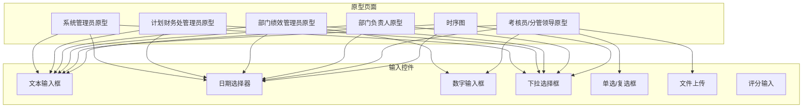
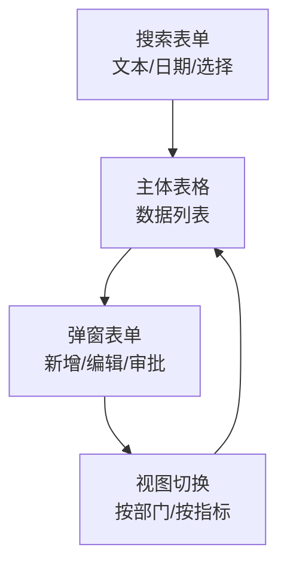
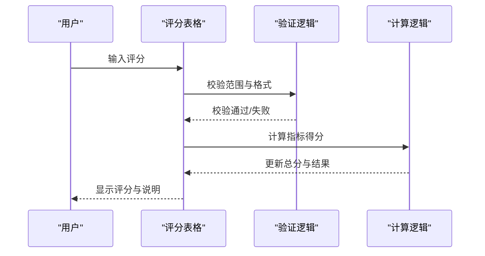
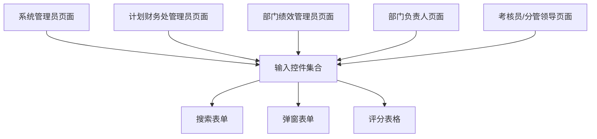

# 输入控件

<cite>
**本文档引用的文件**
- [1-系统管理员原型-v1.html](file://月度业绩考核原型设计初稿/1-系统管理员原型-v1.html)
- [2-计划财务处业绩考核管理员原型-v1.html](file://月度业绩考核原型设计初稿/2-计划财务处业绩考核管理员原型-v1.html)
- [3-部门绩效管理员原型-v1.html](file://月度业绩考核原型设计初稿/3-部门绩效管理员原型-v1.html)
- [4-部门负责人原型-v1.html](file://月度业绩考核原型设计初稿/4-部门负责人原型-v1.html)
- [5-考核员分管领导原型-v1.html](file://月度业绩考核原型设计初稿/5-考核员分管领导原型-v1.html)
- [6-时序图-v1.html](file://月度业绩考核原型设计初稿/6-时序图-v1.html)
</cite>

## 目录
1. [简介](#简介)
2. [项目结构](#项目结构)
3. [核心组件](#核心组件)
4. [架构概览](#架构概览)
5. [详细组件分析](#详细组件分析)
6. [依赖分析](#依赖分析)
7. [性能考虑](#性能考虑)
8. [故障排除指南](#故障排除指南)
9. [结论](#结论)

## 简介
本文件系统性梳理了项目中各类输入控件的设计与实现，涵盖文本输入框、日期选择器、数字输入框、下拉选择框、单选/复选框、文件上传以及评分输入等。文档从架构、样式、交互、验证、无障碍等多个维度进行说明，并结合原型页面中的真实使用场景，提供可操作的实践建议。

## 项目结构
项目采用多角色原型页面设计，围绕“月度业绩考核管理”主题展开，不同角色页面中广泛使用了统一的输入控件体系：
- 系统管理员原型：单位管理、权限分配、功能菜单定义等场景下的搜索与表单输入
- 计划财务处管理员原型：考核组管理、审批、申诉处理等场景
- 部门绩效管理员原型：指标设定、自评、他评打分等场景
- 部门负责人原型：指标审批、结果查看等场景
- 考核员/分管领导原型：评估打分、进度查询、申诉处理等场景
- 时序图：流程可视化，体现输入控件在业务流程中的位置

**图表来源**
- [1-系统管理员原型-v1.html:330-635](file://月度业绩考核原型设计初稿/1-系统管理员原型-v1.html#L330-L635)
- [2-计划财务处业绩考核管理员原型-v1.html:350-760](file://月度业绩考核原型设计初稿/2-计划财务处业绩考核管理员原型-v1.html#L350-L760)
- [3-部门绩效管理员原型-v1.html:440-800](file://月度业绩考核原型设计初稿/3-部门绩效管理员原型-v1.html#L440-L800)
- [4-部门负责人原型-v1.html:370-660](file://月度业绩考核原型设计初稿/4-部门负责人原型-v1.html#L370-L660)
- [5-考核员分管领导原型-v1.html:240-510](file://月度业绩考核原型设计初稿/5-考核员分管领导原型-v1.html#L240-L510)
- [6-时序图-v1.html:110-298](file://月度业绩考核原型设计初稿/6-时序图-v1.html#L110-L298)

**章节来源**
- [1-系统管理员原型-v1.html:1-635](file://月度业绩考核原型设计初稿/1-系统管理员原型-v1.html#L1-L635)
- [2-计划财务处业绩考核管理员原型-v1.html:1-1039](file://月度业绩考核原型设计初稿/2-计划财务处业绩考核管理员原型-v1.html#L1-L1039)
- [3-部门绩效管理员原型-v1.html:1-1663](file://月度业绩考核原型设计初稿/3-部门绩效管理员原型-v1.html#L1-L1663)
- [4-部门负责人原型-v1.html:1-1231](file://月度业绩考核原型设计初稿/4-部门负责人原型-v1.html#L1-L1231)
- [5-考核员分管领导原型-v1.html:1-1459](file://月度业绩考核原型设计初稿/5-考核员分管领导原型-v1.html#L1-L1459)
- [6-时序图-v1.html:1-570](file://月度业绩考核原型设计初稿/6-时序图-v1.html#L1-L570)

## 核心组件
本项目中输入控件主要分为以下几类：
- 文本输入框：用于名称、编码、描述、备注等文本信息输入
- 日期选择器：用于起止日期、生效/失效日期等时间选择
- 数字输入框：用于权重、分数、排序编码等数值输入
- 下拉选择框：用于单位类型、组织类别、状态筛选等选项选择
- 单选/复选框：用于启用/禁用、性别、角色选择等布尔或多选项
- 文件上传：用于申诉材料、附件上传
- 评分输入：用于他评/复核打分、管理员修正打分

这些控件在不同页面中以统一的样式与交互方式进行呈现，确保跨页面的一致性与可用性。

**章节来源**
- [1-系统管理员原型-v1.html:330-635](file://月度业绩考核原型设计初稿/1-系统管理员原型-v1.html#L330-L635)
- [2-计划财务处业绩考核管理员原型-v1.html:350-760](file://月度业绩考核原型设计初稿/2-计划财务处业绩考核管理员原型-v1.html#L350-L760)
- [3-部门绩效管理员原型-v1.html:440-800](file://月度业绩考核原型设计初稿/3-部门绩效管理员原型-v1.html#L440-L800)
- [4-部门负责人原型-v1.html:370-660](file://月度业绩考核原型设计初稿/4-部门负责人原型-v1.html#L370-L660)
- [5-考核员分管领导原型-v1.html:240-510](file://月度业绩考核原型设计初稿/5-考核员分管领导原型-v1.html#L240-L510)

## 架构概览
输入控件在页面中的分布遵循“搜索表单 + 主体表格 + 弹窗表单”的布局模式：
- 搜索表单：集中放置文本输入框、日期选择器、下拉选择框，用于条件筛选
- 主体表格：承载数据列表，部分单元格内嵌输入控件（如评分输入）
- 弹窗表单：用于新增/编辑/审批/查看等复杂操作，包含多种输入控件组合

**图表来源**
- [1-系统管理员原型-v1.html:330-635](file://月度业绩考核原型设计初稿/1-系统管理员原型-v1.html#L330-L635)
- [2-计划财务处业绩考核管理员原型-v1.html:350-760](file://月度业绩考核原型设计初稿/2-计划财务处业绩考核管理员原型-v1.html#L350-L760)
- [3-部门绩效管理员原型-v1.html:440-800](file://月度业绩考核原型设计初稿/3-部门绩效管理员原型-v1.html#L440-L800)
- [4-部门负责人原型-v1.html:370-660](file://月度业绩考核原型设计初稿/4-部门负责人原型-v1.html#L370-L660)
- [5-考核员分管领导原型-v1.html:240-510](file://月度业绩考核原型设计初稿/5-考核员分管领导原型-v1.html#L240-L510)

## 详细组件分析

### 文本输入框（input）
- 使用场景
  - 搜索条件：单位名称、人员姓名、组织名称、大类名称、菜单名称等
  - 表单填写：单位编码、组织编码、排序编码、备注信息、评分说明等
  - 弹窗编辑：菜单路径、评分输入、申诉说明等
- 属性与占位符
  - 常见属性：placeholder、value、type（text/date/number）、required（通过样式标记）
  - 占位符策略：使用语义化提示文案，如“请输入单位名称”、“请输入备注”
- 样式与交互
  - 统一样式：高度、边框、圆角、内边距、字体大小
  - 焦点状态：聚焦时改变边框色与阴影，提升可发现性
  - 错误高亮：通过容器或标签样式变化提示必填项缺失
- 实时验证与数据清理
  - 建议在前端进行基础校验（长度、格式），并在提交前统一清理空白字符
  - 对于编码类字段，建议统一转为大写或去除多余空格
- 可访问性
  - 为每个输入框提供关联的label，确保屏幕阅读器正确读取
  - 必填项使用样式标记并在label中明确标识
- 性能优化
  - 对高频输入（如搜索）建议使用防抖，减少无效请求
  - 对长列表输入建议使用虚拟滚动或分页加载

**章节来源**
- [1-系统管理员原型-v1.html:330-635](file://月度业绩考核原型设计初稿/1-系统管理员原型-v1.html#L330-L635)
- [2-计划财务处业绩考核管理员原型-v1.html:350-760](file://月度业绩考核原型设计初稿/2-计划财务处业绩考核管理员原型-v1.html#L350-L760)
- [3-部门绩效管理员原型-v1.html:440-800](file://月度业绩考核原型设计初稿/3-部门绩效管理员原型-v1.html#L440-L800)
- [4-部门负责人原型-v1.html:370-660](file://月度业绩考核原型设计初稿/4-部门负责人原型-v1.html#L370-L660)
- [5-考核员分管领导原型-v1.html:240-510](file://月度业绩考核原型设计初稿/5-考核员分管领导原型-v1.html#L240-L510)

### 日期选择器（input[type=date]）
- 使用场景
  - 起止日期：考核开始/结束时间、生效/失效日期
  - 时间筛选：按日期范围查询
- 属性与占位符
  - 类型：date；常用属性：value、min/max（限定范围）
  - 占位符：建议使用“YYYY-MM-DD”或本地化格式提示
- 样式与交互
  - 统一样式：与文本输入框一致的高度与边框
  - 焦点状态：聚焦时边框色与阴影变化
- 实时验证与数据清理
  - 建议校验日期逻辑（如开始日期不能晚于结束日期）
  - 对输入值进行格式标准化（如补零、统一分隔符）
- 可访问性
  - 为日期输入提供清晰的aria-label或label
  - 支持键盘导航与屏幕阅读器朗读
- 性能优化
  - 日期范围联动时使用节流/防抖，避免频繁渲染

**章节来源**
- [1-系统管理员原型-v1.html:330-635](file://月度业绩考核原型设计初稿/1-系统管理员原型-v1.html#L330-L635)
- [2-计划财务处业绩考核管理员原型-v1.html:350-760](file://月度业绩考核原型设计初稿/2-计划财务处业绩考核管理员原型-v1.html#L350-L760)
- [3-部门绩效管理员原型-v1.html:440-800](file://月度业绩考核原型设计初稿/3-部门绩效管理员原型-v1.html#L440-L800)
- [4-部门负责人原型-v1.html:370-660](file://月度业绩考核原型设计初稿/4-部门负责人原型-v1.html#L370-L660)
- [5-考核员分管领导原型-v1.html:240-510](file://月度业绩考核原型设计初稿/5-考核员分管领导原型-v1.html#L240-L510)

### 数字输入框（input[type=number]）
- 使用场景
  - 权重：指标权重百分比
  - 排序编码：排序码
  - 评分：部门打分、管理员打分、评分说明
- 属性与占位符
  - 类型：number；常用属性：min/max、step、value
  - 占位符：建议提示数值范围与单位（如“输入正整数”）
- 样式与交互
  - 统一样式：宽度适配（如70px用于评分输入）
  - 焦点状态：聚焦时边框色与阴影变化
- 实时验证与数据清理
  - 建议限制输入范围（如0-100或0-120），超出范围时给出提示
  - 对空值与非法字符进行拦截或清空
- 可访问性
  - 为数值输入提供aria-valuemin/aria-valuemax/aria-valuenow
  - 屏幕阅读器应正确读取数值与单位
- 性能优化
  - 评分输入建议使用防抖，避免频繁计算

**章节来源**
- [3-部门绩效管理员原型-v1.html:440-800](file://月度业绩考核原型设计初稿/3-部门绩效管理员原型-v1.html#L440-L800)
- [5-考核员分管领导原型-v1.html:240-510](file://月度业绩考核原型设计初稿/5-考核员分管领导原型-v1.html#L240-L510)

### 下拉选择框（select）
- 使用场景
  - 筛选：单位类型、组织类别、适用范围、状态等
  - 表单：角色分配、数据范围、启用/禁用等
- 属性与占位符
  - 常见属性：multiple（多选）、size（显示行数）
  - 占位符：建议使用“请选择”作为默认提示
- 样式与交互
  - 统一样式：高度、边框、圆角、内边距
  - 焦点状态：聚焦时边框色与阴影变化
- 实时验证与数据清理
  - 建议对必选项进行非空校验
  - 多选场景建议限制最大选择数量
- 可访问性
  - 为每个option提供清晰的label
  - 支持键盘导航与屏幕阅读器朗读
- 性能优化
  - 大列表建议使用虚拟滚动或懒加载

**章节来源**
- [1-系统管理员原型-v1.html:330-635](file://月度业绩考核原型设计初稿/1-系统管理员原型-v1.html#L330-L635)
- [2-计划财务处业绩考核管理员原型-v1.html:350-760](file://月度业绩考核原型设计初稿/2-计划财务处业绩考核管理员原型-v1.html#L350-L760)
- [3-部门绩效管理员原型-v1.html:440-800](file://月度业绩考核原型设计初稿/3-部门绩效管理员原型-v1.html#L440-L800)
- [4-部门负责人原型-v1.html:370-660](file://月度业绩考核原型设计初稿/4-部门负责人原型-v1.html#L370-L660)
- [5-考核员分管领导原型-v1.html:240-510](file://月度业绩考核原型设计初稿/5-考核员分管领导原型-v1.html#L240-L510)

### 单选/复选框（radio/checkbox）
- 使用场景
  - 启用/禁用：是否启用、是否公开等
  - 角色选择：分配角色、数据范围等
- 属性与占位符
  - 常见属性：name（单选组）、checked、disabled
  - 占位符：通过label文字表达选项含义
- 样式与交互
  - 统一样式：尺寸、间距、颜色
  - 焦点状态：聚焦时提供可见指示
- 实时验证与数据清理
  - 单选场景必须至少选择一项
  - 复选场景建议限制最大选择数量
- 可访问性
  - 为每个radio/checkbox提供关联label
  - 支持键盘切换与屏幕阅读器朗读
- 性能优化
  - 大量选项建议使用分组与懒加载

**章节来源**
- [1-系统管理员原型-v1.html:330-635](file://月度业绩考核原型设计初稿/1-系统管理员原型-v1.html#L330-L635)
- [2-计划财务处业绩考核管理员原型-v1.html:350-760](file://月度业绩考核原型设计初稿/2-计划财务处业绩考核管理员原型-v1.html#L350-L760)
- [3-部门绩效管理员原型-v1.html:440-800](file://月度业绩考核原型设计初稿/3-部门绩效管理员原型-v1.html#L440-L800)
- [4-部门负责人原型-v1.html:370-660](file://月度业绩考核原型设计初稿/4-部门负责人原型-v1.html#L370-L660)
- [5-考核员分管领导原型-v1.html:240-510](file://月度业绩考核原型设计初稿/5-考核员分管领导原型-v1.html#L240-L510)

### 文件上传（input[type=file]）
- 使用场景
  - 申诉材料：PDF、图片、压缩包等
  - 附件上传：佐证材料、模板下载等
- 属性与占位符
  - 常见属性：accept（文件类型）、multiple（多文件）、max-size（建议在前端限制）
  - 占位符：建议提示支持的文件类型与大小上限
- 样式与交互
  - 统一样式：按钮样式与输入框样式协调
  - 焦点状态：聚焦时边框色与阴影变化
- 实时验证与数据清理
  - 建议限制文件类型与大小，超限时给出明确提示
  - 对重复文件与空文件进行过滤
- 可访问性
  - 为文件上传提供清晰的aria-label或label
  - 支持键盘触发与屏幕阅读器朗读
- 性能优化
  - 大文件建议分片上传或异步处理

**章节来源**
- [2-计划财务处业绩考核管理员原型-v1.html:350-760](file://月度业绩考核原型设计初稿/2-计划财务处业绩考核管理员原型-v1.html#L350-L760)
- [3-部门绩效管理员原型-v1.html:440-800](file://月度业绩考核原型设计初稿/3-部门绩效管理员原型-v1.html#L440-L800)
- [5-考核员分管领导原型-v1.html:240-510](file://月度业绩考核原型设计初稿/5-考核员分管领导原型-v1.html#L240-L510)

### 评分输入（表格内数字输入）
- 使用场景
  - 他评打分：对其他部门指标逐行打分（0-120分）
  - 管理员修正：对部门打分进行修正
  - 打分说明：对评分进行解释与记录
- 属性与占位符
  - 类型：number；常用属性：min/max、step、value
  - 占位符：建议提示评分范围与单位
- 样式与交互
  - 统一样式：宽度适配（如70px用于评分输入）
  - 焦点状态：聚焦时边框色与阴影变化
- 实时验证与数据清理
  - 建议限制评分范围（如0-120），超出范围时给出提示
  - 对空值与非法字符进行拦截或清空
- 可访问性
  - 为评分输入提供aria-label，包含指标名称与权重
  - 屏幕阅读器应正确读取评分与说明
- 性能优化
  - 评分输入建议使用防抖，避免频繁计算

**图表来源**
- [5-考核员分管领导原型-v1.html:240-510](file://月度业绩考核原型设计初稿/5-考核员分管领导原型-v1.html#L240-L510)

**章节来源**
- [5-考核员分管领导原型-v1.html:240-510](file://月度业绩考核原型设计初稿/5-考核员分管领导原型-v1.html#L240-L510)

## 依赖分析
输入控件在页面中的依赖关系如下：
- 页面依赖：各角色页面独立维护，但共享统一的输入控件样式与交互
- 组件依赖：搜索表单依赖输入控件，弹窗表单依赖输入控件，评分表格依赖数字输入控件
- 流程依赖：输入控件贯穿业务流程，从指标设定到评分发布

**图表来源**
- [1-系统管理员原型-v1.html:330-635](file://月度业绩考核原型设计初稿/1-系统管理员原型-v1.html#L330-L635)
- [2-计划财务处业绩考核管理员原型-v1.html:350-760](file://月度业绩考核原型设计初稿/2-计划财务处业绩考核管理员原型-v1.html#L350-L760)
- [3-部门绩效管理员原型-v1.html:440-800](file://月度业绩考核原型设计初稿/3-部门绩效管理员原型-v1.html#L440-L800)
- [4-部门负责人原型-v1.html:370-660](file://月度业绩考核原型设计初稿/4-部门负责人原型-v1.html#L370-L660)
- [5-考核员分管领导原型-v1.html:240-510](file://月度业绩考核原型设计初稿/5-考核员分管领导原型-v1.html#L240-L510)

**章节来源**
- [1-系统管理员原型-v1.html:330-635](file://月度业绩考核原型设计初稿/1-系统管理员原型-v1.html#L330-L635)
- [2-计划财务处业绩考核管理员原型-v1.html:350-760](file://月度业绩考核原型设计初稿/2-计划财务处业绩考核管理员原型-v1.html#L350-L760)
- [3-部门绩效管理员原型-v1.html:440-800](file://月度业绩考核原型设计初稿/3-部门绩效管理员原型-v1.html#L440-L800)
- [4-部门负责人原型-v1.html:370-660](file://月度业绩考核原型设计初稿/4-部门负责人原型-v1.html#L370-L660)
- [5-考核员分管领导原型-v1.html:240-510](file://月度业绩考核原型设计初稿/5-考核员分管领导原型-v1.html#L240-L510)

## 性能考虑
- 防抖与节流
  - 搜索输入建议使用防抖（如300ms），减少无效请求
  - 评分输入建议使用防抖（如200ms），避免频繁计算
- 虚拟滚动
  - 大列表（如部门列表、指标列表）建议使用虚拟滚动，提升渲染性能
- 懒加载
  - 下拉选择框的大列表建议懒加载，按需加载选项
- 样式与脚本
  - 统一样式减少重复计算，避免频繁重排重绘
  - 将事件绑定集中在容器上，减少DOM监听数量

## 故障排除指南
- 输入无响应
  - 检查是否被禁用（disabled）或只读（readonly）
  - 检查事件绑定是否正确
- 校验不生效
  - 检查必填项样式标记与校验逻辑
  - 检查占位符与默认值是否冲突
- 日期异常
  - 检查最小/最大值设置与格式化
  - 检查浏览器兼容性与本地化设置
- 评分异常
  - 检查评分范围与权重计算
  - 检查空值与非法字符处理
- 文件上传失败
  - 检查文件类型与大小限制
  - 检查网络与服务器配置

**章节来源**
- [1-系统管理员原型-v1.html:330-635](file://月度业绩考核原型设计初稿/1-系统管理员原型-v1.html#L330-L635)
- [2-计划财务处业绩考核管理员原型-v1.html:350-760](file://月度业绩考核原型设计初稿/2-计划财务处业绩考核管理员原型-v1.html#L350-L760)
- [3-部门绩效管理员原型-v1.html:440-800](file://月度业绩考核原型设计初稿/3-部门绩效管理员原型-v1.html#L440-L800)
- [4-部门负责人原型-v1.html:370-660](file://月度业绩考核原型设计初稿/4-部门负责人原型-v1.html#L370-L660)
- [5-考核员分管领导原型-v1.html:240-510](file://月度业绩考核原型设计初稿/5-考核员分管领导原型-v1.html#L240-L510)

## 结论
本项目在输入控件方面实现了统一的样式与交互规范，覆盖了文本、日期、数字、选择、文件上传、评分等多种类型，并在不同角色页面中得到广泛应用。通过合理的属性配置、占位符设置、实时验证与数据清理、样式定制与焦点状态、错误高亮效果、无障碍访问支持以及性能优化策略，输入控件能够满足复杂的业务场景需求。建议在后续迭代中进一步完善自动化测试与可访问性审计，持续提升用户体验与系统稳定性。