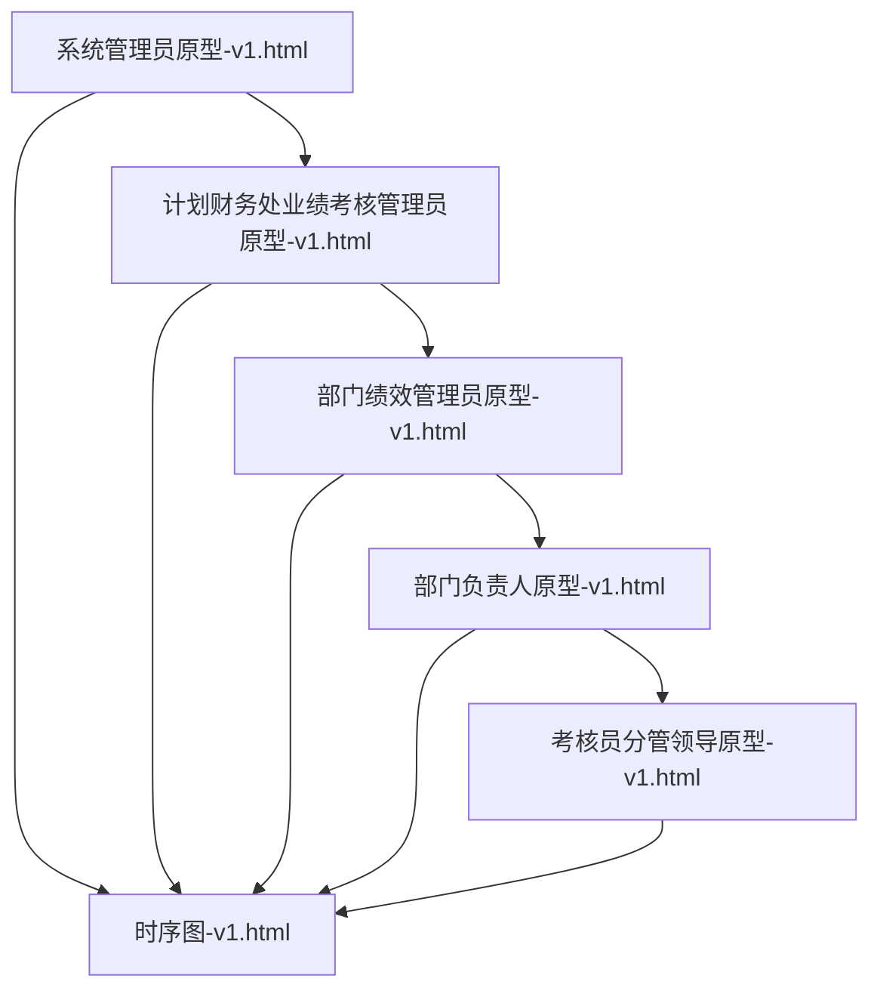
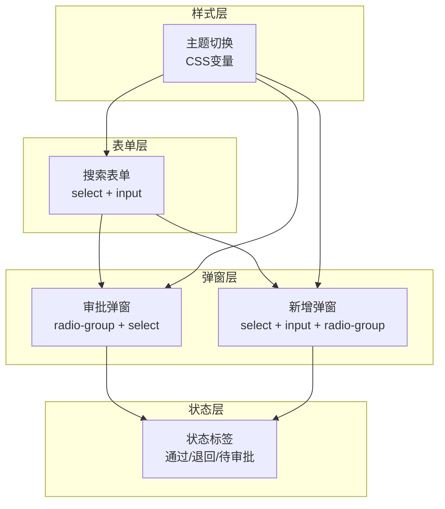
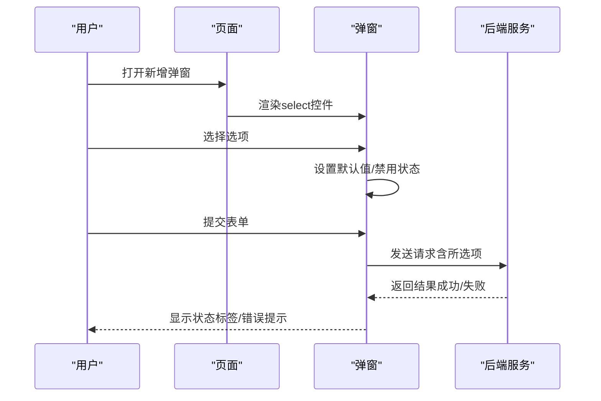
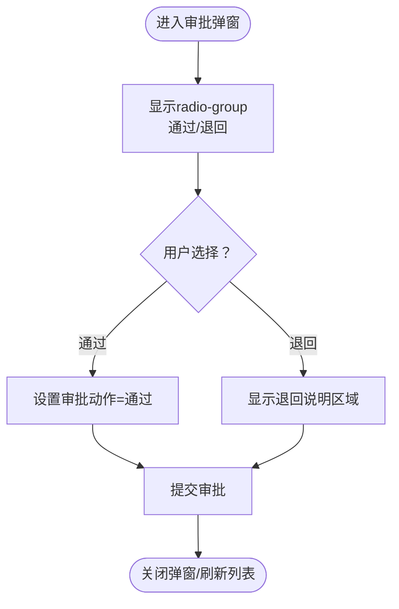
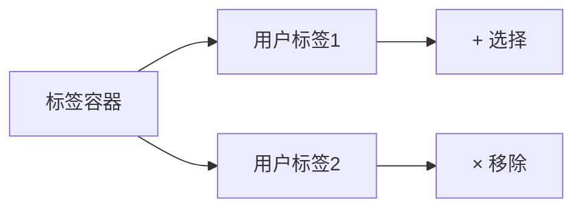
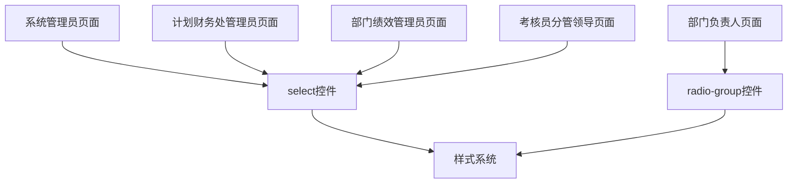

# 选择控件

<cite>
**本文档引用的文件**
- [系统管理员原型-v1.html](file://月度业绩考核原型设计初稿/1-系统管理员原型-v1.html)
- [计划财务处业绩考核管理员原型-v1.html](file://月度业绩考核原型设计初稿/2-计划财务处业绩考核管理员原型-v1.html)
- [部门绩效管理员原型-v1.html](file://月度业绩考核原型设计初稿/3-部门绩效管理员原型-v1.html)
- [部门负责人原型-v1.html](file://月度业绩考核原型设计初稿/4-部门负责人原型-v1.html)
- [考核员分管领导原型-v1.html](file://月度业绩考核原型设计初稿/5-考核员分管领导原型-v1.html)
- [时序图-v1.html](file://月度业绩考核原型设计初稿/6-时序图-v1.html)
</cite>

## 目录
1. [简介](#简介)
2. [项目结构](#项目结构)
3. [核心组件](#核心组件)
4. [架构概览](#架构概览)
5. [详细组件分析](#详细组件分析)
6. [依赖分析](#依赖分析)
7. [性能考虑](#性能考虑)
8. [故障排除指南](#故障排除指南)
9. [结论](#结论)

## 简介
本文件系统性梳理了月度业绩考核原型系统中的选择控件，涵盖下拉选择框（select）、单选按钮组（radio-group）以及复选框等交互组件。通过对原型页面的深入分析，总结了这些控件在不同角色场景下的使用方式、数据绑定策略、选项配置、默认值设置、样式定制、禁用状态、动态选项加载、搜索过滤、远程数据获取、多选模式、标签显示、选择限制、验证规则、必选检查、错误提示以及无障碍访问支持与键盘导航实践。

## 项目结构
该项目采用多页面原型结构，围绕“月度业绩考核管理”主题，为不同角色提供独立的界面原型，每个页面均内嵌了丰富的选择控件，用于表单筛选、状态选择、审批决策等关键业务流程。

图表来源
- [系统管理员原型-v1.html](file://月度业绩考核原型设计初稿/1-系统管理员原型-v1.html#L1)
- [计划财务处业绩考核管理员原型-v1.html](file://月度业绩考核原型设计初稿/2-计划财务处业绩考核管理员原型-v1.html#L1)
- [部门绩效管理员原型-v1.html](file://月度业绩考核原型设计初稿/3-部门绩效管理员原型-v1.html#L1)
- [部门负责人原型-v1.html](file://月度业绩考核原型设计初稿/4-部门负责人原型-v1.html#L1)
- [考核员分管领导原型-v1.html](file://月度业绩考核原型设计初稿/5-考核员分管领导原型-v1.html#L1)
- [时序图-v1.html](file://月度业绩考核原型设计初稿/6-时序图-v1.html#L1)

章节来源
- [系统管理员原型-v1.html:1-635](file://月度业绩考核原型设计初稿/1-系统管理员原型-v1.html#L1-L635)
- [计划财务处业绩考核管理员原型-v1.html:1-1039](file://月度业绩考核原型设计初稿/2-计划财务处业绩考核管理员原型-v1.html#L1-L1039)
- [部门绩效管理员原型-v1.html:1-1663](file://月度业绩考核原型设计初稿/3-部门绩效管理员原型-v1.html#L1-L1663)
- [部门负责人原型-v1.html:1-1231](file://月度业绩考核原型设计初稿/4-部门负责人原型-v1.html#L1-L1231)
- [考核员分管领导原型-v1.html:1-1459](file://月度业绩考核原型设计初稿/5-考核员分管领导原型-v1.html#L1-L1459)
- [时序图-v1.html:1-570](file://月度业绩考核原型设计初稿/6-时序图-v1.html#L1-L570)

## 核心组件
本项目中的选择控件主要体现在以下几类场景：
- 表单筛选：在各页面顶部的搜索表单中广泛使用 select 与 input 进行条件筛选。
- 状态选择：使用 radio-group 实现“通过/退回”等二元决策。
- 决策操作：在审批弹窗中通过 radio-group 选择审批动作。
- 多选标签：在组织管理与权限分配等场景中，使用标签容器展示已选成员。
- 禁用状态：在不同流程节点根据状态禁用相应控件，确保流程合规性。
- 默认值：在弹窗初始化时为控件设置默认值，提升用户体验。
- 验证与提示：通过必填标记与状态标签提示用户必填字段与当前状态。

章节来源
- [系统管理员原型-v1.html:337-343](file://月度业绩考核原型设计初稿/1-系统管理员原型-v1.html#L337-L343)
- [部门负责人原型-v1.html:795-798](file://月度业绩考核原型设计初稿/4-部门负责人原型-v1.html#L795-L798)
- [部门绩效管理员原型-v1.html:582-584](file://月度业绩考核原型设计初稿/3-部门绩效管理员原型-v1.html#L582-L584)

## 架构概览
选择控件在原型系统中的分布与作用如下：
- 表单层：所有页面的搜索表单均包含 select 与 input，用于筛选数据。
- 弹窗层：审批弹窗、新增弹窗等通过 select、radio-group、input 等组合实现复杂业务逻辑。
- 状态层：通过状态标签与 radio-group 的组合，直观呈现流程状态与可选操作。
- 样式层：统一的 CSS 变量与主题切换机制，保证选择控件在不同风格下的视觉一致性。

图表来源
- [系统管理员原型-v1.html:337-343](file://月度业绩考核原型设计初稿/1-系统管理员原型-v1.html#L337-L343)
- [部门负责人原型-v1.html:795-798](file://月度业绩考核原型设计初稿/4-部门负责人原型-v1.html#L795-L798)
- [部门绩效管理员原型-v1.html:582-584](file://月度业绩考核原型设计初稿/3-部门绩效管理员原型-v1.html#L582-L584)

## 详细组件分析

### 下拉选择框（select）
- 使用场景
  - 表单筛选：单位类型、是否启用、组织类别、排序编码、适用范围、是否启用等。
  - 弹窗操作：新增单位、新增组织、新增指标大类、新增分管领导、权限分配等。
- 数据绑定与默认值
  - 在弹窗打开时，通过脚本设置默认值，例如“是否启用”默认为“是”，“适用范围”默认为“机关部门”等。
- 禁用状态
  - 在特定流程节点，根据状态禁用某些 select，防止非法操作。
- 动态选项加载与远程数据
  - 原型中未见动态加载与远程数据获取的具体实现；建议在真实系统中结合后端接口实现异步加载与搜索过滤。
- 样式定制
  - 通过 CSS 变量统一控制边框颜色、圆角、焦点阴影等，确保跨页面一致的视觉体验。
- 验证与错误提示
  - 必填字段使用红色星号标识，状态标签用于提示当前流程状态与下一步操作。

图表来源
- [系统管理员原型-v1.html:568-571](file://月度业绩考核原型设计初稿/1-系统管理员原型-v1.html#L568-L571)
- [部门绩效管理员原型-v1.html:582-584](file://月度业绩考核原型设计初稿/3-部门绩效管理员原型-v1.html#L582-L584)

章节来源
- [系统管理员原型-v1.html:337-343](file://月度业绩考核原型设计初稿/1-系统管理员原型-v1.html#L337-L343)
- [系统管理员原型-v1.html:568-571](file://月度业绩考核原型设计初稿/1-系统管理员原型-v1.html#L568-L571)
- [部门绩效管理员原型-v1.html:582-584](file://月度业绩考核原型设计初稿/3-部门绩效管理员原型-v1.html#L582-L584)

### 单选按钮组（radio-group）
- 使用场景
  - 审批决策：部门负责人审批弹窗中的“通过/退回”选择。
  - 是否启用：指标大类新增弹窗中的“是/否”选择。
- 数据绑定与默认值
  - 通过 name 属性分组，使用 checked 属性设置默认值。
- 禁用状态
  - 在流程完成后禁用 radio-group，防止重复操作。
- 样式定制
  - 通过 CSS 变量与 accent-color 控制选中态的颜色与视觉反馈。
- 验证与错误提示
  - 通过必填标记与状态标签提示用户必须做出选择。

图表来源
- [部门负责人原型-v1.html:795-798](file://月度业绩考核原型设计初稿/4-部门负责人原型-v1.html#L795-L798)
- [部门负责人原型-v1.html:799-800](file://月度业绩考核原型设计初稿/4-部门负责人原型-v1.html#L799-L800)

章节来源
- [部门负责人原型-v1.html:795-798](file://月度业绩考核原型设计初稿/4-部门负责人原型-v1.html#L795-L798)
- [部门负责人原型-v1.html:799-800](file://月度业绩考核原型设计初稿/4-部门负责人原型-v1.html#L799-L800)

### 复选框与标签显示
- 使用场景
  - 已选成员展示：在新增组织弹窗中，使用标签容器展示已选的“部门绩效管理员”和“分管领导”。
- 多选模式与标签显示
  - 通过标签容器与按钮实现“+ 选择”、“× 移除”的交互，便于用户管理多选集合。
- 选择限制
  - 通过业务规则限制可选范围与数量，避免超出系统约束。

图表来源
- [系统管理员原型-v1.html:582-584](file://月度业绩考核原型设计初稿/1-系统管理员原型-v1.html#L582-L584)

章节来源
- [系统管理员原型-v1.html:582-584](file://月度业绩考核原型设计初稿/1-系统管理员原型-v1.html#L582-L584)

### 验证规则与错误提示
- 必选检查
  - 使用红色星号标识必填字段，确保用户在提交前完成关键信息填写。
- 错误提示
  - 通过状态标签与弹窗内的提示区域，向用户明确当前状态与下一步操作建议。
- 无障碍访问
  - 为 select 与 radio-group 提供清晰的标签文本与键盘导航支持，提升可访问性。

章节来源
- [系统管理员原型-v1.html:263-267](file://月度业绩考核原型设计初稿/1-系统管理员原型-v1.html#L263-L267)
- [部门负责人原型-v1.html:325-335](file://月度业绩考核原型设计初稿/4-部门负责人原型-v1.html#L325-L335)

## 依赖分析
选择控件在原型系统中的依赖关系如下：
- 页面依赖：各角色页面相互独立，但共享相同的表单与弹窗组件。
- 组件依赖：select 与 radio-group 在多个页面重复出现，形成跨页面的组件复用。
- 样式依赖：统一的 CSS 变量与主题切换机制，确保控件在不同风格下的视觉一致性。

图表来源
- [系统管理员原型-v1.html:1-635](file://月度业绩考核原型设计初稿/1-系统管理员原型-v1.html#L1-L635)
- [计划财务处业绩考核管理员原型-v1.html:1-1039](file://月度业绩考核原型设计初稿/2-计划财务处业绩考核管理员原型-v1.html#L1-L1039)
- [部门绩效管理员原型-v1.html:1-1663](file://月度业绩考核原型设计初稿/3-部门绩效管理员原型-v1.html#L1-L1663)
- [部门负责人原型-v1.html:1-1231](file://月度业绩考核原型设计初稿/4-部门负责人原型-v1.html#L1-L1231)
- [考核员分管领导原型-v1.html:1-1459](file://月度业绩考核原型设计初稿/5-考核员分管领导原型-v1.html#L1-L1459)

章节来源
- [系统管理员原型-v1.html:1-635](file://月度业绩考核原型设计初稿/1-系统管理员原型-v1.html#L1-L635)
- [计划财务处业绩考核管理员原型-v1.html:1-1039](file://月度业绩考核原型设计初稿/2-计划财务处业绩考核管理员原型-v1.html#L1-L1039)
- [部门绩效管理员原型-v1.html:1-1663](file://月度业绩考核原型设计初稿/3-部门绩效管理员原型-v1.html#L1-L1663)
- [部门负责人原型-v1.html:1-1231](file://月度业绩考核原型设计初稿/4-部门负责人原型-v1.html#L1-L1231)
- [考核员分管领导原型-v1.html:1-1459](file://月度业绩考核原型设计初稿/5-考核员分管领导原型-v1.html#L1-L1459)

## 性能考虑
- 渲染优化：在大量表格与弹窗场景中，合理使用虚拟滚动与懒加载，减少 DOM 节点数量。
- 事件处理：为 select 与 radio-group 绑定高效的事件监听器，避免重复渲染。
- 样式缓存：通过 CSS 变量与主题切换机制，减少样式重排与重绘。

## 故障排除指南
- 选项不显示或为空
  - 检查弹窗初始化时是否正确设置默认值与禁用状态。
  - 确认 select 的 option 是否正确生成。
- 审批状态异常
  - 检查 radio-group 的 name 属性是否一致，确保二元选择逻辑正确。
  - 确认退回说明区域的显示与隐藏逻辑。
- 标签容器交互问题
  - 检查标签容器的点击事件绑定与移除逻辑，确保不会重复添加或遗漏移除。

章节来源
- [部门负责人原型-v1.html:795-798](file://月度业绩考核原型设计初稿/4-部门负责人原型-v1.html#L795-L798)
- [系统管理员原型-v1.html:582-584](file://月度业绩考核原型设计初稿/1-系统管理员原型-v1.html#L582-L584)

## 结论
本项目通过统一的样式系统与组件复用，实现了在多角色场景下的一致性选择控件体验。select 与 radio-group 在表单筛选、审批决策与状态展示中发挥关键作用；标签容器提升了多选场景的可用性。建议在真实系统中进一步完善动态选项加载、搜索过滤与远程数据获取能力，并强化验证规则与错误提示，以提升系统的易用性与可靠性。