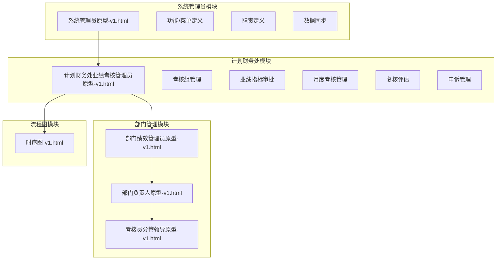
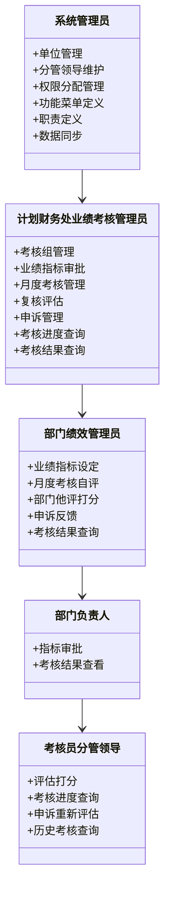
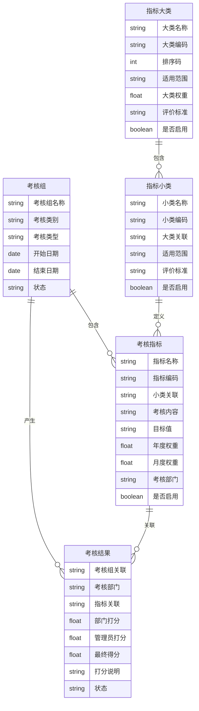
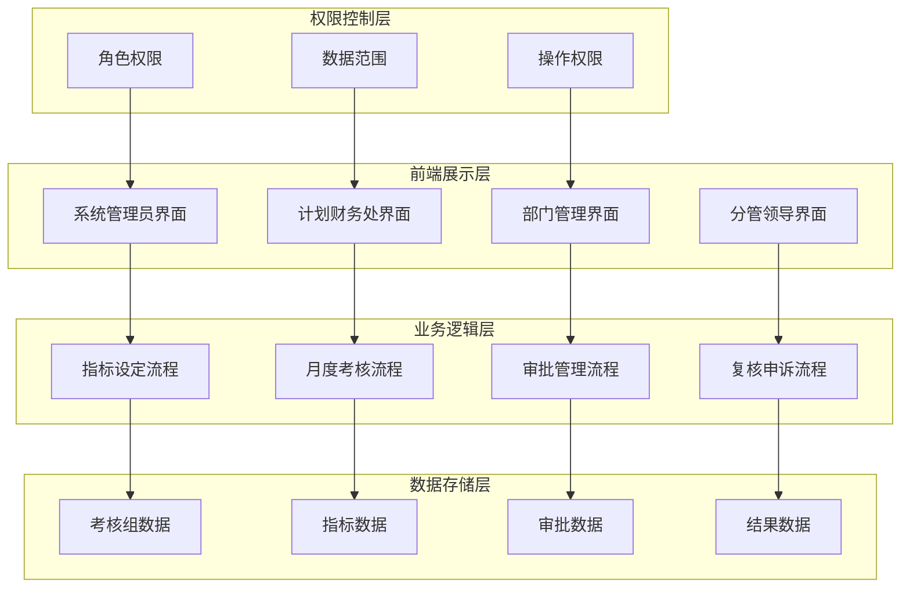
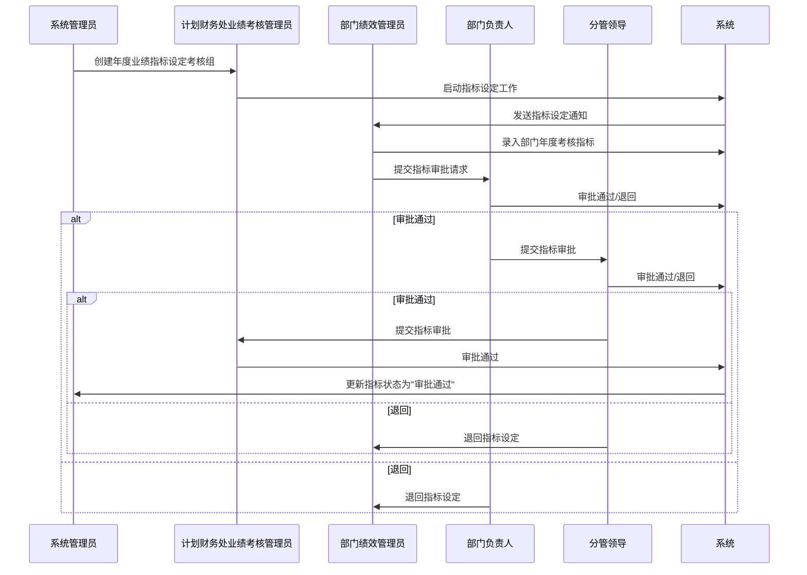
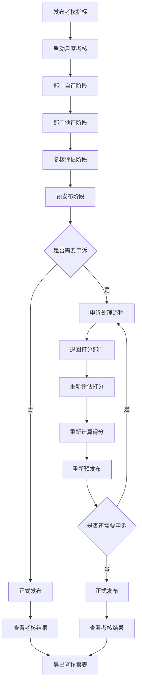
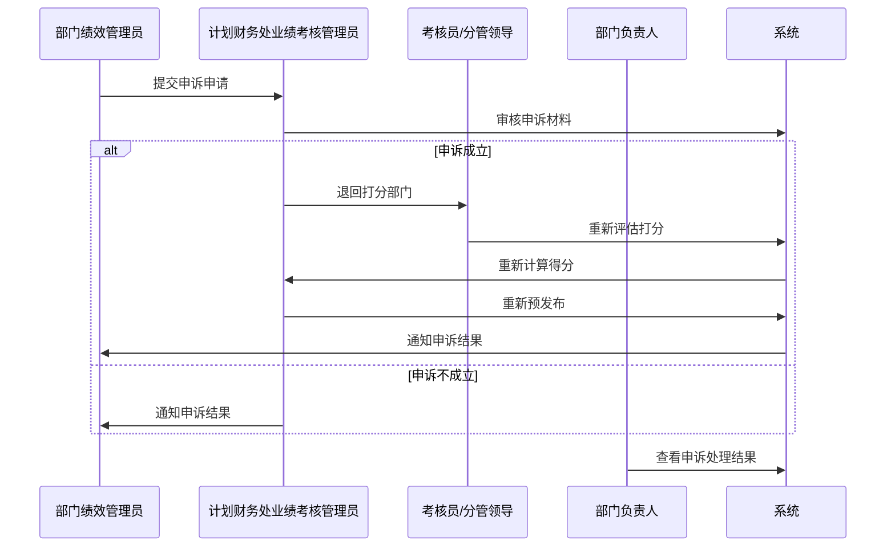
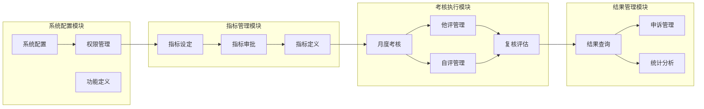
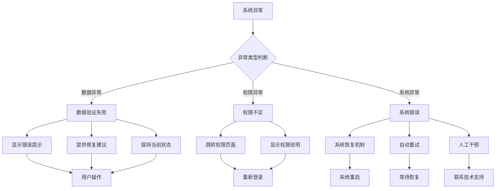

# 业务流程文档

<cite>
**本文档引用的文件**
- [1-系统管理员原型-v1.html](file://月度业绩考核原型设计初稿/1-系统管理员原型-v1.html)
- [2-计划财务处业绩考核管理员原型-v1.html](file://月度业绩考核原型设计初稿/2-计划财务处业绩考核管理员原型-v1.html)
- [3-部门绩效管理员原型-v1.html](file://月度业绩考核原型设计初稿/3-部门绩效管理员原型-v1.html)
- [4-部门负责人原型-v1.html](file://月度业绩考核原型设计初稿/4-部门负责人原型-v1.html)
- [5-考核员分管领导原型-v1.html](file://月度业绩考核原型设计初稿/5-考核员分管领导原型-v1.html)
- [6-时序图-v1.html](file://月度业绩考核原型设计初稿/6-时序图-v1.html)
</cite>

## 目录
1. [简介](#简介)
2. [项目结构](#项目结构)
3. [核心组件](#核心组件)
4. [架构概览](#架构概览)
5. [详细组件分析](#详细组件分析)
6. [依赖分析](#依赖分析)
7. [性能考虑](#性能考虑)
8. [故障排除指南](#故障排除指南)
9. [结论](#结论)
10. [附录](#附录)

## 简介

本文件基于月度业绩考核管理系统的原型设计，创建了完整的业务流程文档。该系统采用多角色协作模式，涵盖指标设定、月度考核、复核申诉等关键业务环节，通过可视化时序图和流程图清晰展示各角色之间的协作关系和数据流转过程。

系统支持多层级审批机制，包括部门负责人审批、分管领导审批和财务处审批，确保考核工作的规范性和准确性。同时提供完善的权限控制和数据验证机制，保障系统安全稳定运行。

## 项目结构

项目采用原型设计文件形式，包含以下核心页面：

**图表来源**
- [1-系统管理员原型-v1.html:1-635](file://月度业绩考核原型设计初稿/1-系统管理员原型-v1.html#L1-L635)
- [2-计划财务处业绩考核管理员原型-v1.html:1-1039](file://月度业绩考核原型设计初稿/2-计划财务处业绩考核管理员原型-v1.html#L1-L1039)
- [6-时序图-v1.html:1-570](file://月度业绩考核原型设计初稿/6-时序图-v1.html#L1-L570)

**章节来源**
- [1-系统管理员原型-v1.html:1-635](file://月度业绩考核原型设计初稿/1-系统管理员原型-v1.html#L1-L635)
- [2-计划财务处业绩考核管理员原型-v1.html:1-1039](file://月度业绩考核原型设计初稿/2-计划财务处业绩考核管理员原型-v1.html#L1-L1039)
- [3-部门绩效管理员原型-v1.html:1-1663](file://月度业绩考核原型设计初稿/3-部门绩效管理员原型-v1.html#L1-L1663)
- [4-部门负责人原型-v1.html:1-1231](file://月度业绩考核原型设计初稿/4-部门负责人原型-v1.html#L1-L1231)
- [5-考核员分管领导原型-v1.html:1-1459](file://月度业绩考核原型设计初稿/5-考核员分管领导原型-v1.html#L1-L1459)
- [6-时序图-v1.html:1-570](file://月度业绩考核原型设计初稿/6-时序图-v1.html#L1-L570)

## 核心组件

### 角色权限体系

系统建立在明确的角色权限基础上，确保各角色只能访问和操作其职责范围内的功能：

**图表来源**
- [1-系统管理员原型-v1.html:292-316](file://月度业绩考核原型设计初稿/1-系统管理员原型-v1.html#L292-L316)
- [2-计划财务处业绩考核管理员原型-v1.html:324-344](file://月度业绩考核原型设计初稿/2-计划财务处业绩考核管理员原型-v1.html#L324-L344)
- [3-部门绩效管理员原型-v1.html:412-430](file://月度业绩考核原型设计初稿/3-部门绩效管理员原型-v1.html#L412-L430)
- [4-部门负责人原型-v1.html:351-366](file://月度业绩考核原型设计初稿/4-部门负责人原型-v1.html#L351-L366)
- [5-考核员分管领导原型-v1.html:197-227](file://月度业绩考核原型设计初稿/5-考核员分管领导原型-v1.html#L197-L227)

### 数据模型

系统采用层次化的数据结构，支持指标分类管理和权重计算：

**图表来源**
- [2-计划财务处业绩考核管理员原型-v1.html:450-478](file://月度业绩考核原型设计初稿/2-计划财务处业绩考核管理员原型-v1.html#L450-L478)
- [3-部门绩效管理员原型-v1.html:767-800](file://月度业绩考核原型设计初稿/3-部门绩效管理员原型-v1.html#L767-L800)
- [6-时序图-v1.html:118-296](file://月度业绩考核原型设计初稿/6-时序图-v1.html#L118-L296)

**章节来源**
- [1-系统管理员原型-v1.html:330-482](file://月度业绩考核原型设计初稿/1-系统管理员原型-v1.html#L330-L482)
- [2-计划财务处业绩考核管理员原型-v1.html:354-653](file://月度业绩考核原型设计初稿/2-计划财务处业绩考核管理员原型-v1.html#L354-L653)
- [3-部门绩效管理员原型-v1.html:446-761](file://月度业绩考核原型设计初稿/3-部门绩效管理员原型-v1.html#L446-L761)
- [4-部门负责人原型-v1.html:380-660](file://月度业绩考核原型设计初稿/4-部门负责人原型-v1.html#L380-L660)
- [5-考核员分管领导原型-v1.html:242-695](file://月度业绩考核原型设计初稿/5-考核员分管领导原型-v1.html#L242-L695)

## 架构概览

系统采用分层架构设计，通过角色权限控制实现业务流程的有序执行：

**图表来源**
- [2-计划财务处业绩考核管理员原型-v1.html:354-653](file://月度业绩考核原型设计初稿/2-计划财务处业绩考核管理员原型-v1.html#L354-L653)
- [6-时序图-v1.html:118-555](file://月度业绩考核原型设计初稿/6-时序图-v1.html#L118-L555)

系统架构特点：
- **分层设计**：清晰分离展示层、业务逻辑层和数据存储层
- **权限控制**：基于角色的细粒度权限管理
- **流程驱动**：以业务流程为核心的数据流转机制
- **可视化展示**：丰富的图表和状态标识

## 详细组件分析

### 指标设定流程

指标设定流程是整个考核系统的基础，采用多层级审批机制确保指标的准确性和合理性：

**图表来源**
- [6-时序图-v1.html:118-296](file://月度业绩考核原型设计初稿/6-时序图-v1.html#L118-L296)

**流程关键节点**：
1. **创建考核组**：系统管理员负责创建和配置考核组
2. **指标录入**：部门管理员在线录入指标信息
3. **部门负责人审批**：逐级审批确保指标合理性
4. **分管领导审批**：高层审核把关
5. **财务处审批**：最终确认和归档

**章节来源**
- [2-计划财务处业绩考核管理员原型-v1.html:449-479](file://月度业绩考核原型设计初稿/2-计划财务处业绩考核管理员原型-v1.html#L449-L479)
- [3-部门绩效管理员原型-v1.html:767-800](file://月度业绩考核原型设计初稿/3-部门绩效管理员原型-v1.html#L767-L800)
- [4-部门负责人原型-v1.html:456-522](file://月度业绩考核原型设计初稿/4-部门负责人原型-v1.html#L456-L522)

### 月度考核流程

月度考核流程包含自评、他评、复核、申诉等多个阶段，形成完整的闭环管理：

**图表来源**
- [6-时序图-v1.html:307-555](file://月度业绩考核原型设计初稿/6-时序图-v1.html#L307-L555)

**章节来源**
- [2-计划财务处业绩考核管理员原型-v1.html:481-560](file://月度业绩考核原型设计初稿/2-计划财务处业绩考核管理员原型-v1.html#L481-L560)
- [5-考核员分管领导原型-v1.html:242-695](file://月度业绩考核原型设计初稿/5-考核员分管领导原型-v1.html#L242-L695)

### 复核申诉流程

复核申诉流程确保考核结果的公正性和透明度：

**图表来源**
- [2-计划财务处业绩考核管理员原型-v1.html:562-589](file://月度业绩考核原型设计初稿/2-计划财务处业绩考核管理员原型-v1.html#L562-L589)
- [5-考核员分管领导原型-v1.html:635-695](file://月度业绩考核原型设计初稿/5-考核员分管领导原型-v1.html#L635-L695)

**章节来源**
- [2-计划财务处业绩考核管理员原型-v1.html:562-589](file://月度业绩考核原型设计初稿/2-计划财务处业绩考核管理员原型-v1.html#L562-L589)
- [5-考核员分管领导原型-v1.html:635-695](file://月度业绩考核原型设计初稿/5-考核员分管领导原型-v1.html#L635-L695)

## 依赖分析

系统各模块之间存在明确的依赖关系和数据流转：

**图表来源**
- [1-系统管理员原型-v1.html:292-316](file://月度业绩考核原型设计初稿/1-系统管理员原型-v1.html#L292-L316)
- [2-计划财务处业绩考核管理员原型-v1.html:354-369](file://月度业绩考核原型设计初稿/2-计划财务处业绩考核管理员原型-v1.html#L354-L369)

**依赖关系特点**：
- **配置先行**：系统配置和权限管理先于业务流程
- **审批驱动**：指标设定需要多层级审批
- **流程串联**：各阶段流程紧密衔接
- **结果导向**：最终结果服务于统计分析

**章节来源**
- [1-系统管理员原型-v1.html:330-482](file://月度业绩考核原型设计初稿/1-系统管理员原型-v1.html#L330-L482)
- [2-计划财务处业绩考核管理员原型-v1.html:354-653](file://月度业绩考核原型设计初稿/2-计划财务处业绩考核管理员原型-v1.html#L354-L653)

## 性能考虑

系统在设计时充分考虑了性能优化和用户体验：

### 数据加载优化
- **分页加载**：大量数据采用分页展示，提升页面响应速度
- **懒加载**：复杂表格和图表采用延迟加载机制
- **缓存策略**：常用配置和静态数据进行本地缓存

### 流程优化
- **状态预览**：实时显示流程进度和状态变化
- **批量操作**：支持批量审批和批量处理功能
- **异步处理**：耗时操作采用异步处理，避免页面阻塞

### 用户体验优化
- **进度指示**：清晰的进度条和状态标识
- **操作反馈**：每个操作都有明确的反馈提示
- **错误处理**：友好的错误提示和恢复机制

## 故障排除指南

### 常见问题及解决方案

**指标审批流程异常**
- **问题**：指标审批状态卡住
- **解决方案**：检查审批权限配置，确认审批流程完整性

**数据导入失败**
- **问题**：批量导入指标数据失败
- **解决方案**：检查数据格式和必填字段，查看错误日志

**权限访问受限**
- **问题**：无法访问某些功能模块
- **解决方案**：确认用户角色和数据范围配置

**系统响应缓慢**
- **问题**：页面加载和操作响应慢
- **解决方案**：清理浏览器缓存，检查网络连接

### 异常处理机制

系统建立了完善的异常处理和回退机制：

**章节来源**
- [1-系统管理员原型-v1.html:541-559](file://月度业绩考核原型设计初稿/1-系统管理员原型-v1.html#L541-L559)
- [2-计划财务处业绩考核管理员原型-v1.html:562-589](file://月度业绩考核原型设计初稿/2-计划财务处业绩考核管理员原型-v1.html#L562-L589)

## 结论

月度业绩考核管理系统通过清晰的业务流程设计和完善的权限控制机制，实现了考核工作的标准化和自动化。系统的主要优势包括：

1. **流程规范化**：完整的业务流程确保考核工作的规范性和一致性
2. **权限精细化**：基于角色的权限管理体系保障数据安全
3. **可视化展示**：直观的界面设计提升用户体验
4. **流程驱动**：以业务流程为核心的系统架构便于维护和扩展

建议在后续实施中重点关注流程优化、性能提升和用户体验改进，确保系统能够满足不断增长的业务需求。

## 附录

### 培训材料

**系统管理员培训**
- 系统配置和权限管理
- 考核组织和指标管理
- 数据同步和维护

**计划财务处培训**
- 考核组管理
- 指标审批流程
- 月度考核执行

**部门管理员培训**
- 指标设定和维护
- 自评和他评操作
- 结果查询和申诉处理

### 操作手册

**快速操作指南**
1. 登录系统 → 选择相应角色 → 进入功能模块
2. 查看待办事项 → 按流程顺序处理
3. 使用帮助功能 → 查看操作说明
4. 联系支持 → 获取技术支持

**最佳实践建议**
- 及时处理待办事项
- 保持数据准确性
- 定期备份重要数据
- 遵循审批流程规范