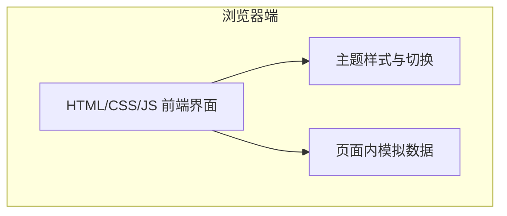
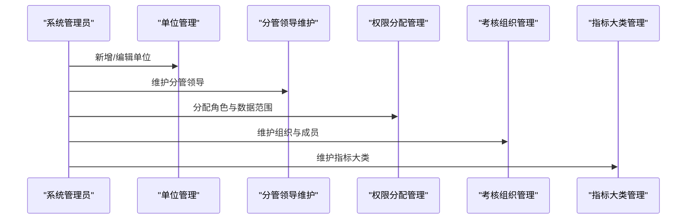
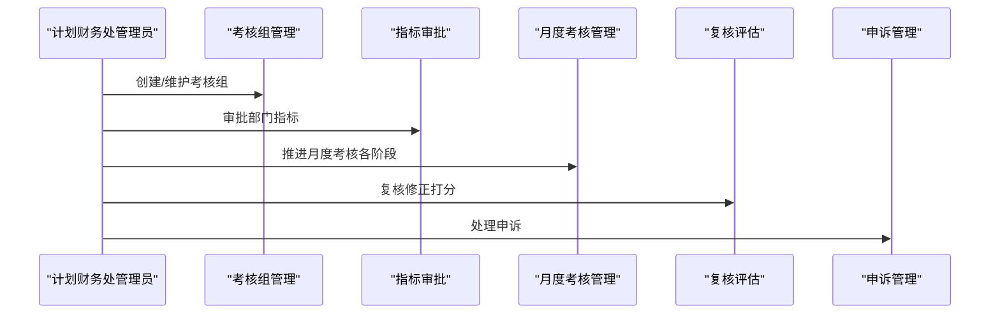
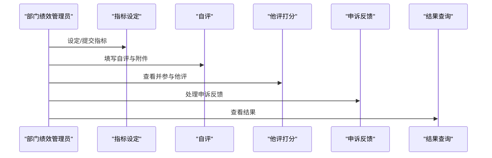
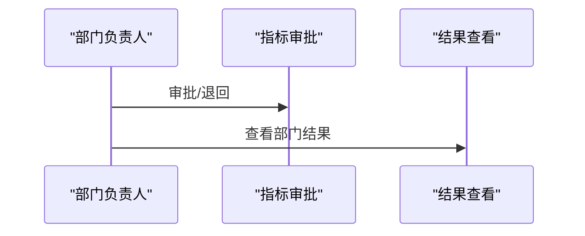
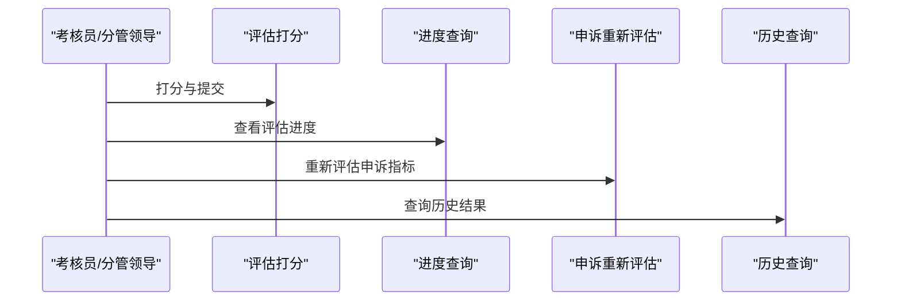
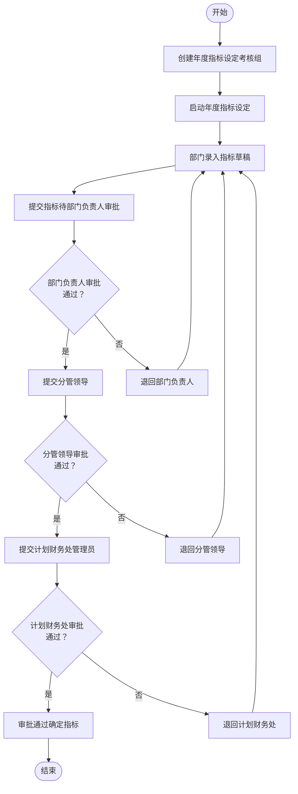
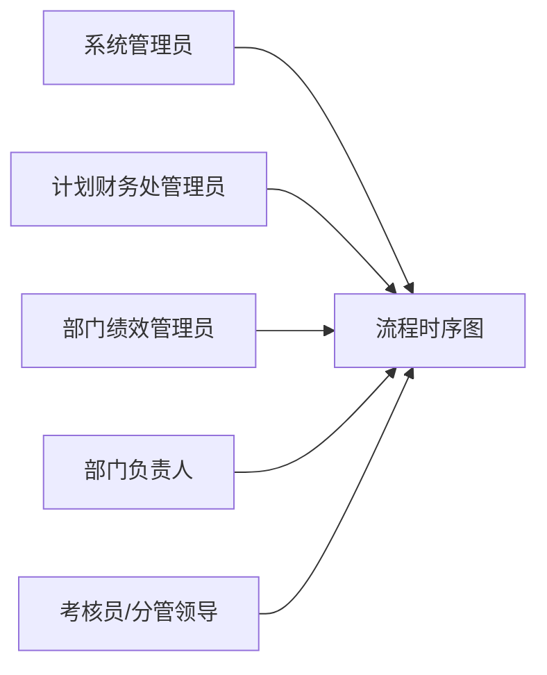

# 快速开始

<cite>
**本文引用的文件**   
- [1-系统管理员原型-v1.html](file://月度业绩考核原型设计初稿/1-系统管理员原型-v1.html)
- [2-计划财务处业绩考核管理员原型-v1.html](file://月度业绩考核原型设计初稿/2-计划财务处业绩考核管理员原型-v1.html)
- [3-部门绩效管理员原型-v1.html](file://月度业绩考核原型设计初稿/3-部门绩效管理员原型-v1.html)
- [4-部门负责人原型-v1.html](file://月度业绩考核原型设计初稿/4-部门负责人原型-v1.html)
- [5-考核员分管领导原型-v1.html](file://月度业绩考核原型设计初稿/5-考核员分管领导原型-v1.html)
- [6-时序图-v1.html](file://月度业绩考核原型设计初稿/6-时序图-v1.html)
</cite>

## 目录
1. [简介](#简介)
2. [项目结构](#项目结构)
3. [核心组件](#核心组件)
4. [架构总览](#架构总览)
5. [详细组件分析](#详细组件分析)
6. [依赖关系分析](#依赖关系分析)
7. [性能考虑](#性能考虑)
8. [故障排除指南](#故障排除指南)
9. [结论](#结论)
10. [附录](#附录)

## 简介
本快速开始指南面向“月度业绩考核管理系统”的原型演示版本，帮助初学者与开发者在本地快速部署与体验各角色界面（系统管理员、计划财务处管理员、部门绩效管理员、部门负责人、考核员/分管领导），并掌握基本使用流程、功能特性与常见问题排查方法。系统采用纯前端 HTML/CSS/JS 实现，无需后端服务，直接在浏览器中打开即可运行。

## 项目结构
原型文件位于“月度业绩考核原型设计初稿”目录下，包含各角色的独立页面与流程时序图：
- 系统管理员：单位管理、分管领导维护、权限分配、考核组织、指标大类、功能/菜单定义、职责定义、数据同步
- 计划财务处管理员：考核组管理、指标审批、月度考核管理、复核评估、申诉管理、进度查询、结果查询
- 部门绩效管理员：指标设定、自评、他评、申诉反馈、结果查询
- 部门负责人：指标审批、结果查看
- 考核员/分管领导：评估打分、进度查询、申诉重新评估、历史查询
- 时序图：年度指标设定与月度考核流程

图表来源
- [1-系统管理员原型-v1.html](file://月度业绩考核原型设计初稿/1-系统管理员原型-v1.html)
- [2-计划财务处业绩考核管理员原型-v1.html](file://月度业绩考核原型设计初稿/2-计划财务处业绩考核管理员原型-v1.html)
- [3-部门绩效管理员原型-v1.html](file://月度业绩考核原型设计初稿/3-部门绩效管理员原型-v1.html)
- [4-部门负责人原型-v1.html](file://月度业绩考核原型设计初稿/4-部门负责人原型-v1.html)
- [5-考核员分管领导原型-v1.html](file://月度业绩考核原型设计初稿/5-考核员分管领导原型-v1.html)
- [6-时序图-v1.html](file://月度业绩考核原型设计初稿/6-时序图-v1.html)

章节来源
- [1-系统管理员原型-v1.html](file://月度业绩考核原型设计初稿/1-系统管理员原型-v1.html)
- [2-计划财务处业绩考核管理员原型-v1.html](file://月度业绩考核原型设计初稿/2-计划财务处业绩考核管理员原型-v1.html)
- [3-部门绩效管理员原型-v1.html](file://月度业绩考核原型设计初稿/3-部门绩效管理员原型-v1.html)
- [4-部门负责人原型-v1.html](file://月度业绩考核原型设计初稿/4-部门负责人原型-v1.html)
- [5-考核员分管领导原型-v1.html](file://月度业绩考核原型设计初稿/5-考核员分管领导原型-v1.html)
- [6-时序图-v1.html](file://月度业绩考核原型设计初稿/6-时序图-v1.html)

## 核心组件
- 角色界面：系统管理员、计划财务处管理员、部门绩效管理员、部门负责人、考核员/分管领导，均以独立 HTML 页面实现，包含侧边栏导航、面包屑、卡片式内容区、表格与分页、弹窗等 UI 组件。
- 流程时序图：以 SVG 展示“年度指标设定”和“月度考核”两大流程，标注参与者、消息方向、条件分支与状态流转。
- 样式系统：统一的 CSS 变量与主题切换（默认、百度商务、飞书应用、科技风、央企国企），便于快速适配不同风格。
- 交互逻辑：页面内 JavaScript 负责页面切换、弹窗开关、搜索筛选、状态标签与进度条等。

章节来源
- [1-系统管理员原型-v1.html](file://月度业绩考核原型设计初稿/1-系统管理员原型-v1.html)
- [2-计划财务处业绩考核管理员原型-v1.html](file://月度业绩考核原型设计初稿/2-计划财务处业绩考核管理员原型-v1.html)
- [3-部门绩效管理员原型-v1.html](file://月度业绩考核原型设计初稿/3-部门绩效管理员原型-v1.html)
- [4-部门负责人原型-v1.html](file://月度业绩考核原型设计初稿/4-部门负责人原型-v1.html)
- [5-考核员分管领导原型-v1.html](file://月度业绩考核原型设计初稿/5-考核员分管领导原型-v1.html)
- [6-时序图-v1.html](file://月度业绩考核原型设计初稿/6-时序图-v1.html)

## 架构总览
系统为纯前端原型，无后端依赖，所有数据与状态均在页面内模拟。整体交互采用“页面切换 + 弹窗 + 表格分页”的组合模式，辅以状态标签与进度条提升可视化体验。

图表来源
- [1-系统管理员原型-v1.html](file://月度业绩考核原型设计初稿/1-系统管理员原型-v1.html)
- [2-计划财务处业绩考核管理员原型-v1.html](file://月度业绩考核原型设计初稿/2-计划财务处业绩考核管理员原型-v1.html)
- [3-部门绩效管理员原型-v1.html](file://月度业绩考核原型设计初稿/3-部门绩效管理员原型-v1.html)
- [4-部门负责人原型-v1.html](file://月度业绩考核原型设计初稿/4-部门负责人原型-v1.html)
- [5-考核员分管领导原型-v1.html](file://月度业绩考核原型设计初稿/5-考核员分管领导原型-v1.html)
- [6-时序图-v1.html](file://月度业绩考核原型设计初稿/6-时序图-v1.html)

## 详细组件分析

### 系统管理员原型
- 主要功能模块：单位管理、分管领导维护、权限分配管理、考核组织管理、指标大类管理、功能/菜单定义、职责定义、数据同步。
- 使用场景：初始化系统、配置单位与组织、分配角色与数据范围、定义菜单与职责、同步人员基础数据。
- 关键交互：侧边栏导航切换页面；搜索表单筛选；表格分页；弹窗新增/编辑；状态标签展示启用/有效/待启动等状态。

图表来源
- [1-系统管理员原型-v1.html](file://月度业绩考核原型设计初稿/1-系统管理员原型-v1.html)

章节来源
- [1-系统管理员原型-v1.html](file://月度业绩考核原型设计初稿/1-系统管理员原型-v1.html)

### 计划财务处管理员原型
- 主要功能模块：考核组管理、业绩指标审批、月度考核管理、复核评估、申诉管理、进度查询、结果查询。
- 使用场景：统筹年度/月度考核流程，审批指标，推进月度考核各阶段，复核修正，处理申诉，查询进度与结果。
- 关键交互：进度条展示完成度；状态标签区分进行中/已完成/待启动；弹窗审批与退回；表格分页与搜索。

图表来源
- [2-计划财务处业绩考核管理员原型-v1.html](file://月度业绩考核原型设计初稿/2-计划财务处业绩考核管理员原型-v1.html)

章节来源
- [2-计划财务处业绩考核管理员原型-v1.html](file://月度业绩考核原型设计初稿/2-计划财务处业绩考核管理员原型-v1.html)

### 部门绩效管理员原型
- 主要功能模块：业绩指标设定、月度考核自评、部门他评打分、申诉反馈、考核结果查询。
- 使用场景：部门内部设定年度指标、提交自评、参与他评、处理申诉、查看结果。
- 关键交互：按部门/指标视图切换；评分输入与说明；状态标签与进度条；弹窗查看与详情。

图表来源
- [3-部门绩效管理员原型-v1.html](file://月度业绩考核原型设计初稿/3-部门绩效管理员原型-v1.html)

章节来源
- [3-部门绩效管理员原型-v1.html](file://月度业绩考核原型设计初稿/3-部门绩效管理员原型-v1.html)

### 部门负责人原型
- 主要功能模块：指标审批、考核结果查看。
- 使用场景：审批部门提交的指标，查看预发布/已发布结果。
- 关键交互：审批弹窗、状态标签、结果列表与详情。

图表来源
- [4-部门负责人原型-v1.html](file://月度业绩考核原型设计初稿/4-部门负责人原型-v1.html)

章节来源
- [4-部门负责人原型-v1.html](file://月度业绩考核原型设计初稿/4-部门负责人原型-v1.html)

### 考核员/分管领导原型
- 主要功能模块：评估打分、考核进度查询、申诉重新评估、历史考核查询。
- 使用场景：对其他部门进行他评打分，查看进度，处理申诉，查询历史结果。
- 关键交互：按部门/指标视图切换；评分输入与说明；进度条与状态标签；弹窗详情。

图表来源
- [5-考核员分管领导原型-v1.html](file://月度业绩考核原型设计初稿/5-考核员分管领导原型-v1.html)

章节来源
- [5-考核员分管领导原型-v1.html](file://月度业绩考核原型设计初稿/5-考核员分管领导原型-v1.html)

### 时序图原型
- 年度指标设定时序图：展示从创建考核组、启动、部门录入、逐级审批到最终通过的完整流程，含退回分支与状态流转。
- 月度业绩考核时序图：展示发布指标、启动、自评、他评、复核、预发布、申诉、发布等阶段及状态流转。

图表来源
- [6-时序图-v1.html](file://月度业绩考核原型设计初稿/6-时序图-v1.html)

章节来源
- [6-时序图-v1.html](file://月度业绩考核原型设计初稿/6-时序图-v1.html)

## 依赖关系分析
- 文件内聚性：各角色页面高度内聚，围绕单一职责构建（如“系统管理员”仅负责系统配置，“计划财务处管理员”负责流程推进）。
- 组件耦合：页面间通过“流程时序图”形成概念上的依赖关系，实际原型中无跨页面数据依赖。
- 样式与脚本：统一的主题变量与切换逻辑，减少重复代码；页面内脚本负责导航与弹窗，保持低耦合。

图表来源
- [1-系统管理员原型-v1.html](file://月度业绩考核原型设计初稿/1-系统管理员原型-v1.html)
- [2-计划财务处业绩考核管理员原型-v1.html](file://月度业绩考核原型设计初稿/2-计划财务处业绩考核管理员原型-v1.html)
- [3-部门绩效管理员原型-v1.html](file://月度业绩考核原型设计初稿/3-部门绩效管理员原型-v1.html)
- [4-部门负责人原型-v1.html](file://月度业绩考核原型设计初稿/4-部门负责人原型-v1.html)
- [5-考核员分管领导原型-v1.html](file://月度业绩考核原型设计初稿/5-考核员分管领导原型-v1.html)
- [6-时序图-v1.html](file://月度业绩考核原型设计初稿/6-时序图-v1.html)

章节来源
- [1-系统管理员原型-v1.html](file://月度业绩考核原型设计初稿/1-系统管理员原型-v1.html)
- [2-计划财务处业绩考核管理员原型-v1.html](file://月度业绩考核原型设计初稿/2-计划财务处业绩考核管理员原型-v1.html)
- [3-部门绩效管理员原型-v1.html](file://月度业绩考核原型设计初稿/3-部门绩效管理员原型-v1.html)
- [4-部门负责人原型-v1.html](file://月度业绩考核原型设计初稿/4-部门负责人原型-v1.html)
- [5-考核员分管领导原型-v1.html](file://月度业绩考核原型设计初稿/5-考核员分管领导原型-v1.html)
- [6-时序图-v1.html](file://月度业绩考核原型设计初稿/6-时序图-v1.html)

## 性能考虑
- 原型为静态页面，加载轻量，无网络请求，性能主要取决于浏览器渲染能力。
- 表格与分页组件在大数据量时建议虚拟滚动或服务端分页（当前为前端分页，适合演示规模）。
- 主题切换与弹窗交互基于 DOM 操作，建议避免频繁重排，保持页面结构稳定。

## 故障排除指南
- 页面无法打开
  - 确认使用现代浏览器打开，推荐 Chrome/Firefox/Edge。
  - 若出现乱码或字体异常，检查系统字体是否包含“Microsoft YaHei/PingFang SC”。
- 弹窗无法关闭
  - 确认点击了弹窗右上角“×”或空白遮罩层；检查页面内 JavaScript 是否被禁用。
- 表格无数据或分页异常
  - 清空搜索条件或点击“重置”，确保筛选项合法。
- 状态标签颜色异常
  - 检查主题切换按钮是否正确选择；若仍异常，刷新页面恢复默认主题。
- 评分输入无效
  - 确认输入框允许范围（如 0-120 分）；保存后提交才生效。

章节来源
- [1-系统管理员原型-v1.html](file://月度业绩考核原型设计初稿/1-系统管理员原型-v1.html)
- [2-计划财务处业绩考核管理员原型-v1.html](file://月度业绩考核原型设计初稿/2-计划财务处业绩考核管理员原型-v1.html)
- [3-部门绩效管理员原型-v1.html](file://月度业绩考核原型设计初稿/3-部门绩效管理员原型-v1.html)
- [4-部门负责人原型-v1.html](file://月度业绩考核原型设计初稿/4-部门负责人原型-v1.html)
- [5-考核员分管领导原型-v1.html](file://月度业绩考核原型设计初稿/5-考核员分管领导原型-v1.html)
- [6-时序图-v1.html](file://月度业绩考核原型设计初稿/6-时序图-v1.html)

## 结论
本快速开始指南提供了月度业绩考核管理系统的原型部署与使用说明。通过浏览器直接打开各角色页面，即可体验从系统初始化、指标设定、月度考核到结果发布的完整流程。建议结合“时序图原型”理解业务流程，按角色逐步熟悉界面与操作。

## 附录

### 环境准备与安装
- 运行环境：Windows/macOS/Linux 上任一现代浏览器（Chrome/Firefox/Edge）
- 浏览器兼容性：支持较新的桌面浏览器；移动端体验以展示为主，部分表格可能需要横向滚动
- 部署方式：将“月度业绩考核原型设计初稿”目录复制到任意可访问位置，双击对应 HTML 文件即可打开

### 基本使用示例与操作流程
- 系统管理员
  - 登录后进入“单位管理”，新增/编辑单位；进入“权限分配管理”，为人员分配角色与数据范围；进入“指标大类管理”，维护指标分类与权重。
- 计划财务处管理员
  - 在“考核组管理”中创建/维护考核组；在“业绩指标审批”中逐级审批；在“月度考核管理”中推进各阶段；在“复核评估”中修正打分；在“申诉管理”中处理申诉；在“进度/结果查询”中查看与导出。
- 部门绩效管理员
  - 在“业绩指标设定”中按模板设定指标；在“月度考核自评”中提交自评；在“部门他评打分”中参与他评；在“申诉反馈”中处理申诉；在“考核结果查询”中查看结果。
- 部门负责人
  - 在“指标审批”中审批/退回；在“考核结果查看”中查看部门结果。
- 考核员/分管领导
  - 在“评估打分”中按部门/指标视图打分；在“考核进度查询”中查看评估进度；在“申诉重新评估”中处理申诉；在“历史考核查询”中查看历史结果。

### 常见初始配置步骤
- 初始化单位与组织：在“单位管理”与“考核组织管理”中建立单位与组织结构。
- 维护分管领导：在“分管领导维护”中配置各单位分管领导名单。
- 定义指标大类：在“指标大类管理”中维护适用范围、权重与评价标准。
- 分配权限：在“权限分配管理”中为人员分配角色与数据范围。
- 启动流程：在“考核组管理”中创建考核组并启动；在“月度考核管理”中推进各阶段。

### 常见问题与解答
- Q：为什么某些页面没有数据？
  - A：请检查筛选条件或点击“重置”，或确认当前角色的数据范围是否包含该记录。
- Q：评分后看不到变化？
  - A：请先“保存”，再“提交”，状态才会更新。
- Q：主题切换无效？
  - A：请刷新页面或更换浏览器尝试。