# 主题系统实现

<cite>
**本文档引用的文件**
- [系统管理员原型-v1.html](file://月度业绩考核原型设计初稿/1-系统管理员原型-v1.html)
- [计划财务处业绩考核管理员原型-v1.html](file://月度业绩考核原型设计初稿/2-计划财务处业绩考核管理员原型-v1.html)
- [部门绩效管理员原型-v1.html](file://月度业绩考核原型设计初稿/3-部门绩效管理员原型-v1.html)
- [部门负责人原型-v1.html](file://月度业绩考核原型设计初稿/4-部门负责人原型-v1.html)
- [考核员分管领导原型-v1.html](file://月度业绩考核原型设计初稿/5-考核员分管领导原型-v1.html)
- [时序图-v1.html](file://月度业绩考核原型设计初稿/6-时序图-v1.html)
</cite>

## 目录
1. [简介](#简介)
2. [项目结构](#项目结构)
3. [核心组件](#核心组件)
4. [架构概览](#架构概览)
5. [详细组件分析](#详细组件分析)
6. [依赖关系分析](#依赖关系分析)
7. [性能考虑](#性能考虑)
8. [故障排除指南](#故障排除指南)
9. [结论](#结论)

## 简介

本文档详细分析了基于CSS变量的主题系统实现，该系统为月度业绩考核管理原型提供了灵活的视觉定制能力。系统采用5种不同的主题风格，包括默认风格、百度商务、飞书应用、科技风和央企国企风格，通过CSS变量实现统一的颜色管理和视觉一致性。

主题系统的核心优势在于其模块化设计和可扩展性，允许用户在不同主题之间无缝切换，同时保持界面的一致性和可用性。系统特别适用于企业级应用，能够满足不同组织的文化需求和视觉偏好。

## 项目结构

项目采用原型设计模式，为不同的用户角色提供了专门的界面原型：

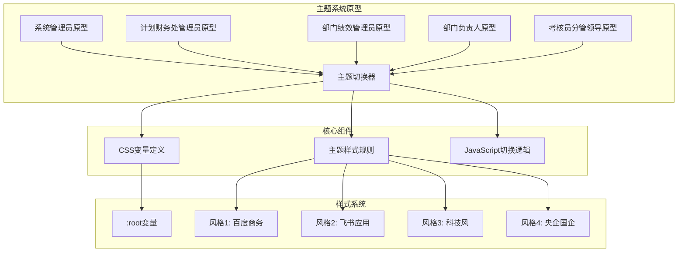

**图表来源**
- [系统管理员原型-v1.html:1-635](file://月度业绩考核原型设计初稿/1-系统管理员原型-v1.html#L1-L635)

**章节来源**
- [系统管理员原型-v1.html:1-635](file://月度业绩考核原型设计初稿/1-系统管理员原型-v1.html#L1-L635)
- [计划财务处业绩考核管理员原型-v1.html:1-1039](file://月度业绩考核原型设计初稿/2-计划财务处业绩考核管理员原型-v1.html#L1-L1039)

## 核心组件

### CSS变量系统

主题系统的核心是基于CSS自定义属性的变量系统，定义了完整的色彩体系和设计令牌：

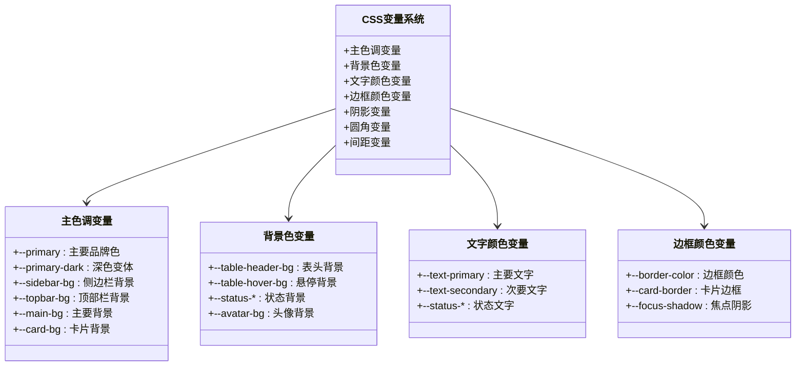

**图表来源**
- [系统管理员原型-v1.html:8-42](file://月度业绩考核原型设计初稿/1-系统管理员原型-v1.html#L8-L42)

### 主题切换器

主题切换器是一个独立的UI组件，提供直观的主题选择界面：

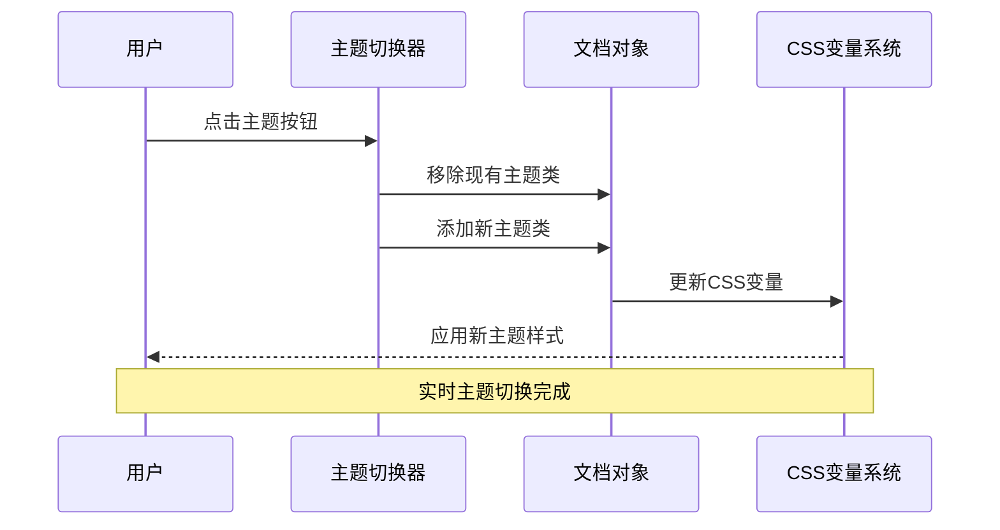

**图表来源**
- [系统管理员原型-v1.html:612-632](file://月度业绩考核原型设计初稿/1-系统管理员原型-v1.html#L612-L632)

**章节来源**
- [系统管理员原型-v1.html:151-185](file://月度业绩考核原型设计初稿/1-系统管理员原型-v1.html#L151-L185)
- [系统管理员原型-v1.html:612-632](file://月度业绩考核原型设计初稿/1-系统管理员原型-v1.html#L612-L632)

## 架构概览

主题系统的整体架构采用分层设计，确保了良好的可维护性和扩展性：

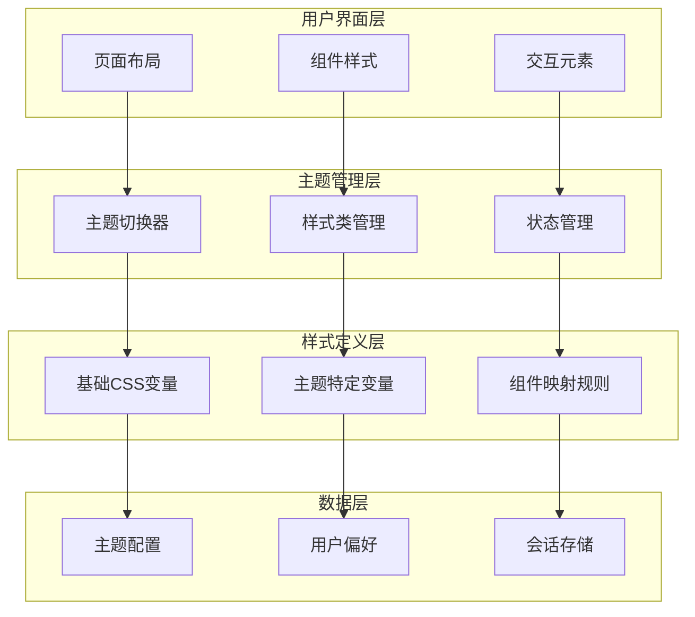

**图表来源**
- [系统管理员原型-v1.html:1-635](file://月度业绩考核原型设计初稿/1-系统管理员原型-v1.html#L1-L635)

### CSS变量作用域管理

CSS变量的作用域遵循特定的层次结构，确保样式的正确继承和覆盖：

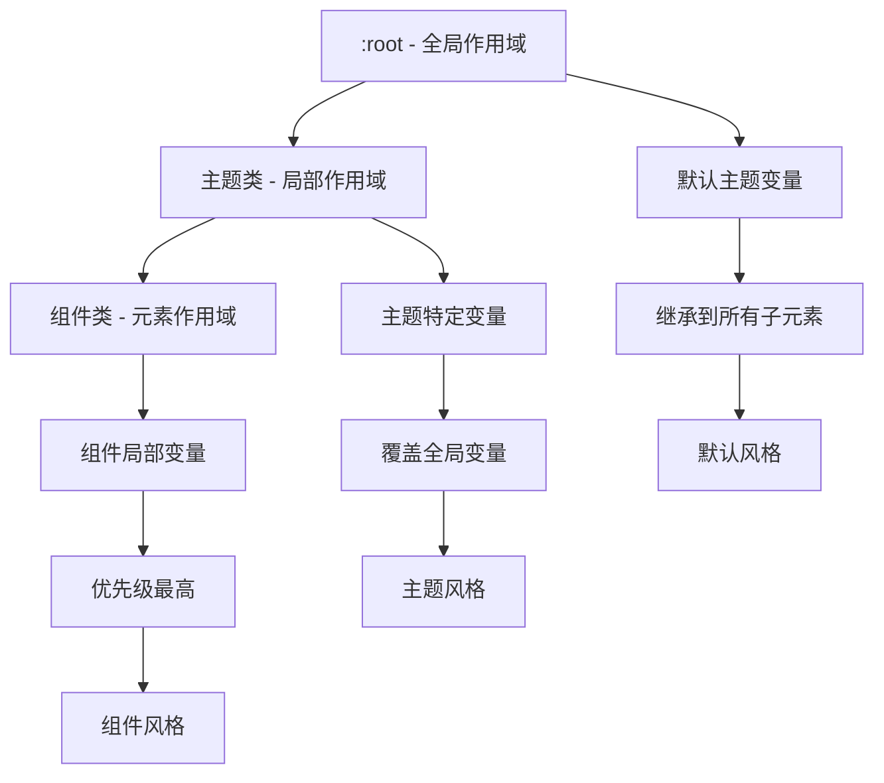

**图表来源**
- [系统管理员原型-v1.html:9-35](file://月度业绩考核原型设计初稿/1-系统管理员原型-v1.html#L9-L35)

**章节来源**
- [系统管理员原型-v1.html:9-35](file://月度业绩考核原型设计初稿/1-系统管理员原型-v1.html#L9-L35)

## 详细组件分析

### 默认风格设计

默认风格作为系统的基础主题，定义了完整的色彩体系和设计规范：

| 变量类别 | 默认值 | 用途 |
|---------|--------|------|
| 主色调 | `#2d5aa0` | 品牌主色，用于主要按钮和链接 |
| 深色变体 | `#1a3a6b` | 悬停和激活状态 |
| 侧边栏背景 | `#001529` | 深色侧边栏背景 |
| 顶部栏背景 | `#fff` | 浅色顶部栏背景 |
| 主要背景 | `#f0f2f5` | 页面主背景色 |
| 卡片背景 | `#fff` | 内容卡片背景 |

**章节来源**
- [系统管理员原型-v1.html:9-42](file://月度业绩考核原型设计初稿/1-系统管理员原型-v1.html#L9-L42)

### 百度商务风格

百度商务风格体现了传统商务网站的设计特点，强调专业性和权威感：

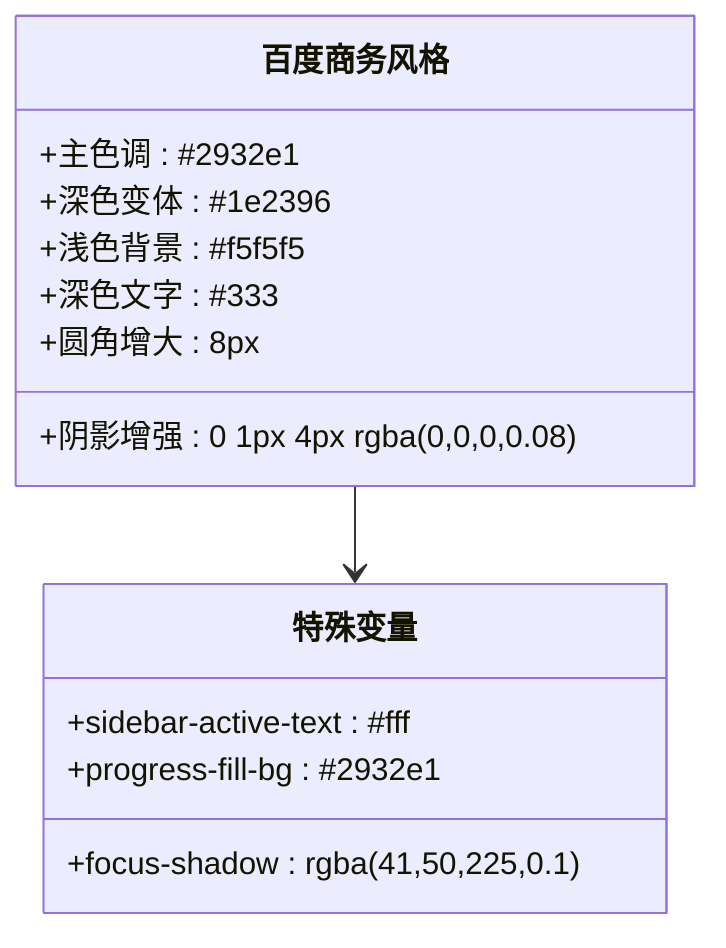

**图表来源**
- [系统管理员原型-v1.html:44-65](file://月度业绩考核原型设计初稿/1-系统管理员原型-v1.html#L44-L65)

**章节来源**
- [系统管理员原型-v1.html:44-65](file://月度业绩考核原型设计初稿/1-系统管理员原型-v1.html#L44-L65)

### 飞书应用风格

飞书应用风格展现了现代应用界面的设计理念，注重简洁和功能性：

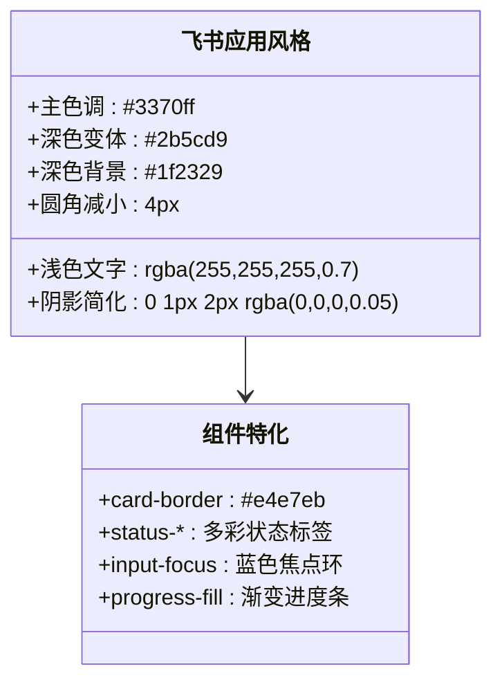

**图表来源**
- [系统管理员原型-v1.html:67-125](file://月度业绩考核原型设计初稿/1-系统管理员原型-v1.html#L67-L125)

**章节来源**
- [系统管理员原型-v1.html:67-125](file://月度业绩考核原型设计初稿/1-系统管理员原型-v1.html#L67-L125)

### 科技风格

科技风格体现了未来感和技术感，使用高对比度的配色方案：

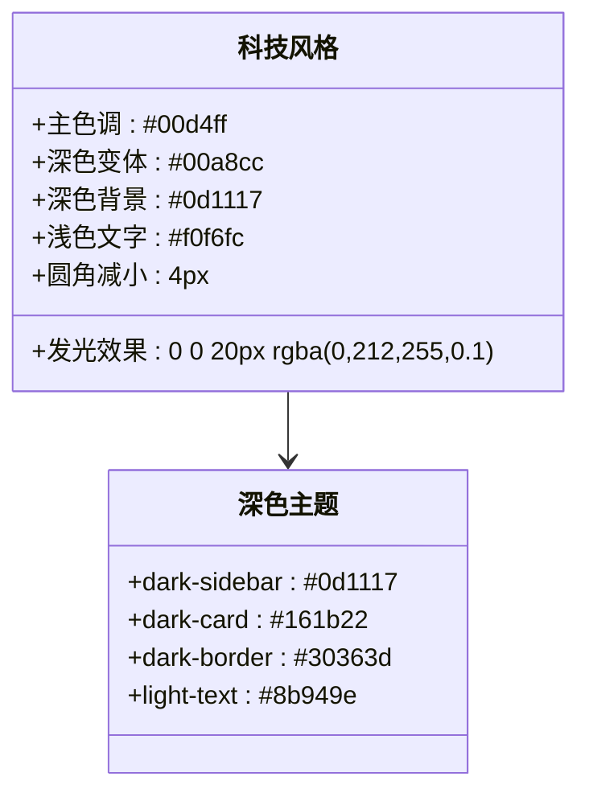

**图表来源**
- [系统管理员原型-v1.html:127-158](file://月度业绩考核原型设计初稿/1-系统管理员原型-v1.html#L127-L158)

**章节来源**
- [系统管理员原型-v1.html:127-158](file://月度业绩考核原型设计初稿/1-系统管理员原型-v1.html#L127-L158)

### 央企国企风格

央企国企风格体现了国有企业庄重、稳重的品牌形象：

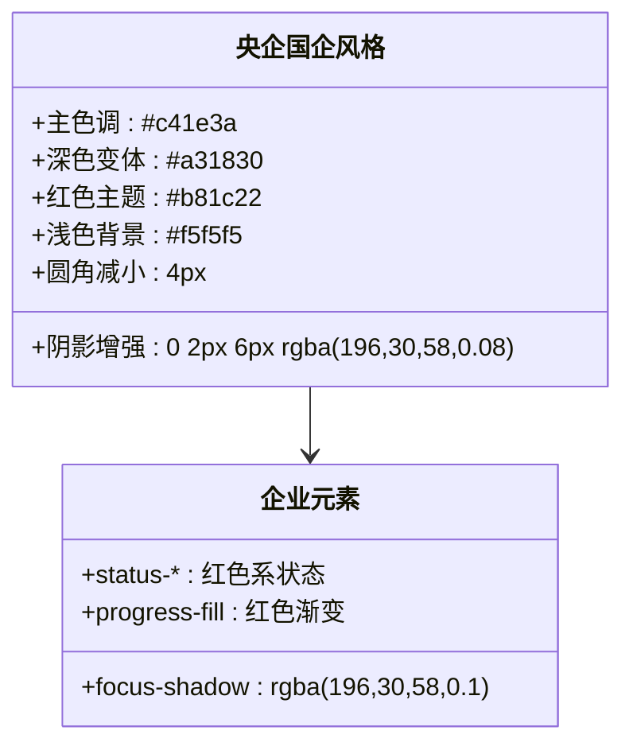

**图表来源**
- [系统管理员原型-v1.html:160-184](file://月度业绩考核原型设计初稿/1-系统管理员原型-v1.html#L160-L184)

**章节来源**
- [系统管理员原型-v1.html:160-184](file://月度业绩考核原型设计初稿/1-系统管理员原型-v1.html#L160-L184)

### JavaScript主题切换实现

主题切换器的JavaScript实现采用了简洁而高效的状态管理模式：

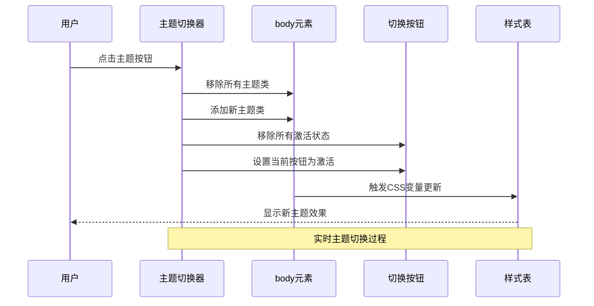

**图表来源**
- [系统管理员原型-v1.html:613-619](file://月度业绩考核原型设计初稿/1-系统管理员原型-v1.html#L613-L619)

**章节来源**
- [系统管理员原型-v1.html:612-632](file://月度业绩考核原型设计初稿/1-系统管理员原型-v1.html#L612-L632)

## 依赖关系分析

主题系统在不同原型文件中的依赖关系展现了模块化的架构设计：

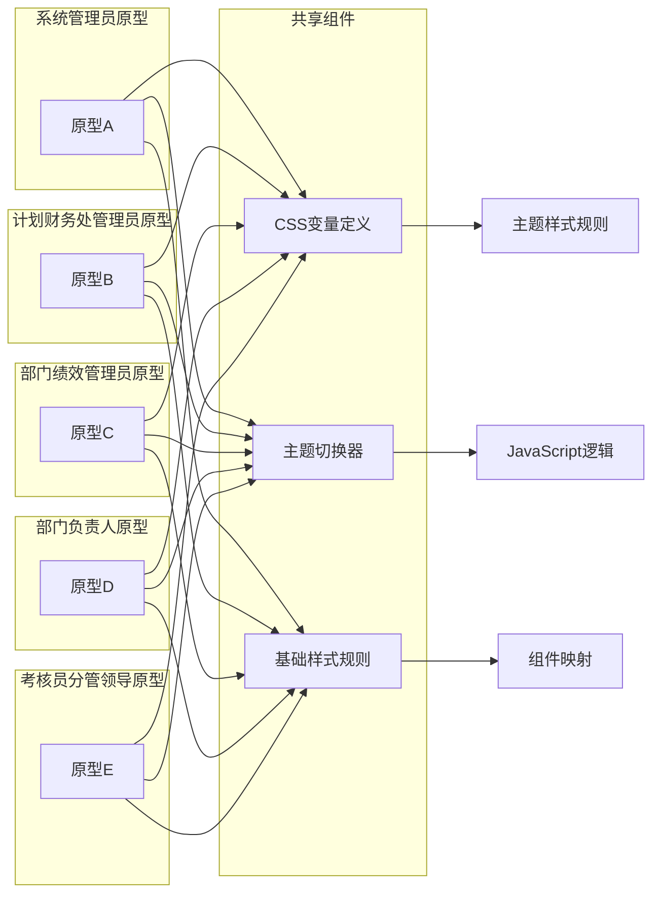

**图表来源**
- [系统管理员原型-v1.html:1-635](file://月度业绩考核原型设计初稿/1-系统管理员原型-v1.html#L1-L635)
- [计划财务处业绩考核管理员原型-v1.html:1-1039](file://月度业绩考核原型设计初稿/2-计划财务处业绩考核管理员原型-v1.html#L1-L1039)

**章节来源**
- [系统管理员原型-v1.html:1-635](file://月度业绩考核原型设计初稿/1-系统管理员原型-v1.html#L1-L635)
- [计划财务处业绩考核管理员原型-v1.html:1-1039](file://月度业绩考核原型设计初稿/2-计划财务处业绩考核管理员原型-v1.html#L1-L1039)

### 样式继承关系

主题系统中的样式继承遵循特定的优先级规则：

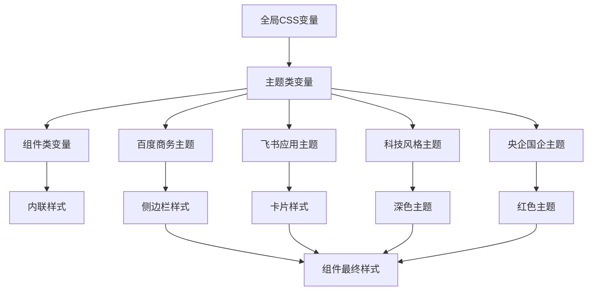

**图表来源**
- [系统管理员原型-v1.html:37-185](file://月度业绩考核原型设计初稿/1-系统管理员原型-v1.html#L37-L185)

**章节来源**
- [系统管理员原型-v1.html:37-185](file://月度业绩考核原型设计初稿/1-系统管理员原型-v1.html#L37-L185)

## 性能考虑

主题系统在性能方面采用了多项优化策略：

### CSS变量性能优势

1. **运行时计算优化**: CSS变量在渲染时计算，避免了JavaScript频繁DOM操作
2. **内存效率**: 变量缓存机制减少了重复计算开销
3. **硬件加速**: 支持GPU加速的CSS属性变化

### 主题切换性能

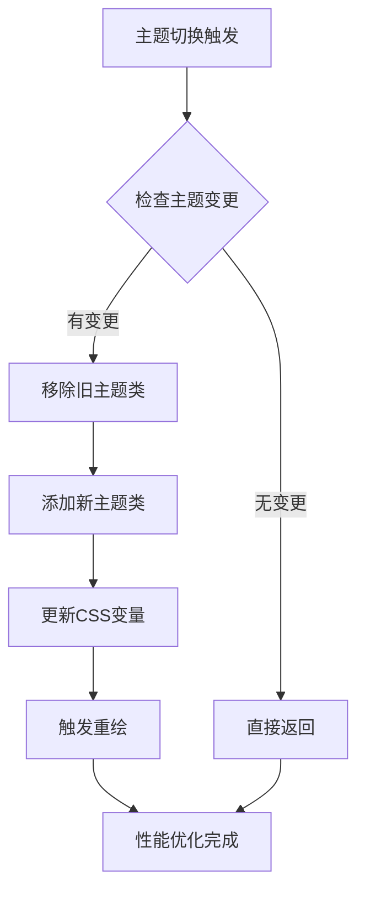

**图表来源**
- [系统管理员原型-v1.html:614-619](file://月度业绩考核原型设计初稿/1-系统管理员原型-v1.html#L614-L619)

### 响应式设计集成

主题系统与响应式设计完美结合，确保在不同设备上的最佳体验：

| 断点 | 最小宽度 | 主题适配 |
|------|----------|----------|
| 移动端 | 0px | 简化主题元素 |
| 平板端 | 768px | 增加圆角半径 |
| 桌面端 | 1024px | 使用完整主题特性 |
| 大屏端 | 1200px | 最大化主题效果 |

**章节来源**
- [系统管理员原型-v1.html:614-619](file://月度业绩考核原型设计初稿/1-系统管理员原型-v1.html#L614-L619)

## 故障排除指南

### 常见问题及解决方案

#### 主题切换无效

**问题症状**: 点击主题按钮后界面无变化

**可能原因**:
1. JavaScript错误阻止了切换逻辑
2. CSS变量未正确更新
3. 主题类名冲突

**解决步骤**:
1. 检查浏览器控制台是否有JavaScript错误
2. 验证CSS变量是否正确应用
3. 确认主题类名唯一性

#### 样式不一致

**问题症状**: 不同组件主题效果不一致

**可能原因**:
1. 组件未正确引用CSS变量
2. 样式优先级冲突
3. 主题变量覆盖顺序问题

**解决步骤**:
1. 检查组件样式是否使用var()函数
2. 验证样式优先级链
3. 确认主题变量定义顺序

#### 性能问题

**问题症状**: 主题切换卡顿或延迟

**优化建议**:
1. 减少DOM操作数量
2. 使用CSS变量而非JavaScript动态样式
3. 避免复杂的动画过渡

**章节来源**
- [系统管理员原型-v1.html:614-619](file://月度业绩考核原型设计初稿/1-系统管理员原型-v1.html#L614-L619)

## 结论

主题系统实现了高度模块化和可扩展的视觉定制解决方案。通过CSS变量的巧妙运用，系统不仅提供了丰富的主题选择，还确保了良好的性能表现和用户体验。

### 主要成就

1. **统一的色彩管理体系**: 通过CSS变量实现了完整的色彩系统
2. **灵活的主题切换**: JavaScript驱动的实时主题切换功能
3. **模块化架构设计**: 支持独立的主题开发和维护
4. **跨浏览器兼容性**: 兼容主流浏览器的CSS变量支持

### 扩展建议

1. **主题预览功能**: 添加主题预览功能帮助用户选择
2. **自定义主题**: 允许用户创建个性化主题
3. **主题导入导出**: 支持主题配置的分享和迁移
4. **暗色模式**: 扩展支持暗色主题选项

该主题系统为类似的企业级应用提供了优秀的参考实现，展示了如何通过现代Web技术实现灵活而强大的视觉定制能力。