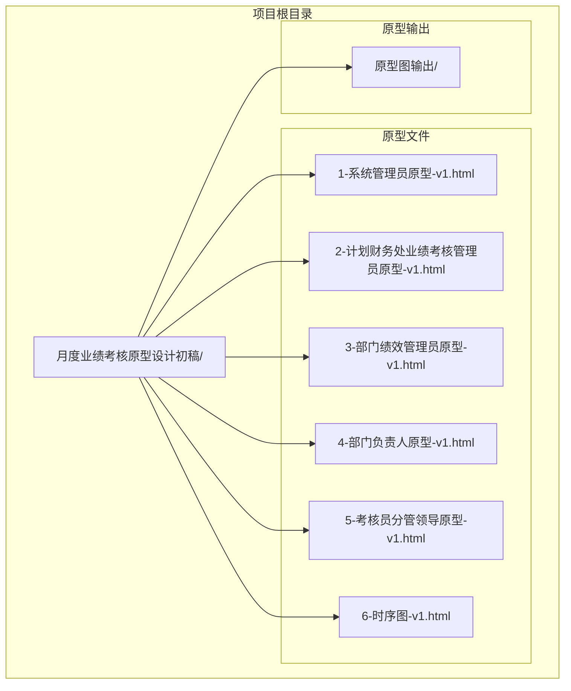
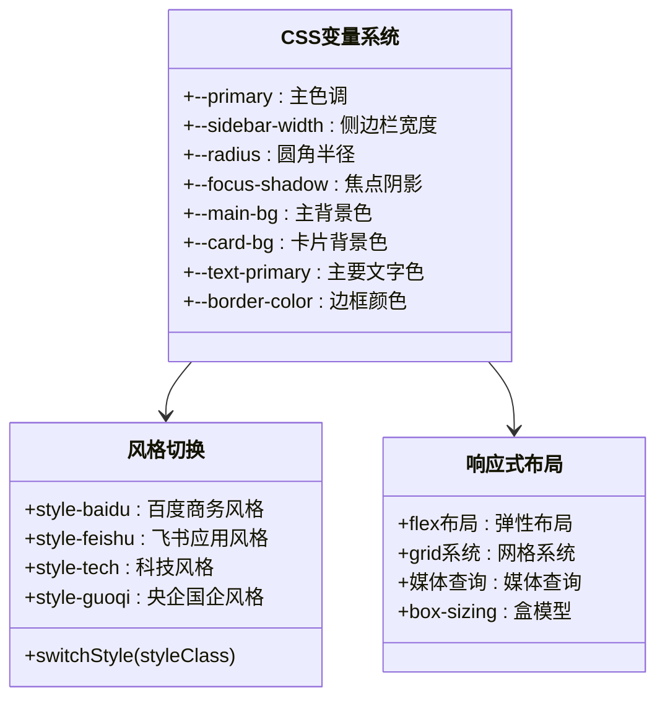
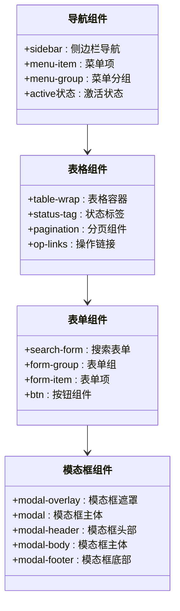
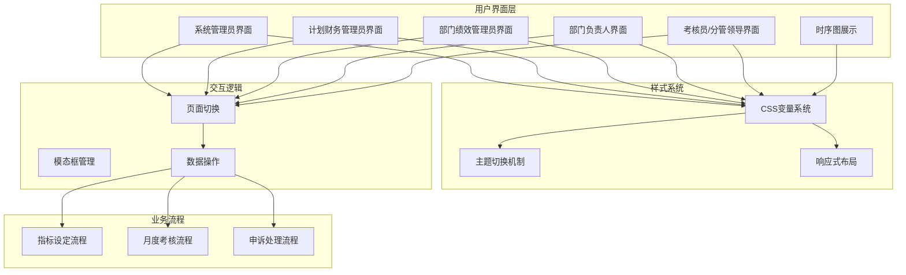
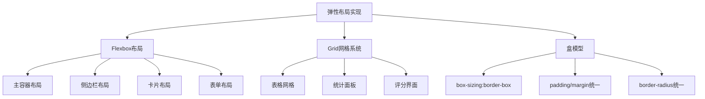
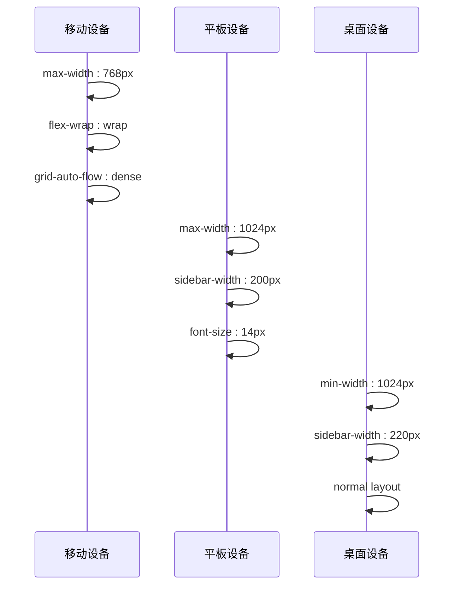
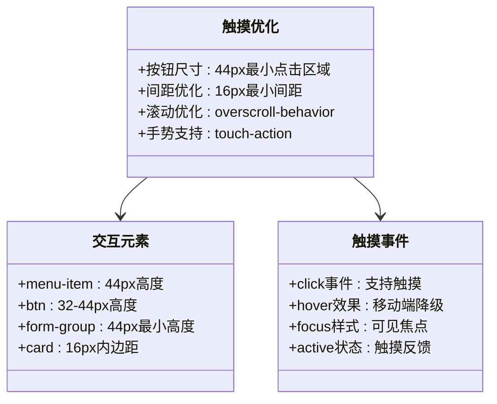
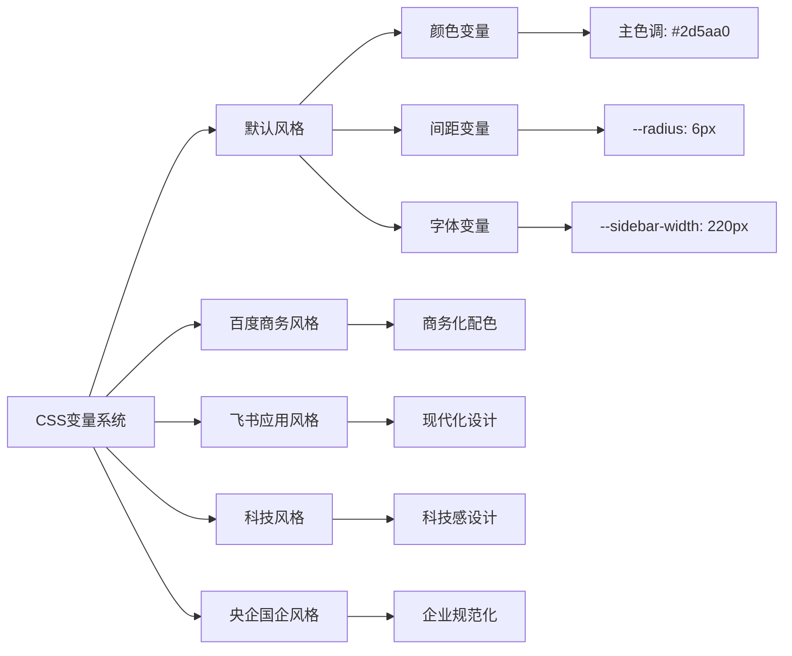
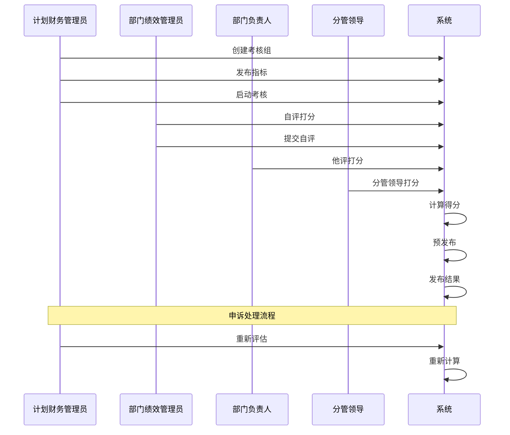
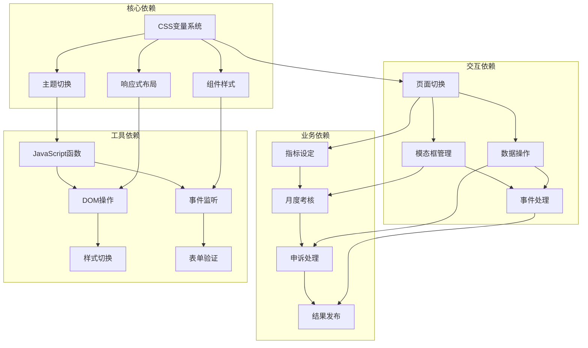

# 响应式设计实现

<cite>
**本文档引用的文件**
- [1-系统管理员原型-v1.html](file://月度业绩考核原型设计初稿/1-系统管理员原型-v1.html)
- [2-计划财务处业绩考核管理员原型-v1.html](file://月度业绩考核原型设计初稿/2-计划财务处业绩考核管理员原型-v1.html)
- [3-部门绩效管理员原型-v1.html](file://月度业绩考核原型设计初稿/3-部门绩效管理员原型-v1.html)
- [4-部门负责人原型-v1.html](file://月度业绩考核原型设计初稿/4-部门负责人原型-v1.html)
- [5-考核员分管领导原型-v1.html](file://月度业绩考核原型设计初稿/5-考核员分管领导原型-v1.html)
- [6-时序图-v1.html](file://月度业绩考核原型设计初稿/6-时序图-v1.html)
</cite>

## 目录
1. [引言](#引言)
2. [项目结构](#项目结构)
3. [核心组件](#核心组件)
4. [架构概览](#架构概览)
5. [详细组件分析](#详细组件分析)
6. [依赖关系分析](#依赖关系分析)
7. [性能考虑](#性能考虑)
8. [故障排除指南](#故障排除指南)
9. [结论](#结论)

## 引言

本项目是一个基于HTML/CSS/JavaScript的企业级月度业绩考核管理系统原型设计，包含了多个角色的界面原型和完整的业务流程时序图。该项目展示了现代Web应用的响应式设计实现，涵盖了移动端适配、多屏幕尺寸支持、弹性布局、网格系统、媒体查询策略等多个方面。

该项目采用纯前端技术栈，无需服务器端支持，所有功能都在客户端浏览器中实现。通过CSS变量系统实现了主题风格切换，支持四种不同的视觉风格（默认、百度商务、飞书应用、科技风、央企国企风格）。

## 项目结构

项目采用按角色划分的文件组织结构，每个角色都有独立的HTML原型文件：

**图表来源**
- [1-系统管理员原型-v1.html:1-635](file://月度业绩考核原型设计初稿/1-系统管理员原型-v1.html#L1-L635)
- [2-计划财务处业绩考核管理员原型-v1.html:1-1039](file://月度业绩考核原型设计初稿/2-计划财务处业绩考核管理员原型-v1.html#L1-L1039)
- [3-部门绩效管理员原型-v1.html:1-1663](file://月度业绩考核原型设计初稿/3-部门绩效管理员原型-v1.html#L1-L1663)
- [4-部门负责人原型-v1.html:1-1231](file://月度业绩考核原型设计初稿/4-部门负责人原型-v1.html#L1-L1231)
- [5-考核员分管领导原型-v1.html:1-1459](file://月度业绩考核原型设计初稿/5-考核员分管领导原型-v1.html#L1-L1459)
- [6-时序图-v1.html:1-570](file://月度业绩考核原型设计初稿/6-时序图-v1.html#L1-L570)

**章节来源**
- [1-系统管理员原型-v1.html:1-635](file://月度业绩考核原型设计初稿/1-系统管理员原型-v1.html#L1-L635)
- [2-计划财务处业绩考核管理员原型-v1.html:1-1039](file://月度业绩考核原型设计初稿/2-计划财务处业绩考核管理员原型-v1.html#L1-L1039)
- [3-部门绩效管理员原型-v1.html:1-1663](file://月度业绩考核原型设计初稿/3-部门绩效管理员原型-v1.html#L1-L1663)
- [4-部门负责人原型-v1.html:1-1231](file://月度业绩考核原型设计初稿/4-部门负责人原型-v1.html#L1-L1231)
- [5-考核员分管领导原型-v1.html:1-1459](file://月度业绩考核原型设计初稿/5-考核员分管领导原型-v1.html#L1-L1459)
- [6-时序图-v1.html:1-570](file://月度业绩考核原型设计初稿/6-时序图-v1.html#L1-L570)

## 核心组件

### CSS变量系统

项目采用了先进的CSS变量系统，实现了主题风格的动态切换。每个角色原型都包含完整的CSS变量定义，支持颜色、间距、字体大小等样式的统一管理。

**图表来源**
- [1-系统管理员原型-v1.html:8-35](file://月度业绩考核原型设计初稿/1-系统管理员原型-v1.html#L8-L35)
- [2-计划财务处业绩考核管理员原型-v1.html:9-42](file://月度业绩考核原型设计初稿/2-计划财务处业绩考核管理员原型-v1.html#L9-L42)
- [3-部门绩效管理员原型-v1.html:8-39](file://月度业绩考核原型设计初稿/3-部门绩效管理员原型-v1.html#L8-L39)

### 组件系统

项目实现了完整的UI组件系统，包括导航、卡片、表格、表单、模态框等常用组件：

**图表来源**
- [1-系统管理员原型-v1.html:189-279](file://月度业绩考核原型设计初稿/1-系统管理员原型-v1.html#L189-L279)
- [2-计划财务处业绩考核管理员原型-v1.html:224-313](file://月度业绩考核原型设计初稿/2-计划财务处业绩考核管理员原型-v1.html#L224-L313)
- [3-部门绩效管理员原型-v1.html:218-399](file://月度业绩考核原型设计初稿/3-部门绩效管理员原型-v1.html#L218-L399)

**章节来源**
- [1-系统管理员原型-v1.html:8-279](file://月度业绩考核原型设计初稿/1-系统管理员原型-v1.html#L8-L279)
- [2-计划财务处业绩考核管理员原型-v1.html:8-313](file://月度业绩考核原型设计初稿/2-计划财务处业绩考核管理员原型-v1.html#L8-L313)
- [3-部门绩效管理员原型-v1.html:8-399](file://月度业绩考核原型设计初稿/3-部门绩效管理员原型-v1.html#L8-L399)

## 架构概览

项目采用模块化的前端架构设计，每个角色都有独立的功能模块和界面原型：

**图表来源**
- [1-系统管理员原型-v1.html:612-632](file://月度业绩考核原型设计初稿/1-系统管理员原型-v1.html#L612-L632)
- [2-计划财务处业绩考核管理员原型-v1.html:612-727](file://月度业绩考核原型设计初稿/2-计划财务处业绩考核管理员原型-v1.html#L612-L727)
- [3-部门绩效管理员原型-v1.html:612-764](file://月度业绩考核原型设计初稿/3-部门绩效管理员原型-v1.html#L612-L764)
- [4-部门负责人原型-v1.html:340-662](file://月度业绩考核原型设计初稿/4-部门负责人原型-v1.html#L340-L662)
- [5-考核员分管领导原型-v1.html:194-513](file://月度业绩考核原型设计初稿/5-考核员分管领导原型-v1.html#L194-L513)

**章节来源**
- [6-时序图-v1.html:112-556](file://月度业绩考核原型设计初稿/6-时序图-v1.html#L112-L556)

## 详细组件分析

### 响应式布局实现

项目在所有原型文件中都实现了完整的响应式布局设计，主要体现在以下几个方面：

#### 弹性布局系统

**图表来源**
- [1-系统管理员原型-v1.html:188-202](file://月度业绩考核原型设计初稿/1-系统管理员原型-v1.html#L188-L202)
- [2-计划财务处业绩考核管理员原型-v1.html:223-236](file://月度业绩考核原型设计初稿/2-计划财务处业绩考核管理员原型-v1.html#L223-L236)
- [3-部门绩效管理员原型-v1.html:217-233](file://月度业绩考核原型设计初稿/3-部门绩效管理员原型-v1.html#L217-L233)

#### 媒体查询策略

项目采用了渐进增强的响应式设计策略，通过CSS媒体查询实现不同屏幕尺寸的适配：

**图表来源**
- [1-系统管理员原型-v1.html:34-35](file://月度业绩考核原型设计初稿/1-系统管理员原型-v1.html#L34-L35)
- [2-计划财务处业绩考核管理员原型-v1.html:41-42](file://月度业绩考核原型设计初稿/2-计划财务处业绩考核管理员原型-v1.html#L41-L42)
- [3-部门绩效管理员原型-v1.html:38-39](file://月度业绩考核原型设计初稿/3-部门绩效管理员原型-v1.html#L38-L39)

#### 触摸设备优化

项目针对触摸设备进行了专门的优化设计：

**图表来源**
- [1-系统管理员原型-v1.html:225-233](file://月度业绩考核原型设计初稿/1-系统管理员原型-v1.html#L225-L233)
- [2-计划财务处业绩考核管理员原型-v1.html:254-262](file://月度业绩考核原型设计初稿/2-计划财务处业绩考核管理员原型-v1.html#L254-L262)
- [3-部门绩效管理员原型-v1.html:255-269](file://月度业绩考核原型设计初稿/3-部门绩效管理员原型-v1.html#L255-L269)

### 主题风格系统

项目实现了完整的主题风格切换系统，支持四种不同的视觉风格：

**图表来源**
- [1-系统管理员原型-v1.html:8-149](file://月度业绩考核原型设计初稿/1-系统管理员原型-v1.html#L8-L149)
- [2-计划财务处业绩考核管理员原型-v1.html:9-184](file://月度业绩考核原型设计初稿/2-计划财务处业绩考核管理员原型-v1.html#L9-L184)
- [3-部门绩效管理员原型-v1.html:8-179](file://月度业绩考核原型设计初稿/3-部门绩效管理员原型-v1.html#L8-L179)

### 业务流程时序图

项目提供了完整的业务流程时序图，展示了月度业绩考核的完整生命周期：

**图表来源**
- [6-时序图-v1.html:307-556](file://月度业绩考核原型设计初稿/6-时序图-v1.html#L307-L556)

**章节来源**
- [1-系统管理员原型-v1.html:612-632](file://月度业绩考核原型设计初稿/1-系统管理员原型-v1.html#L612-L632)
- [2-计划财务处业绩考核管理员原型-v1.html:612-727](file://月度业绩考核原型设计初稿/2-计划财务处业绩考核管理员原型-v1.html#L612-L727)
- [3-部门绩效管理员原型-v1.html:612-764](file://月度业绩考核原型设计初稿/3-部门绩效管理员原型-v1.html#L612-L764)
- [4-部门负责人原型-v1.html:340-662](file://月度业绩考核原型设计初稿/4-部门负责人原型-v1.html#L340-L662)
- [5-考核员分管领导原型-v1.html:194-513](file://月度业绩考核原型设计初稿/5-考核员分管领导原型-v1.html#L194-L513)
- [6-时序图-v1.html:112-556](file://月度业绩考核原型设计初稿/6-时序图-v1.html#L112-L556)

## 依赖关系分析

项目采用松耦合的设计架构，各组件之间的依赖关系清晰明确：

**图表来源**
- [1-系统管理员原型-v1.html:612-632](file://月度业绩考核原型设计初稿/1-系统管理员原型-v1.html#L612-L632)
- [2-计划财务处业绩考核管理员原型-v1.html:612-727](file://月度业绩考核原型设计初稿/2-计划财务处业绩考核管理员原型-v1.html#L612-L727)
- [3-部门绩效管理员原型-v1.html:612-764](file://月度业绩考核原型设计初稿/3-部门绩效管理员原型-v1.html#L612-L764)

**章节来源**
- [1-系统管理员原型-v1.html:612-632](file://月度业绩考核原型设计初稿/1-系统管理员原型-v1.html#L612-L632)
- [2-计划财务处业绩考核管理员原型-v1.html:612-727](file://月度业绩考核原型设计初稿/2-计划财务处业绩考核管理员原型-v1.html#L612-L727)
- [3-部门绩效管理员原型-v1.html:612-764](file://月度业绩考核原型设计初稿/3-部门绩效管理员原型-v1.html#L612-L764)

## 性能考虑

项目在性能优化方面采用了多项策略：

### 样式优化

- **CSS变量缓存**: 通过CSS变量减少重复样式定义
- **选择器优化**: 使用高效的CSS选择器，避免深层嵌套
- **动画优化**: 使用transform和opacity属性实现硬件加速

### JavaScript优化

- **事件委托**: 使用事件委托减少事件处理器数量
- **懒加载**: 模态框按需加载，减少初始渲染负担
- **内存管理**: 及时清理事件监听器和DOM引用

### 资源优化

- **内联样式**: 关键样式内联，减少HTTP请求
- **无第三方依赖**: 完全自研，避免外部依赖带来的性能问题
- **轻量级脚本**: JavaScript代码简洁高效

## 故障排除指南

### 常见问题及解决方案

#### 主题切换失效

**问题描述**: 点击主题切换按钮后样式没有变化

**解决方案**:
1. 检查CSS变量定义是否正确
2. 确认switchStyle函数调用正常
3. 验证样式类名拼写错误

#### 响应式布局异常

**问题描述**: 在移动设备上布局错乱

**解决方案**:
1. 检查viewport meta标签配置
2. 验证媒体查询断点设置
3. 确认flexbox属性兼容性

#### 模态框显示问题

**问题描述**: 模态框无法正常显示或关闭

**解决方案**:
1. 检查overlay类名和显示状态
2. 验证事件监听器绑定
3. 确认z-index层级设置

**章节来源**
- [1-系统管理员原型-v1.html:614-619](file://月度业绩考核原型设计初稿/1-系统管理员原型-v1.html#L614-L619)
- [2-计划财务处业绩考核管理员原型-v1.html:612-612](file://月度业绩考核原型设计初稿/2-计划财务处业绩考核管理员原型-v1.html#L612-L612)
- [3-部门绩效管理员原型-v1.html:612-612](file://月度业绩考核原型设计初稿/3-部门绩效管理员原型-v1.html#L612-L612)

## 结论

本项目展示了现代Web应用响应式设计的完整实现方案，通过纯前端技术构建了功能完善的月度业绩考核管理系统原型。项目的主要特点包括：

### 技术亮点

1. **完整的响应式设计**: 实现了从移动端到桌面端的无缝适配
2. **灵活的主题系统**: 支持多种视觉风格的动态切换
3. **模块化的组件架构**: 清晰的组件分离和依赖关系
4. **完整的业务流程**: 覆盖了从指标设定到结果发布的全流程

### 最佳实践

1. **CSS变量系统**: 实现了样式的统一管理和动态切换
2. **渐进增强**: 采用移动优先的设计理念
3. **语义化HTML**: 使用语义化的HTML结构提高可访问性
4. **事件驱动**: 通过JavaScript实现丰富的交互体验

### 扩展建议

1. **性能监控**: 添加性能指标监控和优化
2. **无障碍支持**: 增加键盘导航和屏幕阅读器支持
3. **国际化**: 添加多语言支持功能
4. **离线支持**: 实现PWA特性支持离线使用

该项目为类似的企业管理系统的前端开发提供了优秀的参考模板，展示了如何在有限的资源下实现复杂业务场景的用户界面设计。