# 技术实现文档

<cite>
**本文档引用的文件**
- [1-系统管理员原型-v1.html](file://月度业绩考核原型设计初稿/1-系统管理员原型-v1.html)
- [2-计划财务处业绩考核管理员原型-v1.html](file://月度业绩考核原型设计初稿/2-计划财务处业绩考核管理员原型-v1.html)
- [3-部门绩效管理员原型-v1.html](file://月度业绩考核原型设计初稿/3-部门绩效管理员原型-v1.html)
- [4-部门负责人原型-v1.html](file://月度业绩考核原型设计初稿/4-部门负责人原型-v1.html)
- [5-考核员分管领导原型-v1.html](file://月度业绩考核原型设计初稿/5-考核员分管领导原型-v1.html)
- [6-时序图-v1.html](file://月度业绩考核原型设计初稿/6-时序图-v1.html)
</cite>

## 目录
1. [项目概述](#项目概述)
2. [项目结构](#项目结构)
3. [核心组件](#核心组件)
4. [架构概览](#架构概览)
5. [详细组件分析](#详细组件分析)
6. [依赖关系分析](#依赖关系分析)
7. [性能考虑](#性能考虑)
8. [故障排除指南](#故障排除指南)
9. [结论](#结论)
10. [附录](#附录)

## 项目概述

月度业绩考核管理系统是一个基于HTML5、CSS3和JavaScript的前端管理系统原型设计。该项目采用主题化设计理念，提供了5种不同的视觉风格，支持动态主题切换和组件化UI设计。

### 主要特性

- **主题系统设计**：基于CSS变量的动态主题切换机制
- **组件化架构**：模块化的UI组件设计
- **响应式布局**：适配不同屏幕尺寸的布局系统
- **权限控制**：基于角色的访问控制模型
- **状态管理**：页面状态和用户交互的状态管理

## 项目结构

项目采用按角色分离的文件组织结构，每个角色都有独立的原型文件：

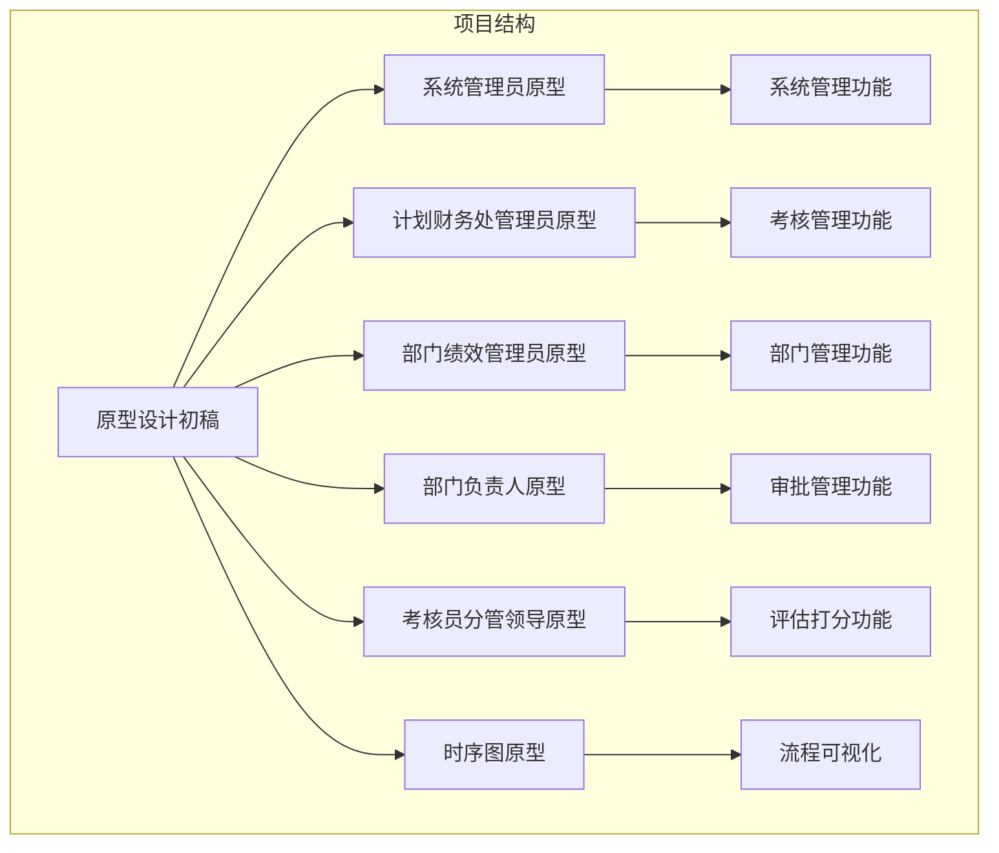

**图表来源**
- [1-系统管理员原型-v1.html:1-635](file://月度业绩考核原型设计初稿/1-系统管理员原型-v1.html#L1-L635)
- [2-计划财务处业绩考核管理员原型-v1.html:1-1039](file://月度业绩考核原型设计初稿/2-计划财务处业绩考核管理员原型-v1.html#L1-L1039)

**章节来源**
- [1-系统管理员原型-v1.html:1-635](file://月度业绩考核原型设计初稿/1-系统管理员原型-v1.html#L1-L635)
- [2-计划财务处业绩考核管理员原型-v1.html:1-1039](file://月度业绩考核原型设计初稿/2-计划财务处业绩考核管理员原型-v1.html#L1-L1039)

## 核心组件

### 主题系统架构

系统实现了基于CSS变量的主题切换机制，支持5种不同的视觉风格：

#### CSS变量定义结构

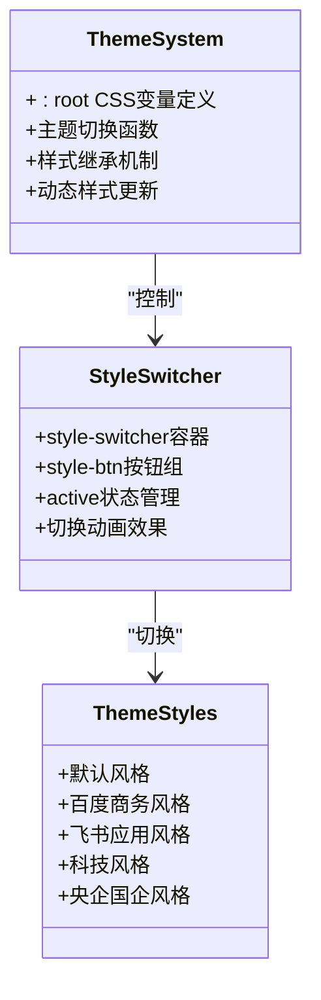

**图表来源**
- [1-系统管理员原型-v1.html:8-35](file://月度业绩考核原型设计初稿/1-系统管理员原型-v1.html#L8-L35)
- [1-系统管理员原型-v1.html:37-185](file://月度业绩考核原型设计初稿/1-系统管理员原型-v1.html#L37-L185)

#### 主题切换实现机制

主题切换通过JavaScript动态操作DOM类名实现：

```javascript
function switchStyle(styleClass) {
    // 移除现有主题类
    document.body.classList.remove('style-baidu', 'style-feishu', 'style-tech', 'style-guoqi');
    
    // 应用新主题
    if (styleClass) document.body.classList.add(styleClass);
    
    // 更新按钮状态
    document.querySelectorAll('.style-btn').forEach(btn => btn.classList.remove('active'));
    event.currentTarget.classList.add('active');
}
```

**章节来源**
- [1-系统管理员原型-v1.html:613-619](file://月度业绩考核原型设计初稿/1-系统管理员原型-v1.html#L613-L619)

### 组件化UI设计

系统采用模块化的组件设计，主要组件包括：

#### 导航组件

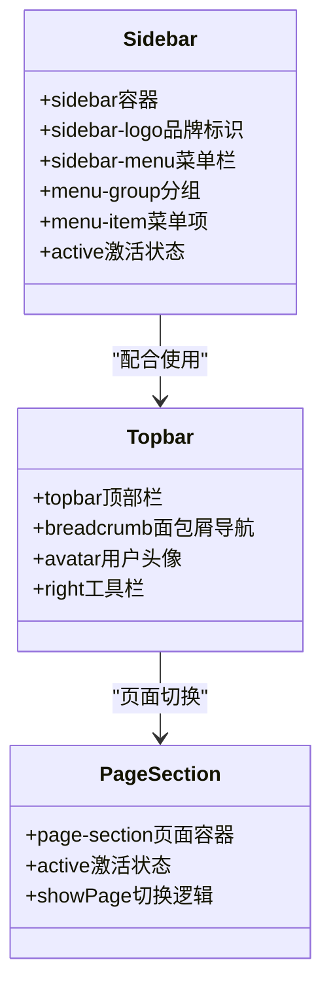

**图表来源**
- [1-系统管理员原型-v1.html:291-316](file://月度业绩考核原型设计初稿/1-系统管理员原型-v1.html#L291-L316)
- [1-系统管理员原型-v1.html:318-326](file://月度业绩考核原型设计初稿/1-系统管理员原型-v1.html#L318-L326)

#### 表单组件

系统实现了多种表单组件，包括搜索表单、模态框、标签等：

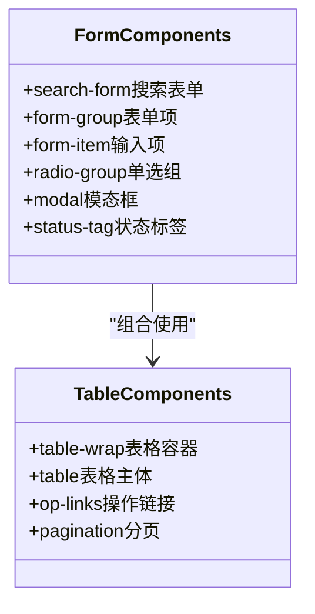

**图表来源**
- [1-系统管理员原型-v1.html:218-279](file://月度业绩考核原型设计初稿/1-系统管理员原型-v1.html#L218-L279)
- [1-系统管理员原型-v1.html:234-248](file://月度业绩考核原型设计初稿/1-系统管理员原型-v1.html#L234-L248)

**章节来源**
- [1-系统管理员原型-v1.html:218-279](file://月度业绩考核原型设计初稿/1-系统管理员原型-v1.html#L218-L279)

## 架构概览

系统采用前后端分离的架构设计，前端使用纯HTML5、CSS3和JavaScript实现，后端通过API接口提供数据支持。

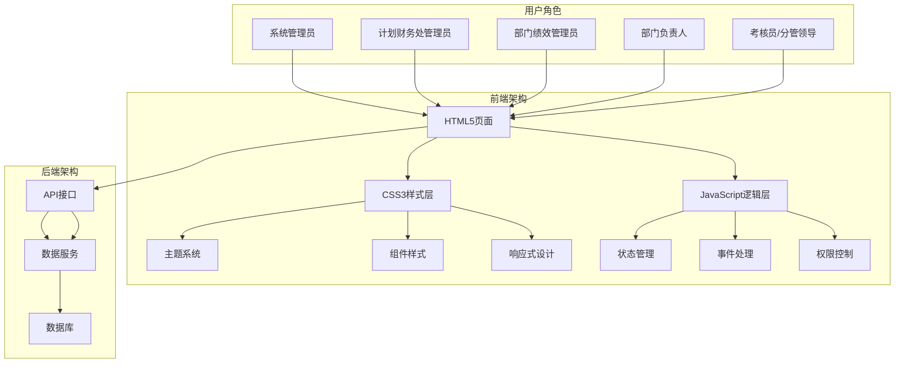

**图表来源**
- [1-系统管理员原型-v1.html:1-635](file://月度业绩考核原型设计初稿/1-系统管理员原型-v1.html#L1-L635)
- [2-计划财务处业绩考核管理员原型-v1.html:1-1039](file://月度业绩考核原型设计初稿/2-计划财务处业绩考核管理员原型-v1.html#L1-L1039)

## 详细组件分析

### 系统管理员组件分析

系统管理员拥有最高权限，可以管理整个系统的各个方面。

#### 核心功能模块

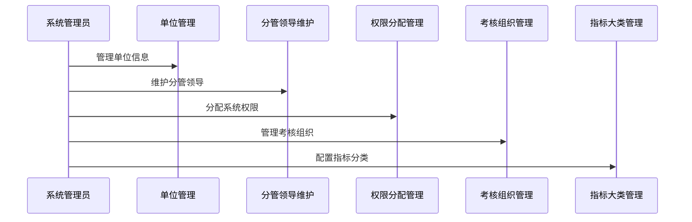

**图表来源**
- [1-系统管理员原型-v1.html:329-482](file://月度业绩考核原型设计初稿/1-系统管理员原型-v1.html#L329-L482)

#### 权限控制实现

系统采用基于角色的权限控制模型（RBAC）：

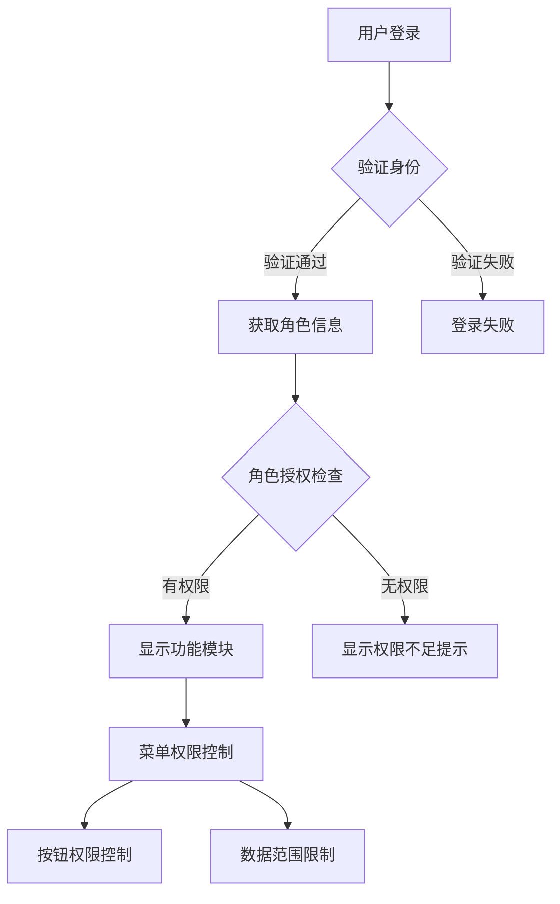

**图表来源**
- [1-系统管理员原型-v1.html:390-414](file://月度业绩考核原型设计初稿/1-系统管理员原型-v1.html#L390-L414)

**章节来源**
- [1-系统管理员原型-v1.html:329-482](file://月度业绩考核原型设计初稿/1-系统管理员原型-v1.html#L329-L482)

### 计划财务处管理员组件分析

计划财务处管理员负责整个考核流程的管理和监督。

#### 考核管理流程

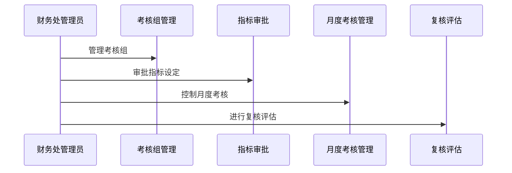

**图表来源**
- [2-计划财务处业绩考核管理员原型-v1.html:353-653](file://月度业绩考核原型设计初稿/2-计划财务处业绩考核管理员原型-v1.html#L353-L653)

#### 状态管理机制

系统实现了完整的状态管理机制，支持复杂的业务流程：

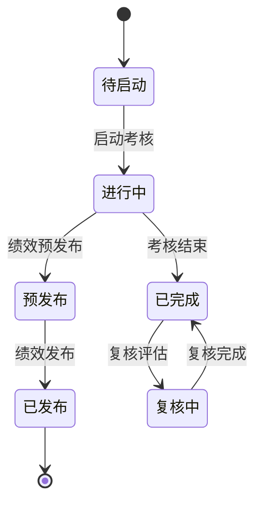

**图表来源**
- [2-计划财务处业绩考核管理员原型-v1.html:372-423](file://月度业绩考核原型设计初稿/2-计划财务处业绩考核管理员原型-v1.html#L372-L423)

**章节来源**
- [2-计划财务处业绩考核管理员原型-v1.html:353-653](file://月度业绩考核原型设计初稿/2-计划财务处业绩考核管理员原型-v1.html#L353-L653)

### 部门绩效管理员组件分析

部门绩效管理员负责本部门的日常考核管理工作。

#### 指标设定流程

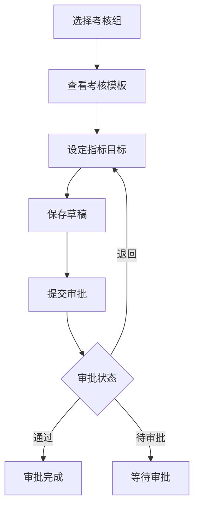

**图表来源**
- [3-部门绩效管理员原型-v1.html:446-522](file://月度业绩考核原型设计初稿/3-部门绩效管理员原型-v1.html#L446-L522)

#### 自评打分功能

部门绩效管理员可以进行月度自评打分：

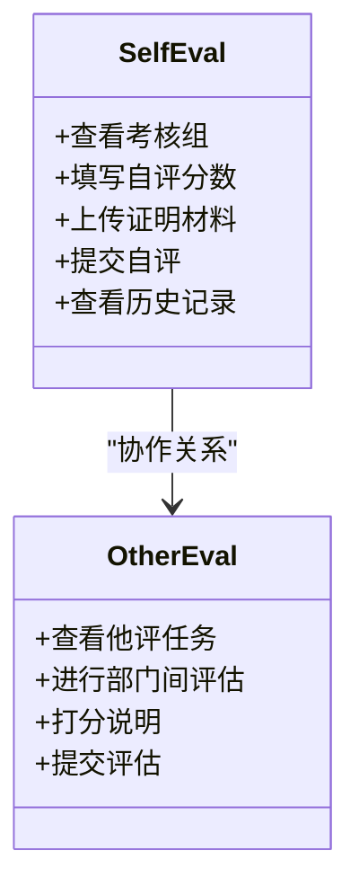

**图表来源**
- [3-部门绩效管理员原型-v1.html:525-652](file://月度业绩考核原型设计初稿/3-部门绩效管理员原型-v1.html#L525-L652)

**章节来源**
- [3-部门绩效管理员原型-v1.html:446-652](file://月度业绩考核原型设计初稿/3-部门绩效管理员原型-v1.html#L446-L652)

### 部门负责人组件分析

部门负责人负责审批下级部门的考核指标和结果。

#### 审批管理流程

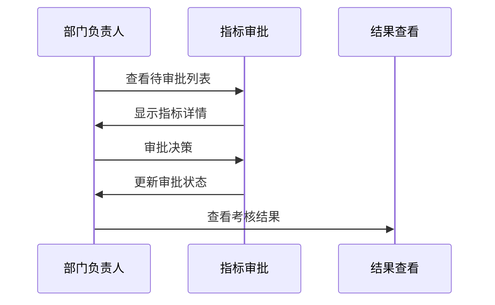

**图表来源**
- [4-部门负责人原型-v1.html:380-538](file://月度业绩考核原型设计初稿/4-部门负责人原型-v1.html#L380-L538)

#### 状态标签系统

系统实现了丰富的状态标签系统：

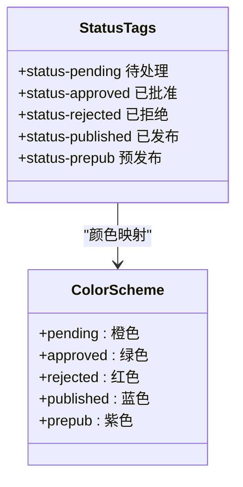

**图表来源**
- [4-部门负责人原型-v1.html:259-265](file://月度业绩考核原型设计初稿/4-部门负责人原型-v1.html#L259-L265)

**章节来源**
- [4-部门负责人原型-v1.html:380-538](file://月度业绩考核原型设计初稿/4-部门负责人原型-v1.html#L380-L538)

### 考核员/分管领导组件分析

考核员和分管领导负责具体的评估打分工作。

#### 评估打分系统

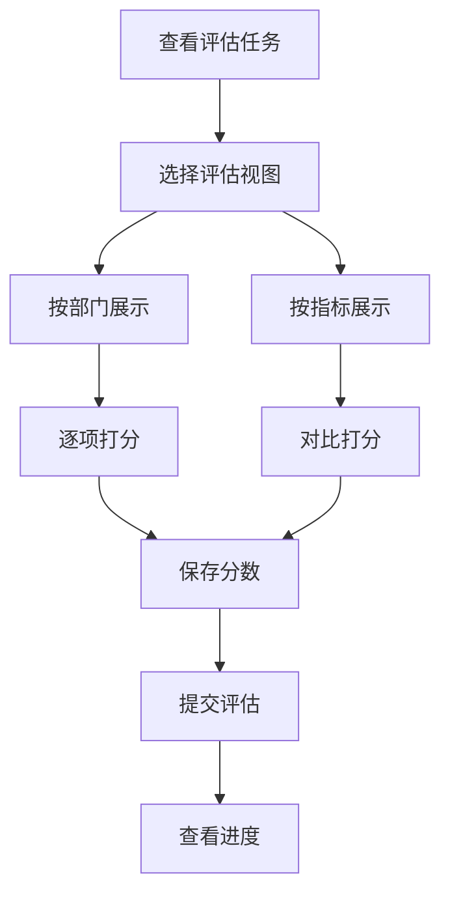

**图表来源**
- [5-考核员分管领导原型-v1.html:345-513](file://月度业绩考核原型设计初稿/5-考核员分管领导原型-v1.html#L345-L513)

#### 打分界面设计

系统提供了灵活的打分界面：

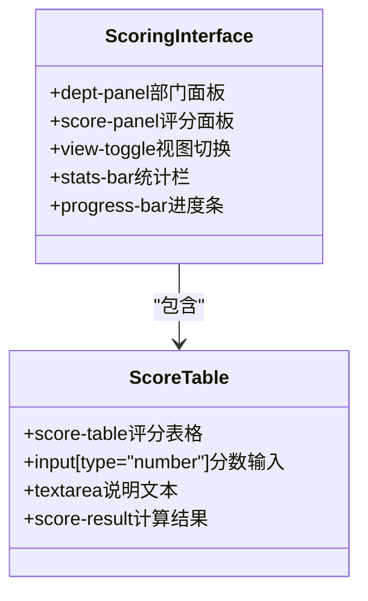

**图表来源**
- [5-考核员分管领导原型-v1.html:118-174](file://月度业绩考核原型设计初稿/5-考核员分管领导原型-v1.html#L118-L174)

**章节来源**
- [5-考核员分管领导原型-v1.html:345-513](file://月度业绩考核原型设计初稿/5-考核员分管领导原型-v1.html#L345-L513)

## 依赖关系分析

系统采用松耦合的组件设计，各组件之间通过事件和状态进行通信。

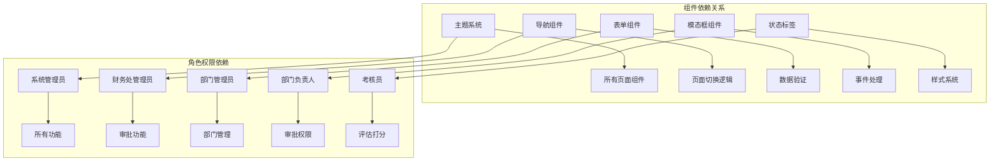

**图表来源**
- [1-系统管理员原型-v1.html:612-632](file://月度业绩考核原型设计初稿/1-系统管理员原型-v1.html#L612-L632)
- [2-计划财务处业绩考核管理员原型-v1.html:664-800](file://月度业绩考核原型设计初稿/2-计划财务处业绩考核管理员原型-v1.html#L664-L800)

**章节来源**
- [1-系统管理员原型-v1.html:612-632](file://月度业绩考核原型设计初稿/1-系统管理员原型-v1.html#L612-L632)
- [2-计划财务处业绩考核管理员原型-v1.html:664-800](file://月度业绩考核原型设计初稿/2-计划财务处业绩考核管理员原型-v1.html#L664-L800)

## 性能考虑

### 响应式设计优化

系统采用了多层次的响应式设计策略：

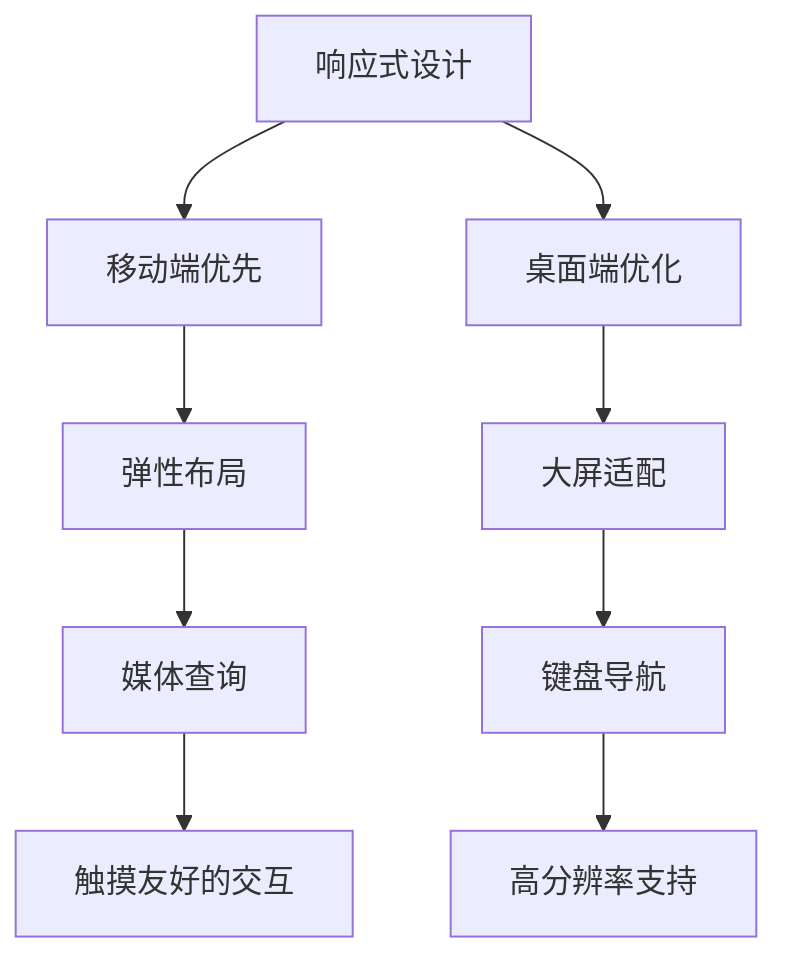

### 性能优化策略

1. **CSS变量优化**：使用CSS变量减少样式重复定义
2. **事件委托**：使用事件委托减少事件监听器数量
3. **懒加载**：模态框按需加载
4. **缓存策略**：本地存储用户偏好设置

### 浏览器兼容性

系统支持主流现代浏览器，采用渐进增强的设计理念：

- **Chrome**: 完全支持
- **Firefox**: 完全支持  
- **Safari**: 基本支持
- **Edge**: 完全支持
- **IE11**: 部分支持（降级处理）

## 故障排除指南

### 常见问题诊断

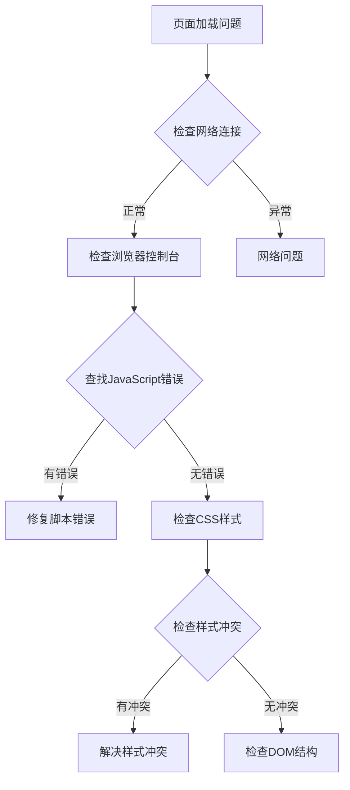

### 调试技巧

1. **开发者工具使用**：利用浏览器开发者工具调试
2. **日志记录**：在关键位置添加console.log
3. **错误边界**：使用try-catch捕获异常
4. **性能监控**：使用Performance面板分析性能

**章节来源**
- [1-系统管理员原型-v1.html:612-632](file://月度业绩考核原型设计初稿/1-系统管理员原型-v1.html#L612-L632)

## 结论

月度业绩考核管理系统原型设计展现了现代前端开发的最佳实践。系统通过主题化设计、组件化架构、响应式布局和权限控制等技术手段，构建了一个功能完善、用户体验优秀的管理平台。

### 技术亮点

1. **主题系统创新**：基于CSS变量的动态主题切换机制
2. **组件化设计**：模块化的UI组件设计，便于维护和扩展
3. **权限控制完善**：基于RBAC的细粒度权限管理
4. **响应式布局**：适配多终端的布局系统
5. **状态管理清晰**：明确的业务流程状态管理

### 改进建议

1. **状态持久化**：增加本地存储功能
2. **国际化支持**：添加多语言支持
3. **无障碍访问**：提升无障碍访问能力
4. **测试覆盖**：增加单元测试和集成测试
5. **性能监控**：添加性能监控和分析

## 附录

### 代码结构规范

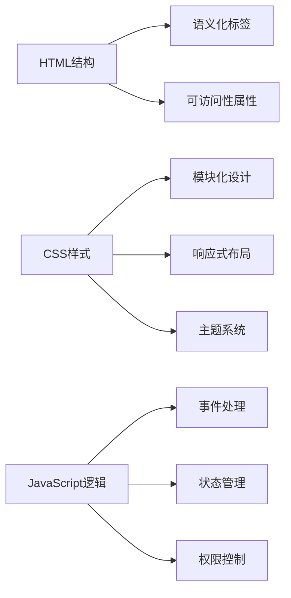

### 最佳实践清单

1. **代码组织**：保持代码结构清晰，注释完整
2. **性能优化**：关注加载速度和运行效率
3. **用户体验**：注重交互流畅性和反馈及时性
4. **安全性**：确保数据传输和存储的安全性
5. **可维护性**：编写易于理解和修改的代码