# 权限控制系统

<cite>
**本文档引用的文件**
- [系统管理员原型-v1.html](file://月度业绩考核原型设计初稿/1-系统管理员原型-v1.html)
- [计划财务处业绩考核管理员原型-v1.html](file://月度业绩考核原型设计初稿/2-计划财务处业绩考核管理员原型-v1.html)
- [部门绩效管理员原型-v1.html](file://月度业绩考核原型设计初稿/3-部门绩效管理员原型-v1.html)
- [部门负责人原型-v1.html](file://月度业绩考核原型设计初稿/4-部门负责人原型-v1.html)
- [考核员分管领导原型-v1.html](file://月度业绩考核原型设计初稿/5-考核员分管领导原型-v1.html)
- [时序图-v1.html](file://月度业绩考核原型设计初稿/6-时序图-v1.html)
</cite>

## 目录
1. [引言](#引言)
2. [项目结构](#项目结构)
3. [核心组件](#核心组件)
4. [架构概览](#架构概览)
5. [详细组件分析](#详细组件分析)
6. [依赖关系分析](#依赖关系分析)
7. [性能考虑](#性能考虑)
8. [故障排除指南](#故障排除指南)
9. [结论](#结论)
10. [附录](#附录)

## 引言

本文件针对月度业绩考核系统的权限控制体系进行全面的技术文档化分析。该系统采用基于角色的访问控制（RBAC）模型，通过不同角色的权限分配实现精细化的系统访问控制。系统包含多个角色层次，从系统管理员到普通考核员，每个角色都具有明确的权限边界和数据范围限制。

该权限控制系统的核心特点包括：
- 多层级角色架构：系统管理员、计划财务处管理员、部门管理员、部门负责人、考核员/分管领导
- 数据范围控制：按单位、部门、考核组等维度进行数据隔离
- 菜单权限控制：根据角色动态显示可访问的功能模块
- 流程权限控制：基于业务流程的状态流转控制
- 页面元素级权限：按钮、表格列、输入框等细粒度权限控制

## 项目结构

该项目采用原型设计的方式，通过HTML文件展示不同角色的界面和权限控制效果：

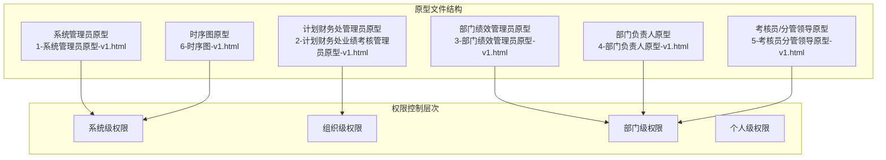

**图表来源**
- [系统管理员原型-v1.html:291-316](file://月度业绩考核原型设计初稿/1-系统管理员原型-v1.html#L291-L316)
- [计划财务处业绩考核管理员原型-v1.html:324-344](file://月度业绩考核原型设计初稿/2-计划财务处业绩考核管理员原型-v1.html#L324-L344)

**章节来源**
- [系统管理员原型-v1.html:1-635](file://月度业绩考核原型设计初稿/1-系统管理员原型-v1.html#L1-L635)
- [计划财务处业绩考核管理员原型-v1.html:1-1039](file://月度业绩考核原型设计初稿/2-计划财务处业绩考核管理员原型-v1.html#L1-L1039)

## 核心组件

### 角色定义体系

系统采用多层级角色架构，每个角色都有明确的职责边界和权限范围：

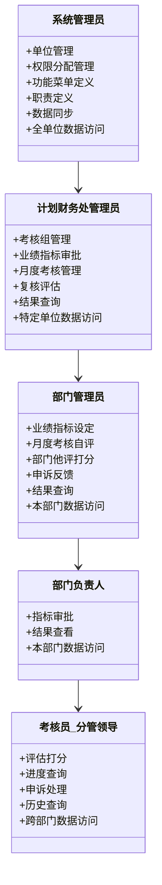

**图表来源**
- [系统管理员原型-v1.html:291-316](file://月度业绩考核原型设计初稿/1-系统管理员原型-v1.html#L291-L316)
- [计划财务处业绩考核管理员原型-v1.html:324-344](file://月度业绩考核原型设计初稿/2-计划财务处业绩考核管理员原型-v1.html#L324-L344)
- [部门绩效管理员原型-v1.html:411-430](file://月度业绩考核原型设计初稿/3-部门绩效管理员原型-v1.html#L411-L430)

### 权限分配机制

权限分配采用"角色-权限-资源"的三层映射关系：

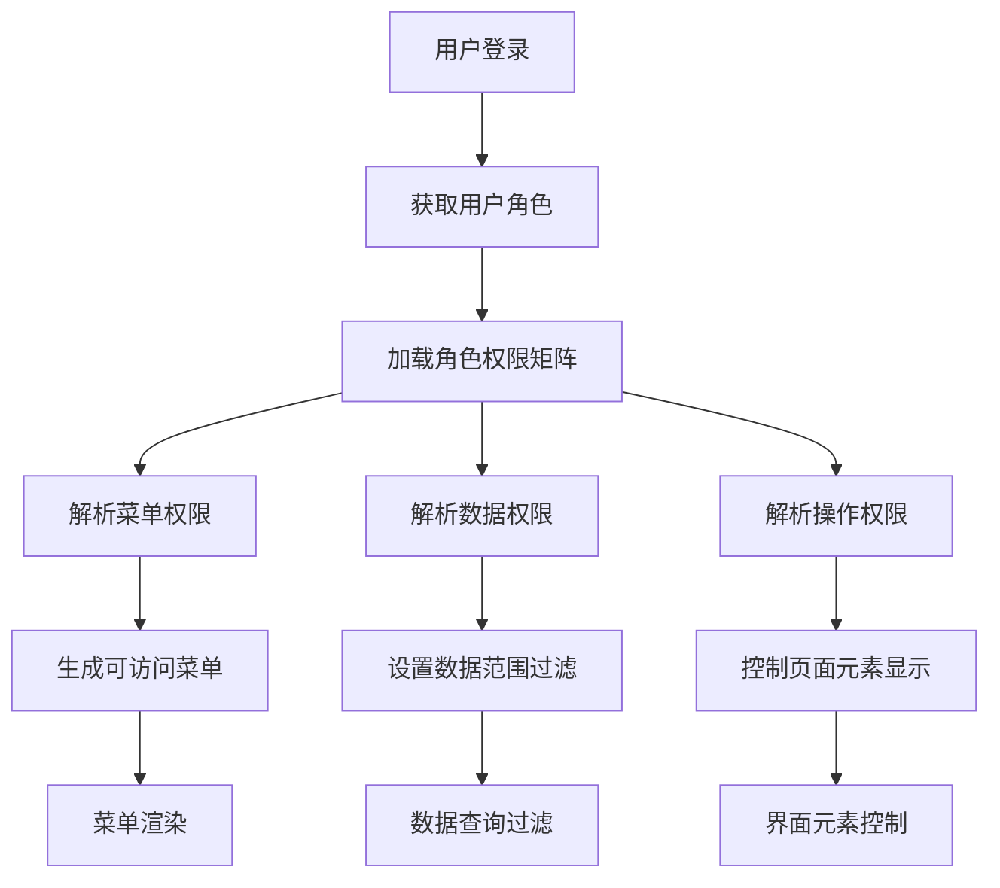

**图表来源**
- [系统管理员原型-v1.html:612-632](file://月度业绩考核原型设计初稿/1-系统管理员原型-v1.html#L612-L632)
- [部门负责人原型-v1.html:350-366](file://月度业绩考核原型设计初稿/4-部门负责人原型-v1.html#L350-L366)

**章节来源**
- [系统管理员原型-v1.html:389-415](file://月度业绩考核原型设计初稿/1-系统管理员原型-v1.html#L389-L415)
- [部门绩效管理员原型-v1.html:445-523](file://月度业绩考核原型设计初稿/3-部门绩效管理员原型-v1.html#L445-L523)

## 架构概览

### RBAC模型实现

系统采用经典的RBAC（Role-Based Access Control）模型，通过以下核心组件实现权限控制：

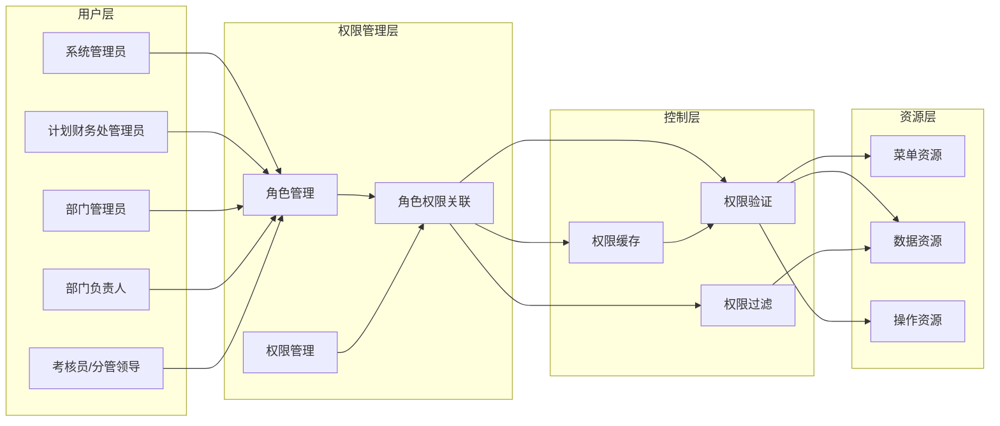

**图表来源**
- [系统管理员原型-v1.html:389-415](file://月度业绩考核原型设计初稿/1-系统管理员原型-v1.html#L389-L415)
- [计划财务处业绩考核管理员原型-v1.html:356-366](file://月度业绩考核原型设计初稿/2-计划财务处业绩考核管理员原型-v1.html#L356-L366)

### 权限验证流程

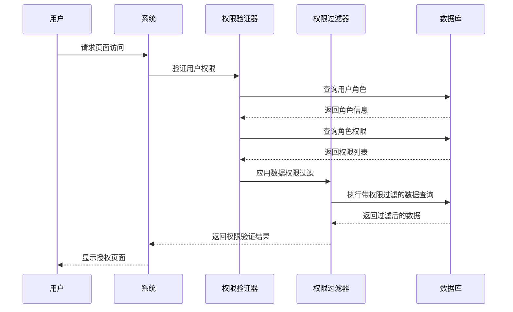

**图表来源**
- [系统管理员原型-v1.html:612-632](file://月度业绩考核原型设计初稿/1-系统管理员原型-v1.html#L612-L632)
- [部门绩效管理员原型-v1.html:445-523](file://月度业绩考核原型设计初稿/3-部门绩效管理员原型-v1.html#L445-L523)

**章节来源**
- [时序图-v1.html:111-298](file://月度业绩考核原型设计初稿/6-时序图-v1.html#L111-L298)

## 详细组件分析

### 菜单权限控制系统

#### 菜单权限验证机制

系统通过JavaScript实现动态菜单权限控制，主要实现逻辑如下：

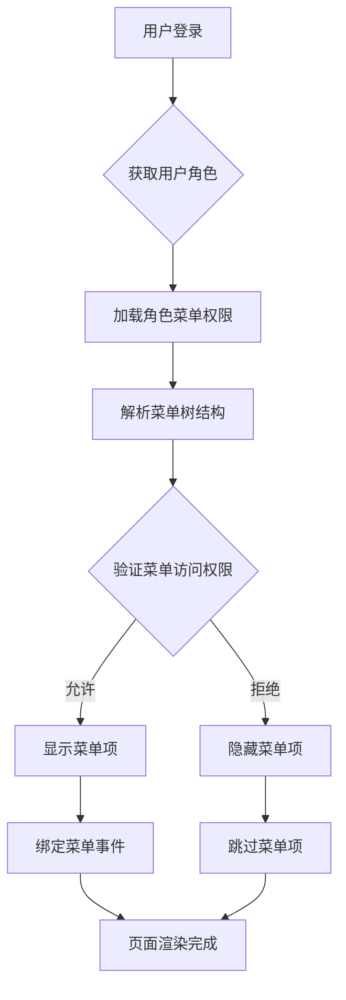

**图表来源**
- [系统管理员原型-v1.html:612-632](file://月度业绩考核原型设计初稿/1-系统管理员原型-v1.html#L612-L632)

#### 菜单权限配置

不同角色的菜单权限配置：

| 角色 | 可访问菜单 | 权限级别 |
|------|------------|----------|
| 系统管理员 | 系统设置、考核配置、系统运维 | 最高权限 |
| 计划财务处管理员 | 考核管理、结果管理 | 高权限 |
| 部门管理员 | 考核管理、反馈查询 | 中权限 |
| 部门负责人 | 审批管理、结果查看 | 中权限 |
| 考核员/分管领导 | 评估打分、进度查询、申诉处理 | 低权限 |

**章节来源**
- [系统管理员原型-v1.html:297-316](file://月度业绩考核原型设计初稿/1-系统管理员原型-v1.html#L297-L316)
- [计划财务处业绩考核管理员原型-v1.html:356-366](file://月度业绩考核原型设计初稿/2-计划财务处业绩考核管理员原型-v1.html#L356-L366)

### 数据范围控制

#### 数据权限层次结构

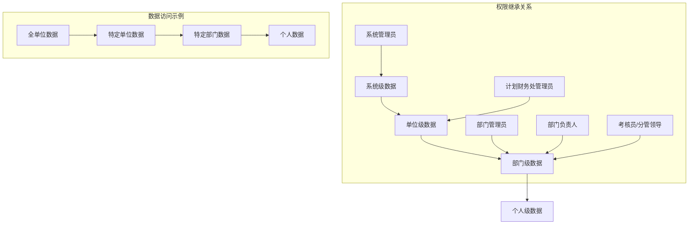

**图表来源**
- [系统管理员原型-v1.html:389-415](file://月度业绩考核原型设计初稿/1-系统管理员原型-v1.html#L389-L415)
- [计划财务处业绩考核管理员原型-v1.html:417-430](file://月度业绩考核原型设计初稿/2-计划财务处业绩考核管理员原型-v1.html#L417-L430)

#### 数据权限实现机制

数据范围控制通过以下方式实现：

1. **查询参数过滤**：在数据查询时自动添加用户权限范围的过滤条件
2. **界面元素控制**：根据数据权限动态显示或隐藏相关界面元素
3. **操作按钮控制**：根据数据权限控制按钮的可用性

**章节来源**
- [部门绩效管理员原型-v1.html:445-523](file://月度业绩考核原型设计初稿/3-部门绩效管理员原型-v1.html#L445-L523)
- [部门负责人原型-v1.html:356-366](file://月度业绩考核原型设计初稿/4-部门负责人原型-v1.html#L356-L366)

### 页面元素级权限控制

#### 细粒度权限控制

系统实现了页面元素级的权限控制，包括：

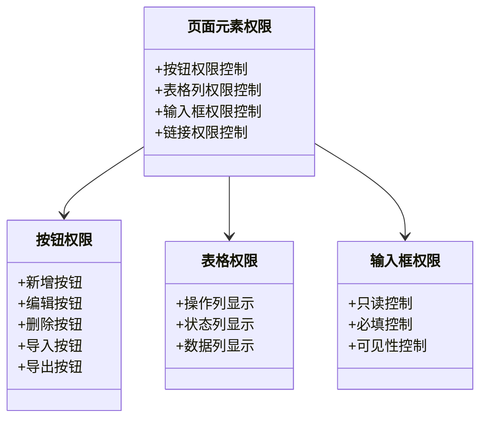

**图表来源**
- [系统管理员原型-v1.html:218-278](file://月度业绩考核原型设计初稿/1-系统管理员原型-v1.html#L218-L278)
- [部门绩效管理员原型-v1.html:254-296](file://月度业绩考核原型设计初稿/3-部门绩效管理员原型-v1.html#L254-L296)

#### 权限控制实现策略

1. **CSS类控制**：通过动态添加或移除CSS类实现元素的显示/隐藏
2. **属性控制**：通过禁用或启用HTML属性控制元素状态
3. **事件绑定控制**：根据权限动态绑定或解绑事件处理器

**章节来源**
- [系统管理员原型-v1.html:612-632](file://月度业绩考核原型设计初稿/1-系统管理员原型-v1.html#L612-L632)
- [计划财务处业绩考核管理员原型-v1.html:664-727](file://月度业绩考核原型设计初稿/2-计划财务处业绩考核管理员原型-v1.html#L664-L727)

### 权限验证执行流程

#### 权限验证序列图

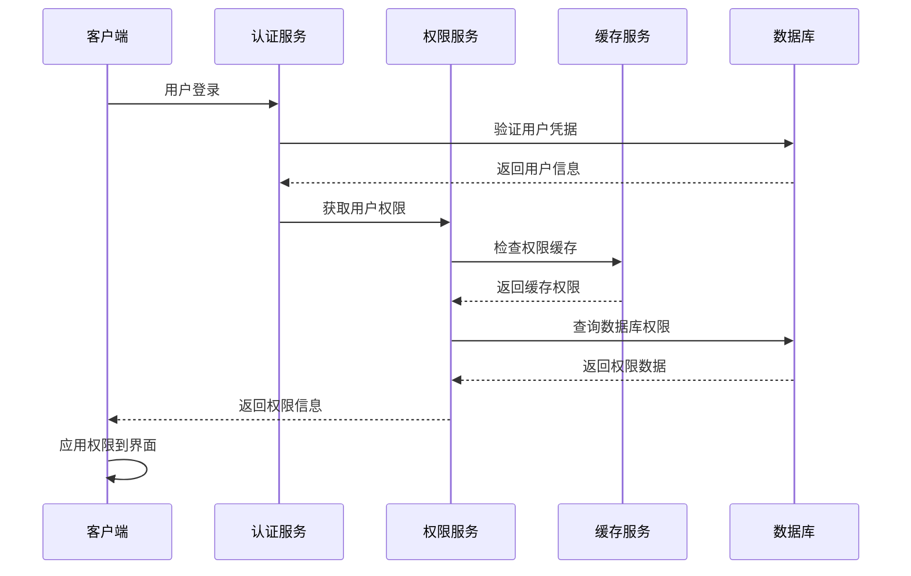

**图表来源**
- [系统管理员原型-v1.html:612-632](file://月度业绩考核原型设计初稿/1-系统管理员原型-v1.html#L612-L632)

#### 权限验证拦截机制

系统采用多层次的权限验证拦截机制：

1. **路由级拦截**：在页面导航前验证访问权限
2. **组件级拦截**：在组件渲染前验证数据访问权限
3. **操作级拦截**：在用户执行具体操作前验证操作权限

**章节来源**
- [时序图-v1.html:111-298](file://月度业绩考核原型设计初稿/6-时序图-v1.html#L111-L298)

## 依赖关系分析

### 角色权限依赖关系

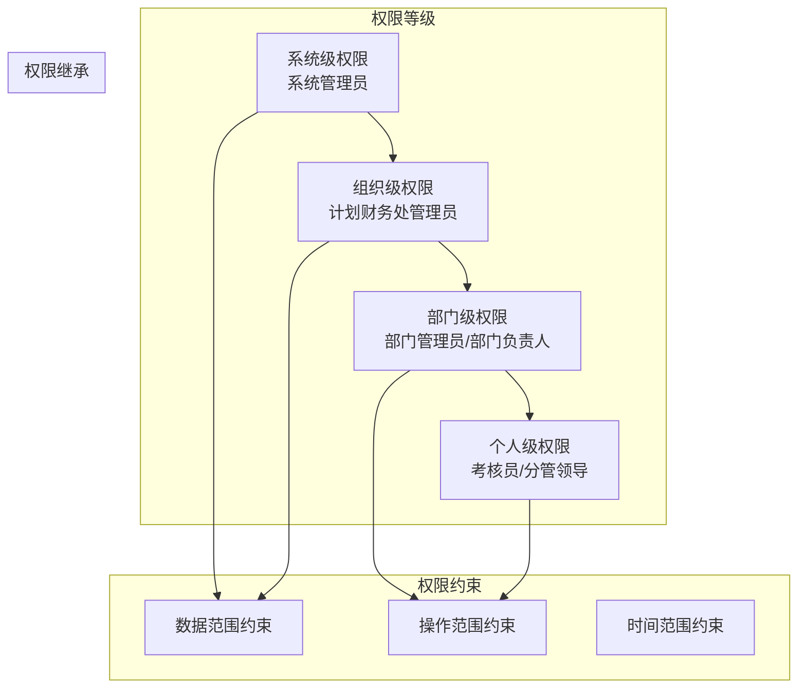

**图表来源**
- [系统管理员原型-v1.html:389-415](file://月度业绩考核原型设计初稿/1-系统管理员原型-v1.html#L389-L415)
- [部门负责人原型-v1.html:356-366](file://月度业绩考核原型设计初稿/4-部门负责人原型-v1.html#L356-L366)

### 权限配置依赖

权限配置之间存在复杂的依赖关系：

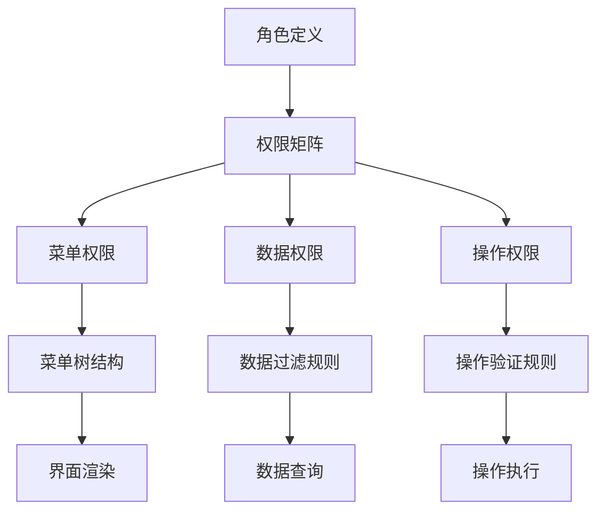

**图表来源**
- [系统管理员原型-v1.html:389-415](file://月度业绩考核原型设计初稿/1-系统管理员原型-v1.html#L389-L415)
- [部门绩效管理员原型-v1.html:445-523](file://月度业绩考核原型设计初稿/3-部门绩效管理员原型-v1.html#L445-L523)

**章节来源**
- [系统管理员原型-v1.html:389-415](file://月度业绩考核原型设计初稿/1-系统管理员原型-v1.html#L389-L415)
- [计划财务处业绩考核管理员原型-v1.html:356-366](file://月度业绩考核原型设计初稿/2-计划财务处业绩考核管理员原型-v1.html#L356-L366)

## 性能考虑

### 权限缓存策略

为了提高权限验证性能，建议采用以下缓存策略：

1. **用户权限缓存**：将用户的完整权限集缓存到会话存储中
2. **权限矩阵缓存**：缓存角色-权限映射关系
3. **菜单权限缓存**：缓存已解析的菜单权限结构

### 权限验证优化

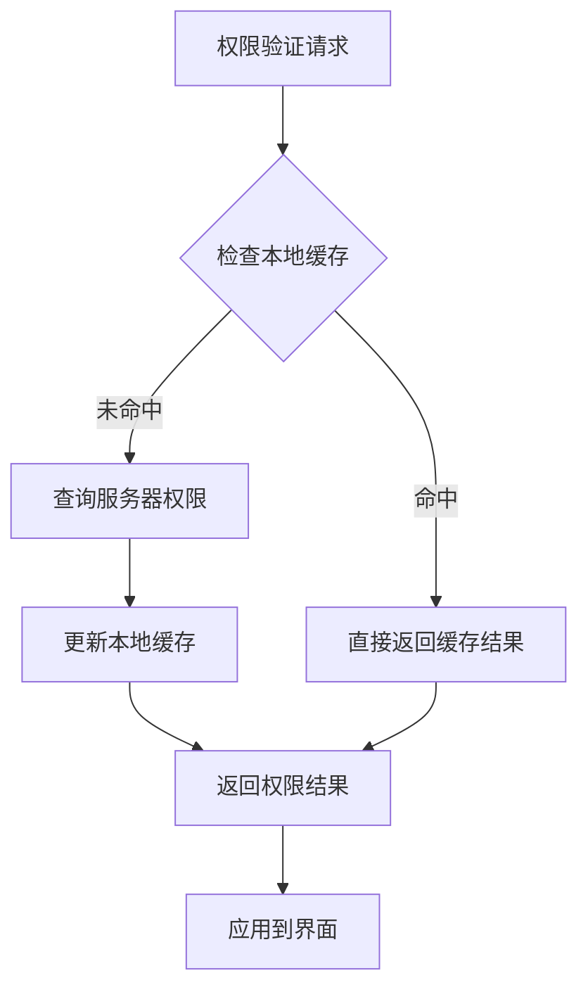

### 性能监控指标

- 权限验证响应时间
- 权限缓存命中率
- 内存使用情况
- 数据库查询负载

## 故障排除指南

### 常见权限问题

#### 菜单显示异常

**问题现象**：某些菜单项无法显示或显示不正确

**可能原因**：
1. 用户角色配置错误
2. 权限矩阵配置缺失
3. JavaScript权限验证逻辑错误

**解决步骤**：
1. 检查用户角色分配
2. 验证权限矩阵完整性
3. 检查JavaScript控制台错误
4. 清除浏览器缓存重新登录

#### 数据访问受限

**问题现象**：用户无法访问预期的数据

**可能原因**：
1. 数据范围权限配置错误
2. 查询过滤条件设置不当
3. 缓存数据过期

**解决步骤**：
1. 验证用户数据权限范围
2. 检查数据过滤逻辑
3. 更新权限缓存
4. 重新加载页面

#### 操作按钮不可用

**问题现象**：关键操作按钮显示为灰色不可用

**可能原因**：
1. 操作权限未正确配置
2. 页面元素权限控制逻辑错误
3. 权限验证失败

**解决步骤**：
1. 检查操作权限配置
2. 验证页面元素权限控制
3. 重新加载权限配置
4. 检查网络请求状态

**章节来源**
- [系统管理员原型-v1.html:612-632](file://月度业绩考核原型设计初稿/1-系统管理员原型-v1.html#L612-L632)
- [部门负责人原型-v1.html:356-366](file://月度业绩考核原型设计初稿/4-部门负责人原型-v1.html#L356-L366)

## 结论

本权限控制系统通过RBAC模型实现了多层次、细粒度的权限控制。系统的主要优势包括：

1. **清晰的角色层次**：从系统管理员到普通用户的完整权限链条
2. **灵活的数据范围控制**：支持多维度的数据访问控制
3. **细粒度的界面控制**：页面元素级的权限控制机制
4. **完善的流程控制**：基于业务流程的状态权限控制

系统的不足之处主要体现在：
- 原型文件缺乏完整的后端权限验证逻辑
- 权限配置的可视化程度有待提升
- 权限变更的实时性控制需要加强

## 附录

### 权限配置最佳实践

1. **最小权限原则**：为每个角色分配完成工作所需的最小权限
2. **权限分离**：关键操作采用权限分离，避免单一角色拥有过多权限
3. **定期审计**：定期审查权限配置的合理性和安全性
4. **变更管理**：建立权限变更的审批和记录流程

### 安全考虑

1. **输入验证**：对所有用户输入进行严格的权限验证
2. **日志记录**：记录所有权限相关的操作日志
3. **会话管理**：确保用户会话的安全性和时效性
4. **传输安全**：使用HTTPS确保权限数据传输的安全性

### 扩展和维护指南

1. **角色扩展**：新增角色时，确保权限矩阵的完整性和一致性
2. **权限升级**：角色权限升级时，注意向下兼容性
3. **性能优化**：定期优化权限验证的性能表现
4. **监控告警**：建立权限系统的监控和告警机制