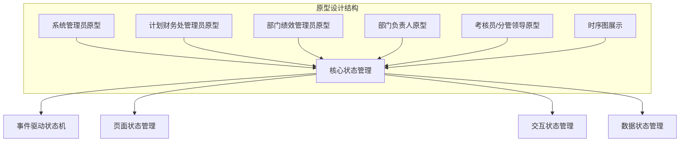
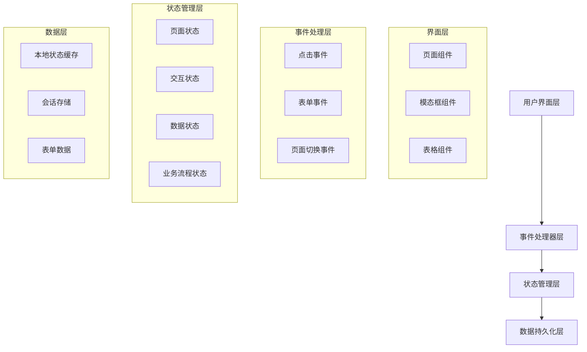
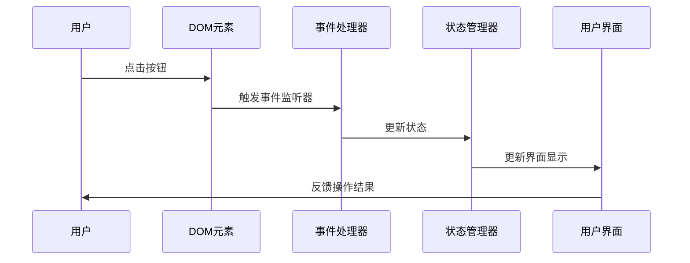
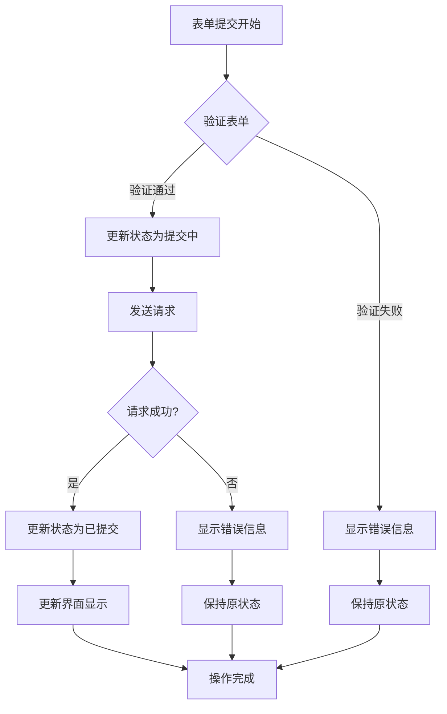
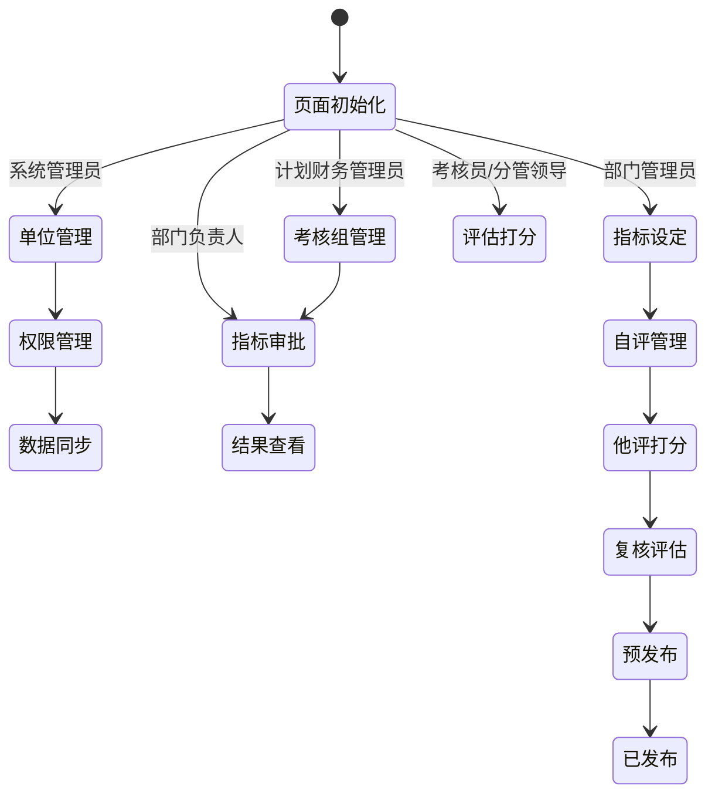
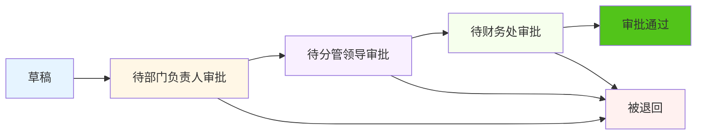
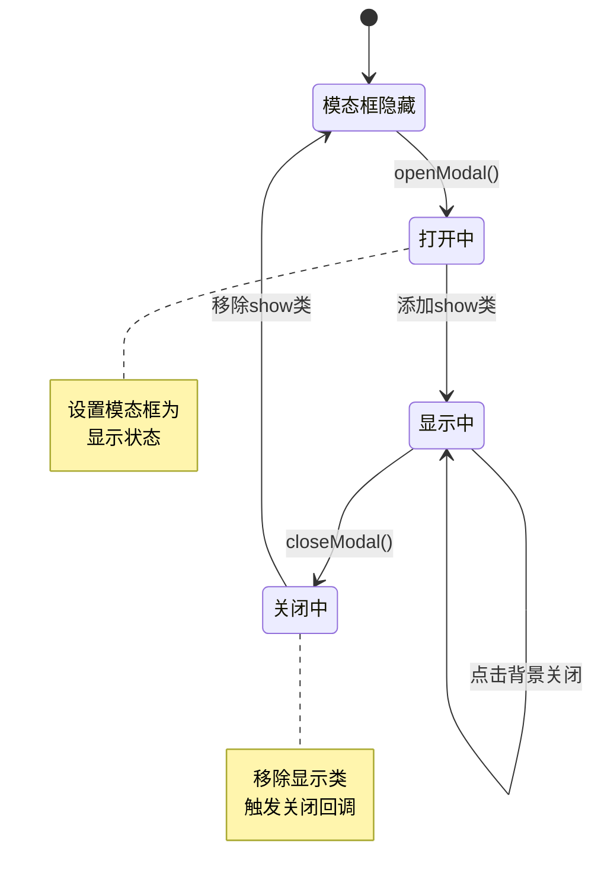
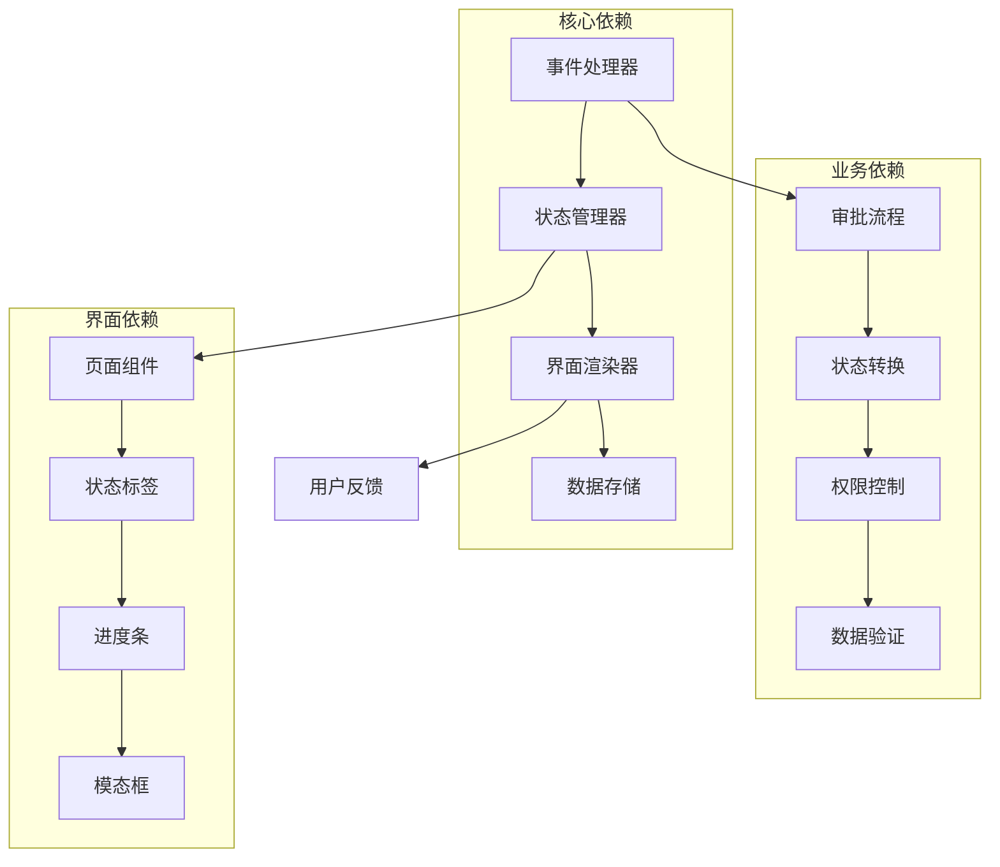

# 状态管理机制

<cite>
**本文档引用的文件**
- [1-系统管理员原型-v1.html](file://月度业绩考核原型设计初稿/1-系统管理员原型-v1.html)
- [2-计划财务处业绩考核管理员原型-v1.html](file://月度业绩考核原型设计初稿/2-计划财务处业绩考核管理员原型-v1.html)
- [3-部门绩效管理员原型-v1.html](file://月度业绩考核原型设计初稿/3-部门绩效管理员原型-v1.html)
- [4-部门负责人原型-v1.html](file://月度业绩考核原型设计初稿/4-部门负责人原型-v1.html)
- [5-考核员分管领导原型-v1.html](file://月度业绩考核原型设计初稿/5-考核员分管领导原型-v1.html)
- [6-时序图-v1.html](file://月度业绩考核原型设计初稿/6-时序图-v1.html)
</cite>

## 目录
1. [引言](#引言)
2. [项目结构](#项目结构)
3. [核心组件](#核心组件)
4. [架构概览](#架构概览)
5. [详细组件分析](#详细组件分析)
6. [依赖关系分析](#依赖关系分析)
7. [性能考虑](#性能考虑)
8. [故障排除指南](#故障排除指南)
9. [结论](#结论)

## 引言

本文档深入分析了月度业绩考核管理系统的状态管理机制。该系统采用纯前端HTML/CSS/JavaScript实现，通过事件驱动的方式管理复杂的业务流程状态。系统涵盖了从指标设定到月度考核的完整生命周期，包括页面状态、用户交互状态和数据状态的统一管理。

## 项目结构

该项目采用多角色原型设计，每个角色都有独立的界面实现：



**图表来源**
- [1-系统管理员原型-v1.html:612-632](file://月度业绩考核原型设计初稿/1-系统管理员原型-v1.html#L612-L632)
- [2-计划财务处业绩考核管理员原型-v1.html:612-712](file://月度业绩考核原型设计初稿/2-计划财务处业绩考核管理员原型-v1.html#L612-L712)

**章节来源**
- [1-系统管理员原型-v1.html:1-635](file://月度业绩考核原型设计初稿/1-系统管理员原型-v1.html#L1-L635)
- [2-计划财务处业绩考核管理员原型-v1.html:1-1039](file://月度业绩考核原型设计初稿/2-计划财务处业绩考核管理员原型-v1.html#L1-L1039)

## 核心组件

### 状态管理架构

系统采用基于事件驱动的状态管理模式，主要包含以下核心组件：

#### 1. 页面状态管理器
负责管理不同页面的显示状态和路由切换：
- 页面切换逻辑：`showPage()` 函数
- 当前页面标识：`currentPageName` 元素
- 页面可见性控制：`page-section` 类

#### 2. 交互状态管理器  
负责管理用户交互状态：
- 模态框状态：`openModal()` / `closeModal()` 函数
- 菜单激活状态：`.menu-item.active` 类
- 表单状态：输入框焦点状态

#### 3. 数据状态管理器
负责管理业务数据状态：
- 审批状态：`status-tag` 类系统
- 进度状态：`progress-bar` 组件
- 状态标签：颜色编码的状态指示器

**章节来源**
- [1-系统管理员原型-v1.html:612-632](file://月度业绩考核原型设计初稿/1-系统管理员原型-v1.html#L612-L632)
- [3-部门绩效管理员原型-v1.html:766-800](file://月度业绩考核原型设计初稿/3-部门绩效管理员原型-v1.html#L766-L800)

## 架构概览

系统采用分层架构设计，每层都有明确的职责分工：



**图表来源**
- [1-系统管理员原型-v1.html:612-632](file://月度业绩考核原型设计初稿/1-系统管理员原型-v1.html#L612-L632)
- [2-计划财务处业绩考核管理员原型-v1.html:612-712](file://月度业绩考核原型设计初稿/2-计划财务处业绩考核管理员原型-v1.html#L612-L712)

## 详细组件分析

### 事件驱动状态更新机制

#### 点击事件处理流程



**图表来源**
- [1-系统管理员原型-v1.html:612-632](file://月度业绩考核原型设计初稿/1-系统管理员原型-v1.html#L612-L632)

#### 表单提交状态管理

系统通过状态标签实现表单提交的可视化反馈：



**图表来源**
- [3-部门绩效管理员原型-v1.html:766-800](file://月度业绩考核原型设计初稿/3-部门绩效管理员原型-v1.html#L766-L800)

**章节来源**
- [1-系统管理员原型-v1.html:612-632](file://月度业绩考核原型设计初稿/1-系统管理员原型-v1.html#L612-L632)
- [3-部门绩效管理员原型-v1.html:766-800](file://月度业绩考核原型设计初稿/3-部门绩效管理员原型-v1.html#L766-L800)

### 页面状态管理策略

#### 多角色状态隔离

系统为不同角色实现了独立的状态管理：

| 角色 | 主要状态 | 状态特征 |
|------|----------|----------|
| 系统管理员 | 单位管理、权限管理、数据同步 | 系统配置状态 |
| 计划财务管理员 | 考核组管理、指标审批 | 审批流程状态 |
| 部门管理员 | 指标设定、自评管理 | 业务操作状态 |
| 部门负责人 | 指标审批、结果查看 | 审批决策状态 |
| 考核员/分管领导 | 他评打分、进度查询 | 评估执行状态 |

#### 页面切换状态管理



**图表来源**
- [1-系统管理员原型-v1.html:621-628](file://月度业绩考核原型设计初稿/1-系统管理员原型-v1.html#L621-L628)
- [2-计划财务处业绩考核管理员原型-v1.html:612-712](file://月度业绩考核原型设计初稿/2-计划财务处业绩考核管理员原型-v1.html#L612-L712)

**章节来源**
- [1-系统管理员原型-v1.html:621-628](file://月度业绩考核原型设计初稿/1-系统管理员原型-v1.html#L621-L628)
- [2-计划财务处业绩考核管理员原型-v1.html:612-712](file://月度业绩考核原型设计初稿/2-计划财务处业绩考核管理员原型-v1.html#L612-L712)

### 数据状态管理策略

#### 审批状态管理系统

系统使用颜色编码的状态标签来表示不同的审批状态：



**图表来源**
- [2-计划财务处业绩考核管理员原型-v1.html:672-712](file://月度业绩考核原型设计初稿/2-计划财务处业绩考核管理员原型-v1.html#L672-L712)

#### 考核进度状态管理

月度考核采用阶段化的状态管理：

| 阶段 | 状态 | 颜色编码 | 特征 |
|------|------|----------|------|
| 准备阶段 | 待启动 | 灰色 | 未开始 |
| 准备阶段 | 指标已发布 | 蓝色 | 已发布 |
| 自评阶段 | 自评中 | 橙色 | 进行中 |
| 他评阶段 | 他评中 | 紫色 | 进行中 |
| 复核阶段 | 复核中 | 绿色 | 进行中 |
| 预发布阶段 | 预发布 | 橙色 | 预发布 |
| 发布阶段 | 已发布 | 绿色 | 已完成 |

**章节来源**
- [2-计划财务处业绩考核管理员原型-v1.html:672-712](file://月度业绩考核原型设计初稿/2-计划财务处业绩考核管理员原型-v1.html#L672-L712)
- [5-考核员分管领导原型-v1.html:494-528](file://月度业绩考核原型设计初稿/5-考核员分管领导原型-v1.html#L494-L528)

### 交互状态管理策略

#### 模态框状态管理

系统使用模态框组件实现复杂的交互状态：



**图表来源**
- [1-系统管理员原型-v1.html:629-631](file://月度业绩考核原型设计初稿/1-系统管理员原型-v1.html#L629-L631)

#### 表单交互状态管理

表单组件通过多种状态类实现丰富的交互反馈：

| 状态类 | 用途 | 视觉反馈 |
|--------|------|----------|
| `.active` | 激活状态 | 高亮显示 |
| `.disabled` | 禁用状态 | 灰色显示 |
| `.focused` | 焦点状态 | 边框高亮 |
| `.valid` | 验证通过 | 绿色边框 |
| `.invalid` | 验证失败 | 红色边框 |

**章节来源**
- [1-系统管理员原型-v1.html:629-631](file://月度业绩考核原型设计初稿/1-系统管理员原型-v1.html#L629-L631)
- [3-部门绩效管理员原型-v1.html:766-800](file://月度业绩考核原型设计初稿/3-部门绩效管理员原型-v1.html#L766-L800)

## 依赖关系分析

### 组件间依赖关系



**图表来源**
- [1-系统管理员原型-v1.html:612-632](file://月度业绩考核原型设计初稿/1-系统管理员原型-v1.html#L612-L632)
- [2-计划财务处业绩考核管理员原型-v1.html:612-712](file://月度业绩考核原型设计初稿/2-计划财务处业绩考核管理员原型-v1.html#L612-L712)

### 状态一致性保证

系统通过以下机制确保状态一致性：

1. **单向数据流**：所有状态变更都通过事件处理器统一处理
2. **状态验证**：在状态更新前进行数据验证
3. **回滚机制**：错误状态可通过撤销操作恢复
4. **状态同步**：多个界面组件共享同一状态源

**章节来源**
- [1-系统管理员原型-v1.html:612-632](file://月度业绩考核原型设计初稿/1-系统管理员原型-v1.html#L612-L632)
- [2-计划财务处业绩考核管理员原型-v1.html:612-712](file://月度业绩考核原型设计初稿/2-计划财务处业绩考核管理员原型-v1.html#L612-L712)

## 性能考虑

### 状态管理性能优化

#### 1. 渲染优化策略
- **虚拟DOM**：通过最小化DOM操作减少重绘
- **批量更新**：合并多个状态变更到一次渲染
- **懒加载**：延迟加载非关键状态数据

#### 2. 内存管理
- **状态清理**：及时清理不再使用的状态引用
- **垃圾回收**：避免循环引用影响GC
- **内存泄漏防护**：正确移除事件监听器

#### 3. 事件处理优化
- **事件委托**：使用事件冒泡减少监听器数量
- **防抖节流**：对高频事件进行优化
- **异步处理**：长耗时操作异步执行

### 性能监控指标

| 指标 | 目标值 | 监控方法 |
|------|--------|----------|
| 页面渲染时间 | <100ms | Performance API |
| 事件响应延迟 | <50ms | 浏览器开发者工具 |
| 内存使用 | <50MB | Memory面板 |
| 状态更新频率 | <60fps | FPS监控 |

## 故障排除指南

### 常见状态管理问题

#### 1. 状态不同步问题
**症状**：界面显示与实际状态不一致
**诊断方法**：
- 检查事件处理器是否正确触发
- 验证状态更新顺序
- 确认界面渲染时机

**解决方案**：
```javascript
// 确保状态更新和界面渲染的原子性
function updateState(newState) {
    state = {...state, ...newState};
    renderUI();
}
```

#### 2. 内存泄漏问题
**症状**：页面长时间使用后内存持续增长
**诊断方法**：
- 使用浏览器内存分析工具
- 检查事件监听器是否正确移除
- 验证定时器是否正确清理

**解决方案**：
```javascript
// 正确的事件监听器管理
const handler = () => {};
element.addEventListener('click', handler);
// 组件销毁时移除
element.removeEventListener('click', handler);
```

#### 3. 性能问题
**症状**：界面卡顿，响应缓慢
**诊断方法**：
- 分析渲染性能瓶颈
- 检查状态更新频率
- 识别不必要的重渲染

**优化策略**：
- 实施状态分片
- 使用虚拟滚动
- 优化数据结构

**章节来源**
- [1-系统管理员原型-v1.html:612-632](file://月度业绩考核原型设计初稿/1-系统管理员原型-v1.html#L612-L632)
- [3-部门绩效管理员原型-v1.html:766-800](file://月度业绩考核原型设计初稿/3-部门绩效管理员原型-v1.html#L766-L800)

### 调试技巧

#### 1. 状态追踪
使用浏览器开发者工具的断点功能跟踪状态变化：
- 在状态更新函数设置断点
- 监视状态对象的属性变化
- 检查调用栈了解状态变更来源

#### 2. 性能分析
- 使用Performance面板分析渲染性能
- 监控内存使用趋势
- 分析事件处理性能

#### 3. 错误定位
- 启用JavaScript错误报告
- 使用console.log跟踪状态变化
- 实施错误边界捕获异常

## 结论

该月度业绩考核管理系统展现了优秀的前端状态管理实践。通过事件驱动的状态管理模式，系统成功实现了复杂业务流程的状态管理，包括：

1. **多角色状态隔离**：为不同角色提供了独立的状态管理空间
2. **事件驱动更新**：通过统一的事件处理器管理所有状态变更
3. **状态可视化**：使用颜色编码和进度条直观展示状态
4. **性能优化**：通过合理的状态管理和渲染优化确保系统性能

系统的核心优势在于其清晰的状态管理架构和完善的错误处理机制，为后续的功能扩展和维护奠定了坚实基础。建议在未来版本中进一步完善状态持久化机制和跨页面状态同步功能。