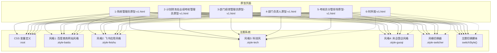
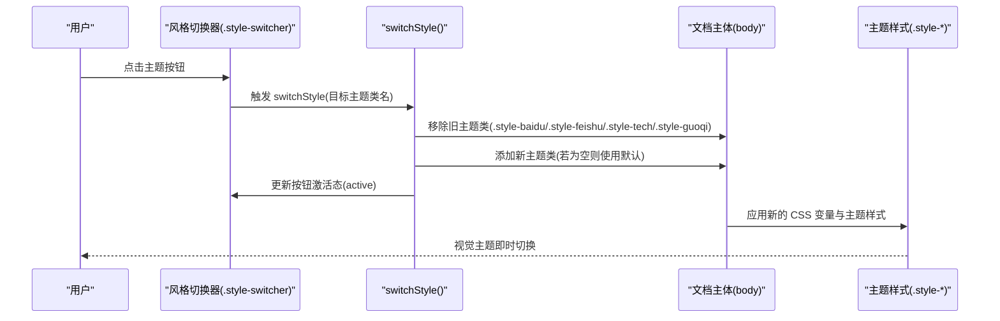
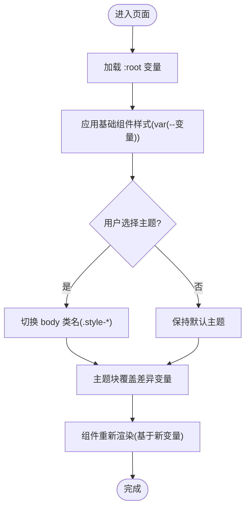
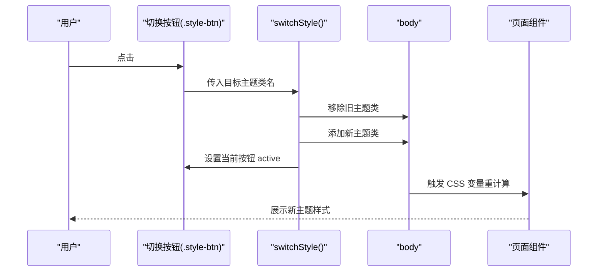
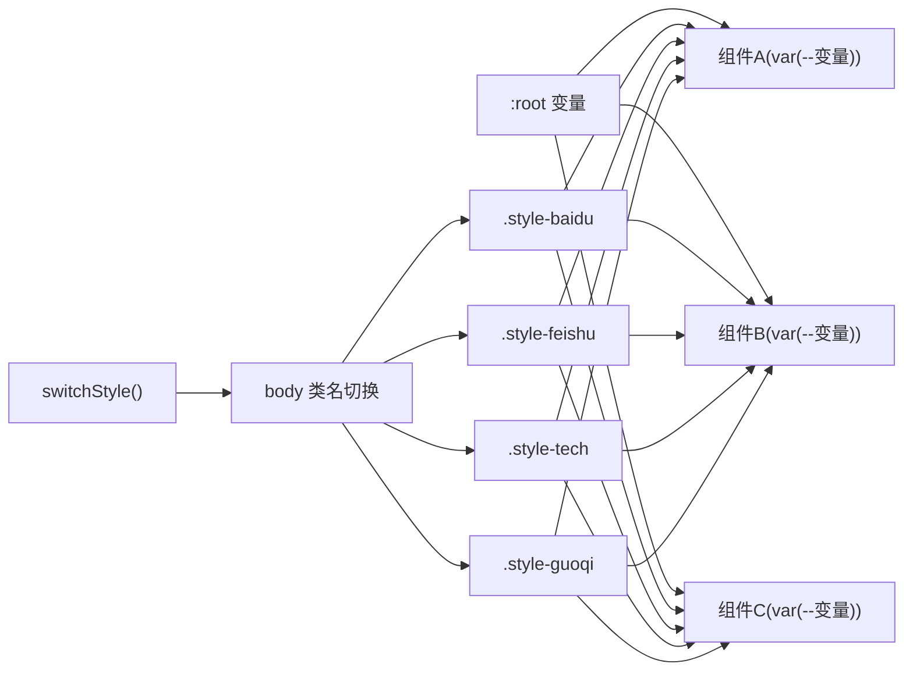

# 主题系统

<cite>
**本文档引用的文件**
- [1-系统管理员原型-v1.html](file://月度业绩考核原型设计初稿/1-系统管理员原型-v1.html)
- [2-计划财务处业绩考核管理员原型-v1.html](file://月度业绩考核原型设计初稿/2-计划财务处业绩考核管理员原型-v1.html)
- [3-部门绩效管理员原型-v1.html](file://月度业绩考核原型设计初稿/3-部门绩效管理员原型-v1.html)
- [4-部门负责人原型-v1.html](file://月度业绩考核原型设计初稿/4-部门负责人原型-v1.html)
- [5-考核员分管领导原型-v1.html](file://月度业绩考核原型设计初稿/5-考核员分管领导原型-v1.html)
- [6-时序图-v1.html](file://月度业绩考核原型设计初稿/6-时序图-v1.html)
</cite>

## 目录
1. [引言](#引言)
2. [项目结构](#项目结构)
3. [核心组件](#核心组件)
4. [架构概览](#架构概览)
5. [详细组件分析](#详细组件分析)
6. [依赖分析](#依赖分析)
7. [性能考虑](#性能考虑)
8. [故障排除指南](#故障排除指南)
9. [结论](#结论)
10. [附录](#附录)

## 引言
本文件面向“主题系统”的技术文档，聚焦于基于 CSS 变量驱动的主题切换机制。通过对仓库中多套 HTML 原型页面的分析，系统性梳理了以下内容：
- 默认风格与四种主题（百度商务、飞书应用、科技风、央企国企）的设计理念与实现原理
- CSS 变量的定义规则与作用域
- JavaScript 主题切换逻辑与组件样式的动态适配机制
- 主题系统的设计模式、扩展方法与最佳实践
- 主题定制指南、颜色搭配建议与视觉一致性保障方案
- 性能优化与用户体验考虑

## 项目结构
本仓库包含多个角色的原型页面，每个页面均内嵌完整的主题系统实现，便于在不同角色场景下验证主题切换效果。

图表来源
- [1-系统管理员原型-v1.html:7-279](file://月度业绩考核原型设计初稿/1-系统管理员原型-v1.html#L7-L279)
- [2-计划财务处业绩考核管理员原型-v1.html:7-312](file://月度业绩考核原型设计初稿/2-计划财务处业绩考核管理员原型-v1.html#L7-L312)
- [3-部门绩效管理员原型-v1.html:7-399](file://月度业绩考核原型设计初稿/3-部门绩效管理员原型-v1.html#L7-L399)
- [4-部门负责人原型-v1.html:7-338](file://月度业绩考核原型设计初稿/4-部门负责人原型-v1.html#L7-L338)
- [5-考核员分管领导原型-v1.html:1-192](file://月度业绩考核原型设计初稿/5-考核员分管领导原型-v1.html#L1-L192)
- [6-时序图-v1.html:1-90](file://月度业绩考核原型设计初稿/6-时序图-v1.html#L1-L90)

章节来源
- [1-系统管理员原型-v1.html:1-635](file://月度业绩考核原型设计初稿/1-系统管理员原型-v1.html#L1-L635)
- [2-计划财务处业绩考核管理员原型-v1.html:1-1039](file://月度业绩考核原型设计初稿/2-计划财务处业绩考核管理员原型-v1.html#L1-L1039)
- [3-部门绩效管理员原型-v1.html:1-1663](file://月度业绩考核原型设计初稿/3-部门绩效管理员原型-v1.html#L1-L1663)
- [4-部门负责人原型-v1.html:1-1231](file://月度业绩考核原型设计初稿/4-部门负责人原型-v1.html#L1-L1231)
- [5-考核员分管领导原型-v1.html:1-1459](file://月度业绩考核原型设计初稿/5-考核员分管领导原型-v1.html#L1-L1459)
- [6-时序图-v1.html:1-570](file://月度业绩考核原型设计初稿/6-时序图-v1.html#L1-L570)

## 核心组件
- CSS 变量定义区（:root）
  - 定义全局主题变量，如主色、边框、卡片背景、阴影、圆角、侧边栏宽度等
  - 作为所有主题的基础色板与布局参数
- 主题样式块
  - .style-baidu：百度商务网站风格，强调商务感与清晰的层级
  - .style-feishu：飞书应用风格，强调浅色界面与柔和对比
  - .style-tech：科技风，强调深色背景与高亮科技蓝
  - .style-guoqi：央企国企风格，强调稳重与权威感
- 风格切换器
  - .style-switcher：固定定位的切换控件，包含多个按钮，点击后切换主题
- 主题切换脚本
  - switchStyle(styleClass)：移除旧主题类，添加新主题类，并更新按钮激活态

章节来源
- [1-系统管理员原型-v1.html:7-279](file://月度业绩考核原型设计初稿/1-系统管理员原型-v1.html#L7-L279)
- [2-计划财务处业绩考核管理员原型-v1.html:7-312](file://月度业绩考核原型设计初稿/2-计划财务处业绩考核管理员原型-v1.html#L7-L312)
- [3-部门绩效管理员原型-v1.html:7-399](file://月度业绩考核原型设计初稿/3-部门绩效管理员原型-v1.html#L7-L399)
- [4-部门负责人原型-v1.html:7-338](file://月度业绩考核原型设计初稿/4-部门负责人原型-v1.html#L7-L338)
- [5-考核员分管领导原型-v1.html:1-192](file://月度业绩考核原型设计初稿/5-考核员分管领导原型-v1.html#L1-L192)

## 架构概览
主题系统采用“CSS 变量 + 类名切换”的轻量级架构，核心流程如下：

图表来源
- [1-系统管理员原型-v1.html:612-632](file://月度业绩考核原型设计初稿/1-系统管理员原型-v1.html#L612-L632)
- [2-计划财务处业绩考核管理员原型-v1.html:314-322](file://月度业绩考核原型设计初稿/2-计划财务处业绩考核管理员原型-v1.html#L314-L322)
- [3-部门绩效管理员原型-v1.html:401-409](file://月度业绩考核原型设计初稿/3-部门绩效管理员原型-v1.html#L401-L409)
- [4-部门负责人原型-v1.html:340-348](file://月度业绩考核原型设计初稿/4-部门负责人原型-v1.html#L340-L348)
- [5-考核员分管领导原型-v1.html:194-192](file://月度业绩考核原型设计初稿/5-考核员分管领导原型-v1.html#L194-L192)

## 详细组件分析

### CSS 变量定义与作用域
- :root 中定义的变量构成“全局主题基线”，涵盖主色、文本色、边框色、卡片背景、阴影、圆角、侧边栏宽度等
- 各主题块（.style-baidu/.style-feishu/.style-tech/.style-guoqi）仅覆盖差异化的变量，未覆盖的变量沿用 :root 的默认值
- 组件样式通过 var(--变量名) 使用变量，确保主题切换时整体一致

图表来源
- [1-系统管理员原型-v1.html:7-279](file://月度业绩考核原型设计初稿/1-系统管理员原型-v1.html#L7-L279)
- [2-计划财务处业绩考核管理员原型-v1.html:7-312](file://月度业绩考核原型设计初稿/2-计划财务处业绩考核管理员原型-v1.html#L7-L312)
- [3-部门绩效管理员原型-v1.html:7-399](file://月度业绩考核原型设计初稿/3-部门绩效管理员原型-v1.html#L7-L399)
- [4-部门负责人原型-v1.html:7-338](file://月度业绩考核原型设计初稿/4-部门负责人原型-v1.html#L7-L338)
- [5-考核员分管领导原型-v1.html:1-192](file://月度业绩考核原型设计初稿/5-考核员分管领导原型-v1.html#L1-L192)

章节来源
- [1-系统管理员原型-v1.html:7-279](file://月度业绩考核原型设计初稿/1-系统管理员原型-v1.html#L7-L279)
- [2-计划财务处业绩考核管理员原型-v1.html:7-312](file://月度业绩考核原型设计初稿/2-计划财务处业绩考核管理员原型-v1.html#L7-L312)
- [3-部门绩效管理员原型-v1.html:7-399](file://月度业绩考核原型设计初稿/3-部门绩效管理员原型-v1.html#L7-L399)
- [4-部门负责人原型-v1.html:7-338](file://月度业绩考核原型设计初稿/4-部门负责人原型-v1.html#L7-L338)
- [5-考核员分管领导原型-v1.html:1-192](file://月度业绩考核原型设计初稿/5-考核员分管领导原型-v1.html#L1-L192)

### 主题切换器与交互
- 风格切换器位于页面右上角，包含“默认风格”、“百度商务”、“飞书应用”、“科技风”、“央企国企”五个按钮
- 点击按钮调用 switchStyle()，根据传入的类名切换主题；同时更新当前按钮的 active 状态
- 切换逻辑简洁高效，避免重排与闪烁

图表来源
- [1-系统管理员原型-v1.html:282-289](file://月度业绩考核原型设计初稿/1-系统管理员原型-v1.html#L282-L289)
- [1-系统管理员原型-v1.html:612-632](file://月度业绩考核原型设计初稿/1-系统管理员原型-v1.html#L612-L632)
- [2-计划财务处业绩考核管理员原型-v1.html:315-322](file://月度业绩考核原型设计初稿/2-计划财务处业绩考核管理员原型-v1.html#L315-L322)
- [3-部门绩效管理员原型-v1.html:402-409](file://月度业绩考核原型设计初稿/3-部门绩效管理员原型-v1.html#L402-L409)
- [4-部门负责人原型-v1.html:341-348](file://月度业绩考核原型设计初稿/4-部门负责人原型-v1.html#L341-L348)
- [5-考核员分管领导原型-v1.html:194-192](file://月度业绩考核原型设计初稿/5-考核员分管领导原型-v1.html#L194-L192)

章节来源
- [1-系统管理员原型-v1.html:282-289](file://月度业绩考核原型设计初稿/1-系统管理员原型-v1.html#L282-L289)
- [1-系统管理员原型-v1.html:612-632](file://月度业绩考核原型设计初稿/1-系统管理员原型-v1.html#L612-L632)
- [2-计划财务处业绩考核管理员原型-v1.html:315-322](file://月度业绩考核原型设计初稿/2-计划财务处业绩考核管理员原型-v1.html#L315-L322)
- [3-部门绩效管理员原型-v1.html:402-409](file://月度业绩考核原型设计初稿/3-部门绩效管理员原型-v1.html#L402-L409)
- [4-部门负责人原型-v1.html:341-348](file://月度业绩考核原型设计初稿/4-部门负责人原型-v1.html#L341-L348)
- [5-考核员分管领导原型-v1.html:194-192](file://月度业绩考核原型设计初稿/5-考核员分管领导原型-v1.html#L194-L192)

### 组件样式与 CSS 变量绑定
- 页面主体、侧边栏、顶部栏、卡片、表格、按钮、模态框、标签等组件均通过 var(--变量) 绑定样式
- 当主题切换时，组件无需修改，仅 CSS 变量变化即可驱动整体视觉更新
- 这种“声明式变量 + 命令式切换”的组合，实现了高内聚、低耦合的主题系统

章节来源
- [1-系统管理员原型-v1.html:186-279](file://月度业绩考核原型设计初稿/1-系统管理员原型-v1.html#L186-L279)
- [2-计划财务处业绩考核管理员原型-v1.html:221-312](file://月度业绩考核原型设计初稿/2-计划财务处业绩考核管理员原型-v1.html#L221-L312)
- [3-部门绩效管理员原型-v1.html:216-399](file://月度业绩考核原型设计初稿/3-部门绩效管理员原型-v1.html#L216-L399)
- [4-部门负责人原型-v1.html:197-338](file://月度业绩考核原型设计初稿/4-部门负责人原型-v1.html#L197-L338)
- [5-考核员分管领导原型-v1.html:8-192](file://月度业绩考核原型设计初稿/5-考核员分管领导原型-v1.html#L8-L192)

### 四种主题的设计理念与实现要点
- 默认风格
  - 设计理念：通用、平衡、易用
  - 实现要点：以中性蓝为主色调，强调可读性与可用性
- 百度商务风格 (.style-baidu)
  - 设计理念：商务、专业、清晰
  - 实现要点：提升主色饱和度与对比度，强调标题与导航层次
- 飞书应用风格 (.style-feishu)
  - 设计理念：现代、简洁、柔和
  - 实现要点：浅色背景、柔和边框、圆角化组件，强调信息密度与可读性
- 科技风 (.style-tech)
  - 设计理念：未来感、科技感、沉浸式
  - 实现要点：深色背景、高亮科技蓝、发光阴影，营造科技氛围
- 央企国企风格 (.style-guoqi)
  - 设计理念：稳重、权威、规范
  - 实现要点：使用企业红为主色，强调稳定与信任感

章节来源
- [1-系统管理员原型-v1.html:37-149](file://月度业绩考核原型设计初稿/1-系统管理员原型-v1.html#L37-L149)
- [2-计划财务处业绩考核管理员原型-v1.html:44-184](file://月度业绩考核原型设计初稿/2-计划财务处业绩考核管理员原型-v1.html#L44-L184)
- [3-部门绩效管理员原型-v1.html:41-179](file://月度业绩考核原型设计初稿/3-部门绩效管理员原型-v1.html#L41-L179)
- [4-部门负责人原型-v1.html:41-160](file://月度业绩考核原型设计初稿/4-部门负责人原型-v1.html#L41-L160)

### 扩展新主题的方法与最佳实践
- 定义新主题块
  - 在 :root 下预留必要的变量键位，避免遗漏关键变量
  - 在新主题块中仅覆盖差异化变量，减少冗余
- 组件适配
  - 确保所有组件样式通过 var(--变量) 使用变量，避免硬编码颜色
  - 对于局部差异化样式，可在主题块内追加局部覆盖规则
- 交互与状态
  - 在风格切换器中增加新按钮，并在 switchStyle() 中处理新类名
  - 保持按钮激活态的一致行为
- 视觉一致性
  - 建议制定颜色规范与变量命名约定，避免主题间冲突
  - 使用工具生成主题变量清单，统一校验缺失项

章节来源
- [1-系统管理员原型-v1.html:7-279](file://月度业绩考核原型设计初稿/1-系统管理员原型-v1.html#L7-L279)
- [2-计划财务处业绩考核管理员原型-v1.html:7-312](file://月度业绩考核原型设计初稿/2-计划财务处业绩考核管理员原型-v1.html#L7-L312)
- [3-部门绩效管理员原型-v1.html:7-399](file://月度业绩考核原型设计初稿/3-部门绩效管理员原型-v1.html#L7-L399)
- [4-部门负责人原型-v1.html:7-338](file://月度业绩考核原型设计初稿/4-部门负责人原型-v1.html#L7-L338)
- [5-考核员分管领导原型-v1.html:1-192](file://月度业绩考核原型设计初稿/5-考核员分管领导原型-v1.html#L1-L192)

### 主题定制指南与颜色搭配建议
- 颜色体系
  - 主色：用于强调、链接、按钮、状态高亮
  - 文本色：主文本、次级文本、占位符
  - 边框与分割线：用于卡片、表格、分隔线
  - 背景：页面主背景、卡片背景、悬浮层背景
  - 阴影：卡片阴影、浮层阴影
- 圆角与间距
  - 统一圆角半径，确保组件视觉一致
  - 合理的内外边距与行高，提升可读性
- 状态与反馈
  - 状态标签与按钮在不同主题下保持足够的对比度
  - 悬停、激活、禁用等状态在各主题下保持一致的反馈语义

章节来源
- [1-系统管理员原型-v1.html:7-279](file://月度业绩考核原型设计初稿/1-系统管理员原型-v1.html#L7-L279)
- [2-计划财务处业绩考核管理员原型-v1.html:7-312](file://月度业绩考核原型设计初稿/2-计划财务处业绩考核管理员原型-v1.html#L7-L312)
- [3-部门绩效管理员原型-v1.html:7-399](file://月度业绩考核原型设计初稿/3-部门绩效管理员原型-v1.html#L7-L399)
- [4-部门负责人原型-v1.html:7-338](file://月度业绩考核原型设计初稿/4-部门负责人原型-v1.html#L7-L338)
- [5-考核员分管领导原型-v1.html:1-192](file://月度业绩考核原型设计初稿/5-考核员分管领导原型-v1.html#L1-L192)

## 依赖分析
- 组件与变量的依赖关系
  - 所有组件样式依赖 :root 中的 CSS 变量
  - 主题块仅覆盖差异变量，其余沿用 :root
- 主题切换的依赖关系
  - switchStyle() 依赖 body 的类名切换
  - 风格切换器依赖按钮事件绑定
- 角色页面的依赖关系
  - 各角色页面共享同一套主题系统，但各自页面结构与组件略有差异

图表来源
- [1-系统管理员原型-v1.html:7-279](file://月度业绩考核原型设计初稿/1-系统管理员原型-v1.html#L7-L279)
- [2-计划财务处业绩考核管理员原型-v1.html:7-312](file://月度业绩考核原型设计初稿/2-计划财务处业绩考核管理员原型-v1.html#L7-L312)
- [3-部门绩效管理员原型-v1.html:7-399](file://月度业绩考核原型设计初稿/3-部门绩效管理员原型-v1.html#L7-L399)
- [4-部门负责人原型-v1.html:7-338](file://月度业绩考核原型设计初稿/4-部门负责人原型-v1.html#L7-L338)
- [5-考核员分管领导原型-v1.html:1-192](file://月度业绩考核原型设计初稿/5-考核员分管领导原型-v1.html#L1-L192)

章节来源
- [1-系统管理员原型-v1.html:7-279](file://月度业绩考核原型设计初稿/1-系统管理员原型-v1.html#L7-L279)
- [2-计划财务处业绩考核管理员原型-v1.html:7-312](file://月度业绩考核原型设计初稿/2-计划财务处业绩考核管理员原型-v1.html#L7-L312)
- [3-部门绩效管理员原型-v1.html:7-399](file://月度业绩考核原型设计初稿/3-部门绩效管理员原型-v1.html#L7-L399)
- [4-部门负责人原型-v1.html:7-338](file://月度业绩考核原型设计初稿/4-部门负责人原型-v1.html#L7-L338)
- [5-考核员分管领导原型-v1.html:1-192](file://月度业绩考核原型设计初稿/5-考核员分管领导原型-v1.html#L1-L192)

## 性能考虑
- 切换成本极低
  - 仅变更 body 的类名，不触发重排与重绘，切换流畅
- 变量驱动的优势
  - 通过 CSS 变量一次性更新，避免逐元素修改带来的开销
- 建议
  - 避免在主题切换时引入复杂动画或阻塞操作
  - 将主题切换逻辑置于页面初始化之后，确保 DOM 结构稳定

章节来源
- [1-系统管理员原型-v1.html:612-632](file://月度业绩考核原型设计初稿/1-系统管理员原型-v1.html#L612-L632)
- [2-计划财务处业绩考核管理员原型-v1.html:314-322](file://月度业绩考核原型设计初稿/2-计划财务处业绩考核管理员原型-v1.html#L314-L322)
- [3-部门绩效管理员原型-v1.html:401-409](file://月度业绩考核原型设计初稿/3-部门绩效管理员原型-v1.html#L401-L409)
- [4-部门负责人原型-v1.html:340-348](file://月度业绩考核原型设计初稿/4-部门负责人原型-v1.html#L340-L348)
- [5-考核员分管领导原型-v1.html:194-192](file://月度业绩考核原型设计初稿/5-考核员分管领导原型-v1.html#L194-L192)

## 故障排除指南
- 主题切换无效
  - 检查 switchStyle() 是否正确移除旧类并添加新类
  - 确认按钮事件绑定是否正常
- 样式错乱
  - 检查主题块是否覆盖了关键变量
  - 确认组件是否通过 var(--变量) 使用变量
- 按钮状态异常
  - 确认 active 类的切换逻辑是否正确执行

章节来源
- [1-系统管理员原型-v1.html:612-632](file://月度业绩考核原型设计初稿/1-系统管理员原型-v1.html#L612-L632)
- [2-计划财务处业绩考核管理员原型-v1.html:314-322](file://月度业绩考核原型设计初稿/2-计划财务处业绩考核管理员原型-v1.html#L314-L322)
- [3-部门绩效管理员原型-v1.html:401-409](file://月度业绩考核原型设计初稿/3-部门绩效管理员原型-v1.html#L401-L409)
- [4-部门负责人原型-v1.html:340-348](file://月度业绩考核原型设计初稿/4-部门负责人原型-v1.html#L340-L348)
- [5-考核员分管领导原型-v1.html:194-192](file://月度业绩考核原型设计初稿/5-考核员分管领导原型-v1.html#L194-L192)

## 结论
本主题系统以 CSS 变量为核心，结合轻量的 JavaScript 切换逻辑，实现了低成本、高一致性的多主题能力。通过“全局变量 + 局部覆盖”的设计，既保证了默认风格的稳定性，又为后续扩展提供了清晰路径。建议在实际工程中进一步完善变量命名规范、状态反馈与无障碍支持，持续提升用户体验与可维护性。

## 附录
- 变量清单（节选）
  - 主色系：--primary、--primary-dark、--avatar-bg
  - 文本与边框：--text-primary、--text-secondary、--border-color
  - 背景与阴影：--main-bg、--card-bg、--card-shadow
  - 圆角与尺寸：--radius、--radius-sm、--sidebar-width
  - 表格与按钮：--table-header-bg、--table-hover-bg、--btn-primary-bg、--btn-primary-text
  - 状态色：--status-on-bg、--status-on-text、--status-off-bg、--status-off-text
- 主题扩展清单
  - 新增主题块：.style-new-theme
  - 在 :root 中补充必要变量
  - 在切换器中新增按钮并接入 switchStyle()

章节来源
- [1-系统管理员原型-v1.html:7-279](file://月度业绩考核原型设计初稿/1-系统管理员原型-v1.html#L7-L279)
- [2-计划财务处业绩考核管理员原型-v1.html:7-312](file://月度业绩考核原型设计初稿/2-计划财务处业绩考核管理员原型-v1.html#L7-L312)
- [3-部门绩效管理员原型-v1.html:7-399](file://月度业绩考核原型设计初稿/3-部门绩效管理员原型-v1.html#L7-L399)
- [4-部门负责人原型-v1.html:7-338](file://月度业绩考核原型设计初稿/4-部门负责人原型-v1.html#L7-L338)
- [5-考核员分管领导原型-v1.html:1-192](file://月度业绩考核原型设计初稿/5-考核员分管领导原型-v1.html#L1-L192)