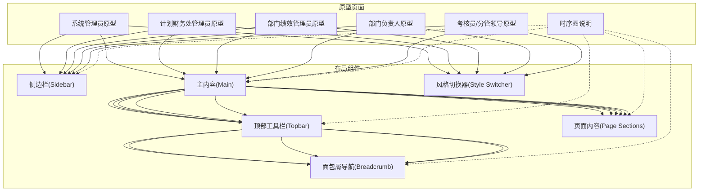
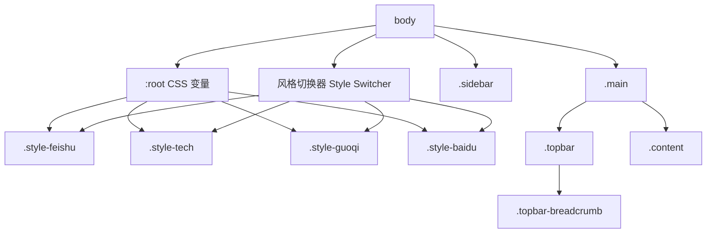
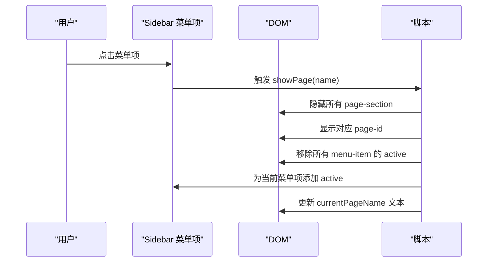
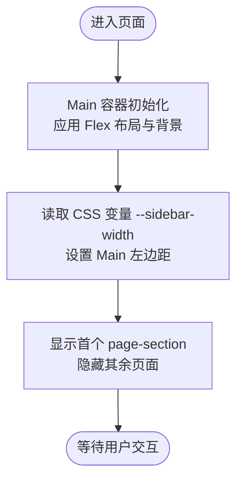
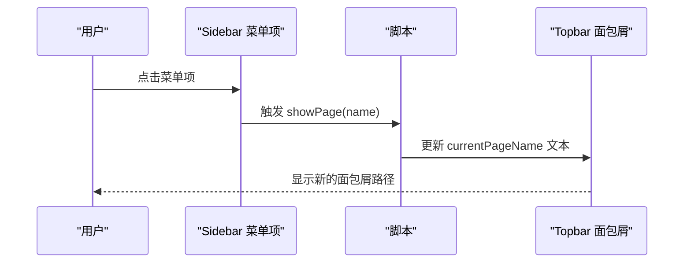
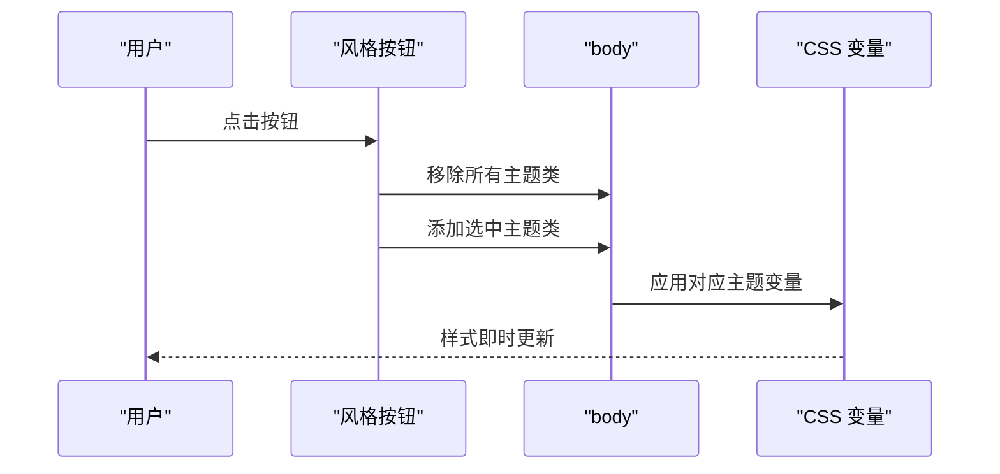
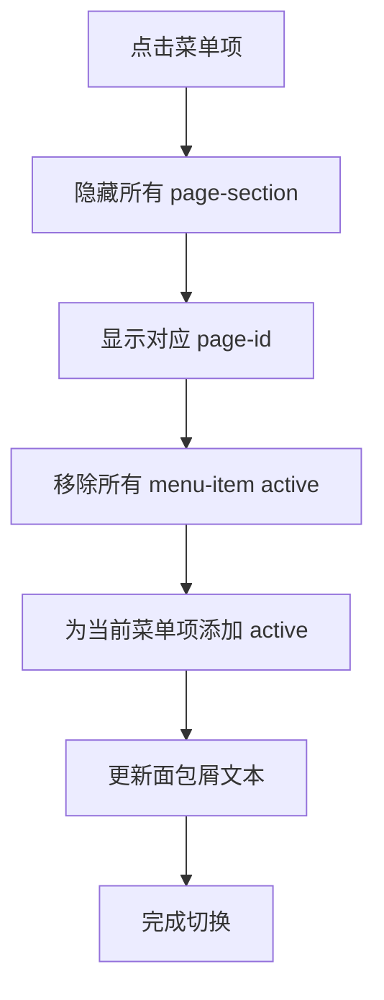
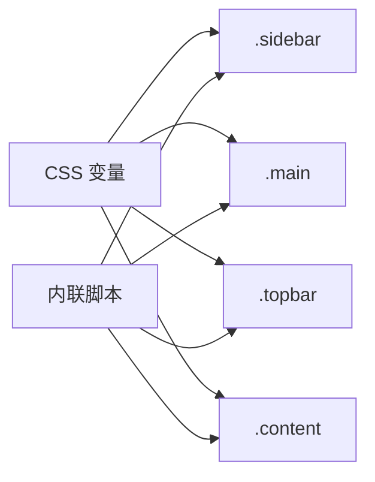

# 布局组件

<cite>
**本文档引用的文件**
- [1-系统管理员原型-v1.html](file://月度业绩考核原型设计初稿/1-系统管理员原型-v1.html)
- [2-计划财务处业绩考核管理员原型-v1.html](file://月度业绩考核原型设计初稿/2-计划财务处业绩考核管理员原型-v1.html)
- [3-部门绩效管理员原型-v1.html](file://月度业绩考核原型设计初稿/3-部门绩效管理员原型-v1.html)
- [4-部门负责人原型-v1.html](file://月度业绩考核原型设计初稿/4-部门负责人原型-v1.html)
- [5-考核员分管领导原型-v1.html](file://月度业绩考核原型设计初稿/5-考核员分管领导原型-v1.html)
- [6-时序图-v1.html](file://月度业绩考核原型设计初稿/6-时序图-v1.html)
</cite>

## 目录
1. [简介](#简介)
2. [项目结构](#项目结构)
3. [核心组件](#核心组件)
4. [架构总览](#架构总览)
5. [详细组件分析](#详细组件分析)
6. [依赖关系分析](#依赖关系分析)
7. [性能考虑](#性能考虑)
8. [故障排查指南](#故障排查指南)
9. [结论](#结论)
10. [附录](#附录)

## 简介
本文件面向“布局组件”的技术文档，聚焦于系统中统一的页面布局结构与样式体系，包括侧边栏导航(Sidebar)、主内容区域(Main)、顶部工具栏(Topbar)、面包屑导航(Breadcrumb)等核心布局元素。文档将深入解析以下方面：
- CSS 变量系统与风格主题切换机制
- 响应式设计与布局适配策略
- 主题切换与组件样式映射
- 页面内布局状态管理与交互行为
- 组件间数据传递与事件处理模式
- 样式定制与扩展指南
- 最佳实践与常见问题排查

## 项目结构
该项目采用“多角色原型”结构，每个角色页面均包含相同的布局骨架（侧边栏、主内容、顶部工具栏、面包屑），并通过脚本实现页面切换与状态更新。整体结构如下：

图表来源
- [1-系统管理员原型-v1.html:281-635](file://月度业绩考核原型设计初稿/1-系统管理员原型-v1.html#L281-L635)
- [2-计划财务处业绩考核管理员原型-v1.html:314-1039](file://月度业绩考核原型设计初稿/2-计划财务处业绩考核管理员原型-v1.html#L314-L1039)
- [3-部门绩效管理员原型-v1.html:400-1663](file://月度业绩考核原型设计初稿/3-部门绩效管理员原型-v1.html#L400-L1663)
- [4-部门负责人原型-v1.html:340-1231](file://月度业绩考核原型设计初稿/4-部门负责人原型-v1.html#L340-L1231)
- [5-考核员分管领导原型-v1.html:194-1459](file://月度业绩考核原型设计初稿/5-考核员分管领导原型-v1.html#L194-L1459)
- [6-时序图-v1.html:92-570](file://月度业绩考核原型设计初稿/6-时序图-v1.html#L92-L570)

章节来源
- [1-系统管理员原型-v1.html:281-635](file://月度业绩考核原型设计初稿/1-系统管理员原型-v1.html#L281-L635)
- [2-计划财务处业绩考核管理员原型-v1.html:314-1039](file://月度业绩考核原型设计初稿/2-计划财务处业绩考核管理员原型-v1.html#L314-L1039)
- [3-部门绩效管理员原型-v1.html:400-1663](file://月度业绩考核原型设计初稿/3-部门绩效管理员原型-v1.html#L400-L1663)
- [4-部门负责人原型-v1.html:340-1231](file://月度业绩考核原型设计初稿/4-部门负责人原型-v1.html#L340-L1231)
- [5-考核员分管领导原型-v1.html:194-1459](file://月度业绩考核原型设计初稿/5-考核员分管领导原型-v1.html#L194-L1459)
- [6-时序图-v1.html:92-570](file://月度业绩考核原型设计初稿/6-时序图-v1.html#L92-L570)

## 核心组件
本项目布局组件由以下关键元素构成：
- 侧边栏(Sidebar)：固定左侧，包含系统标识、菜单分组与菜单项，支持激活态样式与悬停高亮。
- 主内容(Main)：占据剩余空间，包含顶部工具栏与内容区，使用 Flex 布局纵向排列。
- 顶部工具栏(Topbar)：包含面包屑导航与右侧用户信息，高度固定。
- 面包屑导航(Breadcrumb)：显示当前页面层级路径，动态更新当前页面标题。
- 页面内容区(Content)：承载具体业务页面，通过页面切换脚本控制显示隐藏。

章节来源
- [1-系统管理员原型-v1.html:291-360](file://月度业绩考核原型设计初稿/1-系统管理员原型-v1.html#L291-L360)
- [2-计划财务处业绩考核管理员原型-v1.html:324-350](file://月度业绩考核原型设计初稿/2-计划财务处业绩考核管理员原型-v1.html#L324-L350)
- [3-部门绩效管理员原型-v1.html:411-441](file://月度业绩考核原型设计初稿/3-部门绩效管理员原型-v1.html#L411-L441)
- [4-部门负责人原型-v1.html:350-376](file://月度业绩考核原型设计初稿/4-部门负责人原型-v1.html#L350-L376)
- [5-考核员分管领导原型-v1.html:196-237](file://月度业绩考核原型设计初稿/5-考核员分管领导原型-v1.html#L196-L237)

## 架构总览
布局组件采用“CSS 变量 + 类名切换”的双层架构：
- CSS 变量层：集中定义颜色、尺寸、阴影、边框等设计令牌，通过根作用域与主题类名组合实现风格切换。
- 结构层：通过类名控制布局容器位置、尺寸与显隐，配合脚本实现页面切换与面包屑更新。

图表来源
- [1-系统管理员原型-v1.html:8-35](file://月度业绩考核原型设计初稿/1-系统管理员原型-v1.html#L8-L35)
- [1-系统管理员原型-v1.html:37-101](file://月度业绩考核原型设计初稿/1-系统管理员原型-v1.html#L37-L101)
- [1-系统管理员原型-v1.html:152-185](file://月度业绩考核原型设计初稿/1-系统管理员原型-v1.html#L152-L185)
- [1-系统管理员原型-v1.html:189-208](file://月度业绩考核原型设计初稿/1-系统管理员原型-v1.html#L189-L208)

章节来源
- [1-系统管理员原型-v1.html:8-101](file://月度业绩考核原型设计初稿/1-系统管理员原型-v1.html#L8-L101)
- [1-系统管理员原型-v1.html:152-208](file://月度业绩考核原型设计初稿/1-系统管理员原型-v1.html#L152-L208)

## 详细组件分析

### 侧边栏导航(Sidebar)
- 结构组成：系统 Logo 区、菜单分组区(menu-group)、菜单项(menu-item)，支持分组标题与激活态样式。
- 样式特性：固定定位、纵向滚动、宽度由 CSS 变量控制；菜单项悬停与激活态通过伪类与类名切换实现。
- 交互行为：点击菜单项触发页面切换与激活态更新，同时更新面包屑文本。

图表来源
- [1-系统管理员原型-v1.html:612-632](file://月度业绩考核原型设计初稿/1-系统管理员原型-v1.html#L612-L632)
- [2-计划财务处业绩考核管理员原型-v1.html:612-632](file://月度业绩考核原型设计初稿/2-计划财务处业绩考核管理员原型-v1.html#L612-L632)
- [3-部门绩效管理员原型-v1.html:612-632](file://月度业绩考核原型设计初稿/3-部门绩效管理员原型-v1.html#L612-L632)
- [4-部门负责人原型-v1.html:612-632](file://月度业绩考核原型设计初稿/4-部门负责人原型-v1.html#L612-L632)
- [5-考核员分管领导原型-v1.html:612-632](file://月度业绩考核原型设计初稿/5-考核员分管领导原型-v1.html#L612-L632)

章节来源
- [1-系统管理员原型-v1.html:291-316](file://月度业绩考核原型设计初稿/1-系统管理员原型-v1.html#L291-L316)
- [2-计划财务处业绩考核管理员原型-v1.html:324-344](file://月度业绩考核原型设计初稿/2-计划财务处业绩考核管理员原型-v1.html#L324-L344)
- [3-部门绩效管理员原型-v1.html:411-430](file://月度业绩考核原型设计初稿/3-部门绩效管理员原型-v1.html#L411-L430)
- [4-部门负责人原型-v1.html:350-366](file://月度业绩考核原型设计初稿/4-部门负责人原型-v1.html#L350-L366)
- [5-考核员分管领导原型-v1.html:196-227](file://月度业绩考核原型设计初稿/5-考核员分管领导原型-v1.html#L196-L227)

### 主内容区域(Main)
- 布局：使用 Flex 布局纵向排列，顶部为 Topbar，中部为 Content，背景色由 CSS 变量控制。
- 侧边栏联动：通过 CSS 变量控制侧边栏宽度，Main 左边距等于侧边栏宽度，确保内容不被遮挡。
- 内容区：承载多个 page-section，初始仅显示第一个，其余通过脚本切换显示。

图表来源
- [1-系统管理员原型-v1.html:202-208](file://月度业绩考核原型设计初稿/1-系统管理员原型-v1.html#L202-L208)
- [2-计划财务处业绩考核管理员原型-v1.html:346-351](file://月度业绩考核原型设计初稿/2-计划财务处业绩考核管理员原型-v1.html#L346-L351)
- [3-部门绩效管理员原型-v1.html:432-442](file://月度业绩考核原型设计初稿/3-部门绩效管理员原型-v1.html#L432-L442)
- [4-部门负责人原型-v1.html:368-377](file://月度业绩考核原型设计初稿/4-部门负责人原型-v1.html#L368-L377)
- [5-考核员分管领导原型-v1.html:229-238](file://月度业绩考核原型设计初稿/5-考核员分管领导原型-v1.html#L229-L238)

章节来源
- [1-系统管理员原型-v1.html:202-208](file://月度业绩考核原型设计初稿/1-系统管理员原型-v1.html#L202-L208)
- [2-计划财务处业绩考核管理员原型-v1.html:346-351](file://月度业绩考核原型设计初稿/2-计划财务处业绩考核管理员原型-v1.html#L346-L351)
- [3-部门绩效管理员原型-v1.html:432-442](file://月度业绩考核原型设计初稿/3-部门绩效管理员原型-v1.html#L432-L442)
- [4-部门负责人原型-v1.html:368-377](file://月度业绩考核原型设计初稿/4-部门负责人原型-v1.html#L368-L377)
- [5-考核员分管领导原型-v1.html:229-238](file://月度业绩考核原型设计初稿/5-考核员分管领导原型-v1.html#L229-L238)

### 顶部工具栏(Topbar)与面包屑导航(Breadcrumb)
- Topbar：固定高度，包含面包屑与右侧用户信息，背景与边框色由 CSS 变量控制。
- 面包屑：显示当前页面层级，文本通过脚本动态更新，便于用户定位当前位置。

图表来源
- [1-系统管理员原型-v1.html:612-632](file://月度业绩考核原型设计初稿/1-系统管理员原型-v1.html#L612-L632)
- [2-计划财务处业绩考核管理员原型-v1.html:612-632](file://月度业绩考核原型设计初稿/2-计划财务处业绩考核管理员原型-v1.html#L612-L632)
- [3-部门绩效管理员原型-v1.html:612-632](file://月度业绩考核原型设计初稿/3-部门绩效管理员原型-v1.html#L612-L632)
- [4-部门负责人原型-v1.html:612-632](file://月度业绩考核原型设计初稿/4-部门负责人原型-v1.html#L612-L632)
- [5-考核员分管领导原型-v1.html:612-632](file://月度业绩考核原型设计初稿/5-考核员分管领导原型-v1.html#L612-L632)

章节来源
- [1-系统管理员原型-v1.html:318-326](file://月度业绩考核原型设计初稿/1-系统管理员原型-v1.html#L318-L326)
- [2-计划财务处业绩考核管理员原型-v1.html:346-350](file://月度业绩考核原型设计初稿/2-计划财务处业绩考核管理员原型-v1.html#L346-L350)
- [3-部门绩效管理员原型-v1.html:433-441](file://月度业绩考核原型设计初稿/3-部门绩效管理员原型-v1.html#L433-L441)
- [4-部门负责人原型-v1.html:368-376](file://月度业绩考核原型设计初稿/4-部门负责人原型-v1.html#L368-L376)
- [5-考核员分管领导原型-v1.html:230-237](file://月度业绩考核原型设计初稿/5-考核员分管领导原型-v1.html#L230-L237)

### 风格系统与主题切换
- CSS 变量：集中定义主色、背景、卡片、表格、按钮、状态标签等设计令牌。
- 主题类：通过 .style-feishu、.style-tech、.style-guoqi、.style-baidu 等类名切换主题，脚本通过为 body 添加/移除类名实现切换。
- 切换逻辑：点击风格按钮后，移除所有按钮的 active 类，为当前按钮添加 active，并更新 body 的主题类。

图表来源
- [1-系统管理员原型-v1.html:613-619](file://月度业绩考核原型设计初稿/1-系统管理员原型-v1.html#L613-L619)
- [2-计划财务处业绩考核管理员原型-v1.html:613-619](file://月度业绩考核原型设计初稿/2-计划财务处业绩考核管理员原型-v1.html#L613-L619)
- [3-部门绩效管理员原型-v1.html:613-619](file://月度业绩考核原型设计初稿/3-部门绩效管理员原型-v1.html#L613-L619)
- [4-部门负责人原型-v1.html:613-619](file://月度业绩考核原型设计初稿/4-部门负责人原型-v1.html#L613-L619)
- [5-考核员分管领导原型-v1.html:613-619](file://月度业绩考核原型设计初稿/5-考核员分管领导原型-v1.html#L613-L619)

章节来源
- [1-系统管理员原型-v1.html:8-101](file://月度业绩考核原型设计初稿/1-系统管理员原型-v1.html#L8-L101)
- [1-系统管理员原型-v1.html:152-185](file://月度业绩考核原型设计初稿/1-系统管理员原型-v1.html#L152-L185)
- [1-系统管理员原型-v1.html:613-619](file://月度业绩考核原型设计初稿/1-系统管理员原型-v1.html#L613-L619)

### 页面切换与状态管理
- 页面切换：通过 showPage(name) 控制 page-section 的显隐，同时更新面包屑文本。
- 激活态管理：点击菜单项时移除所有菜单项的 active 类，为当前项添加 active。
- 模态框：通过 openModal/closeModal 控制模态 overlay 的显示/隐藏，支持点击遮罩关闭。

图表来源
- [1-系统管理员原型-v1.html:621-628](file://月度业绩考核原型设计初稿/1-系统管理员原型-v1.html#L621-L628)
- [1-系统管理员原型-v1.html:629-632](file://月度业绩考核原型设计初稿/1-系统管理员原型-v1.html#L629-L632)

章节来源
- [1-系统管理员原型-v1.html:612-632](file://月度业绩考核原型设计初稿/1-系统管理员原型-v1.html#L612-L632)

## 依赖关系分析
- 样式依赖：所有组件样式均依赖于 CSS 变量，主题切换通过为 body 添加/移除类名实现，无需重载页面即可即时生效。
- 脚本依赖：页面切换、面包屑更新、模态框控制均由内联脚本实现，无外部依赖。
- 结构依赖：Sidebar、Main、Topbar、Content 的布局关系稳定，页面内容通过 page-section 控制显隐。

图表来源
- [1-系统管理员原型-v1.html:8-35](file://月度业绩考核原型设计初稿/1-系统管理员原型-v1.html#L8-L35)
- [1-系统管理员原型-v1.html:612-632](file://月度业绩考核原型设计初稿/1-系统管理员原型-v1.html#L612-L632)

章节来源
- [1-系统管理员原型-v1.html:8-35](file://月度业绩考核原型设计初稿/1-系统管理员原型-v1.html#L8-L35)
- [1-系统管理员原型-v1.html:612-632](file://月度业绩考核原型设计初稿/1-系统管理员原型-v1.html#L612-L632)

## 性能考虑
- CSS 变量切换：主题切换仅涉及类名变更与变量重计算，开销极低，适合频繁切换。
- DOM 操作：页面切换与模态框控制均为少量 DOM 操作，性能开销可控。
- 响应式：布局基于 Flex 与固定宽度变量，适配主流屏幕尺寸，无需额外媒体查询。

## 故障排查指南
- 主题切换无效
  - 检查是否正确为 body 添加/移除主题类名。
  - 确认 CSS 变量定义是否存在拼写错误。
- 页面切换异常
  - 检查 page-section 的 id 是否与 showPage 参数一致。
  - 确认菜单项的 onclick 调用是否正确传入参数。
- 面包屑不更新
  - 检查 currentPageName 对应元素是否存在且可更新。
- 模态框无法关闭
  - 检查遮罩点击事件绑定与 close 方法调用。

章节来源
- [1-系统管理员原型-v1.html:613-632](file://月度业绩考核原型设计初稿/1-系统管理员原型-v1.html#L613-L632)

## 结论
本布局组件通过 CSS 变量与类名切换实现了统一的主题风格与稳定的布局结构，结合内联脚本实现了页面切换、面包屑更新与模态框控制。整体设计简洁、可维护性强，适合在多角色原型中复用与扩展。

## 附录
- 扩展建议
  - 将脚本抽取为独立模块，便于跨页面复用与测试。
  - 引入轻量状态管理（如本地存储）以持久化面包屑与菜单激活态。
  - 为移动端增加折叠侧边栏与响应式断点，提升移动端体验。
- 最佳实践
  - 使用语义化类名与清晰的命名规范，便于协作与维护。
  - 在主题变量中预留扩展键位，避免硬编码颜色与尺寸。
  - 将常用交互封装为可复用函数，减少重复代码与潜在错误。