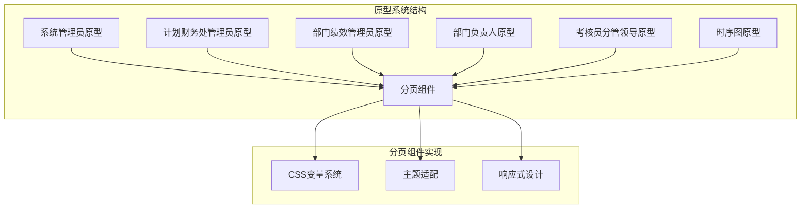
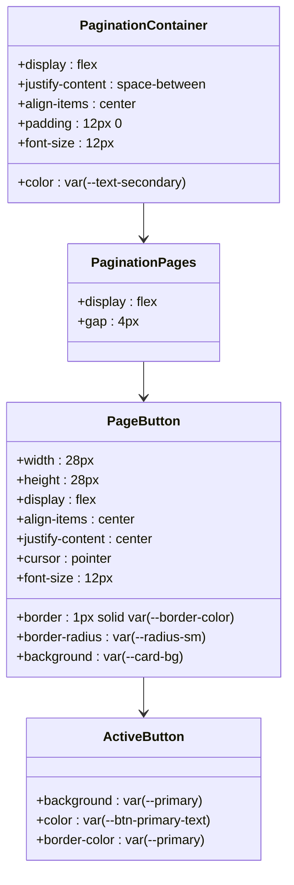
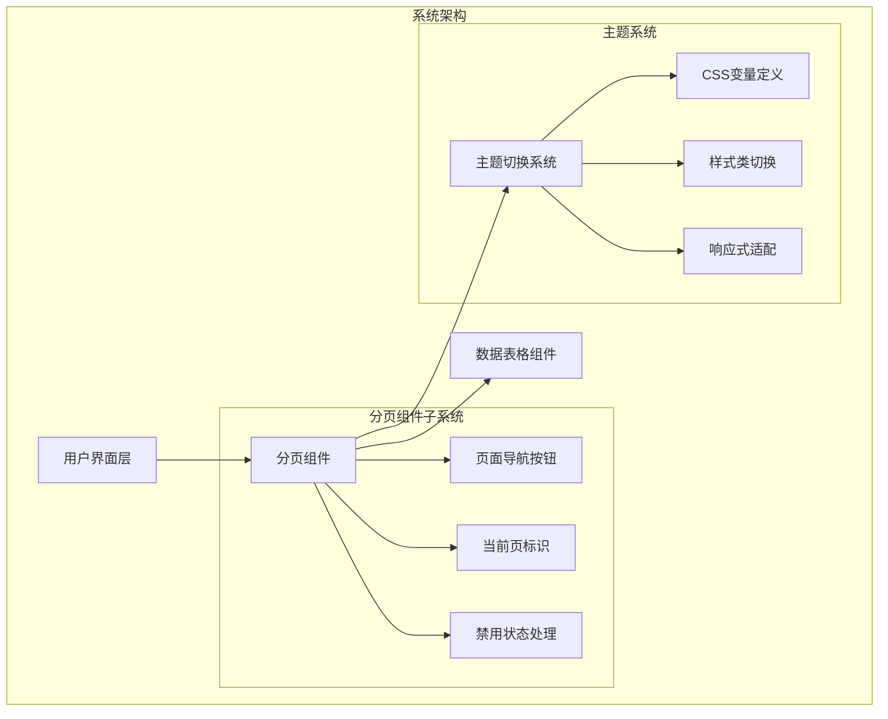
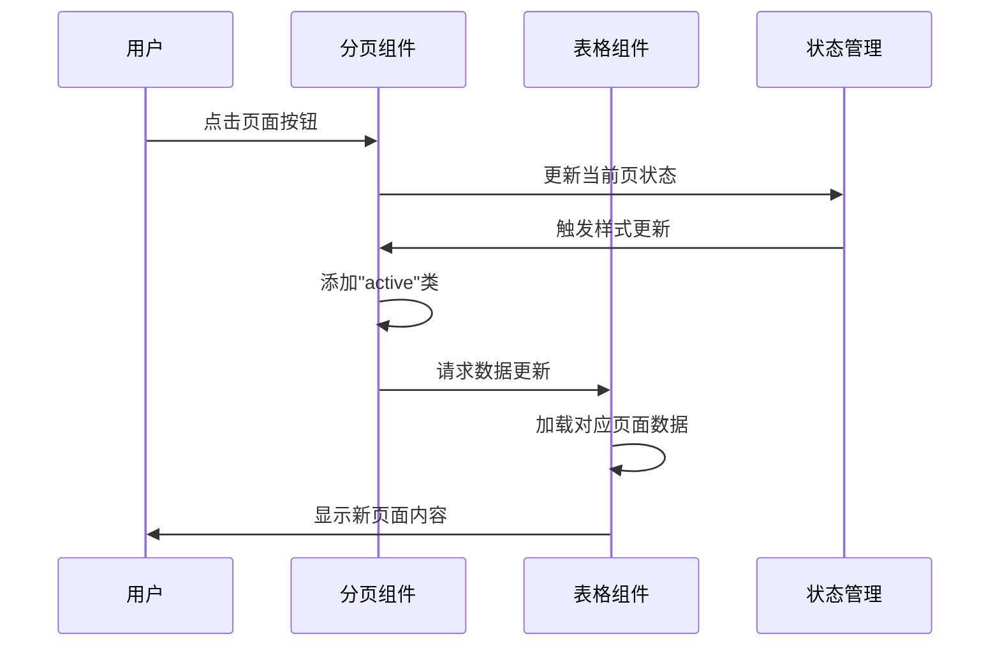
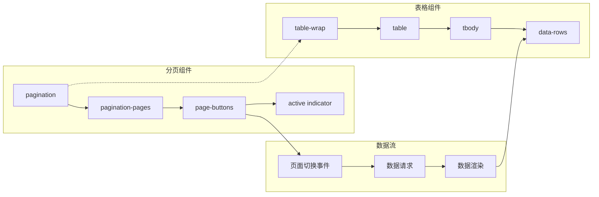
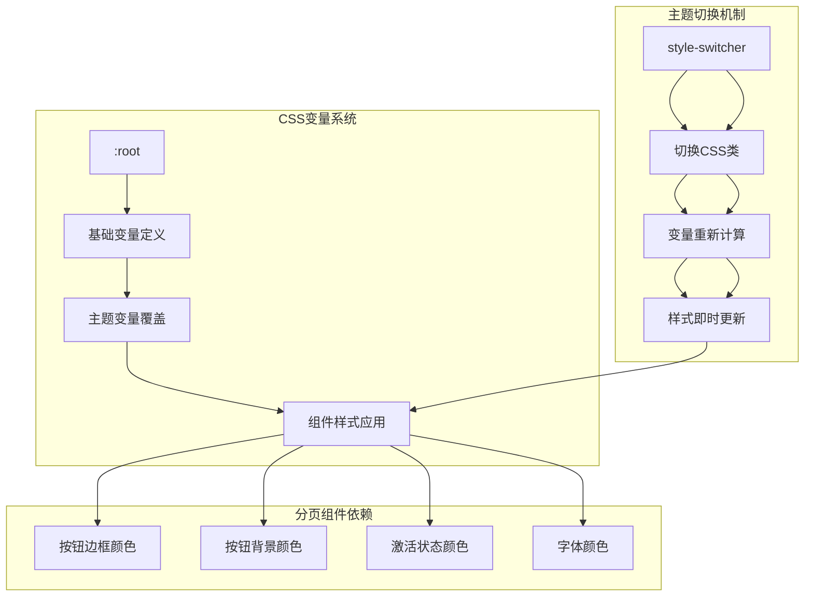

# 分页组件

<cite>
**本文档引用的文件**
- [系统管理员原型-v1.html](file://月度业绩考核原型设计初稿/1-系统管理员原型-v1.html)
- [计划财务处业绩考核管理员原型-v1.html](file://月度业绩考核原型设计初稿/2-计划财务处业绩考核管理员原型-v1.html)
- [部门绩效管理员原型-v1.html](file://月度业绩考核原型设计初稿/3-部门绩效管理员原型-v1.html)
- [部门负责人原型-v1.html](file://月度业绩考核原型设计初稿/4-部门负责人原型-v1.html)
- [考核员分管领导原型-v1.html](file://月度业绩考核原型设计初稿/5-考核员分管领导原型-v1.html)
- [时序图-v1.html](file://月度业绩考核原型设计初稿/6-时序图-v1.html)
</cite>

## 目录
1. [简介](#简介)
2. [项目结构](#项目结构)
3. [核心组件](#核心组件)
4. [架构概览](#架构概览)
5. [详细组件分析](#详细组件分析)
6. [依赖关系分析](#依赖关系分析)
7. [性能考虑](#性能考虑)
8. [故障排除指南](#故障排除指南)
9. [结论](#结论)

## 简介

分页组件是月度业绩考核管理系统中的关键UI组件，负责处理大量数据的分页展示。该组件提供了直观的页面导航功能，支持多种主题风格，并与表格组件深度集成，实现了大数据量场景下的高效数据浏览体验。

该分页组件采用纯CSS实现，无需JavaScript即可完成基本的页面切换功能，同时具备良好的可定制性和响应式特性。

## 项目结构

该项目是一个基于HTML/CSS的前端原型系统，包含多个角色的界面原型：



**图表来源**
- [系统管理员原型-v1.html:244-249](file://月度业绩考核原型设计初稿/1-系统管理员原型-v1.html#L244-L249)
- [计划财务处业绩考核管理员原型-v1.html:275-279](file://月度业绩考核原型设计初稿/2-计划财务处业绩考核管理员原型-v1.html#L275-L279)

**章节来源**
- [系统管理员原型-v1.html:1-635](file://月度业绩考核原型设计初稿/1-系统管理员原型-v1.html#L1-L635)
- [计划财务处业绩考核管理员原型-v1.html:1-1039](file://月度业绩考核原型设计初稿/2-计划财务处业绩考核管理员原型-v1.html#L1-L1039)

## 核心组件

### 分页容器结构

分页组件采用简洁的HTML结构设计，主要包含以下元素：



**图表来源**
- [系统管理员原型-v1.html:244-249](file://月度业绩考核原型设计初稿/1-系统管理员原型-v1.html#L244-L249)
- [计划财务处业绩考核管理员原型-v1.html:275-279](file://月度业绩考核原型设计初稿/2-计划财务处业绩考核管理员原型-v1.html#L275-L279)

### 主题适配系统

分页组件支持四种不同的主题风格，每种主题都有独特的视觉特征：

| 主题 | 关键特征 | CSS变量 |
|------|----------|---------|
| 默认风格 | 经典蓝色主题 | `--primary: #2d5aa0` |
| 百度商务 | 深蓝色商务风格 | `--primary: #2932e1` |
| 飞书应用 | 现代科技感设计 | `--primary: #3370ff` |
| 科技风 | 未来感蓝绿色调 | `--primary: #00d4ff` |
| 央企国企 | 传统红色企业风格 | `--primary: #c41e3a` |

**章节来源**
- [系统管理员原型-v1.html:8-149](file://月度业绩考核原型设计初稿/1-系统管理员原型-v1.html#L8-L149)
- [计划财务处业绩考核管理员原型-v1.html:8-184](file://月度业绩考核原型设计初稿/2-计划财务处业绩考核管理员原型-v1.html#L8-L184)

## 架构概览

分页组件在整个系统架构中扮演着数据导航的关键角色：



**图表来源**
- [系统管理员原型-v1.html:282-289](file://月度业绩考核原型设计初稿/1-系统管理员原型-v1.html#L282-L289)
- [部门负责人原型-v1.html:342-348](file://月度业绩考核原型设计初稿/4-部门负责人原型-v1.html#L342-L348)

## 详细组件分析

### 页面导航按钮实现

分页组件的核心是页面导航按钮，采用统一的设计规范：

```mermaid
flowchart TD
A[分页按钮初始化] --> B{检查按钮类型}
B --> |数字按钮| C[应用默认样式]
B --> |上一页/下一页| D[应用导航样式]
B --> |省略号| E[应用省略号样式]
C --> F[设置尺寸: 28px × 28px]
C --> G[设置边框: 1px solid var(--border-color)]
C --> H[设置圆角: var(--radius-sm)]
C --> I[设置光标: pointer]
D --> J[应用导航图标]
D --> K[保持统一尺寸]
E --> L[应用省略号显示]
E --> M[减少视觉干扰]
F --> N[悬停状态处理]
G --> N
H --> N
I --> N
J --> N
K --> N
L --> N
M --> N
N --> O[点击事件绑定]
O --> P[页面切换逻辑]
```

**图表来源**
- [系统管理员原型-v1.html:246-248](file://月度业绩考核原型设计初稿/1-系统管理员原型-v1.html#L246-L248)
- [计划财务处业绩考核管理员原型-v1.html:276-278](file://月度业绩考核原型设计初稿/2-计划财务处业绩考核管理员原型-v1.html#L276-L278)

### 当前页标识机制

当前页的标识通过CSS类实现，确保视觉反馈的一致性：



**图表来源**
- [系统管理员原型-v1.html:356](file://月度业绩考核原型设计初稿/1-系统管理员原型-v1.html#L356)
- [部门绩效管理员原型-v1.html:520](file://月度业绩考核原型设计初稿/3-部门绩效管理员原型-v1.html#L520)

### 禁用状态处理

分页组件正确处理了各种禁用状态，确保用户体验的完整性：

| 状态类型 | 触发条件 | 视觉表现 | 用户反馈 |
|----------|----------|----------|----------|
| 首页禁用 | 当前页为第1页 | 灰色显示，无点击效果 | 无法进一步向前翻页 |
| 末页禁用 | 当前页为最后一页 | 灰色显示，无点击效果 | 无法进一步向后翻页 |
| 单页禁用 | 总记录数小于等于分页容量 | 按钮隐藏或禁用 | 不显示分页导航 |
| 加载中 | 数据正在加载 | 旋转指示器，禁止交互 | 等待数据加载完成 |

**章节来源**
- [部门负责人原型-v1.html:527-534](file://月度业绩考核原型设计初稿/4-部门负责人原型-v1.html#L527-L534)
- [考核员分管领导原型-v1.html:337-340](file://月度业绩考核原型设计初稿/5-考核员分管领导原型-v1.html#L337-L340)

### 与表格组件的集成

分页组件与表格组件形成了紧密的协作关系：



**图表来源**
- [系统管理员原型-v1.html:356](file://月度业绩考核原型设计初稿/1-系统管理员原型-v1.html#L356)
- [计划财务处业绩考核管理员原型-v1.html:444](file://月度业绩考核原型设计初稿/2-计划财务处业绩考核管理员原型-v1.html#L444)

**章节来源**
- [系统管理员原型-v1.html:347-356](file://月度业绩考核原型设计初稿/1-系统管理员原型-v1.html#L347-L356)
- [部门绩效管理员原型-v1.html:520](file://月度业绩考核原型设计初稿/3-部门绩效管理员原型-v1.html#L520)

## 依赖关系分析

### CSS变量依赖

分页组件高度依赖CSS变量系统，实现了主题的动态切换：



**图表来源**
- [系统管理员原型-v1.html:8-149](file://月度业绩考核原型设计初稿/1-系统管理员原型-v1.html#L8-L149)
- [系统管理员原型-v1.html:613-619](file://月度业绩考核原型设计初稿/1-系统管理员原型-v1.html#L613-L619)

### JavaScript交互依赖

虽然分页组件主要通过CSS实现，但仍有一些JavaScript交互支持：

| 功能模块 | 实现方式 | 依赖关系 |
|----------|----------|----------|
| 主题切换 | `switchStyle()`函数 | DOM元素类名操作 |
| 页面切换 | 事件监听器 | 页面按钮点击事件 |
| 动态内容更新 | AJAX请求 | 服务器端数据接口 |
| 状态管理 | 变量存储 | 浏览器本地存储 |

**章节来源**
- [系统管理员原型-v1.html:613-632](file://月度业绩考核原型设计初稿/1-系统管理员原型-v1.html#L613-L632)
- [部门负责人原型-v1.html:342-348](file://月度业绩考核原型设计初稿/4-部门负责人原型-v1.html#L342-L348)

## 性能考虑

### 渲染优化

分页组件采用了多项性能优化策略：

1. **CSS硬件加速**: 使用CSS3变换和过渡属性，利用GPU加速渲染
2. **最小DOM操作**: 通过CSS类切换而非频繁的DOM元素创建/销毁
3. **事件委托**: 在可能的情况下使用事件委托减少事件处理器数量
4. **懒加载**: 对于大数据集，考虑实现虚拟滚动或分块加载

### 内存管理

- **样式缓存**: 浏览器会缓存CSS样式，减少重复计算
- **事件清理**: 在组件销毁时清理事件监听器，防止内存泄漏
- **变量复用**: 复用CSS变量值，减少样式计算开销

## 故障排除指南

### 常见问题及解决方案

| 问题类型 | 症状描述 | 可能原因 | 解决方案 |
|----------|----------|----------|----------|
| 按钮点击无效 | 点击无反应 | JavaScript事件未绑定 | 检查事件监听器注册 |
| 样式显示异常 | 按钮颜色不正确 | CSS变量未正确应用 | 验证主题类名切换 |
| 响应式问题 | 移动端显示错乱 | 媒体查询未生效 | 检查viewport设置 |
| 性能问题 | 页面切换卡顿 | 过多DOM操作 | 优化CSS类切换逻辑 |

### 调试技巧

1. **开发者工具检查**: 使用浏览器开发者工具检查元素的最终样式
2. **CSS变量验证**: 在控制台中检查`:root`变量的实际值
3. **事件监听器监控**: 检查是否有重复的事件监听器注册
4. **性能分析**: 使用Chrome DevTools的Performance面板分析渲染性能

**章节来源**
- [系统管理员原型-v1.html:613-632](file://月度业绩考核原型设计初稿/1-系统管理员原型-v1.html#L613-L632)

## 结论

分页组件作为月度业绩考核管理系统的重要组成部分，展现了优秀的前端架构设计。其特点包括：

1. **高度可定制性**: 通过CSS变量系统支持多种主题风格
2. **良好的用户体验**: 直观的页面导航和清晰的状态反馈
3. **响应式设计**: 适配不同屏幕尺寸和设备类型
4. **性能优化**: 采用CSS实现减少JavaScript依赖
5. **可维护性**: 模块化的代码结构便于后续扩展

该组件为整个系统的数据浏览提供了稳定可靠的基础，是构建复杂业务应用的良好范例。