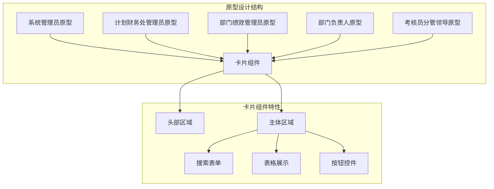
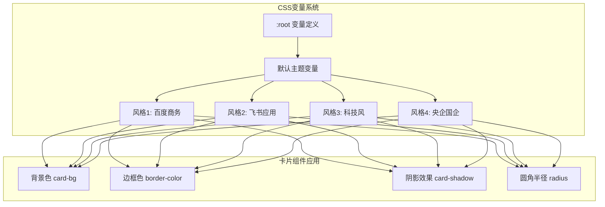
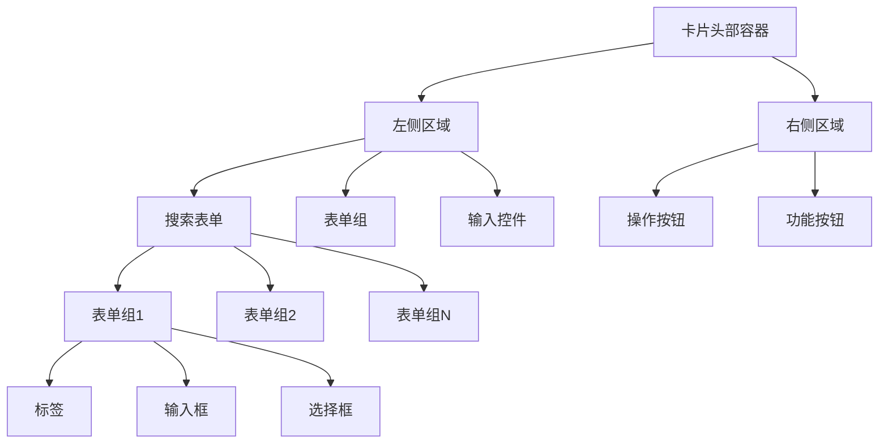
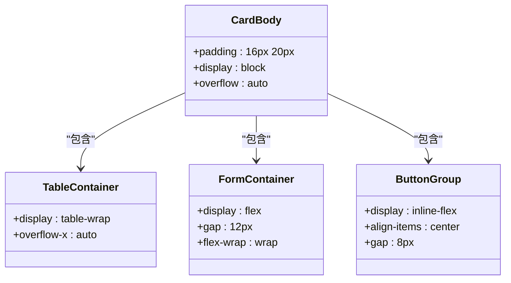
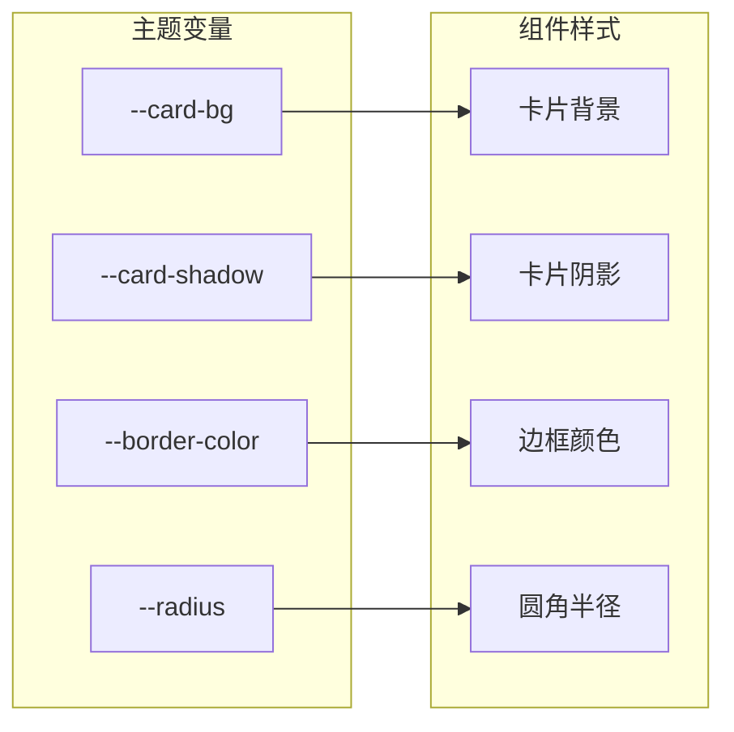
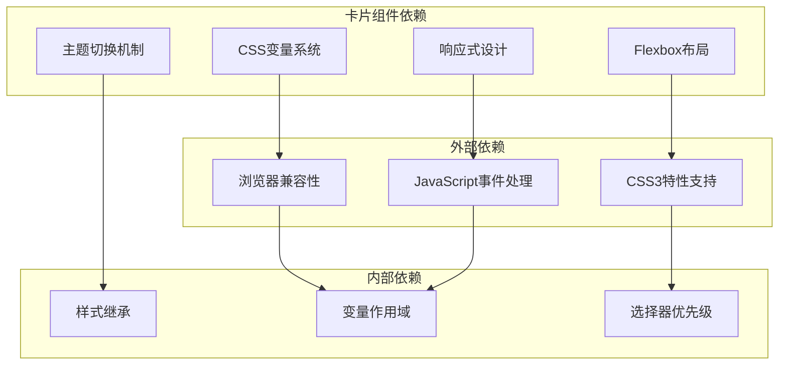

# 卡片组件

<cite>
**本文档引用的文件**
- [系统管理员原型-v1.html](file://月度业绩考核原型设计初稿/1-系统管理员原型-v1.html)
- [计划财务处业绩考核管理员原型-v1.html](file://月度业绩考核原型设计初稿/2-计划财务处业绩考核管理员原型-v1.html)
- [部门绩效管理员原型-v1.html](file://月度业绩考核原型设计初稿/3-部门绩效管理员原型-v1.html)
- [部门负责人原型-v1.html](file://月度业绩考核原型设计初稿/4-部门负责人原型-v1.html)
- [考核员分管领导原型-v1.html](file://月度业绩考核原型设计初稿/5-考核员分管领导原型-v1.html)
</cite>

## 目录
1. [简介](#简介)
2. [项目结构](#项目结构)
3. [核心组件](#核心组件)
4. [架构概览](#架构概览)
5. [详细组件分析](#详细组件分析)
6. [依赖关系分析](#依赖关系分析)
7. [性能考虑](#性能考虑)
8. [故障排除指南](#故障排除指南)
9. [结论](#结论)
10. [附录](#附录)

## 简介

卡片组件是本项目中最重要的UI组件之一，用于展示和组织页面内容。它提供了统一的视觉容器，支持头部(header)、主体(body)等结构化布局，并通过CSS变量系统实现了灵活的主题适配能力。

卡片组件在整个月度业绩考核管理系统中扮演着核心角色，从系统管理员界面到部门负责人界面，从指标设定到考核评估，几乎所有的数据展示和交互都基于卡片组件构建。

## 项目结构

该项目采用多角色原型设计，每个角色都有独立的HTML文件，但共享相同的卡片组件实现：



**图表来源**
- [系统管理员原型-v1.html:213-248](file://月度业绩考核原型设计初稿/1-系统管理员原型-v1.html#L213-L248)
- [计划财务处业绩考核管理员原型-v1.html:245-247](file://月度业绩考核原型设计初稿/2-计划财务处业绩考核管理员原型-v1.html#L245-L247)
- [部门绩效管理员原型-v1.html:244-247](file://月度业绩考核原型设计初稿/3-部门绩效管理员原型-v1.html#L244-L247)

**章节来源**
- [系统管理员原型-v1.html:1-635](file://月度业绩考核原型设计初稿/1-系统管理员原型-v1.html#L1-L635)
- [计划财务处业绩考核管理员原型-v1.html:1-1039](file://月度业绩考核原型设计初稿/2-计划财务处业绩考核管理员原型-v1.html#L1-L1039)

## 核心组件

### 卡片组件基础结构

卡片组件采用简洁而强大的结构设计，包含以下核心部分：

#### 基础样式定义
卡片组件的基础样式定义在所有原型文件的CSS部分，使用CSS变量实现主题系统的统一管理：

```css
.card { 
    background: var(--card-bg); 
    border-radius: var(--radius); 
    box-shadow: var(--card-shadow); 
    margin-bottom: 16px; 
    border: 1px solid var(--border-color); 
}
.card-header { 
    padding: 14px 20px; 
    border-bottom: 1px solid var(--border-color); 
    display: flex; 
    justify-content: space-between; 
    align-items: center; 
}
.card-body { 
    padding: 16px 20px; 
}
```

#### 头部区域设计
头部区域专门用于放置标题和操作按钮，支持灵活的布局和响应式设计：

- **标题展示**：使用`<h3>`标签显示卡片标题
- **操作按钮**：右侧区域放置主要操作按钮
- **搜索表单**：在头部区域集成搜索和筛选功能

#### 主体区域设计
主体区域承载主要内容，支持多种内容类型的展示：

- **表格数据**：用于展示结构化数据
- **表单控件**：支持用户输入和交互
- **状态标签**：显示当前状态信息
- **分页组件**：处理大量数据的分页显示

**章节来源**
- [系统管理员原型-v1.html:213-248](file://月度业绩考核原型设计初稿/1-系统管理员原型-v1.html#L213-L248)
- [计划财务处业绩考核管理员原型-v1.html:245-247](file://月度业绩考核原型设计初稿/2-计划财务处业绩考核管理员原型-v1.html#L245-L247)
- [部门绩效管理员原型-v1.html:244-247](file://月度业绩考核原型设计初稿/3-部门绩效管理员原型-v1.html#L244-L247)

## 架构概览

### CSS变量系统架构

卡片组件通过CSS变量系统实现了高度的可定制性和主题适配能力：



**图表来源**
- [系统管理员原型-v1.html:9-35](file://月度业绩考核原型设计初稿/1-系统管理员原型-v1.html#L9-L35)
- [系统管理员原型-v1.html:38-85](file://月度业绩考核原型设计初稿/1-系统管理员原型-v1.html#L38-L85)
- [系统管理员原型-v1.html:104-149](file://月度业绩考核原型设计初稿/1-系统管理员原型-v1.html#L104-L149)

### 主题切换机制

系统提供了四种不同的主题风格，每种风格都针对特定的业务场景和用户体验需求：

| 主题风格 | 适用场景 | 关键特性 |
|---------|----------|----------|
| 默认风格 | 通用业务场景 | 标准的蓝色主色调，平衡的视觉效果 |
| 百度商务 | 商务网站风格 | 强调专业性和商务感 |
| 飞书应用 | 现代办公应用 | 简洁现代的设计语言 |
| 科技风 | 科技创新环境 | 前卫的科技感设计 |
| 央企国企 | 传统企业环境 | 庄重正式的企业风格 |

**章节来源**
- [系统管理员原型-v1.html:38-149](file://月度业绩考核原型设计初稿/1-系统管理员原型-v1.html#L38-L149)
- [计划财务处业绩考核管理员原型-v1.html:44-184](file://月度业绩考核原型设计初稿/2-计划财务处业绩考核管理员原型-v1.html#L44-L184)

## 详细组件分析

### 卡片头部(header)分析

#### 结构设计
卡片头部采用Flexbox布局，实现了响应式的双栏布局设计：



**图表来源**
- [系统管理员原型-v1.html:215-217](file://月度业绩考核原型设计初稿/1-系统管理员原型-v1.html#L215-L217)

#### 响应式设计
头部区域支持响应式布局，能够根据屏幕尺寸自动调整布局：

- **桌面端**：搜索表单和操作按钮并排显示
- **移动端**：搜索表单垂直堆叠，操作按钮居右对齐
- **平板端**：折中布局，平衡空间利用和可读性

### 卡片主体(body)分析

#### 内容组织结构
卡片主体区域采用模块化设计，支持多种内容类型的灵活组合：



**图表来源**
- [系统管理员原型-v1.html:245-247](file://月度业绩考核原型设计初稿/1-系统管理员原型-v1.html#L245-L247)

#### 数据展示模式

##### 表格数据展示
卡片组件支持复杂的数据表格展示，具备以下特性：

- **响应式表格**：支持横向滚动，适应小屏幕设备
- **悬停效果**：鼠标悬停时高亮显示行
- **状态标识**：使用彩色标签显示状态信息
- **分页支持**：处理大量数据的分页显示

##### 表单数据展示
对于需要用户交互的场景，卡片组件集成了完整的表单系统：

- **表单布局**：支持多列布局和响应式调整
- **输入验证**：实时验证用户输入
- **状态反馈**：提供清晰的操作反馈

**章节来源**
- [系统管理员原型-v1.html:235-248](file://月度业绩考核原型设计初稿/1-系统管理员原型-v1.html#L235-L248)
- [计划财务处业绩考核管理员原型-v1.html:264-267](file://月度业绩考核原型设计初稿/2-计划财务处业绩考核管理员原型-v1.html#L264-L267)

### 主题适配系统

#### CSS变量映射关系

卡片组件通过CSS变量实现了完整的主题适配系统：



**图表来源**
- [系统管理员原型-v1.html:18-19](file://月度业绩考核原型设计初稿/1-系统管理员原型-v1.html#L18-L19)

#### 主题切换实现

主题切换通过JavaScript动态修改DOM类名实现：

```javascript
function switchStyle(styleClass) {
    document.body.classList.remove('style-baidu', 'style-feishu', 'style-tech', 'style-guoqi');
    if (styleClass) document.body.classList.add(styleClass);
    // 更新按钮状态和激活样式
}
```

**章节来源**
- [系统管理员原型-v1.html:614-619](file://月度业绩考核原型设计初稿/1-系统管理员原型-v1.html#L614-L619)

## 依赖关系分析

### 组件间依赖关系



### 样式继承机制

卡片组件通过CSS继承实现了样式的统一管理：

- **全局样式**：定义基础的字体、颜色、间距等
- **组件样式**：定义具体的组件外观和行为
- **主题样式**：通过CSS变量覆盖全局样式
- **局部样式**：针对特定场景的微调

**章节来源**
- [系统管理员原型-v1.html:187-279](file://月度业绩考核原型设计初稿/1-系统管理员原型-v1.html#L187-L279)

## 性能考虑

### 样式性能优化

卡片组件在设计时充分考虑了性能优化：

- **CSS变量缓存**：浏览器会缓存CSS变量的计算结果
- **最小化重绘**：使用transform和opacity属性避免大规模重排
- **响应式媒体查询**：合理使用媒体查询减少不必要的样式计算
- **选择器优化**：避免使用过于复杂的选择器

### JavaScript性能优化

主题切换功能采用了高效的事件处理机制：

- **事件委托**：使用事件委托减少事件监听器数量
- **类名操作**：直接操作DOM类名比修改内联样式更高效
- **批量更新**：一次性切换多个主题类名

## 故障排除指南

### 常见问题及解决方案

#### 主题切换失效
**问题描述**：点击主题切换按钮后样式没有变化
**解决方案**：
1. 检查CSS变量是否正确加载
2. 确认JavaScript代码是否正常执行
3. 验证DOM元素的类名是否正确切换

#### 响应式布局异常
**问题描述**：在移动设备上布局错乱
**解决方案**：
1. 检查viewport meta标签是否正确设置
2. 验证CSS媒体查询的断点设置
3. 确认Flexbox属性的兼容性

#### 样式冲突问题
**问题描述**：卡片组件样式与其他组件冲突
**解决方案**：
1. 使用更具体的选择器限定作用范围
2. 检查CSS优先级和继承关系
3. 避免全局样式的过度使用

**章节来源**
- [系统管理员原型-v1.html:612-632](file://月度业绩考核原型设计初稿/1-系统管理员原型-v1.html#L612-L632)

## 结论

卡片组件作为本项目的核心UI组件，展现了优秀的架构设计和实现质量。通过CSS变量系统和主题适配机制，实现了高度的灵活性和可维护性。

### 主要优势

1. **统一的视觉语言**：通过CSS变量实现了完全一致的视觉体验
2. **灵活的主题系统**：支持多种主题风格，满足不同业务场景需求
3. **响应式设计**：完美适配各种设备和屏幕尺寸
4. **模块化架构**：清晰的组件结构便于维护和扩展
5. **性能优化**：采用多种优化策略确保良好的用户体验

### 最佳实践建议

1. **保持样式一致性**：遵循现有的CSS变量命名规范
2. **注重可访问性**：确保足够的颜色对比度和键盘导航支持
3. **测试多设备兼容性**：定期在不同设备和浏览器上进行测试
4. **文档化变更**：及时更新相关文档记录样式变更

## 附录

### 使用示例

#### 基础卡片组件使用
```html
<div class="card">
    <div class="card-header">
        <h3>卡片标题</h3>
        <button class="btn btn-primary">操作按钮</button>
    </div>
    <div class="card-body">
        <p>卡片内容区域</p>
    </div>
</div>
```

#### 带搜索表单的卡片
```html
<div class="card">
    <div class="card-header">
        <div class="search-form">
            <div class="form-group">
                <label>搜索关键词</label>
                <input type="text" placeholder="请输入搜索内容">
            </div>
            <button class="btn btn-primary">搜索</button>
        </div>
    </div>
    <div class="card-body">
        <!-- 数据内容 -->
    </div>
</div>
```

### 组合使用模式

#### 卡片嵌套模式
卡片组件支持嵌套使用，适用于复杂的布局需求：

```html
<div class="card">
    <div class="card-body">
        <div class="card">
            <div class="card-body">
                <!-- 内层卡片内容 -->
            </div>
        </div>
    </div>
</div>
```

#### 卡片网格布局
通过CSS Grid或Flexbox可以实现卡片的网格布局：

```css
.card-grid {
    display: grid;
    grid-template-columns: repeat(auto-fit, minmax(300px, 1fr));
    gap: 20px;
}
```

**章节来源**
- [系统管理员原型-v1.html:335-358](file://月度业绩考核原型设计初稿/1-系统管理员原型-v1.html#L335-L358)
- [计划财务处业绩考核管理员原型-v1.html:359-446](file://月度业绩考核原型设计初稿/2-计划财务处业绩考核管理员原型-v1.html#L359-L446)