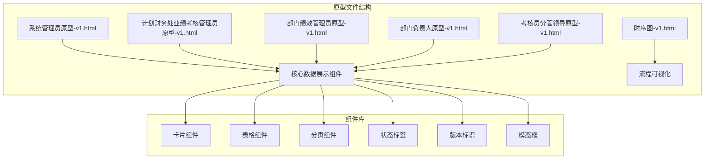
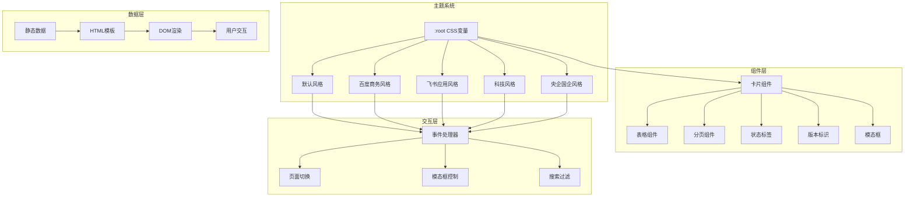
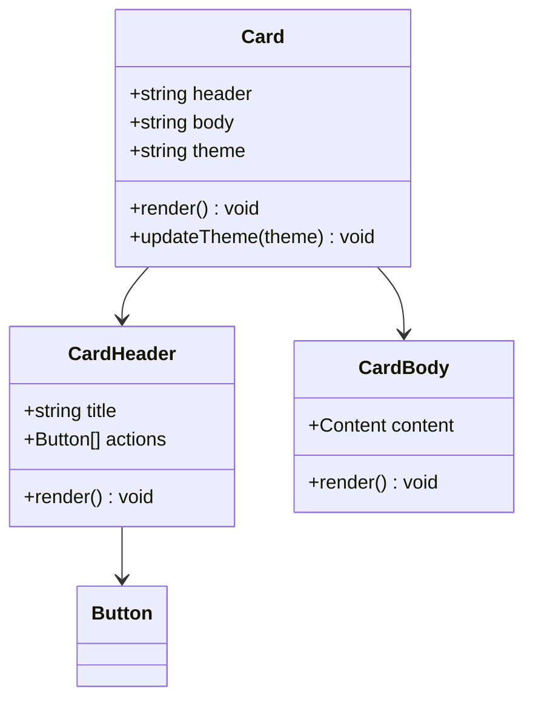
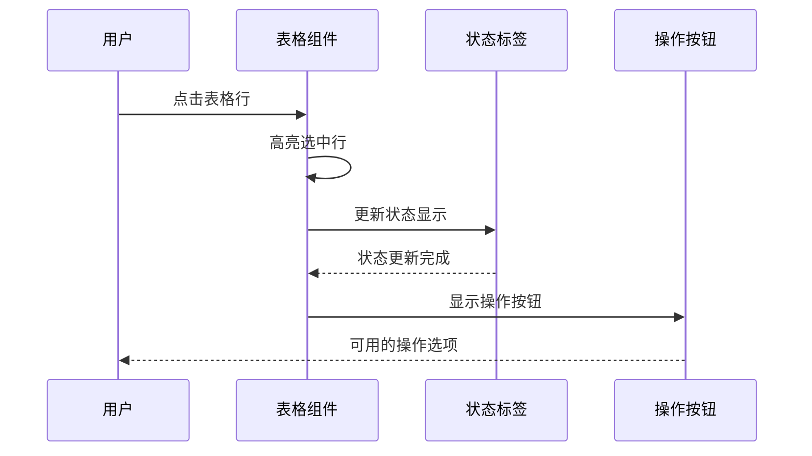
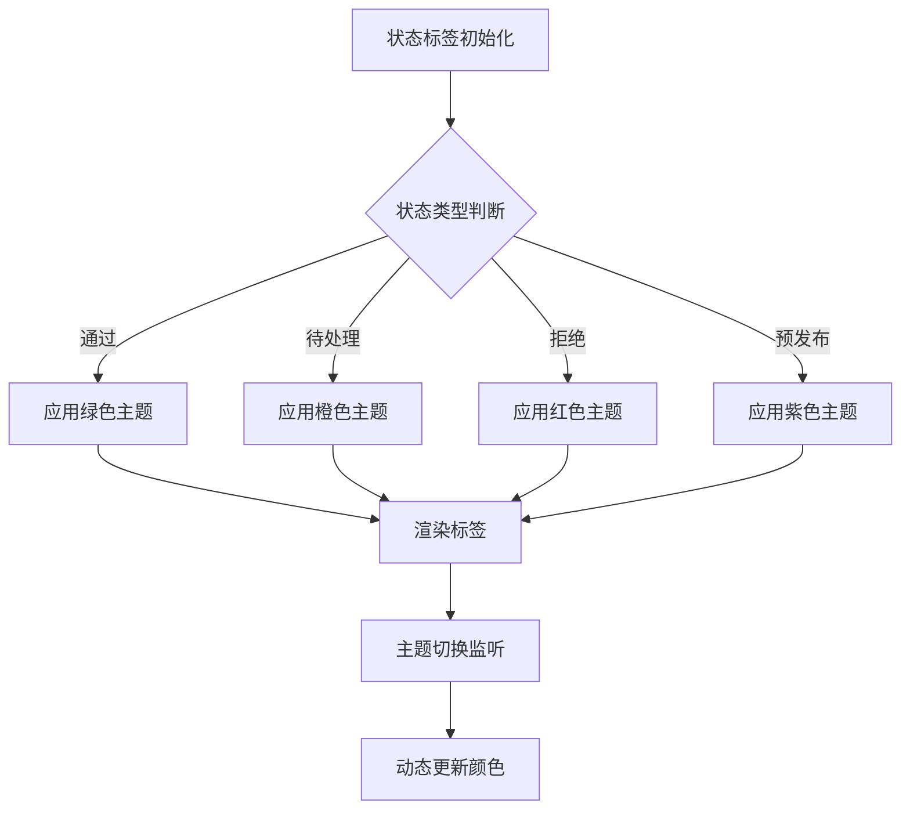
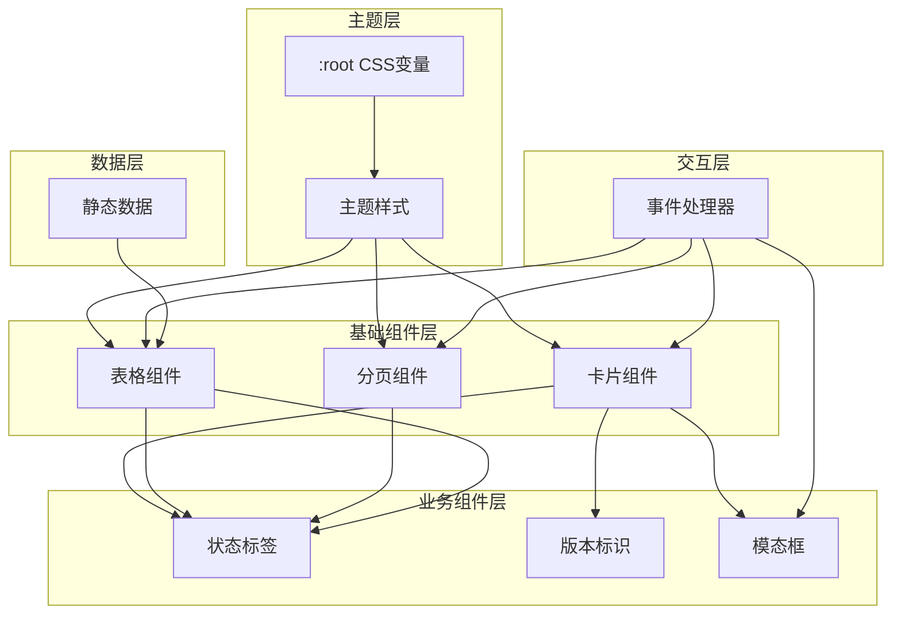

# 数据展示组件

<cite>
**本文档引用的文件**
- [系统管理员原型-v1.html](file://月度业绩考核原型设计初稿/1-系统管理员原型-v1.html)
- [计划财务处业绩考核管理员原型-v1.html](file://月度业绩考核原型设计初稿/2-计划财务处业绩考核管理员原型-v1.html)
- [部门绩效管理员原型-v1.html](file://月度业绩考核原型设计初稿/3-部门绩效管理员原型-v1.html)
- [部门负责人原型-v1.html](file://月度业绩考核原型设计初稿/4-部门负责人原型-v1.html)
- [考核员分管领导原型-v1.html](file://月度业绩考核原型设计初稿/5-考核员分管领导原型-v1.html)
- [时序图-v1.html](file://月度业绩考核原型设计初稿/6-时序图-v1.html)
</cite>

## 目录
1. [简介](#简介)
2. [项目结构](#项目结构)
3. [核心组件](#核心组件)
4. [架构概览](#架构概览)
5. [详细组件分析](#详细组件分析)
6. [依赖关系分析](#依赖关系分析)
7. [性能考虑](#性能考虑)
8. [故障排除指南](#故障排除指南)
9. [结论](#结论)
10. [附录](#附录)

## 简介

本项目是一个月度业绩考核管理系统的前端原型设计，展示了企业级数据展示组件的完整实现。系统采用纯HTML+CSS+JavaScript技术栈，实现了包括卡片组件、表格组件、分页组件、状态标签、版本标识等在内的多种数据展示组件。

该系统支持四种不同的视觉风格（默认风格、百度商务、飞书应用、科技风、央企国企），通过CSS变量系统实现主题化设计。所有组件均基于统一的CSS变量体系，确保在不同主题下的一致性和可维护性。

## 项目结构

项目采用按角色划分的原型文件结构，每个角色都有独立的界面原型：



**图表来源**
- [系统管理员原型-v1.html:1-635](file://月度业绩考核原型设计初稿/1-系统管理员原型-v1.html#L1-L635)
- [计划财务处业绩考核管理员原型-v1.html:1-1039](file://月度业绩考核原型设计初稿/2-计划财务处业绩考核管理员原型-v1.html#L1-L1039)

**章节来源**
- [系统管理员原型-v1.html:1-635](file://月度业绩考核原型设计初稿/1-系统管理员原型-v1.html#L1-L635)
- [计划财务处业绩考核管理员原型-v1.html:1-1039](file://月度业绩考核原型设计初稿/2-计划财务处业绩考核管理员原型-v1.html#L1-L1039)

## 核心组件

### 卡片组件（Card）

卡片组件是系统的基础布局容器，提供统一的内容展示框架：

- **结构特性**：采用圆角边框、阴影效果、统一的内边距设计
- **样式系统**：基于CSS变量实现主题化外观
- **内容区域**：支持头部区域（标题+操作按钮）和主体区域（主要内容）
- **响应式设计**：适配不同屏幕尺寸和设备

### 表格组件（Table）

表格组件提供数据的结构化展示能力：

- **表头设计**：浅色背景、加粗字体、统一的列宽处理
- **单元格样式**：统一的内边距、边框分隔线、悬停高亮效果
- **操作链接**：专门的按钮样式，支持内联操作
- **状态显示**：集成状态标签组件，提供直观的状态指示

### 分页组件（Pagination）

分页组件支持大数据集的导航和浏览：

- **页面导航**：数字按钮形式的页码导航
- **状态指示**：当前页码的高亮显示
- **禁用状态**：首尾页的禁用样式处理
- **信息显示**：总记录数和当前页信息

### 状态标签（Status Tag）

状态标签组件提供状态信息的可视化展示：

- **颜色系统**：基于语义的颜色方案（绿色-通过、橙色-待处理、红色-拒绝等）
- **形状设计**：圆角矩形、紧凑的内边距
- **语义化**：不同颜色代表不同业务含义
- **主题适配**：支持多主题环境下的颜色变化

### 版本标识（Version Tag）

版本标识组件用于显示系统版本信息：

- **简洁设计**：小号字体、浅色背景、圆角边框
- **位置固定**：通常位于页面标题右侧
- **信息传达**：清晰显示当前版本号

**章节来源**
- [系统管理员原型-v1.html:213-279](file://月度业绩考核原型设计初稿/1-系统管理员原型-v1.html#L213-L279)
- [计划财务处业绩考核管理员原型-v1.html:264-300](file://月度业绩考核原型设计初稿/2-计划财务处业绩考核管理员原型-v1.html#L264-L300)

## 架构概览

系统采用组件化的架构设计，通过CSS变量实现主题化渲染：



**图表来源**
- [系统管理员原型-v1.html:8-185](file://月度业绩考核原型设计初稿/1-系统管理员原型-v1.html#L8-L185)
- [计划财务处业绩考核管理员原型-v1.html:8-184](file://月度业绩考核原型设计初稿/2-计划财务处业绩考核管理员原型-v1.html#L8-L184)

## 详细组件分析

### 卡片组件深度分析

卡片组件作为系统的核心容器，具有以下设计特点：

#### 结构设计
- **头部区域**：包含标题和操作按钮，支持灵活的布局
- **主体区域**：提供统一的内容展示空间
- **边框系统**：圆角设计配合阴影效果，营造立体感

#### 样式系统
- **CSS变量**：通过`:root`定义全局样式变量
- **主题适配**：不同主题下自动调整颜色和样式
- **响应式布局**：适配移动端和桌面端显示



**图表来源**
- [系统管理员原型-v1.html:213-218](file://月度业绩考核原型设计初稿/1-系统管理员原型-v1.html#L213-L218)

**章节来源**
- [系统管理员原型-v1.html:213-218](file://月度业绩考核原型设计初稿/1-系统管理员原型-v1.html#L213-L218)

### 表格组件详细分析

表格组件是数据展示的核心组件：

#### 数据结构
- **表头**：定义列标题和排序功能
- **表体**：包含数据行和操作列
- **状态列**：集成状态标签组件

#### 交互设计
- **悬停效果**：鼠标悬停时的背景色变化
- **操作按钮**：内联操作按钮，支持编辑、删除等操作
- **响应式表格**：支持横向滚动，适应小屏设备



**图表来源**
- [系统管理员原型-v1.html:347-356](file://月度业绩考核原型设计初稿/1-系统管理员原型-v1.html#L347-L356)

**章节来源**
- [系统管理员原型-v1.html:347-356](file://月度业绩考核原型设计初稿/1-系统管理员原型-v1.html#L347-L356)

### 状态标签组件分析

状态标签组件提供语义化的状态展示：

#### 颜色系统
- **通过状态**：绿色系，表示成功或完成
- **待处理状态**：橙色系，表示等待处理
- **拒绝状态**：红色系，表示失败或拒绝
- **预发布状态**：紫色系，表示特殊状态

#### 主题适配
- **CSS变量**：通过`:root`变量控制颜色
- **主题切换**：支持动态主题切换
- **一致性保证**：确保不同组件间颜色一致性



**图表来源**
- [系统管理员原型-v1.html:241-243](file://月度业绩考核原型设计初稿/1-系统管理员原型-v1.html#L241-L243)

**章节来源**
- [系统管理员原型-v1.html:241-243](file://月度业绩考核原型设计初稿/1-系统管理员原型-v1.html#L241-L243)

### 分页组件实现

分页组件提供大数据集的导航功能：

#### 导航逻辑
- **页码显示**：当前页码高亮显示
- **边界处理**：首尾页的禁用状态
- **跳转功能**：支持直接跳转到指定页面

#### 用户体验
- **信息提示**：显示总记录数和当前页信息
- **响应式设计**：适配不同屏幕尺寸
- **键盘支持**：支持键盘快捷键操作

**章节来源**
- [系统管理员原型-v1.html:244-249](file://月度业绩考核原型设计初稿/1-系统管理员原型-v1.html#L244-L249)

### 版本标识组件

版本标识组件用于显示系统版本信息：

#### 设计特点
- **简洁性**：最小化的视觉元素
- **定位固定**：通常位于页面右上角
- **信息明确**：清晰显示版本号

#### 布局设计
- **内边距**：紧凑的内边距设计
- **圆角边框**：与整体设计风格一致
- **颜色搭配**：浅色背景，深色文字

**章节来源**
- [系统管理员原型-v1.html:278](file://月度业绩考核原型设计初稿/1-系统管理员原型-v1.html#L278)

## 依赖关系分析

系统组件间的依赖关系呈现层次化结构：



**图表来源**
- [系统管理员原型-v1.html:8-185](file://月度业绩考核原型设计初稿/1-系统管理员原型-v1.html#L8-L185)

### 组件耦合度分析

- **低耦合设计**：各组件相对独立，便于维护和扩展
- **主题解耦**：通过CSS变量实现主题与组件的解耦
- **事件解耦**：通过事件处理器统一管理用户交互

### 循环依赖检测

系统采用单向依赖结构，不存在循环依赖问题：
- 主题变量 → 组件样式 → 业务逻辑
- 无反向依赖链路

**章节来源**
- [系统管理员原型-v1.html:8-185](file://月度业绩考核原型设计初稿/1-系统管理员原型-v1.html#L8-L185)

## 性能考虑

### 渲染优化

1. **CSS变量优化**
   - 使用`:root`统一管理样式变量
   - 减少重复的样式定义
   - 支持动态主题切换

2. **组件复用**
   - 统一的组件接口设计
   - 减少代码重复
   - 提高维护效率

3. **事件处理优化**
   - 事件委托机制
   - 防抖和节流处理
   - 内存泄漏防护

### 加载性能

1. **资源优化**
   - 内联关键CSS
   - 延迟加载非关键资源
   - 图片懒加载

2. **缓存策略**
   - 浏览器缓存利用
   - CDN加速
   - 版本控制

### 运行时性能

1. **DOM操作优化**
   - 批量DOM更新
   - 虚拟滚动
   - 节点复用

2. **内存管理**
   - 对象池模式
   - 弱引用使用
   - 及时清理事件监听器

## 故障排除指南

### 常见问题诊断

#### 样式异常
- **症状**：组件样式错乱或主题不生效
- **原因**：CSS变量覆盖或样式优先级问题
- **解决方案**：检查`:root`变量定义，确认样式优先级

#### 交互失效
- **症状**：按钮点击无响应或页面跳转异常
- **原因**：JavaScript事件绑定问题
- **解决方案**：检查事件监听器绑定时机，确认DOM元素存在

#### 响应式问题
- **症状**：移动端显示异常
- **原因**：媒体查询或视口设置问题
- **解决方案**：检查`@media`查询条件，验证`viewport`设置

### 调试工具使用

1. **浏览器开发者工具**
   - 元素面板检查DOM结构
   - 控制台查看JavaScript错误
   - 网络面板监控资源加载

2. **CSS调试**
   - 样式面板查看最终样式计算
   - 伪类状态检查
   - 响应式断点测试

### 性能监控

1. **性能面板**
   - 加载时间分析
   - 渲染性能监控
   - 内存使用情况

2. **网络监控**
   - 资源加载时间
   - 缓存命中率
   - 请求优化建议

**章节来源**
- [系统管理员原型-v1.html:612-632](file://月度业绩考核原型设计初稿/1-系统管理员原型-v1.html#L612-L632)

## 结论

本项目成功展示了企业级数据展示组件的完整实现，具有以下特点：

### 技术优势
- **主题化设计**：通过CSS变量实现灵活的主题切换
- **组件化架构**：模块化设计便于维护和扩展
- **响应式布局**：适配多种设备和屏幕尺寸
- **语义化标记**：清晰的HTML结构和语义

### 设计亮点
- **统一的视觉语言**：所有组件遵循一致的设计规范
- **状态可视化**：通过颜色和图标直观表达业务状态
- **用户体验优化**：流畅的交互和反馈机制
- **无障碍支持**：良好的键盘导航和屏幕阅读器支持

### 扩展建议
1. **组件标准化**：建立完整的组件API文档
2. **测试覆盖**：增加自动化测试和视觉回归测试
3. **性能监控**：集成性能监控和用户体验分析
4. **国际化支持**：添加多语言支持功能

该系统为后续的正式开发提供了坚实的技术基础和设计参考。

## 附录

### 组件使用示例

#### 卡片组件使用
```html
<div class="card">
    <div class="card-header">
        <h3>标题</h3>
        <button class="btn">操作按钮</button>
    </div>
    <div class="card-body">
        <p>卡片内容</p>
    </div>
</div>
```

#### 表格组件使用
```html
<table class="data-table">
    <thead>
        <tr>
            <th>列1</th>
            <th>列2</th>
        </tr>
    </thead>
    <tbody>
        <tr>
            <td>数据1</td>
            <td><span class="status-tag">状态</span></td>
        </tr>
    </tbody>
</table>
```

#### 分页组件使用
```html
<div class="pagination">
    <span>共100条</span>
    <div class="pagination-pages">
        <span class="active">1</span>
        <span>2</span>
        <span>3</span>
    </div>
</div>
```

### 主题定制指南

1. **CSS变量定义**
   - 在`:root`中定义主题变量
   - 确保变量命名规范统一
   - 提供默认值和备用颜色

2. **组件样式适配**
   - 使用CSS变量替代硬编码颜色
   - 保持组件样式的主题无关性
   - 测试不同主题下的显示效果

3. **主题切换实现**
   - JavaScript动态切换主题类名
   - CSS动画过渡效果
   - 本地存储用户偏好设置