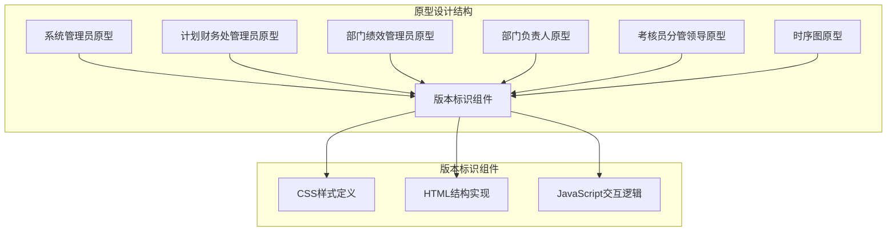
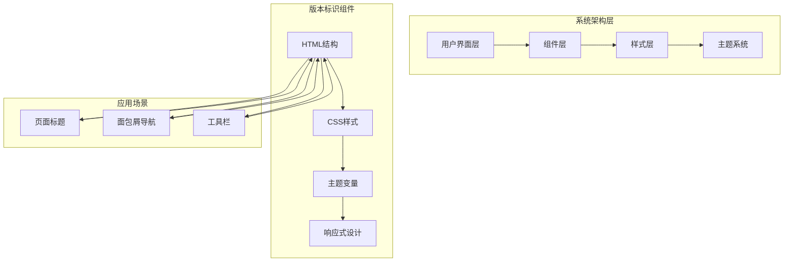
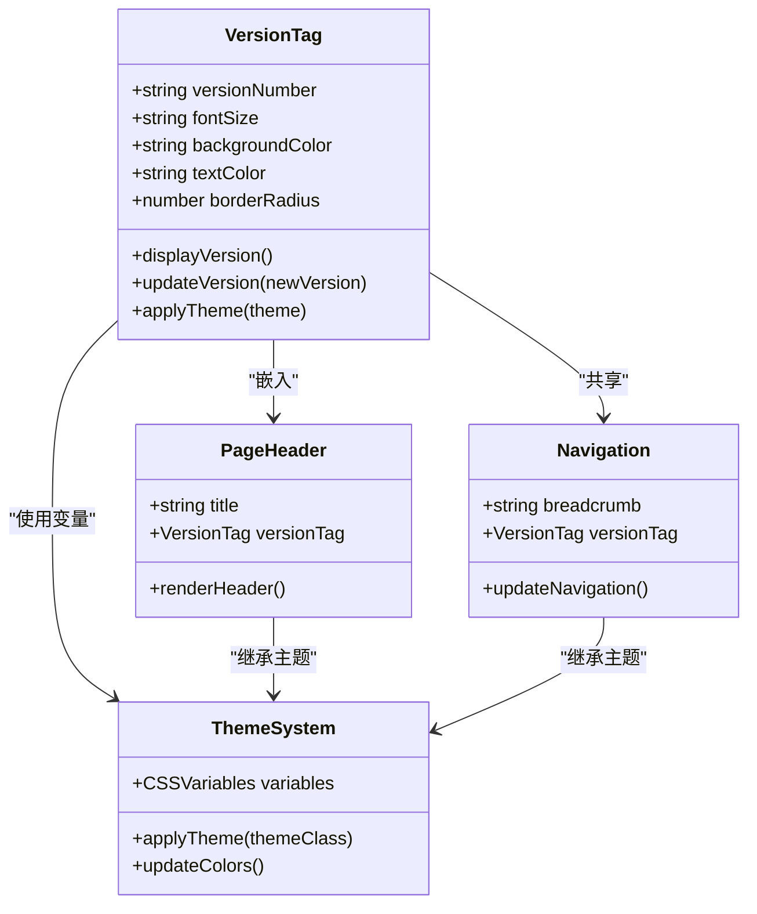
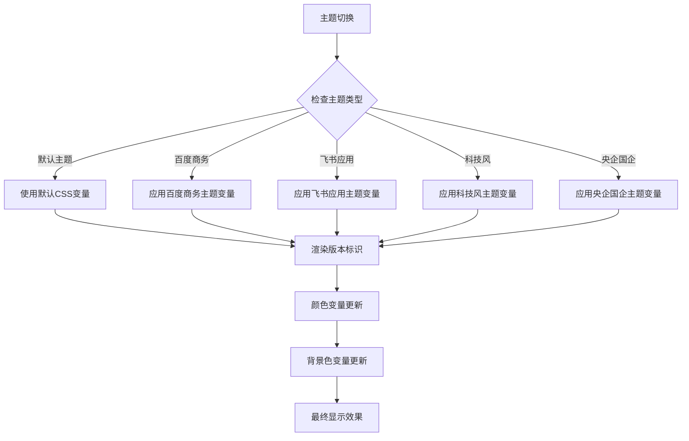
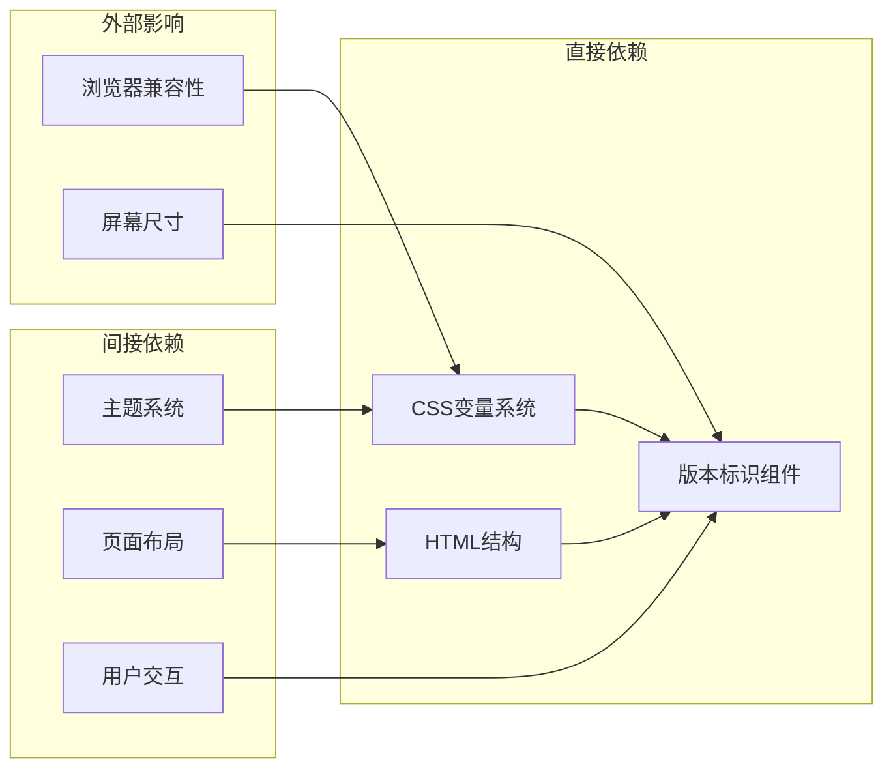

# 版本标识组件

<cite>
**本文档引用的文件**
- [1-系统管理员原型-v1.html](file://月度业绩考核原型设计初稿/1-系统管理员原型-v1.html)
- [2-计划财务处业绩考核管理员原型-v1.html](file://月度业绩考核原型设计初稿/2-计划财务处业绩考核管理员原型-v1.html)
- [3-部门绩效管理员原型-v1.html](file://月度业绩考核原型设计初稿/3-部门绩效管理员原型-v1.html)
- [4-部门负责人原型-v1.html](file://月度业绩考核原型设计初稿/4-部门负责人原型-v1.html)
- [5-考核员分管领导原型-v1.html](file://月度业绩考核原型设计初稿/5-考核员分管领导原型-v1.html)
- [6-时序图-v1.html](file://月度业绩考核原型设计初稿/6-时序图-v1.html)
</cite>

## 目录
1. [简介](#简介)
2. [项目结构](#项目结构)
3. [核心组件](#核心组件)
4. [架构概览](#架构概览)
5. [详细组件分析](#详细组件分析)
6. [依赖分析](#依赖分析)
7. [性能考虑](#性能考虑)
8. [故障排除指南](#故障排除指南)
9. [结论](#结论)

## 简介

版本标识组件是月度业绩考核管理系统中的重要视觉元素，用于明确标识系统的版本信息。该组件采用统一的视觉设计规范，在整个系统中保持一致的外观和交互体验。

版本标识组件的核心功能是在页面标题中清晰地显示版本号，为用户提供版本信息的快速识别能力。该组件在不同角色的界面中都有应用，体现了系统设计的一致性和完整性。

## 项目结构

该项目采用多角色原型设计的方式，为不同的用户角色提供了专门的界面原型：



**图表来源**
- [1-系统管理员原型-v1.html](file://月度业绩考核原型设计初稿/1-系统管理员原型-v1.html#L278)
- [2-计划财务处业绩考核管理员原型-v1.html](file://月度业绩考核原型设计初稿/2-计划财务处业绩考核管理员原型-v1.html#L299)
- [3-部门绩效管理员原型-v1.html](file://月度业绩考核原型设计初稿/3-部门绩效管理员原型-v1.html#L313)

**章节来源**
- [1-系统管理员原型-v1.html:1-635](file://月度业绩考核原型设计初稿/1-系统管理员原型-v1.html#L1-L635)
- [2-计划财务处业绩考核管理员原型-v1.html:1-1039](file://月度业绩考核原型设计初稿/2-计划财务处业绩考核管理员原型-v1.html#L1-L1039)
- [3-部门绩效管理员原型-v1.html:1-1663](file://月度业绩考核原型设计初稿/3-部门绩效管理员原型-v1.html#L1-L1663)

## 核心组件

版本标识组件在系统中以统一的结构实现，主要包含以下核心要素：

### 组件结构
- **HTML标签**: 使用 `<span class="version-tag">` 标签实现
- **版本号显示**: 采用 "v1" 的格式显示版本信息
- **CSS类名**: version-tag
- **定位策略**: 浮动定位，确保在标题中的正确显示

### 视觉设计规范
- **字体大小**: 11px
- **颜色搭配**: 文本颜色为var(--text-secondary)，背景色为var(--table-header-bg)
- **边距设置**: 内边距为2px 8px，外边距为3px
- **圆角设计**: 边框半径为3px
- **间距控制**: 与其他元素保持适当的间距

### 样式实现
组件采用CSS变量系统，确保在不同主题下的一致性表现：

```css
.version-tag {
    font-size: 11px;
    color: var(--text-secondary);
    background: var(--table-header-bg);
    padding: 2px 8px;
    border-radius: 3px;
}
```

**章节来源**
- [1-系统管理员原型-v1.html](file://月度业绩考核原型设计初稿/1-系统管理员原型-v1.html#L278)
- [2-计划财务处业绩考核管理员原型-v1.html](file://月度业绩考核原型设计初稿/2-计划财务处业绩考核管理员原型-v1.html#L299)
- [3-部门绩效管理员原型-v1.html](file://月度业绩考核原型设计初稿/3-部门绩效管理员原型-v1.html#L313)

## 架构概览

版本标识组件在整个系统架构中扮演着重要的视觉标识角色，其设计体现了现代Web应用的组件化思想：



**图表来源**
- [1-系统管理员原型-v1.html](file://月度业绩考核原型设计初稿/1-系统管理员原型-v1.html#L278)
- [2-计划财务处业绩考核管理员原型-v1.html](file://月度业绩考核原型设计初稿/2-计划财务处业绩考核管理员原型-v1.html#L299)
- [3-部门绩效管理员原型-v1.html](file://月度业绩考核原型设计初稿/3-部门绩效管理员原型-v1.html#L313)

### 组件关系
版本标识组件与系统其他组件存在密切的协作关系：



**图表来源**
- [1-系统管理员原型-v1.html](file://月度业绩考核原型设计初稿/1-系统管理员原型-v1.html#L332)
- [2-计划财务处业绩考核管理员原型-v1.html](file://月度业绩考核原型设计初稿/2-计划财务处业绩考核管理员原型-v1.html#L356)
- [3-部门绩效管理员原型-v1.html](file://月度业绩考核原型设计初稿/3-部门绩效管理员原型-v1.html#L448)

**章节来源**
- [4-部门负责人原型-v1.html](file://月度业绩考核原型设计初稿/4-部门负责人原型-v1.html#L224)
- [5-考核员分管领导原型-v1.html](file://月度业绩考核原型设计初稿/5-考核员分管领导原型-v1.html#L38)
- [6-时序图-v1.html](file://月度业绩考核原型设计初稿/6-时序图-v1.html#L89)

## 详细组件分析

### 组件实现细节

版本标识组件在不同页面中的具体实现展示了其灵活的应用特性：

#### 页面标题中的应用
在页面标题中，版本标识组件通常与主标题并列显示：

```html
<h1>单位管理 <span class="version-tag">v1</span></h1>
```

这种布局确保了版本信息与页面内容的紧密关联，同时保持了视觉上的平衡。

#### 面包屑导航中的应用
在导航结构中，版本标识组件可以作为导航项的一部分：

```html
<div class="topbar-breadcrumb">系统管理 / <span id="currentPageName">单位管理</span> <span class="version-tag">v1</span></div>
```

这种应用方式突出了当前页面的版本状态。

#### 工具栏中的应用
在工具栏区域，版本标识组件可以作为右上角的信息元素：

```html
<div class="topbar-right">
  <span>管理员</span>
  <span class="version-tag">v1</span>
  <div class="topbar-avatar">管</div>
</div>
```

**章节来源**
- [1-系统管理员原型-v1.html](file://月度业绩考核原型设计初稿/1-系统管理员原型-v1.html#L332)
- [2-计划财务处业绩考核管理员原型-v1.html](file://月度业绩考核原型设计初稿/2-计划财务处业绩考核管理员原型-v1.html#L356)
- [3-部门绩效管理员原型-v1.html](file://月度业绩考核原型设计初稿/3-部门绩效管理员原型-v1.html#L438)

### 视觉设计分析

版本标识组件的视觉设计体现了现代UI设计的最佳实践：

#### 颜色系统
组件采用扁平化设计，使用系统化的颜色变量：
- **文本颜色**: var(--text-secondary) - 中性灰色，确保良好的可读性
- **背景颜色**: var(--table-header-bg) - 浅色背景，营造轻量级视觉效果
- **边框半径**: 3px - 圆润边缘，符合现代设计趋势

#### 字体规格
- **字号**: 11px - 小号字体，避免干扰主要内容
- **字重**: 正常字重，保持简洁性
- **行高**: 自动计算，确保垂直居中

#### 布局特性
- **内边距**: 2px 8px - 提供适当的呼吸空间
- **外边距**: 3px - 与其他元素保持协调间距
- **定位**: 相对定位，不影响文档流

### 主题适配机制

版本标识组件通过CSS变量系统实现了完整的主题适配：



**图表来源**
- [1-系统管理员原型-v1.html:8-185](file://月度业绩考核原型设计初稿/1-系统管理员原型-v1.html#L8-L185)
- [2-计划财务处业绩考核管理员原型-v1.html:8-184](file://月度业绩考核原型设计初稿/2-计划财务处业绩考核管理员原型-v1.html#L8-L184)

**章节来源**
- [1-系统管理员原型-v1.html:8-185](file://月度业绩考核原型设计初稿/1-系统管理员原型-v1.html#L8-L185)
- [2-计划财务处业绩考核管理员原型-v1.html:8-184](file://月度业绩考核原型设计初稿/2-计划财务处业绩考核管理员原型-v1.html#L8-L184)

## 依赖分析

版本标识组件的依赖关系相对简单，主要依赖于CSS变量系统和HTML结构：



### 组件耦合度
版本标识组件具有较低的耦合度，主要体现在：
- **低耦合**: 与业务逻辑无直接关联
- **高内聚**: 集中处理视觉呈现相关逻辑
- **可移植性**: 可在不同页面中重复使用

### 依赖风险
潜在的依赖风险包括：
- **CSS变量缺失**: 当主题变量未定义时的降级处理
- **样式冲突**: 与其他组件样式的潜在冲突
- **响应式问题**: 在不同设备上的显示效果

**章节来源**
- [1-系统管理员原型-v1.html:152-185](file://月度业绩考核原型设计初稿/1-系统管理员原型-v1.html#L152-L185)
- [2-计划财务处业绩考核管理员原型-v1.html:187-220](file://月度业绩考核原型设计初稿/2-计划财务处业绩考核管理员原型-v1.html#L187-L220)

## 性能考虑

版本标识组件由于其实现的简洁性，对整体性能的影响微乎其微。主要的性能考量包括：

### 渲染性能
- **轻量级元素**: 仅包含简单的文本和样式，渲染开销极小
- **静态内容**: 版本信息通常是静态的，不需要频繁更新
- **缓存友好**: CSS样式可以被浏览器有效缓存

### 样式性能
- **CSS变量优化**: 使用CSS变量减少样式计算开销
- **简化的布局**: 不涉及复杂的布局计算
- **最小化重绘**: 样式变更不会触发大规模的重绘

### 交互性能
- **事件绑定**: 通常不需要绑定复杂的事件处理器
- **内存占用**: 占用内存极小，几乎可以忽略
- **加载时间**: 对页面整体加载时间影响微弱

## 故障排除指南

### 常见问题及解决方案

#### 版本号显示异常
**问题描述**: 版本标识不显示或显示错误
**可能原因**:
- CSS类名拼写错误
- CSS样式被其他规则覆盖
- HTML结构不正确

**解决方法**:
1. 检查HTML结构中的类名是否正确
2. 验证CSS样式是否正确加载
3. 确认父容器的样式没有影响子元素显示

#### 主题适配问题
**问题描述**: 版本标识在不同主题下显示不一致
**可能原因**:
- CSS变量未正确应用
- 主题切换逻辑错误
- 样式优先级问题

**解决方法**:
1. 检查CSS变量的定义和使用
2. 验证主题切换函数的调用
3. 确认样式优先级的正确设置

#### 响应式显示问题
**问题描述**: 在移动设备上显示效果不佳
**可能原因**:
- 媒体查询设置不当
- 字体大小在小屏幕上的可读性问题
- 间距在窄屏设备上的适应性

**解决方法**:
1. 检查媒体查询的断点设置
2. 调整移动端的字体大小和间距
3. 测试不同屏幕尺寸下的显示效果

**章节来源**
- [1-系统管理员原型-v1.html:612-632](file://月度业绩考核原型设计初稿/1-系统管理员原型-v1.html#L612-L632)
- [2-计划财务处业绩考核管理员原型-v1.html:612-632](file://月度业绩考核原型设计初稿/2-计划财务处业绩考核管理员原型-v1.html#L612-L632)

## 结论

版本标识组件作为月度业绩考核管理系统中的重要视觉元素，展现了现代Web应用组件设计的最佳实践。该组件通过简洁的实现、统一的视觉规范和完善的主题适配机制，为用户提供了清晰、一致的版本信息识别体验。

组件设计的关键优势包括：
- **一致性**: 在所有页面和角色中保持统一的外观
- **可扩展性**: 通过CSS变量系统轻松适配不同主题
- **可维护性**: 简洁的实现降低了维护成本
- **用户体验**: 合理的视觉层次和信息密度

未来可以在以下方面进一步优化：
- 增加更多的主题选项
- 支持动态版本信息更新
- 加强无障碍访问支持
- 优化移动端显示效果

总体而言，版本标识组件的设计充分体现了现代前端开发的理念，为整个系统的用户体验奠定了坚实的基础。