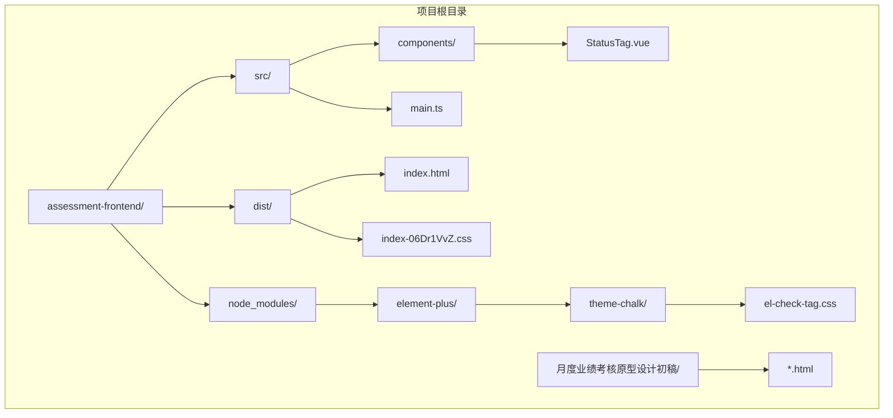
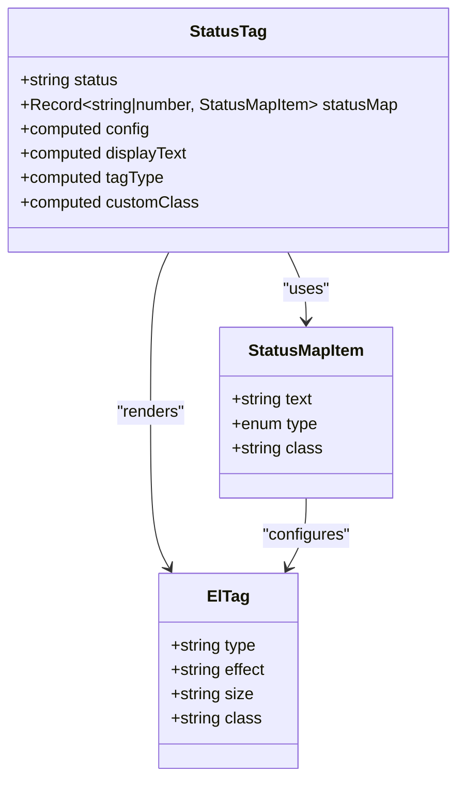
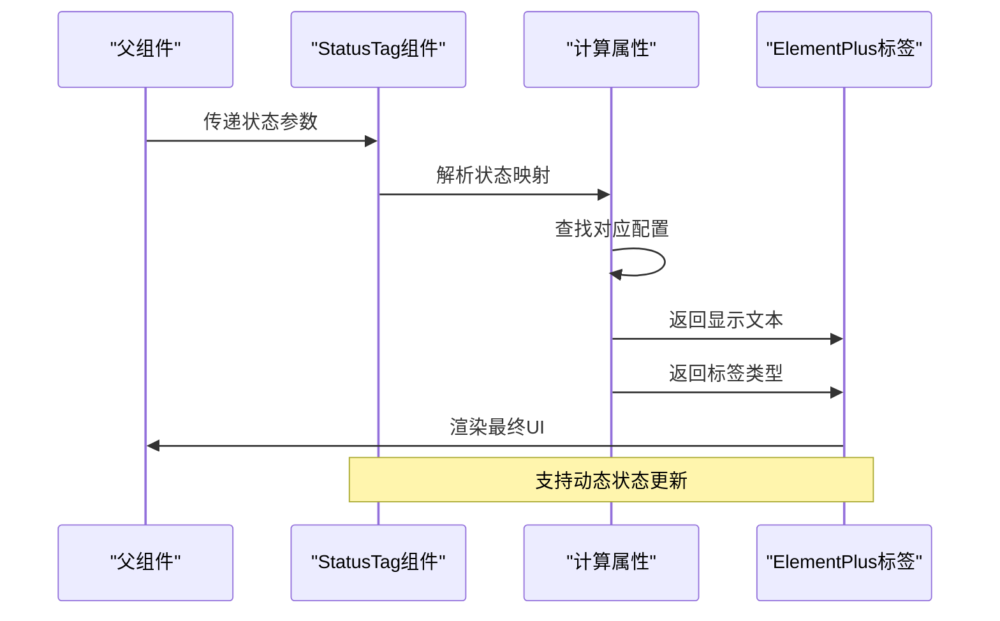
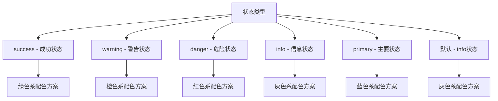
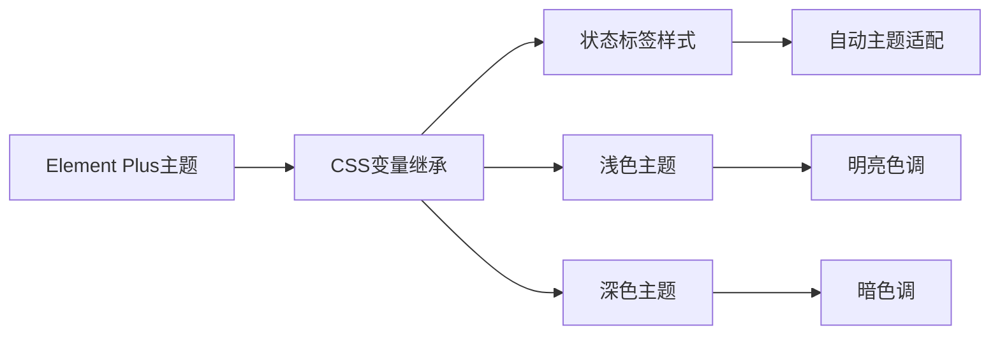
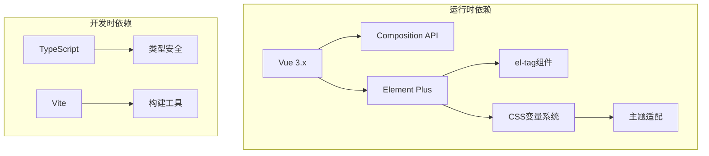
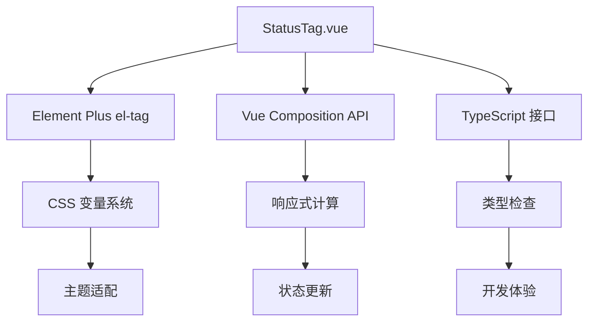

# 状态标签组件

<cite>
**本文档引用的文件**
- [StatusTag.vue](file://assessment-frontend/src/components/StatusTag.vue)
- [el-check-tag.css](file://assessment-frontend/node_modules/element-plus/theme-chalk/el-check-tag.css)
- [index-06Dr1VvZ.css](file://assessment-frontend/dist/assets/index-06Dr1VvZ.css)
- [1-系统管理员原型-v1.html](file://月度业绩考核原型设计初稿/1-系统管理员原型-v1.html)
- [5-考核员分管领导原型-v1.html](file://月度业绩考核原型设计初稿/5-考核员分管领导原型-v1.html)
</cite>

## 目录
1. [简介](#简介)
2. [项目结构](#项目结构)
3. [核心组件](#核心组件)
4. [架构概览](#架构概览)
5. [详细组件分析](#详细组件分析)
6. [依赖关系分析](#依赖关系分析)
7. [性能考虑](#性能考虑)
8. [故障排除指南](#故障排除指南)
9. [结论](#结论)

## 简介

状态标签组件是一个基于 Vue 3 和 Element Plus 的可复用 UI 组件，专门用于展示系统中各种状态信息。该组件支持多种状态类型（启用/禁用、有效/无效、成功/失败等），通过统一的样式系统确保界面的一致性和可访问性。

组件采用响应式设计，能够根据不同的状态值动态切换样式，为用户提供清晰的状态指示。通过 TypeScript 接口定义，确保了类型安全和良好的开发体验。

## 项目结构

该项目采用现代化的前端技术栈，主要包含以下关键文件：



**图表来源**
- [StatusTag.vue:1-39](file://assessment-frontend/src/components/StatusTag.vue#L1-L39)
- [index-06Dr1VvZ.css:1-2](file://assessment-frontend/dist/assets/index-06Dr1VvZ.css#L1-L2)
- [el-check-tag.css:1-1](file://assessment-frontend/node_modules/element-plus/theme-chalk/el-check-tag.css#L1-L1)

**章节来源**
- [StatusTag.vue:1-39](file://assessment-frontend/src/components/StatusTag.vue#L1-L39)
- [index-06Dr1VvZ.css:1-2](file://assessment-frontend/dist/assets/index-06Dr1VvZ.css#L1-L2)

## 核心组件

### StatusTag 组件概述

StatusTag 是一个轻量级的状态显示组件，基于 Element Plus 的 el-tag 组件构建。它提供了灵活的状态映射机制，允许开发者通过配置对象定义各种状态的显示文本、类型和样式类。

### 主要特性

- **状态映射系统**: 支持通过状态映射表定义不同状态的显示内容
- **类型安全**: 使用 TypeScript 接口确保属性类型正确
- **响应式更新**: 自动响应状态变化并更新显示内容
- **样式定制**: 支持自定义 CSS 类名进行样式扩展
- **Element Plus 集成**: 充分利用 Element Plus 的主题系统

**章节来源**
- [StatusTag.vue:1-39](file://assessment-frontend/src/components/StatusTag.vue#L1-L39)

## 架构概览

### 组件架构设计



**图表来源**
- [StatusTag.vue:15-35](file://assessment-frontend/src/components/StatusTag.vue#L15-L35)

### 数据流架构



**图表来源**
- [StatusTag.vue:28-35](file://assessment-frontend/src/components/StatusTag.vue#L28-L35)

## 详细组件分析

### 状态映射系统

组件的核心是状态映射机制，通过 `statusMap` 属性接收一个映射表，定义了所有可能的状态及其对应的显示配置。

#### 状态映射接口定义

| 属性名 | 类型 | 必需 | 描述 |
|--------|------|------|------|
| text | string | 是 | 状态显示文本 |
| type | enum | 否 | Element Plus 类型（success/warning/danger/info/primary） |
| class | string | 否 | 自定义 CSS 类名 |

#### 状态类型支持

组件支持以下预定义状态类型：



**图表来源**
- [StatusTag.vue:15-19](file://assessment-frontend/src/components/StatusTag.vue#L15-L19)

### 样式系统与主题适配

#### CSS 变量系统

组件充分利用了 Element Plus 的 CSS 变量系统，确保在不同主题下的一致表现：

| CSS 变量 | 默认值 | 用途 |
|----------|--------|------|
| --el-color-success | #67c23a | 成功状态背景色 |
| --el-color-warning | #e6a23c | 警告状态背景色 |
| --el-color-danger | #f56c6c | 危险状态背景色 |
| --el-color-info | #909399 | 信息状态背景色 |
| --el-color-primary | #409eff | 主要状态背景色 |
| --el-text-color-regular | #606266 | 正常文本颜色 |
| --el-text-color-disabled | #c0c4cc | 禁用状态文本颜色 |

#### 主题适配机制



**图表来源**
- [index-06Dr1VvZ.css:1-2](file://assessment-frontend/dist/assets/index-06Dr1VvZ.css#L1-L2)

### 扩展使用模式

#### 自定义状态类型

开发者可以通过扩展状态映射来添加新的状态类型：

```javascript
// 示例：添加新的状态类型
const customStatusMap = {
  ...defaultStatusMap,
  pending: {
    text: '待处理',
    type: 'warning',
    class: 'custom-pending-tag'
  },
  processing: {
    text: '处理中',
    type: 'primary',
    class: 'custom-processing-tag'
  }
}
```

#### 图标集成

虽然基础组件不直接支持图标，但可以通过自定义类名实现图标集成：

```html
<!-- 通过自定义类名添加图标 -->
<status-tag 
  :status="statusValue"
  :status-map="statusMap"
  class="has-icon"
>
</status-tag>
```

**章节来源**
- [StatusTag.vue:12-35](file://assessment-frontend/src/components/StatusTag.vue#L12-L35)

## 依赖关系分析

### 外部依赖

组件依赖于以下关键依赖项：



**图表来源**
- [StatusTag.vue:1-10](file://assessment-frontend/src/components/StatusTag.vue#L1-L10)

### 内部依赖关系



**图表来源**
- [StatusTag.vue:12-35](file://assessment-frontend/src/components/StatusTag.vue#L12-L35)

**章节来源**
- [StatusTag.vue:1-39](file://assessment-frontend/src/components/StatusTag.vue#L1-L39)

## 性能考虑

### 渲染优化

组件采用了多种性能优化策略：

1. **计算属性缓存**: 使用 Vue 的计算属性确保状态映射结果的缓存
2. **最小化重渲染**: 仅在状态或映射表发生变化时重新渲染
3. **轻量级实现**: 基于简单的模板和计算逻辑，减少不必要的开销

### 内存管理

- **响应式数据**: 利用 Vue 的响应式系统自动管理内存
- **生命周期**: 组件在销毁时自动清理相关资源

## 故障排除指南

### 常见问题及解决方案

#### 问题1: 状态显示异常

**症状**: 状态标签显示错误或不显示

**解决方案**:
1. 检查状态映射表是否包含对应的状态键
2. 验证状态值的数据类型是否匹配映射表的键类型
3. 确认 Element Plus 是否正确引入

#### 问题2: 样式不生效

**症状**: 自定义样式未按预期显示

**解决方案**:
1. 检查 CSS 优先级，确保自定义类名具有足够高的优先级
2. 验证 CSS 变量是否正确设置
3. 确认主题配置是否正确

#### 问题3: TypeScript 类型错误

**症状**: 编译时报类型错误

**解决方案**:
1. 确保状态映射表的结构符合 `StatusMapItem` 接口定义
2. 检查状态值的数据类型是否与映射表的键类型兼容
3. 验证可选属性的使用是否正确

**章节来源**
- [StatusTag.vue:28-35](file://assessment-frontend/src/components/StatusTag.vue#L28-L35)

## 结论

状态标签组件是一个设计精良、功能完整的 UI 组件，具有以下优势：

1. **高度可定制**: 通过状态映射系统支持任意数量的状态类型
2. **主题友好**: 充分利用 CSS 变量系统实现自动主题适配
3. **类型安全**: 使用 TypeScript 提供完整的类型检查
4. **易于扩展**: 支持自定义样式和功能扩展
5. **性能优秀**: 采用响应式设计和计算属性优化

该组件适用于各种状态显示场景，包括但不限于用户状态、任务进度、系统状态等，为构建一致性的用户界面提供了强有力的支持。