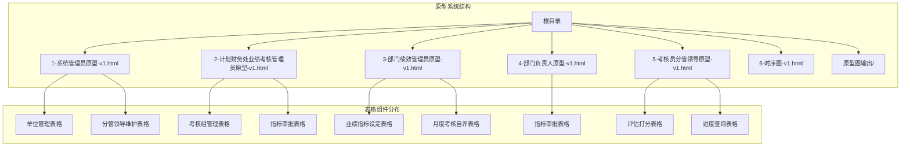
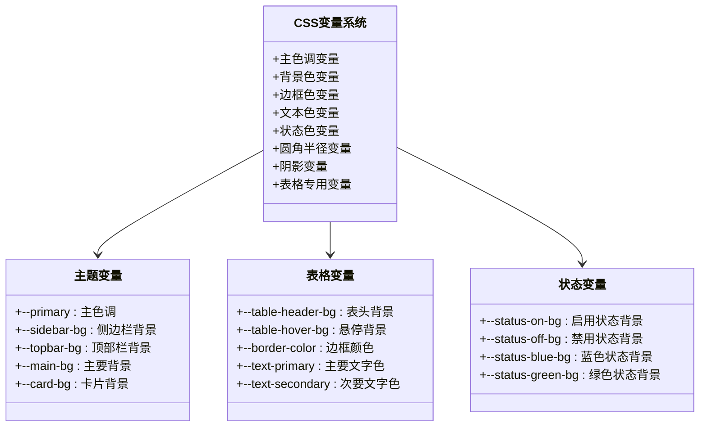
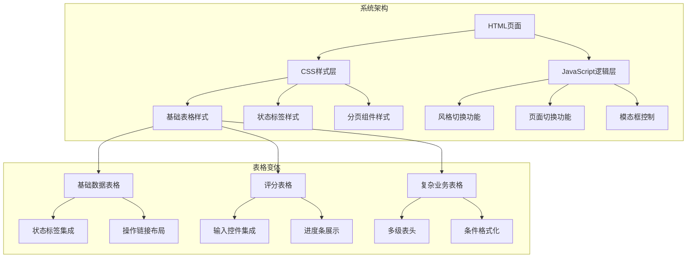
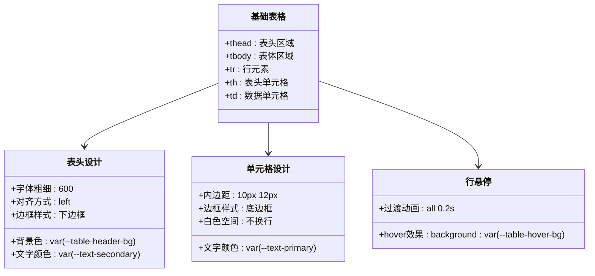
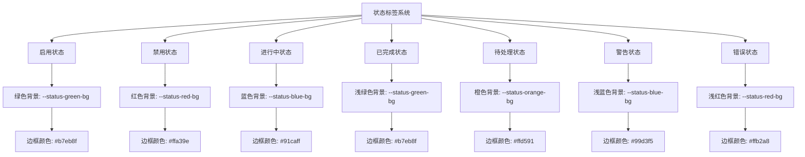
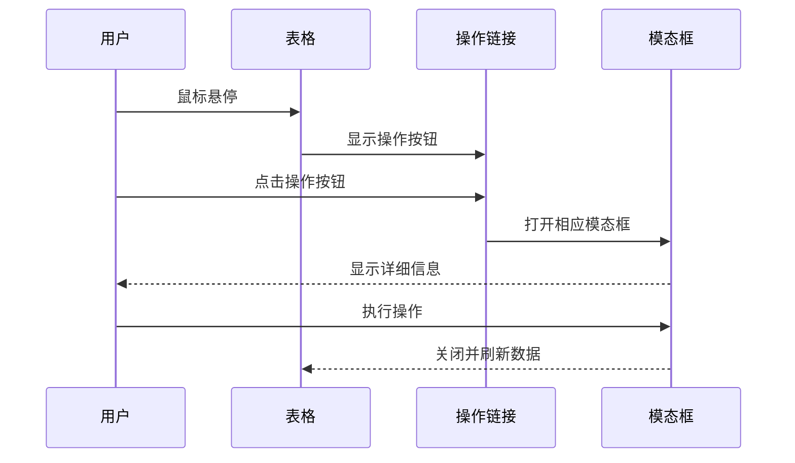
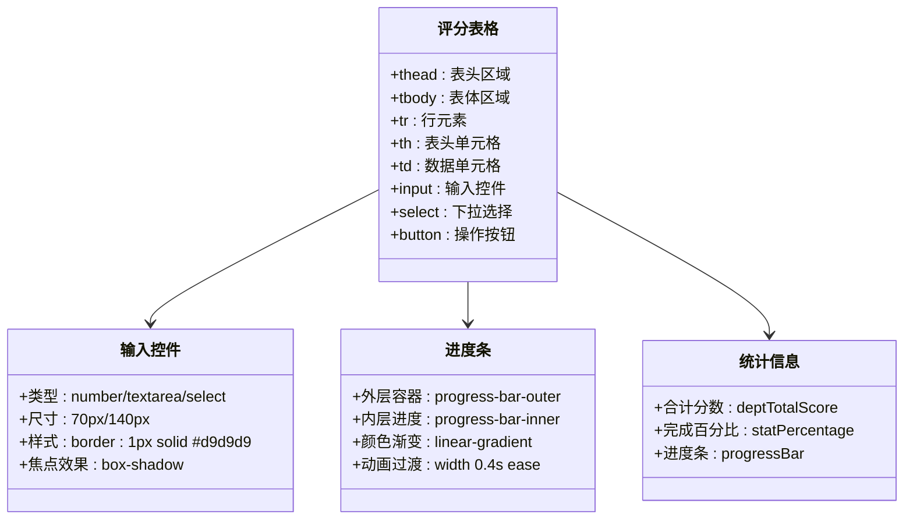
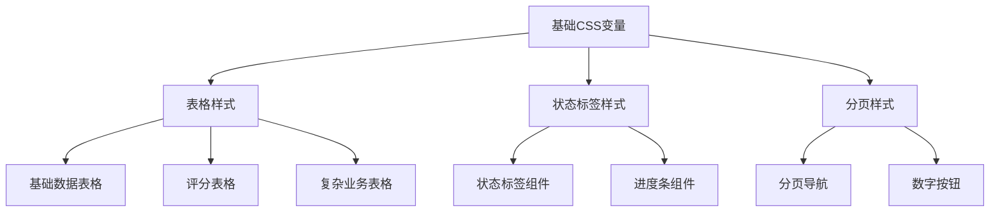

# 表格组件

<cite>
**本文档引用的文件**
- [1-系统管理员原型-v1.html](file://月度业绩考核原型设计初稿/1-系统管理员原型-v1.html)
- [2-计划财务处业绩考核管理员原型-v1.html](file://月度业绩考核原型设计初稿/2-计划财务处业绩考核管理员原型-v1.html)
- [3-部门绩效管理员原型-v1.html](file://月度业绩考核原型设计初稿/3-部门绩效管理员原型-v1.html)
- [4-部门负责人原型-v1.html](file://月度业绩考核原型设计初稿/4-部门负责人原型-v1.html)
- [5-考核员分管领导原型-v1.html](file://月度业绩考核原型设计初稿/5-考核员分管领导原型-v1.html)
- [6-时序图-v1.html](file://月度业绩考核原型设计初稿/6-时序图-v1.html)
</cite>

## 目录
1. [简介](#简介)
2. [项目结构](#项目结构)
3. [核心组件](#核心组件)
4. [架构概览](#架构概览)
5. [详细组件分析](#详细组件分析)
6. [依赖关系分析](#依赖关系分析)
7. [性能考虑](#性能考虑)
8. [故障排除指南](#故障排除指南)
9. [结论](#结论)
10. [附录](#附录)

## 简介

本文档全面分析了月度业绩考核系统的表格组件实现。该系统包含多个角色的原型页面，每个页面都展示了不同类型的表格组件，涵盖了从基础数据表格到复杂评分表格的完整实现。

系统采用统一的CSS变量设计体系，支持四种不同的视觉风格（默认、百度商务、飞书应用、科技风、央企国企），并通过JavaScript实现了动态风格切换功能。表格组件作为系统的核心交互元素，承担着数据展示、状态标识、操作链接等功能。

## 项目结构

该项目是一个基于HTML/CSS/JavaScript的前端原型系统，包含7个主要原型页面：



**图表来源**
- [1-系统管理员原型-v1.html:1-635](file://月度业绩考核原型设计初稿/1-系统管理员原型-v1.html#L1-L635)
- [2-计划财务处业绩考核管理员原型-v1.html:1-1039](file://月度业绩考核原型设计初稿/2-计划财务处业绩考核管理员原型-v1.html#L1-L1039)
- [3-部门绩效管理员原型-v1.html:1-1663](file://月度业绩考核原型设计初稿/3-部门绩效管理员原型-v1.html#L1-L1663)
- [4-部门负责人原型-v1.html:1-1231](file://月度业绩考核原型设计初稿/4-部门负责人原型-v1.html#L1-L1231)
- [5-考核员分管领导原型-v1.html:1-1459](file://月度业绩考核原型设计初稿/5-考核员分管领导原型-v1.html#L1-L1459)
- [6-时序图-v1.html:1-570](file://月度业绩考核原型设计初稿/6-时序图-v1.html#L1-L570)

**章节来源**
- [1-系统管理员原型-v1.html:1-635](file://月度业绩考核原型设计初稿/1-系统管理员原型-v1.html#L1-L635)
- [2-计划财务处业绩考核管理员原型-v1.html:1-1039](file://月度业绩考核原型设计初稿/2-计划财务处业绩考核管理员原型-v1.html#L1-L1039)
- [3-部门绩效管理员原型-v1.html:1-1663](file://月度业绩考核原型设计初稿/3-部门绩效管理员原型-v1.html#L1-L1663)
- [4-部门负责人原型-v1.html:1-1231](file://月度业绩考核原型设计初稿/4-部门负责人原型-v1.html#L1-L1231)
- [5-考核员分管领导原型-v1.html:1-1459](file://月度业绩考核原型设计初稿/5-考核员分管领导原型-v1.html#L1-L1459)
- [6-时序图-v1.html:1-570](file://月度业绩考核原型设计初稿/6-时序图-v1.html#L1-L570)

## 核心组件

### CSS变量系统

系统采用统一的CSS变量定义，建立了完整的视觉设计系统：



**图表来源**
- [1-系统管理员原型-v1.html:8-35](file://月度业绩考核原型设计初稿/1-系统管理员原型-v1.html#L8-L35)
- [2-计划财务处业绩考核管理员原型-v1.html:8-42](file://月度业绩考核原型设计初稿/2-计划财务处业绩考核管理员原型-v1.html#L8-L42)
- [3-部门绩效管理员原型-v1.html:8-39](file://月度业绩考核原型设计初稿/3-部门绩效管理员原型-v1.html#L8-L39)

### 表格样式系统

表格组件采用了统一的样式规范，确保在不同页面中的一致性：

| 属性 | 默认值 | 用途 |
|------|--------|------|
| 字体大小 | 13px | 统一表格字体大小 |
| 行高 | 10px 12px | 表头和单元格内边距 |
| 边框样式 | 1px solid var(--border-color) | 统一边框样式 |
| 悬停效果 | background: var(--table-hover-bg) | 鼠标悬停状态 |
| 表头背景 | var(--table-header-bg) | 表头区域背景色 |

**章节来源**
- [1-系统管理员原型-v1.html:234-239](file://月度业绩考核原型设计初稿/1-系统管理员原型-v1.html#L234-L239)
- [2-计划财务处业绩考核管理员原型-v1.html:264-267](file://月度业绩考核原型设计初稿/2-计划财务处业绩考核管理员原型-v1.html#L264-L267)
- [3-部门绩效管理员原型-v1.html:270-275](file://月度业绩考核原型设计初稿/3-部门绩效管理员原型-v1.html#L270-L275)

## 架构概览

系统采用模块化的表格组件架构，每个页面都有独立的表格实现，但共享统一的设计语言：



**图表来源**
- [1-系统管理员原型-v1.html:234-279](file://月度业绩考核原型设计初稿/1-系统管理员原型-v1.html#L234-L279)
- [2-计划财务处业绩考核管理员原型-v1.html:264-312](file://月度业绩考核原型设计初稿/2-计划财务处业绩考核管理员原型-v1.html#L264-L312)
- [3-部门绩效管理员原型-v1.html:270-398](file://月度业绩考核原型设计初稿/3-部门绩效管理员原型-v1.html#L270-L398)

## 详细组件分析

### 基础数据表格组件

基础数据表格是最常见的表格类型，主要用于展示静态数据：

#### 结构设计



**图表来源**
- [1-系统管理员原型-v1.html:347-355](file://月度业绩考核原型设计初稿/1-系统管理员原型-v1.html#L347-L355)
- [2-计划财务处业绩考核管理员原型-v1.html:371-386](file://月度业绩考核原型设计初稿/2-计划财务处业绩考核管理员原型-v1.html#L371-L386)
- [3-部门绩效管理员原型-v1.html:465-476](file://月度业绩考核原型设计初稿/3-部门绩效管理员原型-v1.html#L465-L476)

#### 视觉设计特性

| 设计元素 | 实现方式 | 效果 |
|----------|----------|------|
| 悬停效果 | `table tr:hover td` | 高亮显示当前行 |
| 表头样式 | `background: var(--table-header-bg)` | 区分表头区域 |
| 文字对齐 | `text-align: left` | 左对齐显示数据 |
| 边框样式 | `border-bottom: 1px solid var(--border-color)` | 清晰的行列分隔 |
| 内容溢出 | `white-space: nowrap` | 防止长文本换行 |

**章节来源**
- [1-系统管理员原型-v1.html:234-239](file://月度业绩考核原型设计初稿/1-系统管理员原型-v1.html#L234-L239)
- [2-计划财务处业绩考核管理员原型-v1.html:264-267](file://月度业绩考核原型设计初稿/2-计划财务处业绩考核管理员原型-v1.html#L264-L267)
- [3-部门绩效管理员原型-v1.html:270-275](file://月度业绩考核原型设计初稿/3-部门绩效管理员原型-v1.html#L270-L275)

### 状态标签集成组件

状态标签是表格中重要的视觉标识元素，用于直观展示数据状态：

#### 状态分类系统



**图表来源**
- [1-系统管理员原型-v1.html:242-243](file://月度业绩考核原型设计初稿/1-系统管理员原型-v1.html#L242-L243)
- [2-计划财务处业绩考核管理员原型-v1.html:269-274](file://月度业绩考核原型设计初稿/2-计划财务处业绩考核管理员原型-v1.html#L269-L274)
- [3-部门绩效管理员原型-v1.html:278-285](file://月度业绩考核原型设计初稿/3-部门绩效管理员原型-v1.html#L278-L285)

#### 状态标签实现

| 状态类型 | CSS类名 | 颜色变量 | 使用场景 |
|----------|---------|----------|----------|
| 启用 | `.status-on` | `--status-green-bg` | 激活状态、正常状态 |
| 禁用 | `.status-off` | `--status-red-bg` | 停用状态、异常状态 |
| 进行中 | `.st-blue` | `--status-blue-bg` | 处理中、进行中 |
| 已完成 | `.st-green` | `--status-green-bg` | 完成状态、成功 |
| 待处理 | `.st-orange` | `--status-orange-bg` | 等待处理、待审核 |
| 警告 | `.st-purple` | `--status-purple-bg` | 异常提醒、重要提示 |
| 错误 | `.st-red` | `--status-red-bg` | 错误状态、失败 |

**章节来源**
- [1-系统管理员原型-v1.html:242-243](file://月度业绩考核原型设计初稿/1-系统管理员原型-v1.html#L242-L243)
- [2-计划财务处业绩考核管理员原型-v1.html:269-274](file://月度业绩考核原型设计初稿/2-计划财务处业绩考核管理员原型-v1.html#L269-L274)
- [3-部门绩效管理员原型-v1.html:278-285](file://月度业绩考核原型设计初稿/3-部门绩效管理员原型-v1.html#L278-L285)

### 操作链接布局组件

操作链接是表格中用户交互的重要组成部分，提供了便捷的操作入口：

#### 操作链接设计模式



**图表来源**
- [1-系统管理员原型-v1.html:348-354](file://月度业绩考核原型设计初稿/1-系统管理员原型-v1.html#L348-L354)
- [2-计划财务处业绩考核管理员原型-v1.html:378-386](file://月度业绩考核原型设计初稿/2-计划财务处业绩考核管理员原型-v1.html#L378-L386)
- [3-部门绩效管理员原型-v1.html:476-476](file://月度业绩考核原型设计初稿/3-部门绩效管理员原型-v1.html#L476-L476)

#### 操作链接样式规范

| 属性 | 值 | 说明 |
|------|-----|------|
| 显示方式 | `display: flex` | 弹性布局显示 |
| 间距控制 | `gap: 8px` | 按钮之间的间距 |
| 自适应布局 | `flex-wrap: wrap` | 在窄屏上自动换行 |
| 尺寸规格 | `height: 26px` | 按钮高度规格 |
| 字体大小 | `font-size: 12px` | 按钮文字大小 |
| 颜色方案 | `color: var(--primary)` | 主色调按钮 |
| 悬停效果 | `color: var(--primary-dark)` | 悬停时加深 |

**章节来源**
- [1-系统管理员原型-v1.html:240-240](file://月度业绩考核原型设计初稿/1-系统管理员原型-v1.html#L240-L240)
- [2-计划财务处业绩考核管理员原型-v1.html:298-298](file://月度业绩考核原型设计初稿/2-计划财务处业绩考核管理员原型-v1.html#L298-L298)
- [3-部门绩效管理员原型-v1.html:276-276](file://月度业绩考核原型设计初稿/3-部门绩效管理员原型-v1.html#L276-L276)

### 响应式布局组件

系统实现了完整的响应式表格布局，确保在各种设备上的良好体验：

#### 响应式设计策略

```mermaid
graph LR
A[桌面端布局] --> B[固定列宽]
A --> C[完整表格显示]
D[移动端布局] --> E[水平滚动容器]
D --> F[自适应列宽]
E --> G[.table-wrap]
G --> H[overflow-x: auto]
G --> I[保持表头可见]
F --> J[媒体查询]
J --> K[@media (max-width: 768px)]
J --> L[动态调整布局]
```

**图表来源**
- [1-系统管理员原型-v1.html:235-235](file://月度业绩考核原型设计初稿/1-系统管理员原型-v1.html#L235-L235)
- [2-计划财务处业绩考核管理员原型-v1.html:264-264](file://月度业绩考核原型设计初稿/2-计划财务处业绩考核管理员原型-v1.html#L264-L264)
- [3-部门绩效管理员原型-v1.html:271-271](file://月度业绩考核原型设计初稿/3-部门绩效管理员原型-v1.html#L271-L271)

#### 移动端适配特性

| 特性 | 实现方式 | 效果 |
|------|----------|------|
| 水平滚动 | `overflow-x: auto` | 支持横向滚动查看更多列 |
| 自适应宽度 | `width: 100%` | 占满容器宽度 |
| 内容保护 | `white-space: nowrap` | 防止文本换行影响布局 |
| 滚动条样式 | 自定义滚动条 | 提升移动端滚动体验 |
| 触摸友好 | 增大点击区域 | 改善移动端交互体验 |

**章节来源**
- [1-系统管理员原型-v1.html:235-235](file://月度业绩考核原型设计初稿/1-系统管理员原型-v1.html#L235-L235)
- [2-计划财务处业绩考核管理员原型-v1.html:264-264](file://月度业绩考核原型设计初稿/2-计划财务处业绩考核管理员原型-v1.html#L264-L264)
- [3-部门绩效管理员原型-v1.html:271-271](file://月度业绩考核原型设计初稿/3-部门绩效管理员原型-v1.html#L271-L271)

### 复杂评分表格组件

评分表格是系统中最复杂的表格类型，集成了多种交互元素：

#### 评分表格结构



**图表来源**
- [5-考核员分管领导原型-v1.html:430-461](file://月度业绩考核原型设计初稿/5-考核员分管领导原型-v1.html#L430-L461)
- [5-考核员分管领导原型-v1.html:374-378](file://月度业绩考核原型设计初稿/5-考核员分管领导原型-v1.html#L374-L378)
- [5-考核员分管领导原型-v1.html:354-379](file://月度业绩考核原型设计初稿/5-考核员分管领导原型-v1.html#L354-L379)

#### 评分表格功能特性

| 功能模块 | 实现方式 | 用途 |
|----------|----------|------|
| 分数输入 | `<input type="number">` | 数值输入验证 |
| 打分说明 | `<textarea>` | 文字说明输入 |
| 实时计算 | JavaScript事件监听 | 动态计算总分 |
| 进度跟踪 | 进度条组件 | 可视化进度显示 |
| 状态统计 | 统计卡片 | 关键指标展示 |
| 视图切换 | 切换按钮 | 不同展示模式 |

**章节来源**
- [5-考核员分管领导原型-v1.html:150-155](file://月度业绩考核原型设计初稿/5-考核员分管领导原型-v1.html#L150-L155)
- [5-考核员分管领导原型-v1.html:382-387](file://月度业绩考核原型设计初稿/5-考核员分管领导原型-v1.html#L382-L387)
- [5-考核员分管领导原型-v1.html:423-461](file://月度业绩考核原型设计初稿/5-考核员分管领导原型-v1.html#L423-L461)

## 依赖关系分析

### 样式依赖关系



**图表来源**
- [1-系统管理员原型-v1.html:8-35](file://月度业绩考核原型设计初稿/1-系统管理员原型-v1.html#L8-L35)
- [2-计划财务处业绩考核管理员原型-v1.html:8-42](file://月度业绩考核原型设计初稿/2-计划财务处业绩考核管理员原型-v1.html#L8-L42)
- [3-部门绩效管理员原型-v1.html:8-39](file://月度业绩考核原型设计初稿/3-部门绩效管理员原型-v1.html#L8-L39)

### JavaScript交互依赖

| 依赖模块 | 功能描述 | 依赖关系 |
|----------|----------|----------|
| 风格切换 | 动态切换主题样式 | DOM操作、CSS变量更新 |
| 页面切换 | 切换不同功能页面 | 元素显示/隐藏控制 |
| 模态框控制 | 弹窗显示/关闭 | 事件监听、DOM操作 |
| 表格交互 | 排序、筛选、分页 | 数据处理、DOM更新 |

**章节来源**
- [1-系统管理员原型-v1.html:612-632](file://月度业绩考核原型设计初稿/1-系统管理员原型-v1.html#L612-L632)
- [2-计划财务处业绩考核管理员原型-v1.html:612-632](file://月度业绩考核原型设计初稿/2-计划财务处业绩考核管理员原型-v1.html#L612-L632)
- [3-部门绩效管理员原型-v1.html:612-632](file://月度业绩考核原型设计初稿/3-部门绩效管理员原型-v1.html#L612-L632)

## 性能考虑

### 样式性能优化

系统采用了CSS变量和继承机制，减少了重复样式的定义：

1. **CSS变量复用**：所有颜色、尺寸、阴影等属性都通过CSS变量定义，便于统一管理和性能优化
2. **选择器优化**：使用简单的元素选择器和类选择器，避免复杂的CSS选择器组合
3. **动画性能**：悬停效果使用简单的颜色变化，避免复杂的动画效果影响性能

### JavaScript性能优化

1. **事件委托**：使用事件委托减少事件监听器的数量
2. **DOM缓存**：对频繁访问的DOM元素进行缓存
3. **懒加载**：模态框采用延迟加载机制

## 故障排除指南

### 常见问题及解决方案

| 问题类型 | 症状表现 | 解决方案 |
|----------|----------|----------|
| 样式不生效 | 表格样式显示异常 | 检查CSS变量定义是否正确 |
| 响应式失效 | 移动端表格显示错乱 | 确认.table-wrap容器设置 |
| 悬停效果异常 | 行悬停无反应 | 检查:hover伪类选择器 |
| 状态标签显示问题 | 状态颜色不正确 | 验证CSS类名和变量引用 |

**章节来源**
- [1-系统管理员原型-v1.html:234-239](file://月度业绩考核原型设计初稿/1-系统管理员原型-v1.html#L234-L239)
- [2-计划财务处业绩考核管理员原型-v1.html:264-267](file://月度业绩考核原型设计初稿/2-计划财务处业绩考核管理员原型-v1.html#L264-L267)
- [3-部门绩效管理员原型-v1.html:270-275](file://月度业绩考核原型设计初稿/3-部门绩效管理员原型-v1.html#L270-L275)

## 结论

该表格组件系统展现了优秀的前端架构设计，具有以下特点：

1. **统一的设计语言**：通过CSS变量系统实现了完全一致的视觉风格
2. **灵活的组件化设计**：支持多种表格变体，满足不同业务场景需求
3. **完善的响应式支持**：确保在各种设备上的良好用户体验
4. **丰富的交互功能**：集成了状态标识、操作链接、评分输入等多种交互元素

系统为后续的功能扩展奠定了良好的基础，包括排序、筛选、分页等高级功能都可以在此基础上进行集成。

## 附录

### 扩展功能集成方案

#### 排序功能集成

```javascript
// 排序功能示例
function enableSorting(tableId) {
    const table = document.getElementById(tableId);
    const headers = table.querySelectorAll('th[data-sort]');
    
    headers.forEach(header => {
        header.addEventListener('click', () => {
            const columnIndex = header.cellIndex;
            const isAscending = !header.classList.contains('asc');
            
            // 实现排序逻辑
            sortTable(table, columnIndex, isAscending);
            
            // 更新排序状态指示器
            updateSortIndicators(headers, isAscending);
        });
    });
}
```

#### 筛选功能集成

```javascript
// 筛选功能示例
function enableFiltering(searchInputs, table) {
    searchInputs.forEach(input => {
        input.addEventListener('input', () => {
            const searchTerm = input.value.toLowerCase();
            filterTable(table, input.dataset.column, searchTerm);
        });
    });
}
```

#### 分页功能集成

```javascript
// 分页功能示例
function setupPagination(totalItems, itemsPerPage, onPageChange) {
    const totalPages = Math.ceil(totalItems / itemsPerPage);
    
    // 生成分页按钮
    for (let i = 1; i <= totalPages; i++) {
        createPageButton(i, onPageChange);
    }
}
```

### 最佳实践建议

1. **保持样式一致性**：所有表格组件应遵循相同的CSS变量和设计规范
2. **优化性能**：对于大数据量的表格，考虑使用虚拟滚动技术
3. **增强可访问性**：为表格添加适当的ARIA标签和键盘导航支持
4. **测试兼容性**：确保在主流浏览器中的兼容性和一致性