# 组件库设计

<cite>
**本文档引用的文件**
- [系统管理员原型-v1.html](file://月度业绩考核原型设计初稿/1-系统管理员原型-v1.html)
- [计划财务处业绩考核管理员原型-v1.html](file://月度业绩考核原型设计初稿/2-计划财务处业绩考核管理员原型-v1.html)
- [部门绩效管理员原型-v1.html](file://月度业绩考核原型设计初稿/3-部门绩效管理员原型-v1.html)
- [部门负责人原型-v1.html](file://月度业绩考核原型设计初稿/4-部门负责人原型-v1.html)
- [考核员分管领导原型-v1.html](file://月度业绩考核原型设计初稿/5-考核员分管领导原型-v1.html)
- [时序图-v1.html](file://月度业绩考核原型设计初稿/6-时序图-v1.html)
</cite>

## 目录
1. [引言](#引言)
2. [项目结构](#项目结构)
3. [核心组件](#核心组件)
4. [架构概览](#架构概览)
5. [详细组件分析](#详细组件分析)
6. [依赖分析](#依赖分析)
7. [性能考虑](#性能考虑)
8. [故障排除指南](#故障排除指南)
9. [结论](#结论)
10. [附录](#附录)

## 引言

本项目是一个基于HTML/CSS/JavaScript的月度业绩考核管理系统原型设计，展示了企业级组件库的设计理念和实现方法。该系统采用模块化设计理念，通过统一的CSS变量系统实现了主题风格切换，构建了完整的用户体验界面。

系统包含多个角色的交互界面，涵盖了从系统管理员到普通员工的完整业务流程，体现了现代Web应用的组件化开发思想。所有组件均采用语义化的HTML结构和可访问性友好的设计原则。

## 项目结构

项目采用按角色划分的原型文件结构，每个角色都有独立的界面原型，体现了清晰的职责分离和组件复用理念：

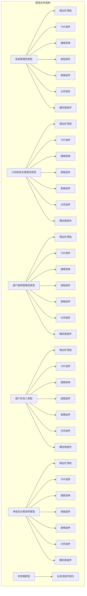

**图表来源**
- [系统管理员原型-v1.html:1-635](file://月度业绩考核原型设计初稿/1-系统管理员原型-v1.html#L1-L635)
- [计划财务处业绩考核管理员原型-v1.html:1-1039](file://月度业绩考核原型设计初稿/2-计划财务处业绩考核管理员原型-v1.html#L1-L1039)
- [部门绩效管理员原型-v1.html:1-1663](file://月度业绩考核原型设计初稿/3-部门绩效管理员原型-v1.html#L1-L1663)
- [部门负责人原型-v1.html:1-1231](file://月度业绩考核原型设计初稿/4-部门负责人原型-v1.html#L1-L1231)
- [考核员分管领导原型-v1.html:1-1459](file://月度业绩考核原型设计初稿/5-考核员分管领导原型-v1.html#L1-L1459)
- [时序图-v1.html:1-570](file://月度业绩考核原型设计初稿/6-时序图-v1.html#L1-L570)

**章节来源**
- [系统管理员原型-v1.html:1-635](file://月度业绩考核原型设计初稿/1-系统管理员原型-v1.html#L1-L635)
- [计划财务处业绩考核管理员原型-v1.html:1-1039](file://月度业绩考核原型设计初稿/2-计划财务处业绩考核管理员原型-v1.html#L1-L1039)
- [部门绩效管理员原型-v1.html:1-1663](file://月度业绩考核原型设计初稿/3-部门绩效管理员原型-v1.html#L1-L1663)
- [部门负责人原型-v1.html:1-1231](file://月度业绩考核原型设计初稿/4-部门负责人原型-v1.html#L1-L1231)
- [考核员分管领导原型-v1.html:1-1459](file://月度业绩考核原型设计初稿/5-考核员分管领导原型-v1.html#L1-L1459)
- [时序图-v1.html:1-570](file://月度业绩考核原型设计初稿/6-时序图-v1.html#L1-L570)

## 核心组件

### CSS变量系统

系统采用统一的CSS变量定义，实现了灵活的主题切换和样式定制能力：

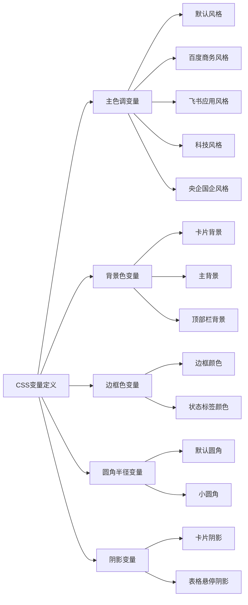

**图表来源**
- [系统管理员原型-v1.html:8-35](file://月度业绩考核原型设计初稿/1-系统管理员原型-v1.html#L8-L35)
- [系统管理员原型-v1.html:38-85](file://月度业绩考核原型设计初稿/1-系统管理员原型-v1.html#L38-L85)
- [系统管理员原型-v1.html:103-149](file://月度业绩考核原型设计初稿/1-系统管理员原型-v1.html#L103-L149)

### 组件设计原则

所有组件遵循以下设计原则：
- **一致性**：统一的视觉语言和交互模式
- **可访问性**：符合WCAG标准的色彩对比和键盘导航
- **响应式**：适配不同屏幕尺寸和设备类型
- **可扩展性**：基于CSS变量的主题定制能力
- **语义化**：正确的HTML语义标记和ARIA属性

**章节来源**
- [系统管理员原型-v1.html:8-185](file://月度业绩考核原型设计初稿/1-系统管理员原型-v1.html#L8-L185)

## 架构概览

系统采用分层架构设计，从底层的CSS变量系统到上层的业务组件，形成了完整的组件生态：

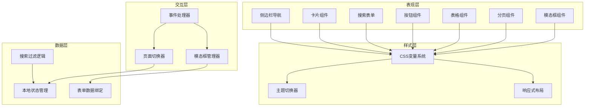

**图表来源**
- [系统管理员原型-v1.html:186-635](file://月度业绩考核原型设计初稿/1-系统管理员原型-v1.html#L186-L635)
- [计划财务处业绩考核管理员原型-v1.html:221-313](file://月度业绩考核原型设计初稿/2-计划财务处业绩考核管理员原型-v1.html#L221-L313)

## 详细组件分析

### 侧边栏导航组件

侧边栏导航是系统的主要导航组件，采用固定定位和层级化菜单结构：

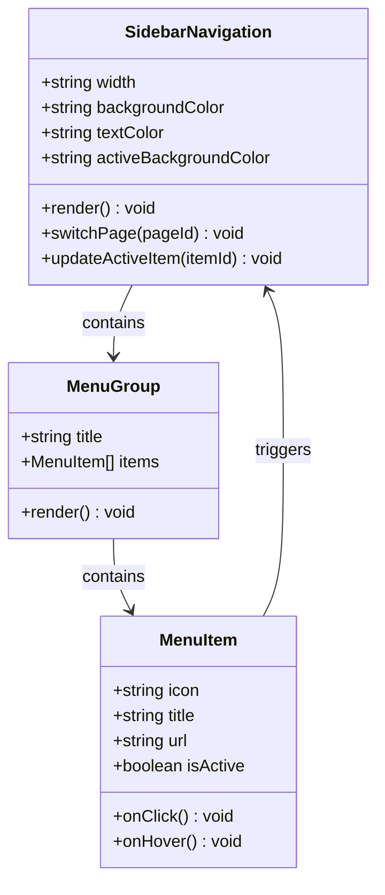

**图表来源**
- [系统管理员原型-v1.html:291-316](file://月度业绩考核原型设计初稿/1-系统管理员原型-v1.html#L291-L316)
- [系统管理员原型-v1.html:297-315](file://月度业绩考核原型设计初稿/1-系统管理员原型-v1.html#L297-L315)

#### 组件特性
- **固定定位**：使用`position: fixed`确保导航始终可见
- **层级结构**：支持菜单分组和子菜单嵌套
- **状态管理**：自动跟踪当前激活的菜单项
- **主题适配**：完全支持CSS变量主题切换

**章节来源**
- [系统管理员原型-v1.html:291-316](file://月度业绩考核原型设计初稿/1-系统管理员原型-v1.html#L291-L316)
- [系统管理员原型-v1.html:189-235](file://月度业绩考核原型设计初稿/1-系统管理员原型-v1.html#L189-L235)

### 卡片组件

卡片组件作为信息容器，提供了统一的视觉样式和布局规范：

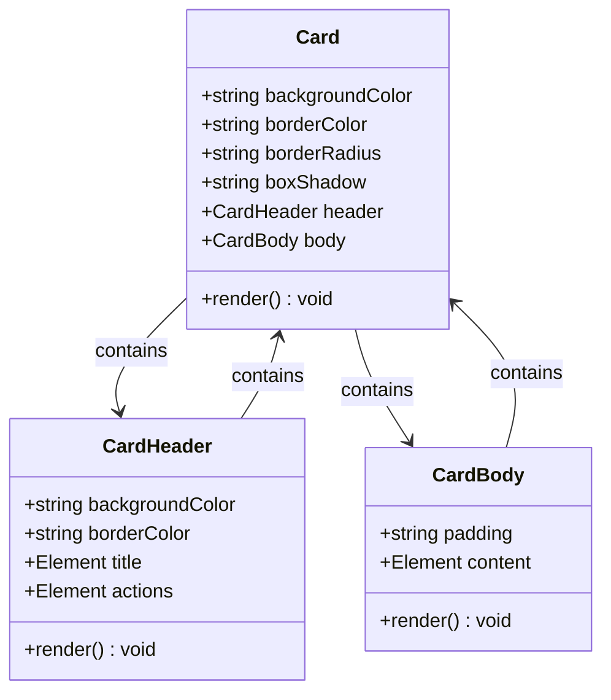

**图表来源**
- [系统管理员原型-v1.html:330-359](file://月度业绩考核原型设计初稿/1-系统管理员原型-v1.html#L330-L359)
- [系统管理员原型-v1.html:213-248](file://月度业绩考核原型设计初稿/1-系统管理员原型-v1.html#L213-L248)

#### 组件特性
- **灵活布局**：支持标题区和内容区的自由组合
- **统一样式**：基于CSS变量的统一视觉风格
- **响应式设计**：适配不同屏幕尺寸的布局调整
- **状态指示**：支持加载状态和空状态的视觉反馈

**章节来源**
- [系统管理员原型-v1.html:330-359](file://月度业绩考核原型设计初稿/1-系统管理员原型-v1.html#L330-L359)
- [系统管理员原型-v1.html:213-248](file://月度业绩考核原型设计初稿/1-系统管理员原型-v1.html#L213-L248)

### 搜索表单组件

搜索表单组件提供了统一的数据筛选和查询功能：

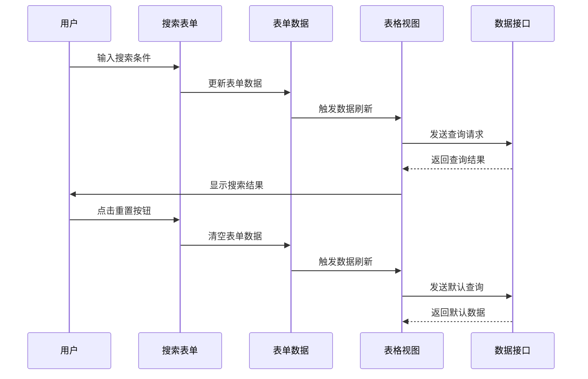

**图表来源**
- [系统管理员原型-v1.html:337-344](file://月度业绩考核原型设计初稿/1-系统管理员原型-v1.html#L337-L344)
- [计划财务处业绩考核管理员原型-v1.html:453-462](file://月度业绩考核原型设计初稿/2-计划财务处业绩考核管理员原型-v1.html#L453-L462)

#### 组件特性
- **多字段支持**：支持文本输入、下拉选择等多种输入类型
- **实时验证**：提供即时的表单验证和错误提示
- **批量操作**：支持查询和重置功能
- **响应式布局**：自动适应不同屏幕尺寸的布局调整

**章节来源**
- [系统管理员原型-v1.html:337-344](file://月度业绩考核原型设计初稿/1-系统管理员原型-v1.html#L337-L344)
- [部门绩效管理员原型-v1.html:453-521](file://月度业绩考核原型设计初稿/3-部门绩效管理员原型-v1.html#L453-L521)

### 按钮组件

按钮组件提供了统一的交互元素和视觉反馈：

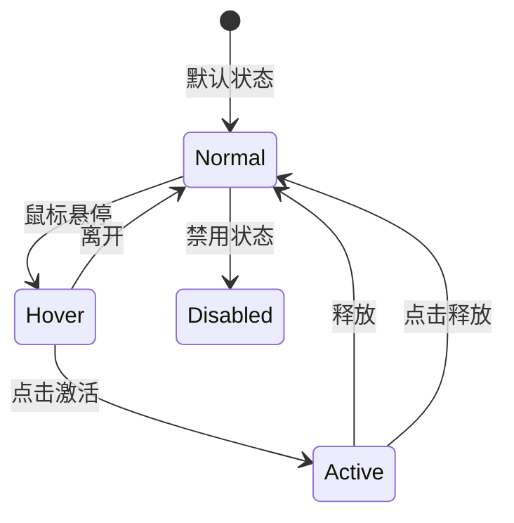

**图表来源**
- [系统管理员原型-v1.html:224-269](file://月度业绩考核原型设计初稿/1-系统管理员原型-v1.html#L224-L269)
- [系统管理员原型-v1.html:254-269](file://月度业绩考核原型设计初稿/1-系统管理员原型-v1.html#L254-L269)

#### 组件类型
- **主要按钮**：用于关键操作，使用强调色
- **次要按钮**：用于辅助操作，使用中性色
- **危险按钮**：用于删除或破坏性操作，使用警示色
- **链接按钮**：用于导航或轻量操作，使用文本样式

**章节来源**
- [系统管理员原型-v1.html:224-269](file://月度业绩考核原型设计初稿/1-系统管理员原型-v1.html#L224-L269)
- [计划财务处业绩考核管理员原型-v1.html:254-269](file://月度业绩考核原型设计初稿/2-计划财务处业绩考核管理员原型-v1.html#L254-L269)

### 表格组件

表格组件提供了数据展示和操作的核心功能：

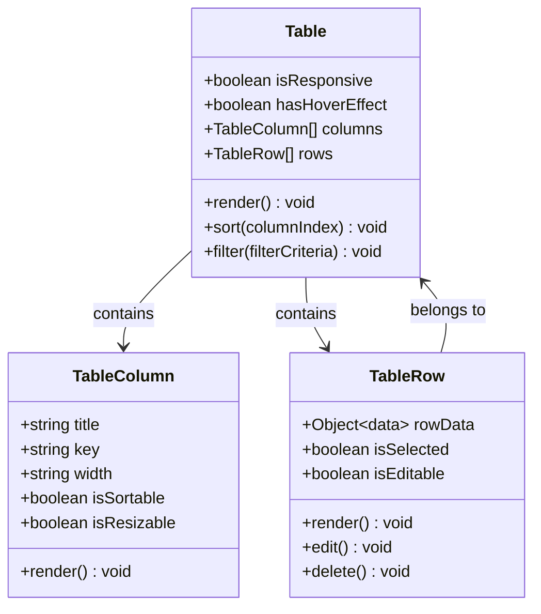

**图表来源**
- [系统管理员原型-v1.html:347-356](file://月度业绩考核原型设计初稿/1-系统管理员原型-v1.html#L347-L356)
- [系统管理员原型-v1.html:235-268](file://月度业绩考核原型设计初稿/1-系统管理员原型-v1.html#L235-L268)

#### 组件特性
- **响应式设计**：支持横向滚动和列隐藏
- **交互功能**：支持排序、筛选、选择等操作
- **状态指示**：使用状态标签显示数据状态
- **操作按钮**：提供编辑、删除等行内操作

**章节来源**
- [系统管理员原型-v1.html:347-356](file://月度业绩考核原型设计初稿/1-系统管理员原型-v1.html#L347-L356)
- [部门负责人原型-v1.html:442-525](file://月度业绩考核原型设计初稿/4-部门负责人原型-v1.html#L442-L525)

### 分页组件

分页组件提供了大数据集的导航和浏览功能：

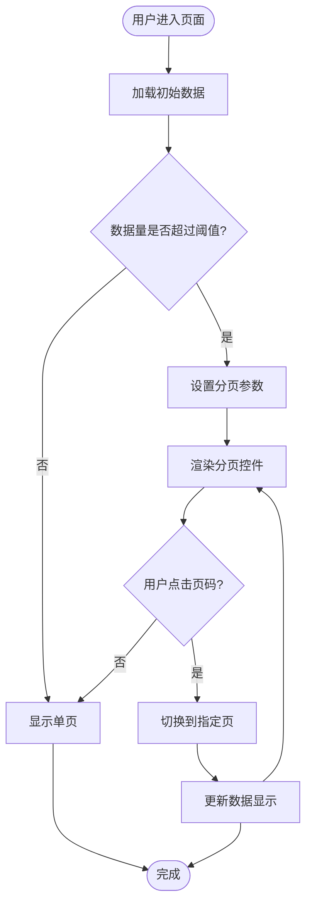

**图表来源**
- [系统管理员原型-v1.html:356-357](file://月度业绩考核原型设计初稿/1-系统管理员原型-v1.html#L356-L357)
- [系统管理员原型-v1.html:244-279](file://月度业绩考核原型设计初稿/1-系统管理员原型-v1.html#L244-L279)

#### 组件特性
- **智能分页**：根据数据量自动显示分页控件
- **页码导航**：支持直接跳转到指定页码
- **状态显示**：显示总记录数和当前页信息
- **响应式布局**：适配不同屏幕尺寸的显示效果

**章节来源**
- [系统管理员原型-v1.html:356-357](file://月度业绩考核原型设计初稿/1-系统管理员原型-v1.html#L356-L357)
- [计划财务处业绩考核管理员原型-v1.html:527-535](file://月度业绩考核原型设计初稿/2-计划财务处业绩考核管理员原型-v1.html#L527-L535)

### 模态框组件

模态框组件提供了弹窗对话和复杂表单的交互体验：

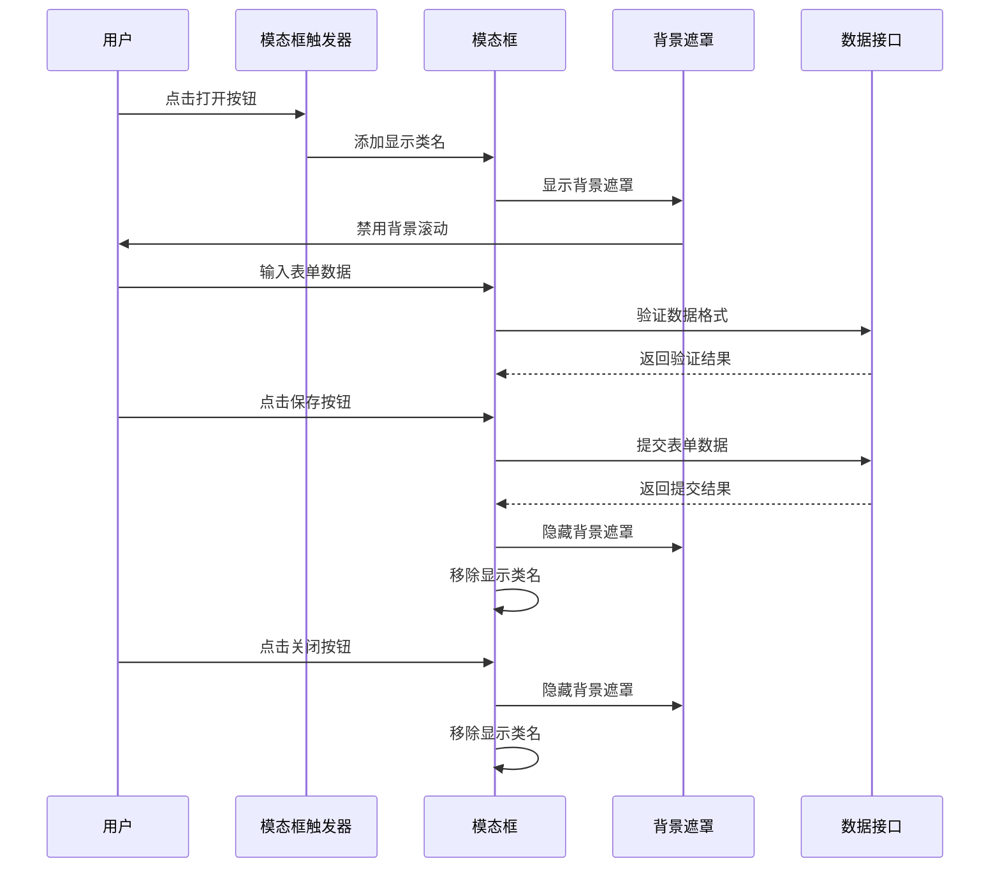

**图表来源**
- [系统管理员原型-v1.html:564-573](file://月度业绩考核原型设计初稿/1-系统管理员原型-v1.html#L564-L573)
- [系统管理员原型-v1.html:279-289](file://月度业绩考核原型设计初稿/1-系统管理员原型-v1.html#L279-L289)

#### 组件特性
- **遮罩层**：提供背景遮罩和焦点锁定
- **动画效果**：平滑的显示和隐藏过渡
- **键盘导航**：支持ESC键关闭和Tab键循环
- **表单集成**：内置表单验证和提交处理

**章节来源**
- [系统管理员原型-v1.html:564-611](file://月度业绩考核原型设计初稿/1-系统管理员原型-v1.html#L564-L611)
- [计划财务处业绩考核管理员原型-v1.html:658-727](file://月度业绩考核原型设计初稿/2-计划财务处业绩考核管理员原型-v1.html#L658-L727)

## 依赖分析

系统组件之间的依赖关系体现了清晰的层次结构和职责分离：

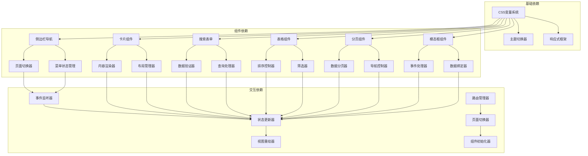

**图表来源**
- [系统管理员原型-v1.html:612-632](file://月度业绩考核原型设计初稿/1-系统管理员原型-v1.html#L612-L632)
- [计划财务处业绩考核管理员原型-v1.html:664-800](file://月度业绩考核原型设计初稿/2-计划财务处业绩考核管理员原型-v1.html#L664-L800)

### 组件耦合度分析

系统采用了低耦合的设计原则：
- **CSS变量解耦**：通过CSS变量实现样式解耦
- **事件驱动**：使用事件机制实现组件间通信
- **状态集中**：统一的状态管理减少组件间依赖
- **接口抽象**：通过标准化接口实现组件复用

**章节来源**
- [系统管理员原型-v1.html:612-632](file://月度业绩考核原型设计初稿/1-系统管理员原型-v1.html#L612-L632)
- [部门绩效管理员原型-v1.html:766-800](file://月度业绩考核原型设计初稿/3-部门绩效管理员原型-v1.html#L766-L800)

## 性能考虑

### 加载优化

系统采用了多种性能优化策略：

1. **CSS变量优化**：通过CSS变量减少重复样式定义
2. **事件委托**：使用事件委托减少事件监听器数量
3. **懒加载**：模态框内容按需加载
4. **缓存策略**：利用浏览器缓存机制

### 运行时优化

- **虚拟滚动**：大数据表格采用虚拟滚动技术
- **防抖节流**：搜索输入和窗口resize事件的防抖处理
- **内存管理**：及时清理事件监听器和DOM引用
- **渲染优化**：使用CSS3硬件加速提升动画性能

## 故障排除指南

### 常见问题诊断

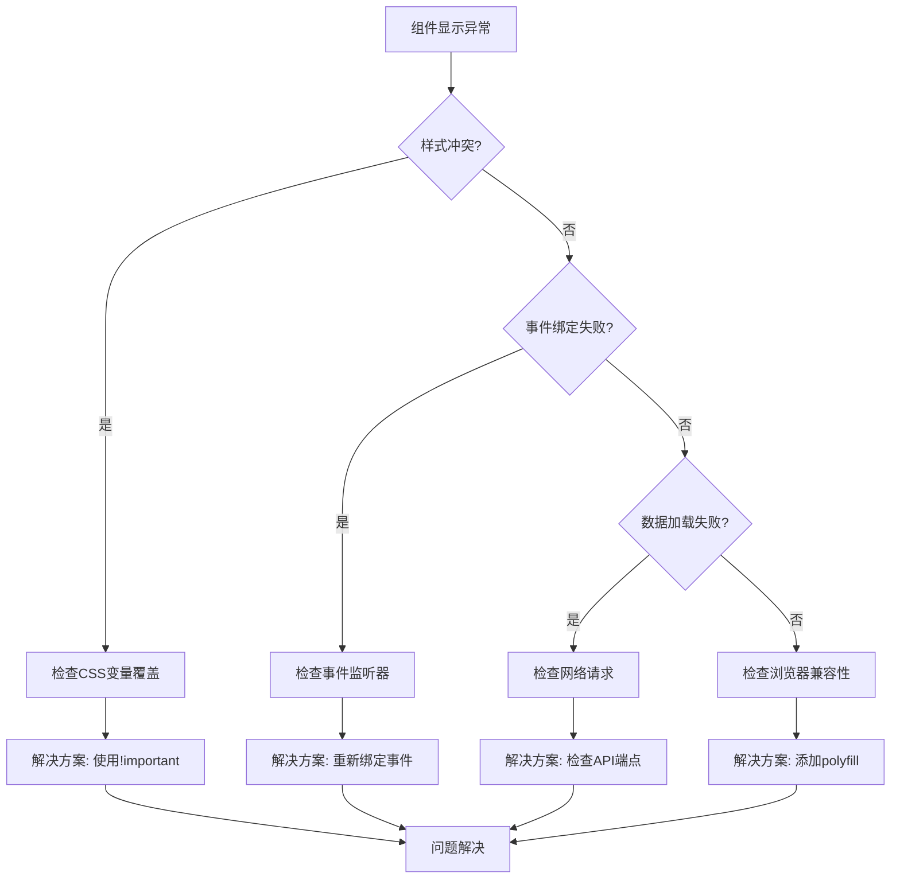

### 调试工具推荐

- **浏览器开发者工具**：检查CSS变量和样式计算
- **性能面板**：监控组件渲染性能
- **网络面板**：调试异步数据加载
- **控制台**：查看JavaScript错误和警告

**章节来源**
- [系统管理员原型-v1.html:612-632](file://月度业绩考核原型设计初稿/1-系统管理员原型-v1.html#L612-L632)

## 结论

本组件库设计展现了现代Web应用的组件化开发理念，通过统一的CSS变量系统和标准化的组件接口，实现了高度的可复用性和可维护性。系统不仅在视觉上保持了一致性，更重要的是在交互体验和开发效率方面都达到了较高水平。

组件库的设计充分考虑了企业级应用的需求特点，包括多角色支持、复杂的业务流程、严格的数据安全要求等。通过模块化的架构设计和清晰的职责分离，为后续的功能扩展和维护奠定了良好的基础。

## 附录

### 最佳实践清单

1. **样式管理**
   - 使用CSS变量统一管理样式主题
   - 遵循BEM命名约定
   - 避免内联样式的使用

2. **组件开发**
   - 保持组件的单一职责
   - 提供清晰的属性接口
   - 实现完整的生命周期管理

3. **性能优化**
   - 使用事件委托减少监听器数量
   - 实现必要的防抖和节流
   - 优化DOM操作和重排重绘

4. **可访问性**
   - 提供键盘导航支持
   - 确保足够的色彩对比度
   - 使用语义化HTML标签

5. **测试策略**
   - 编写单元测试覆盖核心逻辑
   - 进行跨浏览器兼容性测试
   - 执行可访问性测试

### 扩展指南

组件库支持以下扩展方式：

1. **主题扩展**：通过CSS变量定义新的主题
2. **组件扩展**：基于现有组件开发新的业务组件
3. **功能扩展**：添加新的交互模式和数据处理逻辑
4. **集成扩展**：与其他系统和服务进行集成

**章节来源**
- [系统管理员原型-v1.html:186-185](file://月度业绩考核原型设计初稿/1-系统管理员原型-v1.html#L186-L185)
- [时序图-v1.html:111-298](file://月度业绩考核原型设计初稿/6-时序图-v1.html#L111-L298)