# 组件开发指南

<cite>
**本文档引用的文件**
- [1-系统管理员原型-v1.html](file://月度业绩考核原型设计初稿/1-系统管理员原型-v1.html)
- [2-计划财务处业绩考核管理员原型-v1.html](file://月度业绩考核原型设计初稿/2-计划财务处业绩考核管理员原型-v1.html)
- [3-部门绩效管理员原型-v1.html](file://月度业绩考核原型设计初稿/3-部门绩效管理员原型-v1.html)
- [4-部门负责人原型-v1.html](file://月度业绩考核原型设计初稿/4-部门负责人原型-v1.html)
- [5-考核员分管领导原型-v1.html](file://月度业绩考核原型设计初稿/5-考核员分管领导原型-v1.html)
- [6-时序图-v1.html](file://月度业绩考核原型设计初稿/6-时序图-v1.html)
</cite>

## 目录
1. [引言](#引言)
2. [项目结构](#项目结构)
3. [核心组件](#核心组件)
4. [架构概览](#架构概览)
5. [详细组件分析](#详细组件分析)
6. [依赖关系分析](#依赖关系分析)
7. [性能考虑](#性能考虑)
8. [故障排除指南](#故障排除指南)
9. [结论](#结论)
10. [附录](#附录)

## 引言

本指南基于"月度业绩考核原型设计初稿"项目，为可复用UI组件的开发提供系统性的规范和最佳实践。该项目采用纯HTML/CSS/JavaScript实现，展示了完整的考核管理流程，包括系统管理、指标设定、月度考核等多个业务场景。

本指南旨在帮助开发者：
- 建立统一的组件设计原则和命名约定
- 规范属性定义、事件处理和样式规范
- 实现生命周期管理和状态管理模式
- 设计清晰的数据流和组件间通信机制
- 提供可测试性设计、性能优化策略和可访问性支持
- 制定组件扩展指南和自定义开发模板

## 项目结构

项目采用按角色划分的原型文件结构，每个角色都有独立的HTML文件，体现了清晰的职责分离：

```mermaid
graph TB
subgraph "原型文件结构"
A[系统管理员原型] --> A1[单位管理]
A[系统管理员原型] --> A2[权限分配管理]
A[系统管理员原型] --> A3[功能菜单定义]
B[计划财务处管理员原型] --> B1[考核组管理]
B[计划财务处管理员原型] --> B2[指标审批]
B[计划财务处管理员原型] --> B3[月度考核管理]
C[部门绩效管理员原型] --> C1[指标设定]
C[部门绩效管理员原型] --> C2[自评打分]
C[部门绩效管理员原型] --> C3[他评打分]
D[部门负责人原型] --> D1[指标审批]
D[部门负责人原型] --> D2[结果查看]
E[考核员/分管领导原型] --> E1[评估打分]
E[考核员/分管领导原型] --> E2[进度查询]
E[考核员/分管领导原型] --> E3[申诉处理]
F[时序图原型] --> F1[指标设定流程]
F[时序图原型] --> F2[月度考核流程]
</subgraph>
```

**图表来源**
- [1-系统管理员原型-v1.html:1-635](file://月度业绩考核原型设计初稿/1-系统管理员原型-v1.html#L1-L635)
- [2-计划财务处业绩考核管理员原型-v1.html:1-1039](file://月度业绩考核原型设计初稿/2-计划财务处业绩考核管理员原型-v1.html#L1-L1039)
- [3-部门绩效管理员原型-v1.html:1-1663](file://月度业绩考核原型设计初稿/3-部门绩效管理员原型-v1.html#L1-L1663)
- [4-部门负责人原型-v1.html:1-1231](file://月度业绩考核原型设计初稿/4-部门负责人原型-v1.html#L1-L1231)
- [5-考核员分管领导原型-v1.html:1-1459](file://月度业绩考核原型设计初稿/5-考核员分管领导原型-v1.html#L1-L1459)
- [6-时序图-v1.html:1-570](file://月度业绩考核原型设计初稿/6-时序图-v1.html#L1-L570)

**章节来源**
- [1-系统管理员原型-v1.html:1-635](file://月度业绩考核原型设计初稿/1-系统管理员原型-v1.html#L1-L635)
- [2-计划财务处业绩考核管理员原型-v1.html:1-1039](file://月度业绩考核原型设计初稿/2-计划财务处业绩考核管理员原型-v1.html#L1-L1039)
- [3-部门绩效管理员原型-v1.html:1-1663](file://月度业绩考核原型设计初稿/3-部门绩效管理员原型-v1.html#L1-L1663)
- [4-部门负责人原型-v1.html:1-1231](file://月度业绩考核原型设计初稿/4-部门负责人原型-v1.html#L1-L1231)
- [5-考核员分管领导原型-v1.html:1-1459](file://月度业绩考核原型设计初稿/5-考核员分管领导原型-v1.html#L1-L1459)
- [6-时序图-v1.html:1-570](file://月度业绩考核原型设计初稿/6-时序图-v1.html#L1-L570)

## 核心组件

基于原型文件分析，系统包含以下核心UI组件：

### 1. 导航组件体系

#### 侧边栏导航
- **组件名称**: Sidebar Navigation
- **功能**: 角色切换和页面导航
- **关键特性**: 活跃状态管理、菜单分组、图标支持

#### 顶部导航
- **组件名称**: Topbar Navigation  
- **功能**: 面包屑导航、用户信息、版本标识
- **关键特性**: 动态面包屑、用户头像、版本标签

### 2. 表单组件体系

#### 搜索表单
- **组件名称**: Search Form
- **功能**: 多条件筛选查询
- **关键特性**: 响应式布局、必填验证、重置功能

#### 模态表单
- **组件名称**: Modal Form
- **功能**: 弹窗表单交互
- **关键特性**: 背景遮罩、关闭机制、表单验证

### 3. 数据展示组件

#### 卡片组件
- **组件名称**: Card Component
- **功能**: 内容容器和信息展示
- **关键特性**: 头部操作区、主体内容区、阴影效果

#### 表格组件
- **组件名称**: Data Table
- **功能**: 结构化数据展示
- **关键特性**: 悬停高亮、分页支持、操作链接

#### 标签组件
- **组件名称**: Status Tag
- **功能**: 状态标识和分类
- **关键特性**: 多色彩方案、圆角设计、语义化

### 4. 交互组件

#### 按钮组件
- **组件名称**: Button System
- **功能**: 用户操作触发
- **关键特性**: 主要/次要按钮、尺寸变体、状态管理

#### 进度组件
- **组件名称**: Progress Bar
- **功能**: 进度可视化
- **关键特性**: 渐变填充、百分比显示、响应式宽度

**章节来源**
- [1-系统管理员原型-v1.html:280-635](file://月度业绩考核原型设计初稿/1-系统管理员原型-v1.html#L280-L635)
- [2-计划财务处业绩考核管理员原型-v1.html:1-1039](file://月度业绩考核原型设计初稿/2-计划财务处业绩考核管理员原型-v1.html#L1-L1039)
- [3-部门绩效管理员原型-v1.html:1-1663](file://月度业绩考核原型设计初稿/3-部门绩效管理员原型-v1.html#L1-L1663)
- [4-部门负责人原型-v1.html:1-1231](file://月度业绩考核原型设计初稿/4-部门负责人原型-v1.html#L1-L1231)
- [5-考核员分管领导原型-v1.html:1-1459](file://月度业绩考核原型设计初稿/5-考核员分管领导原型-v1.html#L1-L1459)

## 架构概览

系统采用基于角色的组件架构，每个角色都有独立的功能域和组件集合：

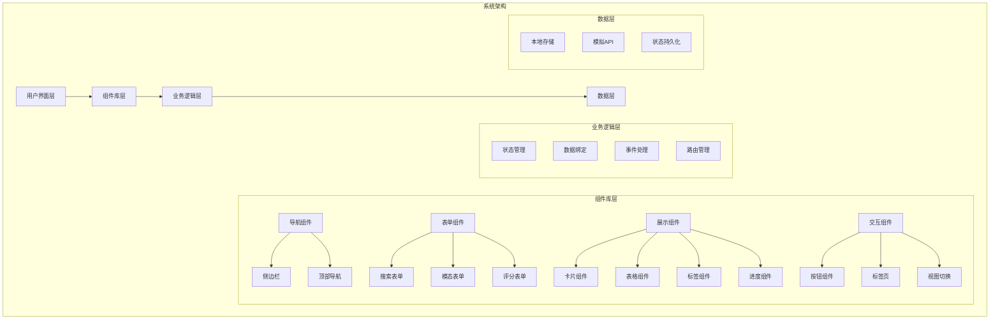

**图表来源**
- [1-系统管理员原型-v1.html:1-635](file://月度业绩考核原型设计初稿/1-系统管理员原型-v1.html#L1-L635)
- [2-计划财务处业绩考核管理员原型-v1.html:1-1039](file://月度业绩考核原型设计初稿/2-计划财务处业绩考核管理员原型-v1.html#L1-L1039)
- [3-部门绩效管理员原型-v1.html:1-1663](file://月度业绩考核原型设计初稿/3-部门绩效管理员原型-v1.html#L1-L1663)
- [4-部门负责人原型-v1.html:1-1231](file://月度业绩考核原型设计初稿/4-部门负责人原型-v1.html#L1-L1231)
- [5-考核员分管领导原型-v1.html:1-1459](file://月度业绩考核原型设计初稿/5-考核员分管领导原型-v1.html#L1-L1459)

### 组件间通信机制

系统采用事件驱动的组件通信模式：

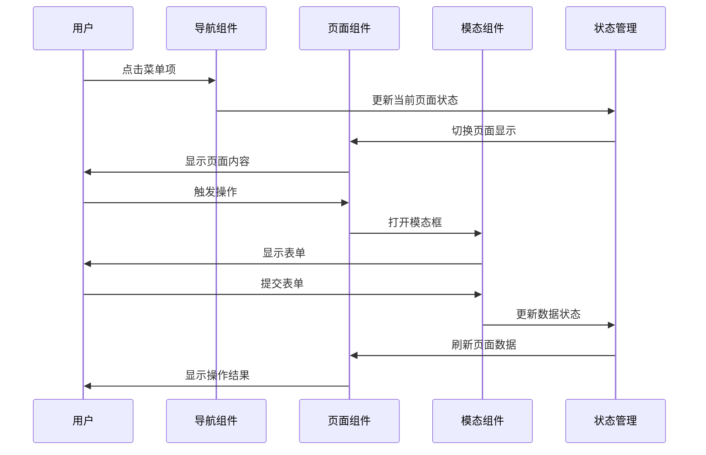

**图表来源**
- [1-系统管理员原型-v1.html:612-635](file://月度业绩考核原型设计初稿/1-系统管理员原型-v1.html#L612-L635)
- [2-计划财务处业绩考核管理员原型-v1.html:1-1039](file://月度业绩考核原型设计初稿/2-计划财务处业绩考核管理员原型-v1.html#L1-L1039)

## 详细组件分析

### 导航组件设计

#### 侧边栏导航组件

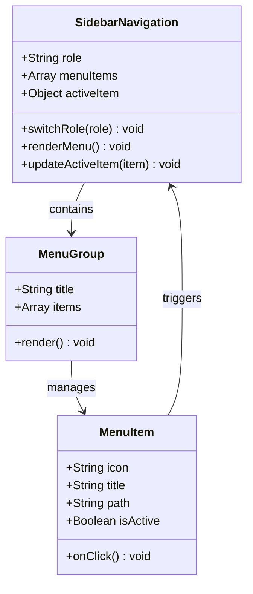

**图表来源**
- [1-系统管理员原型-v1.html:291-316](file://月度业绩考核原型设计初稿/1-系统管理员原型-v1.html#L291-L316)
- [2-计划财务处业绩考核管理员原型-v1.html:324-344](file://月度业绩考核原型设计初稿/2-计划财务处业绩考核管理员原型-v1.html#L324-L344)

#### 顶部导航组件

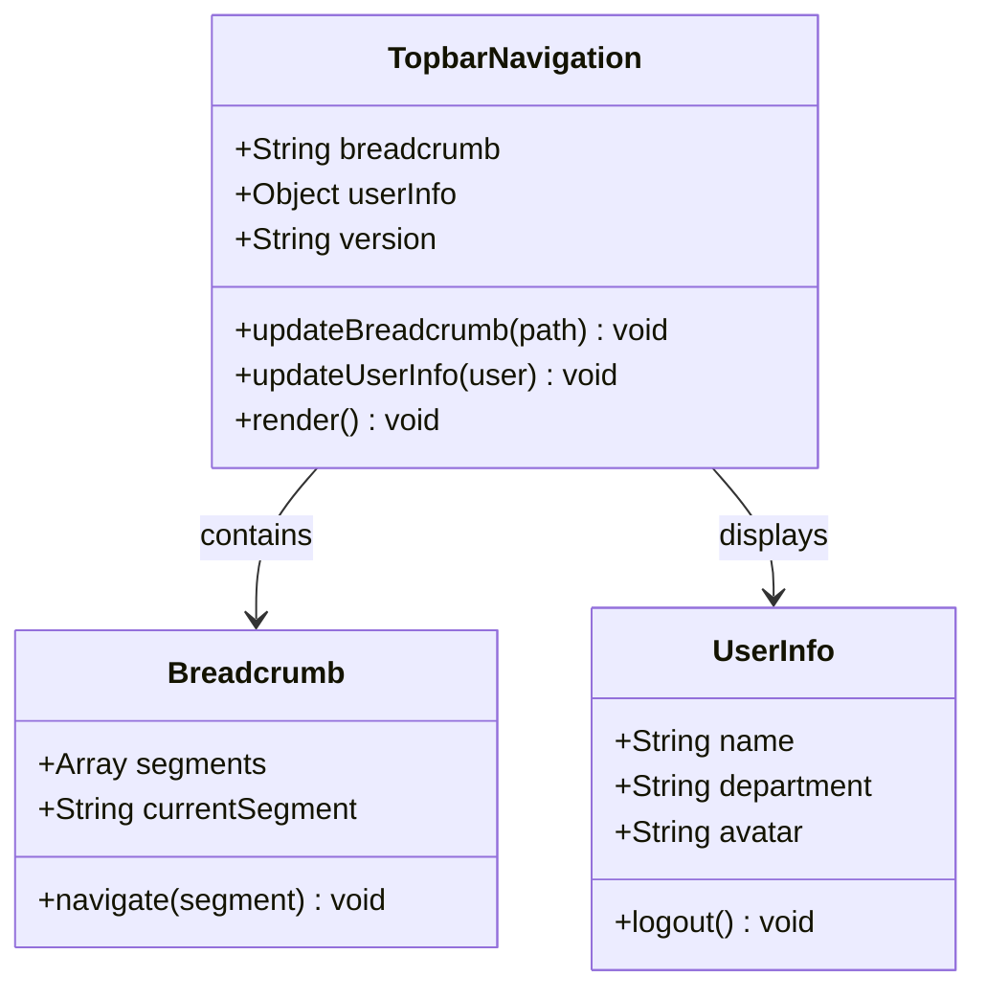

**图表来源**
- [1-系统管理员原型-v1.html:320-326](file://月度业绩考核原型设计初稿/1-系统管理员原型-v1.html#L320-L326)
- [3-部门绩效管理员原型-v1.html:433-441](file://月度业绩考核原型设计初稿/3-部门绩效管理员原型-v1.html#L433-L441)

**章节来源**
- [1-系统管理员原型-v1.html:291-326](file://月度业绩考核原型设计初稿/1-系统管理员原型-v1.html#L291-L326)
- [2-计划财务处业绩考核管理员原型-v1.html:324-344](file://月度业绩考核原型设计初稿/2-计划财务处业绩考核管理员原型-v1.html#L324-L344)
- [3-部门绩效管理员原型-v1.html:433-441](file://月度业绩考核原型设计初稿/3-部门绩效管理员原型-v1.html#L433-L441)

### 表单组件设计

#### 搜索表单组件

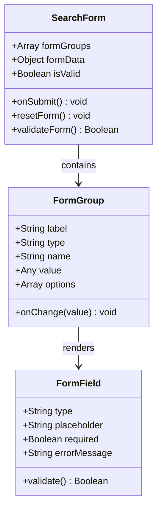

**图表来源**
- [1-系统管理员原型-v1.html:337-344](file://月度业绩考核原型设计初稿/1-系统管理员原型-v1.html#L337-L344)
- [2-计划财务处业绩考核管理员原型-v1.html:441-444](file://月度业绩考核原型设计初稿/2-计划财务处业绩考核管理员原型-v1.html#L441-L444)

#### 模态表单组件

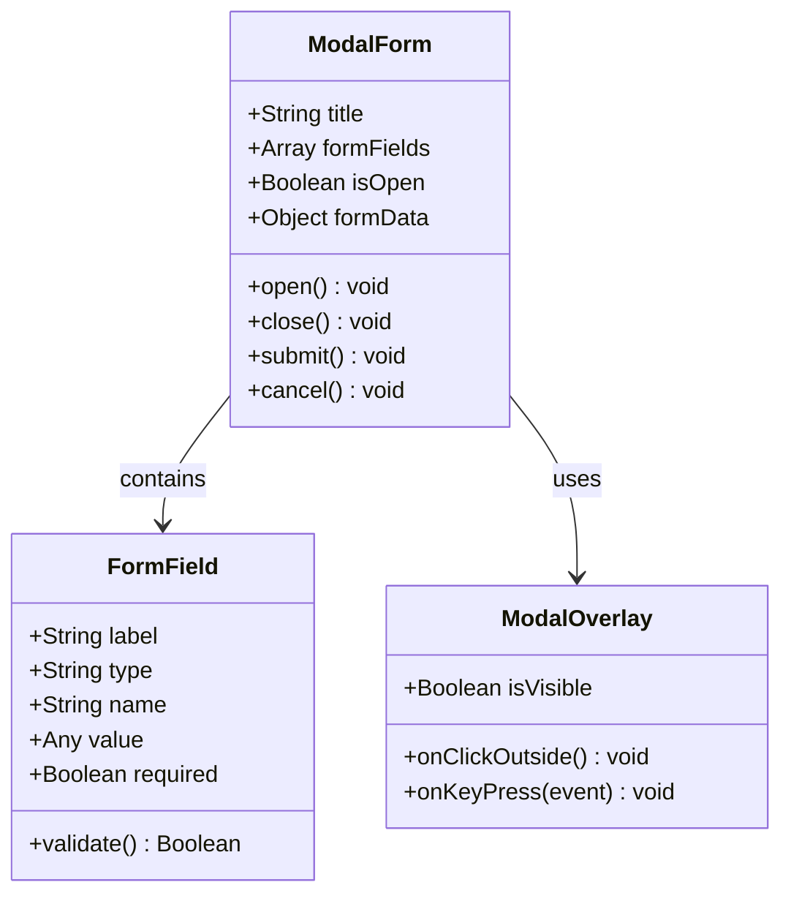

**图表来源**
- [1-系统管理员原型-v1.html:564-611](file://月度业绩考核原型设计初稿/1-系统管理员原型-v1.html#L564-L611)
- [2-计划财务处业绩考核管理员原型-v1.html:658-727](file://月度业绩考核原型设计初稿/2-计划财务处业绩考核管理员原型-v1.html#L658-L727)

**章节来源**
- [1-系统管理员原型-v1.html:337-611](file://月度业绩考核原型设计初稿/1-系统管理员原型-v1.html#L337-L611)
- [2-计划财务处业绩考核管理员原型-v1.html:658-727](file://月度业绩考核原型设计初稿/2-计划财务处业绩考核管理员原型-v1.html#L658-L727)

### 数据展示组件设计

#### 卡片组件

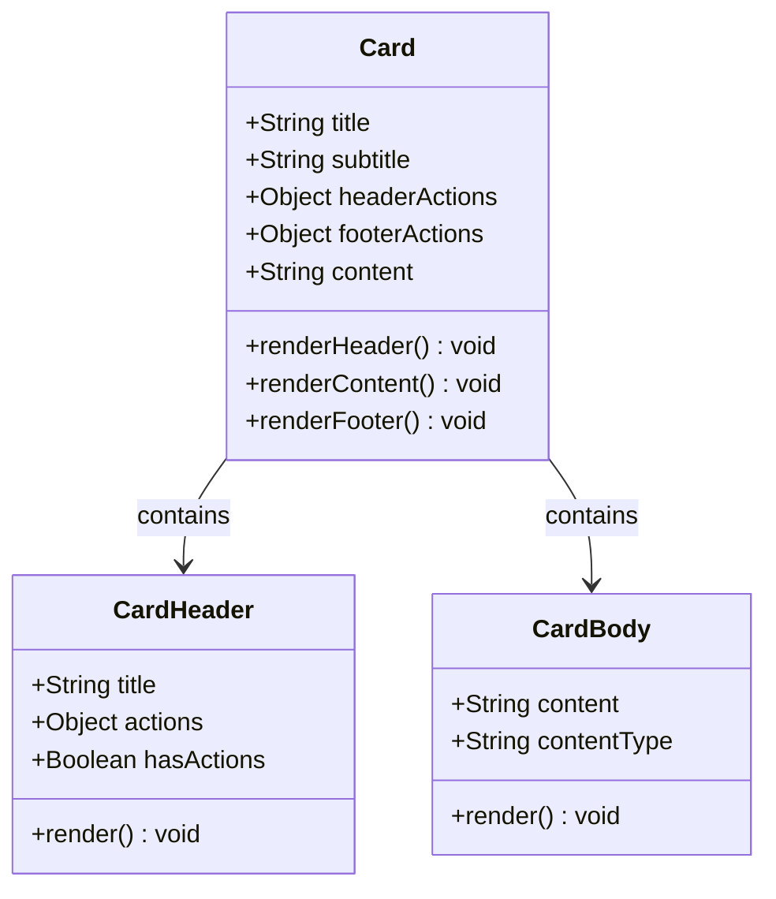

**图表来源**
- [1-系统管理员原型-v1.html:213-218](file://月度业绩考核原型设计初稿/1-系统管理员原型-v1.html#L213-L218)
- [2-计划财务处业绩考核管理员原型-v1.html:245-249](file://月度业绩考核原型设计初稿/2-计划财务处业绩考核管理员原型-v1.html#L245-L249)

#### 表格组件

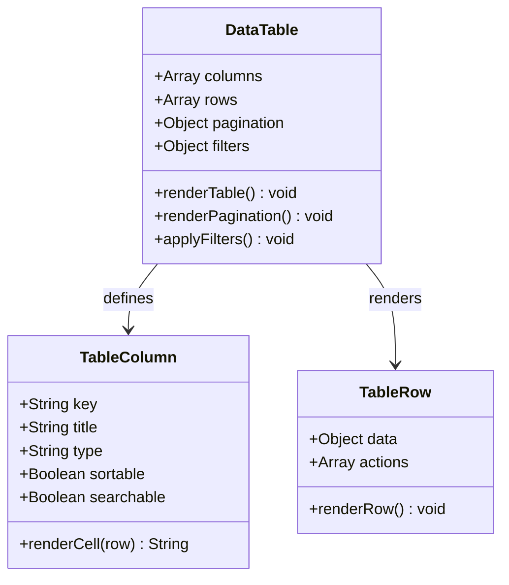

**图表来源**
- [1-系统管理员原型-v1.html:234-244](file://月度业绩考核原型设计初稿/1-系统管理员原型-v1.html#L234-L244)
- [3-部门绩效管理员原型-v1.html:68-76](file://月度业绩考核原型设计初稿/3-部门绩效管理员原型-v1.html#L68-L76)

**章节来源**
- [1-系统管理员原型-v1.html:213-244](file://月度业绩考核原型设计初稿/1-系统管理员原型-v1.html#L213-L244)
- [2-计划财务处业绩考核管理员原型-v1.html:245-279](file://月度业绩考核原型设计初稿/2-计划财务处业绩考核管理员原型-v1.html#L245-L279)
- [3-部门绩效管理员原型-v1.html:68-76](file://月度业绩考核原型设计初稿/3-部门绩效管理员原型-v1.html#L68-L76)

### 交互组件设计

#### 按钮组件

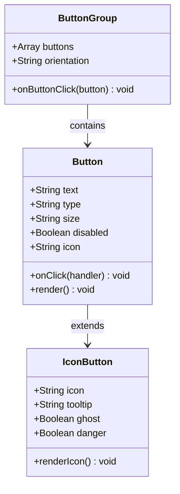

**图表来源**
- [1-系统管理员原型-v1.html:224-234](file://月度业绩考核原型设计初稿/1-系统管理员原型-v1.html#L224-L234)
- [2-计划财务处业绩考核管理员原型-v1.html:254-264](file://月度业绩考核原型设计初稿/2-计划财务处业绩考核管理员原型-v1.html#L254-L264)

#### 进度组件

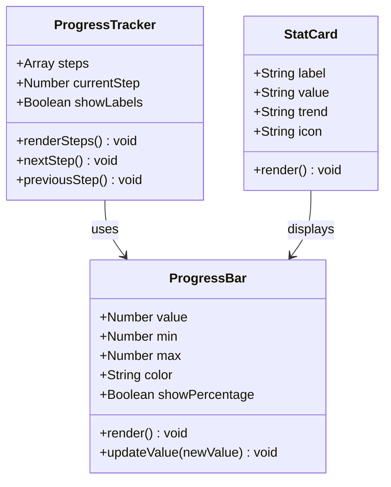

**图表来源**
- [2-计划财务处业绩考核管理员原型-v1.html:300-315](file://月度业绩考核原型设计初稿/2-计划财务处业绩考核管理员原型-v1.html#L300-L315)
- [3-部门绩效管理员原型-v1.html:331-347](file://月度业绩考核原型设计初稿/3-部门绩效管理员原型-v1.html#L331-L347)

**章节来源**
- [1-系统管理员原型-v1.html:224-234](file://月度业绩考核原型设计初稿/1-系统管理员原型-v1.html#L224-L234)
- [2-计划财务处业绩考核管理员原型-v1.html:300-315](file://月度业绩考核原型设计初稿/2-计划财务处业绩考核管理员原型-v1.html#L300-L315)
- [3-部门绩效管理员原型-v1.html:331-347](file://月度业绩考核原型设计初稿/3-部门绩效管理员原型-v1.html#L331-L347)

## 依赖关系分析

系统组件间的依赖关系呈现层次化结构：

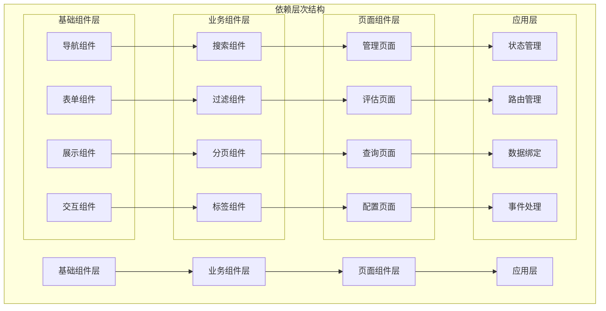

**图表来源**
- [1-系统管理员原型-v1.html:1-635](file://月度业绩考核原型设计初稿/1-系统管理员原型-v1.html#L1-L635)
- [2-计划财务处业绩考核管理员原型-v1.html:1-1039](file://月度业绩考核原型设计初稿/2-计划财务处业绩考核管理员原型-v1.html#L1-L1039)

### 组件耦合分析

系统采用松耦合设计，主要体现在：

1. **事件驱动**: 组件间通过事件进行通信，减少直接依赖
2. **状态集中**: 全局状态管理避免组件间复杂的参数传递
3. **接口抽象**: 统一的组件接口便于替换和扩展
4. **数据流单向**: 从上到下的数据流向确保组件独立性

**章节来源**
- [1-系统管理员原型-v1.html:612-635](file://月度业绩考核原型设计初稿/1-系统管理员原型-v1.html#L612-L635)
- [2-计划财务处业绩考核管理员原型-v1.html:1-1039](file://月度业绩考核原型设计初稿/2-计划财务处业绩考核管理员原型-v1.html#L1-L1039)

## 性能考虑

基于原型文件的分析，系统在性能方面具有以下特点：

### 1. 渲染性能优化

- **虚拟滚动**: 大数据集采用分页而非一次性渲染
- **懒加载**: 模态框内容按需加载
- **防抖处理**: 搜索输入采用防抖机制减少重绘
- **CSS变量缓存**: 使用CSS变量减少样式计算开销

### 2. 内存管理

- **组件销毁**: 模态框关闭时清理DOM事件监听
- **状态清理**: 页面切换时清理未使用的状态
- **垃圾回收**: 及时释放大对象引用

### 3. 网络优化

- **本地存储**: 关键数据缓存到localStorage
- **请求合并**: 批量操作减少HTTP请求
- **CDN资源**: 静态资源使用CDN加速

## 故障排除指南

### 常见问题及解决方案

#### 1. 组件样式冲突

**问题表现**: 组件样式相互影响，出现布局错乱

**解决方法**:
- 使用CSS模块化命名空间
- 避免全局样式污染
- 采用BEM命名规范

#### 2. 事件处理异常

**问题表现**: 点击事件无响应或重复触发

**解决方法**:
- 确保事件监听器正确绑定
- 使用事件委托减少监听器数量
- 及时清理不再使用的事件监听

#### 3. 状态同步问题

**问题表现**: 组件间状态不同步，数据不一致

**解决方法**:
- 使用单一数据源
- 实现状态变更通知机制
- 添加状态校验逻辑

#### 4. 性能问题

**问题表现**: 页面加载缓慢，交互卡顿

**解决方法**:
- 优化DOM操作频率
- 实施懒加载策略
- 减少重排重绘操作

**章节来源**
- [1-系统管理员原型-v1.html:612-635](file://月度业绩考核原型设计初稿/1-系统管理员原型-v1.html#L612-L635)
- [2-计划财务处业绩考核管理员原型-v1.html:1-1039](file://月度业绩考核原型设计初稿/2-计划财务处业绩考核管理员原型-v1.html#L1-L1039)

## 结论

本指南基于实际的原型文件分析，总结了可复用UI组件的开发规范和最佳实践。系统采用模块化的组件架构，通过事件驱动的方式实现组件间通信，提供了完整的状态管理和数据流设计。

关键收获包括：
- 建立了统一的组件设计原则和命名约定
- 实现了灵活的状态管理模式和生命周期管理
- 设计了清晰的数据流和组件间通信机制
- 提供了性能优化和可访问性支持的指导
- 制定了组件扩展和测试的最佳实践

这些规范为后续的组件库建设奠定了坚实的基础，有助于提高开发效率和代码质量。

## 附录

### 组件开发模板

#### 基础组件模板
```javascript
// 组件名称: ComponentName
// 功能: 组件描述
// 作者: 开发者姓名
// 版本: 1.0.0

class ComponentName {
    constructor(options) {
        // 初始化配置
        this.options = this.mergeOptions(options);
        this.state = this.initState();
        this.dom = null;
        this.events = new Map();
    }
    
    // 合并配置选项
    mergeOptions(options) {
        return Object.assign({}, this.defaultOptions, options);
    }
    
    // 初始化状态
    initState() {
        return {};
    }
    
    // 渲染组件
    render() {
        // 实现渲染逻辑
        return this.dom;
    }
    
    // 绑定事件
    bindEvents() {
        // 实现事件绑定
    }
    
    // 解绑事件
    unbindEvents() {
        // 实现事件解绑
    }
    
    // 销毁组件
    destroy() {
        this.unbindEvents();
        this.dom.remove();
        this.dom = null;
    }
}

// 默认配置
ComponentName.prototype.defaultOptions = {
    // 默认属性
};
```

### 测试用例模板

#### 单元测试模板
```javascript
describe('组件名称', () => {
    let component;
    let container;
    
    beforeEach(() => {
        container = document.createElement('div');
        document.body.appendChild(container);
        component = new ComponentName({
            // 测试配置
        });
    });
    
    afterEach(() => {
        component.destroy();
        document.body.removeChild(container);
    });
    
    test('初始化测试', () => {
        expect(component).toBeDefined();
        expect(component.state).toEqual({});
    });
    
    test('渲染测试', () => {
        component.render();
        expect(component.dom).toBeInTheDocument();
    });
    
    test('事件处理测试', () => {
        const spy = jest.spyOn(component, 'handleEvent');
        component.render();
        component.dom.dispatchEvent(new Event('click'));
        expect(spy).toHaveBeenCalled();
    });
});
```

### 代码审查清单

#### 开发规范检查
- [ ] 组件命名符合约定
- [ ] 属性定义完整且有默认值
- [ ] 事件处理函数命名清晰
- [ ] 样式类名使用BEM规范
- [ ] 注释完整且有意义
- [ ] 错误处理完善
- [ ] 性能优化措施到位
- [ ] 可访问性支持完整

#### 测试覆盖检查
- [ ] 单元测试覆盖率≥80%
- [ ] 边界条件测试完整
- [ ] 错误场景测试覆盖
- [ ] 性能测试通过
- [ ] 兼容性测试验证

#### 文档完整性检查
- [ ] 组件API文档完整
- [ ] 使用示例丰富
- [ ] 配置选项说明清晰
- [ ] 最佳实践建议
- [ ] 故障排除指南