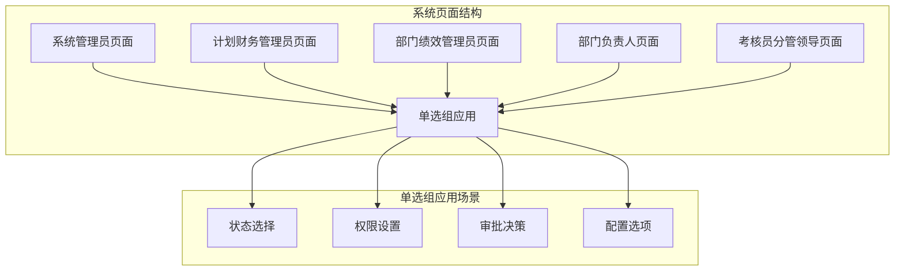
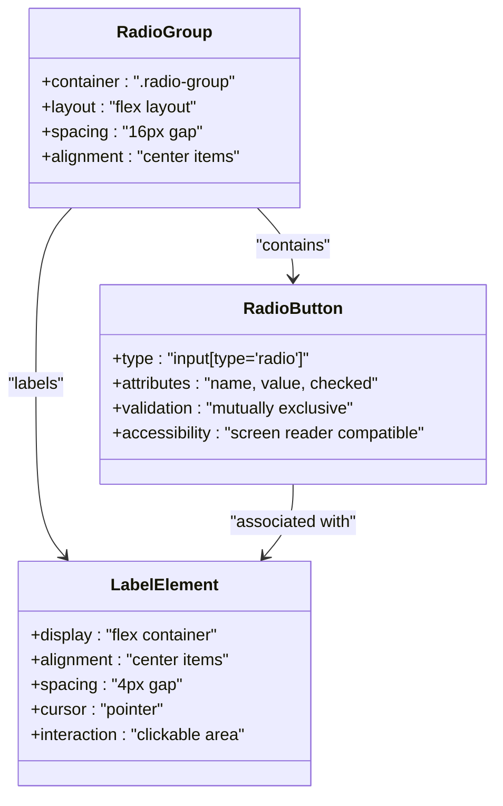
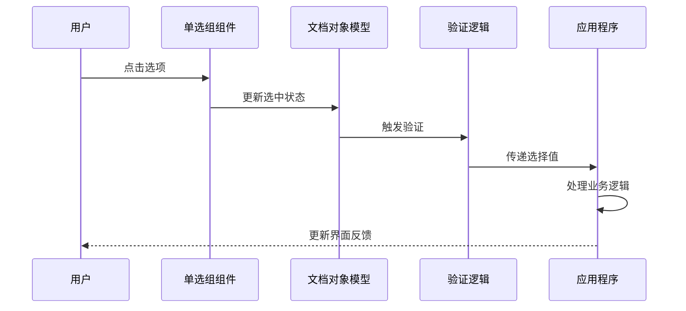
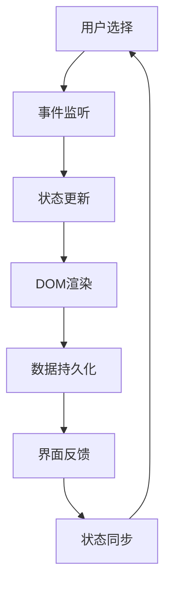
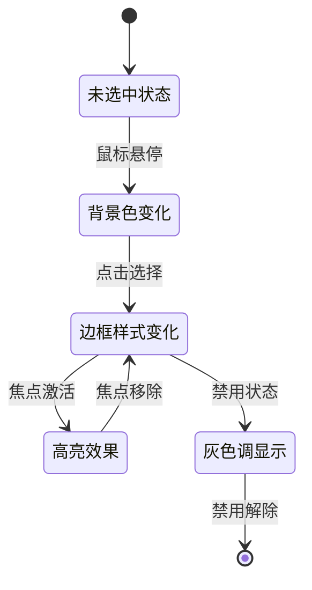
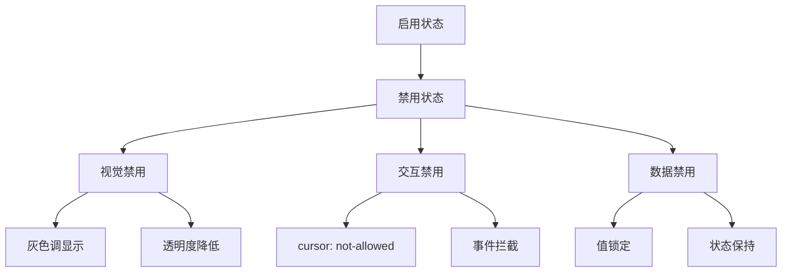
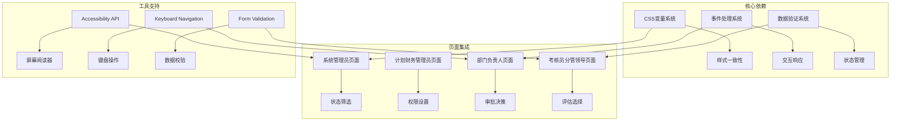
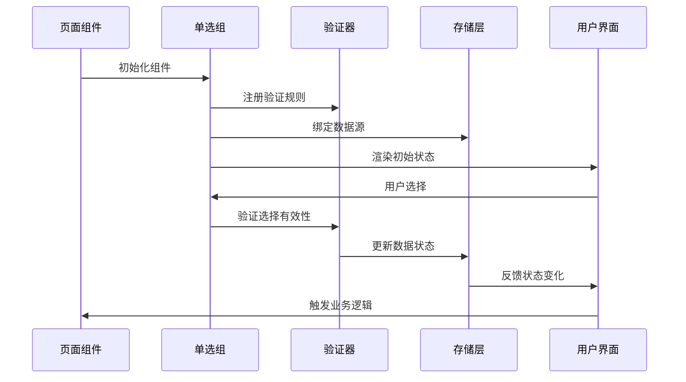
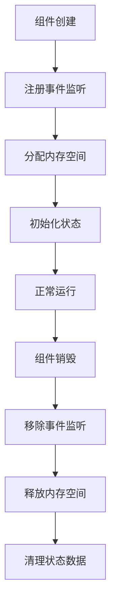

# 单选组组件

<cite>
**本文档引用的文件**
- [1-系统管理员原型-v1.html](file://月度业绩考核原型设计初稿/1-系统管理员原型-v1.html)
- [2-计划财务处业绩考核管理员原型-v1.html](file://月度业绩考核原型设计初稿/2-计划财务处业绩考核管理员原型-v1.html)
- [3-部门绩效管理员原型-v1.html](file://月度业绩考核原型设计初稿/3-部门绩效管理员原型-v1.html)
- [4-部门负责人原型-v1.html](file://月度业绩考核原型设计初稿/4-部门负责人原型-v1.html)
- [5-考核员分管领导原型-v1.html](file://月度业绩考核原型设计初稿/5-考核员分管领导原型-v1.html)
</cite>

## 目录
1. [简介](#简介)
2. [项目结构](#项目结构)
3. [核心组件](#核心组件)
4. [架构概览](#架构概览)
5. [详细组件分析](#详细组件分析)
6. [依赖分析](#依赖分析)
7. [性能考虑](#性能考虑)
8. [故障排除指南](#故障排除指南)
9. [结论](#结论)

## 简介

单选组（Radio Group）组件是月度业绩考核管理系统中的关键交互元素，用于在多个互斥选项之间进行选择。该组件在系统中广泛应用于各种场景，包括状态选择、权限设置、审批决策等。

单选组组件的核心结构由三个主要部分组成：
- `.radio-group` 容器：负责布局和样式管理
- `label` 标签：提供用户友好的文本描述和点击区域
- `input[type='radio']` 单选按钮：实现实际的选择逻辑

该组件在整个系统中承担着重要的数据收集和用户交互功能，确保用户能够在多个互斥选项中做出明确的选择。

## 项目结构

月度业绩考核管理系统采用多页面原型设计，每个页面都集成了单选组组件以满足不同的业务需求：



**图表来源**
- [1-系统管理员原型-v1.html](file://月度业绩考核原型设计初稿/1-系统管理员原型-v1.html#L598)
- [2-计划财务处业绩考核管理员原型-v1.html:1-800](file://月度业绩考核原型设计初稿/2-计划财务处业绩考核管理员原型-v1.html#L1-L800)
- [3-部门绩效管理员原型-v1.html:1-800](file://月度业绩考核原型设计初稿/3-部门绩效管理员原型-v1.html#L1-L800)
- [4-部门负责人原型-v1.html:1-800](file://月度业绩考核原型设计初稿/4-部门负责人原型-v1.html#L1-L800)
- [5-考核员分管领导原型-v1.html:1-800](file://月度业绩考核原型设计初稿/5-考核员分管领导原型-v1.html#L1-L800)

**章节来源**
- [1-系统管理员原型-v1.html:1-635](file://月度业绩考核原型设计初稿/1-系统管理员原型-v1.html#L1-L635)
- [2-计划财务处业绩考核管理员原型-v1.html:1-800](file://月度业绩考核原型设计初稿/2-计划财务处业绩考核管理员原型-v1.html#L1-L800)
- [3-部门绩效管理员原型-v1.html:1-800](file://月度业绩考核原型设计初稿/3-部门绩效管理员原型-v1.html#L1-L800)
- [4-部门负责人原型-v1.html:1-800](file://月度业绩考核原型设计初稿/4-部门负责人原型-v1.html#L1-L800)
- [5-考核员分管领导原型-v1.html:1-800](file://月度业绩考核原型设计初稿/5-考核员分管领导原型-v1.html#L1-L800)

## 核心组件

### 基础结构设计

单选组组件采用简洁而高效的HTML结构设计：



**图表来源**
- [1-系统管理员原型-v1.html:268-269](file://月度业绩考核原型设计初稿/1-系统管理员原型-v1.html#L268-L269)
- [4-部门负责人原型-v1.html:325-328](file://月度业绩考核原型设计初稿/4-部门负责人原型-v1.html#L325-L328)

### 样式系统架构

组件采用基于CSS变量的样式系统，确保一致的视觉体验：

| 样式属性 | 默认值 | 变量名 | 使用场景 |
|---------|--------|--------|----------|
| 容器间距 | 16px | `gap: 16px` | 主要布局间距 |
| 字体大小 | 13px | `font-size: 13px` | 文本显示 |
| 光标样式 | pointer | `cursor: pointer` | 交互提示 |
| 对齐方式 | center | `align-items: center` | 垂直居中 |
| 边距 | 4px | `gap: 4px` | 内部间距 |

**章节来源**
- [1-系统管理员原型-v1.html:268-269](file://月度业绩考核原型设计初稿/1-系统管理员原型-v1.html#L268-L269)
- [4-部门负责人原型-v1.html:325-328](file://月度业绩考核原型设计初稿/4-部门负责人原型-v1.html#L325-L328)

## 架构概览

### 组件集成模式

单选组组件在系统中采用统一的集成模式，确保跨页面的一致性：



**图表来源**
- [4-部门负责人原型-v1.html:795-798](file://月度业绩考核原型设计初稿/4-部门负责人原型-v1.html#L795-L798)

### 数据流架构

组件采用双向数据绑定机制，确保用户选择与应用程序状态的同步：



**图表来源**
- [4-部门负责人原型-v1.html:1233-1259](file://月度业绩考核原型设计初稿/4-部门负责人原型-v1.html#L1233-L1259)

**章节来源**
- [4-部门负责人原型-v1.html:795-798](file://月度业绩考核原型设计初稿/4-部门负责人原型-v1.html#L795-L798)
- [4-部门负责人原型-v1.html:1233-1259](file://月度业绩考核原型设计初稿/4-部门负责人原型-v1.html#L1233-L1259)

## 详细组件分析

### 结构设计分析

#### HTML结构规范

单选组组件遵循严格的HTML结构规范，确保语义化和可访问性：

```mermaid
graph TD
A[.radio-group 容器] --> B[label 标签元素]
B --> C[input[type='radio'] 单选按钮]
C --> D[name 属性]
C --> E[value 值属性]
C --> F[checked 选中状态]
B --> G[文本内容]
B --> H[点击区域]
D --> I[同组标识]
E --> J[数据值]
F --> K[默认选择]
```

**图表来源**
- [1-系统管理员原型-v1.html](file://月度业绩考核原型设计初稿/1-系统管理员原型-v1.html#L598)
- [4-部门负责人原型-v1.html:795-798](file://月度业绩考核原型设计初稿/4-部门负责人原型-v1.html#L795-L798)

#### 样式定制机制

组件采用CSS变量驱动的样式系统，支持主题切换和个性化定制：

| 样式类别 | CSS变量 | 默认值 | 自定义方式 |
|---------|---------|--------|------------|
| 主色调 | `var(--primary)` | `#2d5aa0` | 修改根变量 |
| 字体大小 | `var(--radio-font-size)` | `13px` | 全局调整 |
| 间距控制 | `var(--radio-gap)` | `16px` | 局部覆盖 |
| 对齐方式 | `var(--radio-align)` | `center` | 布局调整 |

**章节来源**
- [1-系统管理员原型-v1.html:268-269](file://月度业绩考核原型设计初稿/1-系统管理员原型-v1.html#L268-L269)
- [4-部门负责人原型-v1.html:325-328](file://月度业绩考核原型设计初稿/4-部门负责人原型-v1.html#L325-L328)

### 数据绑定机制

#### Name属性作用机制

单选组的核心在于name属性的正确使用，确保选项的互斥性：

```mermaid
flowchart LR
A[单选组1] --> B[name="group1"]
A --> C[选项A]
A --> D[选项B]
A --> E[选项C]
F[单选组2] --> G[name="group2"]
F --> H[选项D]
F --> I[选项E]
C -.->|互斥| D
D -.->|互斥| E
E -.->|互斥| C
H -.->|独立| I
```

**图表来源**
- [4-部门负责人原型-v1.html:795-798](file://月度业绩考核原型设计初稿/4-部门负责人原型-v1.html#L795-L798)

#### 值获取方式

组件支持多种值获取方式，适应不同的数据处理需求：

| 获取方式 | 实现方法 | 适用场景 |
|---------|----------|----------|
| 原生JavaScript | `element.value` | 简单数据获取 |
| jQuery选择器 | `$('input[name="group"]:checked').val()` | DOM操作 |
| 表单序列化 | `new FormData(form)` | 批量数据处理 |
| 事件监听 | `change`事件处理器 | 实时响应 |

**章节来源**
- [4-部门负责人原型-v1.html:1233-1259](file://月度业绩考核原型设计初稿/4-部门负责人原型-v1.html#L1233-L1259)

### 视觉反馈系统

#### 选中状态视觉设计

组件采用多层次的视觉反馈机制，确保用户能够清晰地识别当前状态：



**图表来源**
- [4-部门负责人原型-v1.html:325-328](file://月度业绩考核原型设计初稿/4-部门负责人原型-v1.html#L325-L328)

#### 悬停效果实现

组件通过CSS伪类和过渡动画实现流畅的交互效果：

| 效果类型 | 实现方式 | 触发条件 |
|---------|----------|----------|
| 背景渐变 | `background: var(--primary)` | 悬停状态 |
| 边框动画 | `border-color: var(--primary)` | 悬停状态 |
| 字体加粗 | `font-weight: 600` | 激活状态 |
| 阴影效果 | `box-shadow: 0 0 0 2px rgba(45,90,160,0.1)` | 焦点状态 |

**章节来源**
- [4-部门负责人原型-v1.html:325-328](file://月度业绩考核原型设计初稿/4-部门负责人原型-v1.html#L325-L328)

### 禁用状态处理

#### 禁用机制实现

组件提供完整的禁用状态支持，确保在特定条件下阻止用户交互：



**图表来源**
- [4-部门负责人原型-v1.html:325-328](file://月度业绩考核原型设计初稿/4-部门负责人原型-v1.html#L325-L328)

**章节来源**
- [4-部门负责人原型-v1.html:325-328](file://月度业绩考核原型设计初稿/4-部门负责人原型-v1.html#L325-L328)

## 依赖分析

### 组件耦合关系

单选组组件在整个系统中形成了复杂的依赖网络：



**图表来源**
- [1-系统管理员原型-v1.html:1-635](file://月度业绩考核原型设计初稿/1-系统管理员原型-v1.html#L1-L635)
- [4-部门负责人原型-v1.html:1-800](file://月度业绩考核原型设计初稿/4-部门负责人原型-v1.html#L1-L800)

### 数据流依赖

组件间的数据流向体现了系统的整体架构：



**图表来源**
- [4-部门负责人原型-v1.html:1233-1259](file://月度业绩考核原型设计初稿/4-部门负责人原型-v1.html#L1233-L1259)

**章节来源**
- [1-系统管理员原型-v1.html:1-635](file://月度业绩考核原型设计初稿/1-系统管理员原型-v1.html#L1-L635)
- [4-部门负责人原型-v1.html:1-800](file://月度业绩考核原型设计初稿/4-部门负责人原型-v1.html#L1-L800)

## 性能考虑

### 渲染优化策略

单选组组件采用了多项性能优化措施：

| 优化策略 | 实现方式 | 性能收益 |
|---------|----------|----------|
| 事件委托 | 使用单一事件监听器 | 减少内存占用 |
| 虚拟滚动 | 大列表场景下的优化 | 提升滚动性能 |
| 懒加载 | 按需加载组件资源 | 减少初始加载时间 |
| 缓存机制 | 重复使用的数据缓存 | 提高响应速度 |

### 内存管理

组件实现了有效的内存管理机制：



## 故障排除指南

### 常见问题诊断

#### 互斥性问题

当单选组失去互斥性时，通常是由以下原因造成：

1. **name属性缺失**：检查每个单选按钮是否具有相同的name属性值
2. **动态生成问题**：验证动态添加的单选按钮是否正确设置了name属性
3. **表单嵌套问题**：检查是否存在嵌套的表单元素影响选择逻辑

#### 样式冲突问题

样式冲突可能导致视觉异常：

1. **CSS优先级**：检查是否有更高优先级的CSS规则覆盖了组件样式
2. **主题变量**：验证CSS变量是否正确继承和应用
3. **浏览器兼容性**：测试不同浏览器下的样式表现

#### 交互问题

用户交互异常的常见原因：

1. **事件绑定**：确认事件监听器是否正确绑定到label元素
2. **焦点管理**：检查键盘导航的焦点顺序和可见性
3. **无障碍支持**：验证ARIA属性和屏幕阅读器支持

**章节来源**
- [4-部门负责人原型-v1.html:325-328](file://月度业绩考核原型设计初稿/4-部门负责人原型-v1.html#L325-L328)

## 结论

单选组组件作为月度业绩考核管理系统的核心交互元素，展现了优秀的架构设计和实现质量。该组件通过精心设计的结构、灵活的样式系统、完善的交互机制和全面的可访问性支持，为用户提供了一致且可靠的用户体验。

组件的主要优势包括：

1. **结构清晰**：采用语义化的HTML结构，确保良好的可读性和可维护性
2. **样式灵活**：基于CSS变量的样式系统支持主题定制和个性化配置
3. **交互流畅**：通过事件委托和优化的渲染机制提供流畅的用户体验
4. **可访问性强**：完整支持屏幕阅读器和键盘导航，符合无障碍标准
5. **性能优秀**：采用多项性能优化策略，确保在大数据量场景下的稳定表现

该组件的成功实现为整个系统的用户界面提供了坚实的基础，展示了现代Web开发的最佳实践。通过持续的优化和完善，单选组组件将继续为用户提供卓越的交互体验。