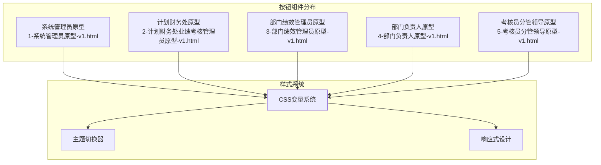
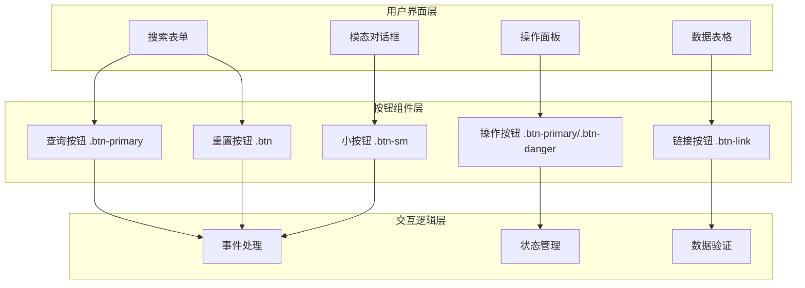
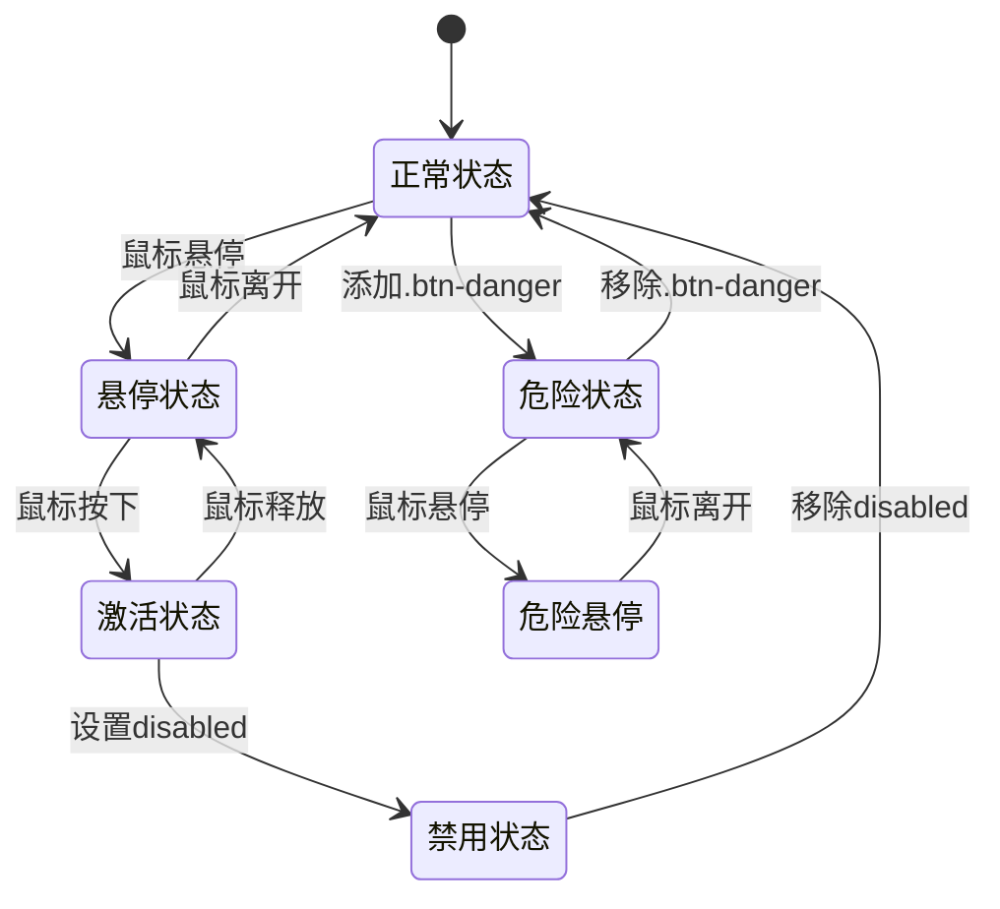
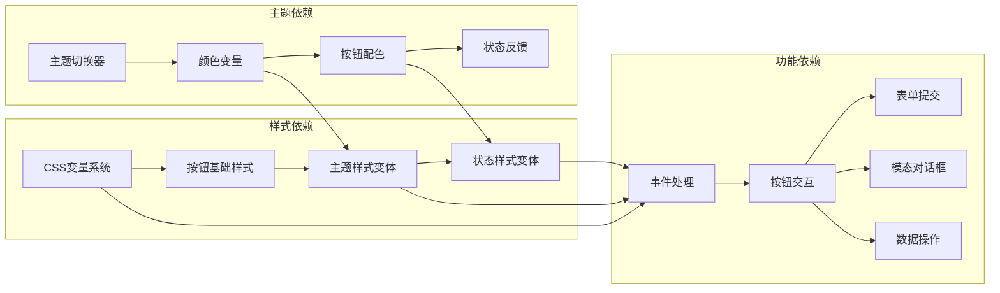

# 按钮组件

<cite>
**本文档引用的文件**
- [系统管理员原型-v1.html](file://月度业绩考核原型设计初稿/1-系统管理员原型-v1.html)
- [计划财务处业绩考核管理员原型-v1.html](file://月度业绩考核原型设计初稿/2-计划财务处业绩考核管理员原型-v1.html)
- [部门绩效管理员原型-v1.html](file://月度业绩考核原型设计初稿/3-部门绩效管理员原型-v1.html)
- [部门负责人原型-v1.html](file://月度业绩考核原型设计初稿/4-部门负责人原型-v1.html)
- [考核员分管领导原型-v1.html](file://月度业绩考核原型设计初稿/5-考核员分管领导原型-v1.html)
</cite>

## 目录
1. [简介](#简介)
2. [项目结构](#项目结构)
3. [核心组件](#核心组件)
4. [架构概览](#架构概览)
5. [详细组件分析](#详细组件分析)
6. [依赖分析](#依赖分析)
7. [性能考虑](#性能考虑)
8. [故障排除指南](#故障排除指南)
9. [结论](#结论)

## 简介

按钮组件是用户界面中最基本且最重要的交互元素之一。在月度业绩考核管理系统中，按钮组件承担着用户操作的主要入口，涵盖了查询、操作、确认、取消等多种场景。本文档将深入分析该系统的按钮组件实现，包括基础样式、主按钮样式、危险按钮样式、链接样式以及不同尺寸规格，并详细说明各种状态下的视觉反馈机制。

## 项目结构

该按钮组件分布在多个页面原型文件中，采用统一的CSS样式定义和多样化的使用场景：



**图表来源**
- [系统管理员原型-v1.html:224-233](file://月度业绩考核原型设计初稿/1-系统管理员原型-v1.html#L224-L233)
- [计划财务处业绩考核管理员原型-v1.html:254-263](file://月度业绩考核原型设计初稿/2-计划财务处业绩考核管理员原型-v1.html#L254-L263)
- [部门绩效管理员原型-v1.html:254-267](file://月度业绩考核原型设计初稿/3-部门绩效管理员原型-v1.html#L254-L267)

**章节来源**
- [系统管理员原型-v1.html:1-635](file://月度业绩考核原型设计初稿/1-系统管理员原型-v1.html#L1-L635)
- [计划财务处业绩考核管理员原型-v1.html:1-1039](file://月度业绩考核原型设计初稿/2-计划财务处业绩考核管理员原型-v1.html#L1-L1039)

## 核心组件

### 基础按钮样式

所有按钮都基于统一的基础样式定义，确保视觉一致性和用户体验的连贯性：

| 属性 | 值 | 说明 |
|------|-----|------|
| 高度 | 32px | 标准按钮高度，适合大多数交互场景 |
| 内边距 | 0 14px | 左右内边距14px，上下0px |
| 圆角半径 | var(--radius-sm) | 使用CSS变量，支持主题切换 |
| 字体大小 | 13px | 适中的字号，确保可读性 |
| 光标 | pointer | 明确的交互指示 |
| 边框 | 1px solid var(--border-color) | 使用CSS变量，随主题变化 |
| 背景 | var(--card-bg) | 使用卡片背景色 |
| 文本颜色 | var(--text-primary) | 使用主文本颜色 |
| 过渡效果 | all 0.2s | 平滑的过渡动画 |

### 主按钮样式 (.btn-primary)

主按钮用于主要操作和关键功能，具有醒目的视觉效果：

```mermaid
flowchart TD
A[基础按钮 .btn] --> B[主按钮 .btn-primary]
B --> C[背景色: var(--btn-primary-bg)]
B --> D[文本色: var(--btn-primary-text)]
B --> E[边框色: var(--btn-primary-bg)]
B --> F[悬停效果: 变暗]
F --> G[background: var(--primary-dark)]
F --> H[border-color: var(--primary-dark)]
```

**图表来源**
- [系统管理员原型-v1.html:227-228](file://月度业绩考核原型设计初稿/1-系统管理员原型-v1.html#L227-L228)
- [计划财务处业绩考核管理员原型-v1.html:256-257](file://月度业绩考核原型设计初稿/2-计划财务处业绩考核管理员原型-v1.html#L256-L257)

### 危险按钮样式 (.btn-danger)

危险按钮用于删除、取消等高风险操作，采用警示性的红色调：

| 特性 | 值 | 说明 |
|------|-----|------|
| 文本颜色 | var(--status-red-text) | 使用红色状态色 |
| 背景色 | var(--status-red-bg) | 使用红色背景色 |
| 边框 | 1px solid var(--status-red-bg) | 与背景色一致的边框 |
| 悬停效果 | 背景色: var(--status-red-bg) | 保持警示效果 |

### 链接样式按钮 (.btn-link)

链接样式按钮用于次要操作和导航功能：

| 特性 | 值 | 说明 |
|------|-----|------|
| 边框 | none | 无边框设计 |
| 背景 | none | 透明背景 |
| 文本颜色 | var(--primary) | 使用主色调 |
| 高度 | auto | 自适应内容高度 |
| 内边距 | 0 | 无额外内边距 |

### 小尺寸按钮 (.btn-sm)

小尺寸按钮用于密集布局或辅助功能：

| 特性 | 值 | 说明 |
|------|-----|------|
| 高度 | 26px | 减少垂直空间占用 |
| 内边距 | 0 10px | 减少左右空间占用 |
| 字体大小 | 12px | 更小的字号 |
| 圆角半径 | var(--radius-sm) | 保持一致性 |

**章节来源**
- [系统管理员原型-v1.html:225-233](file://月度业绩考核原型设计初稿/1-系统管理员原型-v1.html#L225-L233)
- [计划财务处业绩考核管理员原型-v1.html:254-267](file://月度业绩考核原型设计初稿/2-计划财务处业绩考核管理员原型-v1.html#L254-L267)
- [部门绩效管理员原型-v1.html:254-269](file://月度业绩考核原型设计初稿/3-部门绩效管理员原型-v1.html#L254-L269)

## 架构概览

按钮组件在整个系统中的架构位置和交互关系：



**图表来源**
- [系统管理员原型-v1.html:341-342](file://月度业绩考核原型设计初稿/1-系统管理员原型-v1.html#L341-L342)
- [计划财务处业绩考核管理员原型-v1.html:365-366](file://月度业绩考核原型设计初稿/2-计划财务处业绩考核管理员原型-v1.html#L365-L366)

### 状态变化机制

按钮组件实现了完整的状态变化反馈系统：



**图表来源**
- [系统管理员原型-v1.html:226-230](file://月度业绩考核原型设计初稿/1-系统管理员原型-v1.html#L226-L230)
- [计划财务处业绩考核管理员原型-v1.html:255-264](file://月度业绩考核原型设计初稿/2-计划财务处业绩考核管理员原型-v1.html#L255-L264)

## 详细组件分析

### 基础按钮类 (Base Button)

基础按钮类提供了所有按钮的共同特性：

**视觉属性**
- 使用CSS Grid布局实现居中对齐
- 支持图标与文字的组合显示
- 内容间距为4px，确保图标与文字的适当分离

**交互行为**
- 悬停时边框颜色和文本颜色同时变化
- 过渡时间为0.2秒，提供流畅的视觉反馈
- 支持禁用状态的视觉表现

**章节来源**
- [系统管理员原型-v1.html:225](file://月度业绩考核原型设计初稿/1-系统管理员原型-v1.html#L225)

### 主按钮类 (Primary Button)

主按钮类强调了重要的操作功能：

**设计特点**
- 使用主题主色调作为背景色
- 白色文本确保良好的对比度
- 悬停时颜色变暗，提供明确的交互反馈

**应用场景**
- 查询操作
- 保存操作  
- 确认操作
- 新增操作

**章节来源**
- [系统管理员原型-v1.html:227](file://月度业绩考核原型设计初稿/1-系统管理员原型-v1.html#L227)
- [计划财务处业绩考核管理员原型-v1.html:256](file://月度业绩考核原型设计初稿/2-计划财务处业绩考核管理员原型-v1.html#L256)

### 危险按钮类 (Danger Button)

危险按钮类用于高风险操作：

**设计策略**
- 使用警示性的红色调
- 保持与危险状态相关的视觉语言
- 悬停时维持警示效果

**典型用途**
- 删除操作
- 取消操作
- 清除操作

**章节来源**
- [系统管理员原型-v1.html:229-230](file://月度业绩考核原型设计初稿/1-系统管理员原型-v1.html#L229-L230)
- [部门绩效管理员原型-v1.html:263-264](file://月度业绩考核原型设计初稿/3-部门绩效管理员原型-v1.html#L263-L264)

### 链接按钮类 (Link Button)

链接按钮类提供了无边框的交互选项：

**设计原则**
- 透明背景，融入页面设计
- 使用主色调突出链接性质
- 自适应高度，适合内联使用

**使用场景**
- 表格中的操作链接
- 模态对话框的取消按钮
- 导航相关的次要操作

**章节来源**
- [系统管理员原型-v1.html:232](file://月度业绩考核原型设计初稿/1-系统管理员原型-v1.html#L232)
- [部门绩效管理员原型-v1.html:266-269](file://月度业绩考核原型设计初稿/3-部门绩效管理员原型-v1.html#L266-L269)

### 小尺寸按钮类 (Small Button)

小尺寸按钮类优化了空间利用率：

**尺寸规格**
- 26px高度，适合密集布局
- 10px左右内边距，减少空间占用
- 12px字体大小，保持可读性

**适用场景**
- 表格操作列
- 模态对话框内的辅助按钮
- 工具栏中的快捷操作

**章节来源**
- [系统管理员原型-v1.html:231](file://月度业绩考核原型设计初稿/1-系统管理员原型-v1.html#L231)
- [部门绩效管理员原型-v1.html:265](file://月度业绩考核原型设计初稿/3-部门绩效管理员原型-v1.html#L265)

## 依赖分析

按钮组件在整个系统中的依赖关系：



**图表来源**
- [系统管理员原型-v1.html:9-35](file://月度业绩考核原型设计初稿/1-系统管理员原型-v1.html#L9-L35)
- [系统管理员原型-v1.html:186-189](file://月度业绩考核原型设计初稿/1-系统管理员原型-v1.html#L186-L189)

### 组件耦合度

按钮组件展现了良好的低耦合设计：

- **样式独立性**: 所有按钮样式都基于CSS变量，便于主题切换
- **功能解耦**: 不同按钮类型通过类名区分，功能职责清晰
- **状态管理**: 通过伪类(:hover, :active, :disabled)管理状态，无需JavaScript干预

### 外部依赖

按钮组件对外部系统的依赖主要体现在：

- **CSS变量系统**: 依赖全局CSS变量定义的颜色方案
- **主题切换器**: 依赖主题切换功能来改变按钮外观
- **事件处理系统**: 依赖页面的JavaScript事件处理机制

**章节来源**
- [系统管理员原型-v1.html:152-184](file://月度业绩考核原型设计初稿/1-系统管理员原型-v1.html#L152-L184)
- [计划财务处业绩考核管理员原型-v1.html:186-220](file://月度业绩考核原型设计初稿/2-计划财务处业绩考核管理员原型-v1.html#L186-L220)

## 性能考虑

### 样式性能优化

按钮组件在性能方面的优化策略：

**CSS变量优势**
- 减少重复的样式定义
- 支持运行时主题切换，无需重新编译CSS
- 降低CSS文件体积

**伪类选择器**
- 使用`:hover`等伪类而非JavaScript监听
- 减少DOM操作和事件绑定
- 提供硬件加速的过渡效果

### 交互性能

**事件委托**
- 大量按钮共享相同的事件处理逻辑
- 减少事件监听器的数量
- 提高页面响应速度

**渲染优化**
- 使用`transform`和`opacity`属性进行过渡
- 利用GPU加速提升动画性能
- 避免强制同步布局

## 故障排除指南

### 常见问题及解决方案

**按钮样式异常**
- 检查CSS变量是否正确加载
- 确认主题切换器是否正常工作
- 验证按钮类名是否正确应用

**交互无响应**
- 检查JavaScript事件绑定
- 确认按钮是否处于禁用状态
- 验证CSS过渡效果是否被禁用

**主题切换失效**
- 检查`:root` CSS变量定义
- 确认主题切换函数是否正确执行
- 验证CSS变量的优先级顺序

### 调试技巧

**开发者工具使用**
- 使用Elements面板检查按钮的最终样式
- 在Console中测试主题切换函数
- 使用Network面板检查CSS文件加载状态

**性能监控**
- 使用Performance面板分析按钮交互的性能
- 检查是否有过多的重排重绘
- 监控事件处理函数的执行时间

## 结论

按钮组件在月度业绩考核管理系统中展现了优秀的设计理念和实现质量。通过统一的CSS变量系统、清晰的类名体系和完善的交互反馈机制，该组件为用户提供了直观、一致且高效的交互体验。

**主要优势**
- **一致性**: 统一的设计语言和交互模式
- **可扩展性**: 基于CSS变量的主题系统支持灵活定制
- **可用性**: 完善的状态反馈和无障碍支持
- **性能**: 优化的CSS选择器和事件处理机制

**改进建议**
- 可以考虑添加更多的键盘导航支持
- 增加按钮尺寸的更多选择
- 完善无障碍访问的ARIA属性

该按钮组件为整个系统的用户界面奠定了坚实的基础，体现了现代Web开发的最佳实践和用户体验设计的核心原则。