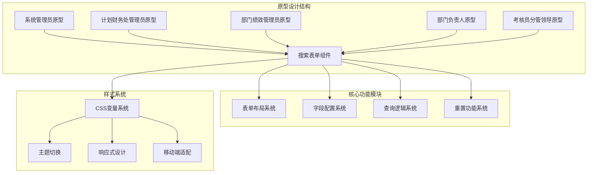
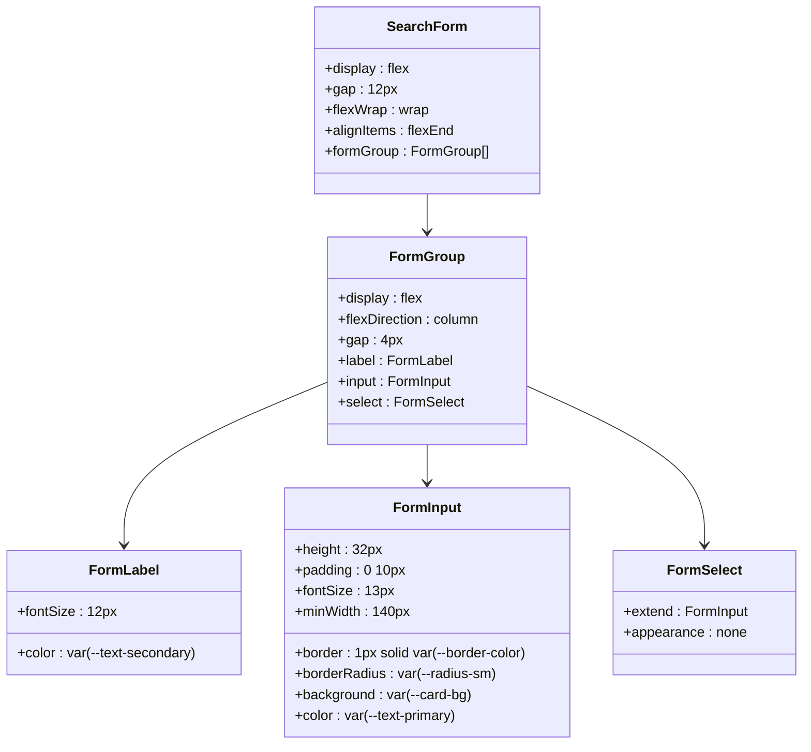
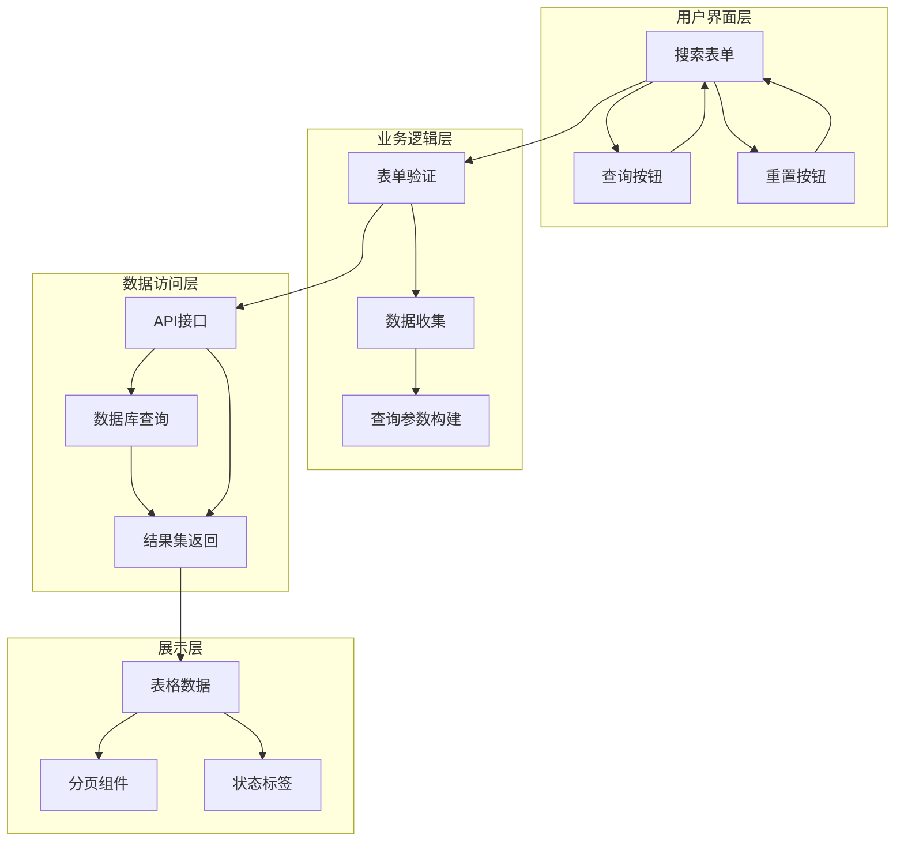
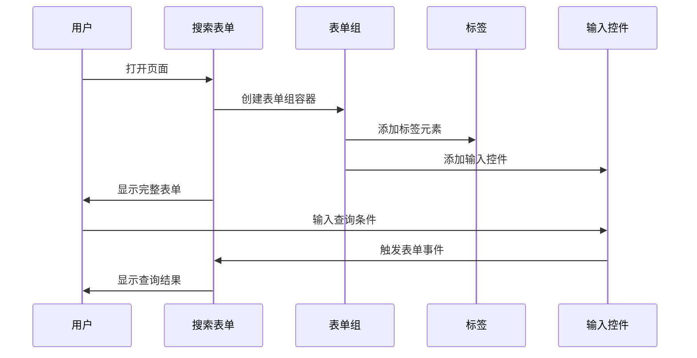
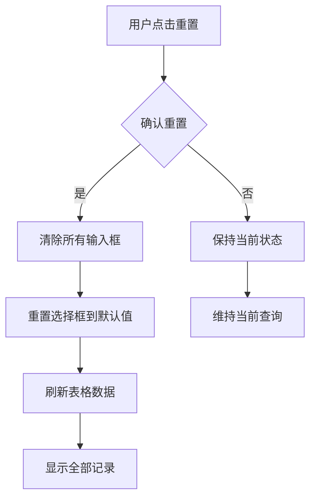
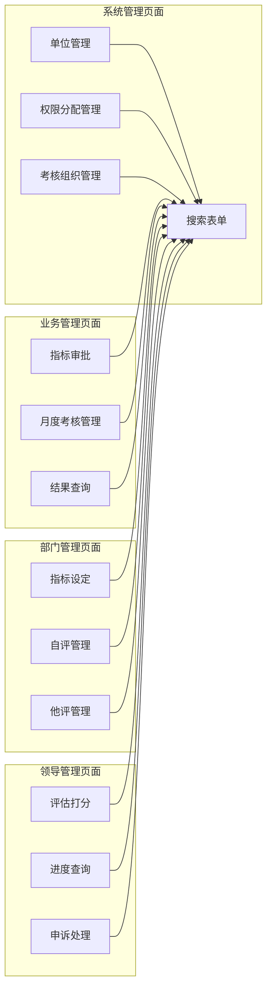

# 搜索表单组件

<cite>
**本文档引用的文件**
- [系统管理员原型-v1.html](file://月度业绩考核原型设计初稿/1-系统管理员原型-v1.html)
- [计划财务处业绩考核管理员原型-v1.html](file://月度业绩考核原型设计初稿/2-计划财务处业绩考核管理员原型-v1.html)
- [部门绩效管理员原型-v1.html](file://月度业绩考核原型设计初稿/3-部门绩效管理员原型-v1.html)
- [部门负责人原型-v1.html](file://月度业绩考核原型设计初稿/4-部门负责人原型-v1.html)
- [考核员分管领导原型-v1.html](file://月度业绩考核原型设计初稿/5-考核员分管领导原型-v1.html)
- [时序图-v1.html](file://月度业绩考核原型设计初稿/6-时序图-v1.html)
</cite>

## 目录
1. [简介](#简介)
2. [项目结构](#项目结构)
3. [核心组件](#核心组件)
4. [架构概览](#架构概览)
5. [详细组件分析](#详细组件分析)
6. [依赖关系分析](#依赖关系分析)
7. [性能考虑](#性能考虑)
8. [故障排除指南](#故障排除指南)
9. [结论](#结论)

## 简介

搜索表单组件是月度业绩考核管理系统中的核心交互组件，负责为各类用户角色提供统一的查询和筛选功能。该组件采用响应式设计，支持多种用户角色和业务场景，包括系统管理员、计划财务处管理员、部门绩效管理员、部门负责人以及考核员/分管领导等。

该组件实现了完整的表单布局、字段配置、查询逻辑和重置功能，为整个考核管理系统的数据检索提供了标准化的解决方案。

## 项目结构

项目采用多页面原型设计，每个页面针对不同的用户角色和业务场景：

**图表来源**
- [系统管理员原型-v1.html:337-343](file://月度业绩考核原型设计初稿/1-系统管理员原型-v1.html#L337-L343)
- [计划财务处业绩考核管理员原型-v1.html:361-367](file://月度业绩考核原型设计初稿/2-计划财务处业绩考核管理员原型-v1.html#L361-L367)

**章节来源**
- [系统管理员原型-v1.html:1-635](file://月度业绩考核原型设计初稿/1-系统管理员原型-v1.html#L1-L635)
- [计划财务处业绩考核管理员原型-v1.html:1-1039](file://月度业绩考核原型设计初稿/2-计划财务处业绩考核管理员原型-v1.html#L1-L1039)

## 核心组件

### 表单容器结构

搜索表单采用`.search-form`容器，实现了灵活的布局系统：

**图表来源**
- [系统管理员原型-v1.html:218-223](file://月度业绩考核原型设计初稿/1-系统管理员原型-v1.html#L218-L223)
- [计划财务处业绩考核管理员原型-v1.html:249-253](file://月度业绩考核原型设计初稿/2-计划财务处业绩考核管理员原型-v1.html#L249-L253)

### 字段配置系统

搜索表单支持多种字段类型，每种类型都有特定的配置和样式：

| 字段类型 | HTML元素 | 配置特点 | 使用场景 |
|---------|----------|----------|----------|
| 文本输入框 | `<input type="text">` | 支持占位符、日期选择 | 名称查询、编码查询 |
| 下拉选择框 | `<select>` | 支持选项配置、默认值 | 类型筛选、状态选择 |
| 日期输入框 | `<input type="date">` | 日期格式化、默认值设置 | 时间范围查询 |

**章节来源**
- [系统管理员原型-v1.html:337-343](file://月度业绩考核原型设计初稿/1-系统管理员原型-v1.html#L337-L343)
- [部门绩效管理员原型-v1.html:453-461](file://月度业绩考核原型设计初稿/3-部门绩效管理员原型-v1.html#L453-L461)

## 架构概览

搜索表单组件在整个系统架构中扮演着关键的数据入口角色：

**图表来源**
- [系统管理员原型-v1.html:337-343](file://月度业绩考核原型设计初稿/1-系统管理员原型-v1.html#L337-L343)
- [部门负责人原型-v1.html:426-429](file://月度业绩考核原型设计初稿/4-部门负责人原型-v1.html#L426-L429)

## 详细组件分析

### 表单布局设计

搜索表单采用了现代化的Flexbox布局系统，确保在不同屏幕尺寸下的良好表现：

**图表来源**
- [系统管理员原型-v1.html:337-343](file://月度业绩考核原型设计初稿/1-系统管理员原型-v1.html#L337-L343)
- [计划财务处业绩考核管理员原型-v1.html:361-367](file://月度业绩考核原型设计初稿/2-计划财务处业绩考核管理员原型-v1.html#L361-L367)

### 字段样式定制

每个字段都具有独特的样式定制，确保视觉一致性和用户体验：

#### 标签样式
- 字体大小：12px
- 颜色：var(--text-secondary)
- 间距：4px垂直间距

#### 输入框样式
- 高度：32px
- 边框：1px solid var(--border-color)
- 圆角：var(--radius-sm)
- 内边距：0 10px
- 最小宽度：140px
- 背景：var(--card-bg)
- 文本颜色：var(--text-primary)

#### 选择框样式
- 继承输入框样式
- 特殊的外观处理
- 焦点状态高亮

**章节来源**
- [系统管理员原型-v1.html:218-223](file://月度业绩考核原型设计初稿/1-系统管理员原型-v1.html#L218-L223)
- [部门负责人原型-v1.html:231-235](file://月度业绩考核原型设计初稿/4-部门负责人原型-v1.html#L231-L235)

### 查询逻辑实现

搜索表单的查询逻辑遵循统一的模式，支持多种查询场景：

#### 查询触发机制
1. **按钮点击**：点击"查询"按钮触发表单提交
2. **键盘事件**：支持Enter键快速查询
3. **实时过滤**：部分场景支持输入即查询

#### 参数收集策略
- 自动收集所有表单字段值
- 过滤空值和无效数据
- 格式化查询参数

#### 结果处理
- 更新表格数据
- 显示查询统计
- 处理无结果状态

**章节来源**
- [系统管理员原型-v1.html:341-342](file://月度业绩考核原型设计初稿/1-系统管理员原型-v1.html#L341-L342)
- [部门绩效管理员原型-v1.html:460-461](file://月度业绩考核原型设计初稿/3-部门绩效管理员原型-v1.html#L460-L461)

### 重置功能设计

重置功能确保用户能够快速清除查询条件，恢复到初始状态：

**图表来源**
- [系统管理员原型-v1.html:342](file://月度业绩考核原型设计初稿/1-系统管理员原型-v1.html#L342)
- [部门负责人原型-v1.html:280](file://月度业绩考核原型设计初稿/5-考核员分管领导原型-v1.html#L280)

**章节来源**
- [系统管理员原型-v1.html:342](file://月度业绩考核原型设计初稿/1-系统管理员原型-v1.html#L342)
- [部门负责人原型-v1.html:280](file://月度业绩考核原型设计初稿/5-考核员分管领导原型-v1.html#L280)

## 依赖关系分析

搜索表单组件在不同页面中的应用场景：

**图表来源**
- [系统管理员原型-v1.html:330-415](file://月度业绩考核原型设计初稿/1-系统管理员原型-v1.html#L330-L415)
- [计划财务处业绩考核管理员原型-v1.html:354-653](file://月度业绩考核原型设计初稿/2-计划财务处业绩考核管理员原型-v1.html#L354-L653)

### 页面特定配置

每个页面根据业务需求对搜索表单进行特定配置：

| 页面 | 主要字段 | 查询逻辑 | 特殊功能 |
|------|----------|----------|----------|
| 单位管理 | 单位名称、单位类型、启用状态 | 基础信息查询 | 新增单位按钮 |
| 权限分配 | 人员姓名、分配角色 | 用户权限查询 | 新增权限分配 |
| 指标审批 | 考核组、部门、审批状态 | 审批流程查询 | 审批操作按钮 |
| 指标设定 | 考核组、部门、状态 | 目标设定查询 | 目标设定操作 |
| 评估打分 | 考核组、部门、状态 | 评估流程查询 | 打分操作按钮 |

**章节来源**
- [系统管理员原型-v1.html:337-414](file://月度业绩考核原型设计初稿/1-系统管理员原型-v1.html#L337-L414)
- [计划财务处业绩考核管理员原型-v1.html:361-652](file://月度业绩考核原型设计初稿/2-计划财务处业绩考核管理员原型-v1.html#L361-L652)

## 性能考虑

### 响应式设计实现

搜索表单采用Flexbox布局，支持响应式设计：

- **桌面端**：最多4列显示，充分利用屏幕空间
- **平板端**：适中密度布局，保证可读性
- **移动端**：单列堆叠布局，优化触摸体验

### 性能优化策略

1. **CSS变量系统**：统一的颜色和尺寸管理
2. **最小化重绘**：使用transform而非改变布局属性
3. **事件委托**：减少事件监听器数量
4. **懒加载**：表格数据按需加载

## 故障排除指南

### 常见问题及解决方案

| 问题类型 | 症状描述 | 解决方案 |
|----------|----------|----------|
| 表单无法提交 | 点击查询无反应 | 检查JavaScript错误控制台 |
| 查询结果异常 | 返回空数据或错误数据 | 验证API连接和参数格式 |
| 样式显示异常 | 字段错位或颜色不正确 | 检查CSS变量定义和主题切换 |
| 移动端适配问题 | 触摸区域过小或布局错乱 | 调整媒体查询断点和触摸目标大小 |

### 调试工具

1. **浏览器开发者工具**：检查DOM结构和CSS样式
2. **网络面板**：监控API请求和响应
3. **控制台日志**：跟踪JavaScript执行流程
4. **响应式预览**：测试不同屏幕尺寸表现

**章节来源**
- [系统管理员原型-v1.html:612-632](file://月度业绩考核原型设计初稿/1-系统管理员原型-v1.html#L612-L632)
- [计划财务处业绩考核管理员原型-v1.html:612-632](file://月度业绩考核原型设计初稿/2-计划财务处业绩考核管理员原型-v1.html#L612-L632)

## 结论

搜索表单组件作为月度业绩考核管理系统的核心交互组件，展现了优秀的架构设计和用户体验。通过统一的组件化设计，实现了跨页面的一致性和可维护性。

该组件的主要优势包括：

1. **高度可配置性**：支持多种字段类型和页面特定配置
2. **响应式设计**：完美适配各种设备和屏幕尺寸
3. **主题系统**：支持多种视觉风格和品牌定制
4. **用户友好**：直观的操作流程和清晰的状态反馈

未来可以考虑的功能增强包括：高级搜索语法支持、搜索历史记录、批量操作功能等，以进一步提升用户体验和工作效率。