# 模态框组件

<cite>
**本文档引用的文件**
- [1-系统管理员原型-v1.html](file://月度业绩考核原型设计初稿/1-系统管理员原型-v1.html)
- [2-计划财务处业绩考核管理员原型-v1.html](file://月度业绩考核原型设计初稿/2-计划财务处业绩考核管理员原型-v1.html)
- [3-部门绩效管理员原型-v1.html](file://月度业绩考核原型设计初稿/3-部门绩效管理员原型-v1.html)
- [4-部门负责人原型-v1.html](file://月度业绩考核原型设计初稿/4-部门负责人原型-v1.html)
- [5-考核员分管领导原型-v1.html](file://月度业绩考核原型设计初稿/5-考核员分管领导原型-v1.html)
- [6-时序图-v1.html](file://月度业绩考核原型设计初稿/6-时序图-v1.html)
</cite>

## 目录
1. [简介](#简介)
2. [项目结构](#项目结构)
3. [核心组件](#核心组件)
4. [架构概览](#架构概览)
5. [详细组件分析](#详细组件分析)
6. [依赖关系分析](#依赖关系分析)
7. [性能考虑](#性能考虑)
8. [故障排除指南](#故障排除指南)
9. [结论](#结论)

## 简介

本文档详细介绍月度业绩考核管理系统中的模态框组件（Modal）。该系统包含多个角色的原型页面，每个页面都使用了统一的模态框组件来实现各种业务操作界面。

模态框组件是Web应用中重要的交互元素，用于在不离开当前页面的情况下显示额外的信息或表单。在本项目中，模态框被广泛应用于新增、编辑、审批等各种业务场景。

## 项目结构

该项目采用多角色原型设计，每个角色都有独立的HTML文件，所有文件都位于"月度业绩考核原型设计初稿"目录下：

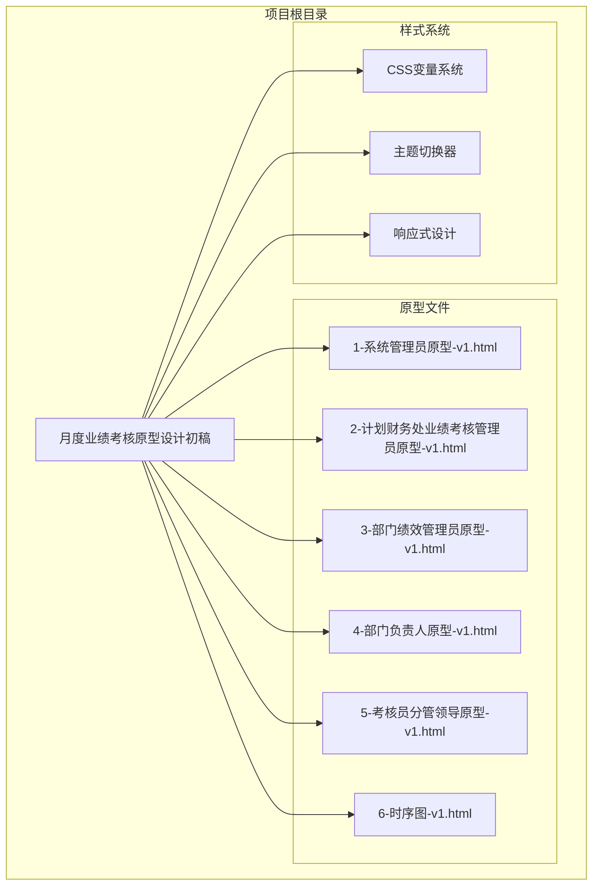

**图表来源**
- [1-系统管理员原型-v1.html:1-635](file://月度业绩考核原型设计初稿/1-系统管理员原型-v1.html#L1-L635)
- [2-计划财务处业绩考核管理员原型-v1.html:1-1039](file://月度业绩考核原型设计初稿/2-计划财务处业绩考核管理员原型-v1.html#L1-L1039)

**章节来源**
- [1-系统管理员原型-v1.html:1-635](file://月度业绩考核原型设计初稿/1-系统管理员原型-v1.html#L1-L635)
- [2-计划财务处业绩考核管理员原型-v1.html:1-1039](file://月度业绩考核原型设计初稿/2-计划财务处业绩考核管理员原型-v1.html#L1-L1039)

## 核心组件

### 模态框结构设计

模态框组件采用标准的"遮罩层 + 弹窗主体"结构，包含以下核心部分：

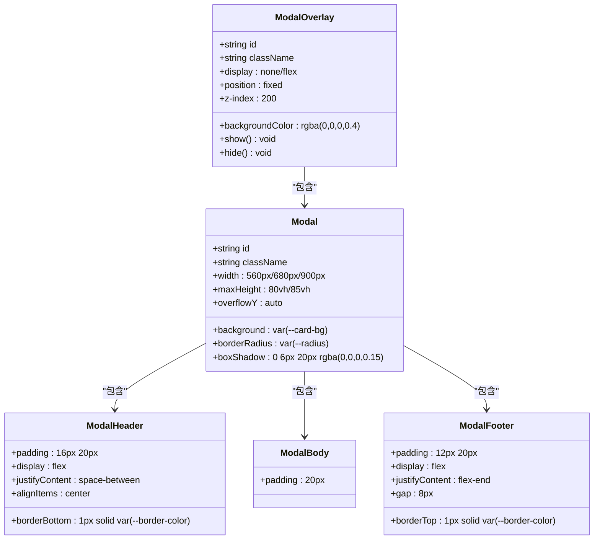

**图表来源**
- [1-系统管理员原型-v1.html:249-279](file://月度业绩考核原型设计初稿/1-系统管理员原型-v1.html#L249-L279)
- [2-计划财务处业绩考核管理员原型-v1.html:279-289](file://月度业绩考核原型设计初稿/2-计划财务处业绩考核管理员原型-v1.html#L279-L289)

### 表单布局系统

模态框内部采用灵活的表单布局系统，支持多种布局模式：

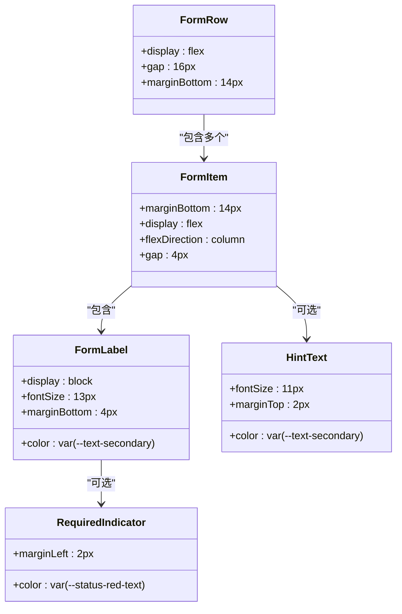

**图表来源**
- [1-系统管理员原型-v1.html:258-269](file://月度业绩考核原型设计初稿/1-系统管理员原型-v1.html#L258-L269)
- [2-计划财务处业绩考核管理员原型-v1.html:289-295](file://月度业绩考核原型设计初稿/2-计划财务处业绩考核管理员原型-v1.html#L289-L295)

**章节来源**
- [1-系统管理员原型-v1.html:249-279](file://月度业绩考核原型设计初稿/1-系统管理员原型-v1.html#L249-L279)
- [1-系统管理员原型-v1.html:258-269](file://月度业绩考核原型设计初稿/1-系统管理员原型-v1.html#L258-L269)

## 架构概览

### 组件交互架构

模态框组件在整个系统中扮演着关键的交互中介角色，连接用户操作与业务逻辑：

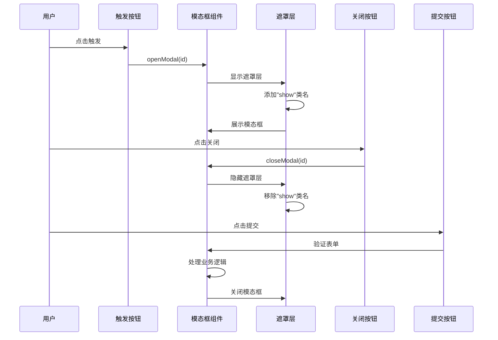

**图表来源**
- [1-系统管理员原型-v1.html:629-632](file://月度业绩考核原型设计初稿/1-系统管理员原型-v1.html#L629-L632)

### 多角色适配架构

不同角色的页面使用相同的模态框组件，但根据业务需求调整样式和布局：

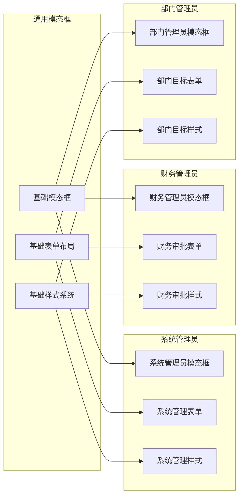

**图表来源**
- [1-系统管理员原型-v1.html:279-289](file://月度业绩考核原型设计初稿/1-系统管理员原型-v1.html#L279-L289)
- [2-计划财务处业绩考核管理员原型-v1.html:279-289](file://月度业绩考核原型设计初稿/2-计划财务处业绩考核管理员原型-v1.html#L279-L289)

**章节来源**
- [1-系统管理员原型-v1.html:629-632](file://月度业绩考核原型设计初稿/1-系统管理员原型-v1.html#L629-L632)
- [2-计划财务处业绩考核管理员原型-v1.html:279-289](file://月度业绩考核原型设计初稿/2-计划财务处业绩考核管理员原型-v1.html#L279-L289)

## 详细组件分析

### 打开/关闭机制实现

模态框的显示和隐藏通过JavaScript函数实现，采用CSS类名切换的方式控制显示状态：

#### openModal()函数实现

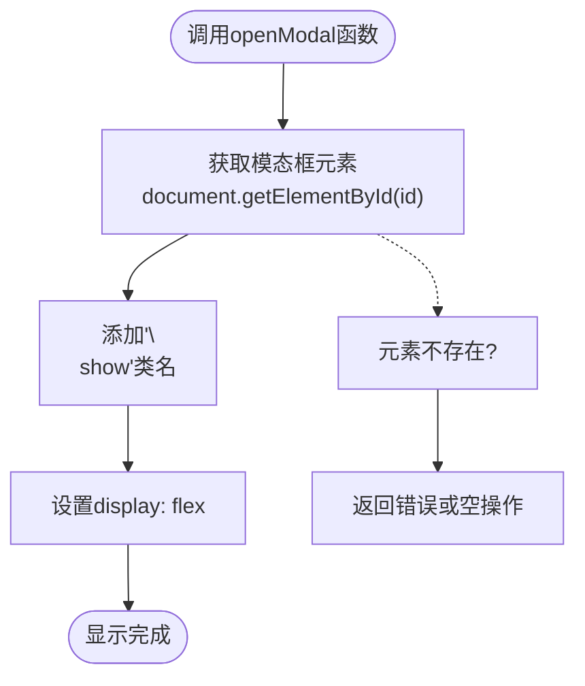

**图表来源**
- [1-系统管理员原型-v1.html:629](file://月度业绩考核原型设计初稿/1-系统管理员原型-v1.html#L629)

#### closeModal()函数实现

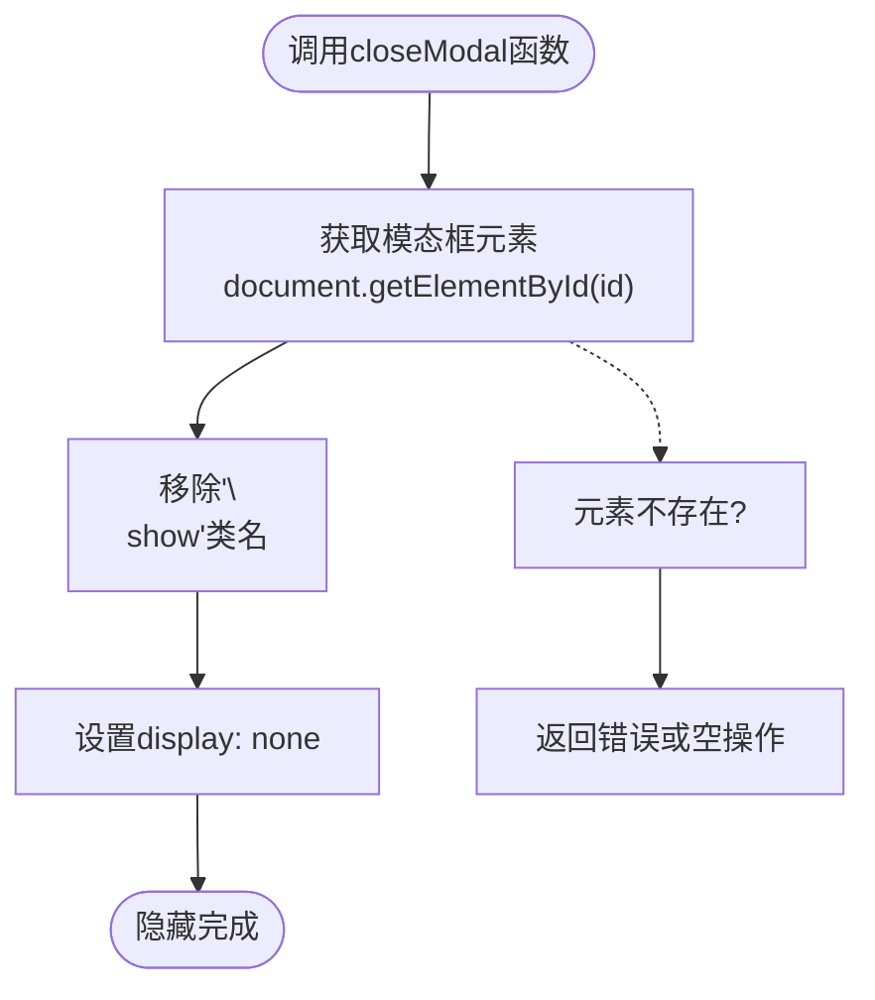

**图表来源**
- [1-系统管理员原型-v1.html:630](file://月度业绩考核原型设计初稿/1-系统管理员原型-v1.html#L630)

### 事件处理机制

模态框组件实现了多种交互事件处理：

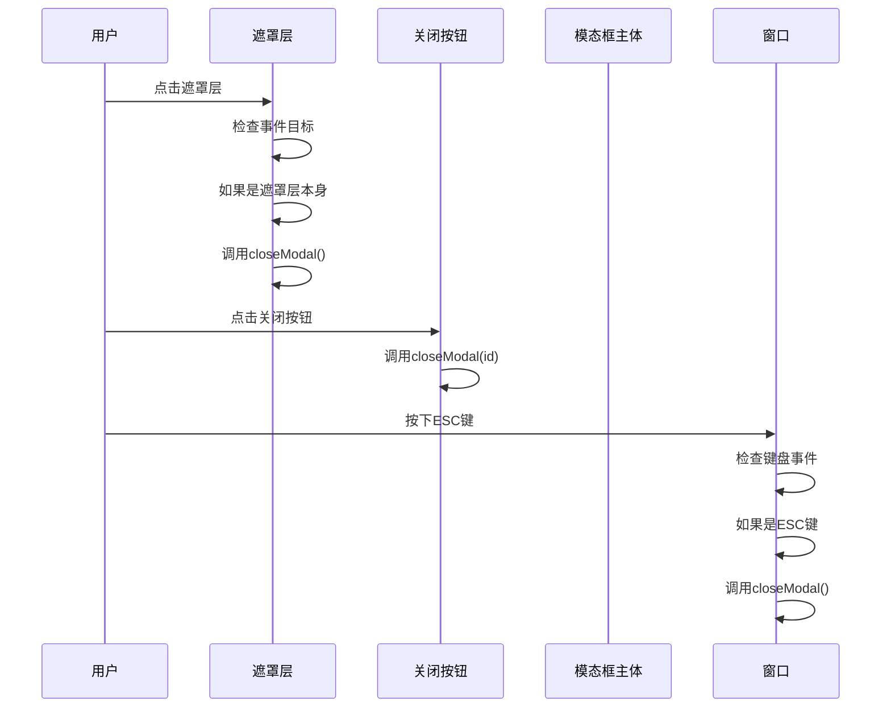

**图表来源**
- [1-系统管理员原型-v1.html:631](file://月度业绩考核原型设计初稿/1-系统管理员原型-v1.html#L631)

**章节来源**
- [1-系统管理员原型-v1.html:629-632](file://月度业绩考核原型设计初稿/1-系统管理员原型-v1.html#L629-L632)

### 响应式设计实现

模态框组件支持响应式设计，能够适应不同屏幕尺寸：

#### 不同屏幕尺寸下的表现

| 屏幕尺寸 | 模态框宽度 | 最大高度 | 适配策略 |
|---------|-----------|----------|----------|
| 移动端 (≤768px) | 95% 容器宽度 | 90vh | 流式布局，自动换行 |
| 平板 (769-1024px) | 80% 容器宽度 | 85vh | 适当缩小宽度 |
| 桌面端 (>1024px) | 固定宽度 (560-900px) | 80vh | 标准固定宽度 |

#### 响应式表单布局

```mermaid
graph TD
subgraph "桌面端布局"
Desktop[桌面端: 两列布局<br/>flex: 1 1 calc(50%-8px)]
end
subgraph "移动端布局"
Mobile[移动端: 单列布局<br/>width: 100%]
end
subgraph "响应式断点"
Breakpoint[768px 断点]
end
Desktop --> Breakpoint
Mobile --> Breakpoint
```

**图表来源**
- [1-系统管理员原型-v1.html:259](file://月度业绩考核原型设计初稿/1-系统管理员原型-v1.html#L259)
- [2-计划财务处业绩考核管理员原型-v1.html:295](file://月度业绩考核原型设计初稿/2-计划财务处业绩考核管理员原型-v1.html#L295)

### 动画效果实现

模态框组件具有平滑的显示和隐藏动画效果：

#### 显示动画流程

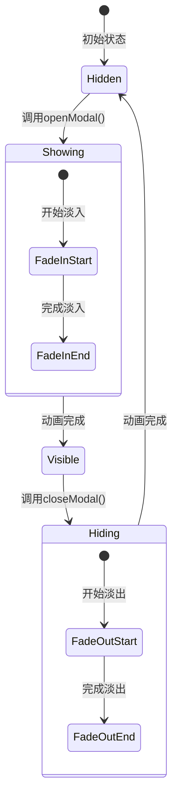

**图表来源**
- [1-系统管理员原型-v1.html:250](file://月度业绩考核原型设计初稿/1-系统管理员原型-v1.html#L250)
- [1-系统管理员原型-v1.html:251](file://月度业绩考核原型设计初稿/1-系统管理员原型-v1.html#L251)

**章节来源**
- [1-系统管理员原型-v1.html:250-251](file://月度业绩考核原型设计初稿/1-系统管理员原型-v1.html#L250-L251)

## 依赖关系分析

### 样式依赖关系

模态框组件依赖于全局样式系统，特别是CSS变量和主题系统：

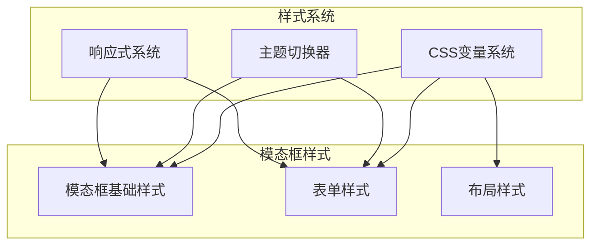

**图表来源**
- [1-系统管理员原型-v1.html:7-185](file://月度业绩考核原型设计初稿/1-系统管理员原型-v1.html#L7-L185)

### JavaScript依赖关系

模态框组件的JavaScript实现相对简单，主要依赖DOM操作：

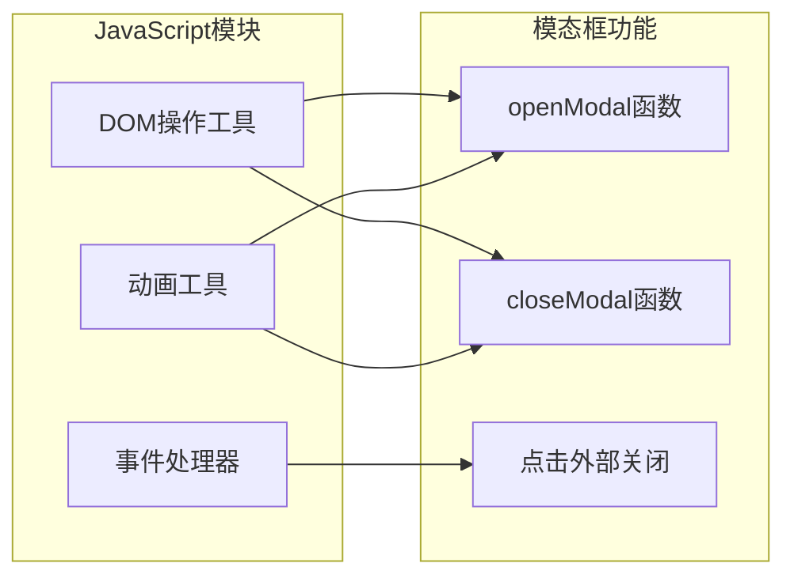

**图表来源**
- [1-系统管理员原型-v1.html:612-632](file://月度业绩考核原型设计初稿/1-系统管理员原型-v1.html#L612-L632)

**章节来源**
- [1-系统管理员原型-v1.html:7-185](file://月度业绩考核原型设计初稿/1-系统管理员原型-v1.html#L7-L185)
- [1-系统管理员原型-v1.html:612-632](file://月度业绩考核原型设计初稿/1-系统管理员原型-v1.html#L612-L632)

## 性能考虑

### 渲染性能优化

模态框组件采用了多项性能优化措施：

1. **CSS类名切换**：使用类名切换而非直接修改内联样式，利用浏览器的CSS引擎优化
2. **事件委托**：遮罩层点击事件采用事件委托，减少事件监听器数量
3. **条件渲染**：模态框默认隐藏，只在需要时才渲染到DOM中

### 内存管理

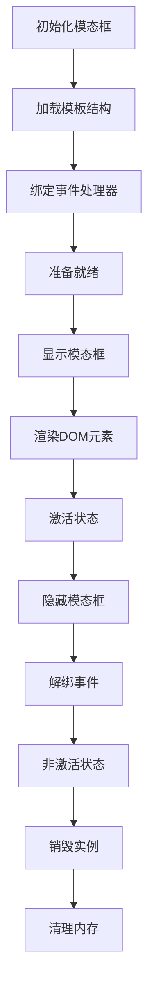

**图表来源**
- [1-系统管理员原型-v1.html:629-632](file://月度业绩考核原型设计初稿/1-系统管理员原型-v1.html#L629-L632)

## 故障排除指南

### 常见问题及解决方案

#### 问题1：模态框无法显示

**症状**：点击按钮后模态框不显示

**可能原因**：
1. HTML元素ID不匹配
2. CSS类名冲突
3. JavaScript错误阻止执行

**解决方案**：
1. 检查HTML中模态框的id属性
2. 确认CSS类名正确应用
3. 查看浏览器控制台错误信息

#### 问题2：点击遮罩层无法关闭

**症状**：模态框显示但点击遮罩层无反应

**可能原因**：
1. 事件监听器未正确绑定
2. 事件冒泡被阻止
3. CSS定位问题

**解决方案**：
1. 检查事件监听器绑定代码
2. 确认事件冒泡正常
3. 验证CSS定位属性

#### 问题3：模态框样式异常

**症状**：模态框显示位置或大小不正确

**可能原因**：
1. CSS变量未正确设置
2. 响应式断点问题
3. z-index层级冲突

**解决方案**：
1. 检查CSS变量定义
2. 验证响应式媒体查询
3. 调整z-index层级

**章节来源**
- [1-系统管理员原型-v1.html:629-632](file://月度业绩考核原型设计初稿/1-系统管理员原型-v1.html#L629-L632)

## 结论

模态框组件作为月度业绩考核管理系统的核心交互组件，展现了良好的设计原则和实现质量：

### 设计优势

1. **一致性**：所有角色页面使用统一的模态框组件，确保用户体验一致
2. **灵活性**：支持多种布局模式和样式变体，适应不同业务场景
3. **响应式**：完善的响应式设计，适配各种设备和屏幕尺寸
4. **可维护性**：清晰的代码结构和注释，便于后续维护和扩展

### 技术特点

1. **轻量级实现**：采用简单的CSS类名切换机制，性能优异
2. **事件处理完善**：支持多种交互方式，包括点击遮罩关闭、ESC键关闭等
3. **主题系统集成**：深度集成CSS变量和主题切换器
4. **无障碍设计**：支持键盘导航和屏幕阅读器访问

### 改进建议

1. **动画性能**：可以考虑使用CSS3硬件加速提升动画性能
2. **可访问性**：增加ARIA标签和键盘快捷键支持
3. **国际化**：支持多语言文本本地化
4. **测试覆盖**：增加单元测试和集成测试

该模态框组件为整个系统的用户交互提供了坚实的基础，是现代Web应用开发的优秀实践案例。