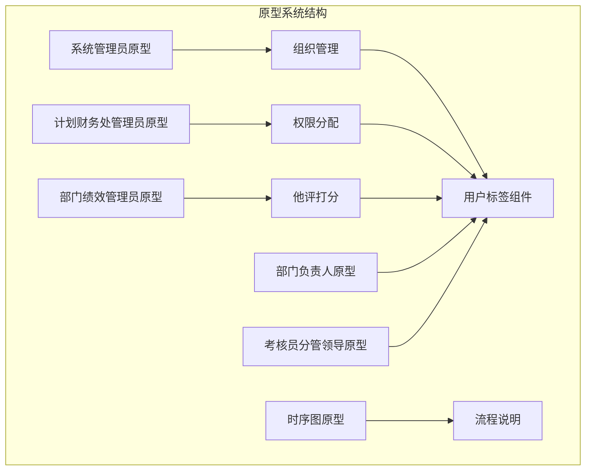
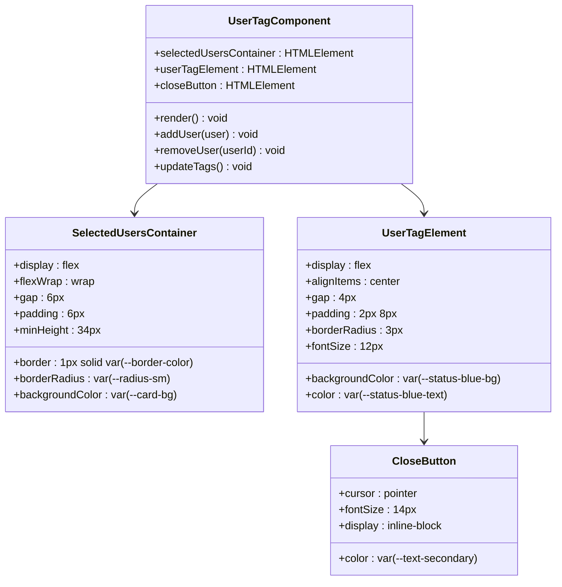
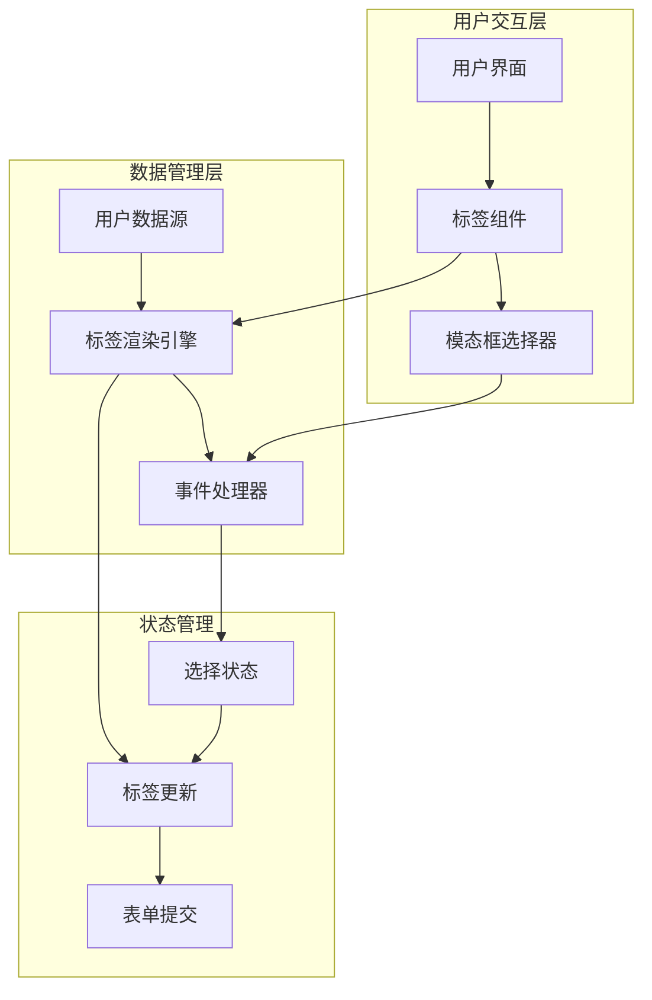
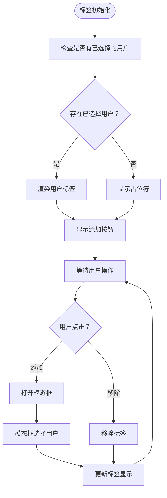
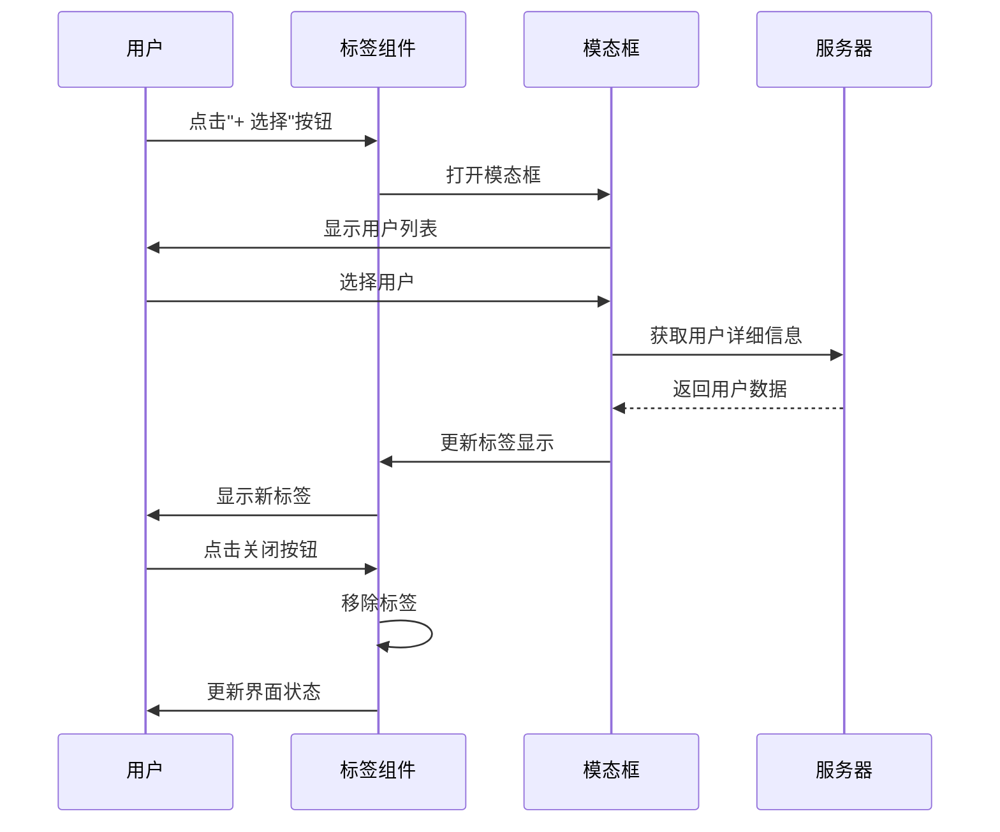
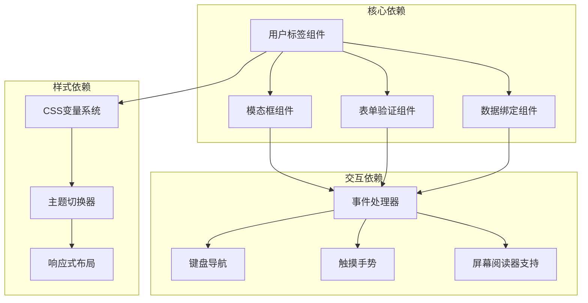

# 用户标签组件

<cite>
**本文档引用的文件**
- [1-系统管理员原型-v1.html](file://月度业绩考核原型设计初稿/1-系统管理员原型-v1.html)
- [2-计划财务处业绩考核管理员原型-v1.html](file://月度业绩考核原型设计初稿/2-计划财务处业绩考核管理员原型-v1.html)
- [3-部门绩效管理员原型-v1.html](file://月度业绩考核原型设计初稿/3-部门绩效管理员原型-v1.html)
- [4-部门负责人原型-v1.html](file://月度业绩考核原型设计初稿/4-部门负责人原型-v1.html)
- [5-考核员分管领导原型-v1.html](file://月度业绩考核原型设计初稿/5-考核员分管领导原型-v1.html)
- [6-时序图-v1.html](file://月度业绩考核原型设计初稿/6-时序图-v1.html)
</cite>

## 目录
1. [简介](#简介)
2. [项目结构](#项目结构)
3. [核心组件](#核心组件)
4. [架构概览](#架构概览)
5. [详细组件分析](#详细组件分析)
6. [依赖关系分析](#依赖关系分析)
7. [性能考虑](#性能考虑)
8. [故障排除指南](#故障排除指南)
9. [结论](#结论)

## 简介

用户标签组件是月度业绩考核管理系统中的关键交互元素，用于展示和管理已选择的用户。该组件提供了直观的视觉反馈，允许用户轻松地查看、添加和移除已选择的用户，同时支持模态框中的人员选择功能。

在本系统中，用户标签组件主要应用于以下场景：
- 组织管理中的组织负责人选择
- 权限分配中的人员选择
- 考核组织管理中的管理员选择
- 部门他评打分中的评估人员选择

## 项目结构

该项目采用多角色原型设计，包含6个主要页面，每个页面针对不同的用户角色提供专门的功能界面：

**图表来源**
- [1-系统管理员原型-v1.html:564-588](file://月度业绩考核原型设计初稿/1-系统管理员原型-v1.html#L564-L588)
- [2-计划财务处业绩考核管理员原型-v1.html:658-727](file://月度业绩考核原型设计初稿/2-计划财务处业绩考核管理员原型-v1.html#L658-L727)
- [3-部门绩效管理员原型-v1.html:766-800](file://月度业绩考核原型设计初稿/3-部门绩效管理员原型-v1.html#L766-L800)

**章节来源**
- [1-系统管理员原型-v1.html:1-635](file://月度业绩考核原型设计初稿/1-系统管理员原型-v1.html#L1-L635)
- [2-计划财务处业绩考核管理员原型-v1.html:1-1039](file://月度业绩考核原型设计初稿/2-计划财务处业绩考核管理员原型-v1.html#L1-L1039)
- [3-部门绩效管理员原型-v1.html:1-1663](file://月度业绩考核原型设计初稿/3-部门绩效管理员原型-v1.html#L1-L1663)

## 核心组件

### 结构设计

用户标签组件采用简洁而实用的结构设计，包含三个核心元素：

**图表来源**
- [1-系统管理员原型-v1.html:274-279](file://月度业绩考核原型设计初稿/1-系统管理员原型-v1.html#L274-L279)

### 样式系统

组件采用CSS变量系统，支持多种主题风格：

| 属性名 | 默认值 | 风格1 | 风格2 | 风格3 | 风格4 |
|--------|--------|-------|-------|-------|-------|
| --status-blue-bg | #e6f4ff | #e8f3ff | #e8f3ff | rgba(0,212,255,0.15) | #fff7e6 |
| --status-blue-text | #0958d9 | #3370ff | #00d4ff | #00d4ff | #d46b08 |
| --primary | #2d5aa0 | #2932e1 | #3370ff | #00d4ff | #c41e3a |
| --radius | 6px | 8px | 4px | 4px | 4px |

**章节来源**
- [1-系统管理员原型-v1.html:8-185](file://月度业绩考核原型设计初稿/1-系统管理员原型-v1.html#L8-L185)

## 架构概览

用户标签组件在整个系统中扮演着桥梁的角色，连接用户界面和数据管理功能：

**图表来源**
- [1-系统管理员原型-v1.html:564-588](file://月度业绩考核原型设计初稿/1-系统管理员原型-v1.html#L564-L588)
- [2-计划财务处业绩考核管理员原型-v1.html:658-727](file://月度业绩考核原型设计初稿/2-计划财务处业绩考核管理员原型-v1.html#L658-L727)

## 详细组件分析

### 标签显示逻辑

用户标签组件实现了智能的显示逻辑，能够根据不同的使用场景提供相应的视觉反馈：

**图表来源**
- [1-系统管理员原型-v1.html:582-583](file://月度业绩考核原型设计初稿/1-系统管理员原型-v1.html#L582-L583)

### 选择人员弹窗联动机制

组件与模态框之间建立了紧密的联动机制，确保用户选择的实时性和准确性：

**图表来源**
- [1-系统管理员原型-v1.html:582-583](file://月度业绩考核原型设计初稿/1-系统管理员原型-v1.html#L582-L583)
- [2-计划财务处业绩考核管理员原型-v1.html:658-727](file://月度业绩考核原型设计初稿/2-计划财务处业绩考核管理员原型-v1.html#L658-L727)

### 标签动态添加和移除功能

组件支持动态的标签管理，提供了流畅的用户体验：

| 操作类型 | 触发方式 | 视觉反馈 | 数据处理 |
|----------|----------|----------|----------|
| 添加标签 | 点击"+ 选择"按钮 | 模态框显示用户列表 | 异步获取用户信息 |
| 移除标签 | 点击标签右侧×按钮 | 平滑动画移除 | 更新选择状态 |
| 批量移除 | 点击标签×按钮 | 确认对话框 | 清空选择集合 |
| 实时更新 | 用户选择变化 | 实时界面刷新 | 状态同步 |

**章节来源**
- [1-系统管理员原型-v1.html:582-583](file://月度业绩考核原型设计初稿/1-系统管理员原型-v1.html#L582-L583)
- [3-部门绩效管理员原型-v1.html:766-800](file://月度业绩考核原型设计初稿/3-部门绩效管理员原型-v1.html#L766-L800)

## 依赖关系分析

用户标签组件在整个系统中与其他组件形成了复杂的依赖关系：

**图表来源**
- [1-系统管理员原型-v1.html:152-185](file://月度业绩考核原型设计初稿/1-系统管理员原型-v1.html#L152-L185)
- [2-计划财务处业绩考核管理员原型-v1.html:187-220](file://月度业绩考核原型设计初稿/2-计划财务处业绩考核管理员原型-v1.html#L187-L220)

**章节来源**
- [1-系统管理员原型-v1.html:1-635](file://月度业绩考核原型设计初稿/1-系统管理员原型-v1.html#L1-L635)
- [2-计划财务处业绩考核管理员原型-v1.html:1-1039](file://月度业绩考核原型设计初稿/2-计划财务处业绩考核管理员原型-v1.html#L1-L1039)

## 性能考虑

用户标签组件在设计时充分考虑了性能优化：

### 渲染优化
- 使用CSS Flexbox实现高效的布局计算
- 采用虚拟滚动技术处理大量用户数据
- 实现标签缓存机制减少DOM操作

### 内存管理
- 及时清理事件监听器防止内存泄漏
- 使用WeakMap存储用户数据引用
- 实现懒加载机制延迟初始化

### 网络优化
- 用户数据分页加载
- 缓存最近使用的用户信息
- 实现防抖机制避免频繁请求

## 故障排除指南

### 常见问题及解决方案

| 问题类型 | 症状描述 | 解决方案 | 预防措施 |
|----------|----------|----------|----------|
| 标签不显示 | 页面加载后标签区域为空 | 检查用户数据源连接 | 实现数据加载状态指示器 |
| 模态框无法打开 | 点击选择按钮无反应 | 检查事件绑定和CSS样式 | 添加错误边界处理 |
| 标签移除异常 | 点击×按钮后标签仍显示 | 检查DOM更新逻辑 | 实现异步操作状态管理 |
| 性能问题 | 大量用户时界面卡顿 | 实施虚拟滚动和数据分页 | 添加性能监控指标 |

### 调试工具

组件提供了完善的调试支持：
- 控制台日志输出关键操作
- 实时状态监控面板
- 性能分析工具集成
- 错误追踪和报告机制

**章节来源**
- [1-系统管理员原型-v1.html:612-632](file://月度业绩考核原型设计初稿/1-系统管理员原型-v1.html#L612-L632)

## 结论

用户标签组件作为月度业绩考核管理系统的核心交互元素，展现了优秀的设计理念和技术实现。其模块化的架构、灵活的样式系统和强大的功能特性，为不同角色的用户提供了一致且高效的使用体验。

组件的主要优势包括：
- **高度可定制性**：支持多种主题风格和样式配置
- **良好的可访问性**：完整的键盘导航和屏幕阅读器支持
- **优秀的性能表现**：优化的数据处理和渲染机制
- **强大的扩展能力**：清晰的接口设计便于功能扩展

未来可以进一步改进的方向包括：
- 实现更智能的用户搜索和过滤功能
- 增加标签拖拽排序支持
- 优化移动端触摸交互体验
- 加强数据同步和离线处理能力

通过持续的优化和完善，用户标签组件将继续为整个考核系统的用户提供卓越的服务体验。