# 表单交互组件

<cite>
**本文档引用的文件**
- [系统管理员原型-v1.html](file://月度业绩考核原型设计初稿/1-系统管理员原型-v1.html)
- [计划财务处业绩考核管理员原型-v1.html](file://月度业绩考核原型设计初稿/2-计划财务处业绩考核管理员原型-v1.html)
- [部门绩效管理员原型-v1.html](file://月度业绩考核原型设计初稿/3-部门绩效管理员原型-v1.html)
- [部门负责人原型-v1.html](file://月度业绩考核原型设计初稿/4-部门负责人原型-v1.html)
- [考核员分管领导原型-v1.html](file://月度业绩考核原型设计初稿/5-考核员分管领导原型-v1.html)
- [时序图-v1.html](file://月度业绩考核原型设计初稿/6-时序图-v1.html)
</cite>

## 目录
1. [简介](#简介)
2. [项目结构](#项目结构)
3. [核心组件](#核心组件)
4. [架构概览](#架构概览)
5. [详细组件分析](#详细组件分析)
6. [依赖关系分析](#依赖关系分析)
7. [性能考虑](#性能考虑)
8. [故障排除指南](#故障排除指南)
9. [结论](#结论)

## 简介

本项目是一个月度业绩考核管理系统的前端原型设计，展示了完整的表单交互组件体系。系统采用纯HTML+CSS+JavaScript实现，包含了丰富的表单组件和交互模式，涵盖了现代Web应用中常见的表单场景。

该系统主要面向企业级用户，提供了从系统管理到具体考核执行的完整流程，包括单位管理、权限分配、指标设定、考核执行等多个业务模块。所有组件均基于统一的CSS变量系统，支持多种主题风格切换。

## 项目结构

项目采用按角色划分的原型文件结构，每个角色都有独立的界面原型：

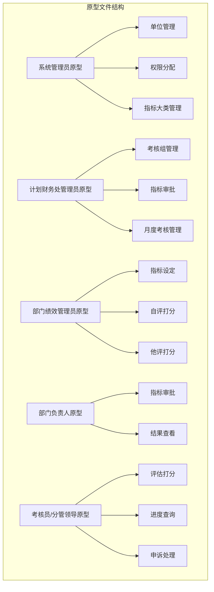

**图表来源**
- [系统管理员原型-v1.html:1-635](file://月度业绩考核原型设计初稿/1-系统管理员原型-v1.html#L1-L635)
- [计划财务处业绩考核管理员原型-v1.html:1-1039](file://月度业绩考核原型设计初稿/2-计划财务处业绩考核管理员原型-v1.html#L1-L1039)

**章节来源**
- [系统管理员原型-v1.html:1-635](file://月度业绩考核原型设计初稿/1-系统管理员原型-v1.html#L1-L635)
- [计划财务处业绩考核管理员原型-v1.html:1-1039](file://月度业绩考核原型设计初稿/2-计划财务处业绩考核管理员原型-v1.html#L1-L1039)

## 核心组件

### 搜索表单(Search Form)

搜索表单是系统中最基础且使用最频繁的组件，采用统一的布局规范：

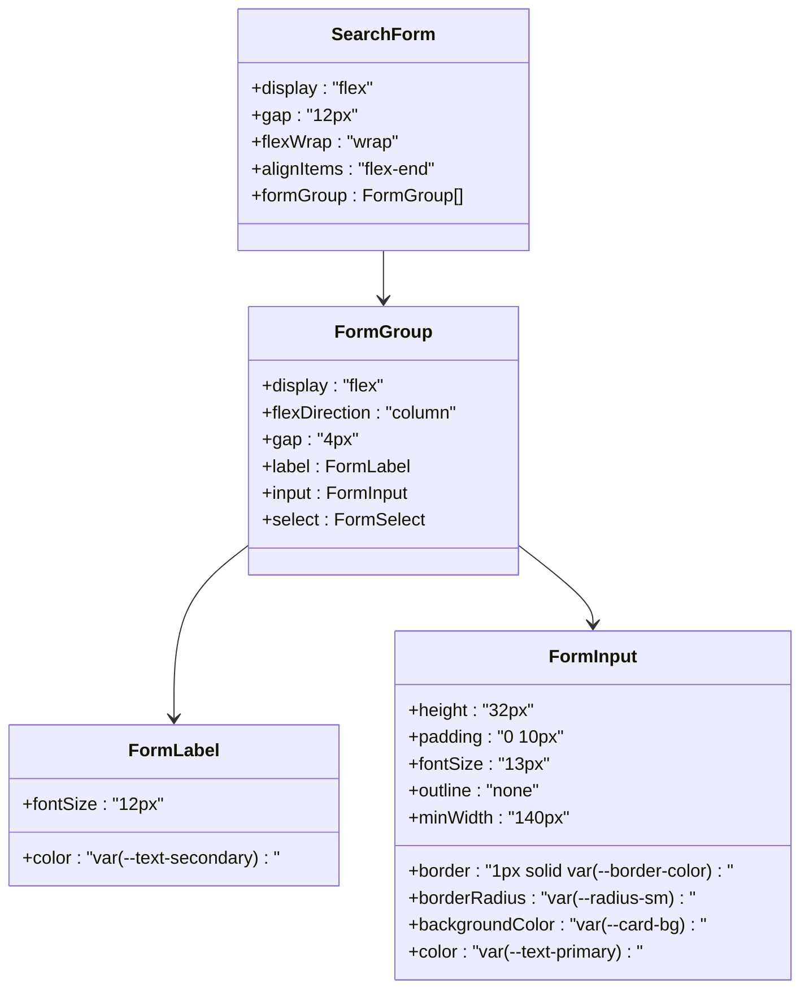

**图表来源**
- [系统管理员原型-v1.html:218-254](file://月度业绩考核原型设计初稿/1-系统管理员原型-v1.html#L218-L254)

### 按钮组件(Button)

系统提供了丰富样式的按钮组件，支持不同状态和尺寸：

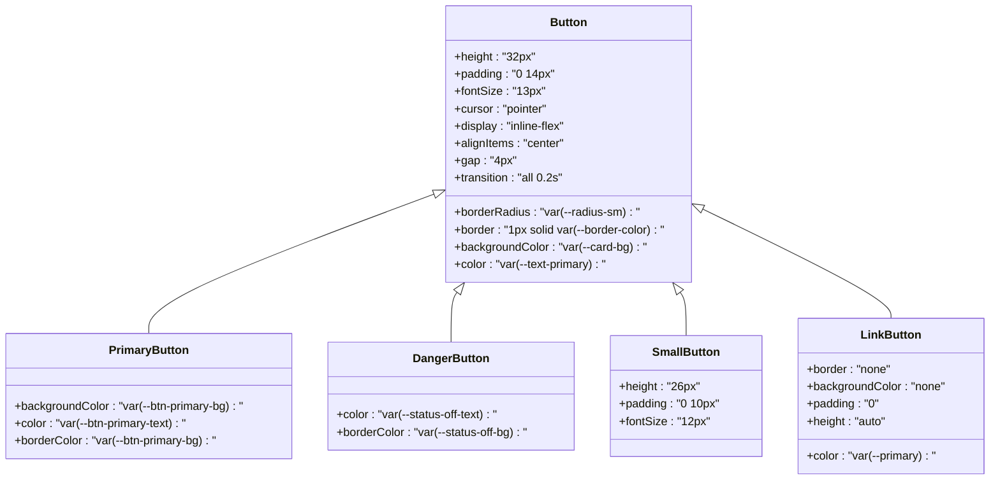

**图表来源**
- [系统管理员原型-v1.html:224-234](file://月度业绩考核原型设计初稿/1-系统管理员原型-v1.html#L224-L234)

### 模态框组件(Modal)

模态框组件支持多种尺寸和布局，提供完整的对话框解决方案：

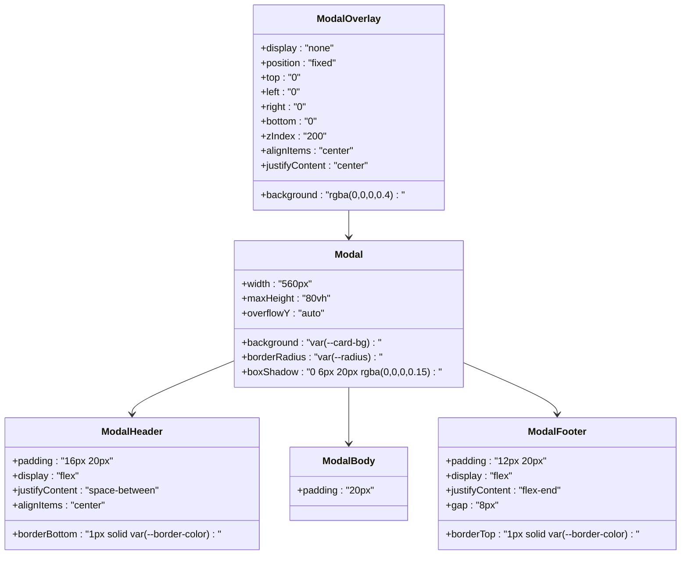

**图表来源**
- [系统管理员原型-v1.html:249-287](file://月度业绩考核原型设计初稿/1-系统管理员原型-v1.html#L249-L287)

### 标签选择器(User Tags)

标签选择器组件用于多选用户或项目的场景：

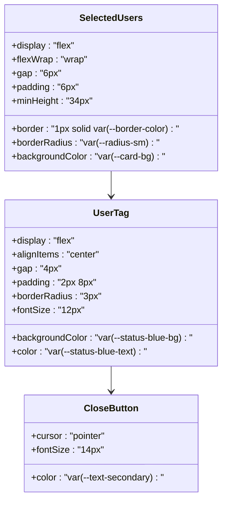

**图表来源**
- [系统管理员原型-v1.html:274-278](file://月度业绩考核原型设计初稿/1-系统管理员原型-v1.html#L274-L278)

### 单选组(Radio Group)

单选组组件提供清晰的选项选择体验：

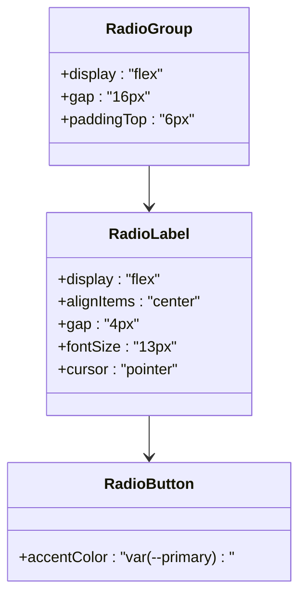

**图表来源**
- [部门负责人原型-v1.html:325-329](file://月度业绩考核原型设计初稿/4-部门负责人原型-v1.html#L325-L329)

### 选项卡组件(Tabs)

选项卡组件支持页面内容的分组展示：

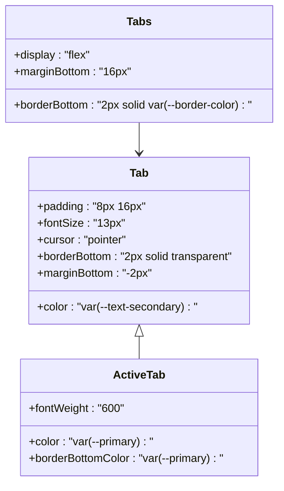

**图表来源**
- [部门绩效管理员原型-v1.html:347-352](file://月度业绩考核原型设计初稿/3-部门绩效管理员原型-v1.html#L347-L352)

**章节来源**
- [系统管理员原型-v1.html:218-287](file://月度业绩考核原型设计初稿/1-系统管理员原型-v1.html#L218-L287)
- [部门负责人原型-v1.html:325-329](file://月度业绩考核原型设计初稿/4-部门负责人原型-v1.html#L325-L329)
- [部门绩效管理员原型-v1.html:347-352](file://月度业绩考核原型设计初稿/3-部门绩效管理员原型-v1.html#L347-L352)

## 架构概览

系统采用模块化的组件架构，每个页面都是一个独立的功能模块：

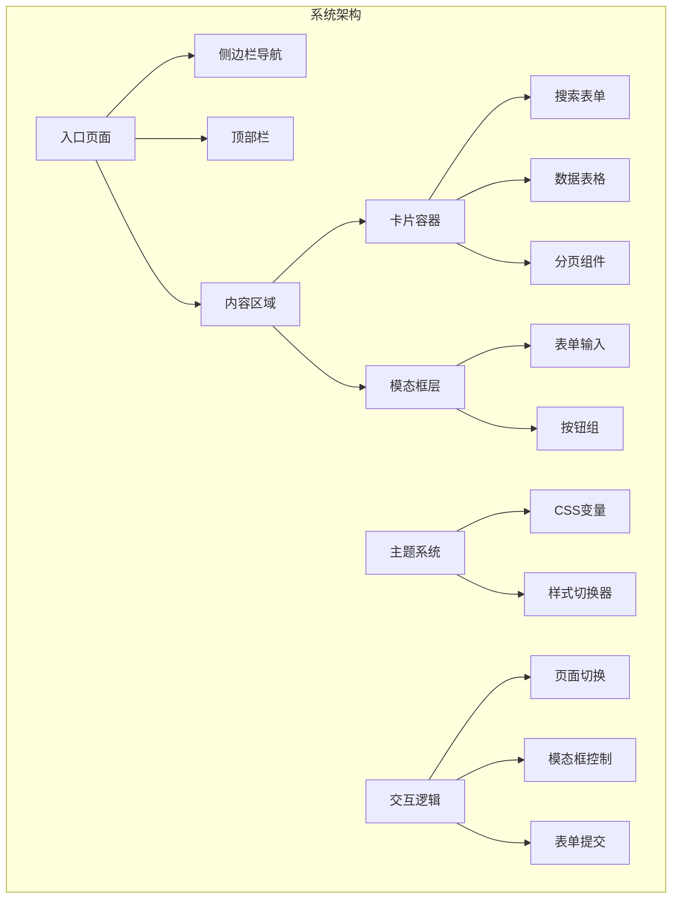

**图表来源**
- [系统管理员原型-v1.html:280-635](file://月度业绩考核原型设计初稿/1-系统管理员原型-v1.html#L280-L635)

系统的核心特性包括：

1. **响应式设计**：所有组件都支持响应式布局
2. **主题系统**：支持四种不同的视觉风格
3. **统一组件库**：所有页面共享相同的组件规范
4. **无障碍支持**：内置键盘导航和屏幕阅读器支持

**章节来源**
- [系统管理员原型-v1.html:612-635](file://月度业绩考核原型设计初稿/1-系统管理员原型-v1.html#L612-L635)

## 详细组件分析

### 表单数据收集与验证

系统中的表单组件遵循统一的数据收集模式：

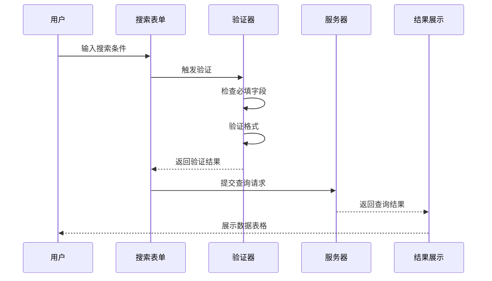

**图表来源**
- [系统管理员原型-v1.html:612-635](file://月度业绩考核原型设计初稿/1-系统管理员原型-v1.html#L612-L635)

### 组件间联动机制

系统中的组件具有复杂的联动关系：

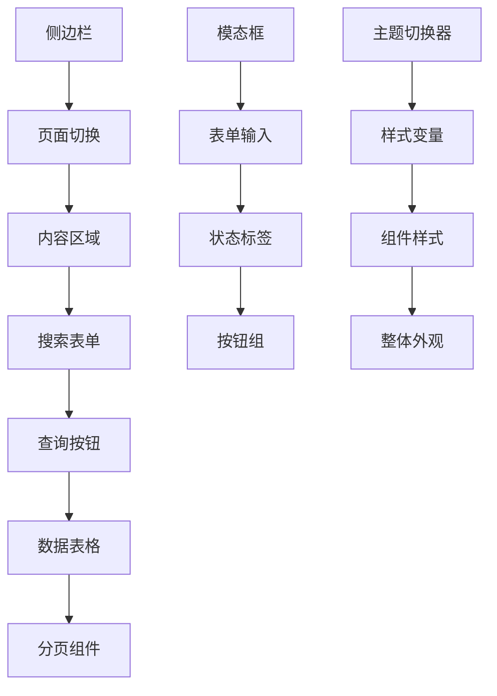

**图表来源**
- [系统管理员原型-v1.html:280-635](file://月度业绩考核原型设计初稿/1-系统管理员原型-v1.html#L280-L635)

### 表单提交流程

系统中的表单提交采用异步处理模式：

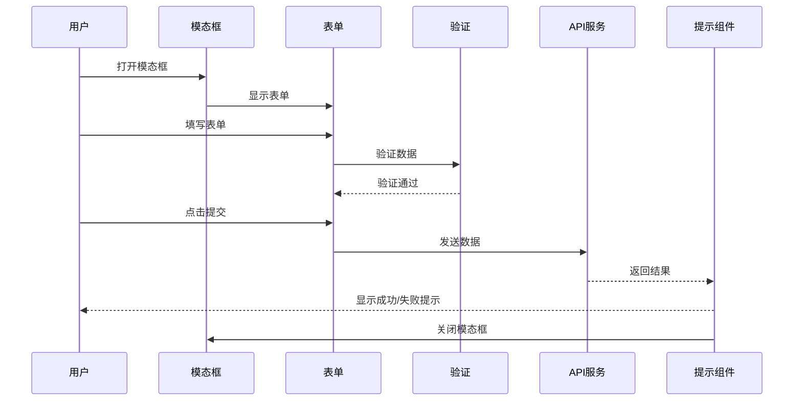

**图表来源**
- [系统管理员原型-v1.html:612-635](file://月度业绩考核原型设计初稿/1-系统管理员原型-v1.html#L612-L635)

**章节来源**
- [系统管理员原型-v1.html:612-635](file://月度业绩考核原型设计初稿/1-系统管理员原型-v1.html#L612-L635)

## 依赖关系分析

系统组件之间的依赖关系呈现层次化结构：

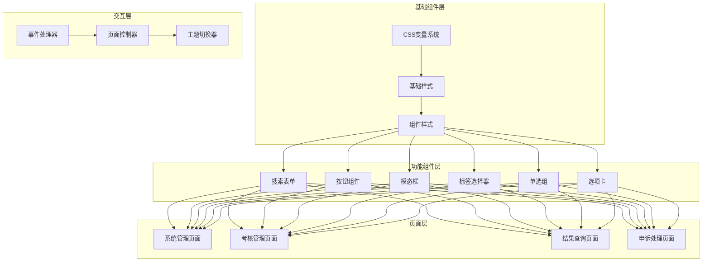

**图表来源**
- [系统管理员原型-v1.html:7-185](file://月度业绩考核原型设计初稿/1-系统管理员原型-v1.html#L7-L185)

**章节来源**
- [系统管理员原型-v1.html:7-185](file://月度业绩考核原型设计初稿/1-系统管理员原型-v1.html#L7-L185)

## 性能考虑

系统在性能方面采用了多项优化策略：

1. **CSS变量优化**：使用CSS变量减少样式重复，提高维护效率
2. **组件复用**：所有页面共享相同的组件库，减少代码冗余
3. **懒加载**：模态框采用延迟加载机制，只在需要时渲染
4. **事件委托**：使用事件委托减少事件监听器数量
5. **响应式设计**：组件自动适应不同屏幕尺寸

## 故障排除指南

### 常见问题及解决方案

**问题1：模态框无法关闭**
- 检查JavaScript函数调用是否正确
- 确认CSS类名是否匹配
- 验证事件监听器是否正常绑定

**问题2：搜索表单无响应**
- 检查表单元素的ID和类名
- 确认JavaScript事件处理函数
- 验证CSS样式是否影响了交互

**问题3：主题切换失效**
- 检查CSS变量定义
- 确认主题类名的应用顺序
- 验证样式优先级设置

**章节来源**
- [系统管理员原型-v1.html:612-635](file://月度业绩考核原型设计初稿/1-系统管理员原型-v1.html#L612-L635)

## 结论

本项目展示了一个完整的表单交互组件系统，具有以下特点：

1. **组件标准化**：所有组件遵循统一的设计规范和交互模式
2. **主题灵活性**：支持多种视觉风格，满足不同场景需求
3. **用户体验优秀**：提供直观的交互和清晰的状态反馈
4. **可扩展性强**：模块化设计便于功能扩展和维护
5. **无障碍友好**：内置键盘导航和屏幕阅读器支持

该系统为实际的企业级应用开发提供了良好的参考模板，展示了如何构建一个功能完整、用户体验优秀的表单交互系统。