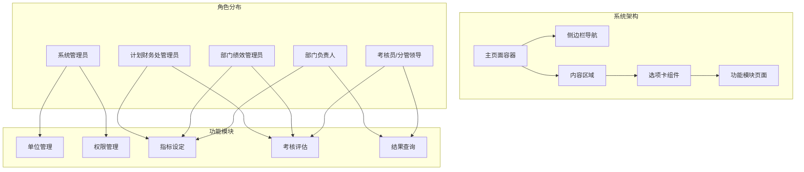
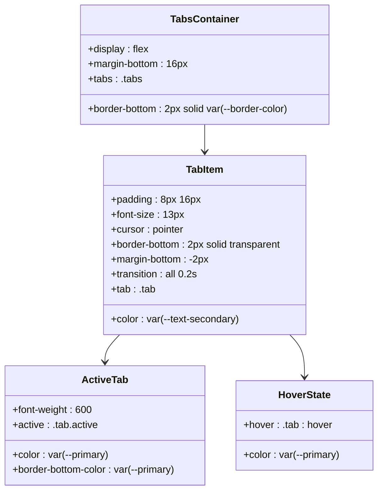
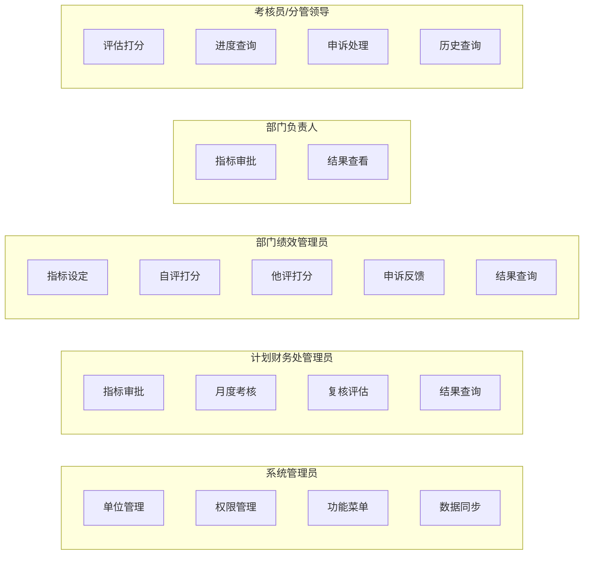
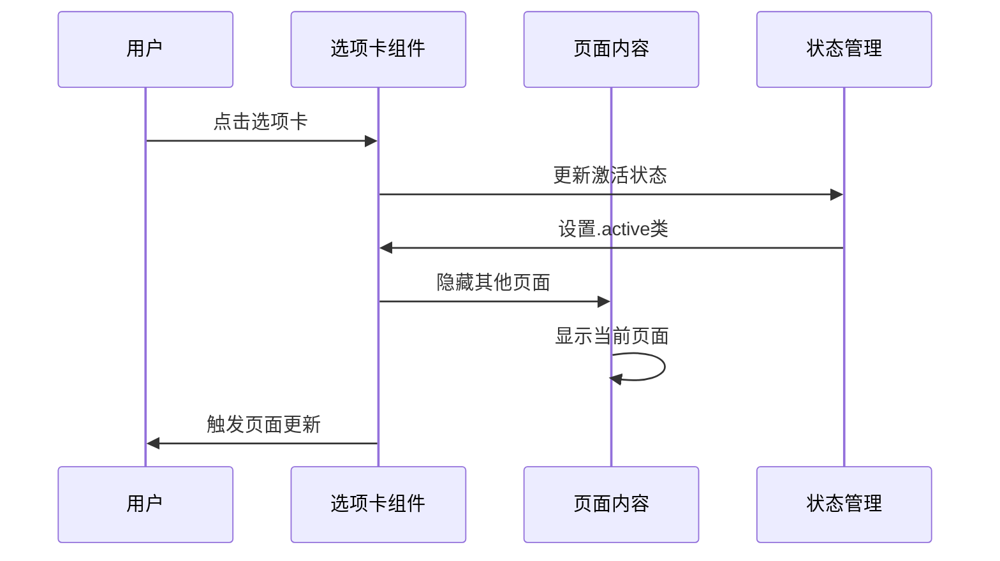
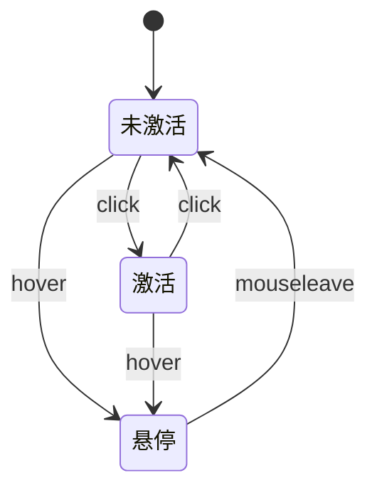
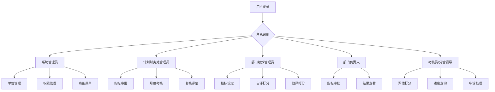
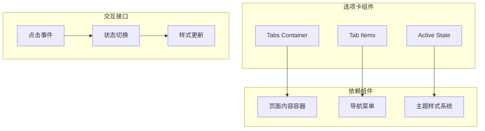

# 选项卡组件

<cite>
**本文档引用的文件**
- [1-系统管理员原型-v1.html](file://月度业绩考核原型设计初稿/1-系统管理员原型-v1.html)
- [2-计划财务处业绩考核管理员原型-v1.html](file://月度业绩考核原型设计初稿/2-计划财务处业绩考核管理员原型-v1.html)
- [3-部门绩效管理员原型-v1.html](file://月度业绩考核原型设计初稿/3-部门绩效管理员原型-v1.html)
- [4-部门负责人原型-v1.html](file://月度业绩考核原型设计初稿/4-部门负责人原型-v1.html)
- [5-考核员分管领导原型-v1.html](file://月度业绩考核原型设计初稿/5-考核员分管领导原型-v1.html)
- [6-时序图-v1.html](file://月度业绩考核原型设计初稿/6-时序图-v1.html)
</cite>

## 目录
1. [简介](#简介)
2. [项目结构](#项目结构)
3. [核心组件](#核心组件)
4. [架构概览](#架构概览)
5. [详细组件分析](#详细组件分析)
6. [依赖关系分析](#依赖关系分析)
7. [性能考虑](#性能考虑)
8. [故障排除指南](#故障排除指南)
9. [结论](#结论)

## 简介

选项卡组件是月度业绩考核管理系统中的重要交互元素，用于在不同的功能模块和页面内容之间进行切换。该组件采用简洁而直观的设计理念，通过视觉化的标签导航帮助用户高效地组织和访问复杂的业务功能。

在本项目中，选项卡组件不仅承担着页面导航的基本功能，更是整个系统用户体验的核心组成部分。它通过清晰的视觉层次和一致的交互模式，为不同角色的用户提供个性化的功能入口和内容展示。

## 项目结构

该项目是一个多角色权限的月度业绩考核管理系统，包含以下主要页面：



**图表来源**
- [1-系统管理员原型-v1.html:281-635](file://月度业绩考核原型设计初稿/1-系统管理员原型-v1.html#L281-L635)
- [2-计划财务处业绩考核管理员原型-v1.html:314-1039](file://月度业绩考核原型设计初稿/2-计划财务处业绩考核管理员原型-v1.html#L314-L1039)
- [3-部门绩效管理员原型-v1.html:400-1663](file://月度业绩考核原型设计初稿/3-部门绩效管理员原型-v1.html#L400-L1663)

**章节来源**
- [1-系统管理员原型-v1.html:1-635](file://月度业绩考核原型设计初稿/1-系统管理员原型-v1.html#L1-L635)
- [2-计划财务处业绩考核管理员原型-v1.html:1-1039](file://月度业绩考核原型设计初稿/2-计划财务处业绩考核管理员原型-v1.html#L1-L1039)
- [3-部门绩效管理员原型-v1.html:1-1663](file://月度业绩考核原型设计初稿/3-部门绩效管理员原型-v1.html#L1-L1663)

## 核心组件

### 选项卡容器结构

选项卡组件采用语义化的HTML结构，通过CSS类名实现统一的样式控制：



**图表来源**
- [3-部门绩效管理员原型-v1.html:347-351](file://月度业绩考核原型设计初稿/3-部门绩效管理员原型-v1.html#L347-L351)
- [5-考核员分管领导原型-v1.html:112-116](file://月度业绩考核原型设计初稿/5-考核员分管领导原型-v1.html#L112-L116)

### 样式系统设计

选项卡组件采用CSS变量系统，确保主题切换的一致性和可维护性：

| 样式属性 | 默认值 | 变量名 | 用途 |
|---------|--------|--------|------|
| 边框颜色 | #f0f0f0 | `var(--border-color)` | 选项卡容器底边框 |
| 主色调 | #2d5aa0 | `var(--primary)` | 激活状态颜色 |
| 文本颜色 | #999 | `var(--text-secondary)` | 普通状态文本 |
| 过渡时间 | 0.2s | - | 动画过渡时长 |

**章节来源**
- [3-部门绩效管理员原型-v1.html:347-351](file://月度业绩考核原型设计初稿/3-部门绩效管理员原型-v1.html#L347-L351)
- [5-考核员分管领导原型-v1.html:112-116](file://月度业绩考核原型设计初稿/5-考核员分管领导原型-v1.html#L112-L116)

## 架构概览

### 角色权限架构

系统采用基于角色的权限控制架构，每个角色都有特定的选项卡功能：



**图表来源**
- [1-系统管理员原型-v1.html:291-316](file://月度业绩考核原型设计初稿/1-系统管理员原型-v1.html#L291-L316)
- [2-计划财务处业绩考核管理员原型-v1.html:324-344](file://月度业绩考核原型设计初稿/2-计划财务处业绩考核管理员原型-v1.html#L324-L344)
- [3-部门绩效管理员原型-v1.html:411-430](file://月度业绩考核原型设计初稿/3-部门绩效管理员原型-v1.html#L411-L430)

### 选项卡切换机制

选项卡组件通过JavaScript事件处理实现页面内容的动态切换：



**图表来源**
- [1-系统管理员原型-v1.html:621-628](file://月度业绩考核原型设计初稿/1-系统管理员原型-v1.html#L621-L628)
- [2-计划财务处业绩考核管理员原型-v1.html:332-335](file://月度业绩考核原型设计初稿/2-计划财务处业绩考核管理员原型-v1.html#L332-L335)

**章节来源**
- [1-系统管理员原型-v1.html:621-628](file://月度业绩考核原型设计初稿/1-系统管理员原型-v1.html#L621-L628)
- [2-计划财务处业绩考核管理员原型-v1.html:332-335](file://月度业绩考核原型设计初稿/2-计划财务处业绩考核管理员原型-v1.html#L332-L335)

## 详细组件分析

### 样式定制方案

#### 激活状态设计
激活状态通过底部边框实现视觉焦点，使用主色调突出当前选中项：

```css
.tab.active {
    color: var(--primary);
    border-bottom-color: var(--primary);
    font-weight: 600;
}
```

#### 悬停交互效果
悬停状态提供平滑的颜色过渡，增强用户交互体验：

```css
.tab:hover {
    color: var(--primary);
}
```

#### 响应式适配
选项卡组件支持不同屏幕尺寸的自适应布局：

| 屏幕尺寸 | 最小宽度 | 间距设置 | 字体大小 |
|----------|----------|----------|----------|
| 移动端 | <768px | 8px 12px | 12px |
| 平板 | 768px-1024px | 8px 16px | 13px |
| 桌面端 | >1024px | 8px 16px | 13px |

**章节来源**
- [3-部门绩效管理员原型-v1.html:347-351](file://月度业绩考核原型设计初稿/3-部门绩效管理员原型-v1.html#L347-L351)
- [5-考核员分管领导原型-v1.html:112-116](file://月度业绩考核原型设计初稿/5-考核员分管领导原型-v1.html#L112-L116)

### 交互行为分析

#### 点击事件处理
选项卡的点击事件通过JavaScript函数实现页面切换：

```javascript
function showPage(name) {
    // 隐藏所有页面
    document.querySelectorAll('.page-section').forEach(p => p.style.display = 'none');
    // 显示目标页面
    document.getElementById('page-' + name).style.display = 'block';
    // 更新导航状态
    document.querySelectorAll('.menu-item').forEach(m => m.classList.remove('active'));
    event.currentTarget.classList.add('active');
}
```

#### 状态管理机制
激活状态通过CSS类名管理，确保界面状态的一致性：



**图表来源**
- [1-系统管理员原型-v1.html:621-628](file://月度业绩考核原型设计初稿/1-系统管理员原型-v1.html#L621-L628)

**章节来源**
- [1-系统管理员原型-v1.html:621-628](file://月度业绩考核原型设计初稿/1-系统管理员原型-v1.html#L621-L628)

### 应用场景分析

#### 不同功能模块的切换
选项卡组件在各个角色页面中承担着核心导航功能：

| 角色 | 选项卡数量 | 主要功能 | 使用频率 |
|------|------------|----------|----------|
| 系统管理员 | 6个 | 单位管理、权限分配、功能菜单 | 高频 |
| 计划财务处管理员 | 4个 | 指标审批、月度考核、复核评估 | 高频 |
| 部门绩效管理员 | 5个 | 指标设定、自评打分、他评打分 | 高频 |
| 部门负责人 | 2个 | 指标审批、结果查看 | 中频 |
| 考核员/分管领导 | 4个 | 评估打分、进度查询、申诉处理 | 中频 |

#### 内容组织策略
选项卡组件通过功能相关的页面分组，实现内容的有效组织：



**图表来源**
- [1-系统管理员原型-v1.html:291-316](file://月度业绩考核原型设计初稿/1-系统管理员原型-v1.html#L291-L316)
- [2-计划财务处业绩考核管理员原型-v1.html:324-344](file://月度业绩考核原型设计初稿/2-计划财务处业绩考核管理员原型-v1.html#L324-L344)

**章节来源**
- [1-系统管理员原型-v1.html:291-316](file://月度业绩考核原型设计初稿/1-系统管理员原型-v1.html#L291-L316)
- [2-计划财务处业绩考核管理员原型-v1.html:324-344](file://月度业绩考核原型设计初稿/2-计划财务处业绩考核管理员原型-v1.html#L324-L344)

## 依赖关系分析

### 组件耦合度
选项卡组件与其他系统组件的依赖关系相对松散，主要通过CSS类名和JavaScript事件进行交互：



### 外部依赖
选项卡组件主要依赖于：
- CSS变量系统（用于主题切换）
- JavaScript事件处理（用于页面切换）
- HTML语义化结构（用于无障碍访问）

**章节来源**
- [3-部门绩效管理员原型-v1.html:347-351](file://月度业绩考核原型设计初稿/3-部门绩效管理员原型-v1.html#L347-L351)
- [5-考核员分管领导原型-v1.html:112-116](file://月度业绩考核原型设计初稿/5-考核员分管领导原型-v1.html#L112-L116)

## 性能考虑

### 渲染优化
选项卡组件采用轻量级的CSS实现，避免了复杂的JavaScript动画开销。通过CSS变量的使用，实现了主题切换的高性能渲染。

### 内存管理
组件通过事件委托和类名切换的方式管理状态，避免了DOM节点的频繁创建和销毁，减少了内存泄漏的风险。

### 响应速度
选项卡切换的响应时间通常在几十毫秒内，提供了流畅的用户体验。对于大量选项卡的情况，建议考虑虚拟滚动等优化技术。

## 故障排除指南

### 常见问题及解决方案

#### 选项卡状态不同步
**问题描述**：点击选项卡后，页面内容没有正确切换
**解决方案**：
1. 检查页面ID命名是否与选项卡数据属性匹配
2. 确认JavaScript函数调用是否正确
3. 验证CSS类名冲突问题

#### 激活状态样式异常
**问题描述**：激活状态的颜色或边框显示不正确
**解决方案**：
1. 检查CSS变量是否正确设置
2. 确认CSS优先级是否正确
3. 验证浏览器兼容性问题

#### 移动端触摸响应问题
**问题描述**：在移动设备上点击无响应
**解决方案**：
1. 添加适当的触摸事件监听器
2. 调整点击区域大小
3. 优化触摸反馈效果

**章节来源**
- [1-系统管理员原型-v1.html:621-628](file://月度业绩考核原型设计初稿/1-系统管理员原型-v1.html#L621-L628)

## 结论

选项卡组件作为月度业绩考核管理系统的核心交互元素，展现了现代Web应用设计的最佳实践。通过精心设计的样式系统、灵活的响应式布局和高效的交互机制，该组件为不同角色的用户提供了直观而一致的操作体验。

组件的设计充分考虑了可扩展性和可维护性，通过CSS变量系统实现了主题的无缝切换，通过语义化的HTML结构确保了良好的可访问性。同时，组件的轻量级实现保证了优秀的性能表现，为大规模用户群体提供了稳定的使用体验。

在未来的发展中，可以进一步考虑集成更多的交互模式，如键盘导航、手势操作等，以满足更多用户的使用需求。同时，随着业务复杂度的增加，可能需要考虑选项卡的分组折叠、搜索过滤等功能，以提升大型系统的可用性。