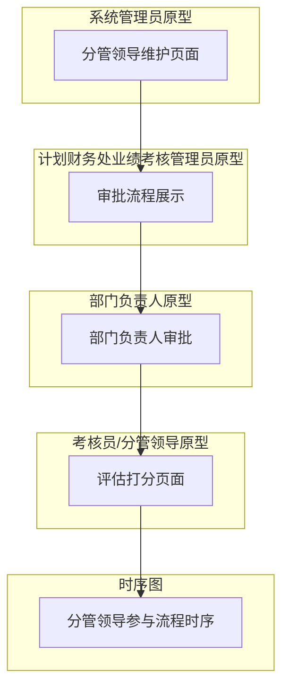
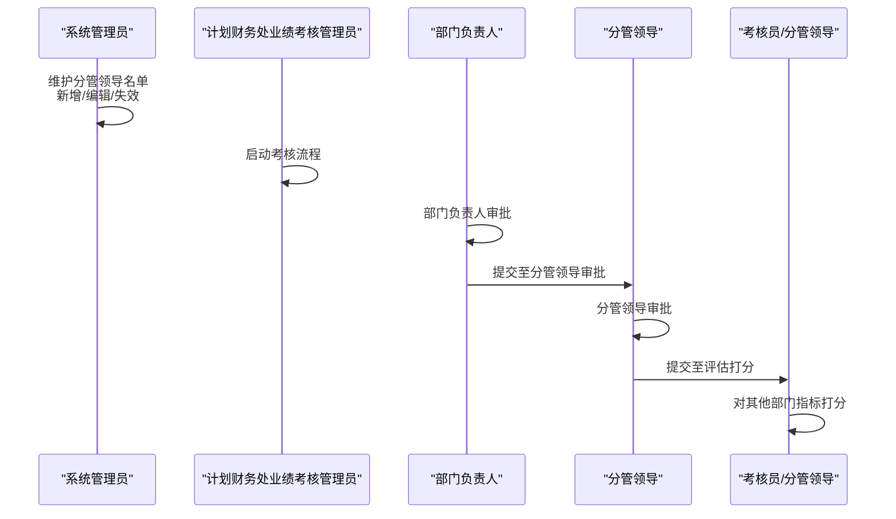
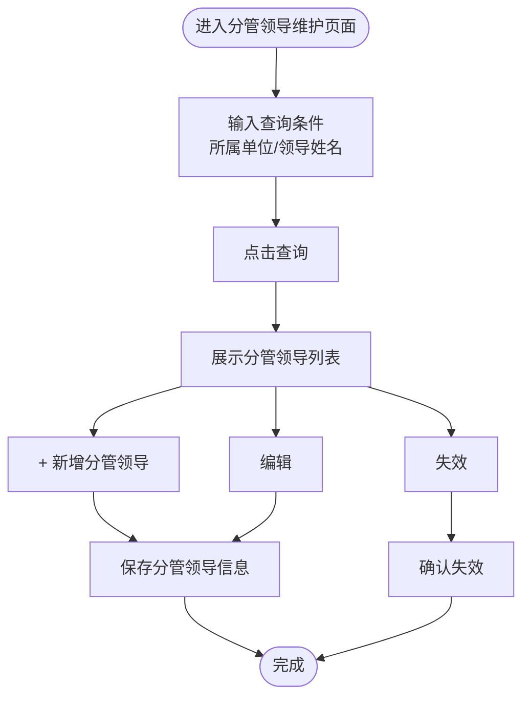
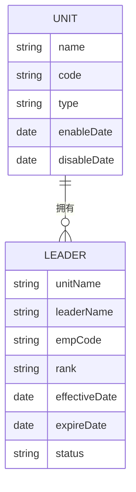
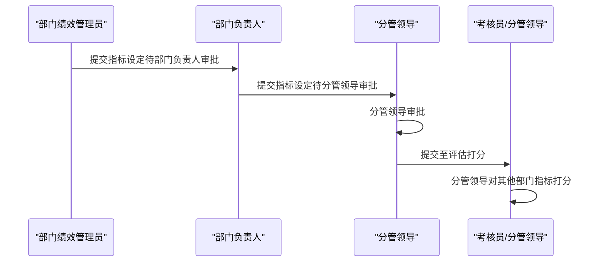
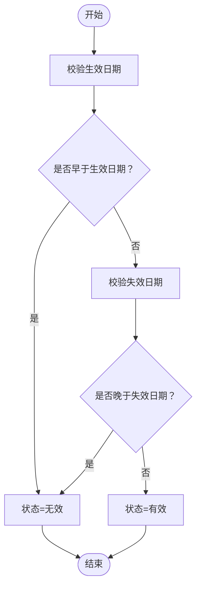
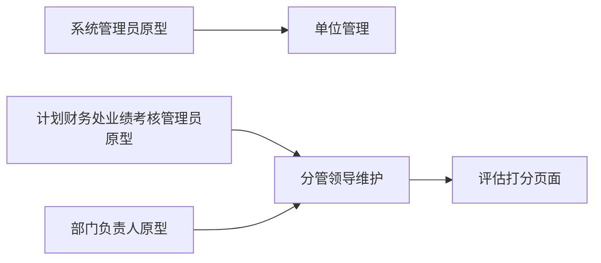

# 分管领导维护

<cite>
**本文档引用的文件**
- [1-系统管理员原型-v1.html](file://1-系统管理员原型-v1.html)
- [2-计划财务处业绩考核管理员原型-v1.html](file://2-计划财务处业绩考核管理员原型-v1.html)
- [3-部门绩效管理员原型-v1.html](file://3-部门绩效管理员原型-v1.html)
- [4-部门负责人原型-v1.html](file://4-部门负责人原型-v1.html)
- [5-考核员分管领导原型-v1.html](file://5-考核员分管领导原型-v1.html)
- [6-时序图-v1.html](file://6-时序图-v1.html)
</cite>

## 目录
1. [简介](#简介)
2. [项目结构](#项目结构)
3. [核心组件](#核心组件)
4. [架构概览](#架构概览)
5. [详细组件分析](#详细组件分析)
6. [依赖分析](#依赖分析)
7. [性能考虑](#性能考虑)
8. [故障排除指南](#故障排除指南)
9. [结论](#结论)

## 简介
本指南面向分管领导维护功能，围绕月度业绩考核系统的“分管领导”角色展开，帮助系统管理员高效配置各单位分管领导名单，确保数据准确性和流程合规性。文档涵盖分管领导的新增、编辑、失效操作流程，明确生效日期与失效日期的管理规则，并结合考核流程说明分管领导在评估打分环节的作用。

## 项目结构
本项目采用多角色原型页面设计，分管领导维护功能位于系统管理员原型页面中，同时在其他角色页面中体现其在考核流程中的作用。主要页面包括：
- 系统管理员原型：提供分管领导维护的主界面与操作入口
- 计划财务处业绩考核管理员原型：体现分管领导在审批流程中的位置
- 部门负责人原型：体现分管领导审批后的流转
- 考核员/分管领导原型：体现分管领导在评估打分中的职责
- 时序图：系统化展示分管领导参与的业务流程

**图表来源**
- [1-系统管理员原型-v1.html](file://1-系统管理员原型-v1.html)
- [2-计划财务处业绩考核管理员原型-v1.html](file://2-计划财务处业绩考核管理员原型-v1.html)
- [4-部门负责人原型-v1.html](file://4-部门负责人原型-v1.html)
- [5-考核员分管领导原型-v1.html](file://5-考核员分管领导原型-v1.html)
- [6-时序图-v1.html](file://6-时序图-v1.html)

**章节来源**
- [1-系统管理员原型-v1.html](file://1-系统管理员原型-v1.html)
- [6-时序图-v1.html](file://6-时序图-v1.html)

## 核心组件
- 分管领导维护页面：提供查询、新增、编辑、失效等操作入口，支持按单位、姓名筛选
- 分管领导数据模型：包含所属单位、领导姓名、人员编号、职级、生效日期、失效日期、状态等字段
- 审批流程：分管领导作为审批节点之一，参与年度指标设定与月度考核评估流程
- 评估打分：分管领导在月度考核中对其他部门指标进行评估打分

**章节来源**
- [1-系统管理员原型-v1.html](file://1-系统管理员原型-v1.html)
- [2-计划财务处业绩考核管理员原型-v1.html](file://2-计划财务处业绩考核管理员原型-v1.html)
- [4-部门负责人原型-v1.html](file://4-部门负责人原型-v1.html)
- [5-考核员分管领导原型-v1.html](file://5-考核员分管领导原型-v1.html)

## 架构概览
分管领导维护贯穿于考核流程的多个阶段，系统管理员负责维护基础数据，计划财务处业绩考核管理员负责流程推进，部门负责人与分管领导分别承担审批职责，最终由考核员/分管领导完成评估打分。

**图表来源**
- [1-系统管理员原型-v1.html](file://1-系统管理员原型-v1.html)
- [2-计划财务处业绩考核管理员原型-v1.html](file://2-计划财务处业绩考核管理员原型-v1.html)
- [4-部门负责人原型-v1.html](file://4-部门负责人原型-v1.html)
- [5-考核员分管领导原型-v1.html](file://5-考核员分管领导原型-v1.html)
- [6-时序图-v1.html](file://6-时序图-v1.html)

## 详细组件分析

### 分管领导维护页面
- 页面入口：系统管理员侧边栏“系统设置”→“分管领导维护”
- 查询条件：所属单位、领导姓名
- 操作按钮：新增分管领导
- 列表字段：序号、所属单位、领导姓名、人员编号、职级、生效日期、失效日期、状态、操作（编辑、失效）
- 状态标识：有效/无效

**图表来源**
- [1-系统管理员原型-v1.html](file://1-系统管理员原型-v1.html)

**章节来源**
- [1-系统管理员原型-v1.html](file://1-系统管理员原型-v1.html)

### 分管领导与单位的关联关系
- 关联方式：分管领导维护页面的“所属单位”字段与单位管理页面的单位列表关联
- 维护入口：系统管理员在“单位管理”中维护单位信息，分管领导维护中选择对应单位
- 关系约束：一个单位可配置多名分管领导；分管领导与单位之间为一对多关系

**图表来源**
- [1-系统管理员原型-v1.html](file://1-系统管理员原型-v1.html)

**章节来源**
- [1-系统管理员原型-v1.html](file://1-系统管理员原型-v1.html)

### 分管领导在考核流程中的作用
- 年度指标设定：分管领导作为审批节点之一，审批部门提交的指标设定
- 月度考核评估：分管领导对其他部门的指标进行评估打分，支持按部门展示/按指标展示切换

**图表来源**
- [2-计划财务处业绩考核管理员原型-v1.html](file://2-计划财务处业绩考核管理员原型-v1.html)
- [4-部门负责人原型-v1.html](file://4-部门负责人原型-v1.html)
- [5-考核员分管领导原型-v1.html](file://5-考核员分管领导原型-v1.html)
- [6-时序图-v1.html](file://6-时序图-v1.html)

**章节来源**
- [2-计划财务处业绩考核管理员原型-v1.html](file://2-计划财务处业绩考核管理员原型-v1.html)
- [4-部门负责人原型-v1.html](file://4-部门负责人原型-v1.html)
- [5-考核员分管领导原型-v1.html](file://5-考核员分管领导原型-v1.html)
- [6-时序图-v1.html](file://6-时序图-v1.html)

### 生效日期与失效日期管理规则
- 生效日期：分管领导信息生效的起始日期，系统以生效日期为准判断是否允许参与审批与评估
- 失效日期：分管领导信息失效的终止日期，失效后不再参与相关流程
- 状态逻辑：若当前日期在生效日期之前，则状态为“无效”；若当前日期在生效日期与失效日期之间，则状态为“有效”；若超过失效日期，则状态为“无效”

**图表来源**
- [1-系统管理员原型-v1.html](file://1-系统管理员原型-v1.html)

**章节来源**
- [1-系统管理员原型-v1.html](file://1-系统管理员原型-v1.html)

### 数据准确性保障最佳实践
- 人员信息一致性：确保分管领导的“所属单位”与“人员编号”与单位管理与人员档案一致
- 日期区间合理性：生效日期不得晚于失效日期；建议在变更前预留合理的过渡期
- 审批链完整性：分管领导信息缺失可能导致审批流程中断，需在流程启动前完成维护
- 变更追溯：对分管领导信息的新增、编辑、失效操作保留记录，便于审计与问题排查

**章节来源**
- [1-系统管理员原型-v1.html](file://1-系统管理员原型-v1.html)
- [2-计划财务处业绩考核管理员原型-v1.html](file://2-计划财务处业绩考核管理员原型-v1.html)
- [4-部门负责人原型-v1.html](file://4-部门负责人原型-v1.html)
- [5-考核员分管领导原型-v1.html](file://5-考核员分管领导原型-v1.html)

## 依赖分析
- 系统管理员原型依赖单位管理页面提供的单位列表，用于选择分管领导所属单位
- 计划财务处业绩考核管理员原型依赖分管领导审批节点，确保流程合规
- 部门负责人原型依赖分管领导审批结果，推动流程进入下一阶段
- 考核员/分管领导原型依赖分管领导维护的数据，进行评估打分

**图表来源**
- [1-系统管理员原型-v1.html](file://1-系统管理员原型-v1.html)
- [2-计划财务处业绩考核管理员原型-v1.html](file://2-计划财务处业绩考核管理员原型-v1.html)
- [4-部门负责人原型-v1.html](file://4-部门负责人原型-v1.html)
- [5-考核员分管领导原型-v1.html](file://5-考核员分管领导原型-v1.html)

**章节来源**
- [1-系统管理员原型-v1.html](file://1-系统管理员原型-v1.html)
- [2-计划财务处业绩考核管理员原型-v1.html](file://2-计划财务处业绩考核管理员原型-v1.html)
- [4-部门负责人原型-v1.html](file://4-部门负责人原型-v1.html)
- [5-考核员分管领导原型-v1.html](file://5-考核员分管领导原型-v1.html)

## 性能考虑
- 列表查询优化：建议在分管领导维护页面增加索引字段（所属单位、生效日期、失效日期），提升查询效率
- 批量操作：对于频繁的新增/编辑/失效操作，建议提供批量导入/导出能力，减少重复录入
- 缓存策略：对常用单位列表与分管领导名单进行缓存，降低页面加载压力

## 故障排除指南
- 无法找到分管领导：检查“所属单位”是否正确，确认单位已在单位管理中维护
- 审批流程卡住：检查分管领导的生效日期与失效日期是否合理，确保当前日期处于有效期内
- 评估打分异常：确认分管领导信息已维护且状态为“有效”，并在评估打分页面中正确选择

**章节来源**
- [1-系统管理员原型-v1.html](file://1-系统管理员原型-v1.html)
- [2-计划财务处业绩考核管理员原型-v1.html](file://2-计划财务处业绩考核管理员原型-v1.html)
- [4-部门负责人原型-v1.html](file://4-部门负责人原型-v1.html)
- [5-考核员分管领导原型-v1.html](file://5-考核员分管领导原型-v1.html)

## 结论
分管领导维护是月度业绩考核系统的关键基础数据管理功能。通过规范的新增、编辑、失效操作，严格管理生效日期与失效日期，可以有效保障审批与评估流程的顺畅运行。建议系统管理员定期核查分管领导信息，确保数据准确、流程合规，为考核工作的高质量开展提供支撑。