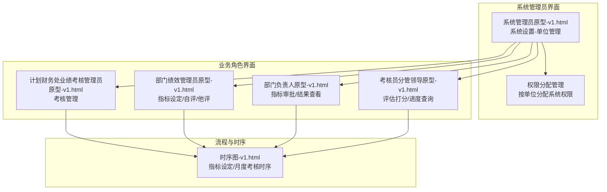
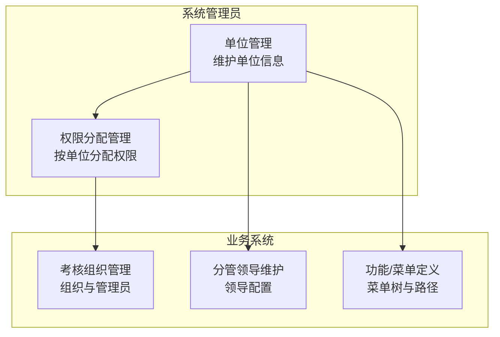
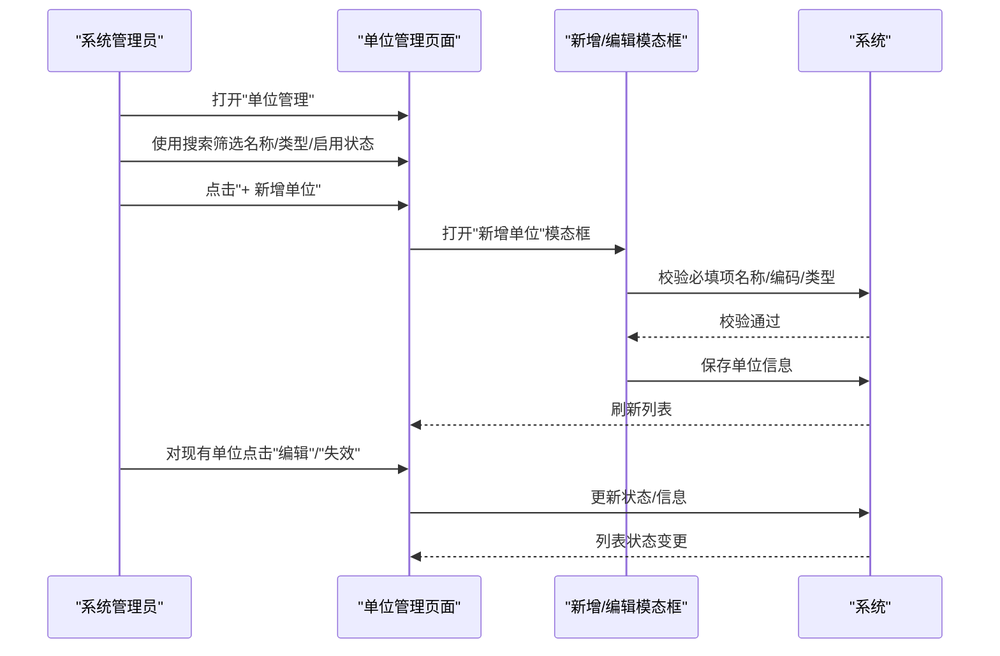
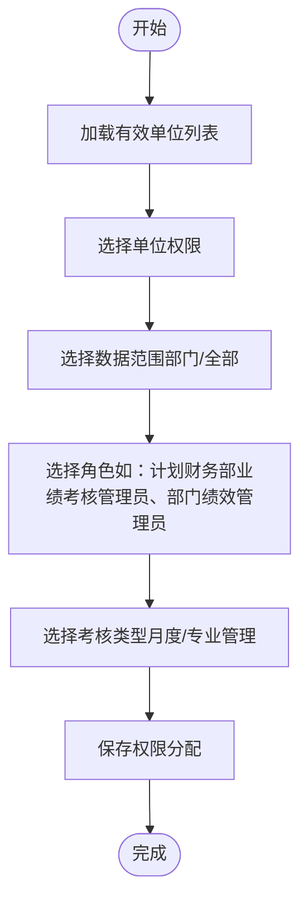
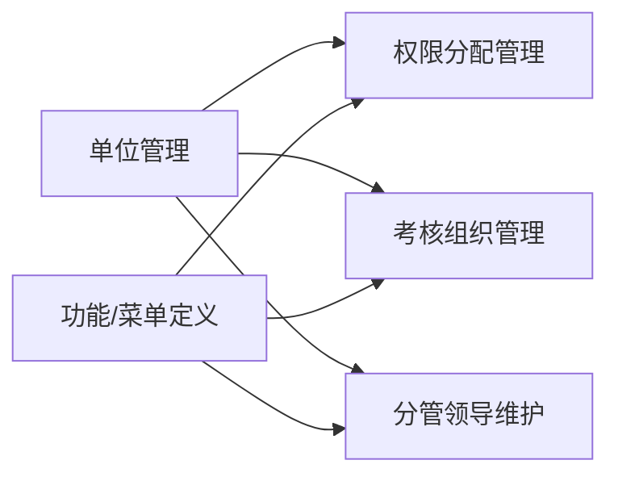

# 单位管理

<cite>
**本文档引用的文件**
- [系统管理员原型-v1.html](file://月度业绩考核原型设计初稿/1-系统管理员原型-v1.html)
- [计划财务处业绩考核管理员原型-v1.html](file://月度业绩考核原型设计初稿/2-计划财务处业绩考核管理员原型-v1.html)
- [部门绩效管理员原型-v1.html](file://月度业绩考核原型设计初稿/3-部门绩效管理员原型-v1.html)
- [部门负责人原型-v1.html](file://月度业绩考核原型设计初稿/4-部门负责人原型-v1.html)
- [考核员分管领导原型-v1.html](file://月度业绩考核原型设计初稿/5-考核员分管领导原型-v1.html)
- [时序图-v1.html](file://月度业绩考核原型设计初稿/6-时序图-v1.html)
</cite>

## 目录
1. [简介](#简介)
2. [项目结构](#项目结构)
3. [核心组件](#核心组件)
4. [架构概览](#架构概览)
5. [详细组件分析](#详细组件分析)
6. [依赖关系分析](#依赖关系分析)
7. [性能考虑](#性能考虑)
8. [故障排除指南](#故障排除指南)
9. [结论](#结论)
10. [附录](#附录)

## 简介
本指南面向系统管理员与相关业务用户，提供"单位管理"功能的完整操作说明。单位管理涵盖参与考核的单位信息维护，包括单位的新增、编辑、启用/失效操作；明确单位类型分类（公司、分公司、其他）与单位编码规则；阐述基于单位的权限控制机制；提供界面操作步骤与搜索筛选方法；解释单位状态管理的重要性及失效单位对系统权限的影响，并给出最佳实践与常见问题解决方案。

## 项目结构
本仓库包含一套基于HTML的原型页面，展示了月度业绩考核管理系统的不同角色界面与关键流程。单位管理作为系统管理员的核心职责之一，位于系统设置模块中，配合权限分配管理实现按单位的权限隔离。

**图表来源**
- [系统管理员原型-v1.html:291-360](file://月度业绩考核原型设计初稿/1-系统管理员原型-v1.html#L291-L360)
- [时序图-v1.html:112-298](file://月度业绩考核原型设计初稿/6-时序图-v1.html#L112-L298)

**章节来源**
- [系统管理员原型-v1.html:291-360](file://月度业绩考核原型设计初稿/1-系统管理员原型-v1.html#L291-L360)

## 核心组件
- 单位管理页面：提供单位列表、搜索筛选、新增/编辑/失效操作入口。
- 权限分配管理：基于单位权限与数据范围进行系统权限下放。
- 分管领导维护：为各单位配置分管领导，确保审批链路正确性。
- 考核组织管理：与单位关联的组织层级与管理员配置。
- 功能/菜单定义：菜单树与菜单路径，支撑权限控制的技术基础。

**章节来源**
- [系统管理员原型-v1.html:329-359](file://月度业绩考核原型设计初稿/1-系统管理员原型-v1.html#L329-L359)
- [系统管理员原型-v1.html:389-415](file://月度业绩考核原型设计初稿/1-系统管理员原型-v1.html#L389-L415)
- [系统管理员原型-v1.html:417-446](file://月度业绩考核原型设计初稿/1-系统管理员原型-v1.html#L417-L446)

## 架构概览
单位管理在系统中的作用是为权限分配提供"单位维度"的数据源。系统管理员在单位管理中维护有效的单位清单，然后在权限分配管理中将人员与单位、考核类型、角色、数据范围进行绑定，从而实现按单位的权限隔离与数据访问控制。

**图表来源**
- [系统管理员原型-v1.html:291-360](file://月度业绩考核原型设计初稿/1-系统管理员原型-v1.html#L291-L360)
- [系统管理员原型-v1.html:389-446](file://月度业绩考核原型设计初稿/1-系统管理员原型-v1.html#L389-L446)

## 详细组件分析

### 单位管理页面与操作流程
- 页面入口：系统管理员侧边栏"系统设置-单位管理"。
- 列表展示：单位名称、单位类型、单位编码、创建日期、创建人、是否启用、失效日期、操作按钮（编辑、失效）。
- 搜索筛选：支持按单位名称、单位类型、是否启用进行查询；提供重置按钮。
- 新增单位：打开"新增单位"模态框，必填项包括单位名称、单位编码、单位类型、是否启用。
- 编辑单位：在列表行点击"编辑"，进入模态框修改信息。
- 启用/失效：点击"失效"按钮，系统将标记该单位为失效状态，后续不再参与权限控制与数据范围校验。

**图表来源**
- [系统管理员原型-v1.html:329-359](file://月度业绩考核原型设计初稿/1-系统管理员原型-v1.html#L329-L359)
- [系统管理员原型-v1.html:564-573](file://月度业绩考核原型设计初稿/1-系统管理员原型-v1.html#L564-L573)

**章节来源**
- [系统管理员原型-v1.html:329-359](file://月度业绩考核原型设计初稿/1-系统管理员原型-v1.html#L329-L359)
- [系统管理员原型-v1.html:564-573](file://月度业绩考核原型设计初稿/1-系统管理员原型-v1.html#L564-L573)

### 单位类型与编码规则
- 单位类型：公司、分公司、其他。系统管理员在新增/编辑时选择相应类型。
- 单位编码：系统管理员在新增/编辑时填写编码，应具备唯一性与可识别性，便于在权限分配与组织管理中引用。

注意：具体编码生成策略（如前缀规则、长度限制、分段规则）应在企业内部规范中明确，此处以原型界面字段为准。

**章节来源**
- [系统管理员原型-v1.html:568-569](file://月度业绩考核原型设计初稿/1-系统管理员原型-v1.html#L568-L569)

### 权限控制机制（按单位）
- 单位作为权限分配的基本维度：在权限分配管理中，选择"单位权限"时，系统会依据单位管理中的有效单位进行下拉选择。
- 数据范围绑定：结合"数据范围"字段，可限定人员仅能查看/操作指定单位下的组织与指标。
- 角色与考核类型：通过"分配角色"与"考核类型"，进一步细化权限边界，确保不同角色只能在授权范围内开展工作。

**图表来源**
- [系统管理员原型-v1.html:389-415](file://月度业绩考核原型设计初稿/1-系统管理员原型-v1.html#L389-L415)
- [系统管理员原型-v1.html:608-610](file://月度业绩考核原型设计初稿/1-系统管理员原型-v1.html#L608-L610)

**章节来源**
- [系统管理员原型-v1.html:389-415](file://月度业绩考核原型设计初稿/1-系统管理员原型-v1.html#L389-L415)
- [系统管理员原型-v1.html:608-610](file://月度业绩考核原型设计初稿/1-系统管理员原型-v1.html#L608-L610)

### 分管领导维护与单位关联
- 分管领导维护页面支持按所属单位筛选，确保各单位的分管领导配置准确。
- 分管领导信息（姓名、职级、生效/失效日期）直接影响审批流程的正确性与数据选择的准确性。

**章节来源**
- [系统管理员原型-v1.html:361-387](file://月度业绩考核原型设计初稿/1-系统管理员原型-v1.html#L361-L387)
- [系统管理员原型-v1.html:604-606](file://月度业绩考核原型设计初稿/1-系统管理员原型-v1.html#L604-L606)

### 考核组织管理与单位关系
- 考核组织管理中，组织的"所属单位"字段与单位管理中的单位编码/名称保持一致，确保组织层级与单位维度的正确映射。
- 组织管理员、负责人、分管领导等角色均与单位/组织绑定，形成清晰的职责链路。

**章节来源**
- [系统管理员原型-v1.html:417-446](file://月度业绩考核原型设计初稿/1-系统管理员原型-v1.html#L417-L446)
- [系统管理员原型-v1.html:575-588](file://月度业绩考核原型设计初稿/1-系统管理员原型-v1.html#L575-L588)

### 指标大类管理与适用范围
- 指标大类的"适用范围"字段（机关部门/分公司/公共）与单位类型（公司/分公司/其他）相呼应，便于在指标设定时按单位属性进行匹配与筛选。

**章节来源**
- [系统管理员原型-v1.html:448-482](file://月度业绩考核原型设计初稿/1-系统管理员原型-v1.html#L448-L482)

## 依赖关系分析
- 单位管理是权限分配的基础数据源，权限分配依赖单位的有效性与唯一性。
- 分管领导维护与单位管理紧密耦合，分管领导的生效/失效日期与单位状态共同影响审批流程。
- 考核组织管理依赖单位管理提供的单位清单，确保组织归属正确。
- 功能/菜单定义为权限控制提供技术支撑，菜单路径与权限矩阵共同决定用户可见性与可操作性。

**图表来源**
- [系统管理员原型-v1.html:291-360](file://月度业绩考核原型设计初稿/1-系统管理员原型-v1.html#L291-L360)
- [系统管理员原型-v1.html:389-446](file://月度业绩考核原型设计初稿/1-系统管理员原型-v1.html#L389-L446)

**章节来源**
- [系统管理员原型-v1.html:291-360](file://月度业绩考核原型设计初稿/1-系统管理员原型-v1.html#L291-L360)
- [系统管理员原型-v1.html:389-446](file://月度业绩考核原型设计初稿/1-系统管理员原型-v1.html#L389-L446)

## 性能考虑
- 列表分页与搜索：单位列表采用分页展示，搜索筛选可减少一次性渲染的数据量，提升交互响应速度。
- 模态框异步：新增/编辑操作在模态框内完成，避免整页刷新，提高用户体验。
- 数据一致性：单位状态变更（启用/失效）应立即同步到权限分配与组织管理中，避免脏数据导致的权限异常。

## 故障排除指南
- 新增单位失败：检查必填项（单位名称、单位编码、单位类型）是否填写完整；确认单位编码唯一性。
- 权限分配无效：确认所选单位处于"启用"状态；检查"数据范围"与"考核类型"是否与角色匹配。
- 分管领导无法审批：检查分管领导的生效/失效日期是否在当前考核周期内；确认其所属单位与指标所属单位一致。
- 组织管理员无法操作：检查组织的"所属单位"字段是否与单位管理中的单位一致；确认组织状态正常。
- 模态框无法关闭：检查浏览器控制台是否存在JavaScript错误；尝试刷新页面后重试。

**章节来源**
- [系统管理员原型-v1.html:564-573](file://月度业绩考核原型设计初稿/1-系统管理员原型-v1.html#L564-L573)
- [系统管理员原型-v1.html:389-415](file://月度业绩考核原型设计初稿/1-系统管理员原型-v1.html#L389-L415)

## 结论
单位管理是权限控制与数据范围管理的基石。系统管理员应确保单位信息的准确性、完整性与及时更新，特别是单位状态的维护，直接关系到权限分配的有效性与业务流程的顺畅性。通过规范的单位类型与编码规则、严格的启用/失效管理，以及与权限分配、组织管理、分管领导维护的协同，可以构建稳定可靠的考核权限体系。

## 附录

### 界面操作步骤（示例）
- 打开"系统管理员原型-v1.html"，点击左侧"系统设置-单位管理"。
- 在搜索区输入单位名称/选择单位类型/选择是否启用，点击"查询"。
- 点击"+ 新增单位"，填写必填项后保存。
- 在列表中对单位进行"编辑"或"失效"操作。

**章节来源**
- [系统管理员原型-v1.html:329-359](file://月度业绩考核原型设计初稿/1-系统管理员原型-v1.html#L329-L359)
- [系统管理员原型-v1.html:564-573](file://月度业绩考核原型设计初稿/1-系统管理员原型-v1.html#L564-L573)