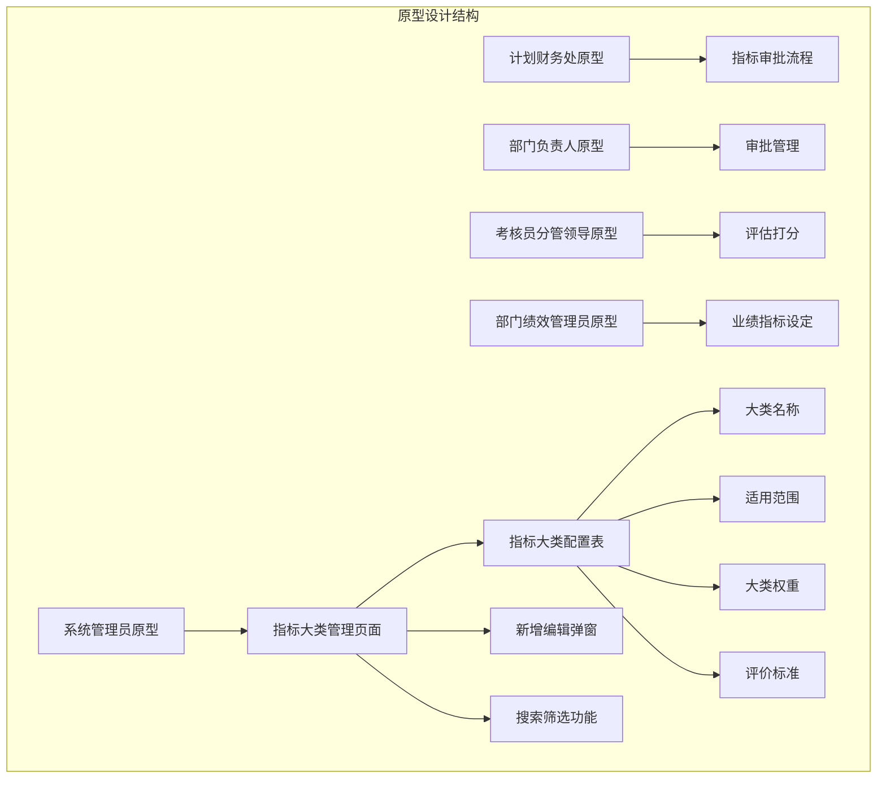
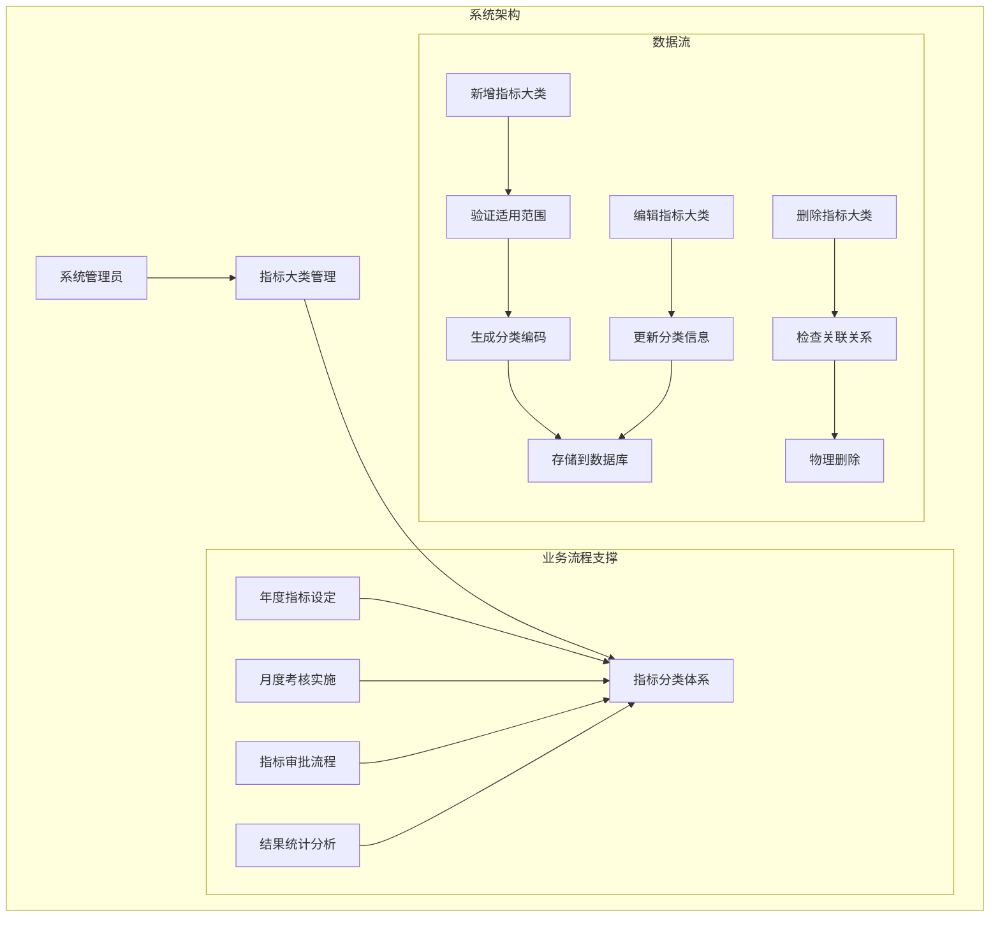
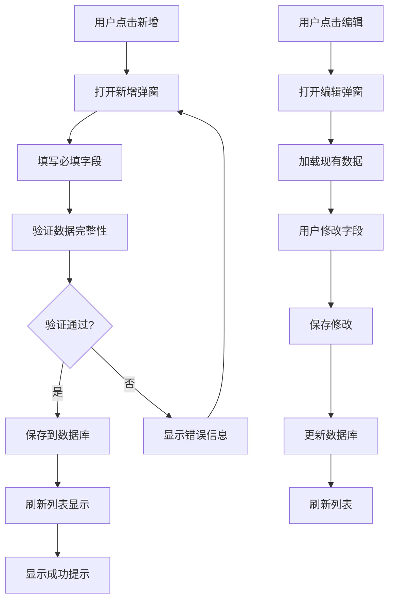
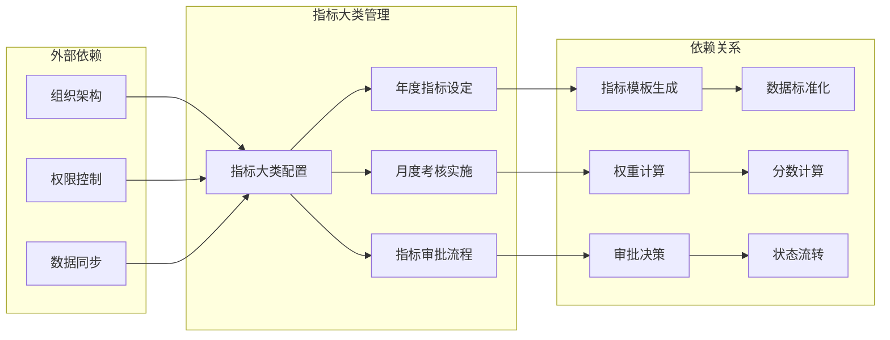

# 指标大类管理

<cite>
**本文档引用的文件**
- [系统管理员原型-v1.html](file://月度业绩考核原型设计初稿/1-系统管理员原型-v1.html)
- [时序图-v1.html](file://月度业绩考核原型设计初稿/6-时序图-v1.html)
</cite>

## 目录
1. [简介](#简介)
2. [项目结构](#项目结构)
3. [核心组件](#核心组件)
4. [架构概览](#架构概览)
5. [详细组件分析](#详细组件分析)
6. [依赖关系分析](#依赖关系分析)
7. [性能考虑](#性能考虑)
8. [故障排除指南](#故障排除指南)
9. [结论](#结论)

## 简介

指标大类管理是月度业绩考核系统的核心配置功能，负责对考核指标进行分类管理，为每月考核指标创建提供标准化的分类框架。该功能支持系统管理员对指标分类体系进行全面配置和维护，确保考核工作的规范化和标准化。

本功能主要服务于以下业务场景：
- 为年度和月度考核提供统一的指标分类标准
- 支持不同组织层级的差异化指标配置
- 提供灵活的权重设置机制
- 确保评价标准的规范性和一致性

## 项目结构

该项目采用原型设计的方式，通过HTML页面展示各个角色在系统中的功能界面。指标大类管理功能位于系统管理员角色的界面中，体现了其作为系统配置管理核心功能的重要地位。

**图表来源**
- [系统管理员原型-v1.html:448-482](file://月度业绩考核原型设计初稿/1-系统管理员原型-v1.html#L448-L482)

**章节来源**
- [系统管理员原型-v1.html:1-635](file://月度业绩考核原型设计初稿/1-系统管理员原型-v1.html#L1-L635)

## 核心组件

### 指标大类管理页面

指标大类管理页面是系统管理员进行指标分类配置的主要界面，提供了完整的CRUD操作能力：

#### 主要功能特性
- **列表展示**：以表格形式展示所有已配置的指标大类
- **搜索筛选**：支持按大类名称、排序码、启用状态进行筛选
- **新增编辑**：提供完整的指标大类新增和编辑功能
- **状态管理**：支持启用/停用状态的灵活切换

#### 数据模型结构
每个指标大类包含以下关键属性：
- **大类名称**：指标分类的标识性名称
- **大类编码**：系统内部使用的唯一标识符
- **排序码**：用于确定显示顺序的数值
- **适用范围**：定义指标适用的组织层级
- **大类权重**：可选的权重配置
- **评价标准**：详细的评分标准说明
- **启用状态**：当前的有效性状态

**章节来源**
- [系统管理员原型-v1.html:448-482](file://月度业绩考核原型设计初稿/1-系统管理员原型-v1.html#L448-L482)

### 适用范围配置

系统支持三种不同的适用范围，满足不同组织层级的指标管理需求：

#### 适用范围类型
1. **机关部门**：适用于公司本部职能部门
2. **分公司**：适用于各下属分公司
3. **公共**：适用于所有组织层级的通用指标

每种适用范围都有其特定的业务含义和使用场景，系统通过颜色标签进行直观区分。

**章节来源**
- [系统管理员原型-v1.html:466-477](file://月度业绩考核原型设计初稿/1-系统管理员原型-v1.html#L466-L477)

## 架构概览

指标大类管理功能在整个考核系统中扮演着基础设施的角色，为其他业务流程提供标准化的指标分类支撑。

**图表来源**
- [系统管理员原型-v1.html:448-482](file://月度业绩考核原型设计初稿/1-系统管理员原型-v1.html#L448-L482)
- [时序图-v1.html:112-298](file://月度业绩考核原型设计初稿/6-时序图-v1.html#L112-L298)

## 详细组件分析

### 指标大类配置表

指标大类配置表是功能的核心数据展示界面，提供了完整的指标分类信息管理和操作能力。

#### 表格列结构
| 列名 | 描述 | 显示格式 |
|------|------|----------|
| 序号 | 数据记录的递增编号 | 数字序列 |
| 大类名称 | 指标分类的名称标识 | 文本字符串 |
| 大类编码 | 系统内部的唯一标识符 | 文本字符串 |
| 排序码 | 决定显示顺序的数值 | 数字 |
| 适用范围 | 指标适用的组织层级 | 颜色标签 |
| 大类权重 | 可选的权重配置 | 数字或空白 |
| 评价标准 | 详细的评分标准说明 | 文本摘要 |
| 是否启用 | 当前的有效性状态 | 状态标签 |
| 操作 | 对记录进行管理操作 | 功能按钮 |

#### 状态标签设计
系统使用颜色编码来直观表示不同的状态：
- **蓝色标签**：适用于机关部门的指标
- **橙色标签**：适用于分公司的指标  
- **绿色标签**：适用于公共指标
- **启用状态**：使用绿色背景的标签
- **停用状态**：使用红色背景的标签

**章节来源**
- [系统管理员原型-v1.html:466-477](file://月度业绩考核原型设计初稿/1-系统管理员原型-v1.html#L466-L477)

### 新增编辑弹窗

新增编辑弹窗提供了完整的指标大类配置界面，支持用户进行详细的参数设置。

#### 弹窗表单字段
1. **大类名称**（必填）
   - 输入限制：必填项
   - 验证规则：长度限制
   - 使用场景：作为指标分类的标识

2. **大类编码**（必填）
   - 输入限制：必填项
   - 验证规则：唯一性约束
   - 使用场景：系统内部识别

3. **排序编码**
   - 输入类型：数字
   - 默认值：留空
   - 使用场景：确定显示顺序

4. **适用范围**（必填）
   - 选择选项：机关部门、分公司、公共
   - 验证规则：必选项
   - 使用场景：定义指标适用范围

5. **大类权重**
   - 输入类型：正整数
   - 输入提示：百分比格式
   - 使用场景：计算权重分配

6. **评价标准**
   - 输入类型：多行文本
   - 字符限制：不超过500字符
   - 使用场景：提供评分依据

7. **是否启用**
   - 选择选项：是/否
   - 默认值：是
   - 使用场景：控制有效性

#### 操作流程

**图表来源**
- [系统管理员原型-v1.html:590-602](file://月度业绩考核原型设计初稿/1-系统管理员原型-v1.html#L590-L602)

**章节来源**
- [系统管理员原型-v1.html:590-602](file://月度业绩考核原型设计初稿/1-系统管理员原型-v1.html#L590-L602)

### 搜索筛选功能

搜索筛选功能允许管理员根据不同的条件快速定位和查找特定的指标大类。

#### 筛选条件
1. **大类名称**：支持模糊匹配的文本搜索
2. **排序码**：精确匹配的数字搜索  
3. **是否启用**：下拉选择的状态过滤

#### 搜索策略
- **实时搜索**：输入即触发搜索
- **组合筛选**：支持多个条件的组合使用
- **结果高亮**：匹配的关键词进行视觉突出

**章节来源**
- [系统管理员原型-v1.html:456-462](file://月度业绩考核原型设计初稿/1-系统管理员原型-v1.html#L456-L462)

## 依赖关系分析

指标大类管理功能与其他系统组件存在密切的依赖关系，形成了完整的业务闭环。

**图表来源**
- [时序图-v1.html:112-298](file://月度业绩考核原型设计初稿/6-时序图-v1.html#L112-L298)

### 关键依赖点

1. **组织架构依赖**
   - 适用范围配置必须与组织架构保持一致
   - 不同层级的组织需要对应的指标分类

2. **权限控制依赖**
   - 仅系统管理员具备指标大类的配置权限
   - 其他角色只能查看和使用现有配置

3. **数据同步依赖**
   - 指标大类变更需要同步到相关业务流程
   - 确保各模块的数据一致性

**章节来源**
- [时序图-v1.html:112-298](file://月度业绩考核原型设计初稿/6-时序图-v1.html#L112-L298)

## 性能考虑

### 数据加载优化
- **分页加载**：支持大数据量的分页显示
- **懒加载**：弹窗内容按需加载
- **缓存策略**：常用配置的本地缓存

### 搜索性能
- **索引优化**：对常用搜索字段建立索引
- **防抖处理**：搜索输入的防抖机制
- **结果缓存**：热门搜索结果的缓存

### 用户体验优化
- **响应式设计**：适配不同屏幕尺寸
- **加载指示**：长时间操作的进度提示
- **错误处理**：友好的错误信息展示

## 故障排除指南

### 常见问题及解决方案

#### 1. 指标大类无法保存
**可能原因**：
- 必填字段缺失
- 编码重复冲突
- 权限不足

**解决步骤**：
1. 检查所有必填字段是否完整填写
2. 验证大类编码的唯一性
3. 确认当前用户具有系统管理员权限

#### 2. 搜索结果异常
**可能原因**：
- 搜索条件过于宽泛
- 数据库连接异常
- 缓存数据过期

**解决步骤**：
1. 缩小搜索范围，增加筛选条件
2. 刷新页面重新加载数据
3. 清除浏览器缓存后重试

#### 3. 适用范围配置错误
**可能原因**：
- 选择了错误的适用范围
- 组织架构变更未同步
- 权限配置不当

**解决步骤**：
1. 检查组织架构的最新状态
2. 验证适用范围与组织层级的匹配关系
3. 调整权限配置确保正确访问

**章节来源**
- [系统管理员原型-v1.html:456-462](file://月度业绩考核原型设计初稿/1-系统管理员原型-v1.html#L456-L462)

## 结论

指标大类管理功能作为月度业绩考核系统的基础配置模块，为整个考核体系提供了标准化的指标分类框架。通过清晰的功能划分、完善的权限控制和友好的用户界面，该功能有效支撑了考核工作的规范化和自动化。

### 主要优势
1. **标准化管理**：统一的指标分类标准，确保考核的一致性
2. **灵活配置**：支持多种适用范围和权重设置
3. **易于维护**：直观的界面设计，降低维护成本
4. **扩展性强**：模块化的架构设计，便于功能扩展

### 最佳实践建议
1. **分类体系设计**：建议采用层次化的分类结构，便于理解和使用
2. **命名规范**：制定统一的命名规则，提高系统的可读性
3. **定期审查**：建立定期审查机制，确保指标分类的时效性
4. **权限管理**：严格控制配置权限，防止误操作影响系统稳定性

该功能的成功实施将为企业的绩效管理体系提供坚实的技术支撑，提升考核工作的效率和准确性。