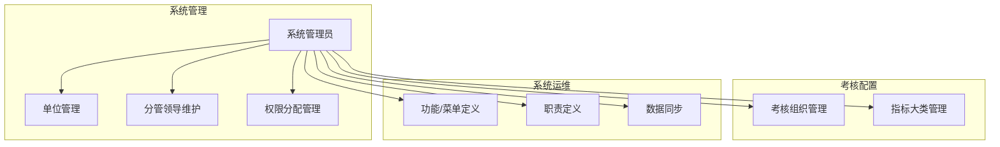
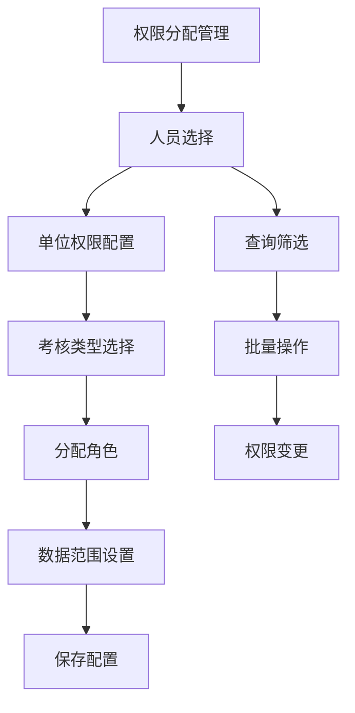
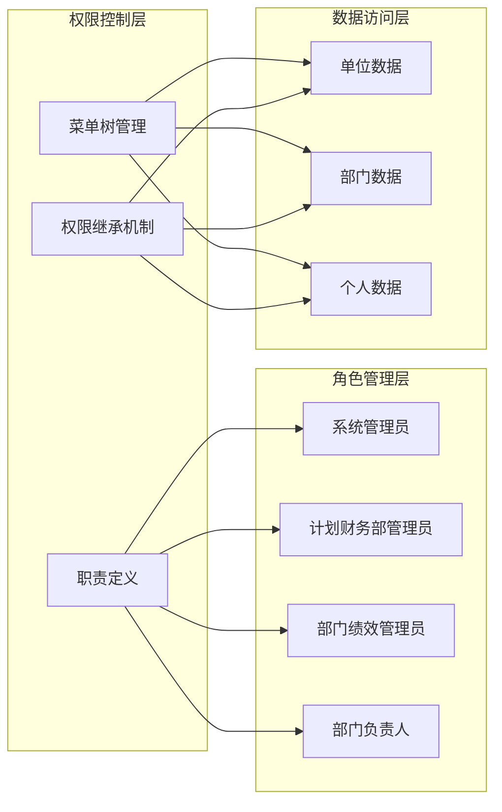
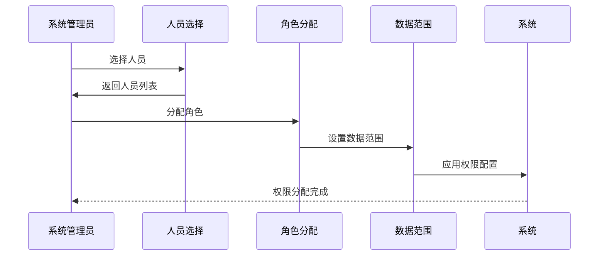
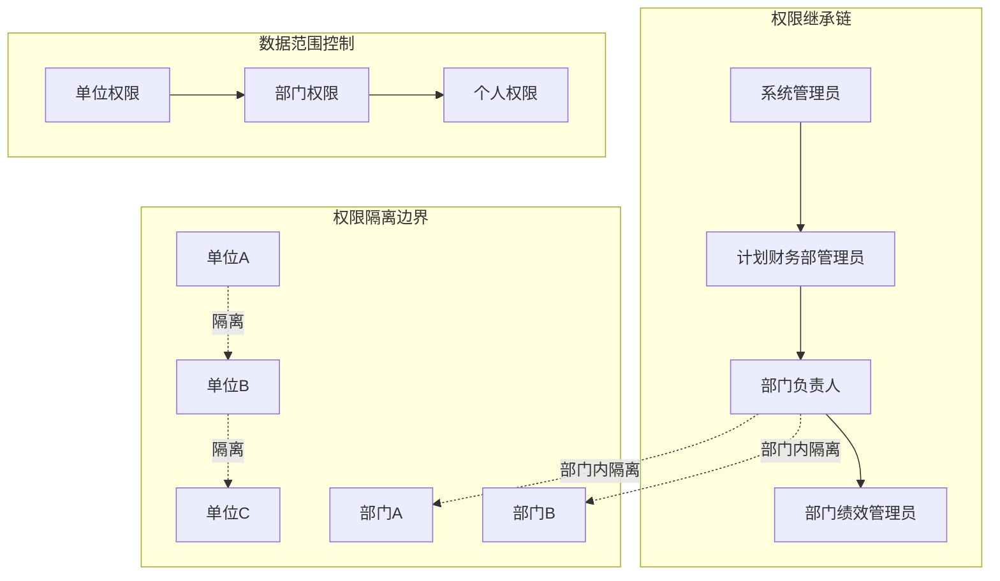
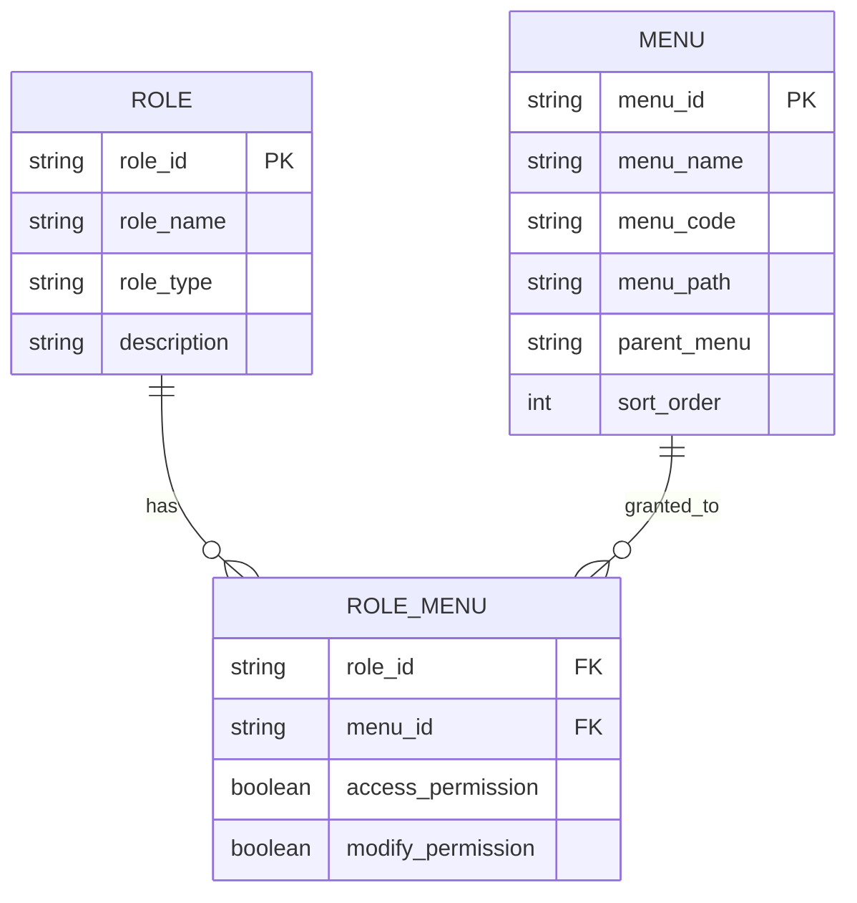
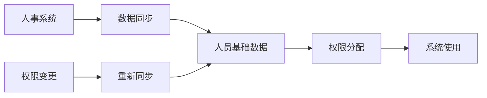

# 权限分配管理

<cite>
**本文档引用的文件**
- [系统管理员原型-v1.html](file://月度业绩考核原型设计初稿/1-系统管理员原型-v1.html)
- [计划财务处业绩考核管理员原型-v1.html](file://月度业绩考核原型设计初稿/2-计划财务处业绩考核管理员原型-v1.html)
- [部门绩效管理员原型-v1.html](file://月度业绩考核原型设计初稿/3-部门绩效管理员原型-v1.html)
- [部门负责人原型-v1.html](file://月度业绩考核原型设计初稿/4-部门负责人原型-v1.html)
- [考核员分管领导原型-v1.html](file://月度业绩考核原型设计初稿/5-考核员分管领导原型-v1.html)
- [时序图-v1.html](file://月度业绩考核原型设计初稿/6-时序图-v1.html)
</cite>

## 目录
1. [简介](#简介)
2. [项目结构](#项目结构)
3. [核心组件](#核心组件)
4. [架构概览](#架构概览)
5. [详细组件分析](#详细组件分析)
6. [依赖关系分析](#依赖关系分析)
7. [性能考虑](#性能考虑)
8. [故障排除指南](#故障排除指南)
9. [结论](#结论)
10. [附录](#附录)

## 简介

本指南面向月度业绩考核系统的权限分配管理，提供从人员选择、系统权限分配到数据范围设置的完整操作流程。系统采用三层权限控制模型：人员维度（用户身份）、系统权限维度（功能菜单访问）、数据范围维度（组织/部门数据边界）。通过职责定义和菜单树管理实现精细化权限控制，确保考核流程中各角色只能访问其职责范围内的数据和功能。

## 项目结构

系统采用基于职责的角色权限模型，主要包含以下页面模块：

**图表来源**
- [系统管理员原型-v1.html:291-316](file://月度业绩考核原型设计初稿/1-系统管理员原型-v1.html#L291-L316)

**章节来源**
- [系统管理员原型-v1.html:291-316](file://月度业绩考核原型设计初稿/1-系统管理员原型-v1.html#L291-L316)

## 核心组件

### 角色权限矩阵

系统定义了四个核心角色，每个角色具有特定的权限范围：

| 角色 | 权限范围 | 主要职责 |
|------|----------|----------|
| 系统管理员 | 全系统管理权限 | 单位管理、分管领导维护、权限分配管理、功能菜单定义、职责定义、数据同步 |
| 计划财务部(改革办公室)业绩考核管理员 | 考核总指挥 | 考核组管理、业绩指标审批、月度考核管理、复核评估、结果管理 |
| 部门绩效管理员 | 部门内部权限 | 业绩指标设定、月度考核自评、部门他评打分、申诉反馈、结果查询 |
| 部门负责人 | 直属部门权限 | 指标审批、结果查看、分管领导审批 |

### 权限分配管理界面

权限分配管理页面提供了完整的权限配置功能：

**图表来源**
- [系统管理员原型-v1.html:389-415](file://月度业绩考核原型设计初稿/1-系统管理员原型-v1.html#L389-L415)

**章节来源**
- [系统管理员原型-v1.html:389-415](file://月度业绩考核原型设计初稿/1-系统管理员原型-v1.html#L389-L415)

## 架构概览

系统采用基于职责的权限控制架构，通过职责定义和菜单树实现权限隔离：

**图表来源**
- [系统管理员原型-v1.html:521-539](file://月度业绩考核原型设计初稿/1-系统管理员原型-v1.html#L521-L539)
- [系统管理员原型-v1.html:484-519](file://月度业绩考核原型设计初稿/1-系统管理员原型-v1.html#L484-L519)

## 详细组件分析

### 权限分配流程

权限分配遵循"先人员、后权限、再范围"的三步法：

#### 步骤1：人员选择
- 支持按姓名、角色、单位等条件查询
- 可选择多个人员进行批量权限分配
- 集成数据同步功能，确保人员信息实时更新

#### 步骤2：系统权限分配
- 基于职责定义的菜单权限
- 支持功能菜单的细粒度控制
- 实现权限继承和隔离机制

#### 步骤3：数据范围配置
- 单位权限：全单位/指定单位
- 部门权限：全部部门/指定部门
- 考核类型：月度绩效考核/专业管理考核

**图表来源**
- [系统管理员原型-v1.html:608-610](file://月度业绩考核原型设计初稿/1-系统管理员原型-v1.html#L608-L610)

**章节来源**
- [系统管理员原型-v1.html:608-610](file://月度业绩考核原型设计初稿/1-系统管理员原型-v1.html#L608-L610)

### 角色权限差异

#### 系统管理员权限
- 完全的系统管理权限
- 可管理所有单位和部门
- 拥有最高级别的数据访问权

#### 计划财务部管理员权限
- 考核流程的总协调者
- 可审批各部门提交的指标
- 管理整个考核流程的进度

#### 部门绩效管理员权限
- 仅限本部门的数据和功能
- 负责本部门的指标设定和自评
- 无法访问其他部门的数据

#### 部门负责人权限
- 直属部门的审批权
- 查看本部门的考核结果
- 对下级部门进行监督

**章节来源**
- [计划财务处业绩考核管理员原型-v1.html:324-344](file://月度业绩考核原型设计初稿/2-计划财务处业绩考核管理员原型-v1.html#L324-L344)
- [部门绩效管理员原型-v1.html:411-430](file://月度业绩考核原型设计初稿/3-部门绩效管理员原型-v1.html#L411-L430)
- [部门负责人原型-v1.html:350-366](file://月度业绩考核原型设计初稿/4-部门负责人原型-v1.html#L350-L366)

### 权限继承和隔离机制

系统实现了严格的权限继承和隔离机制：

**图表来源**
- [系统管理员原型-v1.html:521-539](file://月度业绩考核原型设计初稿/1-系统管理员原型-v1.html#L521-L539)

**章节来源**
- [系统管理员原型-v1.html:521-539](file://月度业绩考核原型设计初稿/1-系统管理员原型-v1.html#L521-L539)

## 依赖关系分析

### 职责与菜单的映射关系

系统通过职责定义实现菜单权限的精确控制：

**图表来源**
- [系统管理员原型-v1.html:484-519](file://月度业绩考核原型设计初稿/1-系统管理员原型-v1.html#L484-L519)
- [系统管理员原型-v1.html:521-539](file://月度业绩考核原型设计初稿/1-系统管理员原型-v1.html#L521-L539)

### 数据同步依赖

权限管理依赖于数据同步功能确保人员信息的准确性：

**图表来源**
- [系统管理员原型-v1.html:541-559](file://月度业绩考核原型设计初稿/1-系统管理员原型-v1.html#L541-L559)

**章节来源**
- [系统管理员原型-v1.html:541-559](file://月度业绩考核原型设计初稿/1-系统管理员原型-v1.html#L541-L559)

## 性能考虑

### 权限查询优化

系统采用多级缓存策略：
- 职责定义缓存：减少频繁的职责查询
- 菜单权限缓存：避免重复的权限验证
- 用户会话缓存：存储用户的权限快照

### 批量操作性能

- 支持批量权限分配，减少数据库交互次数
- 异步数据同步，避免阻塞主业务流程
- 权限变更采用增量更新，降低系统负载

## 故障排除指南

### 常见权限问题

#### 问题1：用户无法登录系统
**可能原因**：
- 人员信息未同步到权限系统
- 角色配置错误
- 数据范围设置不当

**解决步骤**：
1. 检查数据同步状态
2. 验证用户角色配置
3. 确认数据范围设置

#### 问题2：用户看到不应该看到的数据
**可能原因**：
- 权限继承链中断
- 数据范围配置错误
- 缓存数据过期

**解决步骤**：
1. 检查职责定义
2. 验证菜单权限配置
3. 清除权限缓存

**章节来源**
- [系统管理员原型-v1.html:541-559](file://月度业绩考核原型设计初稿/1-系统管理员原型-v1.html#L541-L559)

### 权限审计

系统提供完整的权限审计功能：
- 操作日志记录
- 权限变更追踪
- 异常访问监控

## 结论

月度业绩考核系统的权限分配管理通过职责驱动的权限模型，实现了精细化的权限控制。系统不仅支持传统的基于角色的访问控制，还引入了数据范围控制和权限继承机制，确保了考核流程中各角色的权限隔离和数据安全。

通过规范化的权限分配流程和完善的审计机制，系统能够有效防止权限滥用，保障考核数据的准确性和安全性。建议在实施过程中重点关注权限分配的及时性、数据范围配置的准确性，以及权限变更的可追溯性。

## 附录

### 权限分配最佳实践

1. **最小权限原则**：为每个角色分配完成工作所需的最小权限
2. **定期审查**：定期审查权限配置，清理不再需要的权限
3. **变更控制**：建立权限变更的审批流程
4. **审计跟踪**：保持完整的权限操作日志

### 安全要求

- 所有权限变更必须经过审批
- 定期进行权限安全审计
- 建立权限异常告警机制
- 确保数据传输和存储的安全性