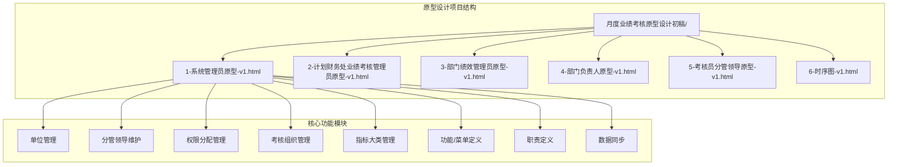
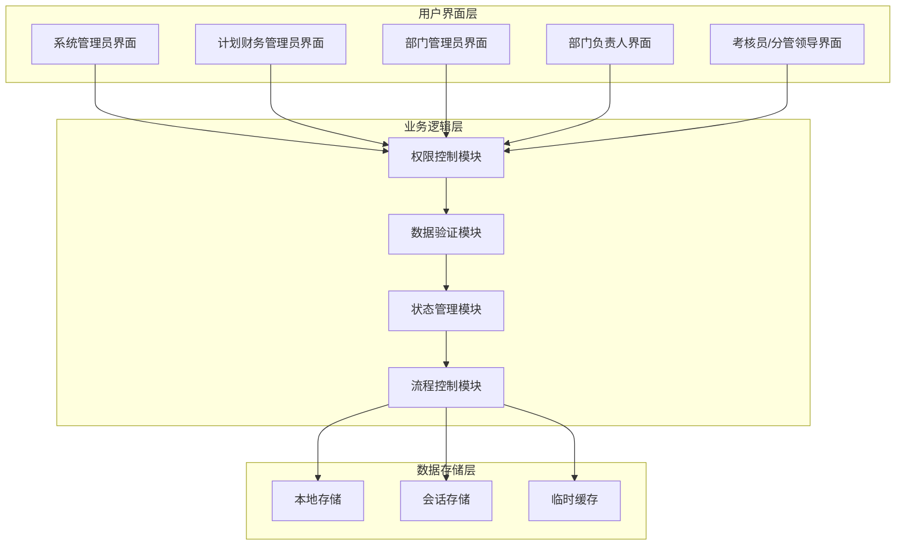
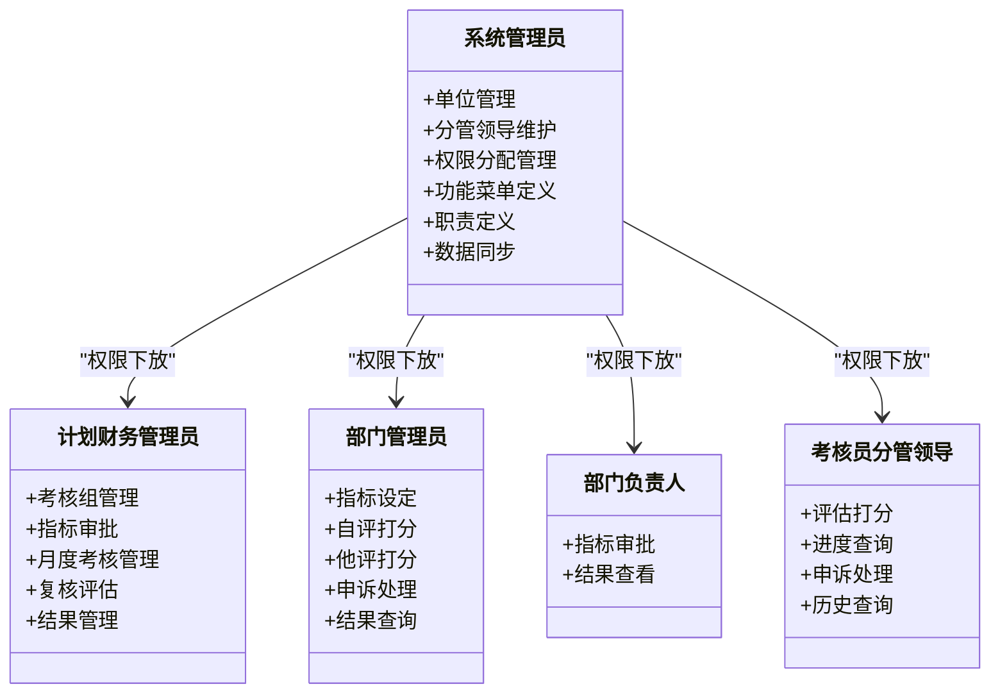
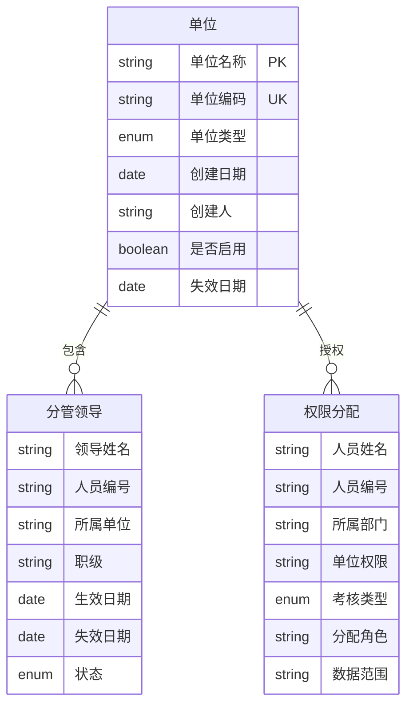
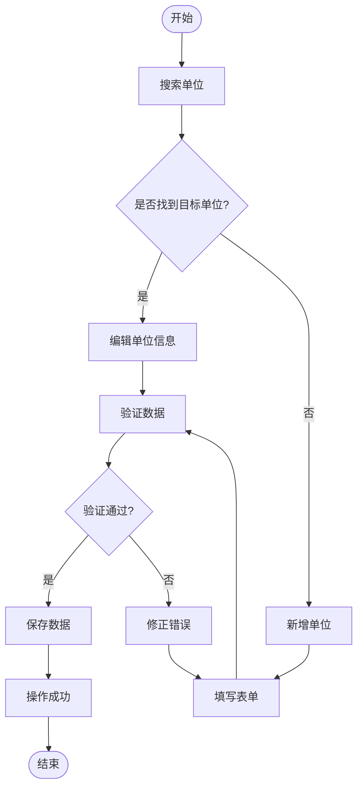
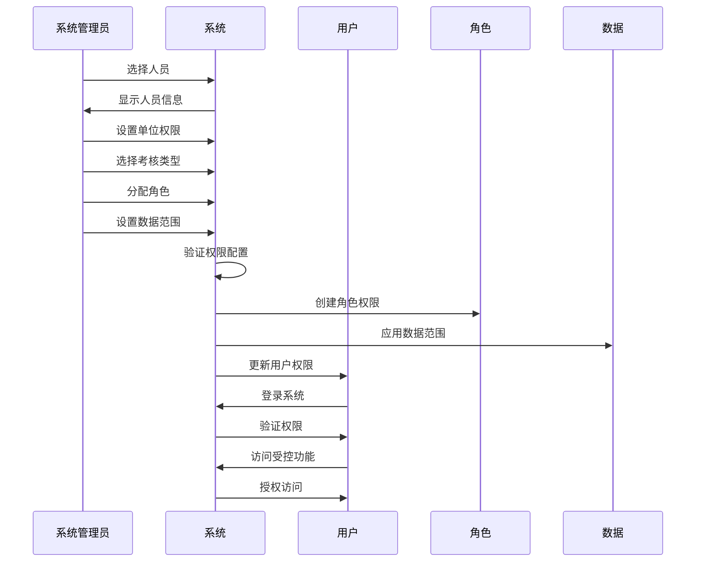
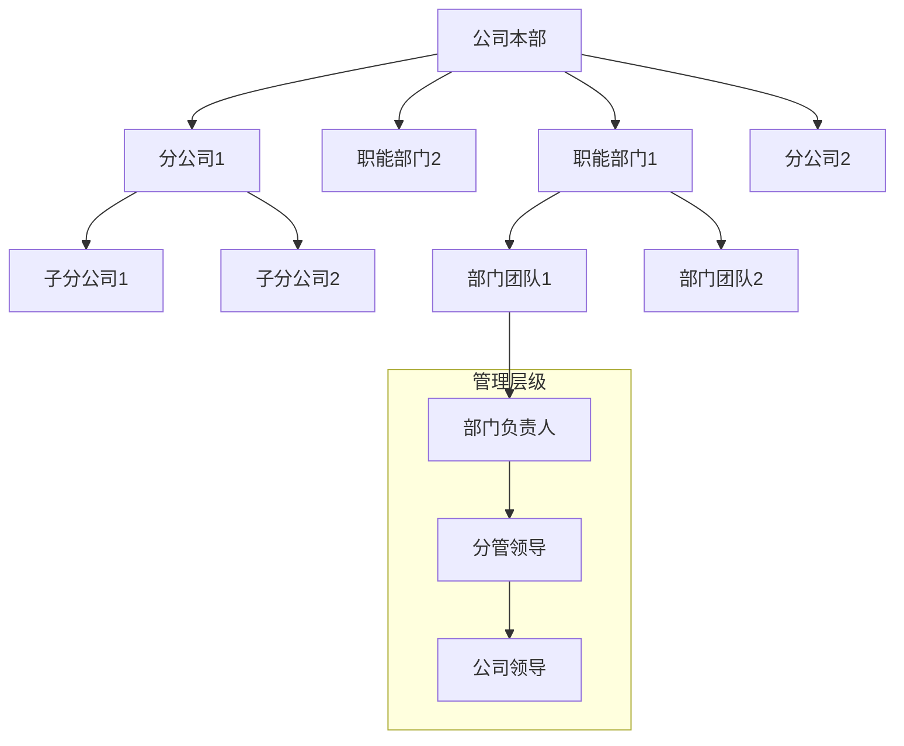
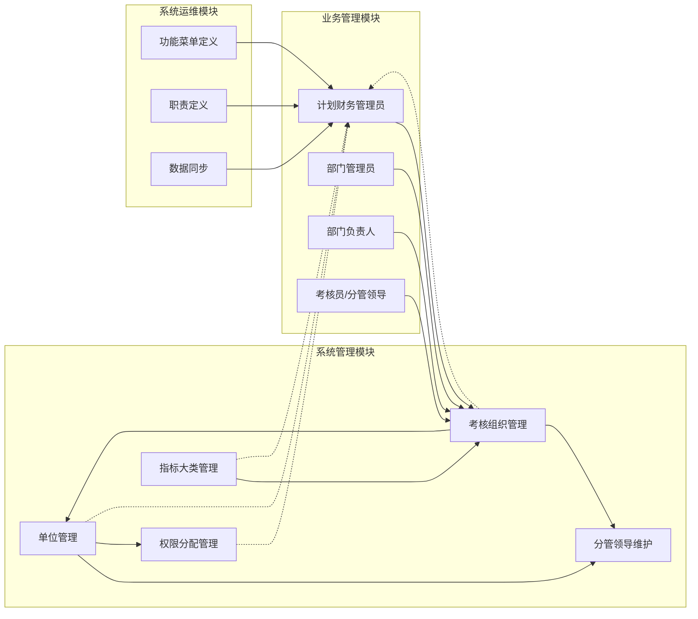
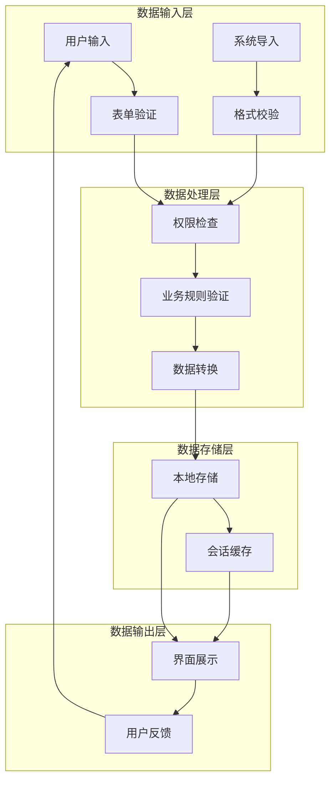

# 系统管理员指南

<cite>
**本文档引用的文件**
- [系统管理员原型-v1.html](file://月度业绩考核原型设计初稿/1-系统管理员原型-v1.html)
- [计划财务处业绩考核管理员原型-v1.html](file://月度业绩考核原型设计初稿/2-计划财务处业绩考核管理员原型-v1.html)
- [部门绩效管理员原型-v1.html](file://月度业绩考核原型设计初稿/3-部门绩效管理员原型-v1.html)
- [部门负责人原型-v1.html](file://月度业绩考核原型设计初稿/4-部门负责人原型-v1.html)
- [考核员分管领导原型-v1.html](file://月度业绩考核原型设计初稿/5-考核员分管领导原型-v1.html)
- [时序图-v1.html](file://月度业绩考核原型设计初稿/6-时序图-v1.html)
</cite>

## 目录
1. [简介](#简介)
2. [项目结构](#项目结构)
3. [核心功能模块](#核心功能模块)
4. [架构概览](#架构概览)
5. [详细组件分析](#详细组件分析)
6. [依赖关系分析](#依赖关系分析)
7. [性能考虑](#性能考虑)
8. [故障排除指南](#故障排除指南)
9. [结论](#结论)
10. [附录](#附录)

## 简介

本指南面向系统管理员，提供月度业绩考核管理系统的完整使用说明。该系统采用原型设计形式，涵盖单位管理、分管领导维护、权限分配管理、考核组织管理、指标大类管理等核心功能模块。系统通过清晰的界面布局和交互流程，支持多角色协同工作，包括计划财务部业绩考核管理员、部门绩效管理员、部门负责人、考核员/分管领导等。

系统采用现代化的前端技术栈，提供多种主题风格切换，支持响应式设计，确保在不同设备上的良好用户体验。所有功能均基于HTML/CSS/JavaScript实现，无需复杂的后端配置即可运行。

## 项目结构

项目采用模块化的原型设计结构，每个功能模块都有独立的HTML文件，便于维护和扩展：

**图表来源**
- [系统管理员原型-v1.html:1-635](file://月度业绩考核原型设计初稿/1-系统管理员原型-v1.html#L1-L635)

**章节来源**
- [系统管理员原型-v1.html:1-635](file://月度业绩考核原型设计初稿/1-系统管理员原型-v1.html#L1-L635)

## 核心功能模块

### 单位管理模块

单位管理模块负责管理参与考核的单位信息，实现按单位的权限控制和数据隔离。

#### 主要功能特性
- **单位信息维护**：支持新增、编辑、删除单位信息
- **单位类型管理**：区分公司、分公司等不同类型
- **启用状态控制**：灵活控制单位的启用和停用状态
- **搜索过滤**：支持按名称、类型、状态进行精确查找

#### 操作流程
1. 进入单位管理页面
2. 使用搜索条件筛选目标单位
3. 点击"新增单位"按钮打开编辑窗口
4. 填写单位基本信息（名称、编码、类型、状态）
5. 点击"保存"完成创建

#### 参数配置
- **单位名称**：必填，唯一标识符
- **单位编码**：必填，系统内部识别码
- **单位类型**：下拉选择，支持公司、分公司、其他
- **是否启用**：布尔值，默认启用

**章节来源**
- [系统管理员原型-v1.html:330-359](file://月度业绩考核原型设计初稿/1-系统管理员原型-v1.html#L330-L359)

### 分管领导维护模块

分管领导维护模块用于配置各单位分管领导名单，确保数据选择的准确性和一致性。

#### 核心功能
- **领导信息管理**：维护分管领导的基本信息和任职状态
- **所属单位关联**：建立领导与单位的对应关系
- **生效期管理**：支持设置领导的生效和失效日期
- **批量查询**：支持按单位和姓名进行组合查询

#### 操作步骤
1. 打开分管领导维护页面
2. 选择所属单位和输入领导姓名
3. 点击"新增分管领导"按钮
4. 填写领导信息（姓名、编号、职级、日期）
5. 保存配置并验证生效

**章节来源**
- [系统管理员原型-v1.html:362-387](file://月度业绩考核原型设计初稿/1-系统管理员原型-v1.html#L362-L387)

### 权限分配管理模块

权限分配管理模块实现对考核系统进行权限下放与隔离，确保数据访问的安全性。

#### 权限控制机制
- **角色分离**：区分系统管理员、部门管理员、普通用户
- **数据范围控制**：限制用户只能访问授权的数据
- **操作权限管理**：控制用户可执行的功能操作
- **实时生效**：权限变更立即生效，无需重启服务

#### 分配流程
1. 选择需要分配权限的人员
2. 设置单位权限范围
3. 选择考核类型（月度/专业管理）
4. 分配具体角色和数据范围
5. 确认保存并通知相关人员

**章节来源**
- [系统管理员原型-v1.html:390-415](file://月度业绩考核原型设计初稿/1-系统管理员原型-v1.html#L390-L415)

### 考核组织管理模块

考核组织管理模块负责管理考核组织的配置和管理员设置。

#### 组织配置
- **组织层级管理**：支持职能部门、分公司等多层级组织
- **管理员配置**：为每个组织分配专门的管理员
- **负责人管理**：设置组织负责人和分管领导
- **排序编码**：支持自定义组织排序规则

#### 管理员职责
- **计划财务部**：总体协调和监督
- **部门绩效管理员**：具体执行和维护
- **部门负责人**：审核和确认
- **分管领导**：最终审批和把关

**章节来源**
- [系统管理员原型-v1.html:418-446](file://月度业绩考核原型设计初稿/1-系统管理员原型-v1.html#L418-L446)

### 指标大类管理模块

指标大类管理模块对考核指标进行分类管理，提高指标创建的效率和准确性。

#### 分类体系
- **生产经营类指标**：适用于分公司的生产运营指标
- **重点工作**：核心业务工作的关键指标
- **基础工作**：日常管理的基础性指标
- **公共指标**：适用于所有组织的通用指标

#### 管理功能
- **权重设置**：支持设置各类别的权重比例
- **适用范围**：限定指标的适用组织类型
- **评价标准**：提供标准化的评价参考
- **启用控制**：灵活控制指标的启用状态

**章节来源**
- [系统管理员原型-v1.html:449-482](file://月度业绩考核原型设计初稿/1-系统管理员原型-v1.html#L449-L482)

### 系统运维模块

系统运维模块包含功能菜单定义、职责定义和数据同步等系统维护功能。

#### 功能菜单定义
- **菜单树结构**：可视化管理菜单层级关系
- **权限绑定**：将菜单与角色权限关联
- **排序管理**：支持菜单的拖拽排序
- **实时更新**：菜单变更即时反映到系统

#### 职责定义
- **职责类型**：按模块划分不同的职责类型
- **职责分配**：为角色分配相应的职责
- **菜单包含**：明确职责对应的菜单权限
- **描述说明**：提供职责的详细说明文档

#### 数据同步
- **自动同步**：定期从人事系统同步人员数据
- **手动触发**：支持管理员手动触发同步
- **同步记录**：详细记录每次同步的结果
- **异常处理**：提供同步失败的处理机制

**章节来源**
- [系统管理员原型-v1.html:485-560](file://月度业绩考核原型设计初稿/1-系统管理员原型-v1.html#L485-L560)

## 架构概览

系统采用前后端分离的架构设计，所有逻辑都在前端实现，通过HTML、CSS、JavaScript构建完整的用户界面。

**图表来源**
- [系统管理员原型-v1.html:281-635](file://月度业绩考核原型设计初稿/1-系统管理员原型-v1.html#L281-L635)

### 角色权限架构

系统通过角色权限矩阵实现细粒度的权限控制：

**图表来源**
- [系统管理员原型-v1.html:297-316](file://月度业绩考核原型设计初稿/1-系统管理员原型-v1.html#L297-L316)

## 详细组件分析

### 单位管理组件

单位管理组件提供完整的单位信息管理功能，支持CRUD操作和批量处理。

#### 数据模型

**图表来源**
- [系统管理员原型-v1.html:330-415](file://月度业绩考核原型设计初稿/1-系统管理员原型-v1.html#L330-L415)

#### 操作流程图

**图表来源**
- [系统管理员原型-v1.html:330-359](file://月度业绩考核原型设计初稿/1-系统管理员原型-v1.html#L330-L359)

**章节来源**
- [系统管理员原型-v1.html:330-359](file://月度业绩考核原型设计初稿/1-系统管理员原型-v1.html#L330-L359)

### 权限分配组件

权限分配组件实现精细化的权限控制，确保数据安全和操作合规。

#### 权限分配流程

**图表来源**
- [系统管理员原型-v1.html:390-415](file://月度业绩考核原型设计初稿/1-系统管理员原型-v1.html#L390-L415)

#### 权限验证机制
系统采用多层次的权限验证机制：
1. **登录验证**：验证用户身份和基本权限
2. **功能验证**：检查用户是否有访问特定功能的权限
3. **数据验证**：确保用户只能访问授权的数据范围
4. **操作验证**：验证用户是否有执行特定操作的权限

**章节来源**
- [系统管理员原型-v1.html:390-415](file://月度业绩考核原型设计初稿/1-系统管理员原型-v1.html#L390-L415)

### 考核组织管理组件

考核组织管理组件提供组织层级的管理功能，支持复杂的组织架构配置。

#### 组织层级结构

**图表来源**
- [系统管理员原型-v1.html:418-446](file://月度业绩考核原型设计初稿/1-系统管理员原型-v1.html#L418-L446)

**章节来源**
- [系统管理员原型-v1.html:418-446](file://月度业绩考核原型设计初稿/1-系统管理员原型-v1.html#L418-L446)

## 依赖关系分析

系统各模块之间存在明确的依赖关系和数据流转：

**图表来源**
- [系统管理员原型-v1.html:297-316](file://月度业绩考核原型设计初稿/1-系统管理员原型-v1.html#L297-L316)

### 数据流分析

系统中的数据流遵循严格的控制原则：

**图表来源**
- [系统管理员原型-v1.html:612-632](file://月度业绩考核原型设计初稿/1-系统管理员原型-v1.html#L612-L632)

## 性能考虑

### 前端性能优化

系统采用轻量级的前端架构，注重性能和用户体验：

#### 加载优化
- **懒加载机制**：页面按需加载，减少初始加载时间
- **资源压缩**：CSS和JavaScript文件经过压缩处理
- **缓存策略**：合理利用浏览器缓存机制
- **异步加载**：重要资源采用异步加载方式

#### 交互优化
- **虚拟滚动**：大数据量表格采用虚拟滚动技术
- **防抖处理**：搜索和筛选操作加入防抖机制
- **增量更新**：界面更新采用增量渲染方式
- **离线支持**：支持离线状态下的基本功能

### 内存管理

系统采用高效的内存管理策略：
- **对象池**：重复使用的对象进行池化管理
- **垃圾回收**：及时释放不再使用的对象引用
- **内存监控**：监控内存使用情况，防止内存泄漏
- **分页加载**：大数据集采用分页加载方式

## 故障排除指南

### 常见问题及解决方案

#### 权限相关问题
**问题**：用户无法访问某些功能
- **检查**：确认用户的权限分配是否正确
- **验证**：检查角色对应的菜单权限设置
- **修复**：重新分配正确的权限组合

**问题**：数据访问范围不正确
- **检查**：验证用户的数据范围设置
- **验证**：确认组织层级关系配置
- **修复**：调整数据范围或组织关系

#### 界面显示问题
**问题**：页面布局错乱
- **检查**：确认浏览器兼容性
- **验证**：检查CSS样式文件加载
- **修复**：清理浏览器缓存后重试

**问题**：表格数据显示异常
- **检查**：验证数据源连接状态
- **验证**：确认数据格式正确性
- **修复**：重新加载数据或刷新页面

#### 功能操作问题
**问题**：保存操作失败
- **检查**：确认必填字段是否完整
- **验证**：检查数据格式和范围
- **修复**：修正错误后重新提交

**问题**：搜索功能无结果
- **检查**：确认搜索条件是否过于严格
- **验证**：尝试简化搜索条件
- **修复**：调整搜索参数或重置筛选

### 调试工具使用

系统内置了调试工具和日志功能：

#### 调试模式
- **控制台输出**：提供详细的错误信息和警告
- **状态监控**：显示当前系统状态和用户权限
- **网络监控**：跟踪数据请求和响应情况
- **性能分析**：提供性能指标和优化建议

#### 日志管理
- **操作日志**：记录所有重要的用户操作
- **错误日志**：收集系统运行时的错误信息
- **性能日志**：监控系统性能指标变化
- **审计日志**：提供完整的操作审计记录

**章节来源**
- [系统管理员原型-v1.html:612-632](file://月度业绩考核原型设计初稿/1-系统管理员原型-v1.html#L612-L632)

## 结论

本系统管理员指南提供了月度业绩考核管理系统的完整使用说明。系统通过模块化的功能设计、清晰的权限控制机制和直观的用户界面，实现了高效的组织管理目标。

### 系统优势

1. **功能完整性**：涵盖考核管理的各个环节，满足企业级需求
2. **权限安全**：提供细粒度的权限控制，确保数据安全
3. **用户体验**：采用现代化的设计理念，提供良好的交互体验
4. **扩展性强**：模块化设计便于功能扩展和定制开发

### 最佳实践建议

1. **权限管理**：定期审查和更新权限配置，确保最小权限原则
2. **数据维护**：及时更新组织架构和人员信息，保持数据准确性
3. **流程规范**：严格按照既定流程执行各项操作，确保工作质量
4. **备份策略**：定期备份重要数据，防止意外丢失

### 未来发展方向

系统具备良好的扩展基础，可以进一步完善以下功能：
- 集成更多的人力资源系统接口
- 增强移动端支持能力
- 优化大数据量处理性能
- 扩展报表和分析功能

## 附录

### 快速操作指南

#### 系统初始化
1. 登录系统后台
2. 配置基础单位信息
3. 设置分管领导名单
4. 分配初始权限
5. 配置功能菜单

#### 日常维护
1. 定期检查系统运行状态
2. 监控权限变更记录
3. 处理用户反馈和问题
4. 备份重要数据
5. 更新系统版本

#### 常用快捷键
- **Ctrl+S**：保存当前操作
- **Ctrl+R**：刷新页面
- **Esc**：关闭弹窗
- **Enter**：确认操作

### 支持联系方式

如遇系统使用问题，请联系：
- **技术支持**：技术支持邮箱或电话
- **系统维护**：系统维护负责人
- **功能咨询**：业务咨询部门