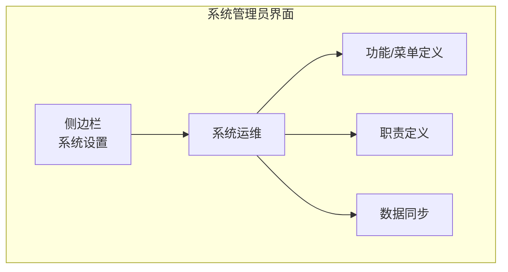
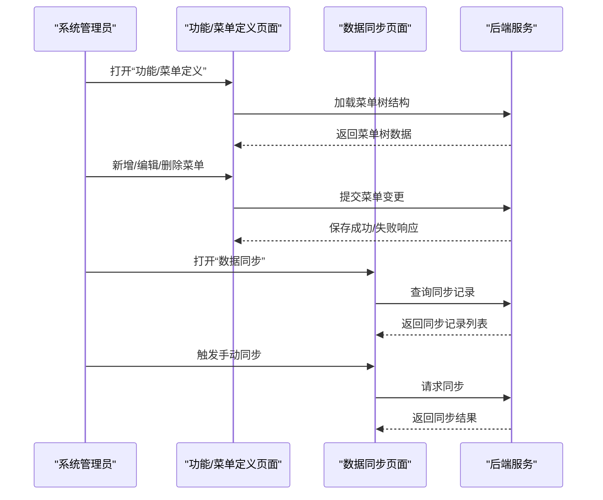
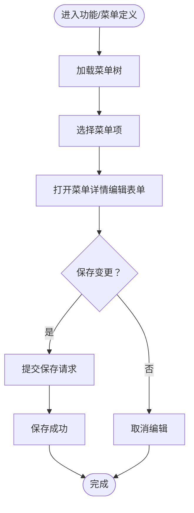
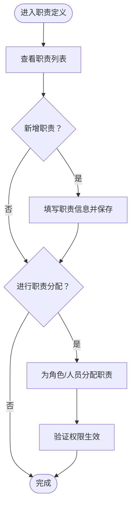
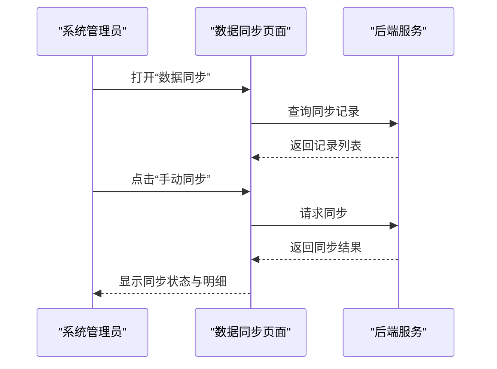
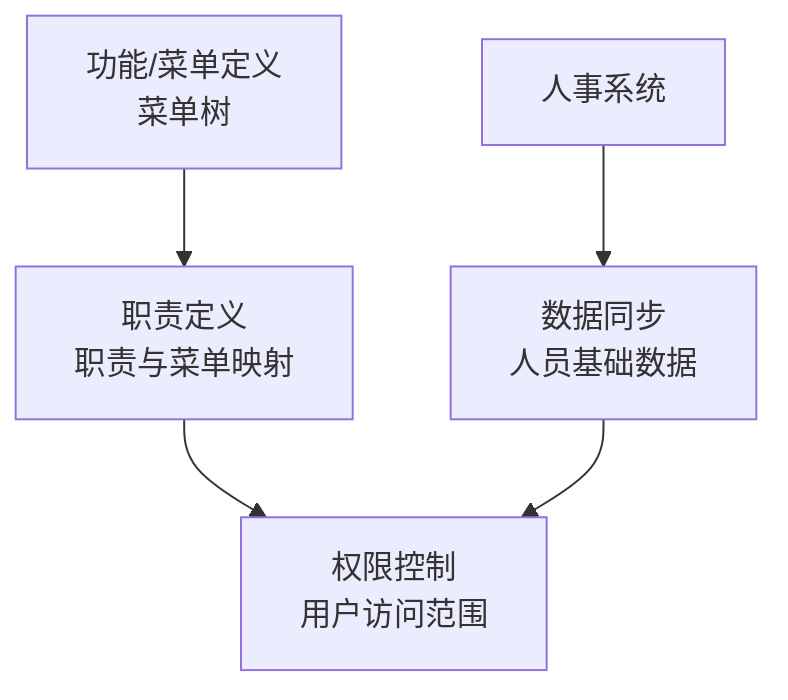

# 系统运维功能

<cite>
**本文档引用的文件**
- [系统管理员原型-v1.html](file://月度业绩考核原型设计初稿/1-系统管理员原型-v1.html)
- [时序图-v1.html](file://月度业绩考核原型设计初稿/6-时序图-v1.html)
</cite>

## 目录
1. [引言](#引言)
2. [项目结构](#项目结构)
3. [核心组件](#核心组件)
4. [架构概览](#架构概览)
5. [详细组件分析](#详细组件分析)
6. [依赖分析](#依赖分析)
7. [性能考虑](#性能考虑)
8. [故障排除指南](#故障排除指南)
9. [结论](#结论)

## 引言
本指南面向系统运维人员，围绕“系统运维”模块提供完整操作说明，涵盖功能/菜单定义、职责定义、数据同步等关键能力，并结合原型页面的交互逻辑，给出菜单树维护、职责类型创建与职责分配管理、手动与自动数据同步配置、系统运维监控与日志管理的重要意义，以及系统维护最佳实践与故障排除建议。

## 项目结构
本仓库包含多套角色原型页面，其中“系统管理员”原型页面集中体现了系统运维相关功能入口与界面布局。系统运维模块位于侧边栏“系统设置”下的“系统运维”分组，包含以下三个子页面：
- 功能/菜单定义
- 职责定义
- 数据同步

图表来源
- [系统管理员原型-v1.html:297-316](file://月度业绩考核原型设计初稿/1-系统管理员原型-v1.html#L297-L316)

章节来源
- [系统管理员原型-v1.html:297-316](file://月度业绩考核原型设计初稿/1-系统管理员原型-v1.html#L297-L316)

## 核心组件
- 功能/菜单定义：用于定义系统功能菜单树结构，支持菜单的新增、编辑、删除与层级维护。
- 职责定义：用于定义职责类型（按模块）及职责分配，支撑权限与操作范围的精细化控制。
- 数据同步：用于从人事系统同步人员基础数据，支持手动触发与自动同步记录查看。

章节来源
- [系统管理员原型-v1.html:484-559](file://月度业绩考核原型设计初稿/1-系统管理员原型-v1.html#L484-L559)

## 架构概览
系统运维功能在前端通过页面切换与表单交互实现，后端接口负责数据持久化与业务处理。整体交互流程如下：

图表来源
- [系统管理员原型-v1.html:484-559](file://月度业绩考核原型设计初稿/1-系统管理员原型-v1.html#L484-L559)

## 详细组件分析

### 功能/菜单定义
功能/菜单定义用于维护系统的功能菜单树，支持对菜单的新增、编辑、删除与层级关系调整。页面包含菜单树展示区与菜单详情编辑区，用户可选择某菜单后在右侧编辑其名称、编码、路径、排序等属性，并保存。

- 菜单树结构维护
  - 展示系统功能分组与具体菜单项，支持展开/折叠。
  - 支持选择菜单项进行编辑。
- 菜单属性编辑
  - 菜单名称、菜单编码、菜单路径、排序等字段。
  - 保存按钮用于提交变更；取消按钮用于撤销当前编辑。
- 菜单操作
  - 新增：在指定分组下新增菜单节点。
  - 编辑：修改现有菜单的属性。
  - 删除：移除不再使用的菜单节点（需谨慎操作）。

图表来源
- [系统管理员原型-v1.html:484-519](file://月度业绩考核原型设计初稿/1-系统管理员原型-v1.html#L484-L519)

章节来源
- [系统管理员原型-v1.html:484-519](file://月度业绩考核原型设计初稿/1-系统管理员原型-v1.html#L484-L519)

### 职责定义
职责定义用于定义系统职责类型（按模块）以及职责分配，支撑不同角色在系统中的权限边界与操作范围。

- 职责列表
  - 展示职责名称、职责编码、所属模块、包含菜单、描述等字段。
  - 支持对职责进行编辑与分配。
- 职责类型创建
  - 新增职责：填写职责名称、编码、所属模块、包含菜单、描述等信息。
  - 编辑职责：修改职责属性与包含菜单集合。
- 职责分配管理
  - 对职责进行分配：为特定角色或人员授予相应职责，使其具备对应的菜单访问与操作权限。
  - 分配后需验证权限生效情况，确保职责与菜单映射正确。

图表来源
- [系统管理员原型-v1.html:521-539](file://月度业绩考核原型设计初稿/1-系统管理员原型-v1.html#L521-L539)

章节来源
- [系统管理员原型-v1.html:521-539](file://月度业绩考核原型设计初稿/1-系统管理员原型-v1.html#L521-L539)

### 数据同步
数据同步用于从人事系统同步人员基础数据（ID、姓名、编号、部门、岗位、职级），保障系统内用户信息与主数据一致。

- 同步记录
  - 展示同步时间、同步类型（自动/手动）、同步条数、新增/更新/失败数量、状态等字段。
  - 支持查看同步明细。
- 手动同步
  - 在“数据同步”页面点击“手动同步”，触发一次即时同步。
  - 同步完成后刷新记录列表，查看最新状态与结果。
- 自动同步配置
  - 页面未直接展示自动同步配置入口，通常由系统后台或运维平台统一配置调度策略（如定时任务、触发条件等）。
  - 运维人员可通过查看“同步记录”中的“自动同步”条目，确认自动同步是否正常执行。

图表来源
- [系统管理员原型-v1.html:541-559](file://月度业绩考核原型设计初稿/1-系统管理员原型-v1.html#L541-L559)

章节来源
- [系统管理员原型-v1.html:541-559](file://月度业绩考核原型设计初稿/1-系统管理员原型-v1.html#L541-L559)

## 依赖分析
- 菜单树与职责的耦合
  - 职责定义中的“包含菜单”字段与功能/菜单定义的菜单树结构紧密关联。职责分配的有效性取决于菜单树是否完整、准确。
- 职责与权限的耦合
  - 职责分配直接影响用户可访问的菜单与操作范围，需与权限体系协同维护。
- 数据同步与用户信息
  - 数据同步结果影响用户登录、权限校验与业务流程（如考核流程中的人员选择与审批链）。

图表来源
- [系统管理员原型-v1.html:484-559](file://月度业绩考核原型设计初稿/1-系统管理员原型-v1.html#L484-L559)

章节来源
- [系统管理员原型-v1.html:484-559](file://月度业绩考核原型设计初稿/1-系统管理员原型-v1.html#L484-L559)

## 性能考虑
- 菜单树加载优化
  - 对于大型系统，建议采用懒加载或分页加载菜单树，减少首屏渲染压力。
- 职责分配批量操作
  - 对大量用户的职责分配，建议使用批量导入/导出与异步处理，避免阻塞界面。
- 数据同步性能
  - 手动同步建议限制单次同步的数据量，避免长时间占用资源；自动同步应设置合理的间隔与并发策略，防止对主数据源造成压力。

## 故障排除指南
- 菜单树维护问题
  - 症状：菜单树无法展开/保存失败。
  - 排查：检查菜单层级是否过深、是否存在重复编码、网络连接是否稳定。
  - 处理：简化层级、修正编码冲突、重试保存。
- 职责分配异常
  - 症状：用户登录后无法看到预期菜单或执行受限。
  - 排查：确认职责是否正确分配、职责包含的菜单是否已启用、菜单树是否完整。
  - 处理：重新分配职责、启用相关菜单、修复菜单树。
- 数据同步失败
  - 症状：手动同步提示失败或同步记录中“失败”数量大于0。
  - 排查：查看同步明细、检查主数据源连通性、确认同步参数配置。
  - 处理：修复主数据源问题、调整同步参数、重新触发同步。
- 自动同步未执行
  - 症状：无新的“自动同步”记录。
  - 排查：确认自动同步任务是否配置、系统时间与时区设置是否正确。
  - 处理：检查并修复自动同步配置、校准系统时间与时区。

章节来源
- [系统管理员原型-v1.html:541-559](file://月度业绩考核原型设计初稿/1-系统管理员原型-v1.html#L541-L559)

## 结论
系统运维功能通过“功能/菜单定义”“职责定义”“数据同步”三大模块，构建了菜单树维护、职责类型与分配管理、人员数据同步的核心能力。运维人员应遵循最小权限原则、定期校验职责与菜单映射、确保数据同步的准确性与稳定性，并建立完善的监控与日志机制，以便快速定位与解决问题，保障系统持续稳定运行。