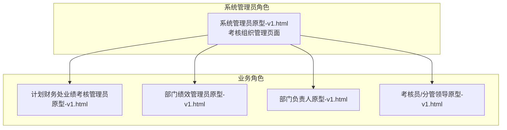
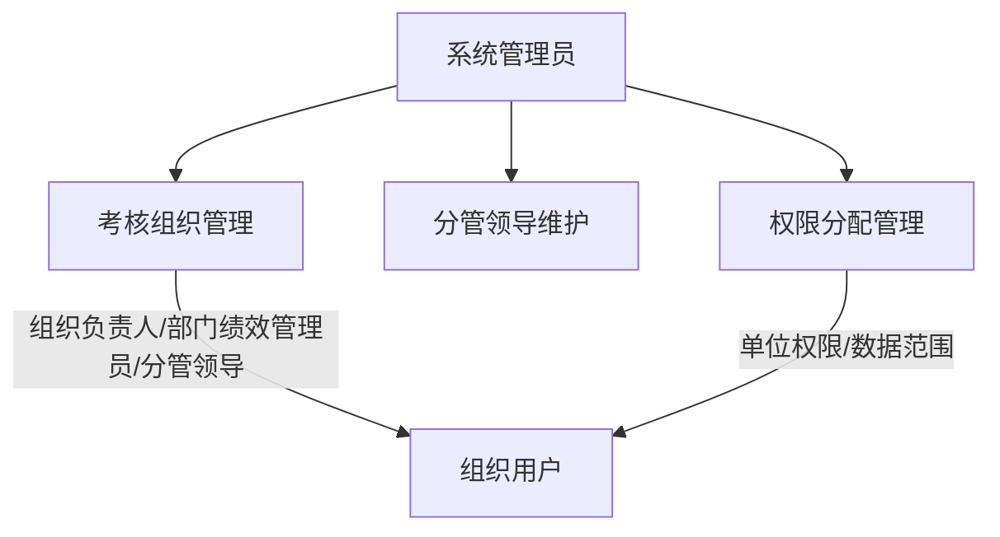
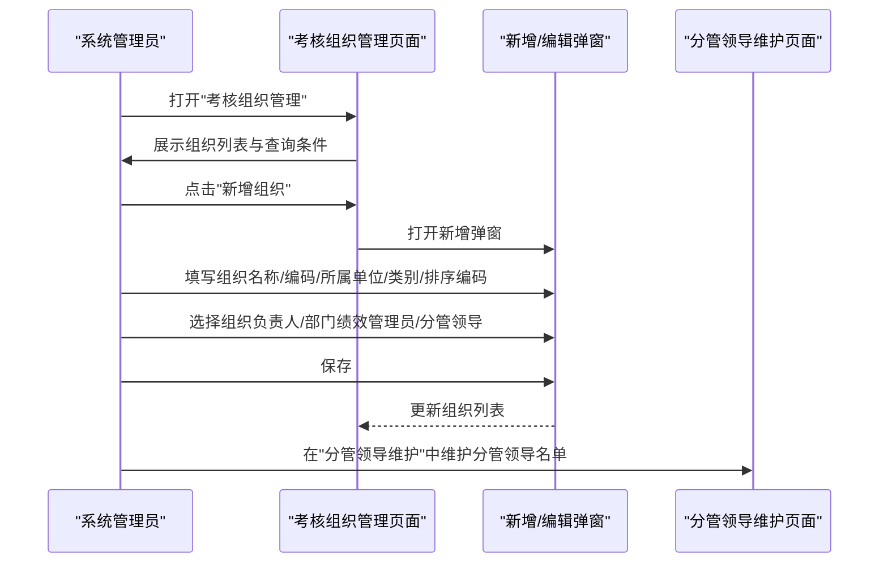
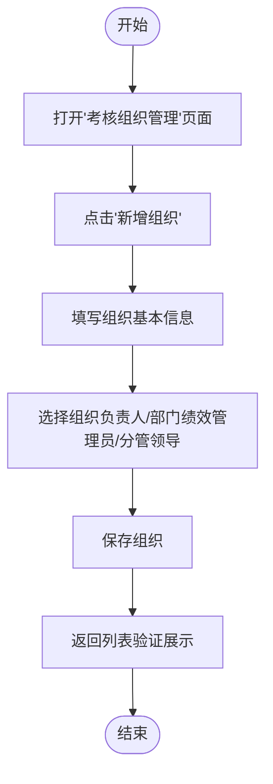
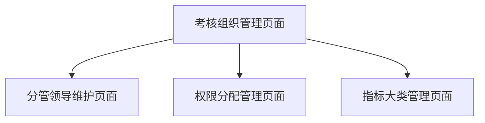

# 考核组织管理

<cite>
**本文档引用的文件**
- [系统管理员原型-v1.html](file://1-系统管理员原型-v1.html)
- [计划财务处业绩考核管理员原型-v1.html](file://2-计划财务处业绩考核管理员原型-v1.html)
- [部门绩效管理员原型-v1.html](file://3-部门绩效管理员原型-v1.html)
- [部门负责人原型-v1.html](file://4-部门负责人原型-v1.html)
- [考核员分管领导原型-v1.html](file://5-考核员分管领导原型-v1.html)
- [时序图-v1.html](file://6-时序图-v1.html)
</cite>

## 目录
1. [简介](#简介)
2. [项目结构](#项目结构)
3. [核心组件](#核心组件)
4. [架构概览](#架构概览)
5. [详细组件分析](#详细组件分析)
6. [依赖关系分析](#依赖关系分析)
7. [性能考虑](#性能考虑)
8. [故障排除指南](#故障排除指南)
9. [结论](#结论)
10. [附录](#附录)

## 简介
本指南面向考核组织管理功能，围绕系统管理员在"考核组织管理"页面中的操作展开，涵盖组织的新增、编辑、查看、删除等全生命周期管理，以及组织类型（职能部门、分公司等）的分类与管理方法。同时，详细说明组织负责人的职责与权限、部门绩效管理员的分配机制、组织配置流程（含组织负责人与分管领导的选择）、排序编码的作用与管理规则，并提供组织架构设计的最佳实践与常见配置场景。

## 项目结构
该项目采用多角色原型页面设计，围绕"月度业绩考核管理"主题，提供系统管理员、计划财务处业绩考核管理员、部门绩效管理员、部门负责人、考核员/分管领导等角色的界面原型。其中，系统管理员的"考核组织管理"页面是本次文档的核心入口。

**图表来源**
- [系统管理员原型-v1.html:417-446](file://1-系统管理员原型-v1.html#L417-L446)
- [计划财务处业绩考核管理员原型-v1.html:324-344](file://2-计划财务处业绩考核管理员原型-v1.html#L324-L344)
- [部门绩效管理员原型-v1.html:411-431](file://3-部门绩效管理员原型-v1.html#L411-L431)
- [部门负责人原型-v1.html:350-367](file://4-部门负责人原型-v1.html#L350-L367)
- [考核员分管领导原型-v1.html:196-227](file://5-考核员分管领导原型-v1.html#L196-L227)

**章节来源**
- [系统管理员原型-v1.html:417-446](file://1-系统管理员原型-v1.html#L417-L446)

## 核心组件
- 考核组织管理页面：系统管理员在此页面进行组织的新增、编辑、查看、删除；支持按组织名称、组织编码、所属单位、是否启用等条件查询；表格列包含组织名称、组织编码、所属单位、排序编码、组织类别、部门绩效管理员、组织负责人、分管领导等关键字段。
- 组织新增/编辑弹窗：提供组织名称、组织编码、所属单位、组织类别、排序编码、组织负责人、部门绩效管理员、分管领导、组织备注等字段，支持必填校验与选择交互。
- 分管领导维护页面：系统管理员可在此维护各单位的分管领导名单，避免数据选择录入错误。
- 权限分配管理页面：系统管理员可对人员进行权限下放与隔离，先选择人员，再分配系统权限和数据范围。

**章节来源**
- [系统管理员原型-v1.html:417-446](file://1-系统管理员原型-v1.html#L417-L446)
- [系统管理员原型-v1.html:575-588](file://1-系统管理员原型-v1.html#L575-L588)
- [系统管理员原型-v1.html:361-387](file://1-系统管理员原型-v1.html#L361-L387)
- [系统管理员原型-v1.html:389-415](file://1-系统管理员原型-v1.html#L389-L415)

## 架构概览
系统管理员作为最高权限角色，负责组织层面的基础配置与人员权限管理。组织管理与权限管理相互配合，确保不同角色在各自的数据范围内进行业务操作。

**图表来源**
- [系统管理员原型-v1.html:292-316](file://1-系统管理员原型-v1.html#L292-L316)
- [系统管理员原型-v1.html:417-446](file://1-系统管理员原型-v1.html#L417-L446)
- [系统管理员原型-v1.html:361-387](file://1-系统管理员原型-v1.html#L361-L387)
- [系统管理员原型-v1.html:389-415](file://1-系统管理员原型-v1.html#L389-L415)

## 详细组件分析

### 考核组织管理页面
- 页面入口：系统管理员侧边栏"系统设置"下的"考核配置"→"考核组织管理"。
- 功能清单：
  - 查询筛选：组织名称、组织编码、所属单位、是否启用。
  - 表格字段：序号、组织名称、组织编码、所属单位、排序编码、组织类别、部门绩效管理员、组织负责人、分管领导、操作（编辑、查看、删除）。
  - 操作按钮：新增组织、分页导航。
- 新增/编辑弹窗字段：
  - 基本信息：组织名称（必填）、组织编码、所属单位（必填）、组织类别（必填，职能部门/分公司/其他）。
  - 排序编码：用于组织排序与展示顺序。
  - 负责人与管理员：组织负责人、部门绩效管理员（可多选）、分管领导（可多选）。
  - 备注信息：文本域，便于补充说明。
- 删除操作：表格中提供删除按钮，删除前建议确认是否影响关联的考核流程与权限配置。

**图表来源**
- [系统管理员原型-v1.html:417-446](file://1-系统管理员原型-v1.html#L417-L446)
- [系统管理员原型-v1.html:575-588](file://1-系统管理员原型-v1.html#L575-L588)
- [系统管理员原型-v1.html:361-387](file://1-系统管理员原型-v1.html#L361-L387)

**章节来源**
- [系统管理员原型-v1.html:417-446](file://1-系统管理员原型-v1.html#L417-L446)
- [系统管理员原型-v1.html:575-588](file://1-系统管理员原型-v1.html#L575-L588)

### 组织类型与分类管理
- 组织类别字段：职能部门、分公司、其他。
- 管理方法：
  - 新增组织时选择组织类别，确保后续权限与流程适配正确。
  - 编辑组织时可变更类别，但需评估对现有权限与流程的影响。
  - 不同类别在指标大类、权重、适用范围等方面可能存在差异，建议结合"指标大类管理"页面进行统一配置。

**章节来源**
- [系统管理员原型-v1.html:575-588](file://1-系统管理员原型-v1.html#L575-L588)

### 组织负责人职责与权限
- 职责定位：组织负责人通常为部门主要负责人，负责组织内的指标审批、结果查看、流程推进等关键环节。
- 权限范围：在组织管理中，组织负责人字段用于标识该组织的负责人，系统可据此进行流程审批与结果查看的权限控制。
- 选择方法：在新增/编辑弹窗中，通过"选择人员"交互为组织负责人赋值。

**章节来源**
- [系统管理员原型-v1.html:575-588](file://1-系统管理员原型-v1.html#L575-L588)

### 部门绩效管理员分配机制
- 角色定义：部门绩效管理员是部门内部的联络员，负责组织内指标设定、自评、他评等日常事务。
- 分配方式：在组织管理页面的表格中，部门绩效管理员以人员列表形式展示；在新增/编辑弹窗中，通过"选择"交互为组织分配一个或多个部门绩效管理员。
- 权限联动：部门绩效管理员的权限与所属组织绑定，系统管理员可在"权限分配管理"页面进一步细化其数据范围。

**章节来源**
- [系统管理员原型-v1.html:417-446](file://1-系统管理员原型-v1.html#L417-L446)
- [系统管理员原型-v1.html:575-588](file://1-系统管理员原型-v1.html#L575-L588)
- [系统管理员原型-v1.html:389-415](file://1-系统管理员原型-v1.html#L389-L415)

### 分管领导维护与选择
- 分管领导作用：分管领导负责对部门指标进行审批与监督，是组织管理流程中的关键审批节点。
- 维护方式：系统管理员在"分管领导维护"页面中，按所属单位与领导姓名进行查询与维护，避免数据选择录入错误。
- 选择方法：在组织管理的新增/编辑弹窗中，通过"选择"交互为组织分配分管领导。

**章节来源**
- [系统管理员原型-v1.html:361-387](file://1-系统管理员原型-v1.html#L361-L387)
- [系统管理员原型-v1.html:575-588](file://1-系统管理员原型-v1.html#L575-L588)

### 组织配置流程（含负责人与分管领导）
- 步骤一：打开"考核组织管理"页面，点击"新增组织"。
- 步骤二：填写组织基本信息（名称、编码、所属单位、类别、排序编码）。
- 步骤三：选择组织负责人、部门绩效管理员、分管领导。
- 步骤四：保存并返回列表，确认展示正常。
- 步骤五：如需调整，进入编辑模式修改相应字段；如需变更分管领导，前往"分管领导维护"页面进行维护。

**图表来源**
- [系统管理员原型-v1.html:417-446](file://1-系统管理员原型-v1.html#L417-L446)
- [系统管理员原型-v1.html:575-588](file://1-系统管理员原型-v1.html#L575-L588)

**章节来源**
- [系统管理员原型-v1.html:417-446](file://1-系统管理员原型-v1.html#L417-L446)
- [系统管理员原型-v1.html:575-588](file://1-系统管理员原型-v1.html#L575-L588)

### 排序编码的作用与管理规则
- 作用：排序编码用于组织在列表中的排序与展示顺序，确保组织层级清晰、检索便捷。
- 管理规则：
  - 新增组织时填写排序编码，建议使用数字序列（如01、02、03）。
  - 编辑组织时可调整排序编码，避免重复与冲突。
  - 排序编码与组织类别、所属单位共同决定组织在系统中的呈现顺序。

**章节来源**
- [系统管理员原型-v1.html:417-446](file://1-系统管理员原型-v1.html#L417-L446)
- [系统管理员原型-v1.html:575-588](file://1-系统管理员原型-v1.html#L575-L588)

### 组织架构设计最佳实践
- 明确组织类型：根据业务需要合理划分职能部门与分公司，避免过度细分导致管理复杂。
- 清晰职责边界：组织负责人、部门绩效管理员、分管领导的职责应明确，避免职责交叉引发流程阻塞。
- 合理使用排序编码：采用统一的编码规则，便于系统排序与人工检索。
- 及时维护分管领导：确保分管领导名单准确，避免审批流程中断。
- 权限最小化：在"权限分配管理"页面按需分配单位权限与数据范围，遵循最小权限原则。

**章节来源**
- [系统管理员原型-v1.html:361-387](file://1-系统管理员原型-v1.html#L361-L387)
- [系统管理员原型-v1.html:389-415](file://1-系统管理员原型-v1.html#L389-L415)

### 常见配置场景
- 场景一：新增职能部门
  - 选择组织类别为"职能部门"，填写排序编码，分配组织负责人与部门绩效管理员，必要时配置分管领导。
- 场景二：新增分公司
  - 选择组织类别为"分公司"，填写排序编码，分配组织负责人与部门绩效管理员，维护分管领导名单。
- 场景三：调整组织负责人
  - 进入编辑模式，更换组织负责人字段，确保流程审批与结果查看权限正常。
- 场景四：批量维护分管领导
  - 在"分管领导维护"页面按所属单位批量维护，减少录入错误。

**章节来源**
- [系统管理员原型-v1.html:417-446](file://1-系统管理员原型-v1.html#L417-L446)
- [系统管理员原型-v1.html:361-387](file://1-系统管理员原型-v1.html#L361-L387)

## 依赖关系分析
- 考核组织管理页面依赖于"分管领导维护"页面提供的分管领导名单，确保组织配置的准确性。
- 权限分配管理页面与考核组织管理页面协同，通过"单位权限/数据范围"控制各角色在组织内的操作范围。
- 指标大类管理页面与组织管理页面在组织类别上形成关联，不同类别可能对应不同的指标大类与权重配置。

**图表来源**
- [系统管理员原型-v1.html:417-446](file://1-系统管理员原型-v1.html#L417-L446)
- [系统管理员原型-v1.html:361-387](file://1-系统管理员原型-v1.html#L361-L387)
- [系统管理员原型-v1.html:389-415](file://1-系统管理员原型-v1.html#L389-L415)

**章节来源**
- [系统管理员原型-v1.html:417-446](file://1-系统管理员原型-v1.html#L417-L446)
- [系统管理员原型-v1.html:361-387](file://1-系统管理员原型-v1.html#L361-L387)
- [系统管理员原型-v1.html:389-415](file://1-系统管理员原型-v1.html#L389-L415)

## 性能考虑
- 列表查询优化：建议在组织列表查询时增加索引字段（组织名称、组织编码、所属单位），提升查询效率。
- 弹窗交互优化：在新增/编辑弹窗中，对人员选择采用异步搜索与缓存策略，减少加载时间。
- 分页与分段加载：对于大型组织规模，建议采用分页与分段加载策略，避免一次性渲染过多数据。

## 故障排除指南
- 症状：组织负责人或部门绩效管理员无法在流程中看到相关操作
  - 排查：确认组织负责人与部门绩效管理员字段是否正确填写；检查"权限分配管理"页面中的单位权限与数据范围是否正确。
- 症状：分管领导选择异常或无法选择
  - 排查：前往"分管领导维护"页面确认分管领导名单是否维护正确；检查所属单位与领导姓名的匹配关系。
- 症状：排序编码重复或冲突
  - 排查：在组织列表中检查排序编码重复情况，统一调整编码规则并重新保存。

**章节来源**
- [系统管理员原型-v1.html:361-387](file://1-系统管理员原型-v1.html#L361-L387)
- [系统管理员原型-v1.html:389-415](file://1-系统管理员原型-v1.html#L389-L415)
- [系统管理员原型-v1.html:417-446](file://1-系统管理员原型-v1.html#L417-L446)

## 结论
考核组织管理是月度业绩考核系统的基础配置环节。系统管理员通过"考核组织管理"页面，可以高效地完成组织的新增、编辑、查看与删除，并通过组织负责人、部门绩效管理员与分管领导的合理配置，确保考核流程的顺畅运行。结合"分管领导维护"与"权限分配管理"页面，能够实现对组织与人员的精细化管理，提升系统的可维护性与业务适配性。

## 附录
- 相关角色原型页面：
  - 计划财务处业绩考核管理员原型
  - 部门绩效管理员原型
  - 部门负责人原型
  - 考核员/分管领导原型
- 流程时序参考：业绩指标设定时序图与月度业绩考核时序图，有助于理解组织配置在整个考核流程中的位置与作用。

**章节来源**
- [计划财务处业绩考核管理员原型-v1.html:324-344](file://2-计划财务处业绩考核管理员原型-v1.html#L324-L344)
- [部门绩效管理员原型-v1.html:411-431](file://3-部门绩效管理员原型-v1.html#L411-L431)
- [部门负责人原型-v1.html:350-367](file://4-部门负责人原型-v1.html#L350-L367)
- [考核员分管领导原型-v1.html:196-227](file://5-考核员分管领导原型-v1.html#L196-L227)
- [时序图-v1.html:112-298](file://6-时序图-v1.html#L112-L298)
- [时序图-v1.html:301-556](file://6-时序图-v1.html#L301-L556)