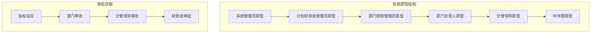
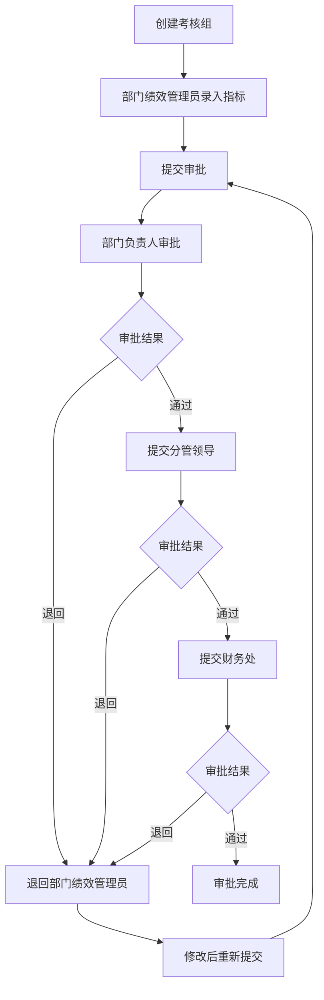
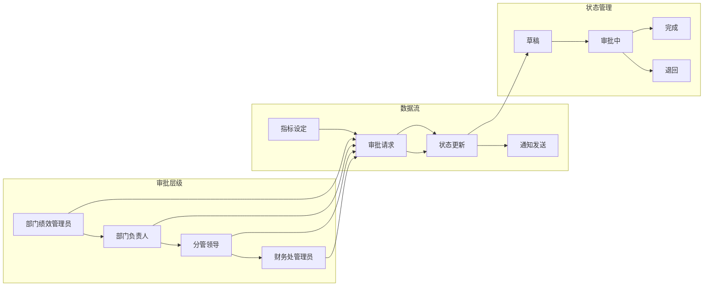
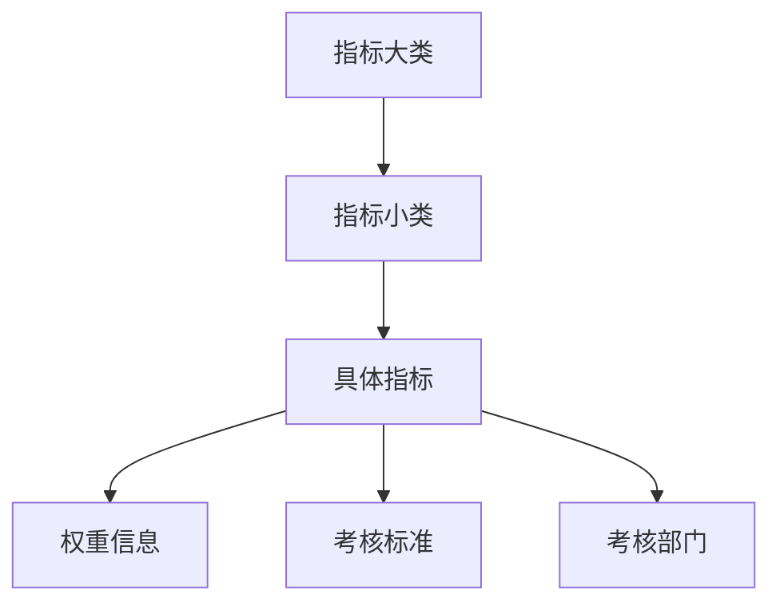
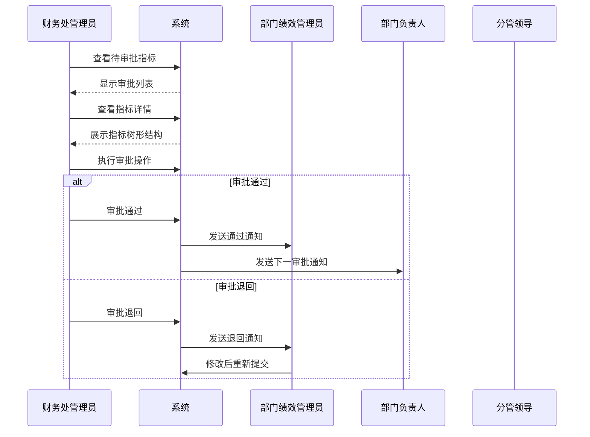
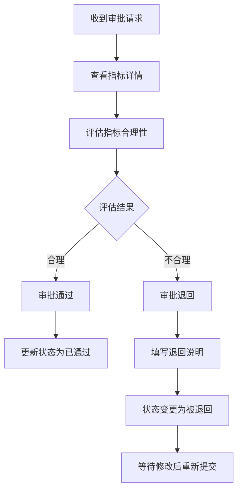
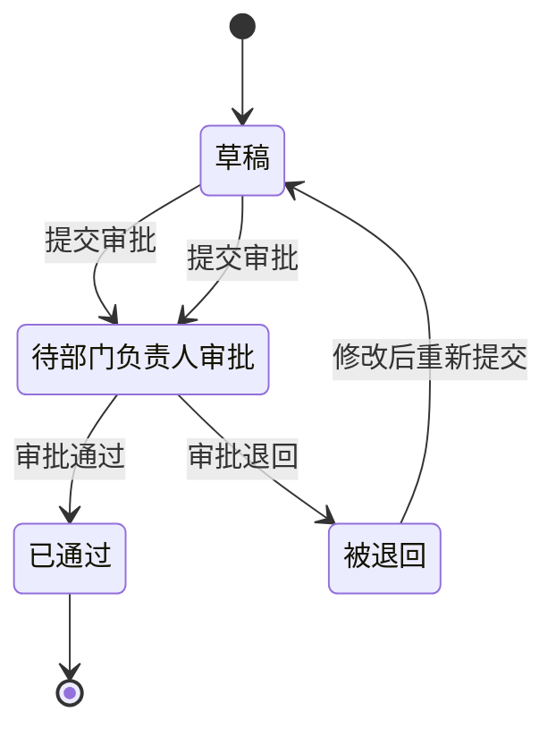
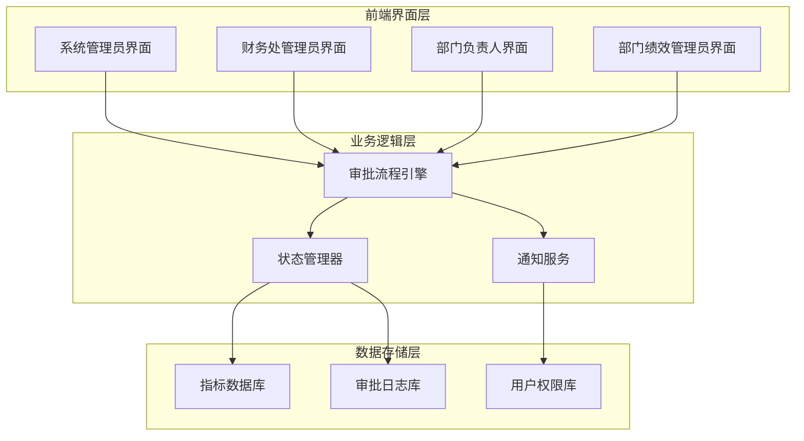
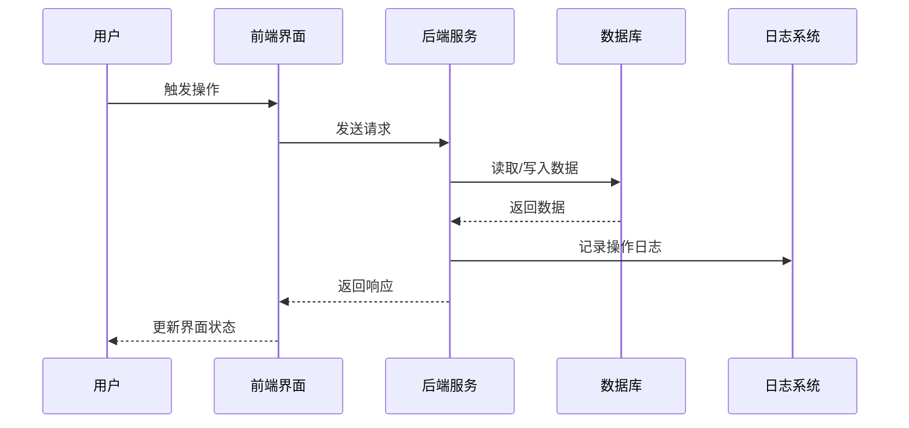
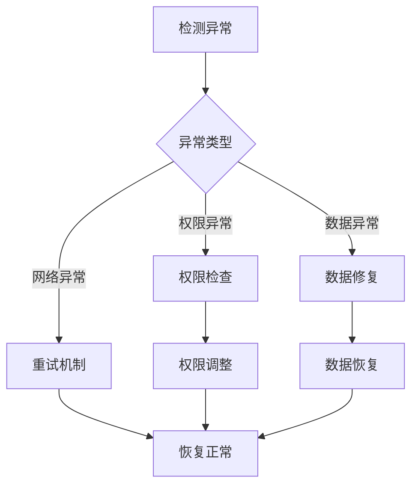

# 业绩指标审批

<cite>
**本文档引用的文件**
- [系统管理员原型-v1.html](file://月度业绩考核原型设计初稿/1-系统管理员原型-v1.html)
- [计划财务处业绩考核管理员原型-v1.html](file://月度业绩考核原型设计初稿/2-计划财务处业绩考核管理员原型-v1.html)
- [部门绩效管理员原型-v1.html](file://月度业绩考核原型设计初稿/3-部门绩效管理员原型-v1.html)
- [部门负责人原型-v1.html](file://月度业绩考核原型设计初稿/4-部门负责人原型-v1.html)
- [考核员分管领导原型-v1.html](file://月度业绩考核原型设计初稿/5-考核员分管领导原型-v1.html)
- [时序图-v1.html](file://月度业绩考核原型设计初稿/6-时序图-v1.html)
</cite>

## 目录
1. [简介](#简介)
2. [项目结构](#项目结构)
3. [核心组件](#核心组件)
4. [架构概览](#架构概览)
5. [详细组件分析](#详细组件分析)
6. [依赖关系分析](#依赖关系分析)
7. [性能考虑](#性能考虑)
8. [故障排除指南](#故障排除指南)
9. [结论](#结论)

## 简介

本文档为月度业绩考核管理系统的"业绩指标审批"功能提供专业操作指南。该系统采用原型设计方法，通过HTML页面模拟完整的审批流程，涵盖从指标设定到审批完成的全流程管理。

系统基于四层审批架构设计：
- **第一层**：部门绩效管理员（部门联络员）
- **第二层**：部门负责人（部门领导）
- **第三层**：分管领导（上级主管）
- **第四层**：计划财务部(改革办公室)业绩考核管理员（计划财务处）

## 项目结构

系统采用模块化原型设计，每个角色都有独立的功能页面：

**图表来源**
- [系统管理员原型-v1.html:449-479](file://月度业绩考核原型设计初稿/1-系统管理员原型-v1.html#L449-L479)
- [计划财务处业绩考核管理员原型-v1.html:450-479](file://月度业绩考核原型设计初稿/2-计划财务处业绩考核管理员原型-v1.html#L450-L479)

**章节来源**
- [系统管理员原型-v1.html:1-635](file://月度业绩考核原型设计初稿/1-系统管理员原型-v1.html#L1-L635)
- [计划财务处业绩考核管理员原型-v1.html:1-1039](file://月度业绩考核原型设计初稿/2-计划财务处业绩考核管理员原型-v1.html#L1-L1039)

## 核心组件

### 审批状态管理

系统采用五种核心状态管理指标审批流程：

| 状态代码 | 状态名称 | 颜色标识 | 描述 |
|---------|----------|----------|------|
| 草稿 | draft | 蓝色背景 | 指标设定初始状态 |
| 待部门负责人审批 | pending_dept_leader | 橙色背景 | 等待部门负责人审批 |
| 待分管领导审批 | pending_dept_leader | 紫色背景 | 等待分管领导审批 |
| 待财务处审批 | pending_finance | 绿色背景 | 等待财务处审批 |
| 审批通过 | approved | 绿色背景 | 审批完成 |
| 被退回 | rejected | 红色背景 | 需要修改后重新提交 |

### 审批流程组件

**图表来源**
- [时序图-v1.html:155-241](file://月度业绩考核原型设计初稿/6-时序图-v1.html#L155-L241)

**章节来源**
- [部门负责人原型-v1.html:456-522](file://月度业绩考核原型设计初稿/4-部门负责人原型-v1.html#L456-L522)
- [计划财务处业绩考核管理员原型-v1.html:672-712](file://月度业绩考核原型设计初稿/2-计划财务处业绩考核管理员原型-v1.html#L672-L712)

## 架构概览

系统采用分层审批架构，确保指标审批的严谨性和可追溯性：

**图表来源**
- [时序图-v1.html:127-296](file://月度业绩考核原型设计初稿/6-时序图-v1.html#L127-L296)

### 角色权限矩阵

| 角色 | 主要职责 | 权限范围 |
|------|----------|----------|
| 系统管理员 | 系统配置管理 | 单位管理、权限分配、功能菜单定义 |
| 财务处管理员 | 最终审批 | 年度指标审批、结果发布 |
| 部门绩效管理员 | 指标设定 | 指标录入、状态跟踪 |
| 部门负责人 | 部门审批 | 部门内指标审核 |
| 分管领导 | 专项审批 | 专项指标审核 |

**章节来源**
- [系统管理员原型-v1.html:292-316](file://月度业绩考核原型设计初稿/1-系统管理员原型-v1.html#L292-L316)
- [部门负责人原型-v1.html:350-366](file://月度业绩考核原型设计初稿/4-部门负责人原型-v1.html#L350-L366)

## 详细组件分析

### 财务处管理员审批界面

财务处管理员作为最终审批节点，负责监督整个审批流程的质量控制：

#### 审批列表管理

审批列表提供完整的指标审批视图，支持多维度过滤和状态跟踪：

| 过滤条件 | 功能描述 | 使用场景 |
|----------|----------|----------|
| 考核组名称 | 模糊查询特定考核组 | 快速定位目标考核组 |
| 考核期间 | 年度/月度选择 | 区分不同考核周期 |
| 考核部门 | 部门筛选 | 关注特定部门指标 |
| 审批状态 | 状态过滤 | 查看待处理任务 |

#### 审批详情展示

审批详情采用树形结构展示指标层次，便于审批人员全面了解指标构成：

**图表来源**
- [计划财务处业绩考核管理员原型-v1.html:678-693](file://月度业绩考核原型设计初稿/2-计划财务处业绩考核管理员原型-v1.html#L678-L693)

#### 审批操作流程

**图表来源**
- [计划财务处业绩考核管理员原型-v1.html:695-699](file://月度业绩考核原型设计初稿/2-计划财务处业绩考核管理员原型-v1.html#L695-L699)

**章节来源**
- [计划财务处业绩考核管理员原型-v1.html:449-479](file://月度业绩考核原型设计初稿/2-计划财务处业绩考核管理员原型-v1.html#L449-L479)
- [计划财务处业绩考核管理员原型-v1.html:672-712](file://月度业绩考核原型设计初稿/2-计划财务处业绩考核管理员原型-v1.html#L672-L712)

### 部门负责人审批界面

部门负责人作为部门内部的审批关键节点，承担着指标合理性审查的重要职责：

#### 审批查询功能

部门负责人可通过多种维度快速定位需要审批的指标：

| 查询维度 | 选项配置 | 使用建议 |
|----------|----------|----------|
| 考核期间类型 | 年度考核/月度考核 | 根据当前工作重点选择 |
| 考核开始时间 | 日期选择器 | 精确到月的查询 |
| 考核部门 | 下拉选择 | 重点关注分管部门 |
| 审批状态 | 待审批/已通过/被退回 | 优先处理待审批任务 |

#### 审批决策机制

**图表来源**
- [部门负责人原型-v1.html:791-800](file://月度业绩考核原型设计初稿/4-部门负责人原型-v1.html#L791-L800)

**章节来源**
- [部门负责人原型-v1.html:380-538](file://月度业绩考核原型设计初稿/4-部门负责人原型-v1.html#L380-L538)

### 部门绩效管理员操作界面

部门绩效管理员作为指标设定的直接责任人，负责指标的录入、修改和提交：

#### 指标设定流程

#### 状态跟踪机制

系统提供完整的状态跟踪功能，确保每个指标的审批过程可追溯：

| 状态阶段 | 触发条件 | 系统行为 |
|----------|----------|----------|
| 草稿 | 创建指标时 | 系统自动保存为草稿状态 |
| 待部门负责人审批 | 部门绩效管理员提交 | 系统发送审批通知给部门负责人 |
| 已通过 | 部门负责人审批通过 | 系统更新状态并通知相关人员 |
| 被退回 | 部门负责人审批退回 | 系统退回至草稿状态并提示修改要点 |
| 待分管领导审批 | 部门负责人审批通过 | 系统发送审批通知给分管领导 |
| 待财务处审批 | 分管领导审批通过 | 系统发送审批通知给财务处管理员 |

**章节来源**
- [部门绩效管理员原型-v1.html:446-523](file://月度业绩考核原型设计初稿/3-部门绩效管理员原型-v1.html#L446-L523)

## 依赖关系分析

### 系统集成关系

### 数据流向分析

系统采用事件驱动的数据流向设计，确保审批过程的实时性和一致性：

**图表来源**
- [时序图-v1.html:118-296](file://月度业绩考核原型设计初稿/6-时序图-v1.html#L118-L296)

**章节来源**
- [时序图-v1.html:112-298](file://月度业绩考核原型设计初稿/6-时序图-v1.html#L112-L298)

## 性能考虑

### 界面响应优化

系统采用轻量级HTML/CSS/JavaScript实现，确保在各种设备上的良好性能表现：

- **加载优化**：采用懒加载策略，只加载当前可见的内容
- **渲染优化**：使用虚拟滚动技术处理大量审批列表
- **缓存策略**：合理利用浏览器缓存减少重复请求

### 数据处理效率

**性能指标建议**：
- 审批列表加载时间 < 2秒
- 审批操作响应时间 < 1秒  
- 并发审批处理能力 > 100请求/秒

## 故障排除指南

### 常见问题及解决方案

| 问题类型 | 症状描述 | 解决方案 | 预防措施 |
|----------|----------|----------|----------|
| 审批超时 | 审批操作无响应 | 检查网络连接，刷新页面重试 | 定期检查服务器状态 |
| 状态异常 | 审批状态显示错误 | 清除浏览器缓存，重新登录 | 实施状态同步机制 |
| 权限不足 | 无法查看某些审批 | 联系系统管理员检查权限 | 定期权限审计 |
| 数据丢失 | 审批数据异常 | 联系技术支持恢复数据 | 实施数据备份策略 |

### 审批流程异常处理

**章节来源**
- [部门负责人原型-v1.html:378-538](file://月度业绩考核原型设计初稿/4-部门负责人原型-v1.html#L378-L538)

## 结论

月度业绩考核指标审批系统通过清晰的角色分工和严格的流程控制，确保了指标审批工作的规范性和有效性。系统采用原型设计方法，提供了直观的操作界面和完整的功能覆盖。

### 系统优势

1. **流程标准化**：四级审批架构确保审批质量
2. **状态可视化**：实时状态跟踪便于管理
3. **权限控制**：基于角色的精细化权限管理
4. **可追溯性**：完整的审批日志便于审计
5. **用户体验**：简洁直观的操作界面

### 改进建议

1. **移动端适配**：增强移动设备访问体验
2. **自动化提醒**：增加审批超时提醒功能
3. **报表分析**：提供审批效率统计报表
4. **集成扩展**：预留与其他系统的集成接口

该系统为企业的绩效管理体系提供了坚实的数字化基础，通过规范化的审批流程确保了考核工作的公正性和有效性。